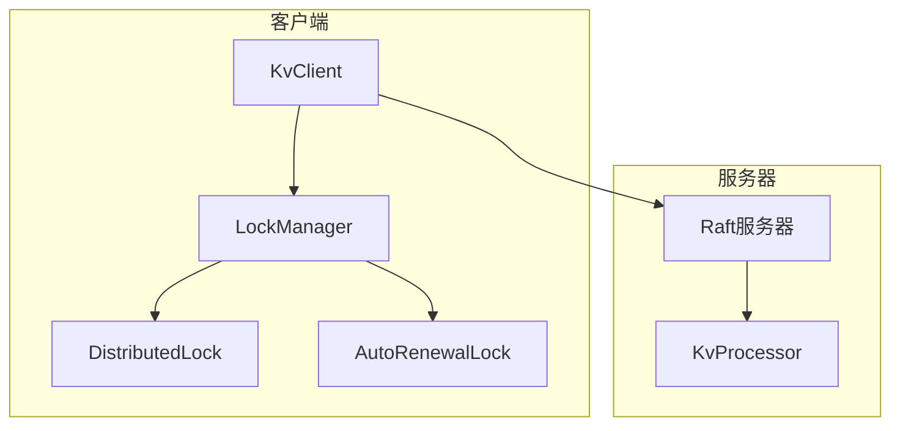
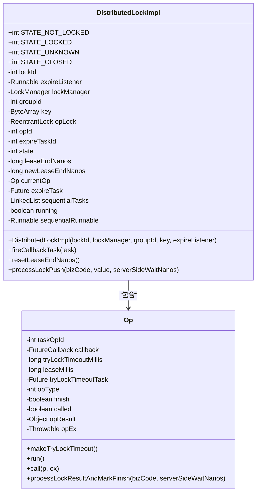
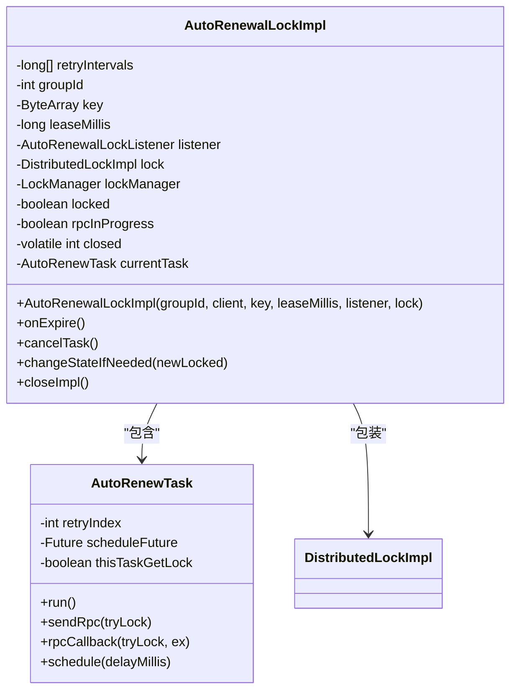
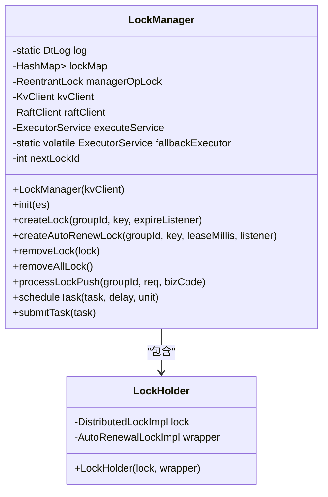
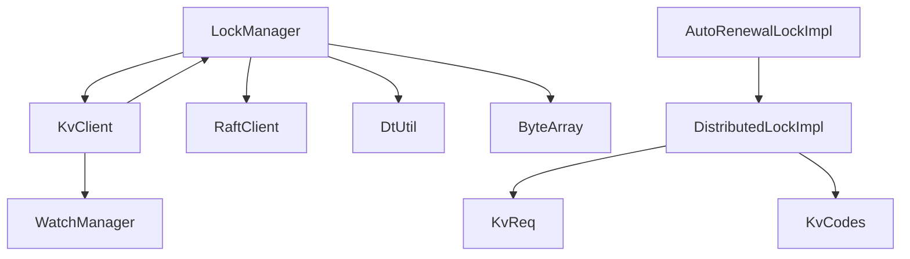

# 锁管理器

<cite>
**本文档中引用的文件**
- [LockManager.java](file://client/src/main/java/com/github/dtprj/dongting/dtkv/LockManager.java)
- [DistributedLock.java](file://client/src/main/java/com/github/dtprj/dongting/dtkv/DistributedLock.java)
- [DistributedLockImpl.java](file://client/src/main/java/com/github/dtprj/dongting/dtkv/DistributedLockImpl.java)
- [AutoRenewalLock.java](file://client/src/main/java/com/github/dtprj/dongting/dtkv/AutoRenewalLock.java)
- [AutoRenewalLockImpl.java](file://client/src/main/java/com/github/dtprj/dongting/dtkv/AutoRenewalLockImpl.java)
- [KvClient.java](file://client/src/main/java/com/github/dtprj/dongting/dtkv/KvClient.java)
- [KvCodes.java](file://client/src/main/java/com/github/dtprj/dongting/dtkv/KvCodes.java)
- [KvReq.java](file://client/src/main/java/com/github/dtprj/dongting/dtkv/KvReq.java)
</cite>

## 目录
1. [简介](#简介)
2. [核心组件](#核心组件)
3. [架构概述](#架构概述)
4. [详细组件分析](#详细组件分析)
5. [依赖分析](#依赖分析)
6. [性能考虑](#性能考虑)
7. [故障排除指南](#故障排除指南)
8. [结论](#结论)

## 简介
Dongting项目的锁管理器组件提供了一套完整的分布式锁解决方案，支持两种类型的锁：普通分布式锁和自动续期锁。该系统基于Raft共识算法构建，确保了锁操作的线性一致性。锁管理器通过KvClient与后端服务器通信，实现了可靠的分布式协调功能，适用于需要领导者选举和资源互斥访问的场景。

## 核心组件
锁管理器的核心组件包括LockManager、DistributedLock、AutoRenewalLock以及它们的实现类。LockManager负责管理所有锁实例的生命周期，维护锁的映射关系，并处理来自服务器的锁推送消息。DistributedLock接口定义了分布式锁的基本操作，如尝试获取锁、释放锁和更新租约。AutoRenewalLock则提供了自动续期功能，适用于领导者选举等需要持续持有锁的场景。

**Section sources**
- [LockManager.java](file://client/src/main/java/com/github/dtprj/dongting/dtkv/LockManager.java#L36-L241)
- [DistributedLock.java](file://client/src/main/java/com/github/dtprj/dongting/dtkv/DistributedLock.java#L31-L153)
- [AutoRenewalLock.java](file://client/src/main/java/com/github/dtprj/dongting/dtkv/AutoRenewalLock.java#L34-L68)

## 架构概述
锁管理器的架构基于客户端-服务器模型，通过Raft协议保证数据一致性。客户端通过KvClient与服务器通信，执行锁操作。LockManager作为锁的管理中心，负责创建、管理和销毁锁实例。每个锁实例都有独立的状态管理，确保操作的原子性和线程安全性。

**Diagram sources**
- [KvClient.java](file://client/src/main/java/com/github/dtprj/dongting/dtkv/KvClient.java#L51-L75)
- [LockManager.java](file://client/src/main/java/com/github/dtprj/dongting/dtkv/LockManager.java#L36-L241)

## 详细组件分析

### 分布式锁分析
DistributedLockImpl是分布式锁的具体实现，它管理锁的状态、租约时间和操作序列。锁的状态包括未锁定、已锁定、未知和已关闭四种。实现中使用了ReentrantLock来保证操作的线程安全，并通过Op内部类处理异步操作的回调。

**Diagram sources**
- [DistributedLockImpl.java](file://client/src/main/java/com/github/dtprj/dongting/dtkv/DistributedLockImpl.java#L45-L652)

**Section sources**
- [DistributedLockImpl.java](file://client/src/main/java/com/github/dtprj/dongting/dtkv/DistributedLockImpl.java#L45-L652)

### 自动续期锁分析
AutoRenewalLockImpl实现了自动续期锁的功能，它包装了一个DistributedLockImpl实例，并在其基础上添加了自动重试和续期的逻辑。当锁即将过期时，它会自动尝试续期；当锁被其他客户端持有时，它会按照配置的重试间隔不断尝试获取锁。

**Diagram sources**
- [AutoRenewalLockImpl.java](file://client/src/main/java/com/github/dtprj/dongting/dtkv/AutoRenewalLockImpl.java#L30-L228)

**Section sources**
- [AutoRenewalLockImpl.java](file://client/src/main/java/com/github/dtprj/dongting/dtkv/AutoRenewalLockImpl.java#L30-L228)

### 锁管理器分析
LockManager是锁的管理中心，负责创建、管理和销毁所有锁实例。它使用嵌套的HashMap结构来组织锁，以groupId和key作为复合键。管理器还维护了一个执行服务，用于处理异步任务，并提供了线程安全的操作机制。

**Diagram sources**
- [LockManager.java](file://client/src/main/java/com/github/dtprj/dongting/dtkv/LockManager.java#L36-L241)

**Section sources**
- [LockManager.java](file://client/src/main/java/com/github/dtprj/dongting/dtkv/LockManager.java#L36-L241)

## 依赖分析
锁管理器组件依赖于多个核心模块，包括KvClient用于与服务器通信，RaftClient提供共识算法支持，以及各种工具类如ByteArray、DtUtil等。这些依赖关系确保了锁管理器能够可靠地与后端系统交互，并提供高性能的分布式锁服务。

**Diagram sources**
- [KvClient.java](file://client/src/main/java/com/github/dtprj/dongting/dtkv/KvClient.java#L51-L75)
- [LockManager.java](file://client/src/main/java/com/github/dtprj/dongting/dtkv/LockManager.java#L36-L241)
- [DistributedLockImpl.java](file://client/src/main/java/com/github/dtprj/dongting/dtkv/DistributedLockImpl.java#L45-L652)

**Section sources**
- [KvClient.java](file://client/src/main/java/com/github/dtprj/dongting/dtkv/KvClient.java#L51-L75)
- [KvReq.java](file://client/src/main/java/com/github/dtprj/dongting/dtkv/KvReq.java#L33-L268)
- [KvCodes.java](file://client/src/main/java/com/github/dtprj/dongting/dtkv/KvCodes.java#L21-L119)

## 性能考虑
锁管理器在设计时充分考虑了性能因素。通过使用线程安全的数据结构和高效的同步机制，确保了高并发场景下的性能表现。异步操作的使用避免了线程阻塞，提高了系统的响应能力。此外，自动续期锁的重试策略采用了指数退避算法，既保证了快速恢复，又避免了对服务器造成过大压力。

## 故障排除指南
在使用锁管理器时，可能会遇到一些常见问题。例如，锁获取失败可能是由于网络问题或服务器过载导致。在这种情况下，应检查网络连接和服务器状态。锁续期失败可能是由于客户端与服务器之间的时间偏差过大，建议确保所有节点的时间同步。如果发现内存泄漏，应检查是否正确调用了锁的close方法。

**Section sources**
- [DistributedLockImpl.java](file://client/src/main/java/com/github/dtprj/dongting/dtkv/DistributedLockImpl.java#L45-L652)
- [AutoRenewalLockImpl.java](file://client/src/main/java/com/github/dtprj/dongting/dtkv/AutoRenewalLockImpl.java#L30-L228)

## 结论
Dongting项目的锁管理器提供了一套完整、可靠的分布式锁解决方案。通过精心设计的架构和实现，它能够满足各种分布式系统中的协调需求。无论是简单的资源互斥还是复杂的领导者选举，该锁管理器都能提供稳定、高效的服务。其模块化的设计也使得系统易于维护和扩展。