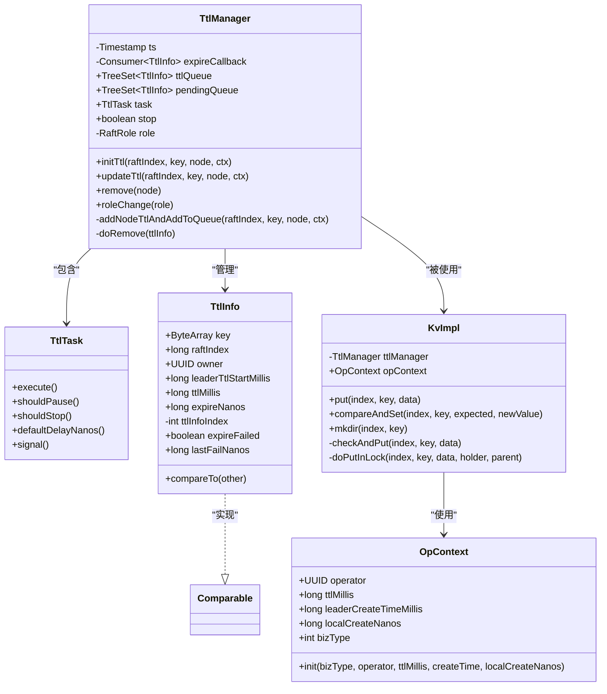
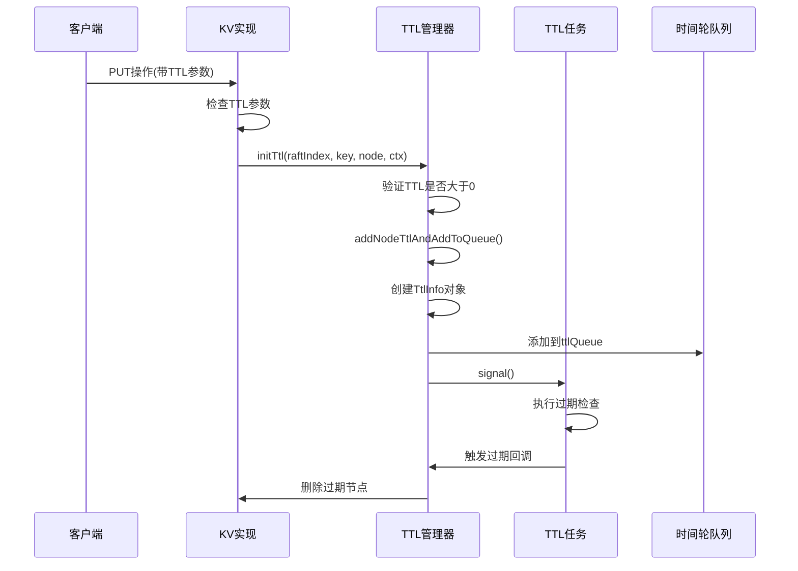
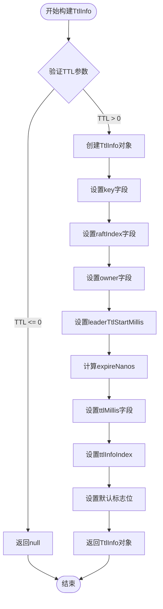
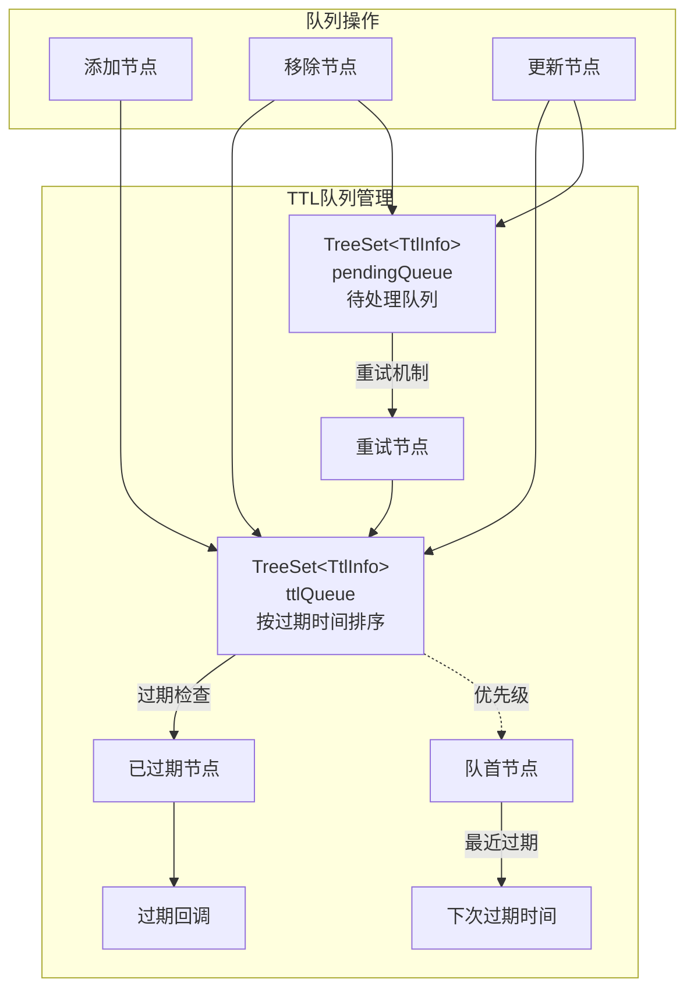
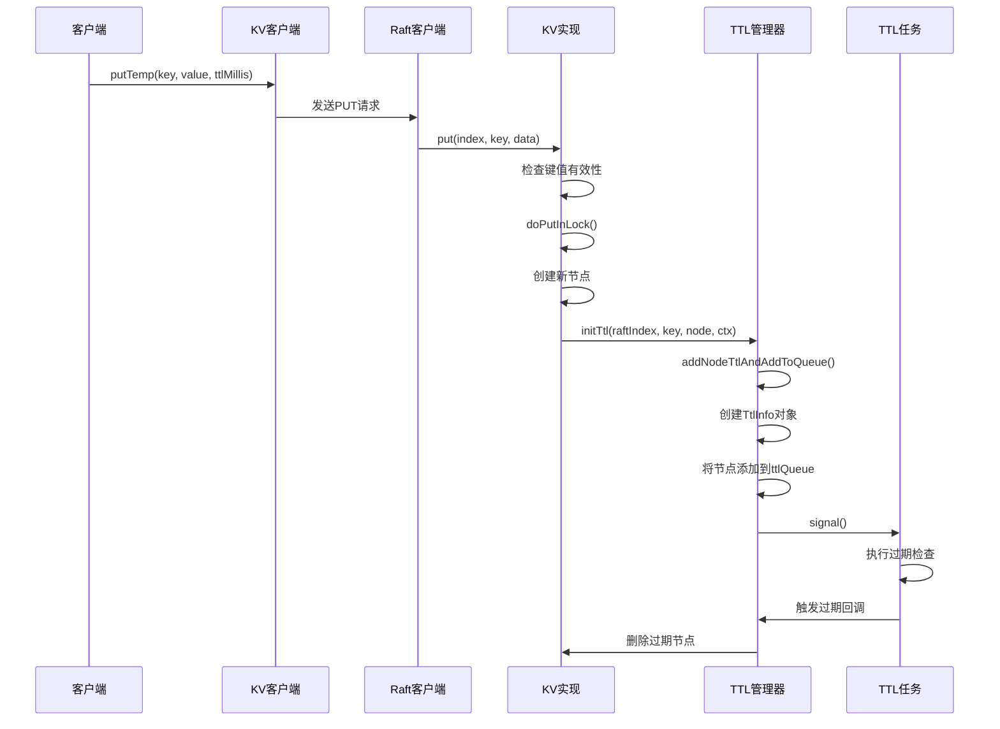
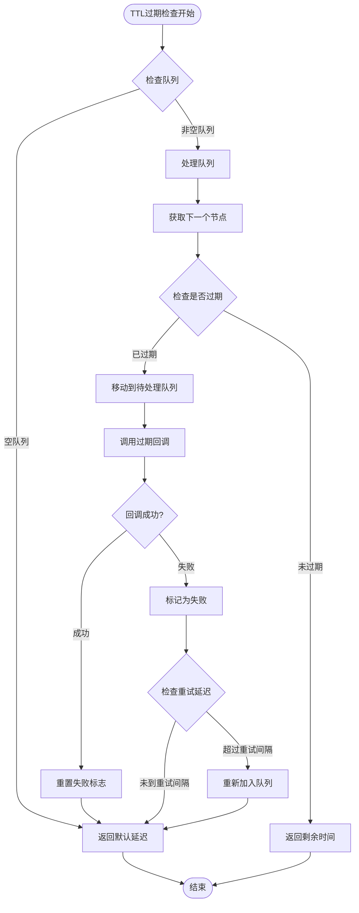

# TTL初始化机制详细说明

<cite>
**本文档引用的文件**
- [TtlManager.java](file://server/src/main/java/com/github/dtprj/dongting/dtkv/server/TtlManager.java)
- [KvImpl.java](file://server/src/main/java/com/github/dtprj/dongting/dtkv/server/KvImpl.java)
- [TtlManagerTest.java](file://server/src/test/java/com/github/dtprj/dongting/dtkv/server/TtlManagerTest.java)
- [TtlDemoClient.java](file://demos/src/main/java/com/github/dtprj/dongting/demos/ttl/TtlDemoClient.java)
</cite>

## 目录
1. [简介](#简介)
2. [核心组件架构](#核心组件架构)
3. [TTL初始化流程](#ttl初始化流程)
4. [TtlInfo对象构建过程](#ttlinfo对象构建过程)
5. [时间轮队列管理](#时间轮队列管理)
6. [完整调用链示例](#完整调用链示例)
7. [错误处理与重试机制](#错误处理与重试机制)
8. [性能考虑](#性能考虑)
9. [故障排除指南](#故障排除指南)
10. [总结](#总结)

## 简介

Dongting分布式键值存储系统实现了基于Raft共识算法的TTL（生存时间）机制，用于自动管理临时数据的过期删除。当客户端在PUT操作中指定TTL参数时，系统会为每个KV条目设置过期时间，并通过专门的TTL管理器进行生命周期管理。

TTL初始化机制的核心在于`initTtl`方法，它负责在节点创建时为KV条目设置过期时间，并将相关信息安全地添加到时间轮队列中进行后续处理。

## 核心组件架构



**图表来源**
- [TtlManager.java](file://server/src/main/java/com/github/dtprj/dongting/dtkv/server/TtlManager.java#L35-L242)
- [KvImpl.java](file://server/src/main/java/com/github/dtprj/dongting/dtkv/server/KvImpl.java#L35-L957)

## TTL初始化流程

TTL初始化的核心流程如下：



**图表来源**
- [KvImpl.java](file://server/src/main/java/com/github/dtprj/dongting/dtkv/server/KvImpl.java#L480-L520)
- [TtlManager.java](file://server/src/main/java/com/github/dtprj/dongting/dtkv/server/TtlManager.java#L115-L125)

**章节来源**
- [KvImpl.java](file://server/src/main/java/com/github/dtprj/dongting/dtkv/server/KvImpl.java#L480-L520)
- [TtlManager.java](file://server/src/main/java/com/github/dtprj/dongting/dtkv/server/TtlManager.java#L115-L125)

## TtlInfo对象构建过程

`TtlInfo`对象是TTL机制的核心数据结构，包含了所有必要的元数据来管理节点的生命周期：



**图表来源**
- [TtlManager.java](file://server/src/main/java/com/github/dtprj/dongting/dtkv/server/TtlManager.java#L155-L165)

### TtlInfo字段详解

1. **key**: 原始键名，用于唯一标识TTL管理的节点
2. **raftIndex**: Raft日志索引，确保操作的顺序性
3. **owner**: 操作者的UUID，用于权限验证
4. **leaderTtlStartMillis**: 领导者创建时间戳（毫秒）
5. **ttlMillis**: TTL持续时间（毫秒）
6. **expireNanos**: 过期时间戳（纳秒），基于本地时钟计算
7. **ttlInfoIndex**: 内部索引，用于解决时间冲突
8. **expireFailed**: 标记过期失败状态
9. **lastFailNanos**: 最后一次失败的时间戳

**章节来源**
- [TtlManager.java](file://server/src/main/java/com/github/dtprj/dongting/dtkv/server/TtlManager.java#L155-L165)
- [TtlManager.java](file://server/src/main/java/com/github/dtprj/dongting/dtkv/server/TtlManager.java#L215-L242)

## 时间轮队列管理

TTL管理器使用两个TreeSet来维护时间轮队列：



**图表来源**
- [TtlManager.java](file://server/src/main/java/com/github/dtprj/dongting/dtkv/server/TtlManager.java#L40-L45)

### 队列特性

1. **ttlQueue**: 存储待过期的节点，按过期时间升序排列
2. **pendingQueue**: 存储过期失败的节点，等待重试
3. **TreeSet**: 使用红黑树实现，保证O(log n)的插入和查找复杂度
4. **比较器**: 基于expireNanos排序，支持时间冲突处理

**章节来源**
- [TtlManager.java](file://server/src/main/java/com/github/dtprj/dongting/dtkv/server/TtlManager.java#L40-L45)

## 完整调用链示例

以下是一个完整的PUT操作触发TTL初始化的调用链：



**图表来源**
- [KvImpl.java](file://server/src/main/java/com/github/dtprj/dongting/dtkv/server/KvImpl.java#L480-L520)
- [TtlManager.java](file://server/src/main/java/com/github/dtprj/dongting/dtkv/server/TtlManager.java#L115-L125)

### 代码示例：PUT操作中的TTL初始化

在`KvImpl.doPutInLock`方法中，TTL初始化的触发点：

```java
// 在doPutInLock方法中
if (current == null || current.latest.removed) {
    // 创建新节点
    KvNodeEx newKvNode = new KvNodeEx(index, opContext.leaderCreateTimeMillis, 
            index, opContext.leaderCreateTimeMillis, flag, data);
    
    // 初始化TTL
    ttlManager.initTtl(index, current.key, newKvNode, opContext);
    
    // 其他操作...
}
```

**章节来源**
- [KvImpl.java](file://server/src/main/java/com/github/dtprj/dongting/dtkv/server/KvImpl.java#L480-L520)

## 错误处理与重试机制

TTL管理器实现了完善的错误处理和重试机制：



**图表来源**
- [TtlManager.java](file://server/src/main/java/com/github/dtprj/dongting/dtkv/server/TtlManager.java#L60-L105)

### 重试机制特点

1. **指数退避**: 失败后等待固定时间间隔（1秒）后重试
2. **批量处理**: 单次最多处理10个重试节点
3. **异常隔离**: 回调异常不会影响其他节点的处理
4. **状态跟踪**: 记录失败时间和状态以便监控

**章节来源**
- [TtlManager.java](file://server/src/main/java/com/github/dtprj/dongting/dtkv/server/TtlManager.java#L105-L115)

## 性能考虑

### 时间复杂度分析

1. **TTL初始化**: O(log n)，其中n为当前活跃节点数
2. **过期检查**: O(m)，其中m为待处理节点数（最多50个）
3. **队列操作**: O(log n)，TreeSet的插入和删除操作
4. **比较操作**: O(1)，TtlInfo的compareTo方法

### 内存使用优化

1. **延迟加载**: 只有在需要时才创建TtlInfo对象
2. **对象复用**: 重用TtlInfo对象避免频繁分配
3. **及时清理**: 过期节点及时从队列中移除
4. **批量处理**: 减少线程切换开销

### 并发安全性

1. **无锁设计**: 使用TreeSet的线程安全特性
2. **原子操作**: 关键状态变更使用CAS操作
3. **读写分离**: 读操作不阻塞写操作
4. **快照隔离**: 支持并发读取历史版本

## 故障排除指南

### 常见问题及解决方案

1. **TTL节点未过期**
   - 检查系统时钟同步
   - 验证TTL参数设置
   - 查看TtlInfo对象的状态

2. **过期回调失败**
   - 检查回调函数的异常处理
   - 验证节点状态的一致性
   - 查看重试计数和时间间隔

3. **队列积压**
   - 调整MAX_EXPIRE_BATCH大小
   - 检查回调函数的执行时间
   - 优化过期处理逻辑

4. **内存泄漏**
   - 监控TtlInfo对象的数量
   - 检查节点删除的完整性
   - 验证队列清理机制

**章节来源**
- [TtlManagerTest.java](file://server/src/test/java/com/github/dtprj/dongting/dtkv/server/TtlManagerTest.java#L82-L122)

## 总结

Dongting的TTL初始化机制通过精心设计的架构实现了高效、可靠的临时数据生命周期管理。核心特点包括：

1. **精确控制**: 基于Raft索引和时间戳的精确过期控制
2. **高可用**: 完善的错误处理和重试机制
3. **高性能**: 基于TreeSet的时间轮队列设计
4. **可扩展**: 支持大规模并发访问
5. **易维护**: 清晰的代码结构和完善的测试覆盖

该机制为分布式键值存储系统提供了可靠的临时数据管理能力，确保了系统的稳定性和数据的一致性。通过合理配置和监控，可以满足各种生产环境的需求。