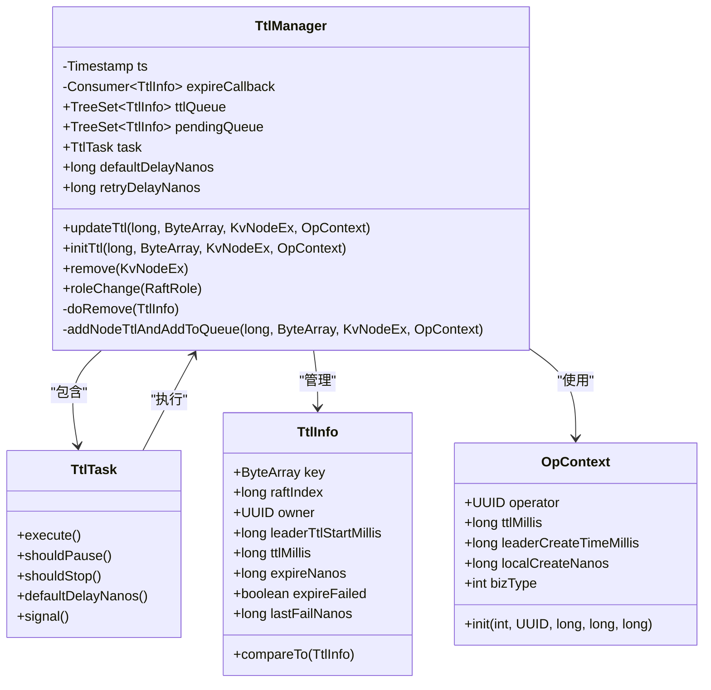
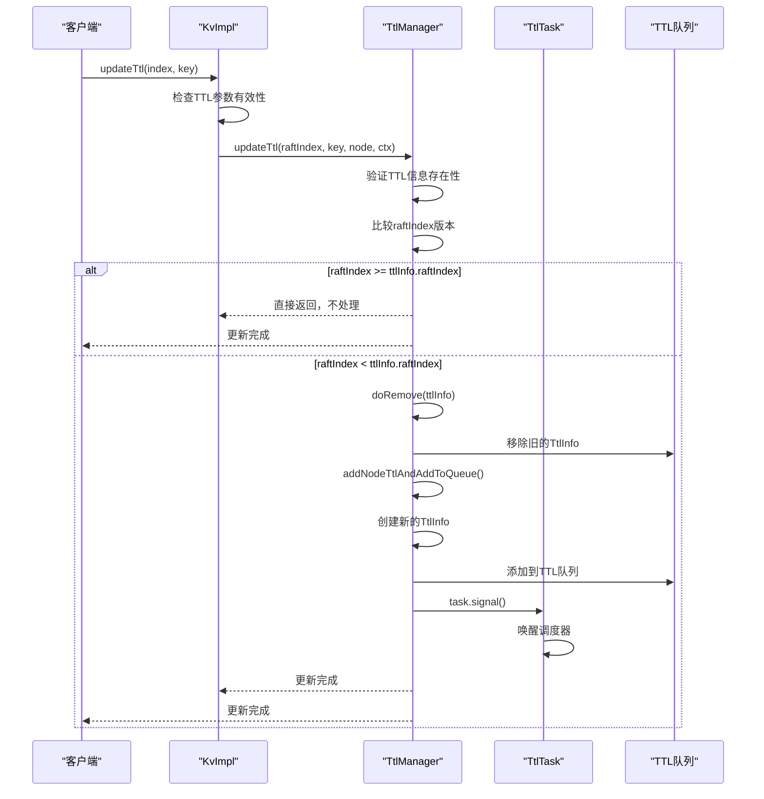
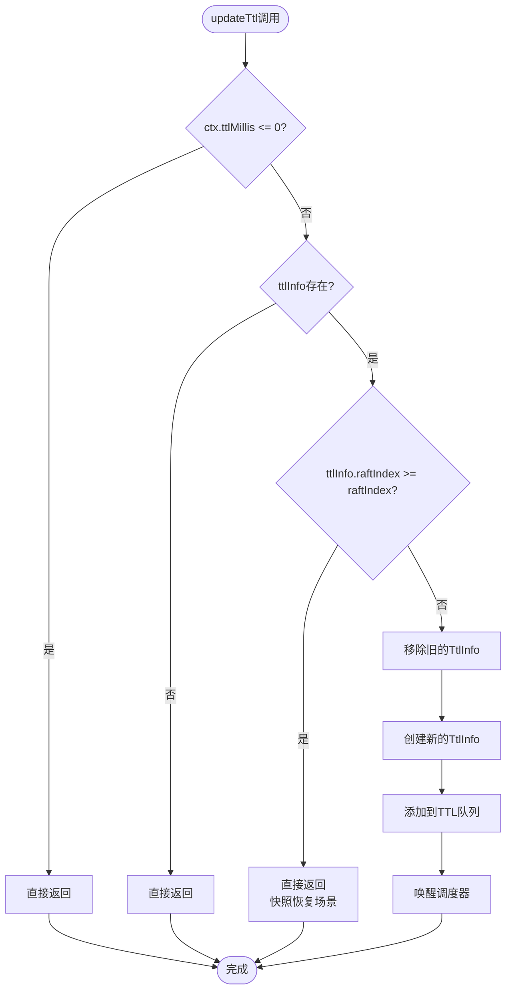
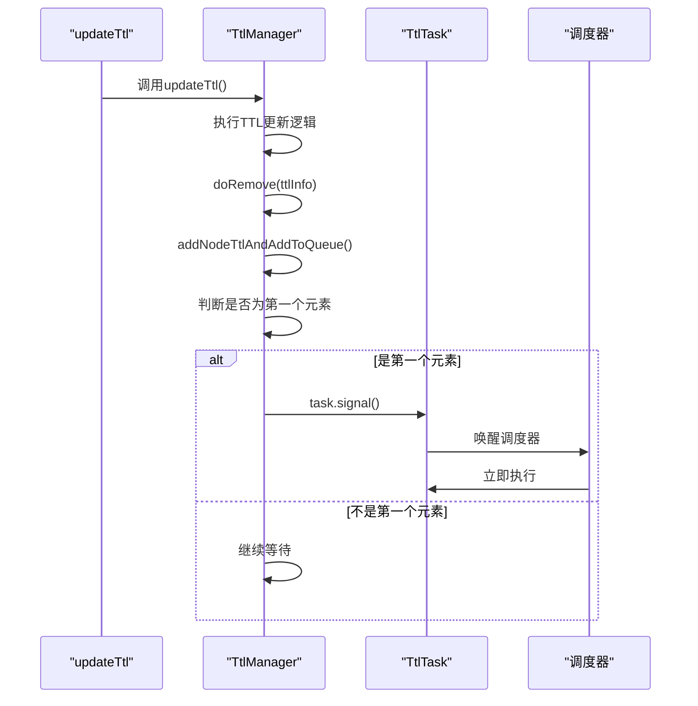
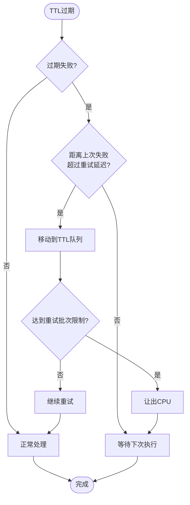

# TTL更新机制

<cite>
**本文档引用的文件**
- [TtlManager.java](file://server/src/main/java/com/github/dtprj/dongting/dtkv/server/TtlManager.java)
- [KvImpl.java](file://server/src/main/java/com/github/dtprj/dongting/dtkv/server/KvImpl.java)
- [TtlManagerTest.java](file://server/src/test/java/com/github/dtprj/dongting/dtkv/server/TtlManagerTest.java)
- [TtlDemoServer.java](file://demos/src/main/java/com/github/dtprj/dongting/demos/ttl/TtlDemoServer.java)
</cite>

## 目录
1. [简介](#简介)
2. [核心组件架构](#核心组件架构)
3. [TTL更新流程详解](#ttl更新流程详解)
4. [幂等性设计原则](#幂等性设计原则)
5. [快照恢复场景处理](#快照恢复场景处理)
6. [任务调度机制](#任务调度机制)
7. [性能优化策略](#性能优化策略)
8. [故障处理与重试](#故障处理与重试)
9. [总结](#总结)

## 简介

Dongting分布式键值存储系统中的TTL（生存时间）更新机制是一个关键的功能模块，负责管理临时节点的生命周期。该机制确保在节点过期时能够及时清理资源，同时支持动态更新节点的生存时间。本文档深入分析了`updateTtl`方法的实现细节，重点探讨其幂等性设计原则、快照恢复场景下的处理逻辑，以及如何安全地移除旧的TtlInfo并插入新的过期条目。

## 核心组件架构

TTL更新机制的核心组件包括以下关键类：



**图表来源**
- [TtlManager.java](file://server/src/main/java/com/github/dtprj/dongting/dtkv/server/TtlManager.java#L30-L242)
- [KvImpl.java](file://server/src/main/java/com/github/dtprj/dongting/dtkv/server/KvImpl.java#L337-L366)

**章节来源**
- [TtlManager.java](file://server/src/main/java/com/github/dtprj/dongting/dtkv/server/TtlManager.java#L30-L242)
- [KvImpl.java](file://server/src/main/java/com/github/dtprj/dongting/dtkv/server/KvImpl.java#L337-L366)

## TTL更新流程详解

### updateTtl方法的核心逻辑

`updateTtl`方法是TTL更新机制的核心入口，其实现体现了高度的幂等性和安全性：

```java
// this method should be idempotent
public void updateTtl(long raftIndex, ByteArray key, KvNodeEx newNode, KvImpl.OpContext ctx) {
    if (ctx.ttlMillis <= 0) {
        return;
    }
    TtlInfo ttlInfo = newNode.ttlInfo;
    if (ttlInfo == null) {
        return;
    }
    if (ttlInfo.raftIndex >= raftIndex) {
        // this occurs after install snapshot, since KvImpl.updateTtl/doPutInLock may not create new KvNodeEx, and
        // takeSnapshot may save newer ttlInfo than snapshot lastIncludedIndex.
        return;
    }
    doRemove(ttlInfo);
    if (addNodeTtlAndAddToQueue(raftIndex, key, newNode, ctx)) {
        task.signal();
    }
}
```

### 更新流程序列图



**图表来源**
- [TtlManager.java](file://server/src/main/java/com/github/dtprj/dongting/dtkv/server/TtlManager.java#L145-L179)
- [KvImpl.java](file://server/src/main/java/com/github/dtprj/dongting/dtkv/server/KvImpl.java#L780-L795)

**章节来源**
- [TtlManager.java](file://server/src/main/java/com/github/dtprj/dongting/dtkv/server/TtlManager.java#L145-L179)
- [KvImpl.java](file://server/src/main/java/com/github/dtprj/dongting/dtkv/server/KvImpl.java#L780-L795)

## 幂等性设计原则

### 幂等性的实现机制

TTL更新机制通过多个层面的设计确保了操作的幂等性：

1. **raftIndex版本控制**：通过比较`ttlInfo.raftIndex`和传入的`raftIndex`来防止重复处理
2. **空操作检查**：当`ctx.ttlMillis <= 0`或`tllInfo == null`时直接返回
3. **状态验证**：在执行任何修改前验证当前状态的有效性

```java
// 幂等性保护示例
if (ctx.ttlMillis <= 0) {
    return; // 空操作保护
}
TtlInfo ttlInfo = newNode.ttlInfo;
if (ttlInfo == null) {
    return; // 状态保护
}
if (ttlInfo.raftIndex >= raftIndex) {
    // 快照恢复场景保护：避免重复处理
    return;
}
```

### 幂等性测试验证

测试用例展示了幂等性的重要特性：

```java
@Test
void testUpdateTtl() {
    // 初始化TTL
    manager.initTtl(ver++, key, node, initCtx);
    assertEquals(5_000_000, manager.task.execute());
    
    // 多次更新相同的操作应该幂等
    manager.updateTtl(ver++, key, node, updateCtx);
    assertEquals(3, node.ttlInfo.ttlMillis);
    assertEquals(ts.nanoTime + 3_000_000L, node.ttlInfo.expireNanos);
    
    // 再次更新相同参数，结果应该不变
    manager.updateTtl(ver++, key, node, updateCtx);
    assertEquals(3, node.ttlInfo.ttlMillis); // 结果保持不变
}
```

**章节来源**
- [TtlManager.java](file://server/src/main/java/com/github/dtprj/dongting/dtkv/server/TtlManager.java#L145-L179)
- [TtlManagerTest.java](file://server/src/test/java/com/github/dtprj/dongting/dtkv/server/TtlManagerTest.java#L120-L154)

## 快照恢复场景处理

### 快照恢复问题的识别

在Raft共识算法中，快照恢复可能导致TTL信息的版本冲突。具体来说：

- `KvImpl.updateTtl/doPutInLock`可能不会创建新的`KvNodeEx`
- `takeSnapshot`可能保存比快照`lastIncludedIndex`更新的`ttlInfo`

### 版本控制机制

```java
if (ttlInfo.raftIndex >= raftIndex) {
    // 这种情况发生在安装快照之后，因为KvImpl.updateTtl/doPutInLock可能不会创建新的KvNodeEx，
    // 而且takeSnapshot可能保存比快照lastIncludedIndex更新的ttlInfo。
    return;
}
```

### 快照恢复场景的处理流程



**图表来源**
- [TtlManager.java](file://server/src/main/java/com/github/dtprj/dongting/dtkv/server/TtlManager.java#L145-L179)

**章节来源**
- [TtlManager.java](file://server/src/main/java/com/github/dtprj/dongting/dtkv/server/TtlManager.java#L145-L179)

## 任务调度机制

### TtlTask的执行逻辑

TTL任务调度器负责周期性地检查和处理过期的TTL条目：

```java
class TtlTask extends DtKVExecutor.DtKVExecutorTask {
    @Override
    protected long execute() {
        boolean yield = false;
        
        // 处理重试队列中的失败项
        if (!pendingQueue.isEmpty()) {
            Iterator<TtlInfo> it = pendingQueue.iterator();
            int count = 0;
            while (it.hasNext()) {
                TtlInfo ttlInfo = it.next();
                if (ttlInfo.expireFailed && 
                    ts.nanoTime - ttlInfo.lastFailNanos > retryDelayNanos) {
                    if (count++ >= MAX_RETRY_BATCH) {
                        yield = true;
                        break;
                    }
                    it.remove();
                    ttlQueue.add(ttlInfo);
                } else {
                    break;
                }
            }
        }
        
        // 处理TTL队列中的即将过期项
        if (!ttlQueue.isEmpty()) {
            Iterator<TtlInfo> it = ttlQueue.iterator();
            int count = 0;
            while (it.hasNext()) {
                if (count++ >= MAX_EXPIRE_BATCH) {
                    yield = true;
                    break;
                }
                TtlInfo ttlInfo = it.next();
                if (ttlInfo.expireNanos - ts.nanoTime > 0) {
                    return ttlInfo.expireNanos - ts.nanoTime;
                }
                it.remove();
                pendingQueue.add(ttlInfo);
                try {
                    ttlInfo.expireFailed = false;
                    ttlInfo.lastFailNanos = 0;
                    expireCallback.accept(ttlInfo);
                } catch (Throwable e) {
                    ttlInfo.expireFailed = true;
                    ttlInfo.lastFailNanos = ts.nanoTime;
                    BugLog.log(e);
                    return defaultDelayNanos();
                }
            }
        }
        
        return yield ? 0 : defaultDelayNanos();
    }
}
```

### task.signal()的作用机制

`task.signal()`调用在以下场景中被触发：

1. **新增TTL条目**：当`addNodeTtlAndAddToQueue`返回`true`时
2. **更新TTL条目**：当`updateTtl`成功移除旧条目并添加新条目时
3. **角色切换**：当`roleChange`方法被调用时

```java
private boolean addNodeTtlAndAddToQueue(long raftIndex, ByteArray key, 
                                       KvNodeEx n, KvImpl.OpContext ctx) {
    TtlInfo ttlInfo = new TtlInfo(key, raftIndex, ctx.operator, 
                                  ctx.leaderCreateTimeMillis, ctx.ttlMillis,
                                  ctx.localCreateNanos + ctx.ttlMillis * 1_000_000, 
                                  ttlInfoIndex++);
    n.ttlInfo = ttlInfo;

    // 确保不在TTL队列和待处理队列中
    if (!ttlQueue.add(ttlInfo)) {
        BugLog.getLog().error("TtlInfo exists {}, {}", key, ttlInfo.raftIndex);
    }
    return ttlQueue.first() == ttlInfo;
}
```

### 调度器唤醒流程



**图表来源**
- [TtlManager.java](file://server/src/main/java/com/github/dtprj/dongting/dtkv/server/TtlManager.java#L170-L179)

**章节来源**
- [TtlManager.java](file://server/src/main/java/com/github/dtprj/dongting/dtkv/server/TtlManager.java#L60-L120)
- [TtlManager.java](file://server/src/main/java/com/github/dtprj/dongting/dtkv/server/TtlManager.java#L170-L179)

## 性能优化策略

### 批处理机制

TTL管理器实现了多种批处理优化策略：

1. **最大重试批次限制**：`MAX_RETRY_BATCH = 10`
2. **最大过期批次限制**：`MAX_EXPIRE_BATCH = 50`
3. **延迟执行优化**：根据队列状态动态调整执行间隔

```java
static final int MAX_RETRY_BATCH = 10;
static final int MAX_EXPIRE_BATCH = 50;

long defaultDelayNanos = 1_000_000_000L; // 1秒
long retryDelayNanos = 1_000_000_000L; // 1秒
```

### 时间优先级排序

`TtlInfo`实现了基于过期时间和索引的复合排序：

```java
@Override
public int compareTo(TtlInfo o) {
    long x = this.expireNanos - o.expireNanos;
    if (x < 0) {
        return -1;
    } else if (x > 0) {
        return 1;
    } else {
        int y = this.ttlInfoIndex - o.ttlInfoIndex;
        return y < 0 ? -1 : y > 0 ? 1 : 0;
    }
}
```

### 内存优化策略

1. **TreeSet数据结构**：利用红黑树实现O(log n)的插入和删除操作
2. **索引字段**：使用`ttlInfoIndex`防止时间精度不足导致的重复
3. **批量处理**：避免频繁的单个操作开销

**章节来源**
- [TtlManager.java](file://server/src/main/java/com/github/dtprj/dongting/dtkv/server/TtlManager.java#L43-L58)
- [TtlManager.java](file://server/src/main/java/com/github/dtprj/dongting/dtkv/server/TtlManager.java#L220-L241)

## 故障处理与重试

### 错误状态管理

每个`TtlInfo`都维护了错误状态信息：

```java
boolean expireFailed;
long lastFailNanos;
```

### 重试机制

当TTL过期回调失败时，系统会自动进入重试队列：

```java
public void retry(TtlInfo ttlInfo, Throwable ex) {
    if (stop) {
        return;
    }
    ttlInfo.expireFailed = true;
    ttlInfo.lastFailNanos = ts.nanoTime;
    log.warn("expire failed: {}", ex.toString());
}
```

### 角色切换处理

在Raft角色切换时，系统会重新平衡队列：

```java
public void roleChange(RaftRole newRole) {
    try {
        role = newRole;
        ttlQueue.addAll(pendingQueue);
        pendingQueue.clear();
        task.signal();
    } catch (Throwable e) {
        BugLog.log(e);
    }
}
```

### 重试策略流程



**图表来源**
- [TtlManager.java](file://server/src/main/java/com/github/dtprj/dongting/dtkv/server/TtlManager.java#L120-L140)

**章节来源**
- [TtlManager.java](file://server/src/main/java/com/github/dtprj/dongting/dtkv/server/TtlManager.java#L120-L140)
- [TtlManager.java](file://server/src/main/java/com/github/dtprj/dongting/dtkv/server/TtlManager.java#L180-L190)

## 总结

Dongting的TTL更新机制展现了优秀的软件设计原则和工程实践：

### 关键设计亮点

1. **幂等性保证**：通过多层防护机制确保操作的幂等性
2. **版本控制**：巧妙利用raftIndex解决快照恢复场景的问题
3. **高效调度**：智能的任务调度和批处理机制
4. **容错能力**：完善的错误处理和重试机制
5. **性能优化**：多层次的性能优化策略

### 核心价值

- **可靠性**：在各种异常场景下都能保持系统的稳定运行
- **效率**：通过批处理和智能调度最大化系统吞吐量
- **可维护性**：清晰的代码结构和完善的测试覆盖
- **扩展性**：良好的设计模式便于未来的功能扩展

### 应用场景

该TTL更新机制特别适用于：
- 分布式缓存系统
- 临时数据管理
- 会话超时处理
- 定时任务调度

通过深入理解这些设计原理和实现细节，开发者可以更好地利用和扩展Dongting系统的TTL功能，构建更加健壮和高效的分布式应用。