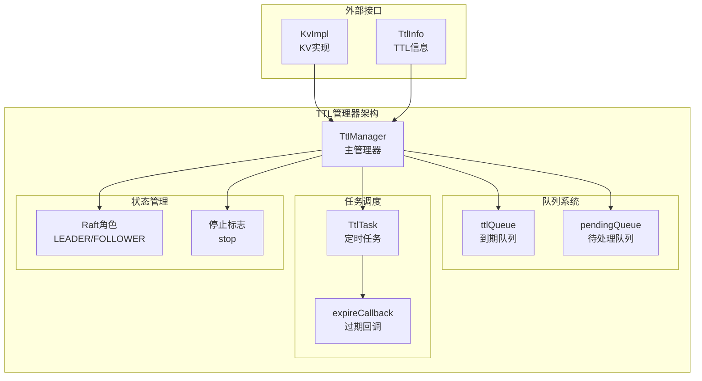
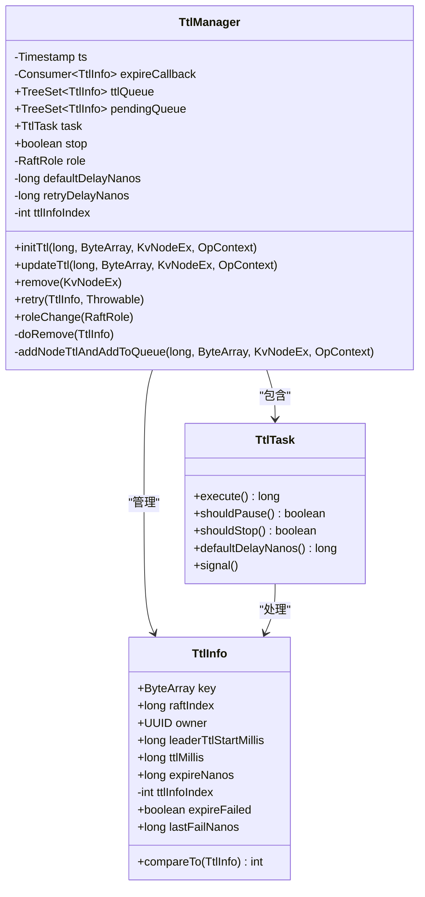
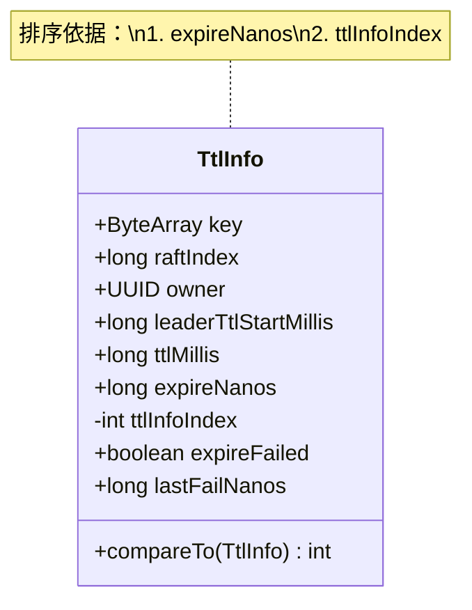
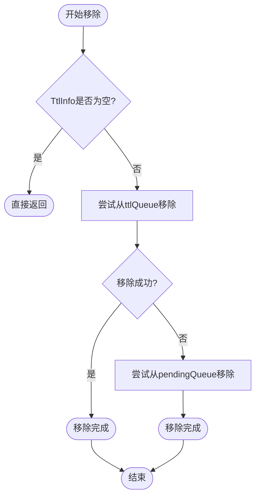
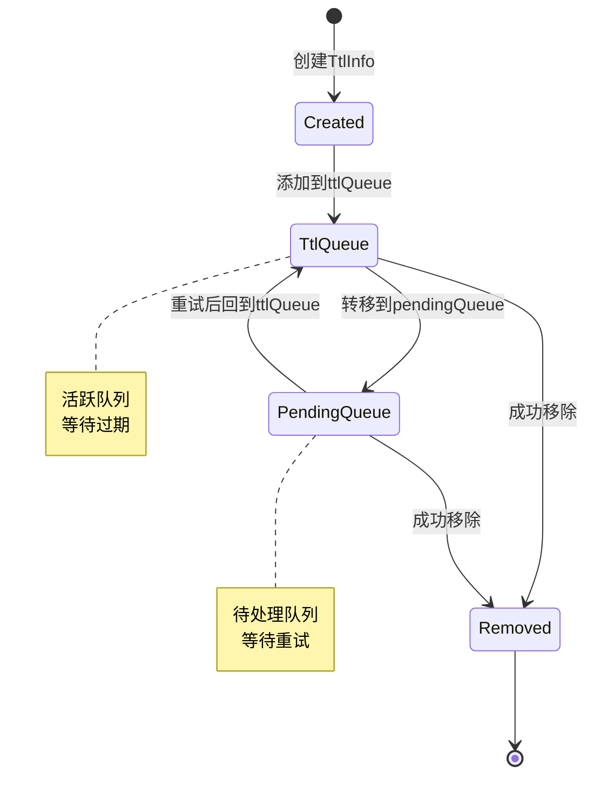
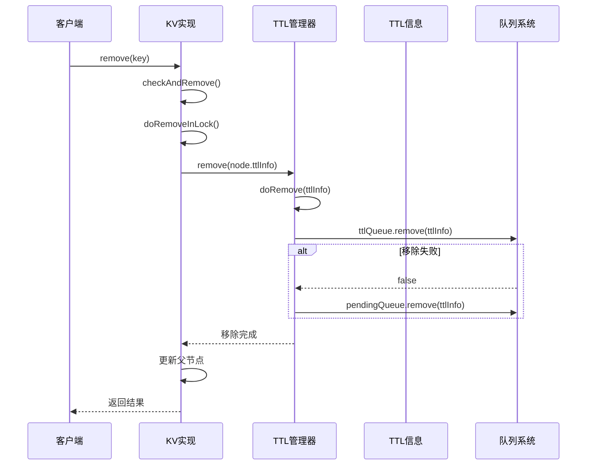

# TTL移除策略

<cite>
**本文档引用的文件**
- [TtlManager.java](file://server/src/main/java/com/github/dtprj/dongting/dtkv/server/TtlManager.java)
- [KvImpl.java](file://server/src/main/java/com/github/dtprj/dongting/dtkv/server/KvImpl.java)
- [TtlManagerTest.java](file://server/src/test/java/com/github/dtprj/dongting/dtkv/server/TtlManagerTest.java)
- [DtKV.java](file://server/src/main/java/com/github/dtprj/dongting/dtkv/server/DtKV.java)
</cite>

## 目录
1. [简介](#简介)
2. [TTL系统架构概览](#ttl系统架构概览)
3. [核心组件分析](#核心组件分析)
4. [TTL移除机制详解](#ttl移除机制详解)
5. [双队列清理策略](#双队列清理策略)
6. [完整移除流程](#完整移除流程)
7. [性能考虑](#性能考虑)
8. [故障处理机制](#故障处理机制)
9. [最佳实践建议](#最佳实践建议)

## 简介

Dongting分布式键值存储系统中的TTL（生存时间）机制是一个关键特性，它允许为KV条目设置自动过期时间。当KV条目被删除或更新时，系统需要从TTL管理器中安全地移除对应的TtlInfo对象，确保数据结构的一致性和系统的稳定性。

本文档详细分析了TTL移除机制的核心实现，包括`remove`和`doRemove`方法的工作原理，以及如何通过空指针检查和双重队列清理来避免数据结构不一致的问题。

## TTL系统架构概览

TTL管理系统采用双队列设计来高效管理过期的KV条目：



**图表来源**
- [TtlManager.java](file://server/src/main/java/com/github/dtprj/dongting/dtkv/server/TtlManager.java#L35-L45)

## 核心组件分析

### TtlManager类结构

TtlManager是TTL系统的核心管理器，负责协调整个TTL生命周期：



**图表来源**
- [TtlManager.java](file://server/src/main/java/com/github/dtprj/dongting/dtkv/server/TtlManager.java#L35-L241)

### TtlInfo数据结构

TtlInfo类封装了每个KV条目的TTL相关信息：



**图表来源**
- [TtlManager.java](file://server/src/main/java/com/github/dtprj/dongting/dtkv/server/TtlManager.java#L203-L241)

**章节来源**
- [TtlManager.java](file://server/src/main/java/com/github/dtprj/dongting/dtkv/server/TtlManager.java#L35-L241)

## TTL移除机制详解

### remove方法的实现

`remove`方法是TTL移除的公共接口，提供给外部调用者使用：

```java
public void remove(KvNodeEx n) {
    doRemove(n.ttlInfo);
}
```

这个方法的设计遵循了简洁性原则：
- 接受KvNodeEx作为参数
- 直接委托给内部的`doRemove`方法
- 无需额外的参数验证

### doRemove方法的核心逻辑

`doRemove`方法实现了真正的TTL移除逻辑，这是整个TTL移除机制的核心：

```java
private void doRemove(TtlInfo ti) {
    if (ti == null) {
        return;
    }
    if (!ttlQueue.remove(ti)) {
        pendingQueue.remove(ti);
    }
}
```

#### 空指针检查的重要性

空指针检查是防止系统崩溃的第一道防线：

1. **防御性编程**：确保传入的TtlInfo对象不为空
2. **幂等性保证**：即使多次调用也不会产生副作用
3. **异常安全性**：避免NullPointerException导致系统不稳定

#### 双重队列清理策略

双重队列清理是TTL移除机制的关键创新：



**图表来源**
- [TtlManager.java](file://server/src/main/java/com/github/dtprj/dongting/dtkv/server/TtlManager.java#L185-L190)

这种设计的优势：

1. **队列状态无关性**：无论TtlInfo处于哪个队列，都能正确移除
2. **原子性操作**：确保TtlInfo不会同时存在于两个队列中
3. **性能优化**：优先尝试从活跃队列移除，减少不必要的操作

**章节来源**
- [TtlManager.java](file://server/src/main/java/com/github/dtprj/dongting/dtkv/server/TtlManager.java#L177-L190)

## 双队列清理策略

### 队列状态转换图

TTL系统中的TtlInfo对象会在不同队列间移动：



### 队列清理的具体实现

#### 从ttlQueue移除

```java
if (!ttlQueue.remove(ti)) {
    // 如果在ttlQueue中找不到，说明已经转移到pendingQueue
}
```

#### 从pendingQueue移除

```java
pendingQueue.remove(ti);
// 这里不需要额外检查，因为remove操作会自动处理不存在的情况
```

这种设计避免了重复移除的风险，确保TtlInfo对象只会被移除一次。

**章节来源**
- [TtlManager.java](file://server/src/main/java/com/github/dtprj/dongting/dtkv/server/TtlManager.java#L185-L190)

## 完整移除流程

### 在KvImpl中的移除调用链

当KV条目被删除时，整个移除流程如下：



**图表来源**
- [KvImpl.java](file://server/src/main/java/com/github/dtprj/dongting/dtkv/server/KvImpl.java#L625-L652)
- [TtlManager.java](file://server/src/main/java/com/github/dtprj/dongting/dtkv/server/TtlManager.java#L177-L190)

### 具体代码路径分析

#### 1. remove方法入口

```java
public KvResult remove(long index, ByteArray key) {
    return checkAndRemove(index, key, true);
}
```

#### 2. doRemoveInLock核心逻辑

```java
private KvResult doRemoveInLock(long index, KvNodeHolder h) {
    long logTime = opContext.leaderCreateTimeMillis;
    addToUpdateQueue(index, h);
    if (maxOpenSnapshotIndex > 0) {
        KvNodeEx n = h.latest;
        KvNodeEx newKvNode = new KvNodeEx(n.createIndex, n.createTime, index, logTime);
        h.latest = newKvNode;
        newKvNode.previous = n;
        gc(h);
    } else {
        map.remove(h.key);
    }

    // 关键步骤：从TTL队列中移除
    ttlManager.remove(h.latest);
    if (watchManager != null) {
        watchManager.mountWatchToParent(h);
    }

    updateParent(index, logTime, h.parent);
    return KvResult.SUCCESS;
}
```

#### 3. updateTtl方法中的移除

```java
public KvResult updateTtl(long index, ByteArray key) {
    // ... 检查逻辑 ...
    // 更新TTL时需要先移除旧的TtlInfo
    ttlManager.updateTtl(index, key, h.latest, opContext);
    return KvResult.SUCCESS;
}
```

**章节来源**
- [KvImpl.java](file://server/src/main/java/com/github/dtprj/dongting/dtkv/server/KvImpl.java#L612-L652)
- [KvImpl.java](file://server/src/main/java/com/github/dtprj/dongting/dtkv/server/KvImpl.java#L740-L750)

## 性能考虑

### 批量处理限制

TTL管理器实现了批量处理机制来平衡性能和响应性：

```java
static final int MAX_RETRY_BATCH = 10;
static final int MAX_EXPIRE_BATCH = 50;
```

这些常量控制：
- **MAX_RETRY_BATCH**：每次重试批次的最大数量
- **MAX_EXPIRE_BATCH**：每次过期处理的最大数量

### 时间复杂度分析

- **doRemove方法**：O(log n) - TreeSet的remove操作
- **队列切换**：O(1) - 直接调用remove方法
- **批量处理**：O(batch_size) - 控制单次处理的工作量

### 内存使用优化

TTL系统采用了多种内存优化策略：

1. **延迟GC**：只有在有开放快照时才进行垃圾回收
2. **对象复用**：TtlInfo对象在队列间移动时不创建新实例
3. **索引管理**：使用单调递增的索引来保证排序稳定性

**章节来源**
- [TtlManager.java](file://server/src/main/java/com/github/dtprj/dongting/dtkv/server/TtlManager.java#L43-L46)

## 故障处理机制

### 失败重试机制

TTL系统提供了完善的失败处理机制：

```java
public void retry(TtlInfo ttlInfo, Throwable ex) {
    if (stop) {
        return;
    }
    ttlInfo.expireFailed = true;
    ttlInfo.lastFailNanos = ts.nanoTime;
    // 如果已经在pending队列中，无需再次添加
    log.warn("expire failed: {}", ex.toString());
}
```

### 角色变更处理

```java
public void roleChange(RaftRole newRole) {
    try {
        role = newRole;
        ttlQueue.addAll(pendingQueue);
        pendingQueue.clear();
        task.signal();
    } catch (Throwable e) {
        BugLog.log(e);
    }
}
```

当从LEADER变为FOLLOWER时，所有pendingQueue中的TtlInfo会被重新加入ttlQueue，确保不会丢失任何过期任务。

**章节来源**
- [TtlManager.java](file://server/src/main/java/com/github/dtprj/dongting/dtkv/server/TtlManager.java#L108-L118)
- [TtlManager.java](file://server/src/main/java/com/github/dtprj/dongting/dtkv/server/TtlManager.java#L192-L201)

## 最佳实践建议

### 1. 避免频繁的TTL更新

频繁的TTL更新会导致大量的移除和重新添加操作，影响性能。建议：
- 合理设置TTL时间，避免频繁更新
- 使用批量操作减少系统调用次数

### 2. 正确处理异常情况

```java
try {
    // 执行TTL相关操作
    ttlManager.updateTtl(index, key, node, context);
} catch (Exception e) {
    // 记录错误日志但不中断正常业务流程
    BugLog.log(e);
}
```

### 3. 监控队列状态

定期监控ttlQueue和pendingQueue的状态，及时发现潜在问题：

```java
// 建议的监控指标
int ttlQueueSize = ttlManager.ttlQueue.size();
int pendingQueueSize = ttlManager.pendingQueue.size();
boolean hasFailedTasks = !ttlManager.pendingQueue.isEmpty();
```

### 4. 合理配置批处理大小

根据系统负载调整批量处理参数：

```java
// 生产环境推荐配置
static final int MAX_RETRY_BATCH = 20;  // 根据CPU核心数调整
static final int MAX_EXPIRE_BATCH = 100; // 根据内存容量调整
```

### 5. 注意线程安全

TTL管理器的所有公共方法都是线程安全的，但在高并发场景下需要注意：
- 避免在锁内调用TTL相关方法
- 使用异步方式处理TTL过期回调

## 结论

Dongting的TTL移除策略通过精心设计的双队列系统和智能的移除机制，实现了高效、可靠的数据生命周期管理。`remove`和`doRemove`方法的组合使用，配合空指针检查和双重队列清理，确保了系统的稳定性和数据一致性。

关键优势包括：
- **简单高效的移除机制**：通过doRemove的双重队列清理避免重复移除
- **强大的容错能力**：完善的失败重试和角色变更处理
- **优秀的性能表现**：批量处理和合理的队列大小控制
- **良好的扩展性**：支持大规模并发操作

这种设计不仅满足了当前的功能需求，也为未来的功能扩展奠定了坚实的基础。