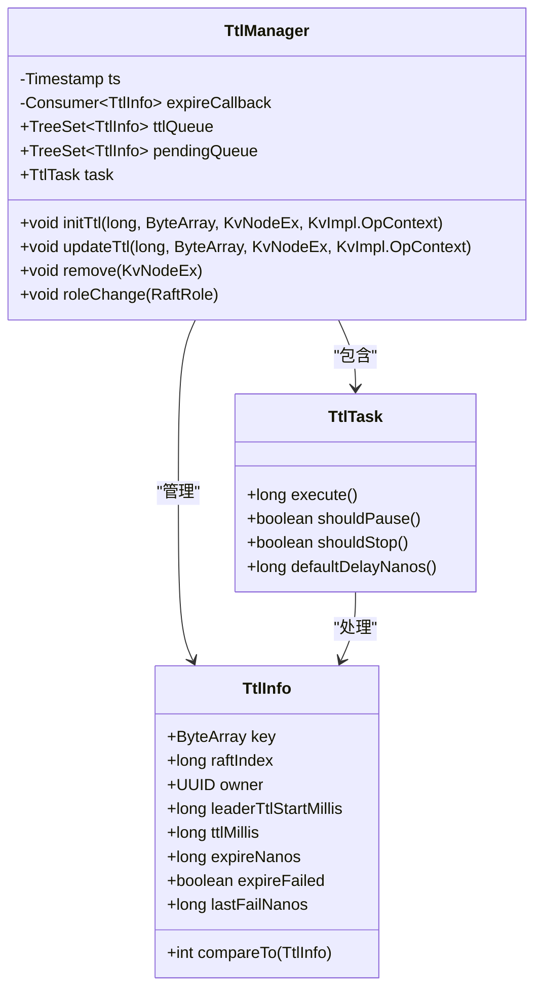
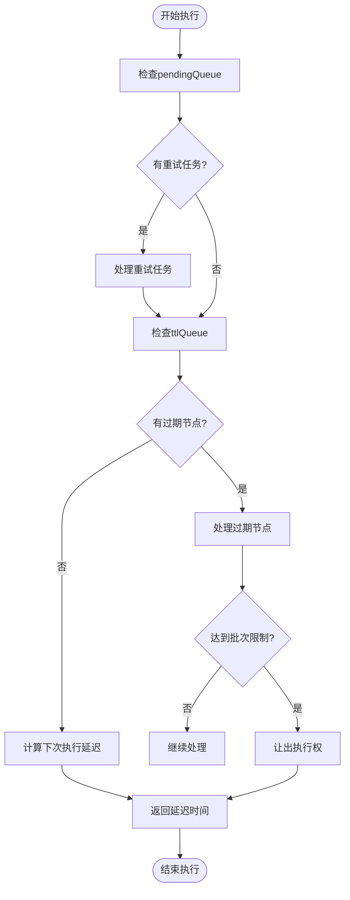
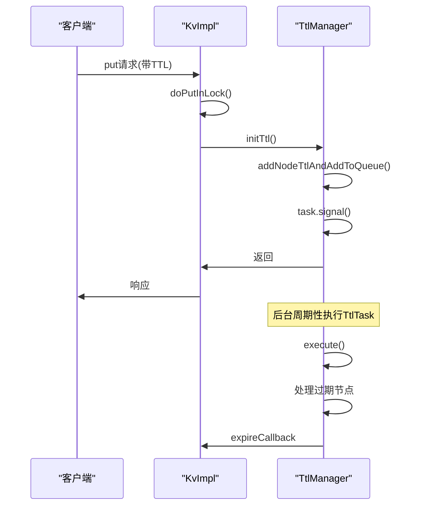

# TTL管理

<cite>
**本文档引用的文件**   
- [TtlManager.java](file://server/src/main/java/com/github/dtprj/dongting/dtkv/server/TtlManager.java)
- [TtlManagerTest.java](file://server/src/test/java/com/github/dtprj/dongting/dtkv/server/TtlManagerTest.java)
- [KvImpl.java](file://server/src/main/java/com/github/dtprj/dongting/dtkv/server/KvImpl.java)
- [DtKV.java](file://server/src/main/java/com/github/dtprj/dongting/dtkv/server/DtKV.java)
- [TtlDemoClient.java](file://demos/src/main/java/com/github/dtprj/dongting/demos/ttl/TtlDemoClient.java)
</cite>

## 目录
1. [简介](#简介)
2. [核心组件](#核心组件)
3. [时间轮算法变体实现](#时间轮算法变体实现)
4. [过期任务调度](#过期任务调度)
5. [失败重试机制](#失败重试机制)
6. [领导者角色变更处理](#领导者角色变更处理)
7. [核心方法调用时机与逻辑](#核心方法调用时机与逻辑)
8. [使用示例](#使用示例)

## 简介
TTL（Time-To-Live）管理功能是Dongting分布式系统中的关键组件，负责自动清理过期的KV节点数据。该功能通过TtlManager类实现，采用基于TreeSet的优先队列机制来管理具有生存时间限制的节点。当节点的生存时间到期时，系统会自动触发清理操作，确保数据的时效性和存储空间的有效利用。本文档将深入解析TTL管理功能的实现细节，包括其核心组件、工作流程以及在不同场景下的行为表现。

## 核心组件
TTL管理功能的核心由TtlManager类及其内部组件构成。TtlManager维护两个TreeSet队列：ttlQueue用于存放待过期的节点，pendingQueue用于存放过期处理失败需要重试的节点。TtlTask作为执行任务，周期性地检查这两个队列并处理过期节点。TtlInfo类则封装了每个带TTL节点的元数据，包括键、过期时间、所有者等信息。这些组件协同工作，实现了高效可靠的自动过期机制。

**Section sources**
- [TtlManager.java](file://server/src/main/java/com/github/dtprj/dongting/dtkv/server/TtlManager.java#L43-L58)

## 时间轮算法变体实现
TtlManager采用了时间轮算法的变体实现，通过TreeSet作为优先队列来管理过期任务。与传统时间轮不同，这里使用TreeSet的自然排序特性，根据TtlInfo的expireNanos字段进行排序，确保最早过期的节点位于队列头部。这种实现避免了传统时间轮的固定时间槽限制，能够更精确地处理任意时间间隔的过期任务。TtlInfo类实现了Comparable接口，其compareTo方法首先比较expireNanos，若相等则比较ttlInfoIndex以保证顺序稳定性。

**Diagram sources **
- [TtlManager.java](file://server/src/main/java/com/github/dtprj/dongting/dtkv/server/TtlManager.java#L177-L240)

## 过期任务调度
过期任务的调度由TtlTask的execute方法实现。该方法首先检查pendingQueue中是否有需要重试的过期任务，如果有且重试延迟已过，则将其移回ttlQueue。然后检查ttlQueue中是否有已过期的节点，如果有，则逐个处理，最多处理MAX_EXPIRE_BATCH（50个）任务后返回，以避免长时间占用线程。如果队列为空或所有节点都未过期，则返回下一个最近过期任务的等待时间。这种批量处理机制既保证了及时性，又避免了性能瓶颈。

**Diagram sources **
- [TtlManager.java](file://server/src/main/java/com/github/dtprj/dongting/dtkv/server/TtlManager.java#L60-L94)

## 失败重试机制
当过期回调执行失败时，系统会启动失败重试机制。在TtlTask的execute方法中，如果expireCallback抛出异常，该TtlInfo会被标记为expireFailed并放入pendingQueue。retryDelayNanos（默认1秒）后，系统会尝试重新处理该任务。每次重试都会检查lastFailNanos与当前时间的差值，只有超过retryDelayNanos才会重新加入处理队列。这种机制确保了临时性故障不会导致数据永久无法清理，同时通过MAX_RETRY_BATCH（10个）限制了单次处理的重试任务数量，防止系统资源被过度占用。

**Section sources**
- [TtlManager.java](file://server/src/main/java/com/github/dtprj/dongting/dtkv/server/TtlManager.java#L100-L115)

## 领导者角色变更处理
在分布式系统中，领导者角色的变更会影响TTL的处理。TtlManager通过roleChange方法处理这一场景。当角色变为非领导者时，shouldPause方法返回true，暂停过期任务的执行。当角色变为领导者时，系统会将pendingQueue中的所有任务重新合并到ttlQueue中，并清空pendingQueue，然后通过task.signal()立即触发任务执行。这种设计确保了只有领导者节点才能执行过期清理操作，避免了多节点重复清理的问题，同时在角色切换时能够无缝恢复过期任务的处理。

**Section sources**
- [TtlManager.java](file://server/src/main/java/com/github/dtprj/dongting/dtkv/server/TtlManager.java#L177-L185)

## 核心方法调用时机与逻辑
TTL管理功能的核心方法包括initTtl、updateTtl和remove。initTtl在创建带TTL的节点时调用，将新节点的TtlInfo加入ttlQueue；updateTtl在更新节点TTL时调用，先移除旧的TtlInfo再添加新的；remove在节点被删除时调用，从相应队列中移除TtlInfo。这些方法的调用时机由KvImpl类中的业务逻辑决定，例如在put操作时根据请求参数决定是否调用initTtl。所有方法都通过task.signal()通知任务执行器，确保过期检查能够及时进行。

**Diagram sources **
- [KvImpl.java](file://server/src/main/java/com/github/dtprj/dongting/dtkv/server/KvImpl.java#L423-L423)
- [TtlManager.java](file://server/src/main/java/com/github/dtprj/dongting/dtkv/server/TtlManager.java#L117-L143)

## 使用示例
以下示例展示了如何使用TTL功能为KV节点设置生存时间。客户端通过putTemp方法创建一个3秒后自动过期的节点。系统后台会自动管理该节点的生命周期，在过期后将其清理。5秒后再次查询该节点时，返回结果为null，表明节点已被成功清理。这种机制适用于缓存、会话管理等需要自动过期的场景，简化了应用层的生命周期管理。

**Section sources**
- [TtlDemoClient.java](file://demos/src/main/java/com/github/dtprj/dongting/demos/ttl/TtlDemoClient.java#L40-L55)