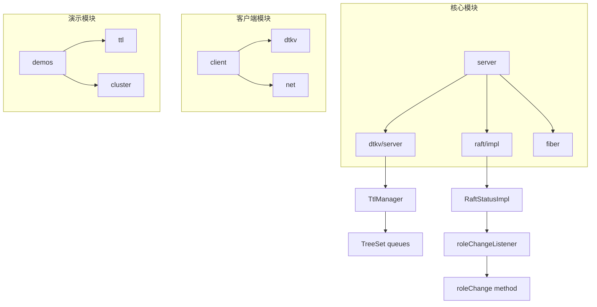
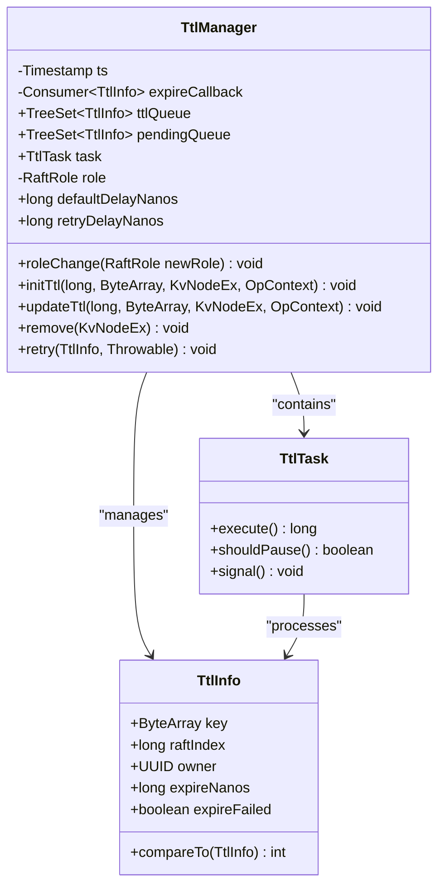
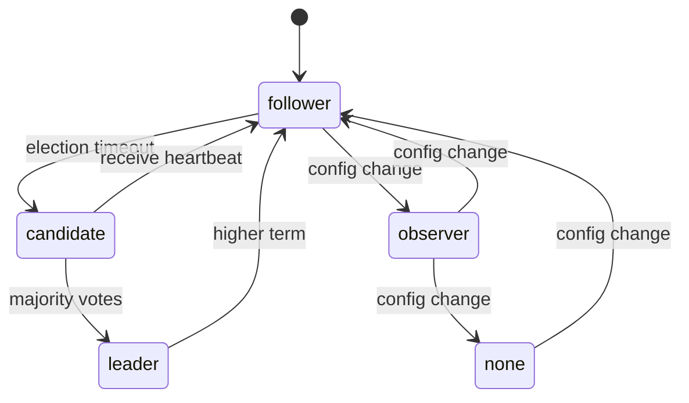
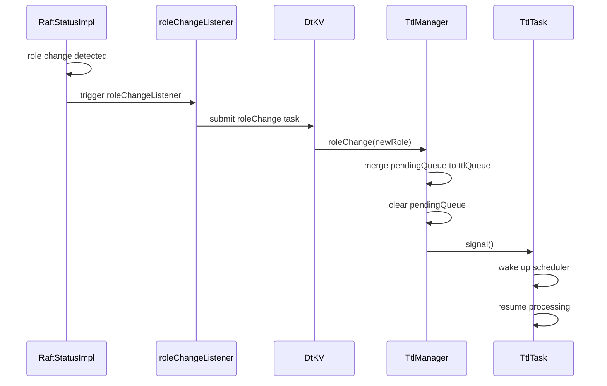
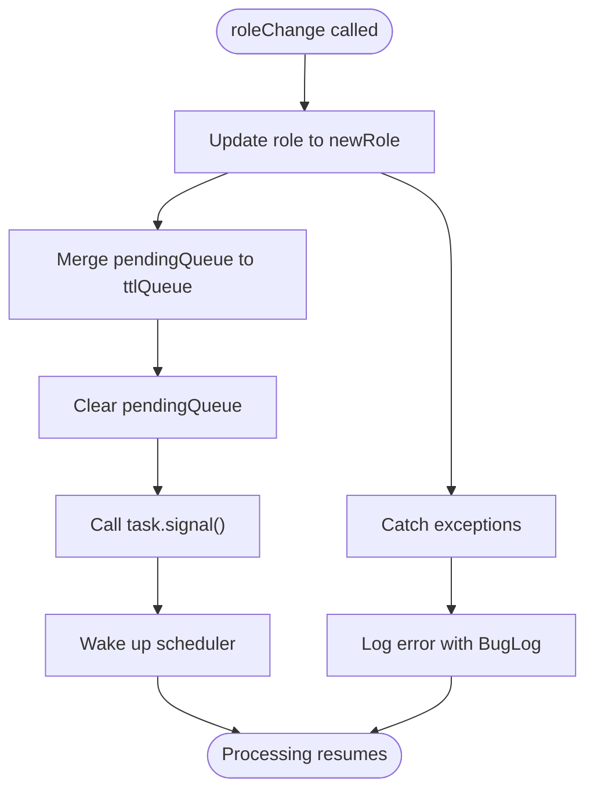
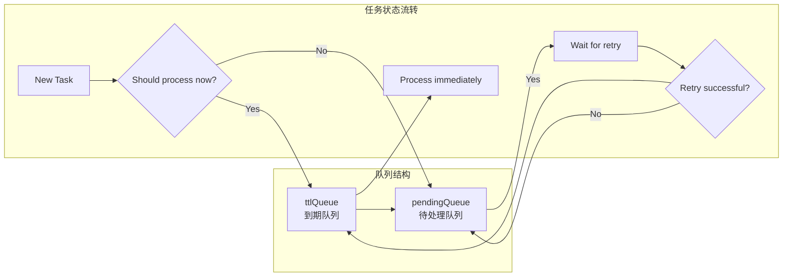
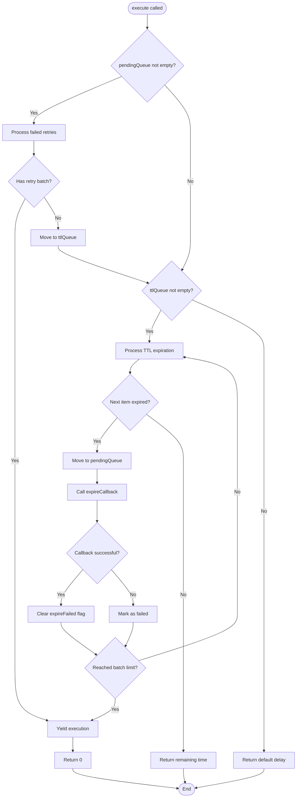
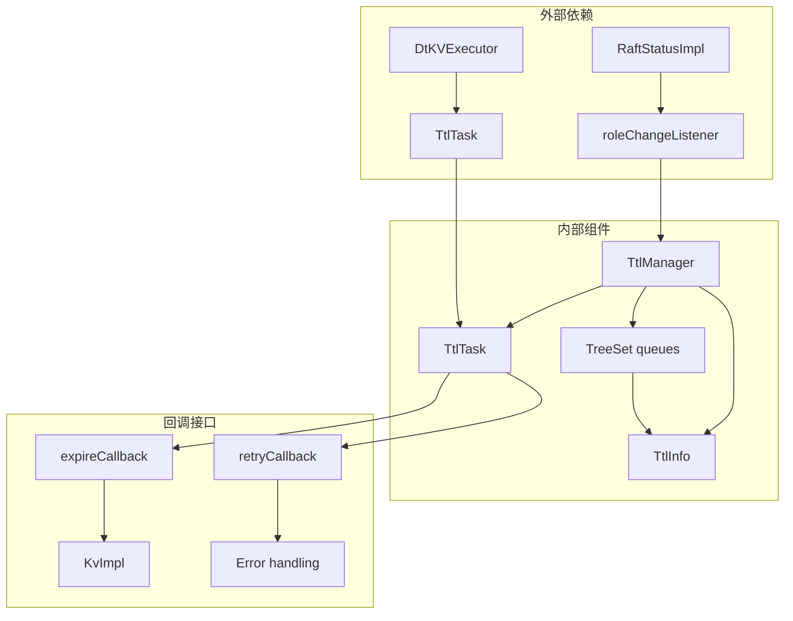

# 角色变更处理机制

<cite>
**本文档引用的文件**
- [TtlManager.java](file://server/src/main/java/com/github/dtprj/dongting/dtkv/server/TtlManager.java)
- [TtlManagerTest.java](file://server/src/test/java/com/github/dtprj/dongting/dtkv/server/TtlManagerTest.java)
- [RaftRole.java](file://server/src/main/java/com/github/dtprj/dongting/raft/impl/RaftRole.java)
- [RaftStatusImpl.java](file://server/src/main/java/com/github/dtprj/dongting/raft/impl/RaftStatusImpl.java)
- [RaftUtil.java](file://server/src/main/java/com/github/dtprj/dongting/raft/impl/RaftUtil.java)
- [DtKV.java](file://server/src/main/java/com/github/dtprj/dongting/dtkv/server/DtKV.java)
- [KvImpl.java](file://server/src/main/java/com/github/dtprj/dongting/dtkv/server/KvImpl.java)
</cite>

## 目录
1. [简介](#简介)
2. [项目结构概述](#项目结构概述)
3. [核心组件分析](#核心组件分析)
4. [架构概览](#架构概览)
5. [详细组件分析](#详细组件分析)
6. [依赖关系分析](#依赖关系分析)
7. [性能考虑](#性能考虑)
8. [故障排除指南](#故障排除指南)
9. [结论](#结论)

## 简介

Dongting分布式键值存储系统中的TTL（生存时间）管理器在Raft共识算法的角色转换过程中扮演着关键角色。当节点从领导者变为跟随者或观察者时，TTL管理器必须确保所有待处理的过期任务不会丢失，并且能够正确地重新处理这些任务。

本文档深入分析了`roleChange`方法在Raft角色转换过程中的作用，解释了如何将`pendingQueue`中的待处理过期任务重新合并到`ttlQueue`中以恢复处理，以及`task.signal()`调用如何立即唤醒调度器开始处理积压任务。

## 项目结构概述

Dongting项目采用模块化架构，主要包含以下核心模块：



**图表来源**
- [TtlManager.java](file://server/src/main/java/com/github/dtprj/dongting/dtkv/server/TtlManager.java#L1-L50)
- [RaftStatusImpl.java](file://server/src/main/java/com/github/dtprj/dongting/raft/impl/RaftStatusImpl.java#L1-L50)

## 核心组件分析

### TTL管理器架构

TTL管理器是Dongting系统中负责处理键值对生存时间的核心组件。它维护两个关键的数据结构：



**图表来源**
- [TtlManager.java](file://server/src/main/java/com/github/dtprj/dongting/dtkv/server/TtlManager.java#L35-L50)
- [TtlManager.java](file://server/src/main/java/com/github/dtprj/dongting/dtkv/server/TtlManager.java#L52-L100)

**章节来源**
- [TtlManager.java](file://server/src/main/java/com/github/dtprj/dongting/dtkv/server/TtlManager.java#L35-L100)

### Raft角色类型

Raft共识算法支持多种角色状态，每种状态都有特定的行为和职责：



**图表来源**
- [RaftRole.java](file://server/src/main/java/com/github/dtprj/dongting/raft/impl/RaftRole.java#L18-L22)

**章节来源**
- [RaftRole.java](file://server/src/main/java/com/github/dtprj/dongting/raft/impl/RaftRole.java#L18-L22)

## 架构概览

TTL管理器在Raft集群中的角色变更处理流程如下：



**图表来源**
- [DtKV.java](file://server/src/main/java/com/github/dtprj/dongting/dtkv/server/DtKV.java#L345-L347)
- [TtlManager.java](file://server/src/main/java/com/github/dtprj/dongting/dtkv/server/TtlManager.java#L220-L230)

## 详细组件分析

### roleChange方法实现

`roleChange`方法是TTL管理器在角色转换过程中的核心处理逻辑：

```java
public void roleChange(RaftRole newRole) {
    try {
        role = newRole;
        ttlQueue.addAll(pendingQueue);
        pendingQueue.clear();
        task.signal();
    } catch (Throwable e) {
        BugLog.log(e);
    }
}
```

这个方法的关键步骤包括：

1. **更新角色状态**：将当前角色更新为新的角色
2. **合并队列**：将`pendingQueue`中的所有任务转移到`ttlQueue`
3. **清空待处理队列**：清除`pendingQueue`以准备接收新任务
4. **唤醒调度器**：通过`task.signal()`立即唤醒等待的任务处理器



**图表来源**
- [TtlManager.java](file://server/src/main/java/com/github/dtprj/dongting/dtkv/server/TtlManager.java#L220-L230)

**章节来源**
- [TtlManager.java](file://server/src/main/java/com/github/dtprj/dongting/dtkv/server/TtlManager.java#L220-L230)

### 队列管理机制

TTL管理器使用两个优先级队列来管理过期任务：



**图表来源**
- [TtlManager.java](file://server/src/main/java/com/github/dtprj/dongting/dtkv/server/TtlManager.java#L40-L45)

### TtlTask执行逻辑

`TtlTask`的`execute`方法实现了复杂的任务处理逻辑：



**图表来源**
- [TtlManager.java](file://server/src/main/java/com/github/dtprj/dongting/dtkv/server/TtlManager.java#L52-L100)

**章节来源**
- [TtlManager.java](file://server/src/main/java/com/github/dtprj/dongting/dtkv/server/TtlManager.java#L52-L100)

### 角色变更监听器集成

DtKV实例通过设置角色变更监听器来协调TTL管理器的角色转换：

```java
((RaftStatusImpl) config.raftStatus).roleChangeListener = (oldRole, newRole) -> {
    // ignore submit failure (stopped)
    dtkvExecutor.submitTaskInFiberThread(() -> ttlManager.roleChange(newRole));
};
```

这种设计确保了：
- **异步处理**：角色变更处理在纤程线程中异步执行
- **错误隔离**：异常被捕获并记录，不影响其他组件
- **线程安全**：通过纤程执行器确保线程安全

**章节来源**
- [DtKV.java](file://server/src/main/java/com/github/dtprj/dongting/dtkv/server/DtKV.java#L345-L347)

## 依赖关系分析

TTL管理器的依赖关系图展示了其与其他组件的交互：



**图表来源**
- [RaftStatusImpl.java](file://server/src/main/java/com/github/dtprj/dongting/raft/impl/RaftStatusImpl.java#L42-L42)
- [DtKV.java](file://server/src/main/java/com/github/dtprj/dongting/dtkv/server/DtKV.java#L345-L347)

**章节来源**
- [RaftStatusImpl.java](file://server/src/main/java/com/github/dtprj/dongting/raft/impl/RaftStatusImpl.java#L42-L42)
- [DtKV.java](file://server/src/main/java/com/github/dtprj/dongting/dtkv/server/DtKV.java#L345-L347)

## 性能考虑

### 批处理优化

TTL管理器实现了批处理机制来提高性能：

- **最大重试批次**：`MAX_RETRY_BATCH = 10`，限制每次重试处理的任务数量
- **最大过期批次**：`MAX_EXPIRE_BATCH = 50`，限制每次过期处理的任务数量
- **动态延迟**：根据处理结果动态调整下次执行时间

### 内存管理

- **TreeSet使用**：利用TreeSet的有序特性自动按过期时间排序
- **索引机制**：使用`ttlInfoIndex`防止相同时间戳的任务冲突
- **及时清理**：定期清理已完成和失败的任务

### 并发控制

- **无锁设计**：使用TreeSet的线程安全特性避免显式锁
- **原子操作**：队列操作使用原子方法确保数据一致性
- **错误隔离**：单个任务失败不影响其他任务处理

## 故障排除指南

### 常见问题及解决方案

1. **任务丢失问题**
   - 检查`roleChange`方法是否正确调用
   - 验证队列合并逻辑是否正常工作
   - 确认`task.signal()`是否被正确执行

2. **性能问题**
   - 监控批处理大小是否达到上限
   - 检查重试延迟配置是否合理
   - 分析任务处理时间分布

3. **内存泄漏**
   - 定期检查队列大小
   - 监控TtlInfo对象生命周期
   - 确保异常处理不导致资源泄露

**章节来源**
- [TtlManagerTest.java](file://server/src/test/java/com/github/dtprj/dongting/dtkv/server/TtlManagerTest.java#L235-L273)

## 结论

Dongting系统的TTL管理器通过精心设计的角色变更处理机制，确保了在Raft角色转换期间过期任务的完整性和一致性。`roleChange`方法通过合并队列和唤醒调度器，有效地解决了角色切换期间的任务处理问题。

关键特性包括：
- **完整性保证**：通过队列合并确保所有待处理任务都能得到处理
- **性能优化**：批处理和动态调度机制提高处理效率
- **错误处理**：完善的异常捕获和日志记录机制
- **并发安全**：基于TreeSet的线程安全设计

这种设计模式为分布式系统中的状态管理和任务调度提供了可靠的参考实现。