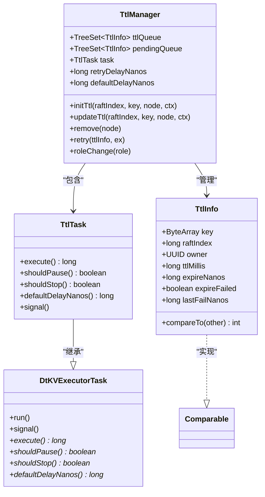
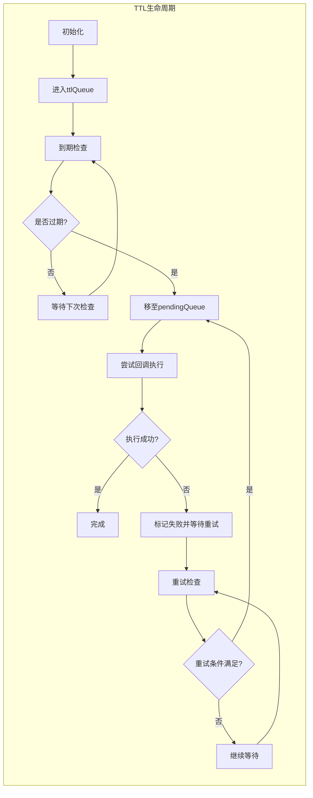
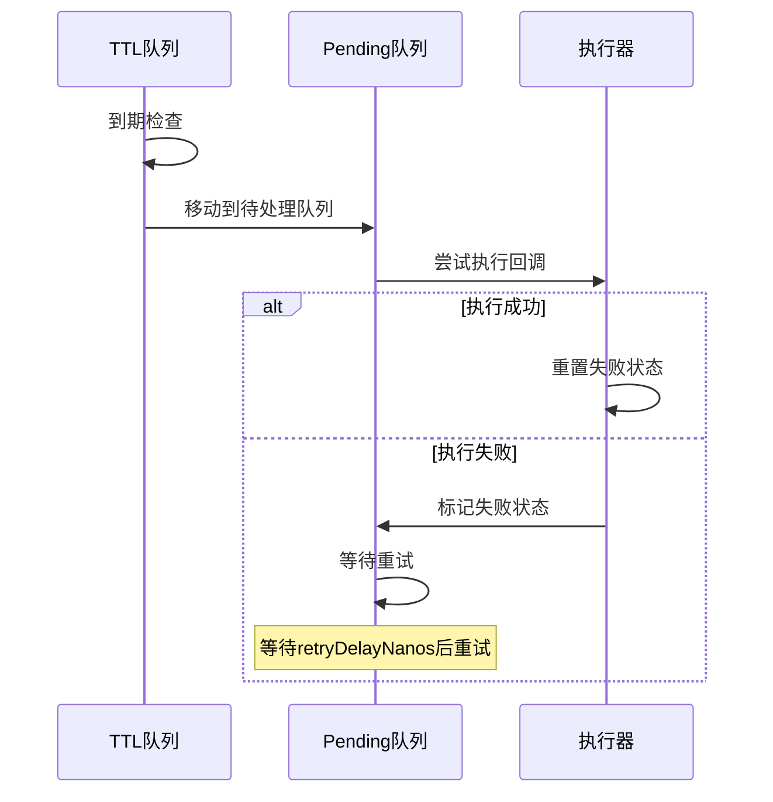
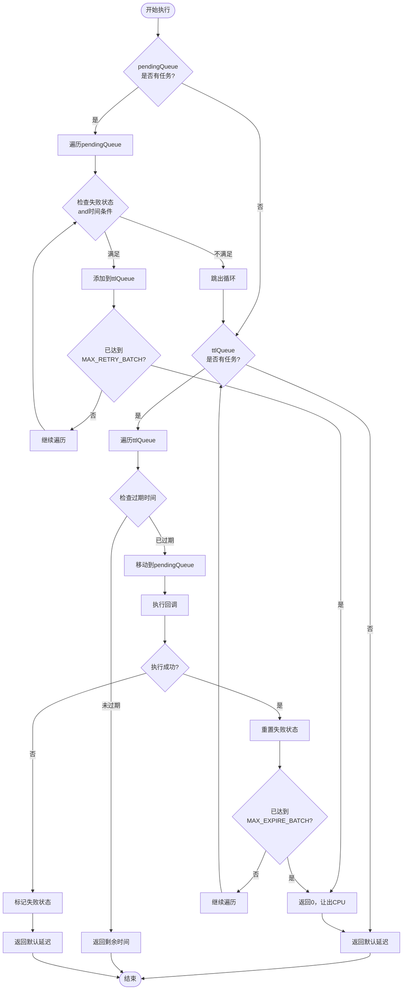

# TTL回调失败重试机制

<cite>
**本文档引用的文件**
- [TtlManager.java](file://server/src/main/java/com/github/dtprj/dongting/dtkv/server/TtlManager.java)
- [TtlManagerTest.java](file://server/src/test/java/com/github/dtprj/dongting/dtkv/server/TtlManagerTest.java)
- [DtKVExecutor.java](file://server/src/main/java/com/github/dtprj/dongting/dtkv/server/DtKVExecutor.java)
- [KvNodeEx.java](file://server/src/main/java/com/github/dtprj/dongting/dtkv/server/KvNodeEx.java)
</cite>

## 目录
1. [概述](#概述)
2. [核心组件架构](#核心组件架构)
3. [重试机制详解](#重试机制详解)
4. [队列协作模式](#队列协作模式)
5. [执行流程分析](#执行流程分析)
6. [配置参数说明](#配置参数说明)
7. [故障处理策略](#故障处理策略)
8. [性能优化考虑](#性能优化考虑)
9. [最佳实践建议](#最佳实践建议)
10. [总结](#总结)

## 概述

Dongting框架中的TTL（生存时间）管理器实现了智能的回调失败重试机制，通过两个关键队列的协作模式确保过期处理的可靠性。该机制的核心是`pendingQueue`和`ttlQueue`的协同工作，配合`retryDelayNanos`参数控制重试间隔，并通过`MAX_RETRY_BATCH`限制单次处理数量以避免长时间阻塞。

## 核心组件架构

### 主要类结构



**图表来源**
- [TtlManager.java](file://server/src/main/java/com/github/dtprj/dongting/dtkv/server/TtlManager.java#L30-L242)
- [DtKVExecutor.java](file://server/src/main/java/com/github/dtprj/dongting/dtkv/server/DtKVExecutor.java#L133-L213)

**章节来源**
- [TtlManager.java](file://server/src/main/java/com/github/dtprj/dongting/dtkv/server/TtlManager.java#L30-L242)

## 重试机制详解

### 失败状态管理

TTL信息对象维护两个关键的失败相关字段：

- `expireFailed`: 布尔值，标记回调是否失败
- `lastFailNanos`: 记录最后一次失败的时间戳

当回调执行失败时，系统会自动设置这些状态：

```java
// 失败状态更新逻辑
ttlInfo.expireFailed = true;
ttlInfo.lastFailNanos = ts.nanoTime;
```

### 重试条件判断

重试机制的核心在于`execute()`方法中的条件判断：

```java
if (ttlInfo.expireFailed && 
    ts.nanoTime - ttlInfo.lastFailNanos > retryDelayNanos) {
    // 可以进行重试
}
```

只有当满足以下两个条件时才会触发重试：
1. 回调之前已经失败（`expireFailed == true`）
2. 当前时间与上次失败时间差大于`retryDelayNanos`设定的阈值

### 重试延迟机制

`retryDelayNanos`参数控制重试间隔，默认为1秒（1,000,000,000纳秒）。这种指数退避策略有助于：
- 避免频繁重试导致的资源浪费
- 给系统恢复提供缓冲时间
- 减少对正常业务的影响

**章节来源**
- [TtlManager.java](file://server/src/main/java/com/github/dtprj/dongting/dtkv/server/TtlManager.java#L60-L94)
- [TtlManager.java](file://server/src/main/java/com/github/dtprj/dongting/dtkv/server/TtlManager.java#L115-L125)

## 队列协作模式

### 队列职责分工



### 队列数据结构

两个队列都使用`TreeSet`实现，具有以下特点：

1. **排序规则**: 基于`expireNanos`字段升序排列
2. **去重机制**: 确保相同键的TTL信息不会重复添加
3. **高效查找**: O(log n)的插入和删除复杂度

### 队列转换逻辑



**图表来源**
- [TtlManager.java](file://server/src/main/java/com/github/dtprj/dongting/dtkv/server/TtlManager.java#L60-L94)

**章节来源**
- [TtlManager.java](file://server/src/main/java/com/github/dtprj/dongting/dtkv/server/TtlManager.java#L43-L58)
- [TtlManager.java](file://server/src/main/java/com/github/dtprj/dongting/dtkv/server/TtlManager.java#L170-L185)

## 执行流程分析

### 主执行循环

`TtlTask.execute()`方法实现了完整的执行逻辑：



**图表来源**
- [TtlManager.java](file://server/src/main/java/com/github/dtprj/dongting/dtkv/server/TtlManager.java#L60-L94)

### 批处理限制

系统设置了两个关键的批处理限制：

1. **MAX_RETRY_BATCH = 10**: 单次重试处理的最大数量
2. **MAX_EXPIRE_BATCH = 50**: 单次过期处理的最大数量

这些限制的设计目的：
- **防止长时间阻塞**: 避免单次操作占用过多CPU时间
- **保证响应性**: 确保系统能够及时响应其他任务
- **平滑负载**: 分散处理压力，避免峰值冲击

### 角色切换处理

当Raft角色从领导者变为跟随者时，系统会自动暂停TTL处理：

```java
@Override
protected boolean shouldPause() {
    return role != RaftRole.leader;
}
```

这种设计确保了：
- 在非领导者节点上不执行过期处理
- 避免多节点同时处理相同任务
- 提高系统的整体稳定性

**章节来源**
- [TtlManager.java](file://server/src/main/java/com/github/dtprj/dongting/dtkv/server/TtlManager.java#L60-L94)
- [TtlManager.java](file://server/src/main/java/com/github/dtprj/dongting/dtkv/server/TtlManager.java#L127-L135)

## 配置参数说明

### 核心参数配置

```java
// 默认重试延迟：1秒
long defaultDelayNanos = 1_000_000_000L;

// 重试延迟：1秒
long retryDelayNanos = 1_000_000_000L;

// 最大重试批处理大小
static final int MAX_RETRY_BATCH = 10;

// 最大过期批处理大小
static final int MAX_EXPIRE_BATCH = 50;
```

### 参数调优指南

| 参数 | 默认值 | 调整建议 | 影响 |
|------|--------|----------|------|
| `retryDelayNanos` | 1秒 | 根据业务需求调整 | 控制重试频率，影响系统响应性 |
| `MAX_RETRY_BATCH` | 10 | 根据CPU能力调整 | 平衡处理能力和响应性 |
| `MAX_EXPIRE_BATCH` | 50 | 根据网络延迟调整 | 影响过期处理效率 |

### 动态调整策略

虽然当前实现中这些参数是静态常量，但在实际应用中可以考虑：
- 根据系统负载动态调整批处理大小
- 根据网络状况调整重试延迟
- 根据业务特性调整最大批处理数量

**章节来源**
- [TtlManager.java](file://server/src/main/java/com/github/dtprj/dongting/dtkv/server/TtlManager.java#L43-L50)

## 故障处理策略

### 异常捕获机制

系统在执行回调时会捕获所有异常：

```java
try {
    ttlInfo.expireFailed = false;
    ttlInfo.lastFailNanos = 0;
    expireCallback.accept(ttlInfo);
} catch (Throwable e) {
    ttlInfo.expireFailed = true;
    ttlInfo.lastFailNanos = ts.nanoTime;
    BugLog.log(e);
    return defaultDelayNanos();
}
```

这种设计的优势：
- **容错性强**: 单个回调失败不会影响整个系统
- **日志记录**: 异常会被记录以便后续分析
- **自动恢复**: 成功的回调会重置失败状态

### 停止标志处理

系统提供了优雅停止机制：

```java
public void retry(TtlInfo ttlInfo, Throwable ex) {
    if (stop) {
        return;
    }
    // 正常处理逻辑...
}
```

这确保了：
- 在系统关闭过程中不会产生新的重试任务
- 已经开始的任务能够完成
- 避免资源泄漏

### 角色变更处理

当Raft角色发生变化时，系统会自动清理pending队列：

```java
public void roleChange(RaftRole newRole) {
    try {
        role = newRole;
        ttlQueue.addAll(pendingQueue);
        pendingQueue.clear();
        task.signal();
    } catch (Throwable e) {
        BugLog.log(e);
    }
}
```

这种设计的好处：
- 领导者变更时不会丢失pending任务
- 自动清理不再需要的pending任务
- 保持系统状态的一致性

**章节来源**
- [TtlManager.java](file://server/src/main/java/com/github/dtprj/dongting/dtkv/server/TtlManager.java#L91-L105)
- [TtlManager.java](file://server/src/main/java/com/github/dtprj/dongting/dtkv/server/TtlManager.java#L115-L125)
- [TtlManager.java](file://server/src/main/java/com/github/dtprj/dongting/dtkv/server/TtlManager.java#L227-L242)

## 性能优化考虑

### 时间复杂度分析

- **队列插入**: O(log n)，因为使用TreeSet
- **队列删除**: O(log n)，基于有序集合的删除操作
- **遍历操作**: O(k)，其中k是待处理元素的数量
- **查找操作**: O(log n)，支持高效的二分查找

### 内存使用优化

1. **对象复用**: TTL信息对象在队列间转移时不创建新实例
2. **及时清理**: 过期或失败的任务会被及时移除
3. **批处理**: 通过批处理减少频繁的队列操作

### CPU使用优化

1. **yield机制**: 当达到批处理上限时主动让出CPU
2. **延迟计算**: 只有在必要时才计算下一次执行时间
3. **条件检查**: 优先检查最可能的情况（如队列为空）

### 网络优化

对于分布式环境下的TTL处理：
- 支持跨节点的TTL信息同步
- 提供批量处理接口减少网络开销
- 实现智能的重试策略避免网络抖动影响

## 最佳实践建议

### 使用场景推荐

1. **缓存过期**: 适用于各种缓存系统的过期通知
2. **会话管理**: 用户会话的自动清理
3. **临时数据**: 临时文件、临时表等的自动删除
4. **定时任务**: 基于时间的定期清理任务

### 配置优化建议

1. **监控指标**:
   - 失败率统计
   - 平均重试间隔
   - 队列长度变化趋势

2. **调优策略**:
   - 根据业务特点调整重试延迟
   - 根据系统负载动态调整批处理大小
   - 设置合理的超时时间

3. **错误处理**:
   - 实现自定义的异常处理器
   - 设置最大重试次数限制
   - 提供降级处理方案

### 测试验证

建议在生产环境中进行充分的测试验证：

1. **压力测试**: 模拟大量TTL任务的并发处理
2. **故障注入**: 模拟各种异常情况下的行为
3. **性能测试**: 验证系统在不同负载下的表现
4. **稳定性测试**: 长时间运行验证系统的稳定性

**章节来源**
- [TtlManagerTest.java](file://server/src/test/java/com/github/dtprj/dongting/dtkv/server/TtlManagerTest.java#L34-L316)

## 总结

Dongting框架的TTL回调失败重试机制是一个设计精良的系统，通过以下关键特性确保了可靠性和性能：

### 核心优势

1. **双队列协作**: `pendingQueue`和`ttlQueue`的分工明确，各司其职
2. **智能重试**: 基于时间条件的重试机制，避免盲目重试
3. **批处理控制**: 合理的批处理大小限制，平衡性能和响应性
4. **优雅降级**: 完善的异常处理和停止机制
5. **角色感知**: 自动适应Raft角色变化，保持系统一致性

### 设计亮点

- **状态管理**: 清晰的失败状态跟踪和恢复机制
- **性能优化**: 多层次的性能优化策略
- **可扩展性**: 支持动态配置和监控
- **容错性**: 全面的异常处理和系统保护

### 应用价值

这套重试机制不仅解决了TTL过期处理中的常见问题，还为其他类似的异步回调处理场景提供了宝贵的参考。通过合理的配置和监控，可以在保证系统稳定性的同时获得良好的性能表现。