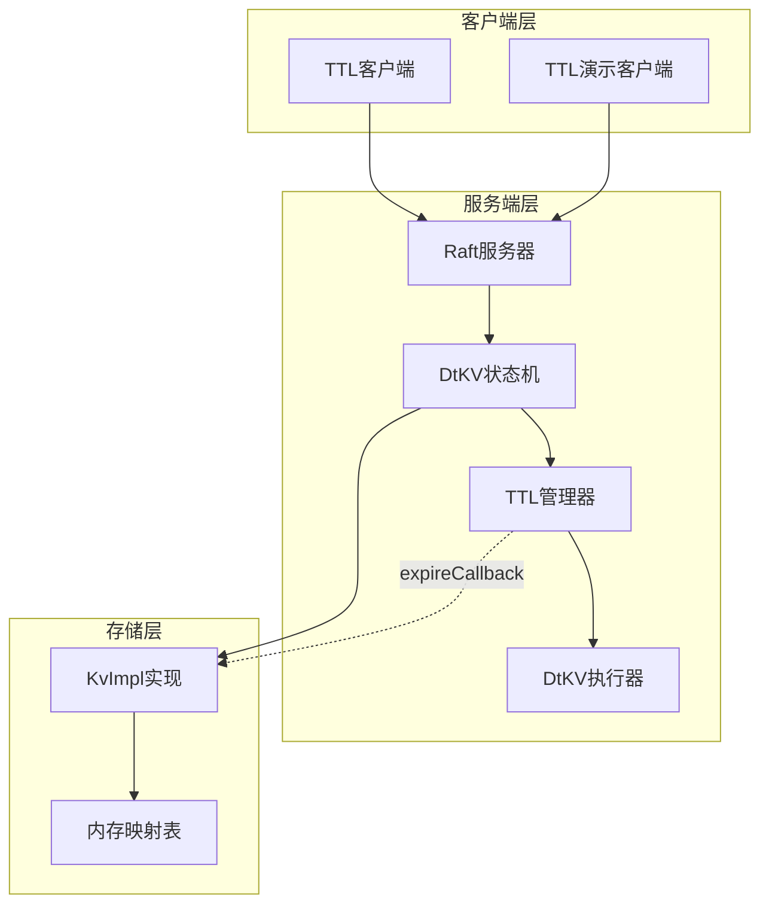
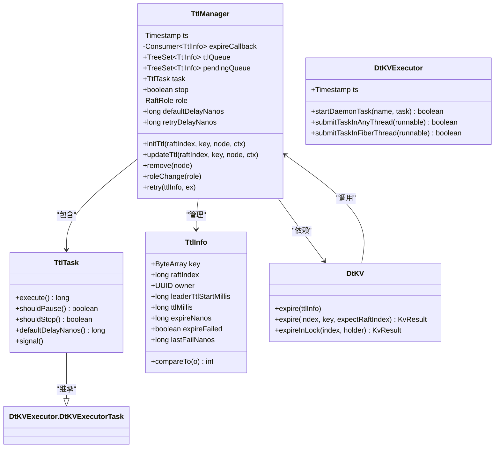
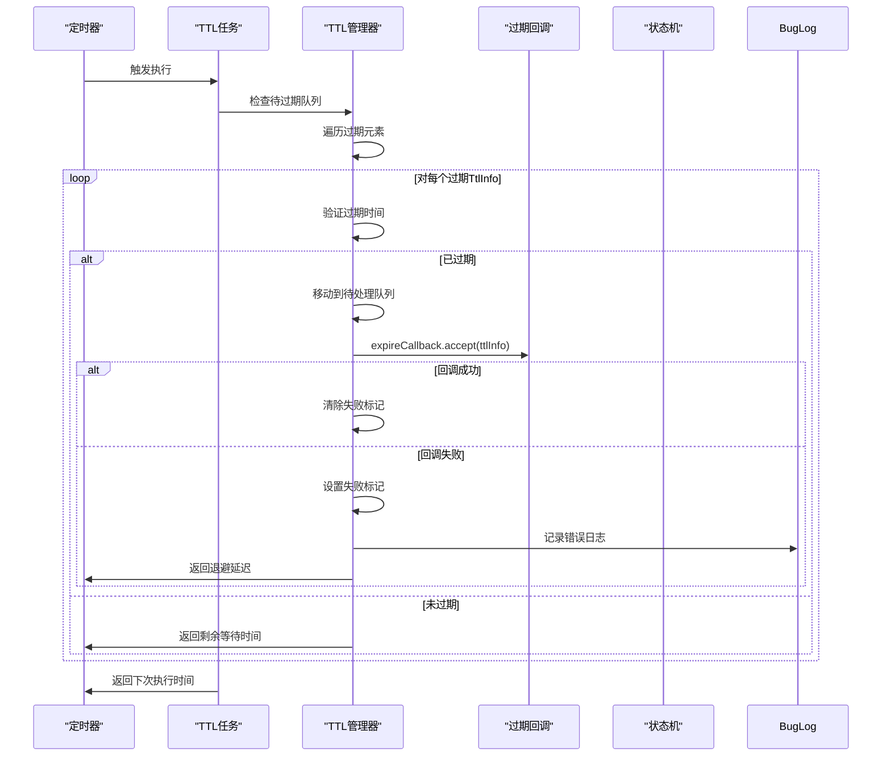
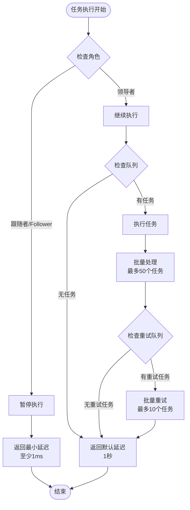
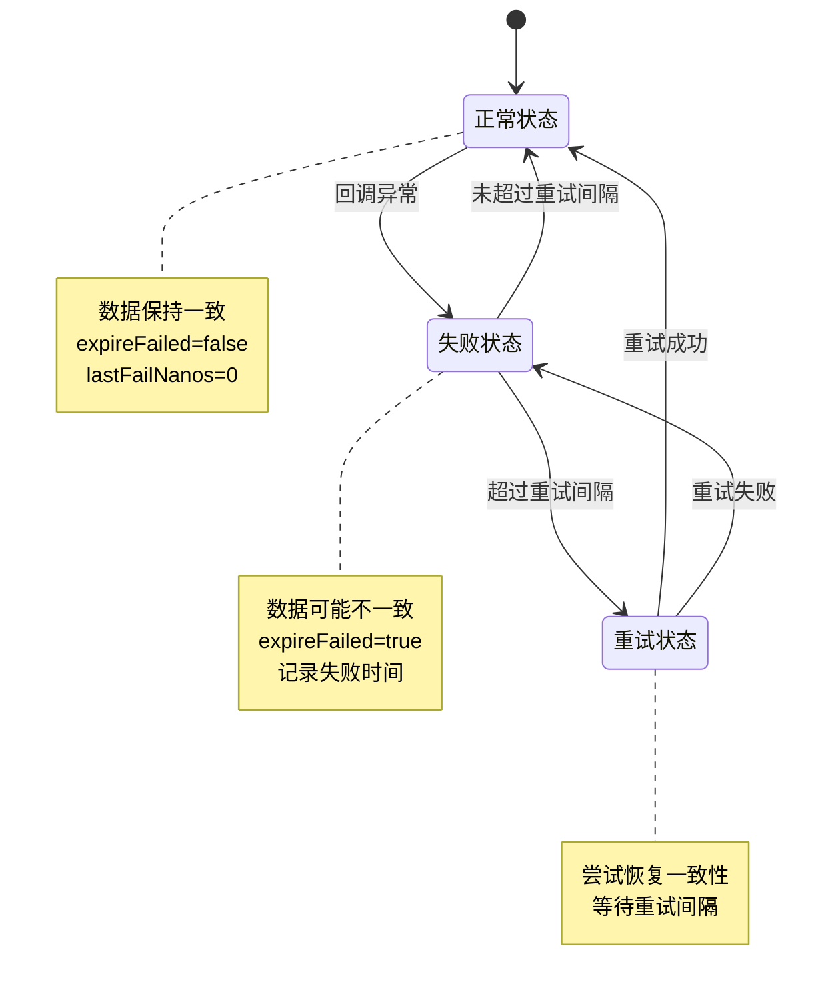
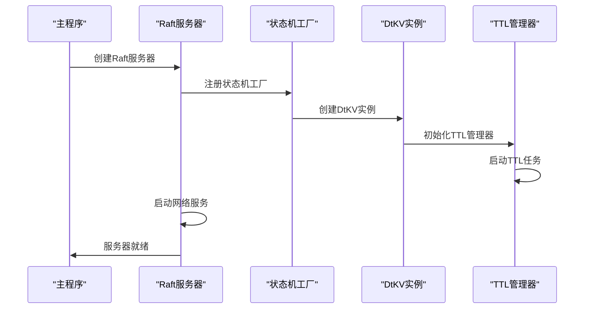

# TTL过期回调执行流程

<cite>
**本文档引用的文件**
- [TtlManager.java](file://server/src/main/java/com/github/dtprj/dongting/dtkv/server/TtlManager.java)
- [DtKVExecutor.java](file://server/src/main/java/com/github/dtprj/dongting/dtkv/server/DtKVExecutor.java)
- [DtKV.java](file://server/src/main/java/com/github/dtprj/dongting/dtkv/server/DtKV.java)
- [KvImpl.java](file://server/src/main/java/com/github/dtprj/dongting/dtkv/server/KvImpl.java)
- [TtlManagerTest.java](file://server/src/test/java/com/github/dtprj/dongting/dtkv/server/TtlManagerTest.java)
- [TtlDemoClient.java](file://demos/src/main/java/com/github/dtprj/dongting/demos/ttl/TtlDemoClient.java)
- [TtlDemoServer.java](file://demos/src/main/java/com/github/dtprj/dongting/demos/ttl/TtlDemoServer.java)
- [DemoKvServerBase.java](file://demos/src/main/java/com/github/dtprj/dongting/demos/base/DemoKvServerBase.java)
</cite>

## 目录
1. [概述](#概述)
2. [核心组件架构](#核心组件架构)
3. [TTL回调执行流程](#ttl回调执行流程)
4. [领导者节点处理机制](#领导者节点处理机制)
5. [异常处理与退避策略](#异常处理与退避策略)
6. [系统一致性保障](#系统一致性保障)
7. [实际应用场景](#实际应用场景)
8. [故障排除指南](#故障排除指南)
9. [总结](#总结)

## 概述

Dongting框架中的TTL（生存时间）过期回调执行流程是一个高度可靠且容错的系统设计，专门用于处理分布式键值存储中的数据过期操作。该系统通过Raft共识算法确保只有领导者节点才能执行过期回调，同时提供了完善的异常处理和退避策略来保证系统的高可用性和数据一致性。

## 核心组件架构

### 系统架构概览



**图表来源**
- [TtlManager.java](file://server/src/main/java/com/github/dtprj/dongting/dtkv/server/TtlManager.java#L35-L58)
- [DtKV.java](file://server/src/main/java/com/github/dtprj/dongting/dtkv/server/DtKV.java#L57-L85)

### 关键组件关系图



**图表来源**
- [TtlManager.java](file://server/src/main/java/com/github/dtprj/dongting/dtkv/server/TtlManager.java#L35-L242)
- [DtKVExecutor.java](file://server/src/main/java/com/github/dtprj/dongting/dtkv/server/DtKVExecutor.java#L121-L214)

**章节来源**
- [TtlManager.java](file://server/src/main/java/com/github/dtprj/dongting/dtkv/server/TtlManager.java#L35-L242)
- [DtKVExecutor.java](file://server/src/main/java/com/github/dtprj/dongting/dtkv/server/DtKVExecutor.java#L121-L214)

## TTL回调执行流程

### 回调调用时机与上下文环境

TTL过期回调的执行遵循严格的时序控制和上下文验证机制：



**图表来源**
- [TtlManager.java](file://server/src/main/java/com/github/dtprj/dongting/dtkv/server/TtlManager.java#L60-L110)

### 执行方法中的关键逻辑

在`TtlTask.execute()`方法中，回调的调用时机和上下文环境通过以下步骤严格控制：

1. **队列检查与批处理**：系统首先检查`pendingQueue`和`ttlQueue`两个队列的状态
2. **过期时间验证**：对于`ttlQueue`中的每个元素，验证其是否已过期
3. **回调执行**：当元素过期时，立即调用`expireCallback.accept(ttlInfo)`
4. **状态更新**：根据回调执行结果更新元素的失败状态

**章节来源**
- [TtlManager.java](file://server/src/main/java/com/github/dtprj/dongting/dtkv/server/TtlManager.java#L60-L110)

## 领导者节点处理机制

### shouldPause方法的设计原理

`shouldPause()`方法是确保只有Raft领导者节点处理过期任务的核心机制：



**图表来源**
- [TtlManager.java](file://server/src/main/java/com/github/dtprj/dongting/dtkv/server/TtlManager.java#L112-L115)

### 设计原理分析

1. **Raft角色同步**：通过`roleChange()`方法同步Raft角色变化
2. **队列迁移**：从`pendingQueue`迁移到`ttlQueue`，确保一致性
3. **信号通知**：通过`task.signal()`触发重新调度
4. **暂停机制**：跟随者节点自动暂停执行，避免并发问题

**章节来源**
- [TtlManager.java](file://server/src/main/java/com/github/dtprj/dongting/dtkv/server/TtlManager.java#L112-L115)
- [TtlManager.java](file://server/src/main/java/com/github/dtprj/dongting/dtkv/server/TtlManager.java#L230-L242)

## 异常处理与退避策略

### 异常捕获机制的工作方式

系统采用全面的异常捕获机制来确保即使回调失败也不会影响整个系统的稳定性：

```mermaid
flowchart TD
Start([回调执行开始]) --> TryBlock[try块执行]
TryBlock --> Success{执行成功?}
Success --> |是| ClearFlag[清除失败标志]
Success --> |否| CatchBlock[catch Throwable块]
CatchBlock --> SetFailed[设置expireFailed=true]
SetFailed --> RecordTime[记录lastFailNanos]
RecordTime --> LogError[BugLog.log(ex)]
LogError --> ReturnDelay[返回默认延迟]
ClearFlag --> ReturnNormal[返回正常延迟]
ReturnDelay --> End([结束])
ReturnNormal --> End
```

**图表来源**
- [TtlManager.java](file://server/src/main/java/com/github/dtprj/dongting/dtkv/server/TtlManager.java#L91-L105)

### 退避策略详解

系统实现了两层退避策略来处理回调失败的情况：

1. **默认退避策略**：
   - 失败后返回`defaultDelayNanos`（1秒）
   - 适用于一般性异常情况

2. **重试退避策略**：
   - 重试前检查`retryDelayNanos`间隔
   - 只有超过间隔时间才重新尝试
   - 最大重试批次限制为10个

**章节来源**
- [TtlManager.java](file://server/src/main/java/com/github/dtprj/dongting/dtkv/server/TtlManager.java#L91-L105)
- [TtlManager.java](file://server/src/main/java/com/github/dtprj/dongting/dtkv/server/TtlManager.java#L43-L46)

## 系统一致性保障

### 回调失败对系统一致性的影响

当TTL过期回调失败时，系统通过以下机制确保数据一致性：



### 应对措施

1. **幂等性保证**：回调函数必须是幂等的，支持重复执行
2. **索引验证**：通过`expectRaftIndex`参数防止过期操作被重复执行
3. **状态监控**：通过`BugLog`记录所有异常，便于问题追踪
4. **优雅降级**：即使部分回调失败，系统仍能继续运行

**章节来源**
- [DtKV.java](file://server/src/main/java/com/github/dtprj/dongting/dtkv/server/DtKV.java#L375-L400)
- [KvImpl.java](file://server/src/main/java/com/github/dtprj/dongting/dtkv/server/KvImpl.java#L810-L836)

## 实际应用场景

### TTL演示客户端使用示例

通过TTL演示客户端可以直观地看到过期回调的执行效果：

```java
// 客户端示例代码
System.out.println("put tempKey1 with value tempValue1");
long ttlMillis = 3000; // 3秒TTL
kvClient.putTemp(GROUP_ID, "tempKey1".getBytes(), "tempValue1".getBytes(), ttlMillis);

// 等待一段时间后获取
System.out.println("sleep 5000 millis");
Thread.sleep(5000);

// TTL过期后应该获取不到数据
KvNode node = kvClient.get(GROUP_ID, "tempKey1".getBytes());
System.out.println("get tempKey1, value=" + (node == null ? "null" : new String(node.data)));
```

### 服务器端启动流程



**图表来源**
- [TtlDemoServer.java](file://demos/src/main/java/com/github/dtprj/dongting/demos/ttl/TtlDemoServer.java#L25-L32)
- [DemoKvServerBase.java](file://demos/src/main/java/com/github/dtprj/dongting/demos/base/DemoKvServerBase.java#L45-L83)

**章节来源**
- [TtlDemoClient.java](file://demos/src/main/java/com/github/dtprj/dongting/demos/ttl/TtlDemoClient.java#L30-L57)
- [TtlDemoServer.java](file://demos/src/main/java/com/github/dtprj/dongting/demos/ttl/TtlDemoServer.java#L25-L32)

## 故障排除指南

### 常见问题诊断

1. **回调执行延迟**
   - 检查`defaultDelayNanos`配置
   - 验证系统负载情况
   - 查看`BugLog`中的异常信息

2. **过期数据残留**
   - 确认`expireCallback`是否正确实现
   - 检查`expectRaftIndex`匹配情况
   - 验证Raft角色状态

3. **系统性能问题**
   - 监控批处理大小（MAX_EXPIRE_BATCH）
   - 调整重试间隔（retryDelayNanos）
   - 分析内存使用情况

### 调试技巧

- 使用`BugLog`查看详细的异常堆栈
- 监控`ttlQueue`和`pendingQueue`的大小变化
- 在测试环境中模拟各种异常场景

**章节来源**
- [TtlManagerTest.java](file://server/src/test/java/com/github/dtprj/dongting/dtkv/server/TtlManagerTest.java#L197-L233)

## 总结

Dongting框架的TTL过期回调执行流程是一个设计精良的分布式系统组件，具有以下特点：

1. **高可靠性**：通过Raft领导者选举确保一致性
2. **容错性强**：完善的异常处理和退避策略
3. **性能优化**：批处理和队列管理提升效率
4. **易于调试**：全面的日志记录和状态监控

该系统通过精心设计的回调机制，在保证数据一致性的同时，提供了良好的可维护性和可观测性，是构建分布式键值存储系统的重要基础设施。