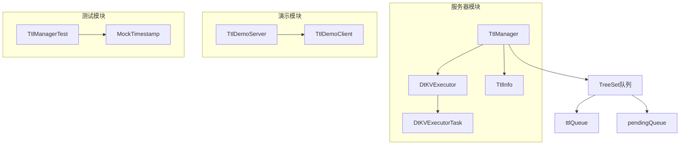
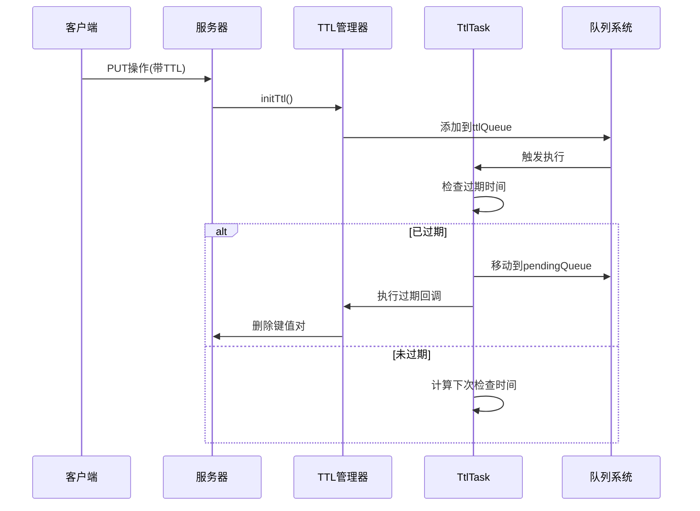
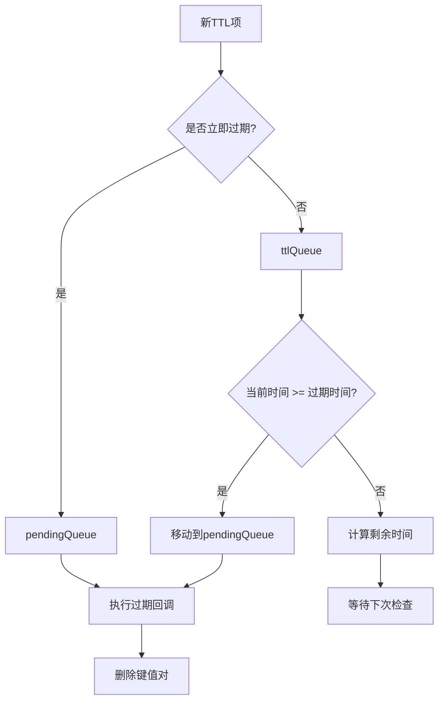
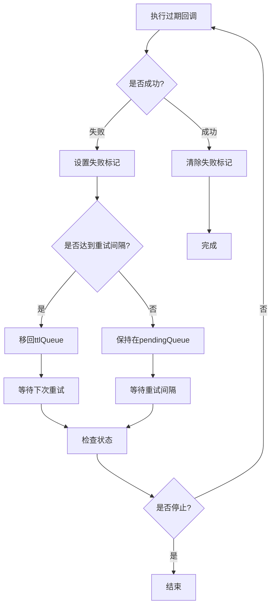
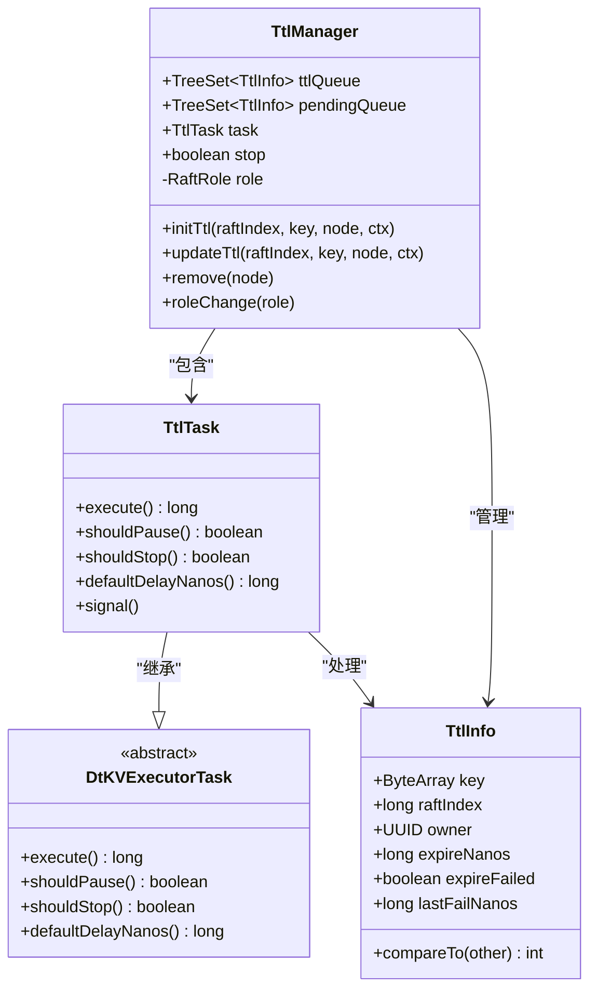

# 过期处理与任务调度

<cite>
**本文档引用的文件**
- [TtlManager.java](file://server/src/main/java/com/github/dtprj/dongting/dtkv/server/TtlManager.java)
- [DtKVExecutor.java](file://server/src/main/java/com/github/dtprj/dongting/dtkv/server/DtKVExecutor.java)
- [TtlManagerTest.java](file://server/src/test/java/com/github/dtprj/dongting/dtkv/server/TtlManagerTest.java)
- [DtKV.java](file://server/src/main/java/com/github/dtprj/dongting/dtkv/server/DtKV.java)
- [TtlDemoClient.java](file://demos/src/main/java/com/github/dtprj/dongting/demos/ttl/TtlDemoClient.java)
- [TtlDemoServer.java](file://demos/src/main/java/com/github/dtprj/dongting/demos/ttl/TtlDemoServer.java)
</cite>

## 目录
1. [简介](#简介)
2. [项目结构](#项目结构)
3. [核心组件](#核心组件)
4. [架构概览](#架构概览)
5. [详细组件分析](#详细组件分析)
6. [依赖关系分析](#依赖关系分析)
7. [性能考虑](#性能考虑)
8. [故障排除指南](#故障排除指南)
9. [结论](#结论)

## 简介

Dongting的TTL（生存时间）过期处理系统是一个高度优化的任务调度机制，专门用于管理键值存储中的过期数据。该系统采用双队列协作模式，结合时间轮算法的变体设计，实现了高效、可靠的过期数据清理功能。

系统的核心设计理念是：
- **双队列协作**：使用`ttlQueue`和`pendingQueue`两个优先级队列协同工作
- **批处理优化**：通过`MAX_EXPIRE_BATCH`和`MAX_RETRY_BATCH`限制提高性能
- **Raft角色感知**：通过`shouldPause`方法确保仅由领导者节点处理过期任务
- **异常处理机制**：完善的失败重试策略和异常捕获

## 项目结构



**图表来源**
- [TtlManager.java](file://server/src/main/java/com/github/dtprj/dongting/dtkv/server/TtlManager.java#L40-L50)
- [DtKVExecutor.java](file://server/src/main/java/com/github/dtprj/dongting/dtkv/server/DtKVExecutor.java#L30-L40)

**章节来源**
- [TtlManager.java](file://server/src/main/java/com/github/dtprj/dongting/dtkv/server/TtlManager.java#L1-L50)
- [DtKVExecutor.java](file://server/src/main/java/com/github/dtprj/dongting/dtkv/server/DtKVExecutor.java#L1-L50)

## 核心组件

### TtlManager类

`TtlManager`是整个TTL过期处理系统的核心控制器，负责管理过期任务的生命周期。

```java
class TtlManager {
    final TreeSet<TtlInfo> ttlQueue = new TreeSet<>();      // 待过期队列
    final TreeSet<TtlInfo> pendingQueue = new TreeSet<>();  // 待执行队列
    final TtlTask task;                                     // 执行任务
    boolean stop;                                           // 停止标志
    private RaftRole role;                                  // Raft角色
}
```

### TtlTask内部类

`TtlTask`继承自`DtKVExecutorTask`，实现了具体的过期处理逻辑：

```java
class TtlTask extends DtKVExecutor.DtKVExecutorTask {
    @Override
    protected long execute() {
        // 处理重试队列
        // 处理待过期队列
        // 返回下次执行延迟
    }
    
    @Override
    protected boolean shouldPause() {
        return role != RaftRole.leader;
    }
}
```

**章节来源**
- [TtlManager.java](file://server/src/main/java/com/github/dtprj/dongting/dtkv/server/TtlManager.java#L40-L94)

## 架构概览



**图表来源**
- [TtlManager.java](file://server/src/main/java/com/github/dtprj/dongting/dtkv/server/TtlManager.java#L110-L140)
- [DtKV.java](file://server/src/main/java/com/github/dtprj/dongting/dtkv/server/DtKV.java#L375-L400)

## 详细组件分析

### 双队列协作模式

系统采用双队列设计来优化过期处理性能：



**图表来源**
- [TtlManager.java](file://server/src/main/java/com/github/dtprj/dongting/dtkv/server/TtlManager.java#L60-L94)

#### ttlQueue特性

- **有序存储**：使用`TreeSet`按过期时间排序
- **快速访问**：支持O(log n)的插入和查找
- **自动排序**：基于`TtlInfo.compareTo()`方法

#### pendingQueue特性

- **待执行队列**：存储已过期但尚未处理的TTL项
- **高优先级**：在ttlQueue之前处理
- **批量处理**：支持批处理以提高效率

### 时间轮算法变体

系统使用时间轮算法的变体来管理过期时间：

```java
// 计算过期时间
long expireNanos = ctx.localCreateNanos + ctx.ttlMillis * 1_000_000;

// nanoTime比较判断过期
if (ttlInfo.expireNanos - ts.nanoTime > 0) {
    return ttlInfo.expireNanos - ts.nanoTime;
}
```

这种设计的优势：
- **高精度**：使用纳秒级时间戳
- **单调递增**：避免时钟回拨问题
- **高效比较**：直接数值比较而非字符串解析

### 批处理限制

系统实现了严格的批处理限制来防止资源耗尽：

```java
static final int MAX_RETRY_BATCH = 10;     // 重试批次最大值
static final int MAX_EXPIRE_BATCH = 50;    // 过期批次最大值

// 在TtlTask.execute()中使用
while (it.hasNext()) {
    if (count++ >= MAX_EXPIRE_BATCH) {
        yield = true;
        break;
    }
    // 处理过期项...
}
```

这些限制的作用：
- **防止饥饿**：确保其他任务也能得到执行机会
- **控制内存**：避免一次性处理过多过期项
- **平滑负载**：分散CPU使用峰值

### 异常处理机制

系统实现了完善的异常处理和重试机制：



**图表来源**
- [TtlManager.java](file://server/src/main/java/com/github/dtprj/dongting/dtkv/server/TtlManager.java#L85-L94)

异常处理的关键特性：
- **失败标记**：`expireFailed`和`lastFailNanos`字段
- **指数退避**：默认1秒重试间隔
- **日志记录**：使用BugLog记录异常详情

### Raft角色控制

系统通过`shouldPause`方法实现Raft角色感知：

```java
@Override
protected boolean shouldPause() {
    return role != RaftRole.leader;
}
```

这种设计确保：
- **数据一致性**：只有领导者才能修改数据
- **避免冲突**：防止多个节点同时处理相同过期项
- **简化逻辑**：领导者负责所有过期处理

**章节来源**
- [TtlManager.java](file://server/src/main/java/com/github/dtprj/dongting/dtkv/server/TtlManager.java#L60-L94)
- [DtKVExecutor.java](file://server/src/main/java/com/github/dtprj/dongting/dtkv/server/DtKVExecutor.java#L150-L200)

## 依赖关系分析



**图表来源**
- [TtlManager.java](file://server/src/main/java/com/github/dtprj/dongting/dtkv/server/TtlManager.java#L40-L240)
- [DtKVExecutor.java](file://server/src/main/java/com/github/dtprj/dongting/dtkv/server/DtKVExecutor.java#L150-L214)

**章节来源**
- [TtlManager.java](file://server/src/main/java/com/github/dtprj/dongting/dtkv/server/TtlManager.java#L1-L242)
- [DtKVExecutor.java](file://server/src/main/java/com/github/dtprj/dongting/dtkv/server/DtKVExecutor.java#L1-L214)

## 性能考虑

### 时间复杂度分析

- **插入操作**：O(log n) - TreeSet的插入操作
- **查询操作**：O(1) - 获取第一个元素
- **删除操作**：O(log n) - TreeSet的删除操作
- **过期检查**：O(batch_size) - 批量处理

### 内存使用优化

- **对象池化**：TtlInfo对象复用
- **延迟初始化**：队列只在需要时创建
- **及时清理**：过期后立即从队列移除

### 并发安全

系统通过以下方式保证并发安全：
- **原子操作**：使用TreeSet的线程安全特性
- **锁机制**：在关键路径上使用适当的同步
- **不可变对象**：TtlInfo对象设计为不可变

## 故障排除指南

### 常见问题及解决方案

#### 1. 过期任务未执行

**症状**：TTL项已过期但未被删除

**可能原因**：
- 节点不是Raft领导者
- 系统处于停止状态
- 时间戳不一致

**解决方案**：
```java
// 检查节点角色
manager.roleChange(RaftRole.leader);

// 检查系统状态
if (manager.stop) {
    // 启动系统
}

// 验证时间戳
System.out.println("Current nanoTime: " + ts.nanoTime);
```

#### 2. 过期回调异常

**症状**：过期处理过程中抛出异常

**解决方案**：
- 检查异常堆栈跟踪
- 验证回调函数逻辑
- 查看BugLog日志

#### 3. 批处理超限

**症状**：大量过期项积压

**解决方案**：
- 调整批处理大小
- 优化回调函数性能
- 增加系统资源

**章节来源**
- [TtlManagerTest.java](file://server/src/test/java/com/github/dtprj/dongting/dtkv/server/TtlManagerTest.java#L1-L317)

## 结论

Dongting的TTL过期处理系统展现了优秀的工程实践：

### 设计优势

1. **高效性**：双队列设计和批处理机制显著提升性能
2. **可靠性**：完善的异常处理和重试机制确保系统稳定
3. **可扩展性**：模块化设计便于功能扩展和维护
4. **一致性**：Raft角色感知保证数据一致性

### 技术创新

- **时间轮算法变体**：高效的过期时间管理
- **批处理优化**：平衡性能和资源使用
- **异步处理**：非阻塞的过期回调机制
- **Raft集成**：与分布式共识算法深度整合

### 应用价值

该系统不仅解决了键值存储中的过期数据清理问题，更为分布式系统的任务调度提供了优秀的设计参考。其设计理念和实现技巧对于构建高性能、高可靠性的分布式系统具有重要的指导意义。

通过深入理解这个TTL过期处理系统，开发者可以学习到如何在复杂的分布式环境中实现高效的任务调度和资源管理，这对于构建现代化的分布式应用系统具有重要的实践价值。