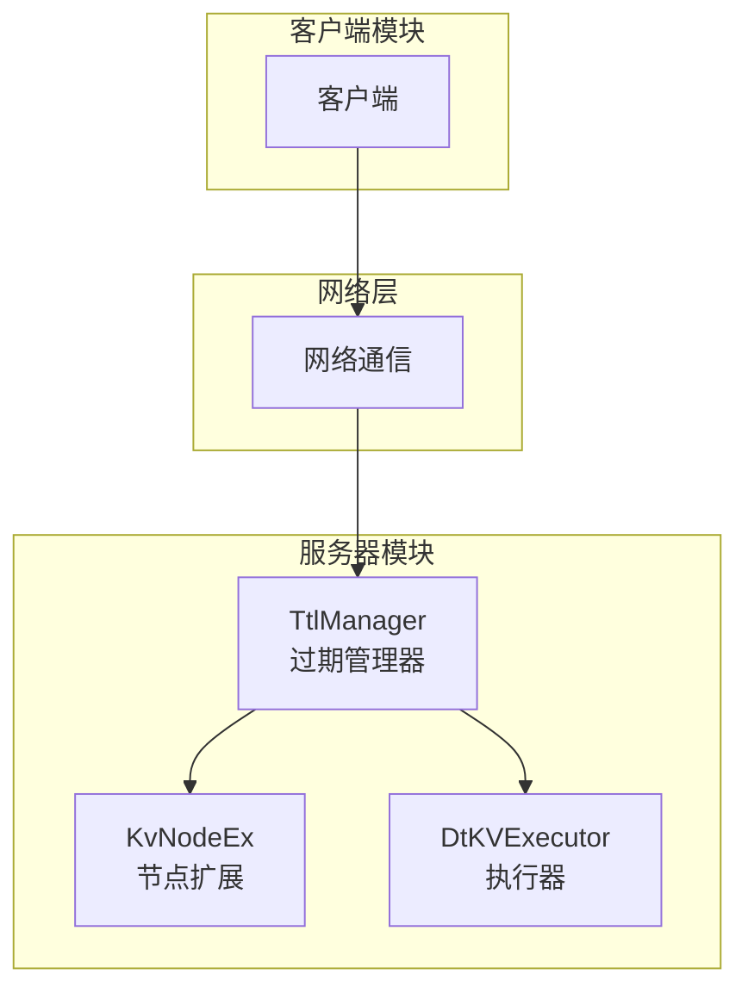
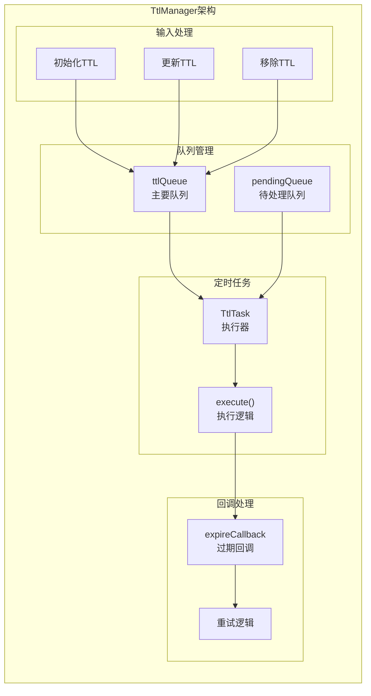
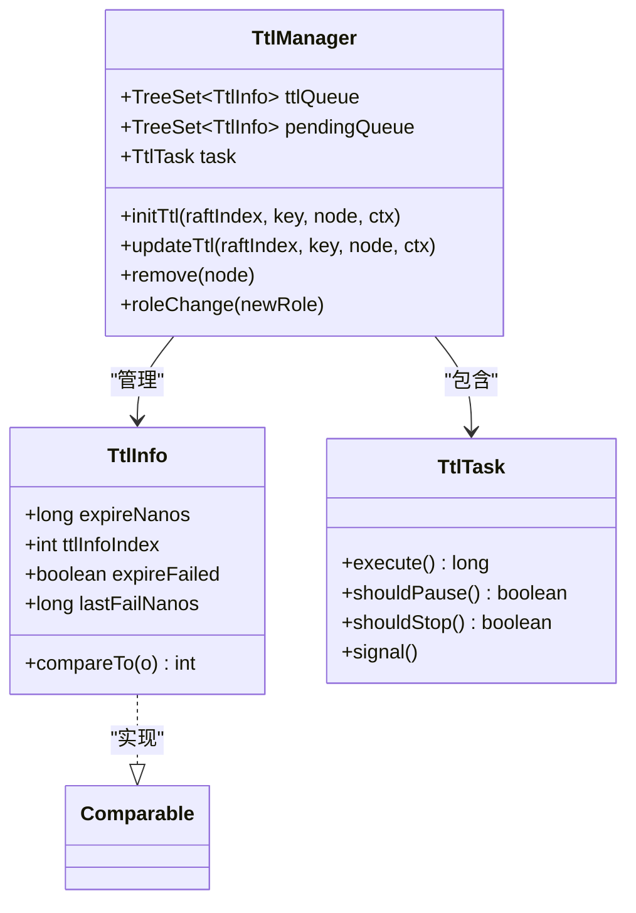
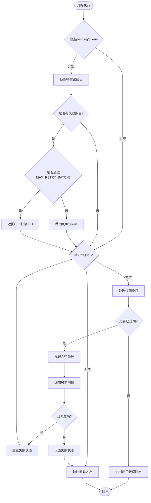
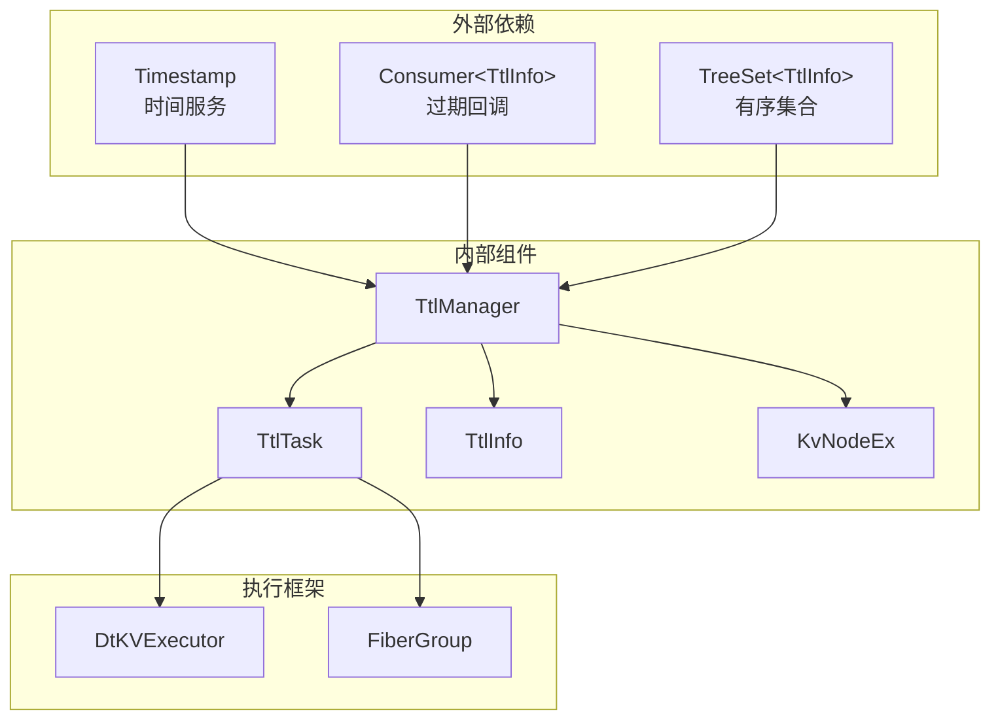

# 过期检测机制

<cite>
**本文档引用的文件**
- [TtlManager.java](file://server/src/main/java/com/github/dtprj/dongting/dtkv/server/TtlManager.java)
- [TtlManagerTest.java](file://server/src/test/java/com/github/dtprj/dongting/dtkv/server/TtlManagerTest.java)
- [KvNodeEx.java](file://server/src/main/java/com/github/dtprj/dongting/dtkv/server/KvNodeEx.java)
- [DtKVExecutor.java](file://server/src/main/java/com/github/dtprj/dongting/dtkv/server/DtKVExecutor.java)
</cite>

## 目录
1. [简介](#简介)
2. [项目结构](#项目结构)
3. [核心组件](#核心组件)
4. [架构概览](#架构概览)
5. [详细组件分析](#详细组件分析)
6. [依赖关系分析](#依赖关系分析)
7. [性能考虑](#性能考虑)
8. [故障排除指南](#故障排除指南)
9. [结论](#结论)

## 简介

TtlManager是Dongting分布式键值存储系统中的关键组件，负责管理键值对的生存时间（TTL）过期检测机制。该组件采用基于TreeSet的双队列设计，实现了高效的过期检测算法，能够精确地按照expireNanos字段进行排序，并通过时间轮算法的变体确保过期键的及时处理。

TtlManager的核心特性包括：
- 基于TreeSet的双队列过期检测机制
- 严格的排序一致性保证
- 批处理限制控制
- 故障重试机制
- Raft角色变更时的状态同步

## 项目结构

TtlManager位于Dongting项目的服务器模块中，作为分布式键值存储系统的一部分：



**图表来源**
- [TtlManager.java](file://server/src/main/java/com/github/dtprj/dongting/dtkv/server/TtlManager.java#L1-L50)
- [KvNodeEx.java](file://server/src/main/java/com/github/dtprj/dongting/dtkv/server/KvNodeEx.java#L1-L30)

**章节来源**
- [TtlManager.java](file://server/src/main/java/com/github/dtprj/dongting/dtkv/server/TtlManager.java#L1-L242)

## 核心组件

### TtlManager类

TtlManager是整个过期检测机制的核心类，包含以下关键组件：

```java
class TtlManager {
    final TreeSet<TtlInfo> ttlQueue = new TreeSet<>();      // 主要过期队列
    final TreeSet<TtlInfo> pendingQueue = new TreeSet<>();  // 待处理队列
    final TtlTask task;                                     // 定时任务
    boolean stop;                                           // 停止标志
    private RaftRole role;                                  // Raft角色状态
}
```

### TtlInfo类

TtlInfo是存储在队列中的过期信息对象，实现了Comparable接口以支持TreeSet的排序：

```java
final class TtlInfo implements Comparable<TtlInfo> {
    final long expireNanos;      // 过期时间戳（纳秒）
    final int ttlInfoIndex;      // 排序索引，用于解决时间精度问题
    boolean expireFailed;        // 是否过期失败
    long lastFailNanos;          // 最后失败时间戳
}
```

**章节来源**
- [TtlManager.java](file://server/src/main/java/com/github/dtprj/dongting/dtkv/server/TtlManager.java#L35-L242)

## 架构概览

TtlManager采用双队列架构设计，结合TreeSet的有序特性实现高效的过期检测：



**图表来源**
- [TtlManager.java](file://server/src/main/java/com/github/dtprj/dongting/dtkv/server/TtlManager.java#L49-L52)
- [TtlManager.java](file://server/src/main/java/com/github/dtprj/dongting/dtkv/server/TtlManager.java#L54-L105)

## 详细组件分析

### TreeSet双队列过期检测机制

#### ttlQueue的作用与排序机制

ttlQueue是TtlManager的主要过期检测队列，它基于TreeSet实现，具有以下特点：

1. **按expireNanos排序**：TreeSet根据TtlInfo的compareTo方法自动维护队列的有序性
2. **时间轮算法变体**：通过expireNanos字段实现类似时间轮的效果
3. **高效查找**：O(log n)时间复杂度的插入和删除操作



**图表来源**
- [TtlManager.java](file://server/src/main/java/com/github/dtprj/dongting/dtkv/server/TtlManager.java#L35-L242)

#### compareTo方法的严格排序保证

TtlInfo的compareTo方法实现了严格的排序逻辑，解决了时间精度问题：

```java
@Override
public int compareTo(TtlInfo o) {
    long x = this.expireNanos - o.expireNanos;
    if (x < 0) {
        return -1;
    } else if (x > 0) {
        return 1;
    } else {
        // 当expireNanos相同时，使用ttlInfoIndex保证排序一致性
        int y = this.ttlInfoIndex - o.ttlInfoIndex;
        return y < 0 ? -1 : y > 0 ? 1 : 0;
    }
}
```

这种设计确保了：
- **时间精度问题解决**：当多个TTL条目具有相同expireNanos时，使用索引保证顺序
- **稳定性**：相同的输入总是产生相同的排序结果
- **性能优化**：避免了浮点数比较的精度损失

**章节来源**
- [TtlManager.java](file://server/src/main/java/com/github/dtprj/dongting/dtkv/server/TtlManager.java#L215-L242)

### execute方法中的过期检测逻辑

execute方法是TtlManager的核心执行逻辑，实现了两阶段的过期检测：



**图表来源**
- [TtlManager.java](file://server/src/main/java/com/github/dtprj/dongting/dtkv/server/TtlManager.java#L54-L105)

#### nanoTime比较判断键是否过期

核心过期判断逻辑：

```java
// 检查当前时间是否已经超过过期时间
if (ttlInfo.expireNanos - ts.nanoTime > 0) {
    // 如果还有时间，返回剩余等待时间
    return ttlInfo.expireNanos - ts.nanoTime;
}
// 否则标记为待处理
it.remove();
pendingQueue.add(ttlInfo);
```

这种设计的优势：
- **精确度高**：使用nanoTime提供纳秒级精度
- **实时性强**：立即检测过期状态
- **资源友好**：未过期的条目不会被处理

**章节来源**
- [TtlManager.java](file://server/src/main/java/com/github/dtprj/dongting/dtkv/server/TtlManager.java#L80-L95)

### 批处理限制对系统性能的影响

TtlManager实现了两个关键的批处理限制：

#### MAX_EXPIRE_BATCH批处理

```java
static final int MAX_EXPIRE_BATCH = 50;

// 在处理过期条目时应用批处理限制
while (it.hasNext()) {
    if (count++ >= MAX_EXPIRE_BATCH) {
        yield = true;
        break;
    }
    // 处理过期条目...
}
```

#### MAX_RETRY_BATCH重试批处理

```java
static final int MAX_RETRY_BATCH = 10;

// 在处理重试条目时应用批处理限制
if (count++ >= MAX_RETRY_BATCH) {
    yield = true;
    break;
}
```

这些限制的设计目的：

1. **防止长时间阻塞**：避免单次执行占用过多CPU时间
2. **提高响应性**：确保其他任务也能得到及时处理
3. **资源控制**：限制内存使用和并发操作数量
4. **系统稳定性**：防止过载情况下的系统崩溃

**章节来源**
- [TtlManager.java](file://server/src/main/java/com/github/dtprj/dongting/dtkv/server/TtlManager.java#L46-L47)
- [TtlManager.java](file://server/src/main/java/com/github/dtprj/dongting/dtkv/server/TtlManager.java#L69-L84)

### 任务调度信号机制

新插入或更新的TTL条目会触发任务调度：

```java
public void initTtl(long raftIndex, ByteArray key, KvNodeEx n, KvImpl.OpContext ctx) {
    if (ctx.ttlMillis <= 0) {
        return;
    }
    if (addNodeTtlAndAddToQueue(raftIndex, key, n, ctx)) {
        // 只有当新条目成为队列头部时才需要调度
        task.signal();
    }
}

private boolean addNodeTtlAndAddToQueue(long raftIndex, ByteArray key, KvNodeEx n, 
                                       KvImpl.OpContext ctx) {
    TtlInfo ttlInfo = new TtlInfo(key, raftIndex, ctx.operator, 
                                  ctx.leaderCreateTimeMillis, ctx.ttlMillis,
                                  ctx.localCreateNanos + ctx.ttlMillis * 1_000_000, 
                                  ttlInfoIndex++);
    n.ttlInfo = ttlInfo;
    
    // 添加到队列并检查是否成为头部
    if (!ttlQueue.add(ttlInfo)) {
        BugLog.getLog().error("TtlInfo exists {}, {}", key, ttlInfo.raftIndex);
    }
    return ttlQueue.first() == ttlInfo;
}
```

这种设计的优势：
- **智能调度**：只有当新条目影响下次执行时间时才触发
- **减少开销**：避免不必要的任务调度
- **保持准确性**：确保过期检测的及时性

**章节来源**
- [TtlManager.java](file://server/src/main/java/com/github/dtprj/dongting/dtkv/server/TtlManager.java#L125-L143)

### Raft角色变更时的状态同步

```java
public void roleChange(RaftRole newRole) {
    try {
        role = newRole;
        // 将待处理队列转移到主队列
        ttlQueue.addAll(pendingQueue);
        pendingQueue.clear();
        // 触发任务调度
        task.signal();
    } catch (Throwable e) {
        BugLog.log(e);
    }
}
```

这种设计确保了：
- **状态一致性**：在角色变更时保持队列状态的一致性
- **快速响应**：立即处理所有待处理的过期条目
- **容错能力**：异常处理确保系统的稳定性

**章节来源**
- [TtlManager.java](file://server/src/main/java/com/github/dtprj/dongting/dtkv/server/TtlManager.java#L177-L187)

## 依赖关系分析

TtlManager与系统中其他组件存在密切的依赖关系：



**图表来源**
- [TtlManager.java](file://server/src/main/java/com/github/dtprj/dongting/dtkv/server/TtlManager.java#L1-L30)
- [DtKVExecutor.java](file://server/src/main/java/com/github/dtprj/dongting/dtkv/server/DtKVExecutor.java#L1-L50)

**章节来源**
- [TtlManager.java](file://server/src/main/java/com/github/dtprj/dongting/dtkv/server/TtlManager.java#L1-L30)

## 性能考虑

### 时间复杂度分析

1. **插入操作**：O(log n)，其中n是队列大小
2. **删除操作**：O(log n)
3. **过期检测**：O(1)访问队首元素
4. **批量处理**：O(k)，其中k是批处理大小

### 内存使用优化

- **紧凑的数据结构**：TtlInfo只包含必要的字段
- **延迟初始化**：队列只在需要时创建
- **及时清理**：过期条目被及时移除

### 并发性能

- **无锁设计**：TreeSet的并发性能较好
- **批处理控制**：防止过度竞争
- **异步处理**：过期回调在独立线程中执行

## 故障排除指南

### 常见问题及解决方案

#### 1. 过期回调失败

**症状**：过期条目无法正确处理
**原因**：回调函数抛出异常
**解决方案**：
- 检查回调函数的异常处理
- 查看BugLog中的错误信息
- 调整MAX_RETRY_BATCH参数

#### 2. 队列堆积

**症状**：ttlQueue或pendingQueue持续增长
**原因**：过期回调处理速度跟不上新增速度
**解决方案**：
- 增加批处理大小
- 优化回调函数性能
- 检查系统负载

#### 3. 时间不准确

**症状**：过期时间与预期不符
**原因**：系统时间调整或nanoTime精度问题
**解决方案**：
- 使用Timestamp服务获取准确时间
- 检查系统时间同步
- 验证nanoTime的可用性

**章节来源**
- [TtlManager.java](file://server/src/main/java/com/github/dtprj/dongting/dtkv/server/TtlManager.java#L95-L105)

## 结论

TtlManager通过巧妙的双队列设计和TreeSet的有序特性，实现了一个高效、可靠的过期检测机制。其核心优势包括：

1. **精确的过期检测**：基于nanoTime的纳秒级精度
2. **高效的批量处理**：通过批处理限制平衡性能和响应性
3. **严格的排序保证**：解决时间精度问题的compareTo方法
4. **灵活的任务调度**：智能的信号机制和角色变更处理
5. **良好的容错能力**：完善的异常处理和重试机制

这个设计不仅满足了分布式系统对过期检测的高要求，还展现了优秀的工程实践，为类似的系统设计提供了宝贵的参考。