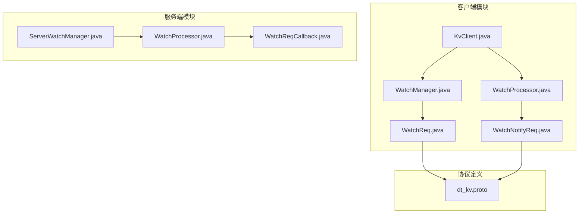
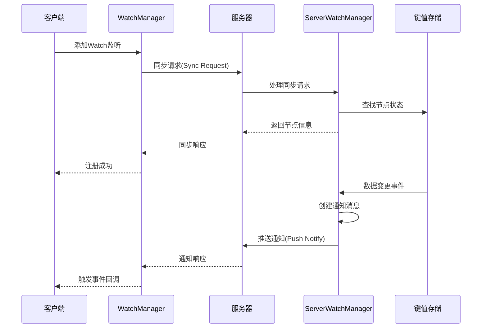
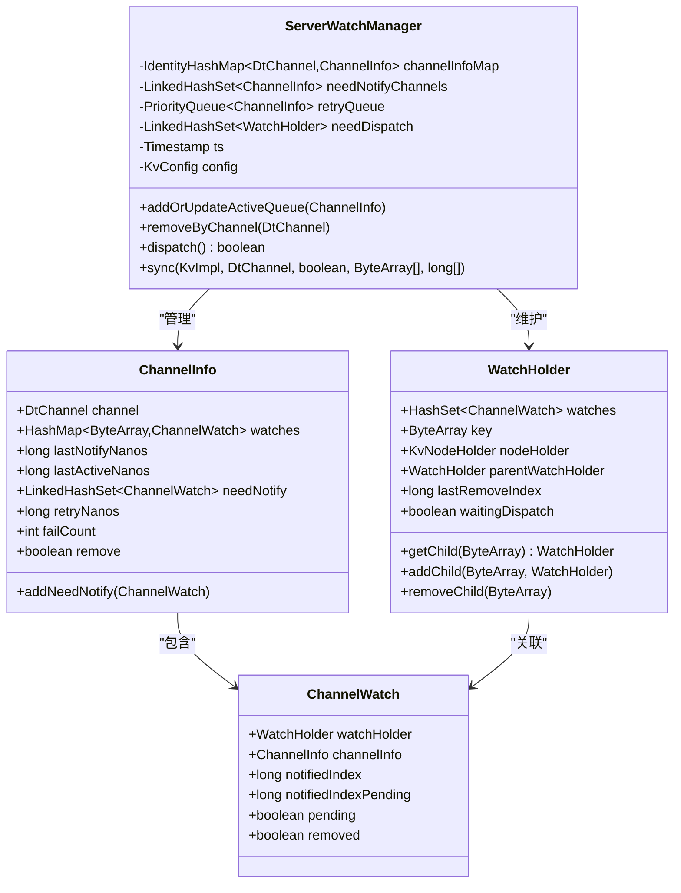
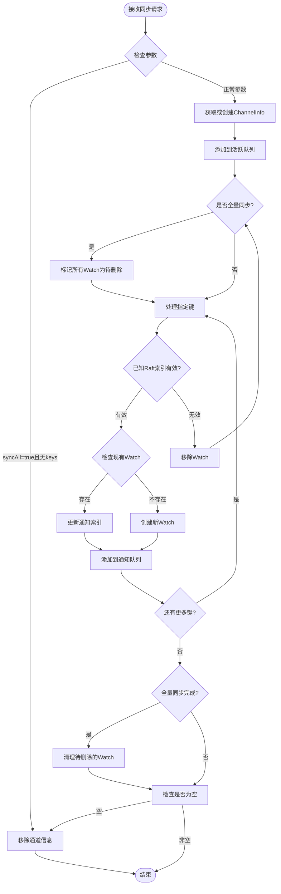
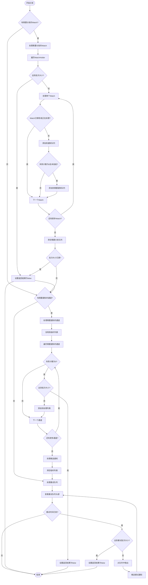
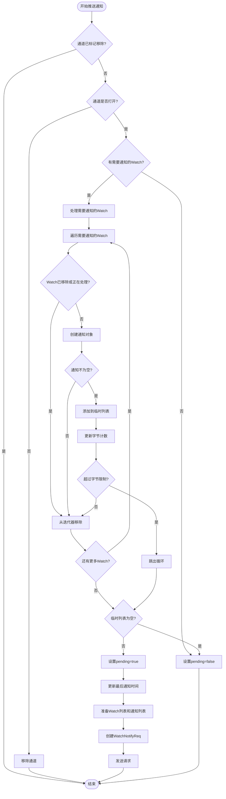
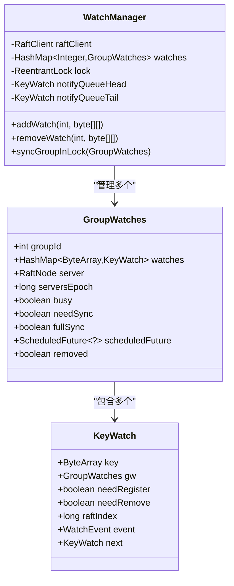
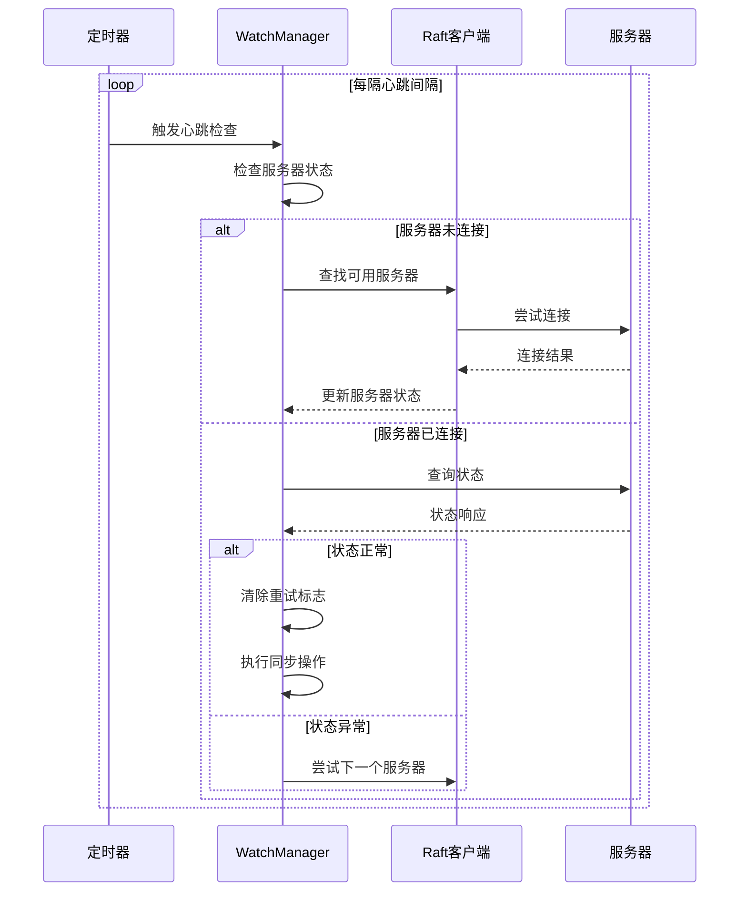
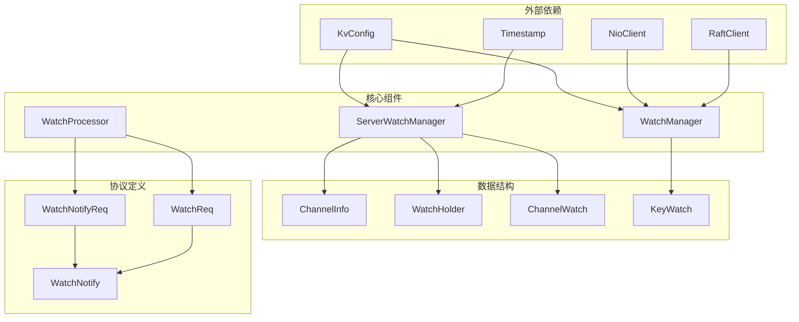

# Watch机制详细文档

<cite>
**本文档中引用的文件**
- [ServerWatchManager.java](file://server/src/main/java/com/github/dtprj/dongting/dtkv/server/ServerWatchManager.java)
- [WatchManager.java](file://client/src/main/java/com/github/dtprj/dongting/dtkv/WatchManager.java)
- [WatchProcessor.java](file://client/src/main/java/com/github/dtprj/dongting/dtkv/WatchProcessor.java)
- [dt_kv.proto](file://server/src/test/proto/dt_kv.proto)
- [ServerWatchManagerTest.java](file://server/src/test/java/com/github/dtprj/dongting/dtkv/server/ServerWatchManagerTest.java)
- [WatchManagerTest.java](file://server/src/test/java/com/github/dtprj/dongting/dtkv/server/WatchManagerTest.java)
- [KvClient.java](file://client/src/main/java/com/github/dtprj/dongting/dtkv/KvClient.java)
</cite>

## 目录
1. [简介](#简介)
2. [项目结构](#项目结构)
3. [核心组件](#核心组件)
4. [架构概览](#架构概览)
5. [详细组件分析](#详细组件分析)
6. [依赖关系分析](#依赖关系分析)
7. [性能考虑](#性能考虑)
8. [故障排除指南](#故障排除指南)
9. [结论](#结论)

## 简介

Dongting的Watch机制是一个高效的数据变更监听系统，用于实时跟踪键值存储中的数据变化。该机制通过ServerWatchManager和WatchManager两个核心组件协同工作，实现了客户端与服务器之间的事件通知和状态同步。

Watch机制的主要特点包括：
- 基于树形结构的WatchHolder管理
- 智能的事件分发和批量处理
- 自动重试机制和连接故障恢复
- 支持大批量通知和流量控制
- 高效的内存管理和资源回收

## 项目结构

Watch机制涉及以下关键文件：

**图表来源**
- [KvClient.java](file://client/src/main/java/com/github/dtprj/dongting/dtkv/KvClient.java#L1-L50)
- [ServerWatchManager.java](file://server/src/main/java/com/github/dtprj/dongting/dtkv/server/ServerWatchManager.java#L1-L50)

## 核心组件

### ServerWatchManager（服务器端Watch管理器）

ServerWatchManager是Watch机制的核心组件，负责管理客户端连接、事件分发和重试机制。

主要职责：
- 管理客户端通道信息
- 维护WatchHolder树形结构
- 处理事件通知和批量推送
- 实现自动重试和故障恢复
- 控制通知频率和流量限制

### WatchManager（客户端Watch管理器）

WatchManager运行在客户端，负责与服务器建立连接并维护Watch状态。

主要职责：
- 管理本地Watch状态
- 发送同步请求到服务器
- 处理服务器响应和错误
- 实现心跳检测和服务器发现
- 协调事件回调处理

**章节来源**
- [ServerWatchManager.java](file://server/src/main/java/com/github/dtprj/dongting/dtkv/server/ServerWatchManager.java#L46-L117)
- [WatchManager.java](file://client/src/main/java/com/github/dtprj/dongting/dtkv/WatchManager.java#L45-L100)

## 架构概览

Watch机制采用分层架构设计，分为客户端和服务端两部分：

**图表来源**
- [ServerWatchManager.java](file://server/src/main/java/com/github/dtprj/dongting/dtkv/server/ServerWatchManager.java#L285-L321)
- [WatchManager.java](file://client/src/main/java/com/github/dtprj/dongting/dtkv/WatchManager.java#L200-L250)

## 详细组件分析

### ServerWatchManager详细分析

#### 核心数据结构

ServerWatchManager使用多种数据结构来管理Watch状态：

**图表来源**
- [ServerWatchManager.java](file://server/src/main/java/com/github/dtprj/dongting/dtkv/server/ServerWatchManager.java#L57-L117)
- [ServerWatchManager.java](file://server/src/main/java/com/github/dtprj/dongting/dtkv/server/ServerWatchManager.java#L570-L629)

#### sync方法工作原理

sync方法负责处理客户端的同步请求，建立或更新Watch关系：

**图表来源**
- [ServerWatchManager.java](file://server/src/main/java/com/github/dtprj/dongting/dtkv/server/ServerWatchManager.java#L631-L730)

#### dispatch方法工作原理

dispatch方法负责事件分发和通知推送：

**图表来源**
- [ServerWatchManager.java](file://server/src/main/java/com/github/dtprj/dongting/dtkv/server/ServerWatchManager.java#L180-L280)

#### pushNotify方法工作原理

pushNotify方法负责向客户端推送通知消息：

**图表来源**
- [ServerWatchManager.java](file://server/src/main/java/com/github/dtprj/dongting/dtkv/server/ServerWatchManager.java#L285-L321)

### WatchManager详细分析

#### 客户端状态管理

WatchManager使用GroupWatches类来管理每个Raft组的Watch状态：

**图表来源**
- [WatchManager.java](file://client/src/main/java/com/github/dtprj/dongting/dtkv/WatchManager.java#L60-L100)
- [WatchManager.java](file://client/src/main/java/com/github/dtprj/dongting/dtkv/WatchManager.java#L100-L150)

#### 心跳检测和服务器发现

WatchManager实现了心跳检测机制来确保服务器连接的可靠性：

**图表来源**
- [WatchManager.java](file://client/src/main/java/com/github/dtprj/dongting/dtkv/WatchManager.java#L200-L250)

**章节来源**
- [ServerWatchManager.java](file://server/src/main/java/com/github/dtprj/dongting/dtkv/server/ServerWatchManager.java#L46-L730)
- [WatchManager.java](file://client/src/main/java/com/github/dtprj/dongting/dtkv/WatchManager.java#L45-L400)

## 依赖关系分析

Watch机制的依赖关系如下图所示：

**图表来源**
- [ServerWatchManager.java](file://server/src/main/java/com/github/dtprj/dongting/dtkv/server/ServerWatchManager.java#L20-L40)
- [WatchManager.java](file://client/src/main/java/com/github/dtprj/dongting/dtkv/WatchManager.java#L20-L40)

**章节来源**
- [ServerWatchManager.java](file://server/src/main/java/com/github/dtprj/dongting/dtkv/server/ServerWatchManager.java#L1-L50)
- [WatchManager.java](file://client/src/main/java/com/github/dtprj/dongting/dtkv/WatchManager.java#L1-L50)

## 性能考虑

### 批量处理优化

Watch机制实现了多项性能优化措施：

1. **批量通知处理**：每次推送最多处理`watchMaxBatchSize`个通知
2. **字节限制控制**：单次推送不超过`watchMaxReqBytes`字节
3. **智能重试策略**：使用指数退避算法进行重试
4. **内存池化**：复用临时对象减少GC压力

### 内存管理

- 使用`ArrayList`和`HashMap`的预分配容量
- 及时清理不再使用的Watch对象
- 通过`WeakReference`避免内存泄漏

### 并发控制

- 使用`ReentrantLock`保护共享状态
- 无锁队列用于事件分发
- 原子操作保证状态一致性

## 故障排除指南

### 常见问题及解决方案

#### 连接超时问题

**症状**：Watch请求频繁超时
**原因**：网络延迟或服务器负载过高
**解决方案**：
1. 调整`heartbeatIntervalMillis`参数
2. 增加`watchMaxBatchSize`以减少请求频率
3. 检查服务器资源使用情况

#### 重试次数过多

**症状**：Watch通知持续失败
**原因**：网络不稳定或服务器配置问题
**解决方案**：
1. 检查网络连通性
2. 调整重试间隔数组
3. 验证服务器配置

#### 内存泄漏

**症状**：长时间运行后内存占用持续增长
**原因**：Watch对象未正确清理
**解决方案**：
1. 确保调用`removeWatch`方法
2. 检查异常处理逻辑
3. 监控`channelInfoMap`大小

**章节来源**
- [ServerWatchManager.java](file://server/src/main/java/com/github/dtprj/dongting/dtkv/server/ServerWatchManager.java#L570-L629)
- [WatchManager.java](file://client/src/main/java/com/github/dtprj/dongting/dtkv/WatchManager.java#L200-L250)

## 结论

Dongting的Watch机制是一个设计精良的事件通知系统，具有以下优势：

1. **高可靠性**：完善的重试机制和故障恢复策略
2. **高性能**：批量处理和智能调度算法
3. **可扩展性**：支持大规模并发连接
4. **易维护**：清晰的代码结构和完善的测试覆盖

该机制为分布式键值存储提供了强大的数据变更监听能力，是实现低延迟事件驱动应用的重要基础设施。通过合理配置参数和监控系统状态，可以确保Watch机制在生产环境中的稳定运行。