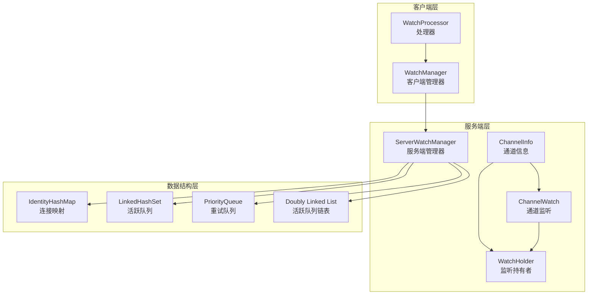
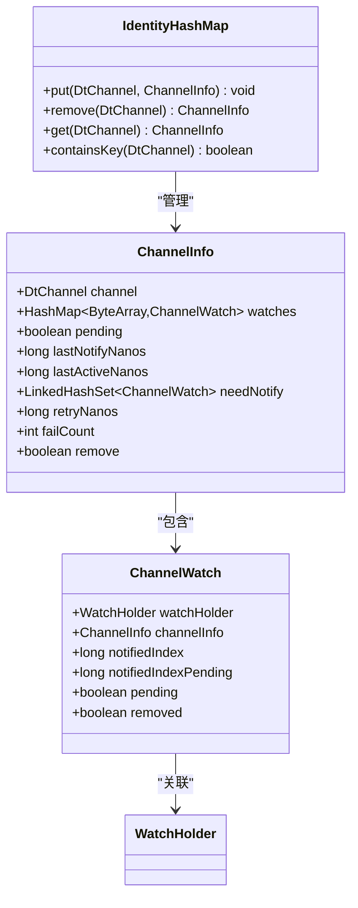
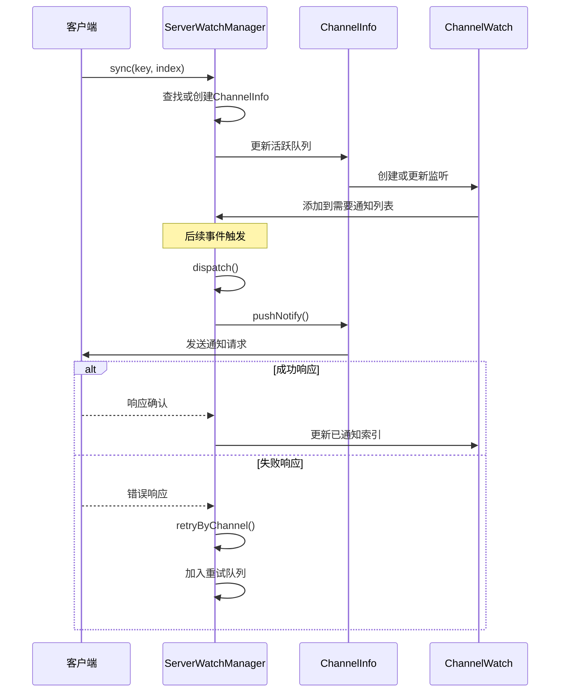
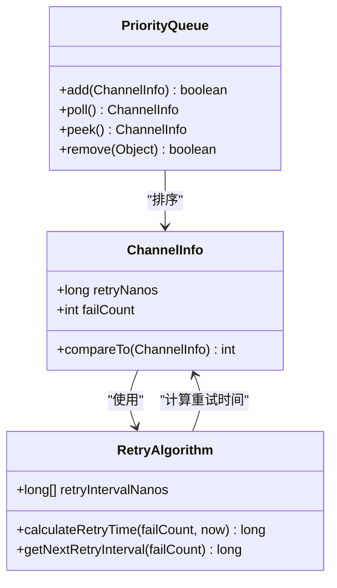
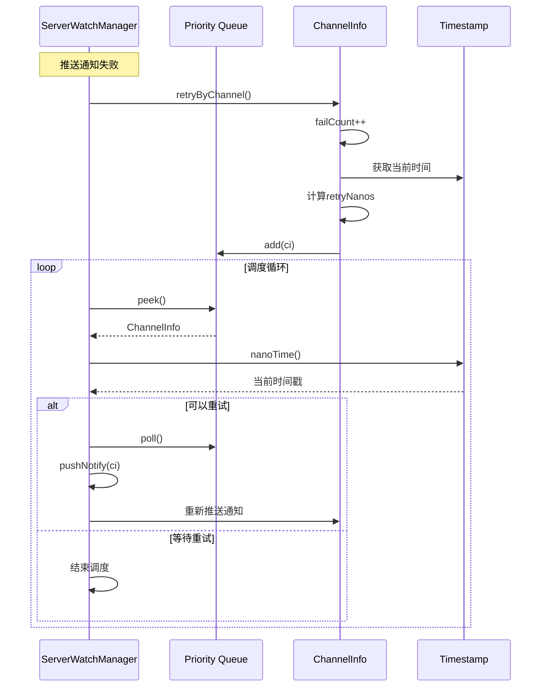
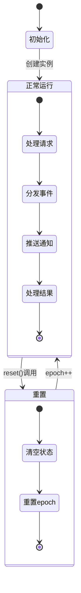
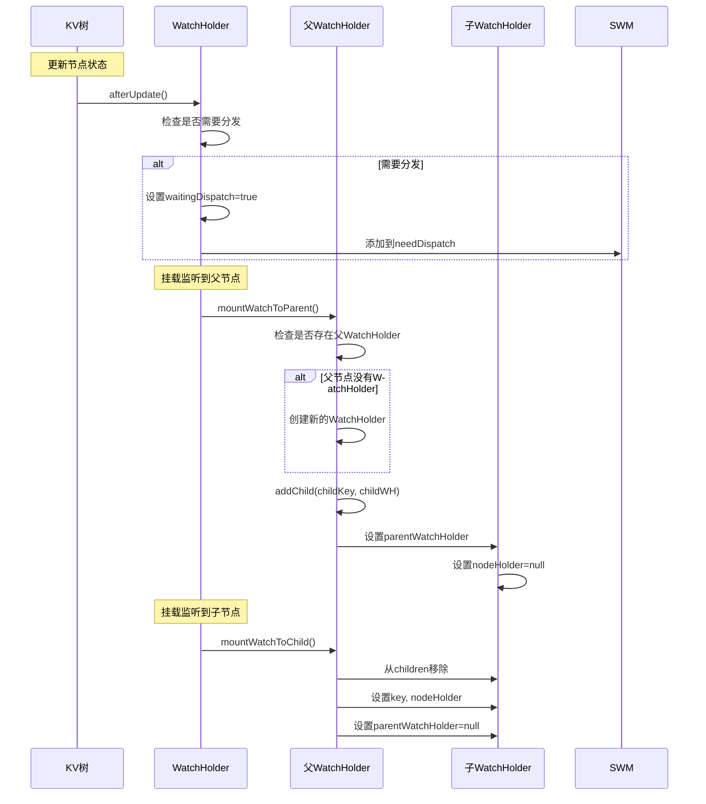
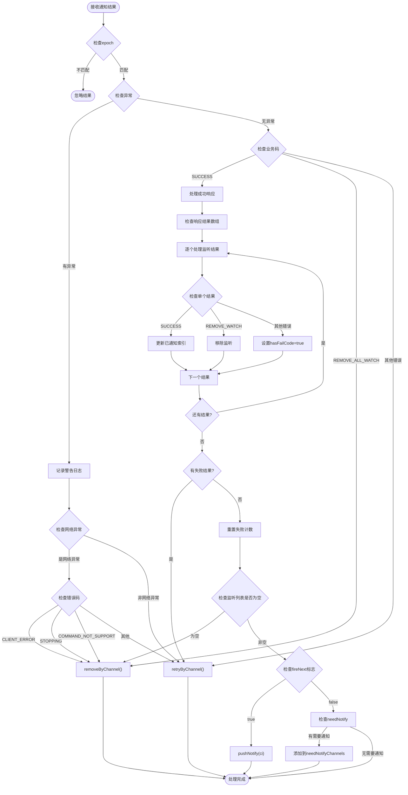

# Watch管理器架构文档

<cite>
**本文档中引用的文件**
- [ServerWatchManager.java](file://server/src/main/java/com/github/dtprj/dongting/dtkv/server/ServerWatchManager.java)
- [WatchManager.java](file://client/src/main/java/com/github/dtprj/dongting/dtkv/WatchManager.java)
- [WatchProcessor.java](file://client/src/main/java/com/github/dtprj/dongting/dtkv/WatchProcessor.java)
- [KvConfig.java](file://server/src/main/java/com/github/dtprj/dongting/dtkv/server/KvConfig.java)
- [ServerWatchManagerTest.java](file://server/src/test/java/com/github/dtprj/dongting/dtkv/server/ServerWatchManagerTest.java)
- [WatchManagerTest.java](file://server/src/test/java/com/github/dtprj/dongting/dtkv/server/WatchManagerTest.java)
</cite>

## 目录
1. [简介](#简介)
2. [系统架构概览](#系统架构概览)
3. [核心组件分析](#核心组件分析)
4. [ChannelInfoMap连接管理机制](#channelinfomap连接管理机制)
5. [needNotifyChannels活跃通道队列调度策略](#neednotifychannels活跃通道队列调度策略)
6. [retryQueue重试队列的指数退避算法](#retryqueue重试队列的指数退避算法)
7. [epoch机制与时序一致性保证](#epoch机制与时序一致性保证)
8. [数据结构选择分析](#数据结构选择分析)
9. [事件分发流程](#事件分发流程)
10. [性能优化策略](#性能优化策略)
11. [故障处理与恢复](#故障处理与恢复)
12. [总结](#总结)

## 简介

ServerWatchManager是Dongting分布式键值存储系统中的核心事件分发中枢，负责管理客户端连接、协调事件通知分发以及维护时序一致性。该组件采用精心设计的数据结构和算法，确保高并发环境下的可靠性和性能。

## 系统架构概览



**图表来源**
- [ServerWatchManager.java](file://server/src/main/java/com/github/dtprj/dongting/dtkv/server/ServerWatchManager.java#L46-L70)
- [WatchManager.java](file://client/src/main/java/com/github/dtprj/dongting/dtkv/WatchManager.java#L47-L60)

## 核心组件分析

### ServerWatchManager抽象类

ServerWatchManager是一个抽象基类，定义了Watch管理的核心逻辑和数据结构：

```java
abstract class ServerWatchManager {
    private final IdentityHashMap<DtChannel, ChannelInfo> channelInfoMap = new IdentityHashMap<>();
    private final LinkedHashSet<ChannelInfo> needNotifyChannels = new LinkedHashSet<>();
    private final PriorityQueue<ChannelInfo> retryQueue = new PriorityQueue<>();
    ChannelInfo activeQueueHead;
    ChannelInfo activeQueueTail;
    
    private final LinkedHashSet<WatchHolder> needDispatch = new LinkedHashSet<>();
    private final int groupId;
    private final Timestamp ts;
    private final KvConfig config;
    private final long[] retryIntervalNanos;
    private int epoch;
}
```

**章节来源**
- [ServerWatchManager.java](file://server/src/main/java/com/github/dtprj/dongting/dtkv/server/ServerWatchManager.java#L46-L70)

### 数据结构设计原理

1. **IdentityHashMap用于连接映射**：使用对象引用比较，避免哈希冲突
2. **LinkedHashSet保持插入顺序**：确保公平的调度策略
3. **PriorityQueue支持优先级调度**：实现指数退避算法
4. **双向链表维护活跃队列**：O(1)时间复杂度的队列操作

## ChannelInfoMap连接管理机制

### IdentityHashMap的优势



**图表来源**
- [ServerWatchManager.java](file://server/src/main/java/com/github/dtprj/dongting/dtkv/server/ServerWatchManager.java#L48-L50)
- [ServerWatchManager.java](file://server/src/main/java/com/github/dtprj/dongting/dtkv/server/ServerWatchManager.java#L580-L620)

### 连接生命周期管理



**图表来源**
- [ServerWatchManager.java](file://server/src/main/java/com/github/dtprj/dongting/dtkv/server/ServerWatchManager.java#L285-L343)
- [ServerWatchManager.java](file://server/src/main/java/com/github/dtprj/dongting/dtkv/server/ServerWatchManager.java#L407-L480)

**章节来源**
- [ServerWatchManager.java](file://server/src/main/java/com/github/dtprj/dongting/dtkv/server/ServerWatchManager.java#L140-L180)

## needNotifyChannels活跃通道队列调度策略

### 调度算法设计

```mermaid
flowchart TD
Start([开始调度]) --> CheckNeedDispatch{"检查needDispatch<br/>是否有待分发监听"}
CheckNeedDispatch --> |有| ProcessNeedDispatch["处理待分发监听"]
CheckNeedDispatch --> |无| CheckNeedNotify{"检查needNotifyChannels<br/>是否有待通知通道"}
ProcessNeedDispatch --> IterateNeedDispatch["遍历needDispatch集合"]
IterateNeedDispatch --> GetWatchHolder["获取WatchHolder"]
GetWatchHolder --> IterateWatches["遍历所有监听"]
IterateWatches --> CheckWatchStatus{"检查监听状态"}
CheckWatchStatus --> |有效| AddToNeedNotify["添加到needNotify"]
CheckWatchStatus --> |无效| NextWatch["下一个监听"]
AddToNeedNotify --> CheckFailCount{"检查失败计数"}
CheckFailCount --> |0且非pending| AddToNeedNotifyChannels["添加到needNotifyChannels"]
CheckFailCount --> |非0或pending| NextWatch
AddToNeedNotifyChannels --> NextWatch
NextWatch --> MoreWatches{"还有监听?"}
MoreWatches --> |是| IterateWatches
MoreWatches --> |否| MarkAsProcessed["标记为已处理"]
MarkAsProcessed --> NextNeedDispatch["下一个WatchHolder"]
NextNeedDispatch --> MoreNeedDispatch{"还有待分发?"}
MoreNeedDispatch --> |是| IterateNeedDispatch
MoreNeedDispatch --> |否| CheckNeedNotify
CheckNeedNotify --> |有| ProcessNeedNotify["处理待通知通道"]
CheckNeedNotify --> |无| CheckRetryQueue{"检查retryQueue<br/>是否有可重试通道"}
ProcessNeedNotify --> IterateNeedNotify["遍历needNotifyChannels"]
IterateNeedNotify --> PushNotify["pushNotify(ci)"]
PushNotify --> SendRequest["发送通知请求"]
SendRequest --> NextNeedNotify["下一个通道"]
NextNeedNotify --> MoreNeedNotify{"还有通道?"}
MoreNeedNotify --> |是| IterateNeedNotify
MoreNeedNotify --> |否| CheckRetryQueue
CheckRetryQueue --> |有| PeekRetryQueue["peek retryQueue"]
PeekRetryQueue --> CheckRetryTime{"检查重试时间"}
CheckRetryTime --> |已到重试时间| PollRetryQueue["poll retryQueue"]
CheckRetryTime --> |未到重试时间| End([调度结束])
PollRetryQueue --> PushNotifyRetry["pushNotify(ci)"]
PushNotifyRetry --> CheckRetryBatch{"检查批次大小"}
CheckRetryBatch --> |超过限制| End
CheckRetryBatch --> |未超限| CheckMoreRetry{"还有重试通道?"}
CheckMoreRetry --> |是| PeekRetryQueue
CheckMoreRetry --> |否| End
CheckNeedDispatch --> End
```



**图表来源**
- [ServerWatchManager.java](file://server/src/main/java/com/github/dtprj/dongting/dtkv/server/ServerWatchManager.java#L182-L243)

### 批量处理优化

系统实现了批量处理机制，通过配置参数控制处理规模：

```java
// 批量大小配置
private final int dispatchBatchSize = config.watchMaxBatchSize;

// 批量处理逻辑
while (it.hasNext()) {
    WatchHolder wh = it.next();
    if (++count > dispatchBatchSize) {
        result = false;
        break;
    }
    // 处理监听...
}
```

**章节来源**
- [ServerWatchManager.java](file://server/src/main/java/com/github/dtprj/dongting/dtkv/server/ServerWatchManager.java#L182-L243)

## retryQueue重试队列的指数退避算法

### 指数退避实现



**图表来源**
- [ServerWatchManager.java](file://server/src/main/java/com/github/dtprj/dongting/dtkv/server/ServerWatchManager.java#L52-L54)
- [ServerWatchManager.java](file://server/src/main/java/com/github/dtprj/dongting/dtkv/server/ServerWatchManager.java#L500-L520)

### 重试策略配置

默认重试间隔配置：
- 第1次失败：1秒
- 第2次失败：10秒  
- 第3次失败：30秒
- 第4次失败：60秒

```java
// 默认重试间隔配置
this.retryIntervalNanos = new long[]{1000, 10_000, 30_000, 60_000};

// 计算下次重试时间
int idx = Math.min(ci.failCount - 1, retryIntervalNanos.length - 1);
ci.retryNanos = ts.nanoTime + retryIntervalNanos[idx];
```

### 重试队列调度流程



**图表来源**
- [ServerWatchManager.java](file://server/src/main/java/com/github/dtprj/dongting/dtkv/server/ServerWatchManager.java#L500-L520)

**章节来源**
- [ServerWatchManager.java](file://server/src/main/java/com/github/dtprj/dongting/dtkv/server/ServerWatchManager.java#L500-L520)

## epoch机制与时序一致性保证

### Epoch设计原理



**图表来源**
- [ServerWatchManager.java](file://server/src/main/java/com/github/dtprj/dongting/dtkv/server/ServerWatchManager.java#L70-L72)

### 时序一致性保障

```java
// 重置方法实现
public void reset() {
    epoch++;
    needNotifyChannels.clear();
    channelInfoMap.clear();
    retryQueue.clear();
    activeQueueHead = null;
    activeQueueTail = null;
}

// 结果处理时验证epoch
public void processNotifyResult(ChannelInfo ci, ArrayList<ChannelWatch> watches,
                                ReadPacket<WatchNotifyRespCallback> result,
                                Throwable ex, int requestEpoch, boolean fireNext) {
    try {
        if (epoch != requestEpoch) {
            return; // 忽略过期的结果
        }
        // 处理正常结果...
    } catch (Exception e) {
        log.error("", e);
    }
}
```

### 时序问题防护

1. **请求-响应匹配**：通过epoch字段确保请求和响应匹配
2. **状态清理**：重置时清理所有状态，防止旧状态干扰
3. **幂等性保证**：过期的请求会被自动忽略

**章节来源**
- [ServerWatchManager.java](file://server/src/main/java/com/github/dtprj/dongting/dtkv/server/ServerWatchManager.java#L76-L82)
- [ServerWatchManager.java](file://server/src/main/java/com/github/dtprj/dongting/dtkv/server/ServerWatchManager.java#L374-L405)

## 数据结构选择分析

### LinkedHashSet vs PriorityQueue选择依据

```mermaid
graph LR
subgraph "LinkedHashSet特性"
LHS1[保持插入顺序]
LHS2[快速查找]
LHS3[去重功能]
LHS4[迭代有序]
end
subgraph "PriorityQueue特性"
PQ1[优先级排序]
PQ2[O(log n)插入]
PQ3[O(1)访问最小元素]
PQ4[基于比较器]
end
subgraph "使用场景"
SC1[needNotifyChannels<br/>公平调度]
SC2[retryQueue<br/>优先级重试]
end
LHS1 --> SC1
PQ1 --> SC2
PQ2 --> SC2
PQ3 --> SC2
```

### 性能对比分析

| 数据结构 | 插入复杂度 | 查找复杂度 | 删除复杂度 | 排序特性 |
|---------|-----------|-----------|-----------|----------|
| LinkedHashSet | O(1) | O(1) | O(1) | 插入顺序 |
| PriorityQueue | O(log n) | O(n) | O(log n) | 优先级顺序 |

### 内存使用优化

```java
// 预分配容量减少扩容开销
private final ArrayList<Pair<ChannelWatch, WatchNotify>> pushNotifyTempList = new ArrayList<>(64);
private final ArrayList<ChannelInfo> dispatchTempList;
private final int dispatchBatchSize = config.watchMaxBatchSize;

// 使用临时列表避免频繁创建对象
ArrayList<Pair<ChannelWatch, WatchNotify>> list = pushNotifyTempList;
try {
    // 处理逻辑...
} finally {
    list.clear(); // 重用列表
}
```

**章节来源**
- [ServerWatchManager.java](file://server/src/main/java/com/github/dtprj/dongting/dtkv/server/ServerWatchManager.java#L60-L62)
- [ServerWatchManager.java](file://server/src/main/java/com/github/dtprj/dongting/dtkv/server/ServerWatchManager.java#L285-L343)

## 事件分发流程

### 完整分发流程

```mermaid
flowchart TD
Start([事件触发]) --> UpdateKvTree["更新KV树"]
UpdateKvTree --> AfterUpdate["afterUpdate()"]
AfterUpdate --> MountWatch["挂载监听到父节点"]
MountWatch --> NeedDispatch["添加到needDispatch"]
NeedDispatch --> Dispatch["dispatch()"]
Dispatch --> CheckNeedDispatch{"needDispatch中有监听?"}
CheckNeedDispatch --> |是| ProcessNeedDispatch["处理待分发监听"]
CheckNeedDispatch --> |否| CheckNeedNotify{"needNotifyChannels中有通道?"}
ProcessNeedDispatch --> IterateWatchHolders["遍历WatchHolder"]
IterateWatchHolders --> CheckWatches["检查每个监听"]
CheckWatches --> AddNeedNotify["添加到needNotify"]
AddNeedNotify --> CheckFailCount{"检查失败计数"}
CheckFailCount --> |0且非pending| AddToNeedNotifyChannels["添加到needNotifyChannels"]
CheckFailCount --> |非0或pending| NextWatch["下一个监听"]
AddToNeedNotifyChannels --> NextWatch
NextWatch --> MoreWatches{"还有监听?"}
MoreWatches --> |是| CheckWatches
MoreWatches --> |否| NextHolder["下一个WatchHolder"]
NextHolder --> MoreHolders{"还有WatchHolder?"}
MoreHolders --> |是| IterateWatchHolders
MoreHolders --> |否| CheckNeedNotify
CheckNeedNotify --> |是| ProcessNeedNotify["处理待通知通道"]
CheckNeedNotify --> |否| CheckRetryQueue{"retryQueue中有通道?"}
ProcessNeedNotify --> IterateNeedNotify["遍历needNotifyChannels"]
IterateNeedNotify --> PushNotify["pushNotify(ci)"]
PushNotify --> CreateNotify["createNotify(w)"]
CreateNotify --> BuildRequest["构建WatchNotifyReq"]
BuildRequest --> SendRequest["发送RPC请求"]
SendRequest --> HandleResponse["处理响应"]
HandleResponse --> UpdateState["更新状态"]
UpdateState --> NextNeedNotify["下一个通道"]
NextNeedNotify --> MoreNeedNotify{"还有通道?"}
MoreNeedNotify --> |是| IterateNeedNotify
MoreNeedNotify --> |否| CheckRetryQueue
CheckRetryQueue --> |是| PeekRetryQueue["peek retryQueue"]
PeekRetryQueue --> CheckRetryTime{"检查重试时间"}
CheckRetryTime --> |已到重试时间| PollRetryQueue["poll retryQueue"]
CheckRetryTime --> |未到重试时间| End([分发完成])
PollRetryQueue --> PushNotifyRetry["pushNotify(ci)"]
PushNotifyRetry --> CheckRetryBatch{"检查重试批次"}
CheckRetryBatch --> |超过限制| End
CheckRetryBatch --> |未超限| CheckMoreRetry{"还有重试通道?"}
CheckMoreRetry --> |是| PeekRetryQueue
CheckMoreRetry --> |否| End
CheckNeedDispatch --> End
```



**图表来源**
- [ServerWatchManager.java](file://server/src/main/java/com/github/dtprj/dongting/dtkv/server/ServerWatchManager.java#L182-L243)
- [ServerWatchManager.java](file://server/src/main/java/com/github/dtprj/dongting/dtkv/server/ServerWatchManager.java#L285-L343)

### 监听挂载机制



**图表来源**
- [ServerWatchManager.java](file://server/src/main/java/com/github/dtprj/dongting/dtkv/server/ServerWatchManager.java#L150-L180)

**章节来源**
- [ServerWatchManager.java](file://server/src/main/java/com/github/dtprj/dongting/dtkv/server/ServerWatchManager.java#L182-L243)

## 性能优化策略

### 批量处理优化

```java
// 批量大小配置
public int watchMaxBatchSize = 100;

// 批量处理逻辑
int dispatchBatchSize = config.watchMaxBatchSize;
int count = 0;
while (it.hasNext()) {
    WatchHolder wh = it.next();
    if (++count > dispatchBatchSize) {
        result = false;
        break;
    }
    // 处理监听...
}
```

### 内存池化优化

```java
// 重用临时列表
private final ArrayList<Pair<ChannelWatch, WatchNotify>> pushNotifyTempList = new ArrayList<>(64);
private final ArrayList<ChannelInfo> dispatchTempList;

// 在finally块中清理列表
finally {
    list.clear(); // 避免内存泄漏
}
```

### 请求大小限制

```java
// 单个请求的最大字节数
public int watchMaxReqBytes = 80 * 1024;

// 按字节大小限制请求内容
int bytes = 0;
while (it.hasNext()) {
    ChannelWatch w = it.next();
    it.remove();
    if (w.removed || w.pending) {
        continue;
    }
    WatchNotify wn = createNotify(w);
    if (wn != null) {
        list.add(new Pair<>(w, wn));
        w.pending = true;
        bytes += wn.key.length + (wn.value == null ? 0 : wn.value.length);
        if (bytes > config.watchMaxReqBytes) {
            break; // 超过限制，停止添加
        }
    }
}
```

**章节来源**
- [KvConfig.java](file://server/src/main/java/com/github/dtprj/dongting/dtkv/server/KvConfig.java#L25-L26)
- [ServerWatchManager.java](file://server/src/main/java/com/github/dtprj/dongting/dtkv/server/ServerWatchManager.java#L312-L315)

## 故障处理与恢复

### 连接故障检测



**图表来源**
- [ServerWatchManager.java](file://server/src/main/java/com/github/dtprj/dongting/dtkv/server/ServerWatchManager.java#L374-L480)

### 超时清理机制

```java
public void cleanTimeoutChannel(long timeoutNanos) {
    try {
        while (activeQueueHead != null) {
            if (ts.nanoTime - activeQueueHead.lastActiveNanos > timeoutNanos) {
                removeByChannel(activeQueueHead.channel);
            } else {
                return; // 从头开始按顺序清理，遇到活跃通道停止
            }
        }
    } catch (Throwable e) {
        log.error("", e);
    }
}
```

### 连接状态管理

```java
// 连接关闭检测
if (!ci.channel.getChannel().isOpen()) {
    removeByChannel(ci.channel);
    return;
}

// 更新活跃状态
public int updateWatchStatus(DtChannel dtc) {
    ChannelInfo ci = channelInfoMap.get(dtc);
    if (ci == null) {
        return 0;
    } else {
        if (ts.nanoTime - ci.lastNotifyNanos > 1_000_000_000L) {
            ci.needNotify = null; // 超过1秒未通知，清空待通知列表
        }
        ci.lastActiveNanos = ts.nanoTime;
        addOrUpdateActiveQueue(ci);
        return ci.watches.size();
    }
}
```

**章节来源**
- [ServerWatchManager.java](file://server/src/main/java/com/github/dtprj/dongting/dtkv/server/ServerWatchManager.java#L482-L490)
- [ServerWatchManager.java](file://server/src/main/java/com/github/dtprj/dongting/dtkv/server/ServerWatchManager.java#L680-L695)

## 总结

ServerWatchManager作为Dongting系统的核心组件，通过精心设计的数据结构和算法实现了高效的事件分发机制。其主要特点包括：

### 核心优势

1. **高效的数据结构选择**：IdentityHashMap提供快速连接查找，LinkedHashSet保证公平调度，PriorityQueue支持优先级重试
2. **完善的故障处理机制**：指数退避算法、epoch时序保护、连接状态监控
3. **性能优化策略**：批量处理、内存池化、请求大小限制
4. **灵活的扩展能力**：支持动态配置、多组管理、树形监听结构

### 设计亮点

- **epoch机制**：确保时序一致性，防止过期请求干扰
- **双队列调度**：needNotifyChannels保证公平性，retryQueue实现智能重试
- **树形监听结构**：支持目录监听，减少冗余通知
- **批量处理优化**：提升吞吐量，降低系统开销

### 应用价值

ServerWatchManager为分布式键值存储系统提供了可靠的事件通知基础设施，支持高并发场景下的稳定运行，是构建大规模分布式系统的优秀实践案例。