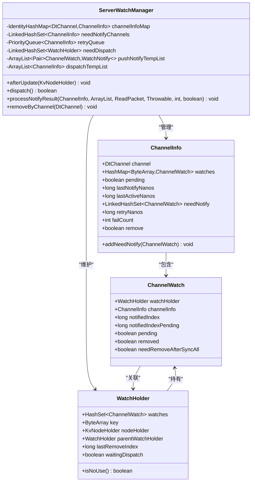
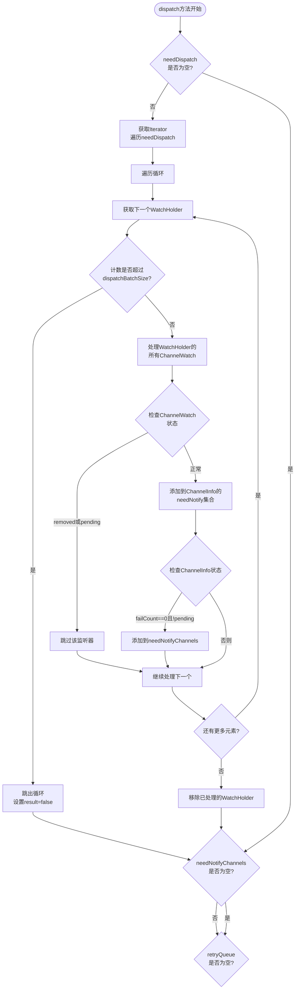
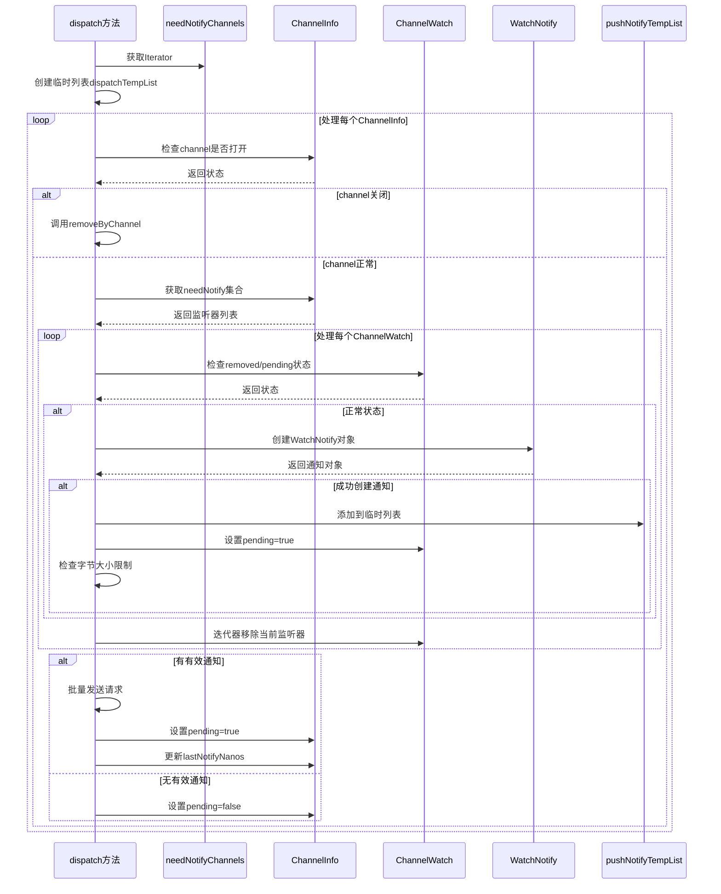
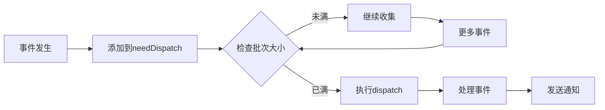

# 事件分发与调度

<cite>
**本文档引用的文件**
- [ServerWatchManager.java](file://server/src/main/java/com/github/dtprj/dongting/dtkv/server/ServerWatchManager.java)
- [KvNodeHolder.java](file://server/src/main/java/com/github/dtprj/dongting/dtkv/server/KvNodeHolder.java)
- [KvImpl.java](file://server/src/main/java/com/github/dtprj/dongting/dtkv/server/KvImpl.java)
- [ServerWatchManagerTest.java](file://server/src/test/java/com/github/dtprj/dongting/dtkv/server/ServerWatchManagerTest.java)
- [WatchProcessor.java](file://client/src/main/java/com/github/dtprj/dongting/dtkv/WatchProcessor.java)
</cite>

## 目录
1. [简介](#简介)
2. [核心组件架构](#核心组件架构)
3. [事件分发核心逻辑](#事件分发核心逻辑)
4. [三阶段处理流程详解](#三阶段处理流程详解)
5. [LinkedHashSet在事件处理中的优势](#linkedhashset在事件处理中的优势)
6. [dispatchBatchSize参数影响分析](#dispatchbatchsize参数影响分析)
7. [ConcurrentModificationException防护机制](#concurrentmodificationexception防护机制)
8. [性能考虑与优化建议](#性能考虑与优化建议)
9. [故障排除指南](#故障排除指南)
10. [总结](#总结)

## 简介

ServerWatchManager是Dongting分布式键值存储系统中的核心事件分发组件，负责管理客户端监听器的事件通知机制。该组件通过精心设计的三阶段处理流程，确保事件能够高效、有序地传递给相应的客户端通道，同时提供了强大的容错和性能优化能力。

## 核心组件架构



**图表来源**
- [ServerWatchManager.java](file://server/src/main/java/com/github/dtprj/dongting/dtkv/server/ServerWatchManager.java#L46-L70)
- [ServerWatchManager.java](file://server/src/main/java/com/github/dtprj/dongting/dtkv/server/ServerWatchManager.java#L570-L629)
- [ServerWatchManager.java](file://server/src/main/java/com/github/dtprj/dongting/dtkv/server/ServerWatchManager.java#L670-L690)

**章节来源**
- [ServerWatchManager.java](file://server/src/main/java/com/github/dtprj/dongting/dtkv/server/ServerWatchManager.java#L46-L70)
- [KvNodeHolder.java](file://server/src/main/java/com/github/dtprj/dongting/dtkv/server/KvNodeHolder.java#L20-L42)

## 事件分发核心逻辑

ServerWatchManager的核心职责是协调数据变更事件向客户端的传播。当KvNode发生更新时，系统会触发以下关键流程：

### afterUpdate方法的工作原理

```java
public void afterUpdate(KvNodeHolder h) {
    WatchHolder wh = h.watchHolder;
    if (wh == null) {
        return;
    }
    if (wh.waitingDispatch) {
        return;
    }
    wh.waitingDispatch = true;
    needDispatch.add(wh);
}
```

这个方法是事件分发的起点：
1. **检查watchHolder存在性**：只有设置了监听器的节点才会被处理
2. **避免重复调度**：通过waitingDispatch标志位防止重复添加到调度队列
3. **异步处理**：将需要处理的WatchHolder添加到needDispatch队列中

### 需求调度队列(needDispatch)的作用

needDispatch是一个LinkedHashSet，它具有以下特点：
- **保持插入顺序**：确保事件按照发生的先后顺序处理
- **去重功能**：自动过滤重复的WatchHolder
- **高效的迭代访问**：支持O(1)时间复杂度的元素访问

**章节来源**
- [ServerWatchManager.java](file://server/src/main/java/com/github/dtprj/dongting/dtkv/server/ServerWatchManager.java#L138-L148)
- [KvImpl.java](file://server/src/main/java/com/github/dtprj/dongting/dtkv/server/KvImpl.java#L203-L215)

## 三阶段处理流程详解

dispatch方法实现了三个阶段的事件处理流程，每个阶段都有明确的职责和优化策略：

### 第一阶段：从needDispatch提取待处理的WatchHolder



**图表来源**
- [ServerWatchManager.java](file://server/src/main/java/com/github/dtprj/dongting/dtkv/server/ServerWatchManager.java#L215-L243)

### 第二阶段：将关联的ChannelWatch加入通道的needNotify队列

在这个阶段，系统会将每个WatchHolder关联的所有ChannelWatch移动到对应的ChannelInfo的needNotify集合中：

```java
for (ChannelWatch w : wh.watches) {
    if (w.removed || w.pending) {
        continue;
    }
    ChannelInfo ci = w.channelInfo;
    ci.addNeedNotify(w);
    if (ci.failCount == 0 && !ci.pending) {
        needNotifyChannels.add(ci);
    }
}
```

关键特性：
- **状态检查**：跳过已删除或正在处理的监听器
- **条件添加**：只有在没有失败记录且不是pending状态时才添加到通知队列
- **批量处理**：通过failCount和pending状态控制通知时机

### 第三阶段：通过needNotifyChannels批量推送通知



**图表来源**
- [ServerWatchManager.java](file://server/src/main/java/com/github/dtprj/dongting/dtkv/server/ServerWatchManager.java#L285-L343)

**章节来源**
- [ServerWatchManager.java](file://server/src/main/java/com/github/dtprj/dongting/dtkv/server/ServerWatchManager.java#L215-L283)

## LinkedHashSet在事件处理中的优势

### 顺序保证与性能平衡

LinkedHashSet在ServerWatchManager中发挥着关键作用，特别是在needDispatch队列中：

#### 1. 插入顺序保持
```java
// afterUpdate方法中添加到队列
wh.waitingDispatch = true;
needDispatch.add(wh);
```

这种设计确保了：
- **事件处理顺序**：先发生的事件优先处理
- **可预测性**：相同条件下总是产生相同的处理顺序
- **调试友好**：便于追踪事件处理流程

#### 2. 去重功能
LinkedHashSet自动去除重复的WatchHolder，避免：
- **资源浪费**：重复处理相同的事件
- **竞态条件**：多个线程同时处理同一事件
- **内存泄漏**：不必要的对象保留

#### 3. 高效的迭代访问
相比ArrayList，LinkedHashSet在遍历时具有以下优势：
- **O(1)访问**：不需要额外的查找操作
- **内存局部性**：元素在内存中连续存储
- **缓存友好**：提高CPU缓存命中率

### 与其他集合类型的对比

| 特性 | LinkedHashSet | ArrayList | HashSet |
|------|---------------|-----------|---------|
| 插入顺序 | ✅ 保持 | ❌ 无序 | ❌ 无序 |
| 去重功能 | ✅ 自动 | ❌ 手动 | ✅ 自动 |
| 访问效率 | O(1) | O(n) | O(1) |
| 内存开销 | 较高 | 最低 | 最低 |

**章节来源**
- [ServerWatchManager.java](file://server/src/main/java/com/github/dtprj/dongting/dtkv/server/ServerWatchManager.java#L138-L148)

## dispatchBatchSize参数影响分析

### 参数配置与系统行为

dispatchBatchSize是影响系统吞吐量和延迟的关键参数：

```java
int dispatchBatchSize = config.watchMaxBatchSize;
```

### 吞吐量影响

1. **较大的batch size**：
   - **优点**：减少系统调用次数，提高整体吞吐量
   - **缺点**：单次处理时间较长，可能影响实时性

2. **较小的batch size**：
   - **优点**：响应更快，适合实时性要求高的场景
   - **缺点**：系统调用频繁，可能降低总体吞吐量

### 延迟影响



**图表来源**
- [ServerWatchManager.java](file://server/src/main/java/com/github/dtprj/dongting/dtkv/server/ServerWatchManager.java#L215-L243)

### 性能权衡

| 场景类型 | 推荐值 | 原因 |
|----------|--------|------|
| 实时监控 | 10-50 | 快速响应 |
| 批量处理 | 100-500 | 高吞吐量 |
| 资源受限 | 5-20 | 减少内存占用 |
| 平衡模式 | 50-200 | 综合考虑 |

### 动态调整策略

系统通过返回值指示是否需要继续调度：
```java
boolean result = true;
// 如果处理的事件数量超过batch size，设置result为false
if (++count > dispatchBatchSize) {
    result = false;
    break;
}
return result; // false表示需要继续调度
```

**章节来源**
- [ServerWatchManager.java](file://server/src/main/java/com/github/dtprj/dongting/dtkv/server/ServerWatchManager.java#L215-L243)

## ConcurrentModificationException防护机制

### 问题背景

在多线程环境中，直接修改正在迭代的集合会导致ConcurrentModificationException。ServerWatchManager采用了巧妙的设计来避免这个问题：

### 临时列表设计

```java
// 在pushNotify方法中使用的临时列表
ArrayList<Pair<ChannelWatch, WatchNotify>> list = pushNotifyTempList;

// 在dispatch方法中使用的临时列表
ArrayList<ChannelInfo> list = dispatchTempList;
```

### 具体实现策略

#### 1. pushNotify中的迭代器移除

```java
Iterator<ChannelWatch> it = ci.needNotify.iterator();
while (it.hasNext()) {
    ChannelWatch w = it.next();
    it.remove(); // 安全的移除操作
    // 处理逻辑...
}
```

#### 2. dispatch中的临时列表缓冲

```java
// 使用临时列表避免并发修改异常
ArrayList<ChannelInfo> list = dispatchTempList;
while (it.hasNext()) {
    ChannelInfo ci = it.next();
    list.add(ci); // 添加到临时列表
    it.remove();  // 安全移除
}
// 处理临时列表中的元素
for (int s = list.size(), i = 0; i < s; i++) {
    pushNotify(list.get(i));
}
list.clear(); // 清空临时列表
```

### 设计优势

1. **线程安全**：避免并发修改异常
2. **性能优化**：减少锁竞争
3. **代码清晰**：逻辑分离，易于维护
4. **资源管理**：及时清理临时对象

### 错误处理机制

```java
try {
    // 主要业务逻辑
} catch (Error | RuntimeException e) {
    log.error("", e);
    // 错误恢复逻辑
} finally {
    list.clear(); // 确保资源释放
}
```

**章节来源**
- [ServerWatchManager.java](file://server/src/main/java/com/github/dtprj/dongting/dtkv/server/ServerWatchManager.java#L285-L343)

## 性能考虑与优化建议

### 内存使用优化

1. **对象池化**：
   - 使用ArrayList的预分配容量
   - 临时列表的复用机制

2. **集合选择**：
   - LinkedHashSet vs ArrayList：根据使用场景选择
   - IdentityHashMap vs HashMap：避免键的equals比较

### CPU性能优化

1. **批量处理**：
   ```java
   if (++count > dispatchBatchSize) {
       result = false;
       break;
   }
   ```

2. **早期退出**：
   - 及时跳过无效的监听器
   - 条件判断优先于昂贵的操作

### I/O性能优化

1. **批量网络请求**：
   - 单次请求包含多个通知
   - 字节大小限制控制

2. **连接池管理**：
   - ChannelInfo的生命周期管理
   - 连接超时检测

### 监控指标建议

```java
// 关键性能指标
public class WatchManagerMetrics {
    private AtomicLong dispatchedEvents = new AtomicLong(0);
    private AtomicLong failedNotifications = new AtomicLong(0);
    private AtomicLong averageBatchSize = new AtomicLong(0);
    // 更多指标...
}
```

## 故障排除指南

### 常见问题诊断

#### 1. 事件丢失问题

**症状**：客户端没有收到预期的事件通知

**排查步骤**：
1. 检查needDispatch队列是否正确添加
2. 验证ChannelInfo的状态
3. 确认网络连接是否正常

**解决方案**：
```java
// 添加调试日志
log.debug("Adding watch to needDispatch: {}", wh.key);
```

#### 2. 性能瓶颈识别

**症状**：dispatch方法执行时间过长

**排查工具**：
```java
long startTime = System.nanoTime();
boolean result = dispatch();
long duration = System.nanoTime() - startTime;
if (duration > THRESHOLD_NANOS) {
    log.warn("Slow dispatch detected: {}ns", duration);
}
```

#### 3. 内存泄漏检测

**症状**：系统内存使用持续增长

**检查点**：
- 确保临时列表及时清理
- 验证ChannelInfo的正确移除
- 检查WatchHolder的垃圾回收

### 调试技巧

1. **启用详细日志**：
   ```java
   log.setLevel(Level.DEBUG);
   ```

2. **使用断点调试**：
   - 在afterUpdate方法设置断点
   - 监控dispatch方法的执行流程

3. **性能分析**：
   - 使用JProfiler或VisualVM
   - 分析热点方法和内存分配

**章节来源**
- [ServerWatchManager.java](file://server/src/main/java/com/github/dtprj/dongting/dtkv/server/ServerWatchManager.java#L285-L343)

## 总结

ServerWatchManager通过精心设计的三阶段事件分发机制，实现了高效、可靠的客户端监听器事件通知系统。其核心优势包括：

### 技术亮点

1. **LinkedHashSet的应用**：在保证事件处理顺序的同时提供高效的去重和访问能力
2. **三阶段处理流程**：通过合理的分阶段设计，平衡了系统吞吐量和延迟需求
3. **ConcurrentModificationException防护**：通过临时列表设计，确保线程安全
4. **动态批处理控制**：通过dispatchBatchSize参数，灵活调节系统性能特征

### 最佳实践建议

1. **合理配置batch size**：根据具体应用场景调整dispatchBatchSize参数
2. **监控关键指标**：关注事件处理延迟、队列长度等关键性能指标
3. **定期清理资源**：确保ChannelInfo和WatchHolder的正确清理
4. **错误处理完善**：实现健壮的异常处理和恢复机制

### 未来发展方向

1. **异步处理增强**：考虑引入更高级的异步处理框架
2. **智能调度算法**：基于历史数据的自适应调度策略
3. **分布式扩展**：支持跨集群的事件分发
4. **监控集成**：与主流监控系统的深度集成

通过深入理解ServerWatchManager的设计理念和实现细节，开发者可以更好地利用这一强大组件，构建高性能的分布式键值存储系统。