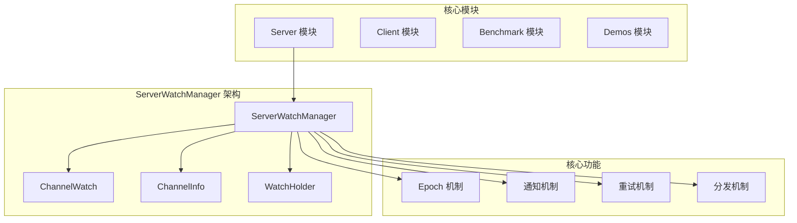
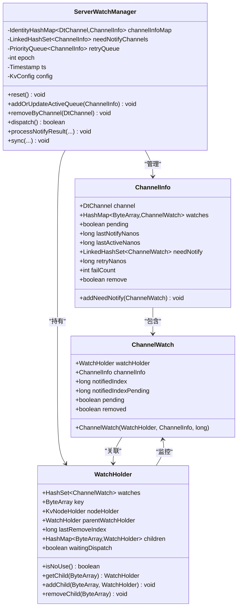
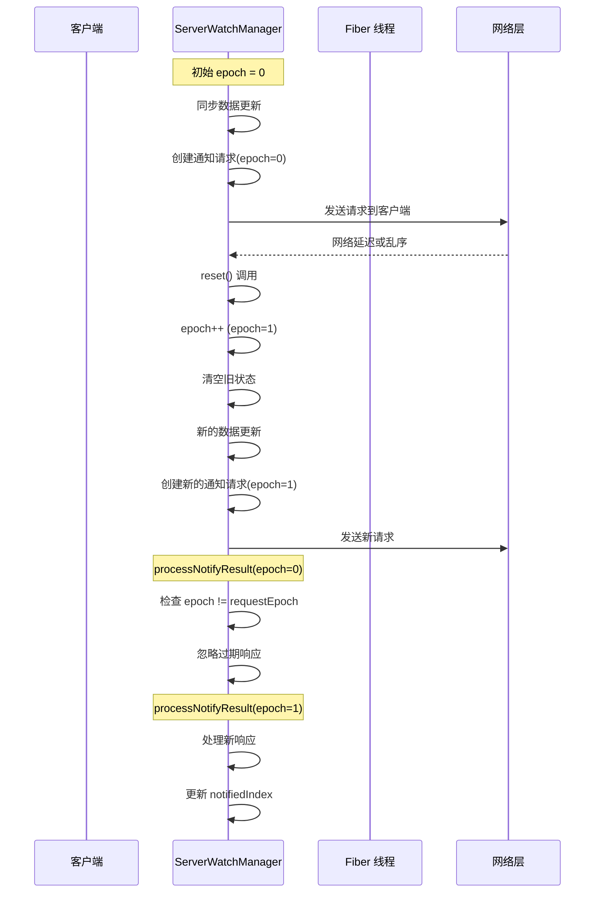
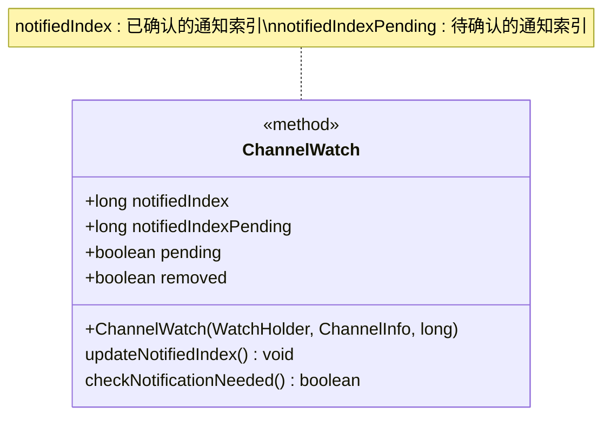
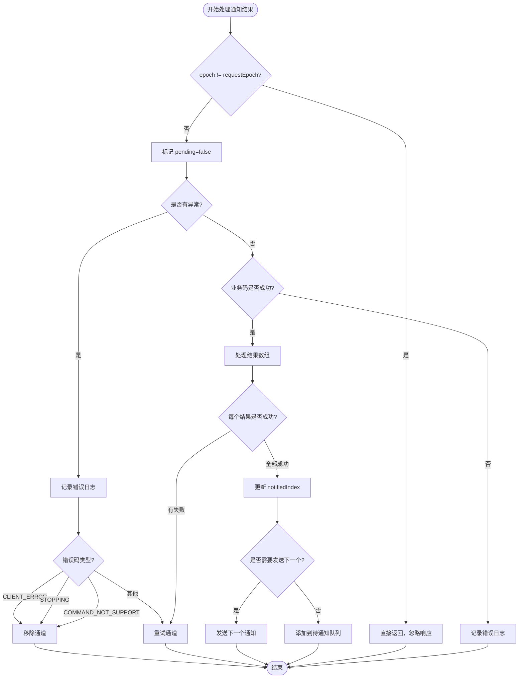
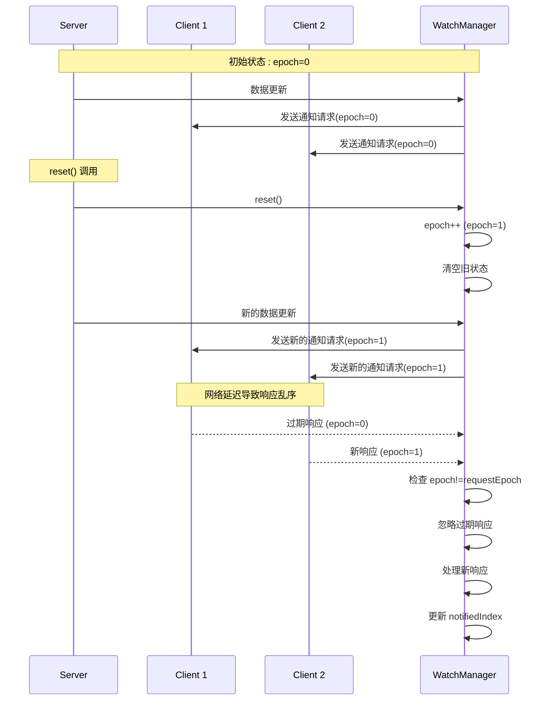
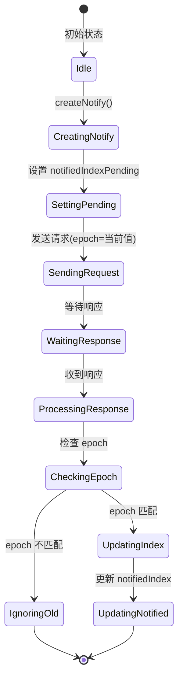
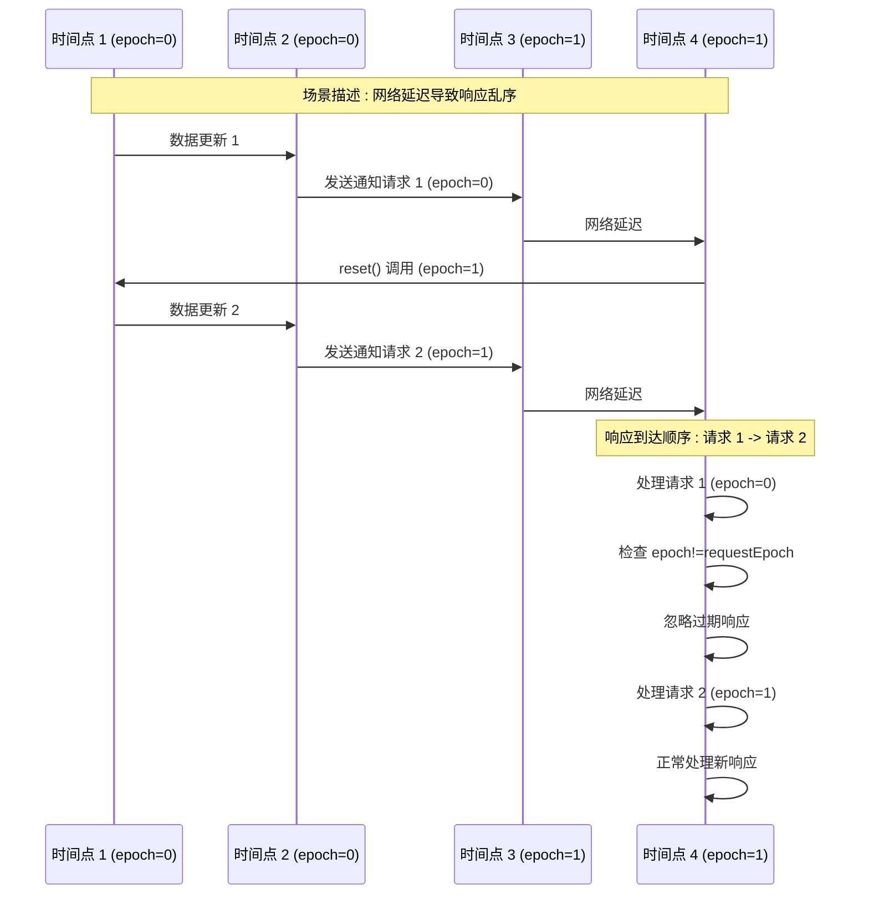
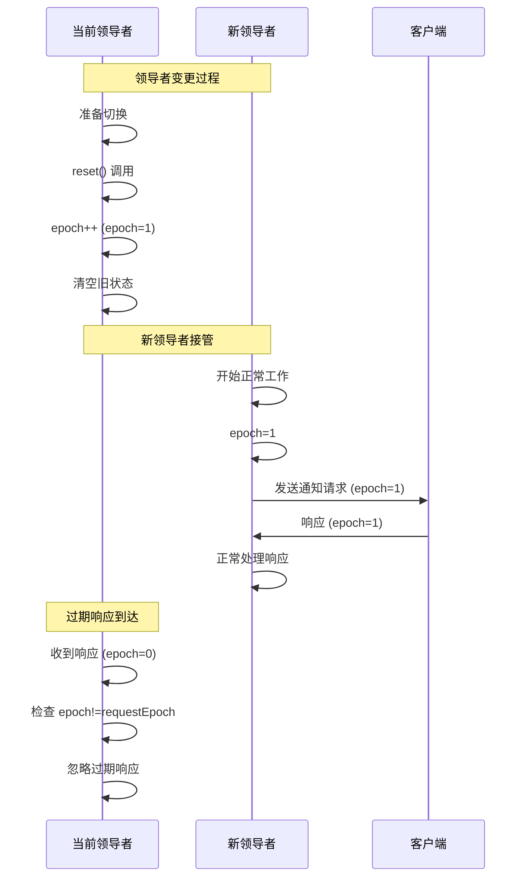

# 时序一致性保障：ServerWatchManager 的 epoch 机制详解

<cite>
**本文档引用的文件**
- [ServerWatchManager.java](file://server/src/main/java/com/github/dtprj/dongting/dtkv/server/ServerWatchManager.java)
- [ServerWatchManagerTest.java](file://server/src/test/java/com/github/dtprj/dongting/dtkv/server/ServerWatchManagerTest.java)
- [WatchProcessor.java](file://server/src/main/java/com/github/dtprj/dongting/dtkv/server/WatchProcessor.java)
- [WatchNotifyReq.java](file://client/src/main/java/com/github/dtprj/dongting/dtkv/WatchNotifyReq.java)
- [WatchNotify.java](file://client/src/main/java/com/github/dtprj/dongting/dtkv/WatchNotify.java)
- [README.md](file://README.md)
</cite>

## 目录
1. [引言](#引言)
2. [项目结构概览](#项目结构概览)
3. [核心组件分析](#核心组件分析)
4. [epoch 机制架构](#epoch-机制架构)
5. [详细组件分析](#详细组件分析)
6. [时序一致性保障机制](#时序一致性保障机制)
7. [具体场景示例](#具体场景示例)
8. [性能考虑](#性能考虑)
9. [故障排除指南](#故障排除指南)
10. [结论](#结论)

## 引言

Dongting 是一个高性能的分布式系统引擎，集成了 RAFT 共识算法、配置服务器、消息队列和底层 RPC 功能。在这样的分布式环境中，确保跨 Fiber 调度的时序一致性是一个关键挑战。ServerWatchManager 通过精心设计的 epoch 机制，有效地解决了这一问题。

本文档深入分析 ServerWatchManager 如何通过 epoch 机制保障跨 Fiber 调度的时序一致性，重点说明 reset 方法在 Raft 角色变更或配置重置时递增 epoch 的必要性，以及 processNotifyResult 中 epoch != requestEpoch 检查如何防止过期响应造成的状态错乱。

## 项目结构概览

Dongting 项目采用模块化架构，主要包含以下核心模块：



**图表来源**
- [ServerWatchManager.java](file://server/src/main/java/com/github/dtprj/dongting/dtkv/server/ServerWatchManager.java#L46-L70)

**章节来源**
- [README.md](file://README.md#L1-L50)

## 核心组件分析

### ServerWatchManager 基础架构

ServerWatchManager 是一个抽象类，负责管理所有与观察者模式相关的操作。它维护了多个关键的数据结构：



**图表来源**
- [ServerWatchManager.java](file://server/src/main/java/com/github/dtprj/dongting/dtkv/server/ServerWatchManager.java#L46-L70)
- [ServerWatchManager.java](file://server/src/main/java/com/github/dtprj/dongting/dtkv/server/ServerWatchManager.java#L570-L629)
- [ServerWatchManager.java](file://server/src/main/java/com/github/dtprj/dongting/dtkv/server/ServerWatchManager.java#L630-L680)

**章节来源**
- [ServerWatchManager.java](file://server/src/main/java/com/github/dtprj/dongting/dtkv/server/ServerWatchManager.java#L46-L117)

## epoch 机制架构

### epoch 的核心作用

epoch 机制是 ServerWatchManager 实现时序一致性的核心。它通过以下方式工作：



**图表来源**
- [ServerWatchManager.java](file://server/src/main/java/com/github/dtprj/dongting/dtkv/server/ServerWatchManager.java#L85-L92)
- [ServerWatchManager.java](file://server/src/main/java/com/github/dtprj/dongting/dtkv/server/ServerWatchManager.java#L374-L405)

### epoch 递增的触发时机

reset 方法在以下情况下递增 epoch：

1. **Raft 角色变更**：当节点成为新的领导者或失去领导者角色时
2. **配置重置**：当系统配置发生变化需要重新初始化时
3. **状态不一致检测**：当检测到状态不一致需要强制同步时

```java
// reset 方法的核心逻辑
public void reset() {
    epoch++;  // 关键：递增 epoch
    needNotifyChannels.clear();
    channelInfoMap.clear();
    retryQueue.clear();
    activeQueueHead = null;
    activeQueueTail = null;
}
```

**章节来源**
- [ServerWatchManager.java](file://server/src/main/java/com/github/dtprj/dongting/dtkv/server/ServerWatchManager.java#L85-L92)

## 详细组件分析

### ChannelWatch 的双索引机制

ChannelWatch 使用两个关键字段来跟踪通知状态：



**图表来源**
- [ServerWatchManager.java](file://server/src/main/java/com/github/dtprj/dongting/dtkv/server/ServerWatchManager.java#L630-L680)

#### notifiedIndex 字段

- **含义**：表示客户端已经成功接收并确认的通知的最大索引值
- **用途**：用于过滤重复通知，避免向客户端发送已经确认过的变更
- **更新时机**：只有在客户端成功响应后才会更新

#### notifiedIndexPending 字段

- **含义**：表示正在等待客户端确认的通知索引
- **用途**：在通知发送过程中临时存储待确认的索引值
- **更新时机**：在 createNotify 方法中设置为最新的更新索引

### processNotifyResult 中的 epoch 检查

processNotifyResult 方法是 epoch 机制的核心验证点：



**图表来源**
- [ServerWatchManager.java](file://server/src/main/java/com/github/dtprj/dongting/dtkv/server/ServerWatchManager.java#L374-L405)

**章节来源**
- [ServerWatchManager.java](file://server/src/main/java/com/github/dtprj/dongting/dtkv/server/ServerWatchManager.java#L374-L405)

## 时序一致性保障机制

### epoch 机制的工作原理

epoch 机制通过以下步骤确保时序一致性：

1. **epoch 初始化**：每次重置时递增 epoch 计数器
2. **请求携带 epoch**：所有通知请求都携带当前 epoch 值
3. **响应验证 epoch**：服务端严格检查响应中的 epoch 是否匹配
4. **过期响应过滤**：不匹配的 epoch 响应被直接丢弃



**图表来源**
- [ServerWatchManager.java](file://server/src/main/java/com/github/dtprj/dongting/dtkv/server/ServerWatchManager.java#L374-L405)
- [ServerWatchManagerTest.java](file://server/src/test/java/com/github/dtprj/dongting/dtkv/server/ServerWatchManagerTest.java#L535-L550)

### 双索引协同工作机制

notifiedIndex 和 notifiedIndexPending 字段与 epoch 机制协同工作：



**图表来源**
- [ServerWatchManager.java](file://server/src/main/java/com/github/dtprj/dongting/dtkv/server/ServerWatchManager.java#L345-L372)
- [ServerWatchManager.java](file://server/src/main/java/com/github/dtprj/dongting/dtkv/server/ServerWatchManager.java#L374-L405)

**章节来源**
- [ServerWatchManager.java](file://server/src/main/java/com/github/dtprj/dongting/dtkv/server/ServerWatchManager.java#L345-L405)

## 具体场景示例

### 场景一：网络延迟导致的响应乱序

假设存在以下网络延迟情况：



**图表来源**
- [ServerWatchManagerTest.java](file://server/src/test/java/com/github/dtprj/dongting/dtkv/server/ServerWatchManagerTest.java#L535-L550)

### 场景二：Raft 领导者变更

当 Raft 集群发生领导者变更时：



**图表来源**
- [ServerWatchManager.java](file://server/src/main/java/com/github/dtprj/dongting/dtkv/server/ServerWatchManager.java#L85-L92)

### 场景三：配置重置后的状态同步

当系统进行配置重置时：

```mermaid
flowchart TD
Start([开始配置重置]) --> ResetCall[调用 reset()]
ResetCall --> IncrementEpoch[epoch++]
IncrementEpoch --> ClearState[清空所有状态]
ClearState --> RebuildStructure[重建内部结构]
RebuildStructure --> NewEpoch[epoch=新值]
NewEpoch --> Ready[准备接受新请求]
Ready --> NewRequest[新通知请求]
NewRequest --> CheckEpoch{"epoch 匹配?"}
CheckEpoch --> |是| Process[正常处理]
CheckEpoch --> |否| Ignore[忽略响应]
Process --> UpdateIndex[更新 notifiedIndex]
UpdateIndex --> Complete[完成]
Ignore --> Complete
```

**图表来源**
- [ServerWatchManager.java](file://server/src/main/java/com/github/dtprj/dongting/dtkv/server/ServerWatchManager.java#L85-L92)

**章节来源**
- [ServerWatchManagerTest.java](file://server/src/test/java/com/github/dtprj/dongting/dtkv/server/ServerWatchManagerTest.java#L535-L550)

## 性能考虑

### epoch 机制的性能影响

epoch 机制对性能的影响主要体现在以下几个方面：

1. **内存占用**：每个 ChannelWatch 额外维护两个 long 类型字段
2. **CPU 开销**：每次处理响应都需要进行 epoch 检查
3. **网络开销**：通知请求中携带 epoch 信息

### 优化策略

为了最小化性能影响，Dongting 采用了以下优化策略：

1. **轻量级检查**：epoch 检查是一个简单的整数比较操作
2. **早期退出**：发现 epoch 不匹配立即返回，避免后续处理
3. **批量处理**：支持批量通知请求，减少网络往返次数

```java
// 优化的 epoch 检查逻辑
public void processNotifyResult(ChannelInfo ci, ArrayList<ChannelWatch> watches,
                                ReadPacket<WatchNotifyRespCallback> result,
                                Throwable ex, int requestEpoch, boolean fireNext) {
    try {
        if (epoch != requestEpoch) {
            return; // 早期退出，避免后续处理
        }
        // 正常处理逻辑...
    } catch (Exception e) {
        log.error("", e);
    }
}
```

## 故障排除指南

### 常见问题及解决方案

#### 问题 1：epoch 不匹配导致的响应被忽略

**症状**：
- 客户端没有收到预期的通知
- 日志中出现 epoch 不匹配的警告

**诊断步骤**：
1. 检查 epoch 值的变化历史
2. 分析网络延迟和乱序情况
3. 验证 reset 调用的频率和时机

**解决方案**：
```java
// 在调试模式下打印 epoch 信息
if (epoch != requestEpoch) {
    log.warn("Ignoring response with old epoch. Current: {}, Received: {}", 
             epoch, requestEpoch);
    return;
}
```

#### 问题 2：状态不一致导致的重复通知

**症状**：
- 客户端收到重复的通知
- notifiedIndex 更新异常

**诊断步骤**：
1. 检查 notifiedIndex 和 notifiedIndexPending 的值
2. 验证 epoch 机制是否正常工作
3. 分析通知发送和处理的时序

**解决方案**：
```java
// 确保 notifiedIndex 只在成功响应后更新
if (bizCode == KvCodes.SUCCESS) {
    w.notifiedIndex = w.notifiedIndexPending;
    // 添加调试日志
    log.debug("Updated notifiedIndex for watch: {} -> {}", 
              w.notifiedIndex, w.notifiedIndexPending);
}
```

**章节来源**
- [ServerWatchManager.java](file://server/src/main/java/com/github/dtprj/dongting/dtkv/server/ServerWatchManager.java#L374-L405)

## 结论

ServerWatchManager 通过精心设计的 epoch 机制，成功解决了跨 Fiber 调度环境下的时序一致性问题。该机制的核心优势包括：

1. **简单高效**：基于整数计数的 epoch 机制，实现简单且性能优异
2. **容错性强**：能够有效处理网络延迟、响应乱序等各种异常情况
3. **可扩展性好**：支持动态配置重置和 Raft 角色变更
4. **状态安全**：通过严格的 epoch 检查，确保状态的一致性和正确性

epoch 机制与 ChannelWatch 的双索引协同工作，形成了一个完整的时序一致性保障体系。这种设计不仅保证了系统的可靠性，还保持了良好的性能特征，是分布式系统设计中的优秀实践案例。

通过深入理解 epoch 机制的工作原理和应用场景，开发者可以更好地利用 ServerWatchManager 提供的功能，构建稳定可靠的分布式应用程序。