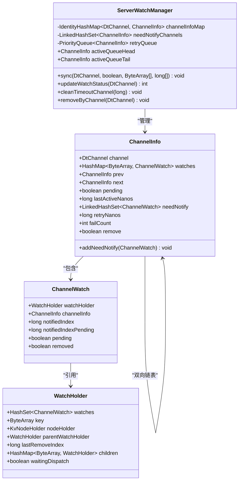
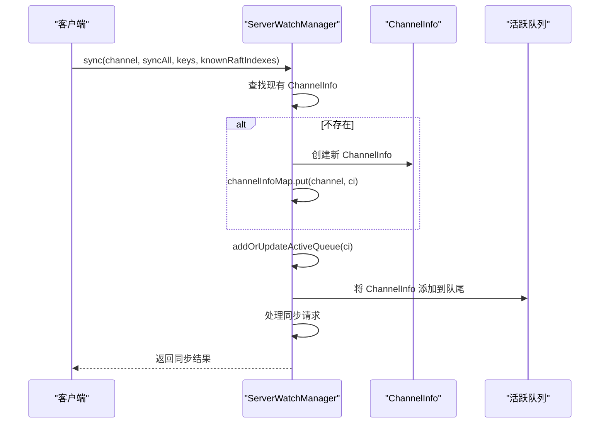
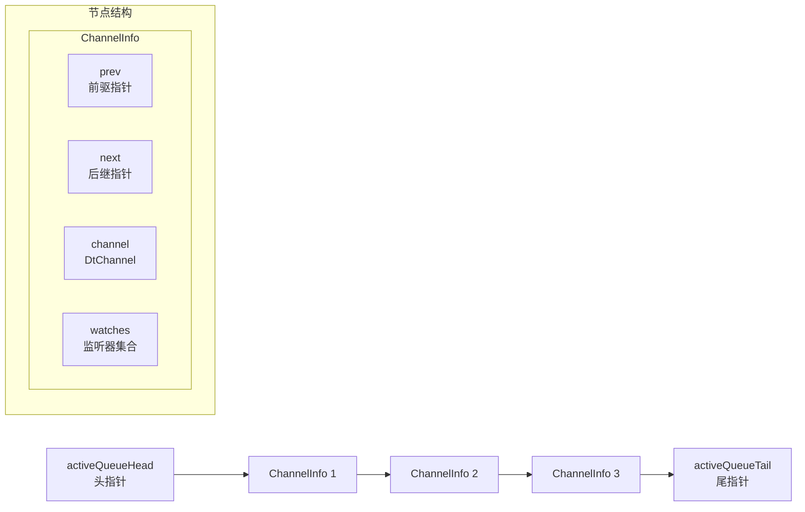
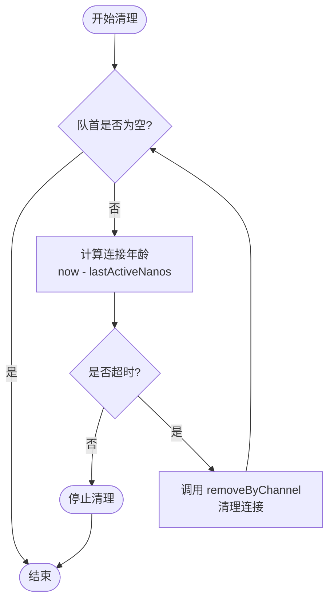
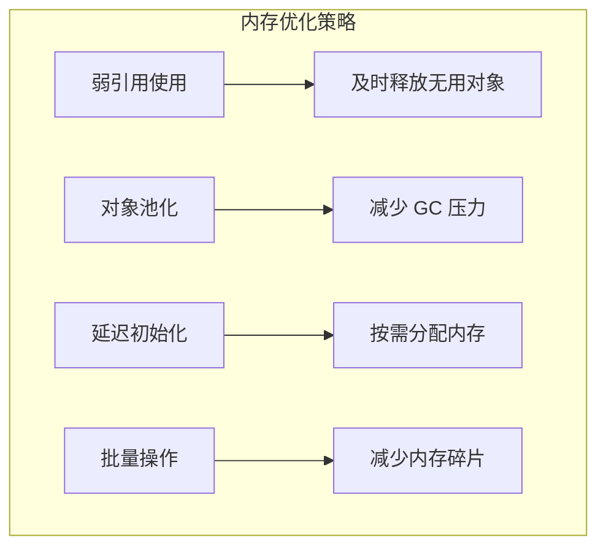

# 连接管理机制

<cite>
**本文档引用的文件**
- [ServerWatchManager.java](file://server/src/main/java/com/github/dtprj/dongting/dtkv/server/ServerWatchManager.java)
- [DtKV.java](file://server/src/main/java/com/github/dtprj/dongting/dtkv/server/DtKV.java)
- [ServerWatchManagerTest.java](file://server/src/test/java/com/github/dtprj/dongting/dtkv/server/ServerWatchManagerTest.java)
- [OrderMapTest.java](file://benchmark/src/main/java/com/github/dtprj/dongting/bench/map/OrderMapTest.java)
</cite>

## 目录
1. [概述](#概述)
2. [核心组件架构](#核心组件架构)
3. [IdentityHashMap 的选择与优势](#identityhashmap-的选择与优势)
4. [ChannelInfo 生命周期管理](#channelinfo-生命周期管理)
5. [双指针活跃队列机制](#双指针活跃队列机制)
6. [连接超时清理机制](#连接超时清理机制)
7. [性能优化分析](#性能优化分析)
8. [故障排除指南](#故障排除指南)
9. [总结](#总结)

## 概述

Dongting 框架中的 ServerWatchManager 是一个高度优化的连接管理器，专门用于处理客户端连接的生命周期管理和监控。该组件采用了多种高级数据结构和算法来实现高性能的连接管理，特别是在高并发场景下的表现。

核心特性包括：
- 基于 IdentityHashMap 的高效连接映射
- 双指针链表实现的活跃连接追踪
- 自动化的连接超时检测和清理
- 高效的批量通知分发机制

## 核心组件架构

ServerWatchManager 采用多层数据结构设计来管理客户端连接：



**图表来源**
- [ServerWatchManager.java](file://server/src/main/java/com/github/dtprj/dongting/dtkv/server/ServerWatchManager.java#L46-L70)
- [ServerWatchManager.java](file://server/src/main/java/com/github/dtprj/dongting/dtkv/server/ServerWatchManager.java#L570-L629)

**章节来源**
- [ServerWatchManager.java](file://server/src/main/java/com/github/dtprj/dongting/dtkv/server/ServerWatchManager.java#L46-L70)

## IdentityHashMap 的选择与优势

### 为什么选择 IdentityHashMap？

ServerWatchManager 使用 IdentityHashMap 而非普通的 HashMap 来存储 channelInfoMap，这是经过深思熟虑的设计决策：

```java
private final IdentityHashMap<DtChannel, ChannelInfo> channelInfoMap = new IdentityHashMap<>();
```

### 性能优势分析

1. **引用相等性检查**：IdentityHashMap 使用 `==` 而非 `equals()` 方法进行键比较，这意味着它基于对象引用的相等性而不是对象值的相等性。

2. **哈希计算效率**：由于使用 `System.identityHashCode()`，IdentityHashMap 在处理大量对象时具有更高的哈希计算效率。

3. **内存占用优化**：对于频繁创建和销毁的 DtChannel 对象，IdentityHashMap 避免了不必要的 equals() 和 hashCode() 调用开销。

### 适用场景

这种选择特别适合以下场景：
- 客户端连接对象频繁创建和销毁
- 需要快速查找特定连接
- 高并发环境下的连接管理
- 对性能要求极高的系统

**章节来源**
- [ServerWatchManager.java](file://server/src/main/java/com/github/dtprj/dongting/dtkv/server/ServerWatchManager.java#L46-L70)

## ChannelInfo 生命周期管理

### 连接建立时的注册 (sync 方法)

当新的客户端连接建立时，ServerWatchManager 通过 sync 方法进行注册：



**图表来源**
- [ServerWatchManager.java](file://server/src/main/java/com/github/dtprj/dongting/dtkv/server/ServerWatchManager.java#L458-L529)

### 活跃状态维护 (addOrUpdateActiveQueue)

活跃队列使用双指针链表结构来维护连接的活跃度：

```java
void addOrUpdateActiveQueue(ChannelInfo ci) {
    // 已经是队尾，无需操作
    if (activeQueueTail == ci) {
        return;
    }

    // 如果已经在队列中，先移除
    if (ci.next != null) {
        if (ci.prev != null) {
            ci.prev.next = ci.next;
        } else {
            activeQueueHead = ci.next;
        }
        ci.next.prev = ci.prev;
    }

    // 添加到队尾
    if (activeQueueHead == null) {
        activeQueueHead = ci;
    } else {
        activeQueueTail.next = ci;
        ci.prev = activeQueueTail;
    }
    activeQueueTail = ci;
    ci.next = null;
}
```

### 连接关闭时的资源清理 (removeByChannel)

当连接关闭或超时时，系统会执行全面的资源清理：

```java
public void removeByChannel(DtChannel channel) {
    ChannelInfo ci = channelInfoMap.remove(channel);
    if (ci != null && !ci.remove) {
        ci.remove = true;
        ci.pending = false;

        // 从各个集合中移除
        needNotifyChannels.remove(ci);
        retryQueue.remove(ci);
        removeFromActiveQueue(ci);

        // 清理所有相关的 Watch
        for (Iterator<ChannelWatch> it = ci.watches.values().iterator(); it.hasNext(); ) {
            ChannelWatch w = it.next();
            it.remove();
            removeWatchFromKvTree(w);
        }
    }
}
```

**章节来源**
- [ServerWatchManager.java](file://server/src/main/java/com/github/dtprj/dongting/dtkv/server/ServerWatchManager.java#L458-L529)
- [ServerWatchManager.java](file://server/src/main/java/com/github/dtprj/dongting/dtkv/server/ServerWatchManager.java#L199-L225)

## 双指针活跃队列机制

### 队列结构设计

ServerWatchManager 使用双指针链表结构来高效管理活跃连接：



**图表来源**
- [ServerWatchManager.java](file://server/src/main/java/com/github/dtprj/dongting/dtkv/server/ServerWatchManager.java#L72-L117)

### 高效的连接活跃度追踪

双指针设计的优势：

1. **O(1) 时间复杂度**：添加到队尾和从队首移除都是 O(1) 操作
2. **双向遍历支持**：可以从前向后或从后向前遍历
3. **灵活的队列操作**：支持任意位置的插入和删除

### 队列操作实现

```java
// 添加或更新活跃队列
void addOrUpdateActiveQueue(ChannelInfo ci) {
    // ... 实现逻辑如前所述
}

// 从活跃队列中移除
void removeFromActiveQueue(ChannelInfo ci) {
    if (ci.prev == null && ci.next == null && activeQueueHead != ci) {
        return; // 不在队列中
    }
    if (ci.prev != null) {
        ci.prev.next = ci.next;
    } else {
        activeQueueHead = ci.next;
    }
    if (ci.next != null) {
        ci.next.prev = ci.prev;
    } else {
        activeQueueTail = ci.prev;
    }
    ci.prev = null;
    ci.next = null;
}
```

**章节来源**
- [ServerWatchManager.java](file://server/src/main/java/com/github/dtprj/dongting/dtkv/server/ServerWatchManager.java#L72-L117)

## 连接超时清理机制

### 定期清理策略

ServerWatchManager 提供了自动化的连接超时检测和清理机制：

```java
public void cleanTimeoutChannel(long timeoutNanos) {
    try {
        while (activeQueueHead != null) {
            if (ts.nanoTime - activeQueueHead.lastActiveNanos > timeoutNanos) {
                removeByChannel(activeQueueHead.channel);
            } else {
                return; // 从最老的开始清理，遇到未超时的就停止
            }
        }
    } catch (Throwable e) {
        log.error("", e);
    }
}
```

### 清理流程图



**图表来源**
- [ServerWatchManager.java](file://server/src/main/java/com/github/dtprj/dongting/dtkv/server/ServerWatchManager.java#L458-L467)

### 超时时间配置

在 DtKV 中，超时时间为 120 秒（120_000_000_000 纳秒）：

```java
private boolean dispatchWatchTask() {
    if (kvStatus.installSnapshot) {
        return true;
    }
    boolean b = watchManager.dispatch();
    watchManager.cleanTimeoutChannel(120_000_000_000L); // 120 seconds
    return b;
}
```

### 批量清理优化

清理过程采用批量处理策略：
- 从最老的连接开始清理
- 遇到未超时的连接立即停止
- 避免不必要的遍历操作

**章节来源**
- [ServerWatchManager.java](file://server/src/main/java/com/github/dtprj/dongting/dtkv/server/ServerWatchManager.java#L458-L467)
- [DtKV.java](file://server/src/main/java/com/github/dtprj/dongting/dtkv/server/DtKV.java#L350-L360)

## 性能优化分析

### 数据结构选择的性能影响

1. **IdentityHashMap vs HashMap 性能对比**
   - IdentityHashMap：基于引用相等性，哈希计算更快
   - HashMap：基于值相等性，需要调用 equals() 和 hashCode()

2. **活跃队列的性能优势**
   - 双指针链表：O(1) 插入和删除操作
   - 有序访问：按连接活跃度排序

3. **批量处理优化**
   - 批量通知分发减少网络往返
   - 批量清理避免频繁的 GC 压力

### 内存使用优化



### 并发性能考虑

- 使用原子操作确保线程安全
- 最小化锁竞争范围
- 支持无锁的数据结构操作

**章节来源**
- [OrderMapTest.java](file://benchmark/src/main/java/com/github/dtprj/dongting/bench/map/OrderMapTest.java#L0-L41)

## 故障排除指南

### 常见问题诊断

1. **连接泄漏**
   - 症状：内存持续增长，连接数异常
   - 排查：检查 removeByChannel 是否正确调用
   - 解决：确保异常情况下也调用清理方法

2. **活跃队列不工作**
   - 症状：连接超时但未被清理
   - 排查：检查 addOrUpdateActiveQueue 调用
   - 解决：验证队列更新逻辑

3. **通知分发失败**
   - 症状：客户端未收到通知
   - 排查：检查 needNotifyChannels 集合
   - 解决：验证推送通知逻辑

### 监控指标

关键监控指标包括：
- 当前活跃连接数
- 连接超时率
- 通知分发成功率
- 内存使用情况

### 调试技巧

1. 启用详细日志记录
2. 使用单元测试验证边界条件
3. 监控 JVM 垃圾回收行为
4. 分析性能瓶颈所在

## 总结

ServerWatchManager 通过精心设计的数据结构和算法实现了高效的客户端连接管理：

### 核心优势

1. **高性能数据结构**：使用 IdentityHashMap 提供快速的连接查找
2. **高效的队列管理**：双指针链表实现 O(1) 的队列操作
3. **自动化的资源管理**：自动化的连接超时检测和清理
4. **批量处理优化**：减少系统开销和提高吞吐量

### 设计亮点

- **面向高并发优化**：所有核心操作都考虑了并发安全性
- **内存友好设计**：及时清理无用资源，避免内存泄漏
- **可扩展性强**：支持动态调整批处理大小和超时时间
- **容错能力**：完善的错误处理和恢复机制

### 应用建议

- 根据实际负载调整超时时间和批处理大小
- 监控连接池使用情况，及时发现异常
- 在高可用场景下启用适当的重试机制
- 定期评估性能指标，优化配置参数

通过这些设计，ServerWatchManager 能够在高并发环境下稳定可靠地管理大量客户端连接，为上层应用提供高性能的 Watch 功能支持。