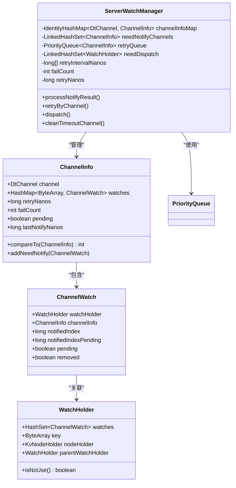
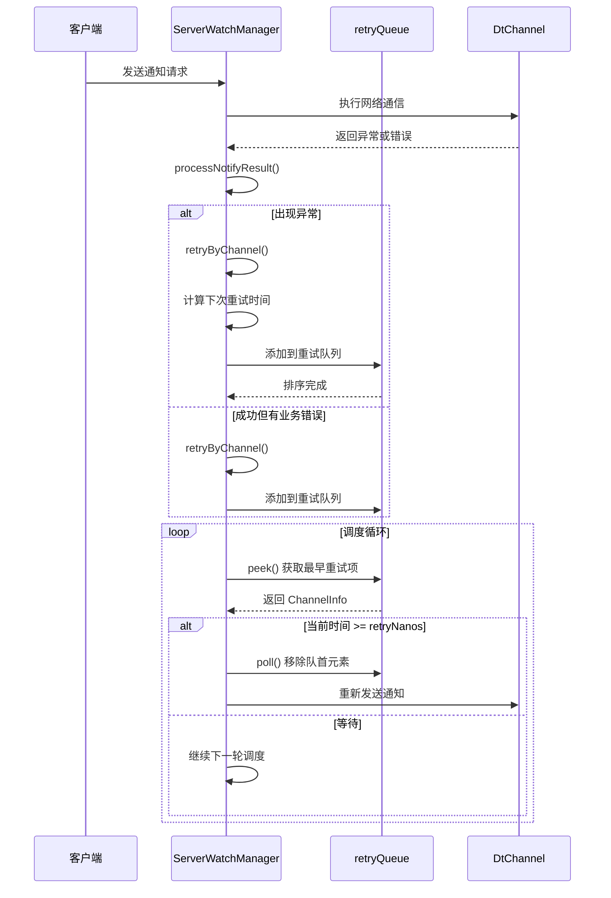
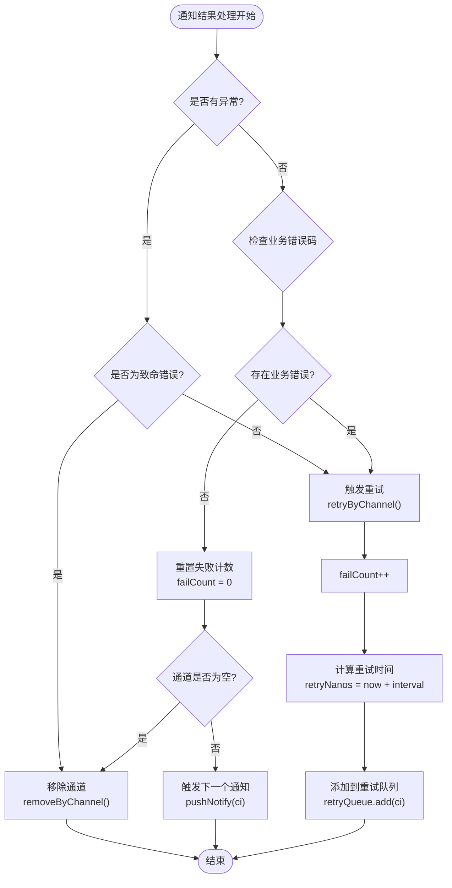

# 通知重试机制

<cite>
**本文档引用的文件**
- [ServerWatchManager.java](file://server/src/main/java/com/github/dtprj/dongting/dtkv/server/ServerWatchManager.java)
- [ServerWatchManagerTest.java](file://server/src/test/java/com/github/dtprj/dongting/dtkv/server/ServerWatchManagerTest.java)
- [WatchManagerTest.java](file://server/src/test/java/com/github/dtprj/dongting/dtkv/server/WatchManagerTest.java)
</cite>

## 目录
1. [简介](#简介)
2. [核心组件架构](#核心组件架构)
3. [retryQueue优先级队列设计](#retryqueue优先级队列设计)
4. [指数退避算法实现](#指数退避算法实现)
5. [重试触发机制](#重试触发机制)
6. [异常处理与监控](#异常处理与监控)
7. [性能优化考虑](#性能优化考虑)
8. [故障排除指南](#故障排除指南)
9. [总结](#总结)

## 简介

ServerWatchManager 是 Dongting 分布式键值存储系统中的核心组件，负责管理客户端观察者的通知分发和重试机制。该组件通过精心设计的 retryQueue 优先级队列实现了可靠的事件通知保障机制，采用指数退避算法来优化网络通信效率，并提供了完善的异常处理和监控功能。

## 核心组件架构

ServerWatchManager 采用了多层队列架构来处理不同类型的通知需求：



**图表来源**
- [ServerWatchManager.java](file://server/src/main/java/com/github/dtprj/dongting/dtkv/server/ServerWatchManager.java#L46-L70)
- [ServerWatchManager.java](file://server/src/main/java/com/github/dtprj/dongting/dtkv/server/ServerWatchManager.java#L570-L629)

**章节来源**
- [ServerWatchManager.java](file://server/src/main/java/com/github/dtprj/dongting/dtkv/server/ServerWatchManager.java#L46-L70)

## retryQueue优先级队列设计

### 队列结构与排序机制

retryQueue 是一个基于 PriorityQueue 实现的优先级队列，用于管理需要重试的通知通道。队列的核心特性体现在 ChannelInfo 类的 compareTo 方法中：

```java
@Override
public int compareTo(ChannelInfo o) {
    long diff = retryNanos - o.retryNanos;
    return diff < 0 ? -1 : (diff > 0 ? 1 : 0);
}
```

这个比较器确保了队列中最早需要重试的连接总是排在队首。当多个通道同时到达重试时间时，队列会按照 retryNanos 字段进行升序排列。

### 队列操作流程



**图表来源**
- [ServerWatchManager.java](file://server/src/main/java/com/github/dtprj/dongting/dtkv/server/ServerWatchManager.java#L269-L277)
- [ServerWatchManager.java](file://server/src/main/java/com/github/dtprj/dongting/dtkv/server/ServerWatchManager.java#L448-L456)

**章节来源**
- [ServerWatchManager.java](file://server/src/main/java/com/github/dtprj/dongting/dtkv/server/ServerWatchManager.java#L269-L277)
- [ServerWatchManager.java](file://server/src/main/java/com/github/dtprj/dongting/dtkv/server/ServerWatchManager.java#L590-L600)

## 指数退避算法实现

### retryIntervalNanos配置策略

ServerWatchManager 提供了灵活的重试间隔配置，默认配置为：`new long[]{1000, 10_000, 30_000, 60_000}`，即1秒、10秒、30秒和60秒的重试间隔。

```java
ServerWatchManager(int groupId, Timestamp ts, KvConfig config, long[] retryIntervalMillis) {
    this.groupId = groupId;
    this.ts = ts;
    this.config = config;
    this.retryIntervalNanos = new long[retryIntervalMillis.length];
    for (int i = 0; i < retryIntervalMillis.length; i++) {
        this.retryIntervalNanos[i] = TimeUnit.MILLISECONDS.toNanos(retryIntervalMillis[i]);
    }
    dispatchTempList = new ArrayList<>(config.watchMaxBatchSize);
}
```

### 指数退避计算逻辑

retryByChannel 方法实现了精确的指数退避算法：

```java
private void retryByChannel(ChannelInfo ci, List<ChannelWatch> watches) {
    ci.failCount++;
    int idx = Math.min(ci.failCount - 1, retryIntervalNanos.length - 1);
    ci.retryNanos = ts.nanoTime + retryIntervalNanos[idx];
    retryQueue.add(ci);
    for (int size = watches.size(), i = 0; i < size; i++) {
        ci.addNeedNotify(watches.get(i));
    }
}
```

算法特点：
1. **failCount递增**：每次重试失败后 failCount 自增
2. **索引映射**：通过 `Math.min(ci.failCount - 1, retryIntervalNanos.length - 1)` 将失败次数映射到重试间隔数组
3. **时间计算**：使用当前时间戳加上对应的重试间隔纳秒数
4. **队列插入**：自动利用 PriorityQueue 的排序机制

### 重试间隔示例

| 失败次数 | failCount | retryIntervalNanos索引 | 重试间隔 | 累计等待时间 |
|---------|-----------|----------------------|----------|-------------|
| 第1次   | 1         | 0                    | 1秒      | 1秒         |
| 第2次   | 2         | 1                    | 10秒     | 11秒        |
| 第3次   | 3         | 2                    | 30秒     | 41秒        |
| 第4次   | 4         | 3                    | 60秒     | 101秒       |
| 第5次+  | 5+        | 3 (最大值)          | 60秒     | 161秒+      |

**章节来源**
- [ServerWatchManager.java](file://server/src/main/java/com/github/dtprj/dongting/dtkv/server/ServerWatchManager.java#L72-L82)
- [ServerWatchManager.java](file://server/src/main/java/com/github/dtprj/dongting/dtkv/server/ServerWatchManager.java#L448-L456)

## 重试触发机制

### 异常类型识别

ServerWatchManager 在 processNotifyResult 方法中对不同类型的异常进行了细致的分类处理：

```java
if (ex != null) {
    log.warn("notify failed. remote={}, ex={}", ci.channel.getRemoteAddr(), ex);
    if (ex instanceof NetCodeException) {
        NetCodeException nce = (NetCodeException) ex;
        if (nce.getCode() == CmdCodes.CLIENT_ERROR || nce.getCode() == CmdCodes.STOPPING
                || nce.getCode() == CmdCodes.COMMAND_NOT_SUPPORT) {
            removeByChannel(ci.channel);
            return;
        }
    }
    retryByChannel(ci, watches);
}
```

异常处理策略：
1. **致命错误**：对于 CLIENT_ERROR、STOPPING、COMMAND_NOT_SUPPORT 等致命错误，直接移除通道
2. **网络异常**：对于其他网络异常，触发重试机制
3. **业务错误**：对于业务层面的错误码，也触发重试

### 业务错误码处理

```java
boolean hasFailCode = false;
for (int size = watches.size(), i = 0; i < size; i++) {
    int bizCode = callback.results[i];
    ChannelWatch w = watches.get(i);
    if (bizCode == KvCodes.REMOVE_WATCH) {
        ci.watches.remove(w.watchHolder.key);
        removeWatchFromKvTree(w);
    } else {
        if (bizCode != KvCodes.SUCCESS) {
            hasFailCode = true;
            log.error("notify failed. remote={}, bizCode={}", ci.channel.getRemoteAddr(), bizCode);
        } else {
            w.notifiedIndex = w.notifiedIndexPending;
            ci.addNeedNotify(w);
        }
    }
}
if (hasFailCode) {
    retryByChannel(ci, watches);
    return;
}
```

### 重试触发条件



**图表来源**
- [ServerWatchManager.java](file://server/src/main/java/com/github/dtprj/dongting/dtkv/server/ServerWatchManager.java#L374-L446)

**章节来源**
- [ServerWatchManager.java](file://server/src/main/java/com/github/dtprj/dongting/dtkv/server/ServerWatchManager.java#L374-L446)

## 异常处理与监控

### failCount监控机制

ServerWatchManager 内置了 failCount 字段来跟踪每个通道的连续失败次数，这是实现熔断机制的基础：

```java
long retryNanos;
int failCount;
```

failCount 的监控价值：
1. **健康状态评估**：通过 failCount 可以评估通道的健康状况
2. **重试策略调整**：可以根据失败频率动态调整重试策略
3. **熔断触发条件**：达到一定阈值时可以触发熔断保护

### 清理超时通道

```java
public void cleanTimeoutChannel(long timeoutNanos) {
    try {
        while (activeQueueHead != null) {
            if (ts.nanoTime - activeQueueHead.lastActiveNanos > timeoutNanos) {
                removeByChannel(activeQueueHead.channel);
            } else {
                return;
            }
        }
    } catch (Throwable e) {
        log.error("", e);
    }
}
```

清理策略：
1. **按活跃时间排序**：从最久未活跃的通道开始清理
2. **批量清理**：一次性清理所有超时通道
3. **异常安全**：捕获所有异常防止影响正常服务

### 监控指标建议

基于现有实现，可以扩展以下监控指标：

```java
// 建议的监控指标
public class WatchManagerMetrics {
    // 当前活跃通道数量
    public int activeChannelCount;
    
    // 重试队列大小
    public int retryQueueSize;
    
    // 各级别失败计数分布
    public Map<Integer, Integer> failCountDistribution;
    
    // 平均重试间隔
    public long averageRetryInterval;
    
    // 熔断触发统计
    public int circuitBreakerTriggerCount;
}
```

**章节来源**
- [ServerWatchManager.java](file://server/src/main/java/com/github/dtprj/dongting/dtkv/server/ServerWatchManager.java#L458-L466)
- [ServerWatchManager.java](file://server/src/main/java/com/github/dtprj/dongting/dtkv/server/ServerWatchManager.java#L468-L476)

## 性能优化考虑

### 调度批处理优化

ServerWatchManager 在 dispatch 方法中实现了批处理优化：

```java
public boolean dispatch() {
    boolean result = true;
    int dispatchBatchSize = config.watchMaxBatchSize;
    // ...
    
    // 重试队列处理
    count = 0;
    ChannelInfo ci = retryQueue.peek();
    while (ci != null && ci.retryNanos - ts.nanoTime <= 0) {
        if (++count > dispatchBatchSize) {
            result = false;
            break;
        }
        retryQueue.poll();
        pushNotify(ci);
        ci = retryQueue.peek();
    }
    // ...
}
```

优化策略：
1. **批次限制**：通过 `dispatchBatchSize` 控制单次调度处理的数量
2. **时间检查**：只处理已经到期的重试任务
3. **短路返回**：超过批次限制时提前退出

### 内存管理优化

```java
// 临时列表复用
private final ArrayList<Pair<ChannelWatch, WatchNotify>> pushNotifyTempList = new ArrayList<>(64);
private final ArrayList<ChannelInfo> dispatchTempList;

// 通知结果回调复用
final class WatchNotifyRespCallback extends PbCallback<WatchNotifyRespCallback> {
    final int[] results;
    private int nextWriteIndex;
    
    WatchNotifyRespCallback(int size) {
        this.results = new int[size];
    }
}
```

优化措施：
1. **对象池化**：复用临时列表减少GC压力
2. **数组预分配**：避免频繁扩容
3. **回调复用**：减少重复创建对象

### 时间精度考虑

```java
// 使用纳秒级时间戳
long retryNanos;
long lastNotifyNanos;
long lastActiveNanos;

// 时间转换
this.retryIntervalNanos[i] = TimeUnit.MILLISECONDS.toNanos(retryIntervalMillis[i]);
```

时间处理特点：
1. **高精度**：使用纳秒级时间戳确保精确度
2. **单位转换**：支持毫秒配置转换为纳秒计算
3. **单调递增**：保证时间顺序的正确性

**章节来源**
- [ServerWatchManager.java](file://server/src/main/java/com/github/dtprj/dongting/dtkv/server/ServerWatchManager.java#L260-L280)
- [ServerWatchManager.java](file://server/src/main/java/com/github/dtprj/dongting/dtkv/server/ServerWatchManager.java#L285-L343)

## 故障排除指南

### 常见问题诊断

#### 1. 重试队列积压

**症状**：retryQueue 长时间不为空，通知延迟严重

**诊断步骤**：
```java
// 检查队列状态
public void diagnoseRetryQueue() {
    int size = retryQueue.size();
    if (size > 100) {
        log.warn("Retry queue size is large: {}", size);
        
        // 检查最老的重试项
        ChannelInfo oldest = retryQueue.peek();
        long delay = oldest.retryNanos - ts.nanoTime;
        if (delay > TimeUnit.MINUTES.toNanos(5)) {
            log.warn("Oldest retry is delayed by {} ms", TimeUnit.NANOSECONDS.toMillis(delay));
        }
    }
}
```

**解决方案**：
1. 检查网络连接稳定性
2. 调整重试间隔配置
3. 增加调度频率

#### 2. failCount持续增长

**症状**：某个通道的 failCount 不断增加，无法恢复正常

**诊断方法**：
```java
// 监控特定通道的失败情况
public void monitorChannelHealth(DtChannel channel) {
    ChannelInfo ci = channelInfoMap.get(channel);
    if (ci != null) {
        log.info("Channel health: failCount={}, retryNanos={}, lastActive={}",
            ci.failCount, 
            TimeUnit.NANOSECONDS.toSeconds(ci.retryNanos - ts.nanoTime),
            TimeUnit.NANOSECONDS.toSeconds(ts.nanoTime - ci.lastActiveNanos));
    }
}
```

**排查步骤**：
1. 检查目标服务器状态
2. 分析网络延迟和丢包率
3. 查看业务错误码的具体含义

#### 3. 内存泄漏风险

**预防措施**：
```java
// 定期清理无用的WatchHolder
public void cleanupUnusedWatchHolders() {
    for (ChannelInfo ci : channelInfoMap.values()) {
        for (Iterator<ChannelWatch> it = ci.watches.values().iterator(); it.hasNext(); ) {
            ChannelWatch cw = it.next();
            if (cw.removed || cw.pending) {
                it.remove();
                removeWatchFromKvTree(cw);
            }
        }
    }
}
```

### 性能调优建议

#### 1. 配置参数优化

```java
// 推荐的重试间隔配置
long[] optimizedRetryIntervals = {
    1000,    // 第1次重试：1秒
    5000,    // 第2次重试：5秒
    15000,   // 第3次重试：15秒
    30000,   // 第4次重试：30秒
    60000    // 第5次及以上：1分钟
};

// 调度参数优化
config.watchMaxBatchSize = 100;        // 单次调度最大处理100个通知
config.watchDispatchIntervalMillis = 10; // 调度间隔10ms
```

#### 2. 监控告警设置

```java
// 关键监控指标告警阈值
public class AlertThresholds {
    public static final int RETRY_QUEUE_SIZE_ALERT = 50;
    public static final int FAIL_COUNT_WARNING = 5;
    public static final int FAIL_COUNT_CRITICAL = 10;
    public static final long MAX_RETRY_DELAY = TimeUnit.MINUTES.toNanos(10);
}
```

**章节来源**
- [ServerWatchManager.java](file://server/src/main/java/com/github/dtprj/dongting/dtkv/server/ServerWatchManager.java#L260-L280)
- [ServerWatchManager.java](file://server/src/main/java/com/github/dtprj/dongting/dtkv/server/ServerWatchManager.java#L458-L466)

## 总结

ServerWatchManager 的通知重试机制是一个设计精良的可靠性保障系统，其核心优势包括：

### 技术亮点

1. **优先级队列设计**：retryQueue 通过 compareTo 方法确保最早需要重试的任务优先执行
2. **指数退避算法**：智能的重试间隔策略有效平衡了响应速度和服务稳定性
3. **多层次异常处理**：区分致命错误和可恢复错误，提供针对性的处理策略
4. **性能优化**：批处理、对象复用、时间精度等多方面优化提升系统性能

### 扩展建议

1. **熔断机制**：基于 failCount 实现熔断保护，当失败率达到阈值时暂停重试
2. **动态配置**：支持运行时调整重试间隔和批次大小等参数
3. **智能降级**：在网络不稳定时自动降低通知频率
4. **分布式监控**：集成分布式追踪和监控系统，提供更全面的可观测性

### 最佳实践

1. **合理配置重试间隔**：根据业务特点选择合适的重试策略
2. **监控关键指标**：关注 retryQueue 大小、failCount 分布等重要指标
3. **定期清理资源**：及时清理超时和无用的通道及监听器
4. **异常分类处理**：根据不同类型的异常采取相应的应对策略

通过深入理解 ServerWatchManager 的设计原理和实现细节，开发者可以更好地利用这一强大的通知重试机制，构建更加稳定可靠的分布式系统。