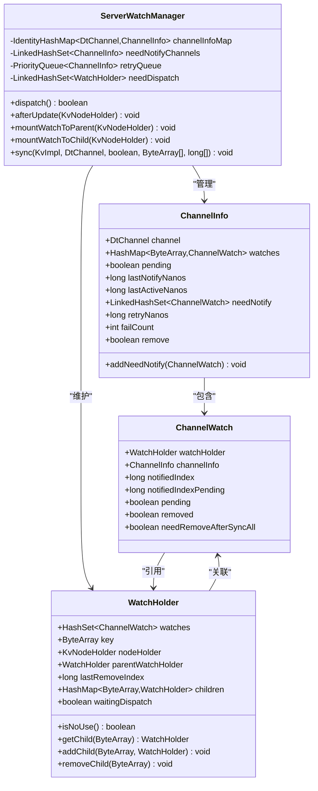
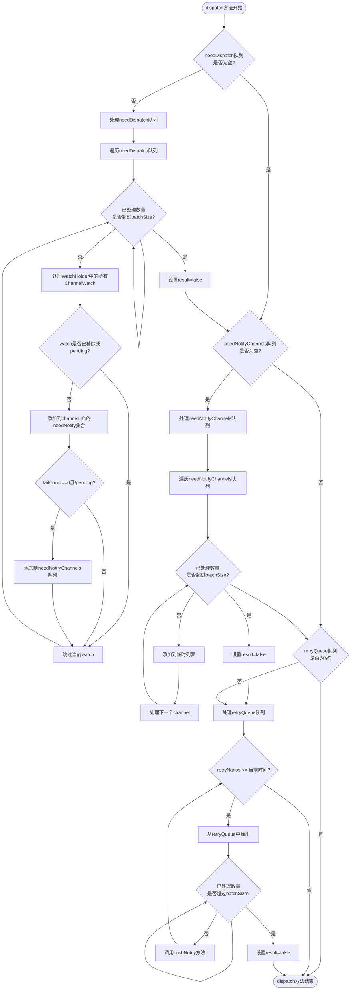
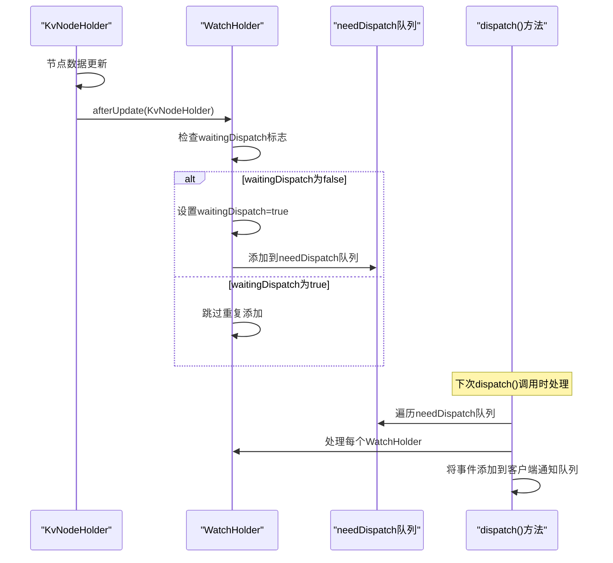
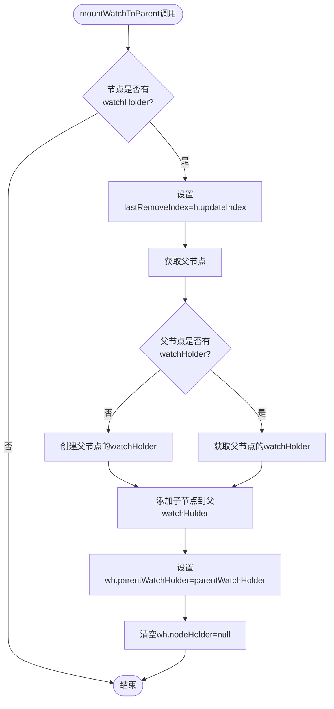
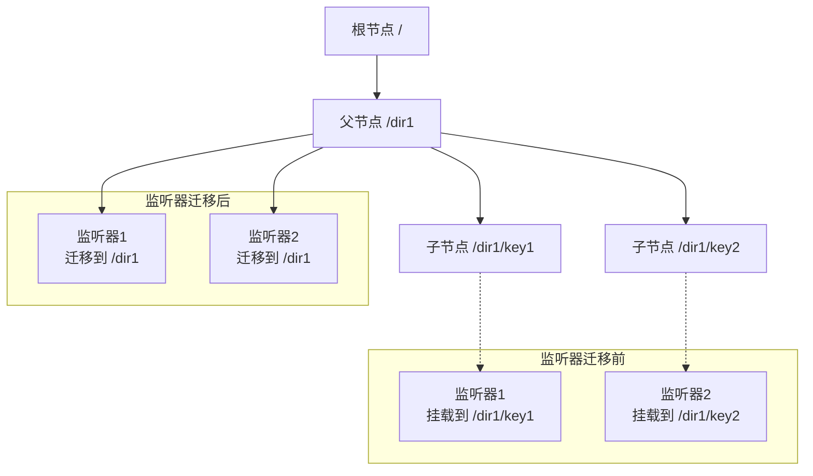
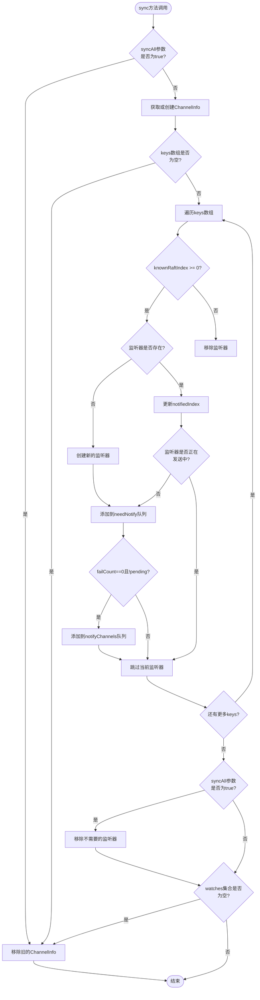
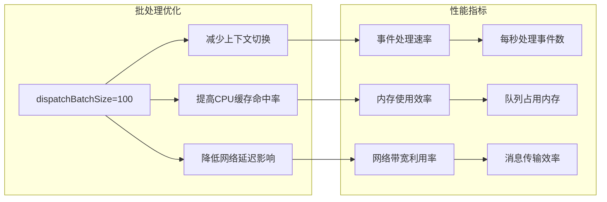
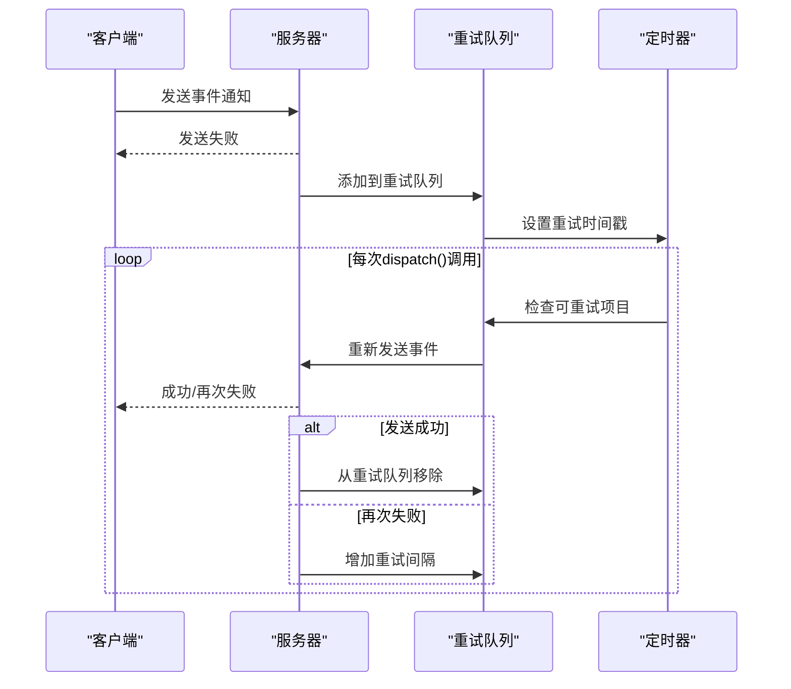

# 事件分发机制

<cite>
**本文档中引用的文件**
- [ServerWatchManager.java](file://server/src/main/java/com/github/dtprj/dongting/dtkv/server/ServerWatchManager.java)
- [WatchManager.java](file://client/src/main/java/com/github/dtprj/dongting/dtkv/WatchManager.java)
- [WatchProcessor.java](file://client/src/main/java/com/github/dtprj/dongting/dtkv/WatchProcessor.java)
- [WatchNotifyReq.java](file://client/src/main/java/com/github/dtprj/dongting/dtkv/WatchNotifyReq.java)
- [ServerWatchManagerTest.java](file://server/src/test/java/com/github/dtprj/dongting/dtkv/server/ServerWatchManagerTest.java)
- [WatchManagerTest.java](file://client/src/test/java/com/github/dtprj/dongting/dtkv/WatchManagerTest.java)
</cite>

## 目录
1. [概述](#概述)
2. [核心组件架构](#核心组件架构)
3. [dispatch()方法详解](#dispatch方法详解)
4. [WatchHolder事件收集机制](#watchholder事件收集机制)
5. [监听器迁移逻辑](#监听器迁移逻辑)
6. [sync()方法全量同步](#sync方法全量同步)
7. [系统吞吐量优化](#系统吞吐量优化)
8. [错误处理与重试机制](#错误处理与重试机制)
9. [性能分析与最佳实践](#性能分析与最佳实践)

## 概述

Dongting的事件分发机制是一个高度优化的分布式事件通知系统，负责在键值存储系统中协调客户端和服务器之间的事件传播。该机制通过三个核心队列（needDispatch、needNotifyChannels、retryQueue）的批量处理，实现了高效的事件分发和状态同步。

系统的核心设计理念是：
- **异步事件驱动**：基于事件驱动的异步通信模式
- **批量处理优化**：通过批处理大小控制提升系统吞吐量
- **灵活的监听器管理**：支持动态添加、移除和迁移监听器
- **容错机制**：完善的错误处理和自动重试逻辑

## 核心组件架构



**图表来源**
- [ServerWatchManager.java](file://server/src/main/java/com/github/dtprj/dongting/dtkv/server/ServerWatchManager.java#L45-L70)
- [ServerWatchManager.java](file://server/src/main/java/com/github/dtprj/dongting/dtkv/server/ServerWatchManager.java#L570-L629)

**章节来源**
- [ServerWatchManager.java](file://server/src/main/java/com/github/dtprj/dongting/dtkv/server/ServerWatchManager.java#L45-L70)

## dispatch()方法详解

dispatch()方法是整个事件分发机制的核心，它协调三个关键队列的批量处理，确保事件能够高效地传递给客户端。

### 方法执行流程



**图表来源**
- [ServerWatchManager.java](file://server/src/main/java/com/github/dtprj/dongting/dtkv/server/ServerWatchManager.java#L225-L280)

### 队列处理策略

#### 1. needDispatch队列处理
needDispatch队列存储需要被分发的WatchHolder对象。每个WatchHolder代表一组相关的监听器。

```java
// 批量处理逻辑
int count = 0;
if (!needDispatch.isEmpty()) {
    Iterator<WatchHolder> it = needDispatch.iterator();
    while (it.hasNext()) {
        WatchHolder wh = it.next();
        if (++count > dispatchBatchSize) {
            result = false;  // 标记需要后续处理
            break;
        }
        // 处理WatchHolder中的所有监听器
        for (ChannelWatch w : wh.watches) {
            if (w.removed || w.pending) {
                continue;
            }
            ChannelInfo ci = w.channelInfo;
            ci.addNeedNotify(w);  // 添加到待通知队列
            if (ci.failCount == 0 && !ci.pending) {
                needNotifyChannels.add(ci);  // 可以立即发送的通知
            }
        }
        wh.waitingDispatch = false;
        it.remove();
    }
}
```

#### 2. needNotifyChannels队列处理
这个队列包含所有有新事件需要通知的客户端连接。

```java
// 批量处理通知通道
ArrayList<ChannelInfo> list = dispatchTempList;
while (it.hasNext()) {
    ChannelInfo ci = it.next();
    if (ci.failCount == 0) {
        if (++count > dispatchBatchSize) {
            result = false;
            break;
        }
        list.add(ci);
    }
    it.remove();
}
for (int s = list.size(), i = 0; i < s; i++) {
    pushNotify(list.get(i));  // 发送事件通知
}
list.clear();
```

#### 3. retryQueue队列处理
retryQueue使用优先级队列按重试时间排序，确保最早到期的失败请求优先处理。

```java
// 处理重试队列
ChannelInfo ci = retryQueue.peek();
while (ci != null && ci.retryNanos - ts.nanoTime <= 0) {
    if (++count > dispatchBatchSize) {
        result = false;
        break;
    }
    retryQueue.poll();
    pushNotify(ci);  // 重新发送通知
    ci = retryQueue.peek();
}
```

**章节来源**
- [ServerWatchManager.java](file://server/src/main/java/com/github/dtprj/dongting/dtkv/server/ServerWatchManager.java#L225-L280)

## WatchHolder事件收集机制

afterUpdate()回调是事件收集的核心入口，它负责在键值节点更新后触发事件收集过程。

### afterUpdate()工作机制



**图表来源**
- [ServerWatchManager.java](file://server/src/main/java/com/github/dtprj/dongting/dtkv/server/ServerWatchManager.java#L145-L152)

### WatchHolder生命周期管理

WatchHolder在KV树结构中的生命周期包括以下阶段：

1. **创建阶段**：当首次添加监听器时创建
2. **挂载阶段**：根据节点状态决定挂载到本地节点或父节点
3. **活跃阶段**：持续接收事件通知
4. **清理阶段**：当不再需要时从树中移除

```java
public void afterUpdate(KvNodeHolder h) {
    WatchHolder wh = h.watchHolder;
    if (wh == null) {
        return;
    }
    if (wh.waitingDispatch) {
        return;  // 已经排队等待处理
    }
    wh.waitingDispatch = true;
    needDispatch.add(wh);  // 加入待处理队列
}
```

**章节来源**
- [ServerWatchManager.java](file://server/src/main/java/com/github/dtprj/dongting/dtkv/server/ServerWatchManager.java#L145-L152)

## 监听器迁移逻辑

当KV树结构发生变化时，监听器需要在不同的WatchHolder之间进行迁移，以保持正确的事件传播路径。

### mountWatchToParent()方法

当子节点被删除或移动时，监听器需要迁移到父节点的WatchHolder：



**图表来源**
- [ServerWatchManager.java](file://server/src/main/java/com/github/dtprj/dongting/dtkv/server/ServerWatchManager.java#L154-L162)

### mountWatchToChild()方法

当父节点被删除或移动时，监听器需要迁移到子节点的WatchHolder：

```java
public void mountWatchToChild(KvNodeHolder h) {
    WatchHolder parentWh = h.parent.watchHolder;
    if (parentWh != null) {
        HashMap<ByteArray, WatchHolder> children = parentWh.children;
        if (children != null) {
            WatchHolder wh = children.remove(h.key);
            if (wh != null) {
                h.watchHolder = wh;
                wh.key = h.key;
                wh.nodeHolder = h;
                wh.parentWatchHolder = null;
            }
        }
    }
}
```

### KV树结构调整示例



**章节来源**
- [ServerWatchManager.java](file://server/src/main/java/com/github/dtprj/dongting/dtkv/server/ServerWatchManager.java#L154-L170)

## sync()方法全量同步

sync()方法在客户端重连时负责全量同步状态，确保客户端获得最新的事件状态。

### sync()方法执行流程



**图表来源**
- [ServerWatchManager.java](file://server/src/main/java/com/github/dtprj/dongting/dtkv/server/ServerWatchManager.java#L472-L530)

### 全量同步状态管理

sync()方法维护以下状态信息：

1. **监听器状态**：跟踪每个监听器的已通知索引
2. **连接状态**：管理客户端连接的活跃性和错误计数
3. **事件队列**：组织待发送的事件通知
4. **重试机制**：处理发送失败的事件重试

```java
public void sync(KvImpl kv, DtChannel channel, boolean syncAll, ByteArray[] keys, long[] knownRaftIndexes) {
    if (syncAll && (keys == null || keys.length == 0)) {
        removeByChannel(channel);  // 完全断开连接
        return;
    }
    
    ChannelInfo ci = channelInfoMap.get(channel);
    if (ci == null) {
        ci = new ChannelInfo(channel, ts.nanoTime);
        channelInfoMap.put(channel, ci);
    }
    addOrUpdateActiveQueue(ci);
    
    // 处理每个键的同步请求
    for (int i = 0; i < keys.length; i++) {
        ByteArray key = keys[i];
        long knownRaftIndex = knownRaftIndexes[i];
        
        if (knownRaftIndex >= 0) {
            ChannelWatch w = ci.watches.get(key);
            if (w == null || w.removed) {
                w = createWatch(kv, key, ci, knownRaftIndex);
                ci.watches.put(w.watchHolder.key, w);
            } else {
                w.notifiedIndex = Math.max(w.notifiedIndex, knownRaftIndex);
                w.needRemoveAfterSyncAll = false;
            }
            
            if (!w.pending) {
                ci.addNeedNotify(w);
                if (ci.failCount == 0 && !ci.pending) {
                    needNotifyChannels.add(ci);
                }
            }
        } else {
            // 移除监听器
            ChannelWatch w = ci.watches.remove(key);
            if (w != null) {
                removeWatchFromKvTree(w);
            }
        }
    }
}
```

**章节来源**
- [ServerWatchManager.java](file://server/src/main/java/com/github/dtprj/dongting/dtkv/server/ServerWatchManager.java#L472-L530)

## 系统吞吐量优化

dispatchBatchSize参数是影响系统吞吐量的关键配置，它控制每次dispatch()调用处理的最大事件数量。

### 批量处理优化策略



### 吞吐量计算公式

系统吞吐量可以通过以下公式估算：

```
吞吐量 = dispatchBatchSize × dispatch调用频率 × 平均事件处理时间
```

其中：
- **dispatchBatchSize**：批处理大小，默认由配置决定
- **dispatch调用频率**：每秒调用dispatch()的次数
- **平均事件处理时间**：单个事件的平均处理耗时

### 性能调优建议

1. **合理设置批处理大小**：
   - 小批量（10-50）：低延迟，高CPU使用
   - 中批量（50-200）：平衡延迟和吞吐量
   - 大批量（200+）：高吞吐量，可能增加延迟

2. **监控关键指标**：
   ```java
   // 关键性能指标监控
   int activeChannels = channelInfoMap.size();
   int pendingNotifications = needNotifyChannels.size();
   int retryCount = retryQueue.size();
   ```

3. **动态调整策略**：
   - 根据系统负载动态调整批处理大小
   - 在高负载时减小批处理大小以保证响应性
   - 在低负载时增大批处理大小以提高吞吐量

**章节来源**
- [ServerWatchManager.java](file://server/src/main/java/com/github/dtprj/dongting/dtkv/server/ServerWatchManager.java#L225-L280)

## 错误处理与重试机制

系统实现了完善的错误处理和自动重试机制，确保在网络异常或服务不可用时仍能维持事件传递的可靠性。

### 重试队列管理



**图表来源**
- [ServerWatchManager.java](file://server/src/main/java/com/github/dtprj/dongting/dtkv/server/ServerWatchManager.java#L260-L275)

### 错误分类与处理策略

系统根据错误类型采用不同的处理策略：

1. **网络错误**：
   - 客户端错误（CLIENT_ERROR）
   - 连接超时（TIMEOUT）
   - 断开连接（DISCONNECTED）

2. **业务错误**：
   - 命令不支持（COMMAND_NOT_SUPPORT）
   - 服务停止（STOPPING）

3. **系统错误**：
   - 内部异常（INTERNAL_ERROR）
   - 资源不足（RESOURCE_EXHAUSTED）

```java
public void processNotifyResult(ChannelInfo ci, ArrayList<ChannelWatch> watches,
                                ReadPacket<WatchNotifyRespCallback> result,
                                Throwable ex, int requestEpoch, boolean fireNext) {
    try {
        if (epoch != requestEpoch) {
            return;  // 跳过过期的请求
        }
        ci.pending = false;
        
        if (ex != null) {
            log.warn("notify failed. remote={}, ex={}", ci.channel.getRemoteAddr(), ex);
            if (ex instanceof NetCodeException) {
                NetCodeException nce = (NetCodeException) ex;
                if (nce.getCode() == CmdCodes.CLIENT_ERROR || 
                    nce.getCode() == CmdCodes.STOPPING ||
                    nce.getCode() == CmdCodes.COMMAND_NOT_SUPPORT) {
                    removeByChannel(ci.channel);  // 永久移除
                    return;
                }
            }
            retryByChannel(ci, watches);  // 重新加入重试队列
        } else if (result.bizCode == KvCodes.SUCCESS) {
            // 处理成功响应
            WatchNotifyRespCallback callback = result.getBody();
            // 更新监听器状态
        }
    } catch (Throwable e) {
        log.error("processNotifyResult error", e);
    }
}
```

### 重试策略配置

系统支持多级重试策略：

```java
private final long[] retryIntervalNanos = {
    TimeUnit.MILLISECONDS.toNanos(1000),   // 第1级：1秒
    TimeUnit.MILLISECONDS.toNanos(10_000),  // 第2级：10秒
    TimeUnit.MILLISECONDS.toNanos(30_000),  // 第3级：30秒
    TimeUnit.MILLISECONDS.toNanos(60_000)   // 第4级：60秒
};
```

**章节来源**
- [ServerWatchManager.java](file://server/src/main/java/com/github/dtprj/dongting/dtkv/server/ServerWatchManager.java#L374-L405)

## 性能分析与最佳实践

### 性能瓶颈识别

通过监控以下指标可以识别性能瓶颈：

1. **队列积压**：
   ```java
   int needDispatchSize = needDispatch.size();
   int needNotifySize = needNotifyChannels.size();
   int retryQueueSize = retryQueue.size();
   ```

2. **处理延迟**：
   ```java
   long dispatchLatency = ts.nanoTime - lastDispatchTime;
   long avgNotificationLatency = calculateAvgNotificationLatency();
   ```

3. **资源使用**：
   ```java
   int activeChannels = channelInfoMap.size();
   long memoryUsage = estimateMemoryUsage();
   ```

### 最佳实践建议

1. **合理配置批处理大小**：
   - 根据网络带宽和延迟调整
   - 考虑客户端处理能力
   - 监控系统负载动态调整

2. **优化KV树结构**：
   - 减少不必要的目录层级
   - 合理设计键命名规范
   - 避免过深的嵌套结构

3. **监听器管理**：
   - 及时移除不再需要的监听器
   - 使用批量操作减少系统调用
   - 实现监听器去重机制

4. **错误处理**：
   - 实现优雅降级策略
   - 提供详细的错误日志
   - 支持手动故障转移

### 监控指标体系

推荐的监控指标包括：

- **事件处理指标**：
  - 每秒事件处理量
  - 平均处理延迟
  - 成功率统计

- **系统资源指标**：
  - 内存使用情况
  - CPU使用率
  - 网络连接数

- **队列状态指标**：
  - 各队列长度
  - 队列积压时间
  - 批处理效率

通过这些指标的综合分析，可以全面了解事件分发系统的运行状态，并及时发现和解决潜在问题。