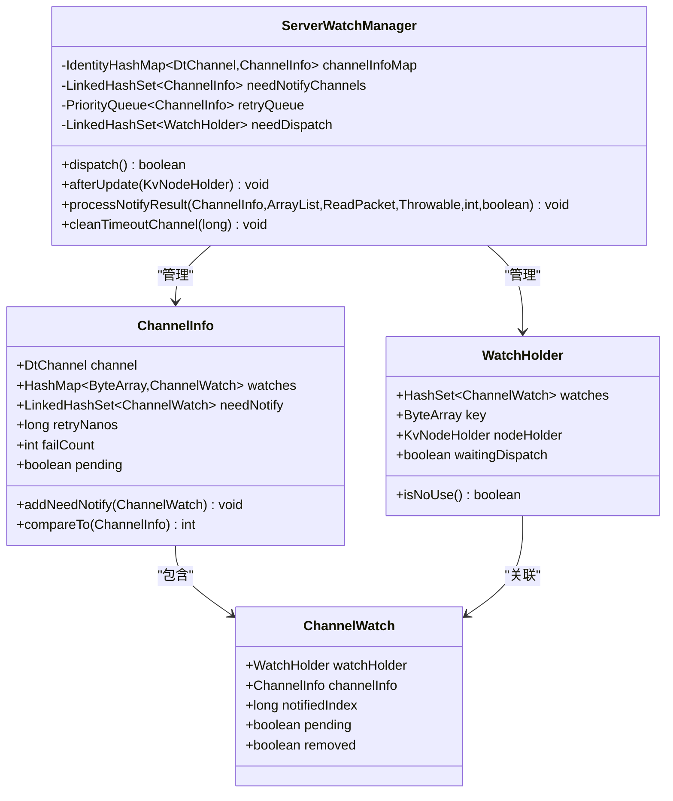
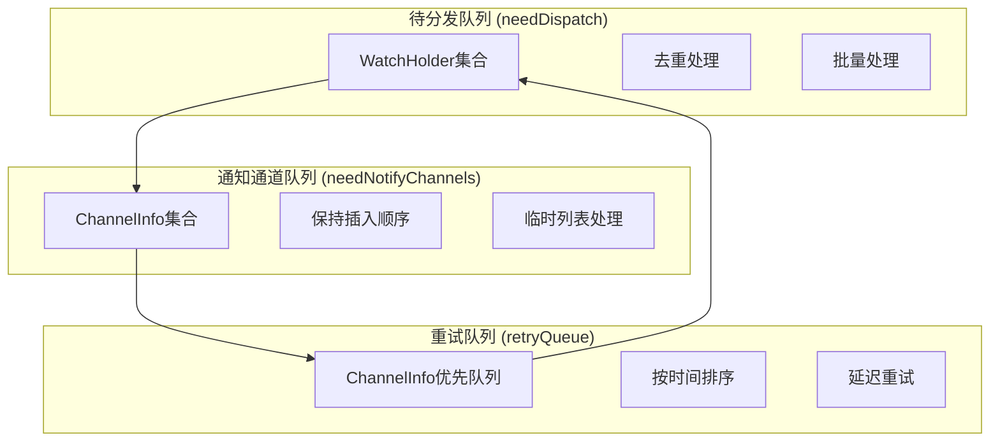
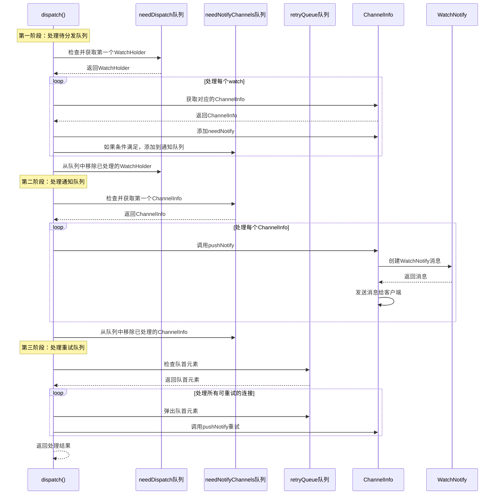

# 分发流程

<cite>
**本文档引用的文件**
- [ServerWatchManager.java](file://server/src/main/java/com/github/dtprj/dongting/dtkv/server/ServerWatchManager.java)
- [ServerWatchManagerTest.java](file://server/src/test/java/com/github/dtprj/dongting/dtkv/server/ServerWatchManagerTest.java)
- [KvConfig.java](file://server/src/main/java/com/github/dtprj/dongting/dtkv/server/KvConfig.java)
- [WatchProcessor.java](file://client/src/main/java/com/github/dtprj/dongting/dtkv/WatchProcessor.java)
</cite>

## 目录
1. [简介](#简介)
2. [核心组件概览](#核心组件概览)
3. [队列架构分析](#队列架构分析)
4. [dispatch()方法详细分析](#dispatch方法详细分析)
5. [队列处理逻辑](#队列处理逻辑)
6. [数据结构设计考量](#数据结构设计考量)
7. [并发安全机制](#并发安全机制)
8. [性能优化策略](#性能优化策略)
9. [故障处理与重试机制](#故障处理与重试机制)
10. [总结](#总结)

## 简介

事件分发流程是Dongting分布式键值存储系统的核心组件之一，负责协调Watch事件的分发处理。该系统通过精心设计的三个队列：`needDispatch`、`needNotifyChannels`和`retryQueue`，实现了高效、有序且可靠的事件分发机制。

本文档将深入分析`dispatch()`方法如何协调这三个队列的处理逻辑，解释系统在单次调度周期中如何依次处理待分发的WatchHolder、需要通知的ChannelInfo以及重试队列中的失败连接。同时，我们将探讨LinkedHashSet与PriorityQueue在保证事件顺序性和去重方面的设计考量，并结合代码片段展示迭代器使用与ConcurrentModificationException的规避策略。

## 核心组件概览

### 核心类关系图



**图表来源**
- [ServerWatchManager.java](file://server/src/main/java/com/github/dtprj/dongting/dtkv/server/ServerWatchManager.java#L46-L70)
- [ServerWatchManager.java](file://server/src/main/java/com/github/dtprj/dongting/dtkv/server/ServerWatchManager.java#L570-L629)

**章节来源**
- [ServerWatchManager.java](file://server/src/main/java/com/github/dtprj/dongting/dtkv/server/ServerWatchManager.java#L46-L70)

## 队列架构分析

### 三大核心队列的设计理念

系统采用三种不同类型的队列来处理不同的事件类型，每种队列都有其特定的数据结构和处理策略：



**图表来源**
- [ServerWatchManager.java](file://server/src/main/java/com/github/dtprj/dongting/dtkv/server/ServerWatchManager.java#L46-L70)

### 队列特性对比

| 队列类型 | 数据结构 | 特性 | 使用场景 |
|---------|---------|------|----------|
| needDispatch | LinkedHashSet | 有序、去重 | 待分发的WatchHolder |
| needNotifyChannels | LinkedHashSet | 有序、保持插入顺序 | 需要通知的ChannelInfo |
| retryQueue | PriorityQueue | 按时间排序 | 失败连接的延迟重试 |

**章节来源**
- [ServerWatchManager.java](file://server/src/main/java/com/github/dtprj/dongting/dtkv/server/ServerWatchManager.java#L46-L70)

## dispatch()方法详细分析

### 方法执行流程

`dispatch()`方法是整个事件分发流程的核心，它按照严格的顺序处理三个队列：

```mermaid
flowchart TD
Start([开始dispatch]) --> CheckNeedDispatch{"needDispatch<br/>是否为空?"}
CheckNeedDispatch --> |否| ProcessNeedDispatch[处理needDispatch队列]
CheckNeedDispatch --> |是| CheckNeedNotifyChannels{"needNotifyChannels<br/>是否为空?"}
ProcessNeedDispatch --> IterateNeedDispatch[遍历needDispatch]
IterateNeedDispatch --> GetWatchHolder[获取WatchHolder]
GetWatchHolder --> CheckBatchSize{"批次大小<br/>是否超限?"}
CheckBatchSize --> |是| SetResultFalse[设置result=false]
CheckBatchSize --> |否| ProcessWatches[处理WatchHolder的watches]
ProcessWatches --> CheckRemoved{"watch是否已移除<br/>或pending?"}
CheckRemoved --> |是| NextWatch[下一个watch]
CheckRemoved --> |否| GetChannelInfo[获取channelInfo]
GetChannelInfo --> AddNeedNotify[添加到needNotify]
AddNeedNotify --> CheckFailCount{"failCount==0<br/>且非pending?"}
CheckFailCount --> |是| AddToNotifyChannels[添加到needNotifyChannels]
CheckFailCount --> |否| NextWatch
AddToNotifyChannels --> NextWatch
NextWatch --> MoreWatches{"还有更多watches?"}
MoreWatches --> |是| ProcessWatches
MoreWatches --> |否| MarkAsProcessed[标记为已处理]
MarkAsProcessed --> RemoveFromNeedDispatch[从needDispatch移除]
RemoveFromNeedDispatch --> MoreNeedDispatch{"needDispatch还有更多?"}
MoreNeedDispatch --> |是| IterateNeedDispatch
MoreNeedDispatch --> |否| CheckNeedNotifyChannels
SetResultFalse --> CheckNeedNotifyChannels
CheckNeedNotifyChannels --> |否| CheckRetryQueue{"retryQueue<br/>是否为空?"}
CheckNeedNotifyChannels --> |是| ProcessNeedNotifyChannels[处理needNotifyChannels]
ProcessNeedNotifyChannels --> IterateNeedNotifyChannels[遍历needNotifyChannels]
IterateNeedNotifyChannels --> GetChannelInfo2[获取ChannelInfo]
GetChannelInfo2 --> CheckFailCount2{"failCount==0?"}
CheckFailCount2 --> |否| NextChannel[下一个channel]
CheckFailCount2 --> |是| CheckBatchSize2{"批次大小<br/>是否超限?"}
CheckBatchSize2 --> |是| SetResultFalse2[设置result=false]
CheckBatchSize2 --> |否| AddToTempList[添加到临时列表]
AddToTempList --> NextChannel
NextChannel --> MoreChannels{"还有更多channels?"}
MoreChannels --> |是| IterateNeedNotifyChannels
MoreChannels --> |否| ProcessTempList[处理临时列表]
ProcessTempList --> ClearTempList[清空临时列表]
ClearTempList --> CheckRetryQueue
SetResultFalse2 --> CheckRetryQueue
CheckRetryQueue --> |否| ProcessRetryQueue[处理retryQueue]
CheckRetryQueue --> |是| ReturnResult[返回结果]
ProcessRetryQueue --> PeekRetryQueue[检查队首元素]
PeekRetryQueue --> CheckRetryTime{"retryNanos<br/><=当前时间?"}
CheckRetryTime --> |否| ReturnResult
CheckRetryTime --> |是| PollRetryQueue[弹出队首元素]
PollRetryQueue --> CheckBatchSize3{"批次大小<br/>是否超限?"}
CheckBatchSize3 --> |是| SetResultFalse3[设置result=false]
CheckBatchSize3 --> |否| PushNotifyRetry[推送重试通知]
PushNotifyRetry --> PeekRetryQueueAgain[再次检查队首]
PeekRetryQueueAgain --> MoreRetryElements{"还有更多重试元素?"}
MoreRetryElements --> |是| PeekRetryQueue
MoreRetryElements --> |否| ReturnResult
SetResultFalse3 --> ReturnResult
ReturnResult --> End([结束])
```



**图表来源**
- [ServerWatchManager.java](file://server/src/main/java/com/github/dtprj/dongting/dtkv/server/ServerWatchManager.java#L215-L283)

### 关键代码片段解析

#### 1. 待分发队列处理

```java
// 处理待分发队列
if (!needDispatch.isEmpty()) {
    Iterator<WatchHolder> it = needDispatch.iterator();
    while (it.hasNext()) {
        WatchHolder wh = it.next();
        if (++count > dispatchBatchSize) {
            result = false;
            break;
        }
        for (ChannelWatch w : wh.watches) {
            if (w.removed || w.pending) {
                continue;
            }
            ChannelInfo ci = w.channelInfo;
            ci.addNeedNotify(w);
            if (ci.failCount == 0 && !ci.pending) {
                needNotifyChannels.add(ci);
            }
        }
        wh.waitingDispatch = false;
        it.remove();
    }
}
```

这段代码展示了如何处理待分发的WatchHolder：
- 使用迭代器避免ConcurrentModificationException
- 实现批次控制，防止单次处理过多导致性能问题
- 对每个watch进行有效性检查
- 将需要通知的watch添加到对应的channel的needNotify集合中
- 只有当channel没有失败记录且非pending状态时才添加到通知队列

#### 2. 通知通道队列处理

```java
// 处理需要通知的通道队列
if (!needNotifyChannels.isEmpty()) {
    Iterator<ChannelInfo> it = needNotifyChannels.iterator();
    // push notify may update needNotifyChannels, and cause ConcurrentModificationException.
    // so we use a temp list to hold the channels that need notify.
    ArrayList<ChannelInfo> list = dispatchTempList;
    while (it.hasNext()) {
        ChannelInfo ci = it.next();
        if (ci.failCount == 0) {
            if (++count > dispatchBatchSize) {
                result = false;
                break;
            }
            list.add(ci);
        }
        it.remove();
    }
    for (int s = list.size(), i = 0; i < s; i++) {
        pushNotify(list.get(i));
    }
    list.clear();
}
```

这里的关键是使用临时列表来避免ConcurrentModificationException，因为pushNotify方法可能会修改needNotifyChannels集合。

#### 3. 重试队列处理

```java
// 处理重试队列
ChannelInfo ci = retryQueue.peek();
while (ci != null && ci.retryNanos - ts.nanoTime <= 0) {
    if (++count > dispatchBatchSize) {
        result = false;
        break;
    }
    retryQueue.poll();
    pushNotify(ci);
    ci = retryQueue.peek();
}
```

重试队列使用PriorityQueue按时间排序，确保最早应该重试的连接优先处理。

**章节来源**
- [ServerWatchManager.java](file://server/src/main/java/com/github/dtprj/dongting/dtkv/server/ServerWatchManager.java#L215-L283)

## 队列处理逻辑

### 单次调度周期的完整流程



**图表来源**
- [ServerWatchManager.java](file://server/src/main/java/com/github/dtprj/dongting/dtkv/server/ServerWatchManager.java#L215-L283)

### 批次控制机制

系统通过`watchMaxBatchSize`参数控制每次调度的最大处理数量，防止单次调度占用过多资源：

```java
int dispatchBatchSize = config.watchMaxBatchSize;
// 在每个处理阶段都检查批次大小限制
if (++count > dispatchBatchSize) {
    result = false;
    break;
}
```

这种设计确保了系统的响应性和稳定性，即使在高负载情况下也能保持良好的性能表现。

**章节来源**
- [ServerWatchManager.java](file://server/src/main/java/com/github/dtprj/dongting/dtkv/server/ServerWatchManager.java#L215-L283)

## 数据结构设计考量

### LinkedHashSet vs PriorityQueue 的选择

#### LinkedHashSet 的优势

1. **保持插入顺序**：对于需要按时间顺序处理的事件至关重要
2. **自动去重**：避免重复处理相同的ChannelInfo
3. **快速查找**：O(1)时间复杂度的查找和删除操作

```java
// needDispatch使用LinkedHashSet确保有序且去重
private final LinkedHashSet<WatchHolder> needDispatch = new LinkedHashSet<>();

// needNotifyChannels使用LinkedHashSet保持插入顺序
private final LinkedHashSet<ChannelInfo> needNotifyChannels = new LinkedHashSet<>();
```

#### PriorityQueue 的优势

1. **按优先级排序**：根据retryNanos自动排序
2. **O(log n)插入和删除**：适合动态调整优先级的场景
3. **最小堆结构**：保证队首元素总是优先级最高的

```java
// retryQueue使用PriorityQueue按时间排序
private final PriorityQueue<ChannelInfo> retryQueue = new PriorityQueue<>();

@Override
public int compareTo(ChannelInfo o) {
    long diff = retryNanos - o.retryNanos;
    return diff < 0 ? -1 : (diff > 0 ? 1 : 0);
}
```

### 迭代器使用与并发安全

为了避免ConcurrentModificationException，系统采用了多种策略：

1. **临时列表模式**：在处理needNotifyChannels时使用临时列表
2. **迭代器直接操作**：在处理needDispatch时直接使用迭代器的remove方法
3. **原子操作**：在更新队列状态时使用原子操作

```java
// 使用临时列表避免ConcurrentModificationException
ArrayList<ChannelInfo> list = dispatchTempList;
while (it.hasNext()) {
    ChannelInfo ci = it.next();
    if (ci.failCount == 0) {
        list.add(ci);
    }
    it.remove(); // 安全地移除元素
}
for (int s = list.size(), i = 0; i < s; i++) {
    pushNotify(list.get(i));
}
list.clear();
```

**章节来源**
- [ServerWatchManager.java](file://server/src/main/java/com/github/dtprj/dongting/dtkv/server/ServerWatchManager.java#L46-L70)
- [ServerWatchManager.java](file://server/src/main/java/com/github/dtprj/dongting/dtkv/server/ServerWatchManager.java#L230-L245)

## 并发安全机制

### 线程安全设计

虽然ServerWatchManager本身不是线程安全的，但系统通过以下机制确保并发安全：

1. **单线程调度**：dispatch()方法通常由单一调度线程调用
2. **原子操作**：关键状态变更使用原子操作
3. **临时列表隔离**：避免在迭代过程中修改集合

### 状态同步机制

```java
public void afterUpdate(KvNodeHolder h) {
    WatchHolder wh = h.watchHolder;
    if (wh == null) {
        return;
    }
    if (wh.waitingDispatch) {
        return;
    }
    wh.waitingDispatch = true;
    needDispatch.add(wh);
}
```

这个方法确保只有未被处理的WatchHolder才会被添加到待分发队列。

**章节来源**
- [ServerWatchManager.java](file://server/src/main/java/com/github/dtprj/dongting/dtkv/server/ServerWatchManager.java#L145-L152)

## 性能优化策略

### 内存池化

系统使用内存池来减少GC压力：

```java
private final ArrayList<Pair<ChannelWatch, WatchNotify>> pushNotifyTempList = new ArrayList<>(64);
private final ArrayList<ChannelInfo> dispatchTempList;
```

这些临时列表在构造函数中初始化，避免频繁创建和销毁对象。

### 批量处理优化

```java
int dispatchBatchSize = config.watchMaxBatchSize;
```

通过配置化的批次大小，系统可以在吞吐量和延迟之间找到平衡。

### 字节大小限制

```java
int bytes = 0;
while (it.hasNext()) {
    ChannelWatch w = it.next();
    it.remove();
    if (w.removed || w.pending) {
        continue;
    }
    WatchNotify wn = createNotify(w);
    if (wn != null) {
        list.add(new Pair<>(w, wn));
        w.pending = true;
        bytes += wn.key.length + (wn.value == null ? 0 : wn.value.length);
        if (bytes > config.watchMaxReqBytes) {
            break;
        }
    }
}
```

这种设计确保单个请求不会过大，避免网络传输问题。

**章节来源**
- [ServerWatchManager.java](file://server/src/main/java/com/github/dtprj/dongting/dtkv/server/ServerWatchManager.java#L60-L70)
- [ServerWatchManager.java](file://server/src/main/java/com/github/dtprj/dongting/dtkv/server/ServerWatchManager.java#L285-L321)

## 故障处理与重试机制

### 重试策略

系统实现了指数退避的重试策略：

```java
private void retryByChannel(ChannelInfo ci, List<ChannelWatch> watches) {
    ci.failCount++;
    int idx = Math.min(ci.failCount - 1, retryIntervalNanos.length - 1);
    ci.retryNanos = ts.nanoTime + retryIntervalNanos[idx];
    retryQueue.add(ci);
    for (int size = watches.size(), i = 0; i < size; i++) {
        ci.addNeedNotify(watches.get(i));
    }
}
```

重试间隔数组：`new long[]{1000, 10_000, 30_000, 60_000}`

### 错误分类处理

```java
if (ex != null) {
    log.warn("notify failed. remote={}, ex={}", ci.channel.getRemoteAddr(), ex);
    if (ex instanceof NetCodeException) {
        NetCodeException nce = (NetCodeException) ex;
        if (nce.getCode() == CmdCodes.CLIENT_ERROR || nce.getCode() == CmdCodes.STOPPING
                || nce.getCode() == CmdCodes.COMMAND_NOT_SUPPORT) {
            removeByChannel(ci.channel);
            return;
        }
    }
    retryByChannel(ci, watches);
}
```

系统对不同类型错误采用不同的处理策略：
- 永久性错误：直接移除连接
- 临时性错误：加入重试队列
- 网络错误：尝试重连

### 超时清理机制

```java
public void cleanTimeoutChannel(long timeoutNanos) {
    try {
        while (activeQueueHead != null) {
            if (ts.nanoTime - activeQueueHead.lastActiveNanos > timeoutNanos) {
                removeByChannel(activeQueueHead.channel);
            } else {
                return;
            }
        }
    } catch (Throwable e) {
        log.error("", e);
    }
}
```

定期清理长时间未活动的连接，释放系统资源。

**章节来源**
- [ServerWatchManager.java](file://server/src/main/java/com/github/dtprj/dongting/dtkv/server/ServerWatchManager.java#L445-L455)
- [ServerWatchManager.java](file://server/src/main/java/com/github/dtprj/dongting/dtkv/server/ServerWatchManager.java#L374-L405)
- [ServerWatchManager.java](file://server/src/main/java/com/github/dtprj/dongting/dtkv/server/ServerWatchManager.java#L457-L467)

## 总结

事件分发流程通过精心设计的三个队列系统，实现了高效、可靠且有序的Watch事件分发机制。主要特点包括：

1. **分层处理架构**：通过needDispatch、needNotifyChannels和retryQueue三个层次，实现了事件的有序处理
2. **智能批次控制**：通过配置化的批次大小，平衡了吞吐量和延迟
3. **并发安全保障**：使用临时列表和迭代器安全机制，避免并发修改异常
4. **灵活的重试策略**：实现了指数退避的重试机制，提高了系统的容错能力
5. **性能优化**：通过内存池化和批量处理，最大化系统性能

这种设计不仅保证了事件分发的可靠性，还提供了优秀的性能表现，是分布式系统中事件处理的经典实现案例。通过深入理解这些设计原理，开发者可以更好地应用和扩展类似的事件分发机制。