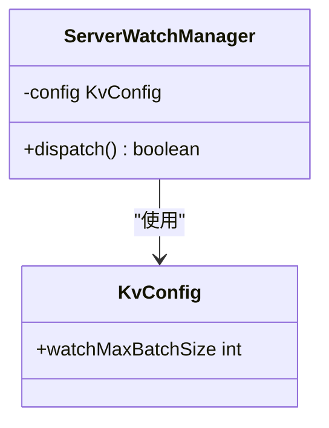
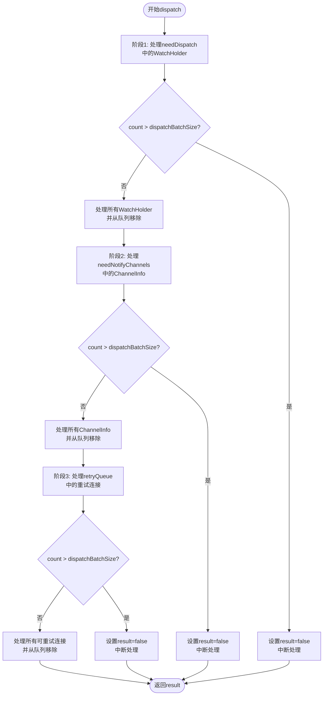
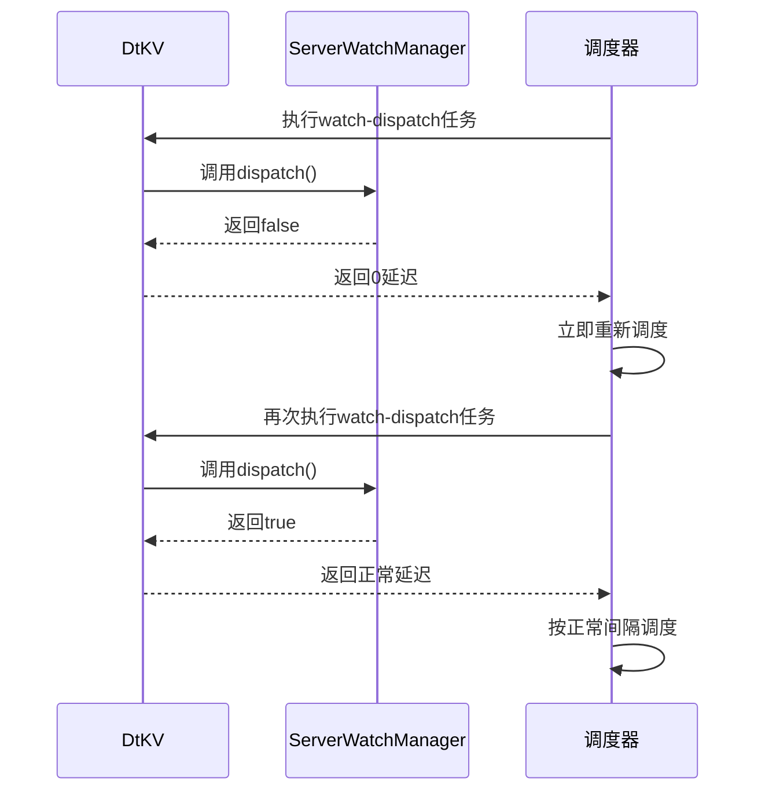

# 批量控制

<cite>
**本文档中引用的文件**  
- [ServerWatchManager.java](file://server/src/main/java/com/github/dtprj/dongting/dtkv/server/ServerWatchManager.java)
- [KvConfig.java](file://server/src/main/java/com/github/dtprj/dongting/dtkv/server/KvConfig.java)
- [DtKV.java](file://server/src/main/java/com/github/dtprj/dongting/dtkv/server/DtKV.java)
</cite>

## 目录
1. [引言](#引言)
2. [dispatchBatchSize参数机制](#dispatchbatchsize参数机制)
3. [批量处理流程分析](#批量处理流程分析)
4. [返回false的含义与调度影响](#返回false的含义与调度影响)
5. [性能调优建议](#性能调优建议)
6. [结论](#结论)

## 引言
在Dongting分布式系统中，`dispatchBatchSize`参数在事件分发过程中扮演着关键角色。该参数通过限制每轮`dispatch()`调用中处理的WatchHolder、ChannelInfo和重试连接的数量，实现了有效的流量整形与系统负载控制。本文将深入分析该参数的作用机制，解释其如何影响系统性能，并提供相应的调优建议。

## dispatchBatchSize参数机制
`dispatchBatchSize`参数是Dongting系统中用于控制事件分发批量大小的核心配置。该参数的值来源于`KvConfig`类中的`watchMaxBatchSize`字段，默认值为100。



**图源**
- [ServerWatchManager.java](file://server/src/main/java/com/github/dtprj/dongting/dtkv/server/ServerWatchManager.java#L205-L243)
- [KvConfig.java](file://server/src/main/java/com/github/dtprj/dongting/dtkv/server/KvConfig.java#L0-L28)

`dispatchBatchSize`参数在`ServerWatchManager`的`dispatch()`方法中被初始化，用于控制三个主要处理阶段的批量大小：
1. 需要分发的WatchHolder处理
2. 需要通知的ChannelInfo处理
3. 重试队列中的连接处理

**本节源**
- [ServerWatchManager.java](file://server/src/main/java/com/github/dtprj/dongting/dtkv/server/ServerWatchManager.java#L205-L243)
- [KvConfig.java](file://server/src/main/java/com/github/dtprj/dongting/dtkv/server/KvConfig.java#L0-L28)

## 批量处理流程分析
`dispatch()`方法的执行流程分为三个主要阶段，每个阶段都受到`dispatchBatchSize`参数的限制。



**图源**
- [ServerWatchManager.java](file://server/src/main/java/com/github/dtprj/dongting/dtkv/server/ServerWatchManager.java#L205-L280)

### 第一阶段：WatchHolder处理
在第一阶段，系统遍历`needDispatch`队列中的所有`WatchHolder`对象。对于每个`WatchHolder`，系统会将其关联的所有`ChannelWatch`添加到相应的`ChannelInfo`的待通知列表中。

```java
if (!needDispatch.isEmpty()) {
    Iterator<WatchHolder> it = needDispatch.iterator();
    while (it.hasNext()) {
        WatchHolder wh = it.next();
        if (++count > dispatchBatchSize) {
            result = false;
            break;
        }
        // 处理WatchHolder的逻辑
        it.remove();
    }
}
```

### 第二阶段：ChannelInfo处理
在第二阶段，系统处理`needNotifyChannels`队列中的`ChannelInfo`对象。为了避免在遍历过程中修改集合导致的并发修改异常，系统使用临时列表来暂存需要通知的通道。

```java
if (!needNotifyChannels.isEmpty()) {
    Iterator<ChannelInfo> it = needNotifyChannels.iterator();
    ArrayList<ChannelInfo> list = dispatchTempList;
    while (it.hasNext()) {
        ChannelInfo ci = it.next();
        if (ci.failCount == 0) {
            if (++count > dispatchBatchSize) {
                result = false;
                break;
            }
            list.add(ci);
        }
        it.remove();
    }
    // 处理临时列表中的通道
    list.clear();
}
```

### 第三阶段：重试连接处理
在第三阶段，系统处理`retryQueue`中的重试连接。系统会检查每个连接的重试时间是否已到，如果已到则进行重试。

```java
ChannelInfo ci = retryQueue.peek();
while (ci != null && ci.retryNanos - ts.nanoTime <= 0) {
    if (++count > dispatchBatchSize) {
        result = false;
        break;
    }
    retryQueue.poll();
    pushNotify(ci);
    ci = retryQueue.peek();
}
```

**本节源**
- [ServerWatchManager.java](file://server/src/main/java/com/github/dtprj/dongting/dtkv/server/ServerWatchManager.java#L205-L280)

## 返回false的含义与调度影响
当`dispatch()`方法返回`false`时，表示在当前调用中处理的项目数量已达到`dispatchBatchSize`的限制，仍有未处理的项目留在队列中。



**图源**
- [DtKV.java](file://server/src/main/java/com/github/dtprj/dongting/dtkv/server/DtKV.java#L300-L350)
- [ServerWatchManager.java](file://server/src/main/java/com/github/dtprj/dongting/dtkv/server/ServerWatchManager.java#L205-L280)

这种机制对调度器的影响体现在`DtKV`类的`dispatchWatchTask()`方法中：

```java
dtkvExecutor.startDaemonTask("watch-dispatch", new DtKVExecutor.DtKVExecutorTask() {
    final long defaultDelayNanos = kvConfig.watchDispatchIntervalMillis * 1_000_000L;

    @Override
    protected long execute() {
        return dispatchWatchTask() ? defaultDelayNanos : 0;
    }
    // 其他方法...
});
```

当`dispatch()`返回`true`时，表示所有待处理项目都已处理完毕，调度器将使用默认延迟（由`watchDispatchIntervalMillis`配置）进行下一次调度。当`dispatch()`返回`false`时，表示仍有项目需要处理，调度器将立即（0延迟）重新调度该任务，确保剩余项目能够尽快得到处理。

**本节源**
- [DtKV.java](file://server/src/main/java/com/github/dtprj/dongting/dtkv/server/DtKV.java#L300-L350)
- [ServerWatchManager.java](file://server/src/main/java/com/github/dtprj/dongting/dtkv/server/ServerWatchManager.java#L205-L280)

## 性能调优建议
为了在延迟与吞吐量之间取得平衡，建议根据实际应用场景对`dispatchBatchSize`参数进行调优。

### 调优原则
1. **高吞吐量场景**：适当增大`dispatchBatchSize`值，减少调度开销，提高整体吞吐量
2. **低延迟场景**：适当减小`dispatchBatchSize`值，确保单次处理时间较短，降低事件处理延迟
3. **资源受限场景**：根据系统资源情况调整，避免单次处理消耗过多内存或CPU资源

### 配置建议
```java
public class KvConfig {
    public boolean useSeparateExecutor = false;
    public int initMapCapacity = 16 * 1024;
    public float loadFactor = 0.75f;
    public int watchDispatchIntervalMillis = 500;
    public int watchMaxReqBytes = 80 * 1024; // may exceed
    public int watchMaxBatchSize = 100; // 建议根据场景调整
}
```

### 监控指标
建议监控以下指标以评估`dispatchBatchSize`配置的合理性：
- `dispatch()`方法返回`false`的频率
- 单次`dispatch()`调用的执行时间
- 系统整体CPU和内存使用率
- 事件处理的端到端延迟

**本节源**
- [KvConfig.java](file://server/src/main/java/com/github/dtprj/dongting/dtkv/server/KvConfig.java#L0-L28)
- [ServerWatchManager.java](file://server/src/main/java/com/github/dtprj/dongting/dtkv/server/ServerWatchManager.java#L205-L280)

## 结论
`dispatchBatchSize`参数在Dongting系统的事件分发过程中起着至关重要的作用。通过限制每轮`dispatch()`调用中处理的项目数量，该参数实现了有效的流量整形与系统负载控制。当处理数量超过`dispatchBatchSize`时返回`false`，会触发调度器立即重新执行任务，确保所有待处理项目能够及时得到处理。通过合理配置该参数，可以在延迟与吞吐量之间取得最佳平衡，满足不同应用场景的需求。