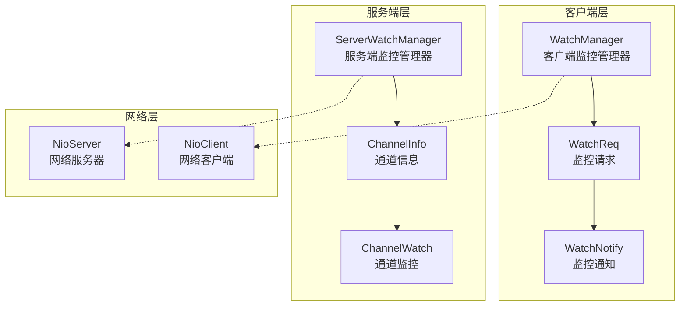
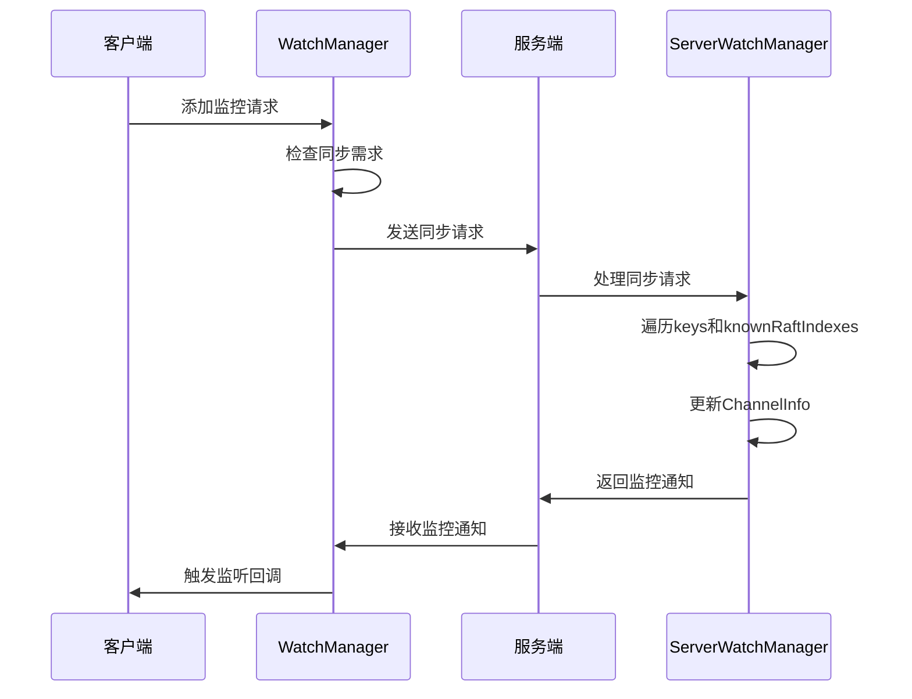
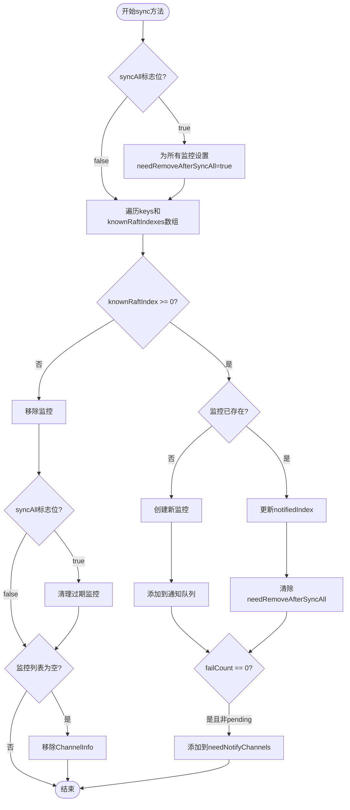
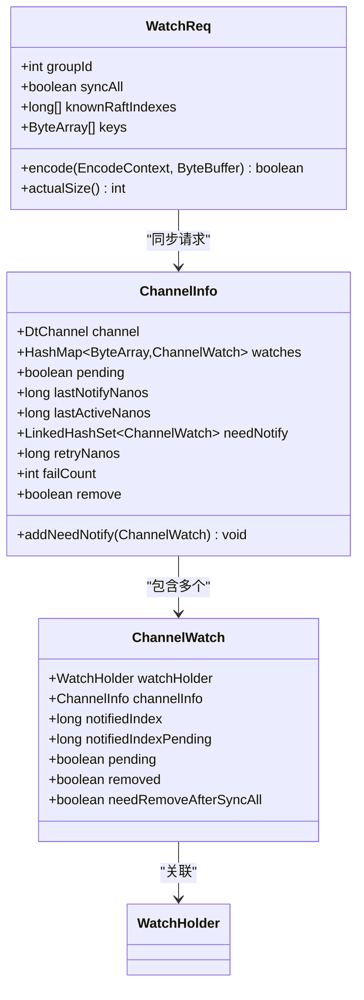
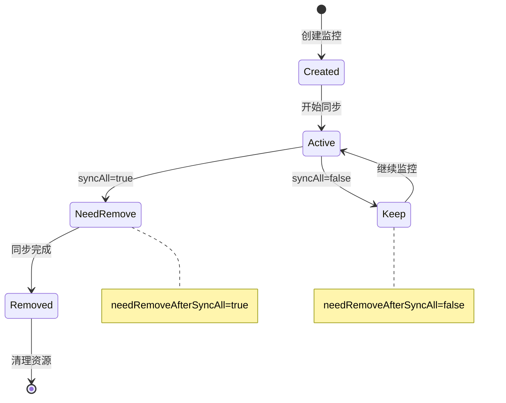
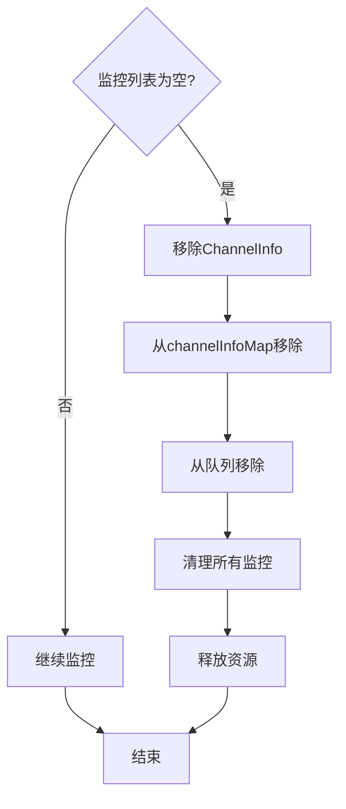
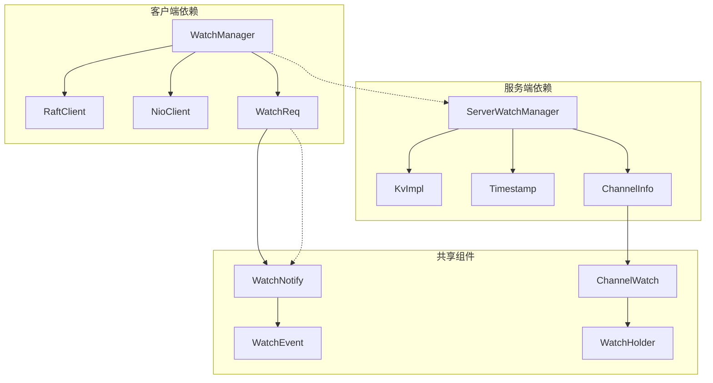

# 状态同步机制

<cite>
**本文档引用的文件**
- [WatchManager.java](file://client/src/main/java/com/github/dtprj/dongting/dtkv/WatchManager.java)
- [ServerWatchManager.java](file://server/src/main/java/com/github/dtprj/dongting/dtkv/server/ServerWatchManager.java)
- [WatchReq.java](file://client/src/main/java/com/github/dtprj/dongting/dtkv/WatchReq.java)
- [WatchNotify.java](file://client/src/main/java/com/github/dtprj/dongting/dtkv/WatchNotify.java)
- [WatchReqCallback.java](file://client/src/main/java/com/github/dtprj/dongting/dtkv/WatchReqCallback.java)
- [ServerWatchManagerTest.java](file://server/src/test/java/com/github/dtprj/dongting/dtkv/server/ServerWatchManagerTest.java)
</cite>

## 目录
1. [简介](#简介)
2. [项目结构概览](#项目结构概览)
3. [核心组件分析](#核心组件分析)
4. [架构概览](#架构概览)
5. [详细组件分析](#详细组件分析)
6. [依赖关系分析](#依赖关系分析)
7. [性能考虑](#性能考虑)
8. [故障排除指南](#故障排除指南)
9. [结论](#结论)

## 简介

Dongting项目的状态同步机制是一个复杂而精密的系统，负责在客户端重连或首次订阅时实现全量状态同步。该机制通过`sync()`方法确保客户端能够获取最新的数据状态，并通过一系列标志位和数据结构来管理增量同步过程。

本文档深入分析了状态同步的核心实现，包括：
- `syncAll`标志位的作用机制
- `keys`和`knownRaftIndexes`数组在增量同步中的判断逻辑
- `ChannelInfo`的创建与更新流程
- `needRemoveAfterSyncAll`标记在清理过期监听器中的作用
- 自动清理机制以回收无有效监听的`ChannelInfo`资源

## 项目结构概览

Dongting项目采用分层架构设计，主要包含以下核心模块：



**图表来源**
- [WatchManager.java](file://client/src/main/java/com/github/dtprj/dongting/dtkv/WatchManager.java#L1-L50)
- [ServerWatchManager.java](file://server/src/main/java/com/github/dtprj/dongting/dtkv/server/ServerWatchManager.java#L1-L50)

## 核心组件分析

### WatchManager - 客户端监控管理器

`WatchManager`是客户端状态同步的核心组件，负责管理所有监控请求的状态和生命周期。

```java
private static class GroupWatches {
    final int groupId;
    final HashMap<ByteArray, KeyWatch> watches = new HashMap<>();
    RaftNode server;
    long serversEpoch;
    boolean busy;
    boolean needSync;
    boolean fullSync;
    boolean needCheckServer;
    
    boolean removed;
    ScheduledFuture<?> scheduledFuture;
}
```

关键字段说明：
- `groupId`: 监控组标识符
- `watches`: 存储当前组内所有键的监控信息
- `server`: 当前连接的Raft节点
- `busy`: 标记是否正在处理同步请求
- `needSync`: 标记是否有待处理的同步需求
- `fullSync`: 标记是否需要执行全量同步

### ServerWatchManager - 服务端监控管理器

`ServerWatchManager`负责服务端的状态管理和通知分发：

```java
abstract class ServerWatchManager {
    private final IdentityHashMap<DtChannel, ChannelInfo> channelInfoMap = new IdentityHashMap<>();
    private final LinkedHashSet<ChannelInfo> needNotifyChannels = new LinkedHashSet<>();
    private final PriorityQueue<ChannelInfo> retryQueue = new PriorityQueue<>();
    
    ChannelInfo activeQueueHead;
    ChannelInfo activeQueueTail;
}
```

**章节来源**
- [WatchManager.java](file://client/src/main/java/com/github/dtprj/dongting/dtkv/WatchManager.java#L60-L85)
- [ServerWatchManager.java](file://server/src/main/java/com/github/dtprj/dongting/dtkv/server/ServerWatchManager.java#L40-L60)

## 架构概览

状态同步机制的整体架构如下：



**图表来源**
- [WatchManager.java](file://client/src/main/java/com/github/dtprj/dongting/dtkv/WatchManager.java#L247-L325)
- [ServerWatchManager.java](file://server/src/main/java/com/github/dtprj/dongting/dtkv/server/ServerWatchManager.java#L525-L580)

## 详细组件分析

### sync()方法的全量状态同步实现

`sync()`方法是状态同步的核心入口，负责处理客户端重连或首次订阅时的全量状态同步：



**图表来源**
- [ServerWatchManager.java](file://server/src/main/java/com/github/dtprj/dongting/dtkv/server/ServerWatchManager.java#L525-L580)

### syncAll标志位的作用机制

`syncAll`标志位控制着同步行为的两种模式：

1. **全量同步模式** (`syncAll = true`)
   - 移除所有现有的监控
   - 重新创建所有监控
   - 设置`needRemoveAfterSyncAll = true`给现有监控

2. **增量同步模式** (`syncAll = false`)
   - 只处理指定的键值对
   - 保留现有监控
   - 不设置`needRemoveAfterSyncAll`

```java
// 全量同步时的处理逻辑
if (syncAll) {
    for (ChannelWatch cw : ci.watches.values()) {
        cw.needRemoveAfterSyncAll = true;
    }
}

// 增量同步时的处理逻辑
for (int i = 0; i < keys.length; i++) {
    ByteArray key = keys[i];
    long knownRaftIndex = knownRaftIndexes[i];
    if (knownRaftIndex >= 0) {
        ChannelWatch w = ci.watches.get(key);
        if (w == null || w.removed) {
            w = createWatch(kv, key, ci, knownRaftIndex);
            ci.watches.put(w.watchHolder.key, w);
        } else {
            w.notifiedIndex = Math.max(w.notifiedIndex, knownRaftIndex);
            w.needRemoveAfterSyncAll = false;
        }
        // ...
    }
}
```

### keys和knownRaftIndexes数组的增量同步判断

这两个数组在增量同步过程中发挥关键作用：



**图表来源**
- [WatchReq.java](file://client/src/main/java/com/github/dtprj/dongting/dtkv/WatchReq.java#L37-L53)
- [ServerWatchManager.java](file://server/src/main/java/com/github/dtprj/dongting/dtkv/server/ServerWatchManager.java#L600-L650)

### ChannelInfo的创建与更新过程

`ChannelInfo`对象的生命周期管理：

```java
public void sync(KvImpl kv, DtChannel channel, boolean syncAll, ByteArray[] keys, long[] knownRaftIndexes) {
    ChannelInfo ci = channelInfoMap.get(channel);
    if (ci == null) {
        ci = new ChannelInfo(channel, ts.nanoTime);
        channelInfoMap.put(channel, ci);
    }
    addOrUpdateActiveQueue(ci);
    
    // 处理syncAll标志位
    if (syncAll) {
        for (ChannelWatch cw : ci.watches.values()) {
            cw.needRemoveAfterSyncAll = true;
        }
    }
    
    // 处理每个键的同步逻辑
    for (int i = 0; i < keys.length; i++) {
        ByteArray key = keys[i];
        long knownRaftIndex = knownRaftIndexes[i];
        
        if (knownRaftIndex >= 0) {
            ChannelWatch w = ci.watches.get(key);
            if (w == null || w.removed) {
                w = createWatch(kv, key, ci, knownRaftIndex);
                ci.watches.put(w.watchHolder.key, w);
            } else {
                w.notifiedIndex = Math.max(w.notifiedIndex, knownRaftIndex);
                w.needRemoveAfterSyncAll = false;
            }
            
            if (!w.pending) {
                ci.addNeedNotify(w);
                if (ci.failCount == 0 && !ci.pending) {
                    needNotifyChannels.add(ci);
                }
            }
        } else {
            ChannelWatch w = ci.watches.remove(key);
            if (w != null) {
                removeWatchFromKvTree(w);
            }
        }
    }
    
    // 清理过期的监控
    if (syncAll) {
        for (Iterator<ChannelWatch> it = ci.watches.values().iterator(); it.hasNext(); ) {
            ChannelWatch cw = it.next();
            if (cw.needRemoveAfterSyncAll) {
                it.remove();
                removeWatchFromKvTree(cw);
            }
        }
    }
    
    // 如果没有监控，移除ChannelInfo
    if (ci.watches.isEmpty()) {
        removeByChannel(ci.channel);
    }
}
```

### needRemoveAfterSyncAll标记的清理机制

`needRemoveAfterSyncAll`标记用于在全量同步后清理过期的监控：



清理过程的关键代码：

```java
// 在全量同步完成后清理过期监控
if (syncAll) {
    for (Iterator<ChannelWatch> it = ci.watches.values().iterator(); it.hasNext(); ) {
        ChannelWatch cw = it.next();
        if (cw.needRemoveAfterSyncAll) {
            it.remove();
            removeWatchFromKvTree(cw);
        }
    }
}

// 自动清理无有效监听的ChannelInfo
if (ci.watches.isEmpty()) {
    removeByChannel(ci.channel);
}
```

**章节来源**
- [ServerWatchManager.java](file://server/src/main/java/com/github/dtprj/dongting/dtkv/server/ServerWatchManager.java#L525-L580)

### 自动清理机制的资源回收

当客户端无有效监听时，系统会自动清理`ChannelInfo`以回收资源：

```java
public void removeByChannel(DtChannel channel) {
    ChannelInfo ci = channelInfoMap.remove(channel);
    if (ci != null && !ci.remove) {
        ci.remove = true;
        ci.pending = false;
        
        needNotifyChannels.remove(ci);
        retryQueue.remove(ci);
        removeFromActiveQueue(ci);
        
        // 清理所有监控
        for (Iterator<ChannelWatch> it = ci.watches.values().iterator(); it.hasNext(); ) {
            ChannelWatch w = it.next();
            it.remove();
            removeWatchFromKvTree(w);
        }
    }
}
```

清理机制的工作流程：



**图表来源**
- [ServerWatchManager.java](file://server/src/main/java/com/github/dtprj/dongting/dtkv/server/ServerWatchManager.java#L180-L200)

## 依赖关系分析

状态同步机制的依赖关系图：



**图表来源**
- [WatchManager.java](file://client/src/main/java/com/github/dtprj/dongting/dtkv/WatchManager.java#L1-L50)
- [ServerWatchManager.java](file://server/src/main/java/com/github/dtprj/dongting/dtkv/server/ServerWatchManager.java#L1-L50)

**章节来源**
- [WatchManager.java](file://client/src/main/java/com/github/dtprj/dongting/dtkv/WatchManager.java#L60-L85)
- [ServerWatchManager.java](file://server/src/main/java/com/github/dtprj/dongting/dtkv/server/ServerWatchManager.java#L40-L60)

## 性能考虑

状态同步机制在设计时充分考虑了性能优化：

1. **批量处理**: 使用队列批量处理监控通知，减少网络开销
2. **延迟清理**: 只在必要时才清理过期资源
3. **优先级调度**: 使用优先队列管理重试任务
4. **内存池化**: 复用对象减少GC压力

## 故障排除指南

### 常见问题及解决方案

1. **同步失败**
   - 检查`syncAll`参数是否正确设置
   - 验证`keys`和`knownRaftIndexes`数组长度是否匹配
   - 确认网络连接状态

2. **资源泄漏**
   - 监控`ChannelInfo`数量变化
   - 检查`removeByChannel`调用是否正常
   - 验证`needRemoveAfterSyncAll`标记是否正确设置

3. **性能问题**
   - 调整批处理大小配置
   - 优化监控键的数量
   - 监控队列长度和处理延迟

**章节来源**
- [ServerWatchManager.java](file://server/src/main/java/com/github/dtprj/dongting/dtkv/server/ServerWatchManager.java#L350-L400)

## 结论

Dongting项目的状态同步机制是一个高度优化的系统，通过精心设计的数据结构和算法实现了高效的全量和增量同步。关键特性包括：

1. **灵活的同步模式**: 支持全量同步和增量同步两种模式
2. **智能的资源管理**: 自动清理无用的监控和通道信息
3. **可靠的错误处理**: 完善的重试和恢复机制
4. **高性能的设计**: 批量处理和优先级调度优化

该机制为分布式系统提供了稳定可靠的状态同步能力，是Dongting项目核心功能的重要组成部分。