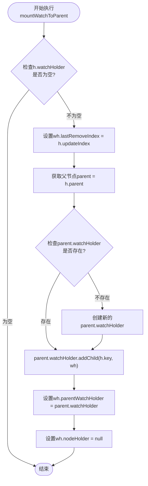
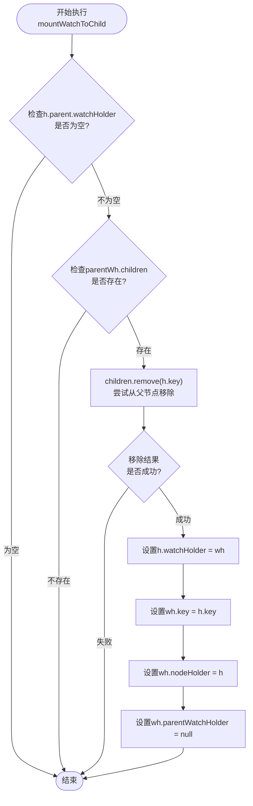
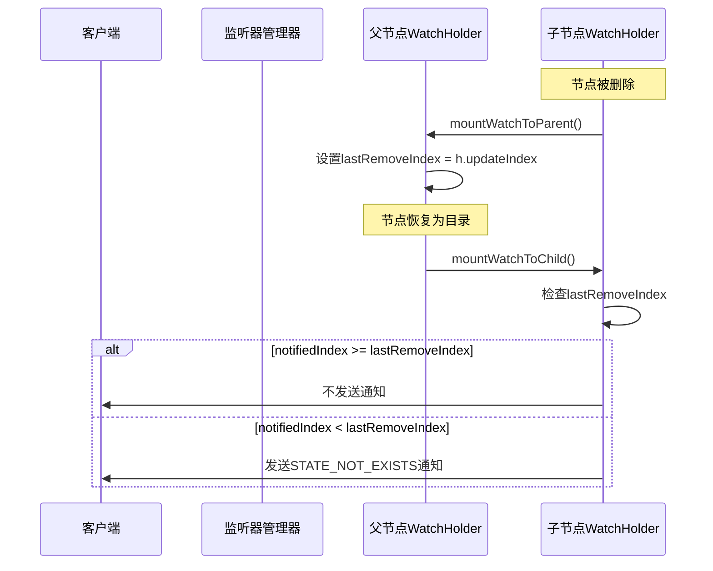
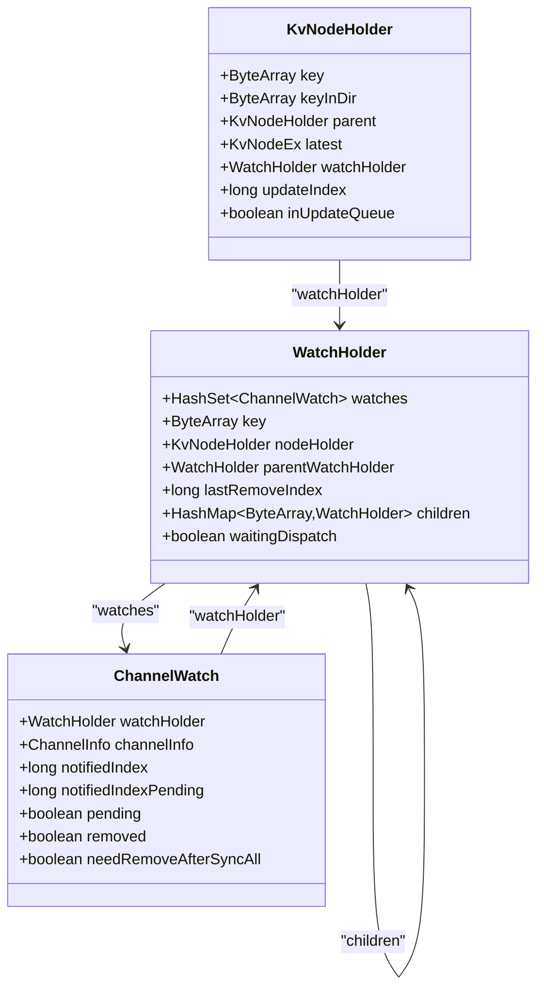
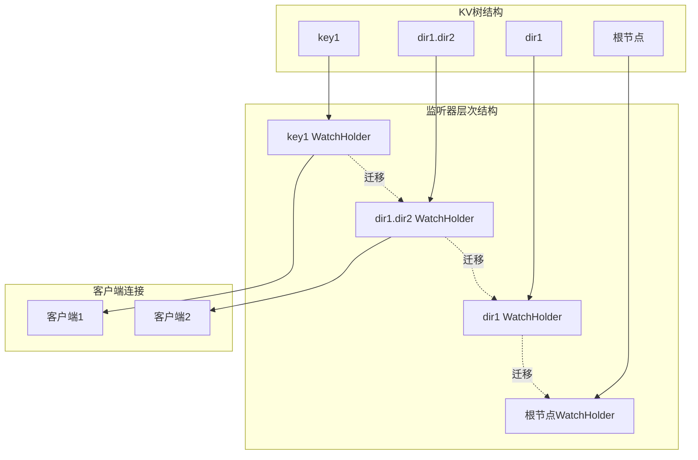
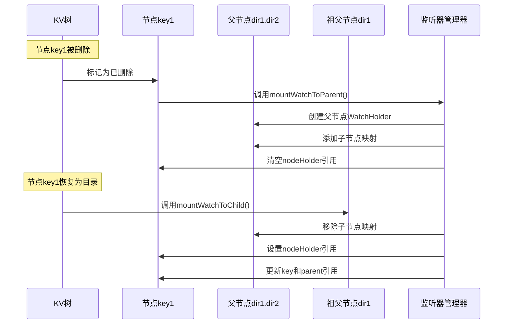

# 监听器迁移逻辑

<cite>
**本文档中引用的文件**
- [ServerWatchManager.java](file://server/src/main/java/com/github/dtprj/dongting/dtkv/server/ServerWatchManager.java)
- [KvNodeHolder.java](file://server/src/main/java/com/github/dtprj/dongting/dtkv/server/KvNodeHolder.java)
- [KvImpl.java](file://server/src/main/java/com/github/dtprj/dongting/dtkv/server/KvImpl.java)
- [ServerWatchManagerTest.java](file://server/src/test/java/com/github/dtprj/dongting/dtkv/server/ServerWatchManagerTest.java)
</cite>

## 目录
1. [简介](#简介)
2. [核心组件概述](#核心组件概述)
3. [监听器迁移机制](#监听器迁移机制)
4. [mountWatchToParent方法详解](#mountWatchToParent方法详解)
5. [mountWatchToChild方法详解](#mountWatchToChild方法详解)
6. [lastRemoveIndex字段的作用](#lastRemoveindex字段的作用)
7. [节点迁移过程中的引用更新](#节点迁移过程中的引用更新)
8. [架构图解](#架构图解)
9. [性能考虑](#性能考虑)
10. [故障排除指南](#故障排除指南)
11. [总结](#总结)

## 简介

在Dongting分布式键值存储系统中，监听器迁移机制是确保数据变更通知连续性的关键组件。当KV树结构发生变化时，特别是节点被删除或恢复时，监听器需要从一个节点迁移到另一个节点以继续接收事件通知。本文档详细阐述了`mountWatchToParent`和`mountWatchToChild`两个核心方法的实现原理及其在KV树结构调整时的监听器迁移机制。

## 核心组件概述

### WatchHolder类

`WatchHolder`是监听器迁移的核心数据结构，负责管理与特定键关联的所有监听器：

```java
final class WatchHolder {
    final HashSet<ChannelWatch> watches = new HashSet<>();
    
    // 这些字段可能会被更新
    ByteArray key;
    KvNodeHolder nodeHolder;
    WatchHolder parentWatchHolder;
    long lastRemoveIndex; // 仅在挂载到父目录时使用
    
    HashMap<ByteArray, WatchHolder> children;
    boolean waitingDispatch;
}
```

### 关键字段说明

- **watches**: 存储所有与此WatchHolder关联的ChannelWatch对象
- **key**: 当前节点的键名
- **nodeHolder**: 指向实际KV节点的引用
- **parentWatchHolder**: 指向父级WatchHolder的引用
- **lastRemoveIndex**: 记录最后一次移除操作的索引，用于避免重复通知
- **children**: 子节点的映射表
- **waitingDispatch**: 标记是否等待分发的通知

**章节来源**
- [ServerWatchManager.java](file://server/src/main/java/com/github/dtprj/dongting/dtkv/server/ServerWatchManager.java#L628-L672)

## 监听器迁移机制

监听器迁移机制的核心思想是在KV树结构调整时，动态地将监听器从一个节点迁移到另一个节点，以确保监听器能够持续接收到正确的事件通知。

### 迁移触发时机

1. **节点删除时**：当节点被标记为已删除时，其关联的监听器会迁移到父节点
2. **节点恢复时**：当节点从删除状态恢复时，监听器会从父节点迁回原节点

### 迁移方向

- **向上迁移**：从子节点到父节点（mountWatchToParent）
- **向下迁移**：从父节点到子节点（mountWatchToChild）

**章节来源**
- [ServerWatchManager.java](file://server/src/main/java/com/github/dtprj/dongting/dtkv/server/ServerWatchManager.java#L119-L207)

## mountWatchToParent方法详解

`mountWatchToParent`方法负责将监听器从子节点迁移到父节点，以处理节点删除的情况。

### 方法实现

```java
public void mountWatchToParent(KvNodeHolder h) {
    WatchHolder wh = h.watchHolder;
    if (wh != null) {
        wh.lastRemoveIndex = h.updateIndex;
        KvNodeHolder parent = h.parent;
        if (parent.watchHolder == null) {
            parent.watchHolder = new WatchHolder(parent.key, parent, null);
        }
        parent.watchHolder.addChild(h.key, wh);
        wh.parentWatchHolder = parent.watchHolder;
        wh.nodeHolder = null;
    }
}
```

### 执行流程



**图表来源**
- [ServerWatchManager.java](file://server/src/main/java/com/github/dtprj/dongting/dtkv/server/ServerWatchManager.java#L150-L162)

### 关键步骤解析

1. **设置lastRemoveIndex**：记录节点被删除时的更新索引
2. **创建父节点的WatchHolder**：如果父节点没有WatchHolder，则创建一个新的
3. **添加到父节点的子节点映射**：将当前WatchHolder添加到父节点的children映射中
4. **更新引用关系**：
   - 设置parentWatchHolder指向父节点的WatchHolder
   - 清空nodeHolder引用，表示不再直接关联具体节点

**章节来源**
- [ServerWatchManager.java](file://server/src/main/java/com/github/dtprj/dongting/dtkv/server/ServerWatchManager.java#L150-L162)

## mountWatchToChild方法详解

`mountWatchToChild`方法负责将监听器从父节点迁回子节点，以处理节点恢复的情况。

### 方法实现

```java
public void mountWatchToChild(KvNodeHolder h) {
    WatchHolder parentWh = h.parent.watchHolder;
    if (parentWh != null) {
        HashMap<ByteArray, WatchHolder> children = parentWh.children;
        if (children != null) {
            WatchHolder wh = children.remove(h.key);
            if (wh != null) {
                h.watchHolder = wh;
                wh.key = h.key;
                wh.nodeHolder = h;
                wh.parentWatchHolder = null;
            }
        }
    }
}
```

### 执行流程



**图表来源**
- [ServerWatchManager.java](file://server/src/main/java/com/github/dtprj/dongting/dtkv/server/ServerWatchManager.java#L164-L176)

### 关键步骤解析

1. **从父节点移除**：从父节点的children映射中移除当前节点的WatchHolder
2. **设置节点引用**：将移除的WatchHolder赋值给当前节点的watchHolder
3. **更新键名**：同步更新WatchHolder的key为当前节点的键名
4. **建立新引用关系**：
   - 将nodeHolder指向当前节点
   - 清空parentWatchHolder引用

**章节来源**
- [ServerWatchManager.java](file://server/src/main/java/com/github/dtprj/dongting/dtkv/server/ServerWatchManager.java#L164-L176)

## lastRemoveIndex字段的作用

`lastRemoveIndex`字段是监听器迁移机制中的关键组件，用于避免重复通知和确保通知的正确性。

### 作用机制



**图表来源**
- [ServerWatchManager.java](file://server/src/main/java/com/github/dtprj/dongting/dtkv/server/ServerWatchManager.java#L345-L372)

### 防止重复通知

1. **通知索引比较**：在创建通知时，比较`notifiedIndex`与`lastRemoveIndex`
2. **跳过重复通知**：如果`notifiedIndex >= lastRemoveIndex`，则跳过该通知
3. **确保唯一性**：只有当通知索引小于lastRemoveIndex时才发送通知

### 实现细节

```java
private WatchNotify createNotify(ChannelWatch w) {
    // 对于已删除的节点
    long lastRemoveIndex = w.watchHolder.lastRemoveIndex;
    if (w.notifiedIndex >= lastRemoveIndex) {
        return null; // 跳过重复通知
    } else {
        w.notifiedIndexPending = lastRemoveIndex;
        return new WatchNotify(lastRemoveIndex, WatchEvent.STATE_NOT_EXISTS,
                w.watchHolder.key.getData(), null);
    }
}
```

**章节来源**
- [ServerWatchManager.java](file://server/src/main/java/com/github/dtprj/dongting/dtkv/server/ServerWatchManager.java#L345-L372)

## 节点迁移过程中的引用更新策略

在KV树结构调整过程中，引用更新策略确保了监听器能够正确地在不同节点之间迁移。

### 引用更新流程



**图表来源**
- [ServerWatchManager.java](file://server/src/main/java/com/github/dtprj/dongting/dtkv/server/ServerWatchManager.java#L628-L672)
- [KvNodeHolder.java](file://server/src/main/java/com/github/dtprj/dongting/dtkv/server/KvNodeHolder.java#L20-L40)

### 更新策略

1. **双向引用维护**：
   - WatchHolder与KvNodeHolder之间的双向引用
   - WatchHolder与父节点WatchHolder之间的层级引用
   - WatchHolder与子节点WatchHolder之间的映射关系

2. **引用清理**：
   - 在迁移过程中及时清理无效引用
   - 避免内存泄漏和循环引用

3. **原子性更新**：
   - 确保引用更新的原子性
   - 使用适当的锁机制保护并发访问

**章节来源**
- [ServerWatchManager.java](file://server/src/main/java/com/github/dtprj/dongting/dtkv/server/ServerWatchManager.java#L150-L176)

## 架构图解

### 整体架构



### 迁移路径示例



**图表来源**
- [ServerWatchManager.java](file://server/src/main/java/com/github/dtprj/dongting/dtkv/server/ServerWatchManager.java#L150-L176)
- [KvImpl.java](file://server/src/main/java/com/github/dtprj/dongting/dtkv/server/KvImpl.java#L660-L425)

## 性能考虑

### 内存优化

1. **延迟创建**：WatchHolder只在需要时才创建
2. **引用复用**：避免不必要的对象创建
3. **及时清理**：在不需要时及时清理引用

### 并发安全

1. **无锁设计**：大部分操作无需加锁
2. **原子更新**：使用原子操作更新引用
3. **读写分离**：区分读操作和写操作的并发控制

### 批量处理

1. **批量迁移**：支持批量处理多个监听器迁移
2. **分批通知**：避免大量通知同时发送导致性能问题
3. **异步处理**：使用异步机制处理通知分发

## 故障排除指南

### 常见问题

1. **监听器丢失**
   - 检查mountWatchToParent/mountWatchToChild调用
   - 验证引用更新是否正确完成

2. **重复通知**
   - 检查lastRemoveIndex的设置
   - 验证notifiedIndex的比较逻辑

3. **内存泄漏**
   - 检查引用清理是否及时
   - 验证WatchHolder的生命周期管理

### 调试技巧

1. **日志跟踪**：启用详细日志记录迁移过程
2. **状态检查**：定期检查WatchHolder的状态
3. **引用验证**：验证引用关系的正确性

**章节来源**
- [ServerWatchManagerTest.java](file://server/src/test/java/com/github/dtprj/dongting/dtkv/server/ServerWatchManagerTest.java#L436-L533)

## 总结

Dongting系统的监听器迁移机制通过`mountWatchToParent`和`mountWatchToChild`方法实现了KV树结构调整时监听器的无缝迁移。这一机制确保了：

1. **连续性保证**：即使节点被删除或恢复，监听器仍能持续接收正确的事件通知
2. **高效迁移**：通过合理的引用管理和优化策略，实现了高效的监听器迁移
3. **错误处理**：完善的错误处理机制确保了系统的稳定性
4. **性能优化**：通过批量处理和异步机制优化了整体性能

这种设计不仅保证了系统的可靠性，还为分布式环境下的数据变更通知提供了强有力的支持。通过深入理解这些机制，开发者可以更好地利用Dongting系统构建高可用的分布式应用。