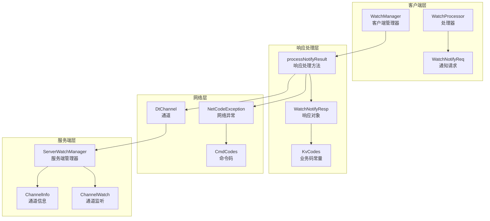
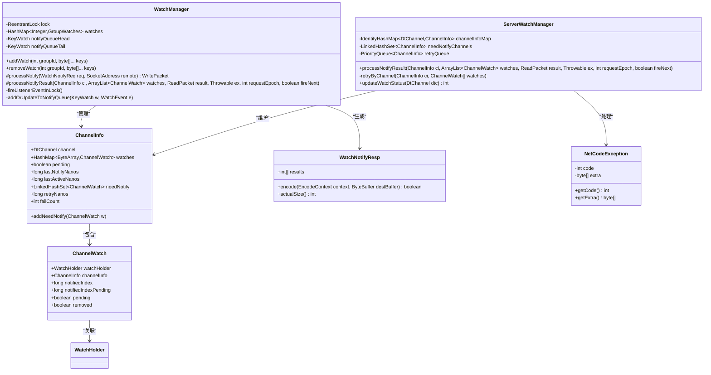
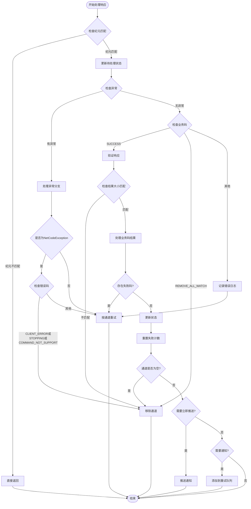
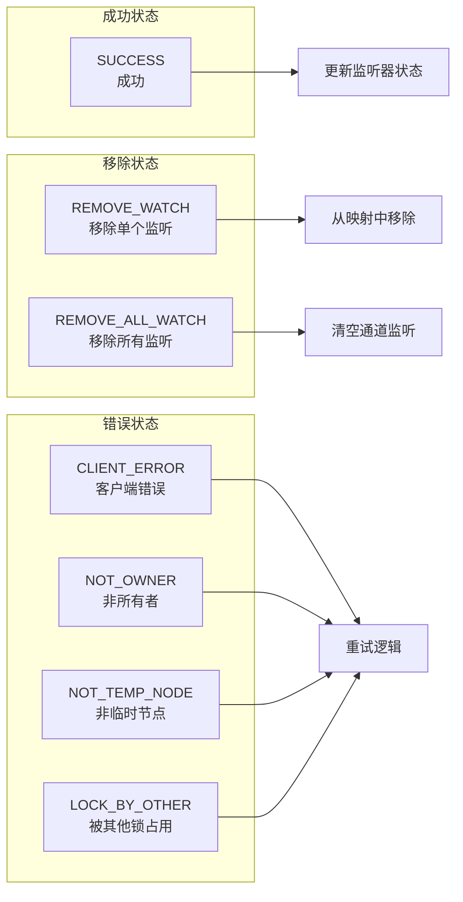
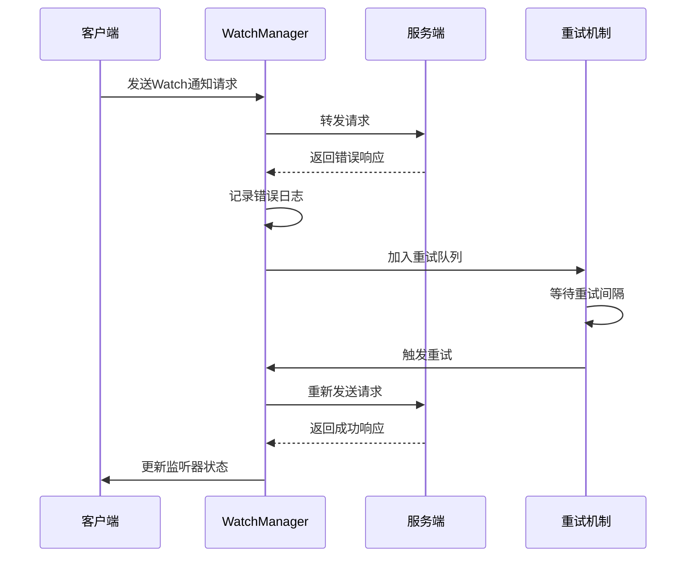
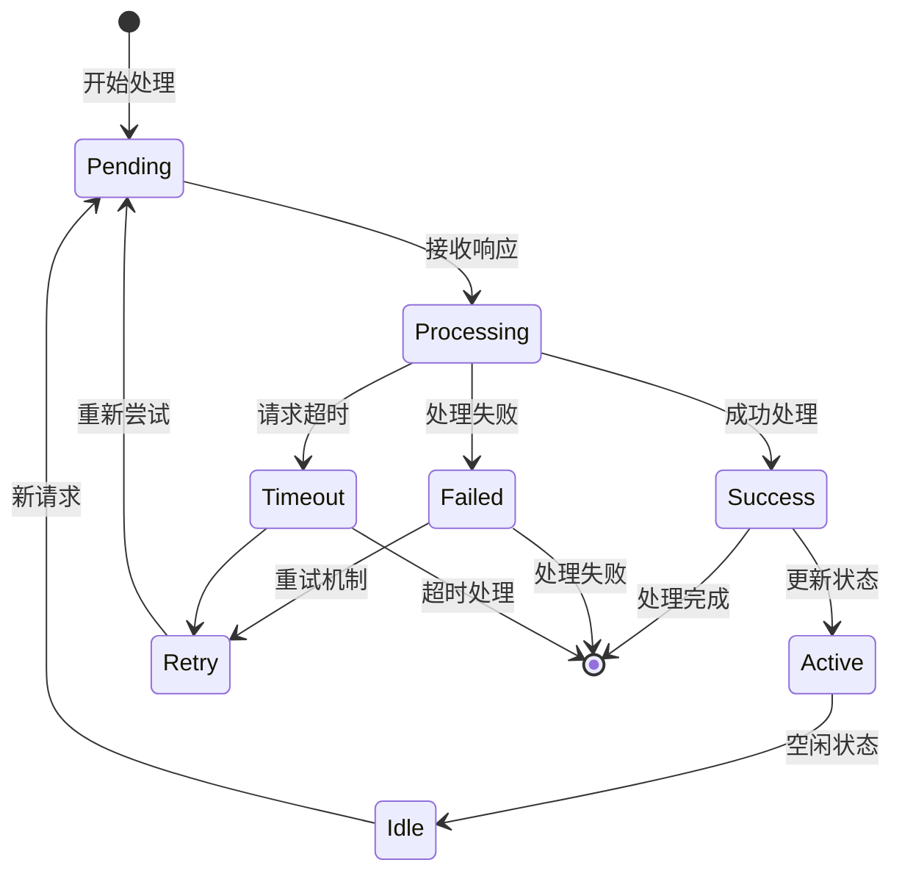

# 客户端响应处理机制

<cite>
**本文档引用的文件**
- [WatchManager.java](file://client/src/main/java/com/github/dtprj/dongting/dtkv/WatchManager.java)
- [ServerWatchManager.java](file://server/src/main/java/com/github/dtprj/dongting/dtkv/server/ServerWatchManager.java)
- [WatchNotifyResp.java](file://client/src/main/java/com/github/dtprj/dongting/dtkv/WatchNotifyResp.java)
- [KvCodes.java](file://client/src/main/java/com/github/dtprj/dongting/dtkv/KvCodes.java)
- [NetCodeException.java](file://client/src/main/java/com/github/dtprj/dongting/net/NetCodeException.java)
- [WatchProcessor.java](file://client/src/main/java/com/github/dtprj/dongting/dtkv/WatchProcessor.java)
- [ServerWatchManagerTest.java](file://server/src/test/java/com/github/dtprj/dongting/dtkv/server/ServerWatchManagerTest.java)
</cite>

## 目录
1. [概述](#概述)
2. [核心组件架构](#核心组件架构)
3. [processNotifyResult方法详解](#processNotifyResult方法详解)
4. [响应类型处理策略](#响应类型处理策略)
5. [错误处理机制](#错误处理机制)
6. [状态管理与更新](#状态管理与更新)
7. [性能考虑](#性能考虑)
8. [故障排除指南](#故障排除指南)
9. [总结](#总结)

## 概述

客户端响应处理机制是Dongting分布式键值存储系统的核心组件之一，负责处理来自服务器的WatchNotifyResp响应。该机制通过`processNotifyResult()`方法实现了对客户端Watch通知响应的全面处理，包括成功响应验证、业务错误码分类处理、网络异常捕获以及状态更新等关键功能。

该机制采用事件驱动的设计模式，能够高效地处理大量并发的Watch通知请求，确保系统的高可用性和数据一致性。通过精确的状态管理和错误恢复机制，系统能够在各种异常情况下保持稳定运行。

## 核心组件架构

### 系统架构概览



**图表来源**
- [WatchManager.java](file://client/src/main/java/com/github/dtprj/dongting/dtkv/WatchManager.java#L471-L507)
- [ServerWatchManager.java](file://server/src/main/java/com/github/dtprj/dongting/dtkv/server/ServerWatchManager.java#L374-L405)

### 关键类关系图



**图表来源**
- [WatchManager.java](file://client/src/main/java/com/github/dtprj/dongting/dtkv/WatchManager.java#L60-L120)
- [ServerWatchManager.java](file://server/src/main/java/com/github/dtprj/dongting/dtkv/server/ServerWatchManager.java#L570-L629)

**章节来源**
- [WatchManager.java](file://client/src/main/java/com/github/dtprj/dongting/dtkv/WatchManager.java#L1-L100)
- [ServerWatchManager.java](file://server/src/main/java/com/github/dtprj/dongting/dtkv/server/ServerWatchManager.java#L46-L70)

## processNotifyResult方法详解

### 方法签名与参数说明

`processNotifyResult()`方法是响应处理的核心入口点，其完整签名如下：

```java
public void processNotifyResult(ChannelInfo ci, ArrayList<ChannelWatch> watches,
                                ReadPacket<WatchNotifyRespCallback> result,
                                Throwable ex, int requestEpoch, boolean fireNext)
```

### 参数详细说明

- **ci**: ChannelInfo对象，表示与特定客户端连接的通道信息
- **watches**: ArrayList<ChannelWatch>，包含所有待处理的监听器
- **result**: ReadPacket<WatchNotifyRespCallback>，包含服务器返回的响应数据
- **ex**: Throwable，可能发生的异常对象
- **requestEpoch**: int，请求的纪元编号，用于防止过期请求处理
- **fireNext**: boolean，指示是否立即触发下一个通知

### 执行流程图



**图表来源**
- [ServerWatchManager.java](file://server/src/main/java/com/github/dtprj/dongting/dtkv/server/ServerWatchManager.java#L374-L446)

**章节来源**
- [ServerWatchManager.java](file://server/src/main/java/com/github/dtprj/dongting/dtkv/server/ServerWatchManager.java#L374-L446)

## 响应类型处理策略

### 成功响应处理

当接收到成功的业务码（KvCodes.SUCCESS）时，系统执行以下处理流程：

1. **响应验证**：首先验证响应结果数组的长度是否与请求的监听器数量相匹配
2. **逐个处理**：遍历每个监听器的结果码
3. **状态更新**：根据业务码更新相应的状态信息

```java
// 成功响应处理示例
if (result.bizCode == KvCodes.SUCCESS) {
    WatchNotifyRespCallback callback = result.getBody();
    if (callback.results.length != watches.size()) {
        log.error("response results size not match, expect {}, but got {}",
                watches.size(), callback.results.length);
        removeByChannel(ci.channel);
        return;
    }
    
    boolean hasFailCode = false;
    for (int size = watches.size(), i = 0; i < size; i++) {
        int bizCode = callback.results[i];
        ChannelWatch w = watches.get(i);
        if (bizCode == KvCodes.REMOVE_WATCH) {
            ci.watches.remove(w.watchHolder.key);
            removeWatchFromKvTree(w);
        } else {
            if (bizCode != KvCodes.SUCCESS) {
                hasFailCode = true;
                log.error("notify failed. remote={}, bizCode={}", 
                         ci.channel.getRemoteAddr(), bizCode);
            } else {
                w.notifiedIndex = w.notifiedIndexPending;
                ci.addNeedNotify(w);
            }
        }
    }
}
```

### 业务错误码分类处理

系统支持多种业务错误码，每种都有特定的处理策略：



**图表来源**
- [KvCodes.java](file://client/src/main/java/com/github/dtprj/dongting/dtkv/KvCodes.java#L20-L114)

**章节来源**
- [ServerWatchManager.java](file://server/src/main/java/com/github/dtprj/dongting/dtkv/server/ServerWatchManager.java#L407-L435)
- [KvCodes.java](file://client/src/main/java/com/github/dtprj/dongting/dtkv/KvCodes.java#L20-L114)

## 错误处理机制

### 网络异常处理

系统对网络异常进行了细致的分类和处理：

```java
if (ex != null) {
    log.warn("notify failed. remote={}, ex={}", ci.channel.getRemoteAddr(), ex);
    if (ex instanceof NetCodeException) {
        NetCodeException nce = (NetCodeException) ex;
        if (nce.getCode() == CmdCodes.CLIENT_ERROR || 
            nce.getCode() == CmdCodes.STOPPING ||
            nce.getCode() == CmdCodes.COMMAND_NOT_SUPPORT) {
            removeByChannel(ci.channel);
            return;
        }
    }
    retryByChannel(ci, watches);
}
```

### 异常类型分类

1. **致命异常**：当网络异常的错误码为CLIENT_ERROR、STOPPING或COMMAND_NOT_SUPPORT时，系统会直接移除对应的通道
2. **可重试异常**：其他类型的网络异常会被加入重试队列
3. **业务异常**：非网络异常的业务错误会记录日志并触发重试

### 错误恢复策略



**图表来源**
- [ServerWatchManager.java](file://server/src/main/java/com/github/dtprj/dongting/dtkv/server/ServerWatchManager.java#L448-L455)

**章节来源**
- [ServerWatchManager.java](file://server/src/main/java/com/github/dtprj/dongting/dtkv/server/ServerWatchManager.java#L385-L405)
- [NetCodeException.java](file://client/src/main/java/com/github/dtprj/dongting/net/NetCodeException.java#L20-L48)

## 状态管理与更新

### ChannelInfo状态更新

当响应处理完成后，系统会更新ChannelInfo的各种状态字段：

```java
// 更新通道状态
ci.failCount = 0;
ci.lastActiveNanos = ts.nanoTime;

// 处理空通道情况
if (ci.watches.isEmpty()) {
    removeByChannel(ci.channel);
} else if (fireNext) {
    pushNotify(ci);
} else if (ci.needNotify != null && !ci.needNotify.isEmpty()) {
    needNotifyChannels.add(ci);
}
```

### ChannelWatch状态同步

对于每个ChannelWatch，系统会同步pending状态：

```java
// 同步监听器状态
for (int size = watches.size(), i = 0; i < size; i++) {
    ChannelWatch w = watches.get(i);
    w.pending = false;
}
```

### 状态更新流程



**图表来源**
- [ServerWatchManager.java](file://server/src/main/java/com/github/dtprj/dongting/dtkv/server/ServerWatchManager.java#L425-L446)

**章节来源**
- [ServerWatchManager.java](file://server/src/main/java/com/github/dtprj/dongting/dtkv/server/ServerWatchManager.java#L380-L446)

## 性能考虑

### 并发控制

系统使用ReentrantLock来确保线程安全：

```java
lock.lock();
try {
    // 执行关键操作
} finally {
    lock.unlock();
}
```

### 内存优化

- 使用对象池减少GC压力
- 及时清理不再使用的监听器
- 避免内存泄漏

### 网络优化

- 支持批量处理多个监听器的通知
- 实现了指数退避的重试机制
- 连接复用和保活机制

## 故障排除指南

### 常见问题诊断

1. **响应结果数量不匹配**
   - 症状：日志显示"response results size not match"
   - 解决方案：检查客户端和服务端的监听器状态同步

2. **网络异常频繁**
   - 症状：大量NetCodeException日志
   - 解决方案：检查网络连接质量和防火墙设置

3. **监听器状态不一致**
   - 症状：监听器无法正常工作
   - 解决方案：重启客户端或手动清理监听器

### 调试技巧

- 启用详细日志记录
- 使用监控工具跟踪性能指标
- 定期检查系统健康状态

**章节来源**
- [ServerWatchManager.java](file://server/src/main/java/com/github/dtprj/dongting/dtkv/server/ServerWatchManager.java#L395-L405)

## 总结

Dongting的客户端响应处理机制是一个设计精良、功能完备的系统，它通过`processNotifyResult()`方法实现了对Watch通知响应的全面处理。该机制具有以下特点：

1. **健壮性**：完善的错误处理和恢复机制确保系统稳定性
2. **高效性**：并发控制和性能优化保证了高吞吐量
3. **可扩展性**：模块化设计便于功能扩展和维护
4. **可观测性**：详细的日志记录和监控支持故障诊断

通过深入理解这个响应处理机制，开发者可以更好地利用Dongting系统构建可靠的分布式应用，同时也能在遇到问题时快速定位和解决。