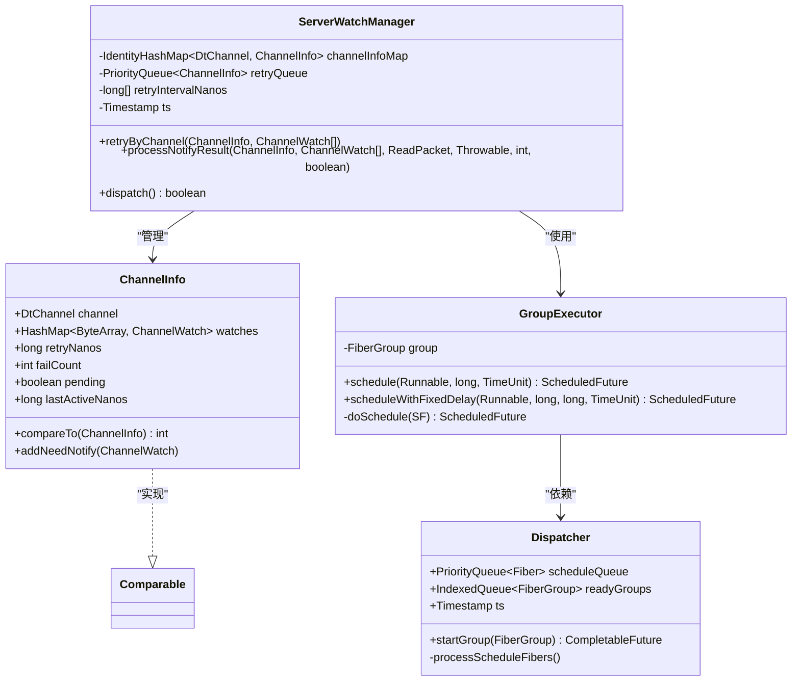
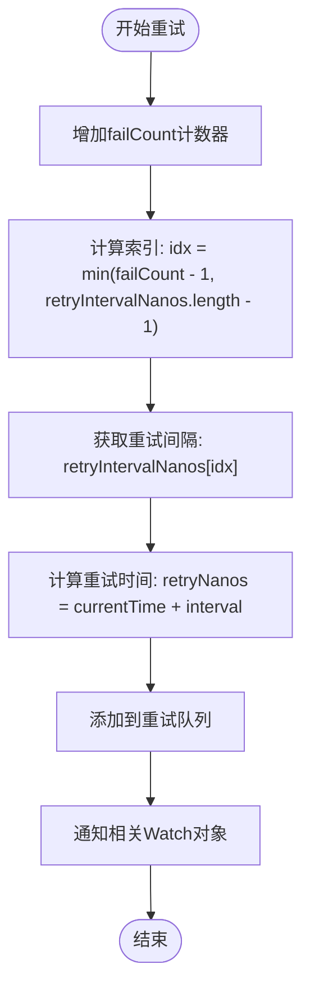
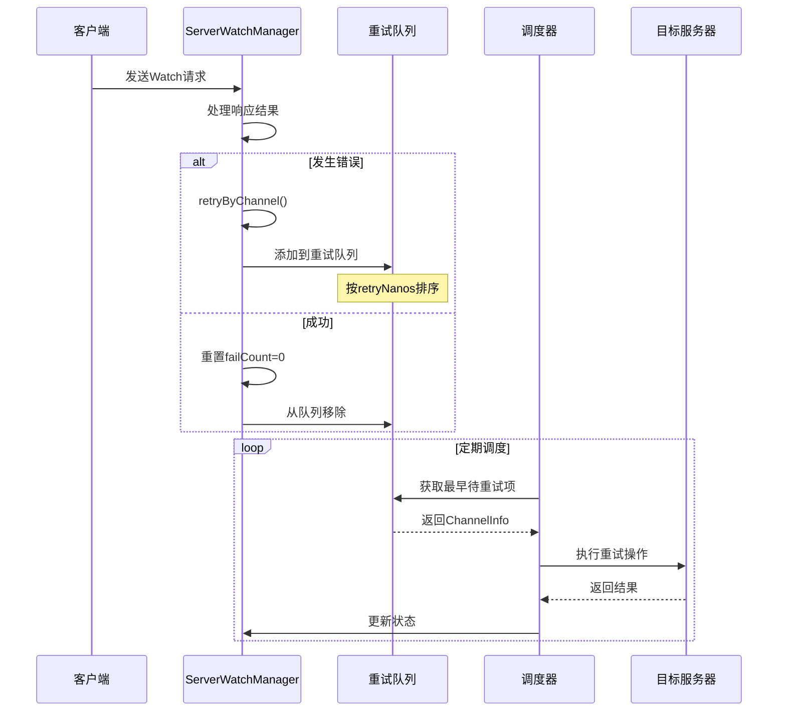
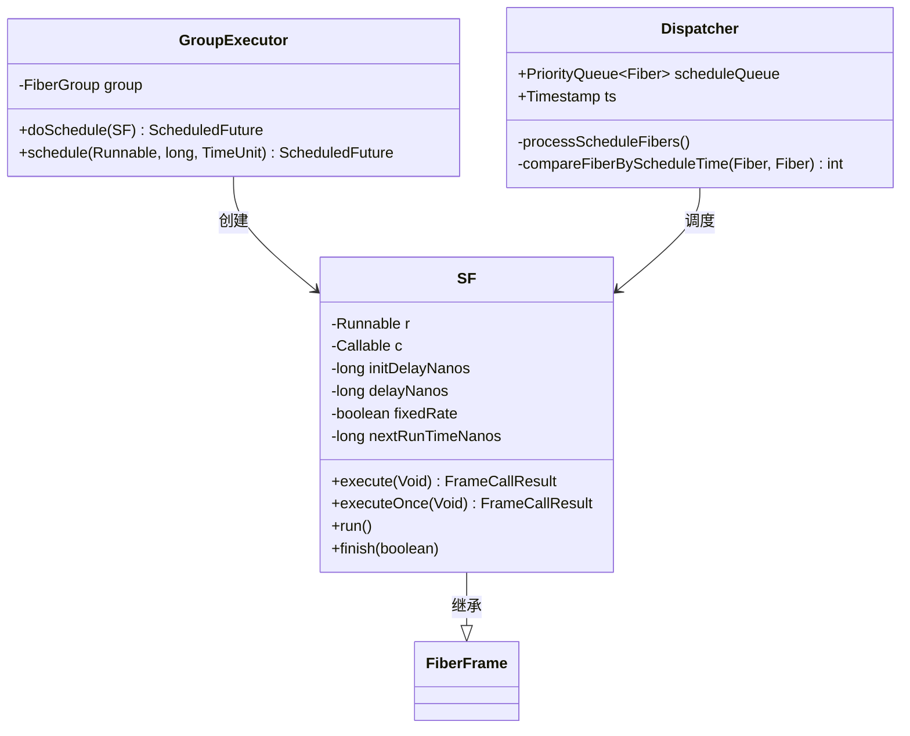
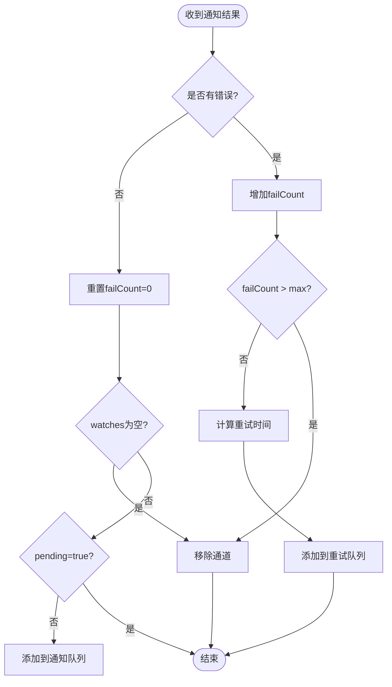

# 指数退避重试策略

<cite>
**本文档中引用的文件**
- [ServerWatchManager.java](file://server/src/main/java/com/github/dtprj/dongting/dtkv/server/ServerWatchManager.java)
- [GroupExecutor.java](file://server/src/main/java/com/github/dtprj/dongting/fiber/GroupExecutor.java)
- [Dispatcher.java](file://server/src/main/java/com/github/dtprj/dongting/fiber/Dispatcher.java)
- [ServerWatchManagerTest.java](file://server/src/test/java/com/github/dtprj/dongting/dtkv/server/ServerWatchManagerTest.java)
</cite>

## 目录
1. [简介](#简介)
2. [核心组件架构](#核心组件架构)
3. [指数退避算法实现](#指数退避算法实现)
4. [重试队列管理机制](#重试队列管理机制)
5. [调度器工作原理](#调度器工作原理)
6. [详细组件分析](#详细组件分析)
7. [性能考虑](#性能考虑)
8. [故障排除指南](#故障排除指南)
9. [总结](#总结)

## 简介

指数退避重试策略是一种智能的错误处理机制，通过递增的重试间隔来应对瞬时网络故障，同时避免对不可用客户端进行过度重试。在Dongting框架中，这一策略被广泛应用于KvServer的Watch功能中，确保消息可靠性和系统资源消耗之间的平衡。

该策略的核心思想是：当发生错误时，不是立即重试，而是等待一段时间后再尝试；如果再次失败，则等待更长的时间，以此类推。这种机制能够有效减少对故障服务器的压力，提高系统的整体稳定性。

## 核心组件架构



**图表来源**
- [ServerWatchManager.java](file://server/src/main/java/com/github/dtprj/dongting/dtkv/server/ServerWatchManager.java#L448-L488)
- [GroupExecutor.java](file://server/src/main/java/com/github/dtprj/dongting/fiber/GroupExecutor.java#L40-L50)
- [Dispatcher.java](file://server/src/main/java/com/github/dtprj/dongting/fiber/Dispatcher.java#L40-L60)

## 指数退避算法实现

### failCount计数器机制

指数退避策略的核心在于`failCount`计数器的管理：

```java
private void retryByChannel(ChannelInfo ci, List<ChannelWatch> watches) {
    ci.failCount++;  // 增加失败计数
    int idx = Math.min(ci.failCount - 1, retryIntervalNanos.length - 1);
    ci.retryNanos = ts.nanoTime + retryIntervalNanos[idx];
    retryQueue.add(ci);
    for (int size = watches.size(), i = 0; i < size; i++) {
        ci.addNeedNotify(watches.get(i));
    }
}
```

### 重试间隔计算逻辑



**图表来源**
- [ServerWatchManager.java](file://server/src/main/java/com/github/dtprj/dongting/dtkv/server/ServerWatchManager.java#L448-L458)

### 默认重试间隔配置

系统提供了灵活的重试间隔配置，默认值为：
- 第1次重试：1秒 (1000ms)
- 第2次重试：10秒 (10000ms)
- 第3次重试：30秒 (30000ms)
- 第4次重试：60秒 (60000ms)

```java
ServerWatchManager(int groupId, Timestamp ts, KvConfig config, long[] retryIntervalMillis) {
    this.retryIntervalNanos = new long[retryIntervalMillis.length];
    for (int i = 0; i < retryIntervalMillis.length; i++) {
        this.retryIntervalNanos[i] = TimeUnit.MILLISECONDS.toNanos(retryIntervalMillis[i]);
    }
}
```

**章节来源**
- [ServerWatchManager.java](file://server/src/main/java/com/github/dtprj/dongting/dtkv/server/ServerWatchManager.java#L60-L78)

## 重试队列管理机制

### 优先队列排序机制

`ChannelInfo`实现了`Comparable`接口，基于`retryNanos`字段进行排序：

```java
@Override
public int compareTo(ChannelInfo o) {
    long diff = retryNanos - o.retryNanos;
    return diff < 0 ? -1 : (diff > 0 ? 1 : 0);
}
```

这确保了重试队列中的通道按照预期的重试时间顺序排列，最早需要重试的通道排在队列前面。

### 队列调度流程



**图表来源**
- [ServerWatchManager.java](file://server/src/main/java/com/github/dtprj/dongting/dtkv/server/ServerWatchManager.java#L245-L283)

**章节来源**
- [ServerWatchManager.java](file://server/src/main/java/com/github/dtprj/dongting/dtkv/server/ServerWatchManager.java#L448-L488)

## 调度器工作原理

### Fiber调度机制

Dongting框架使用Fiber协程来实现高效的异步调度：



**图表来源**
- [GroupExecutor.java](file://server/src/main/java/com/github/dtprj/dongting/fiber/GroupExecutor.java#L80-L120)
- [Dispatcher.java](file://server/src/main/java/com/github/dtprj/dongting/fiber/Dispatcher.java#L40-L60)

### 调度器核心逻辑

调度器通过以下机制确保重试任务按时执行：

```java
private void processScheduleFibers() {
    Timestamp ts = this.ts;
    long now = ts.nanoTime;
    while (!scheduleQueue.isEmpty()) {
        Fiber f = scheduleQueue.peek();
        if (f.scheduleNanoTime > now) {
            break;
        }
        scheduleQueue.poll();
        f.prepare(f, false);
        f.cleanSchedule();
        group.tryMakeFiberReady(f, false);
    }
}
```

**章节来源**
- [GroupExecutor.java](file://server/src/main/java/com/github/dtprj/dongting/fiber/GroupExecutor.java#L80-L120)
- [Dispatcher.java](file://server/src/main/java/com/github/dtprj/dongting/fiber/Dispatcher.java#L172-L207)

## 详细组件分析

### ServerWatchManager核心功能

`ServerWatchManager`是指数退避策略的主要执行者，负责：

1. **监控通道状态**：跟踪每个DtChannel的活跃状态和失败次数
2. **管理重试队列**：维护一个按重试时间排序的优先队列
3. **处理通知结果**：根据通知结果决定是否需要重试
4. **批量调度**：定期处理待重试的通道，避免阻塞主线程

### ChannelInfo数据结构

```java
final class ChannelInfo implements Comparable<ChannelInfo> {
    final DtChannel channel;
    final HashMap<ByteArray, ChannelWatch> watches = new HashMap<>(4);
    
    boolean pending;
    long lastNotifyNanos;
    long lastActiveNanos;
    
    LinkedHashSet<ChannelWatch> needNotify;
    
    long retryNanos;
    int failCount;
    
    boolean remove;
}
```

### 重试决策流程



**图表来源**
- [ServerWatchManager.java](file://server/src/main/java/com/github/dtprj/dongting/dtkv/server/ServerWatchManager.java#L380-L430)

**章节来源**
- [ServerWatchManager.java](file://server/src/main/java/com/github/dtprj/dongting/dtkv/server/ServerWatchManager.java#L448-L488)

## 性能考虑

### 内存效率优化

1. **对象池化**：使用缓冲区池减少GC压力
2. **延迟初始化**：仅在需要时创建数据结构
3. **及时清理**：主动移除不再使用的通道信息

### 时间复杂度分析

- **重试队列插入**：O(log n)，因为使用了优先队列
- **重试队列查询**：O(1)，直接访问最小元素
- **重试队列删除**：O(log n)，从优先队列中移除
- **调度频率控制**：通过批处理避免频繁调度

### 批量处理机制

系统采用批量处理策略来平衡性能和实时性：

```java
int dispatchBatchSize = config.watchMaxBatchSize;
while (ci != null && ci.retryNanos - ts.nanoTime <= 0) {
    if (++count > dispatchBatchSize) {
        result = false;
        break;
    }
    retryQueue.poll();
    pushNotify(ci);
    ci = retryQueue.peek();
}
```

## 故障排除指南

### 常见问题诊断

1. **重试间隔过长**
   - 检查`failCount`是否正确递增
   - 验证`retryIntervalNanos`数组配置
   - 确认时间戳计算准确性

2. **重试队列堆积**
   - 监控队列大小和增长趋势
   - 检查调度器是否正常工作
   - 验证批处理大小设置

3. **通道状态异常**
   - 检查`remove`标志位
   - 验证队列链接完整性
   - 确认内存泄漏情况

### 调试工具和指标

- **failCount统计**：监控失败次数分布
- **retryNanos对比**：验证重试时间计算
- **队列长度监控**：防止内存溢出
- **调度延迟测量**：评估系统响应性能

**章节来源**
- [ServerWatchManager.java](file://server/src/main/java/com/github/dtprj/dongting/dtkv/server/ServerWatchManager.java#L480-L520)

## 总结

指数退避重试策略是Dongting框架中一个精心设计的错误恢复机制。它通过以下关键特性实现了高效可靠的重试：

1. **智能退避算法**：基于失败次数动态调整重试间隔
2. **优先级调度**：使用优先队列确保及时处理
3. **资源控制**：通过批处理和限制避免系统过载
4. **优雅降级**：在极端情况下自动停止重试

该策略不仅提高了系统的容错能力，还有效地平衡了资源消耗和可靠性需求。通过合理的配置和监控，可以确保系统在面对网络波动和临时故障时保持稳定运行。

对于开发者而言，理解这一机制有助于更好地配置和调优系统参数，以及在遇到相关问题时快速定位和解决。建议在生产环境中持续监控重试行为，并根据实际业务需求调整重试策略参数。