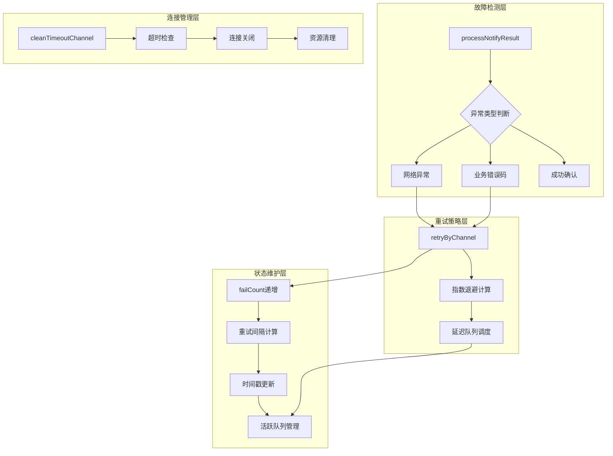
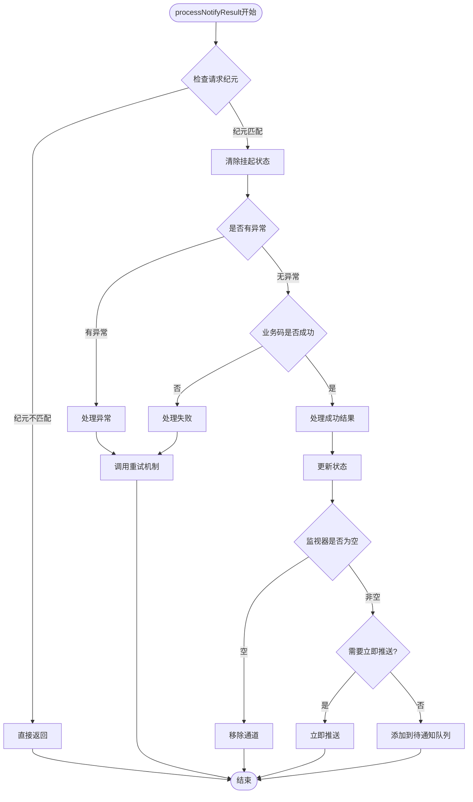
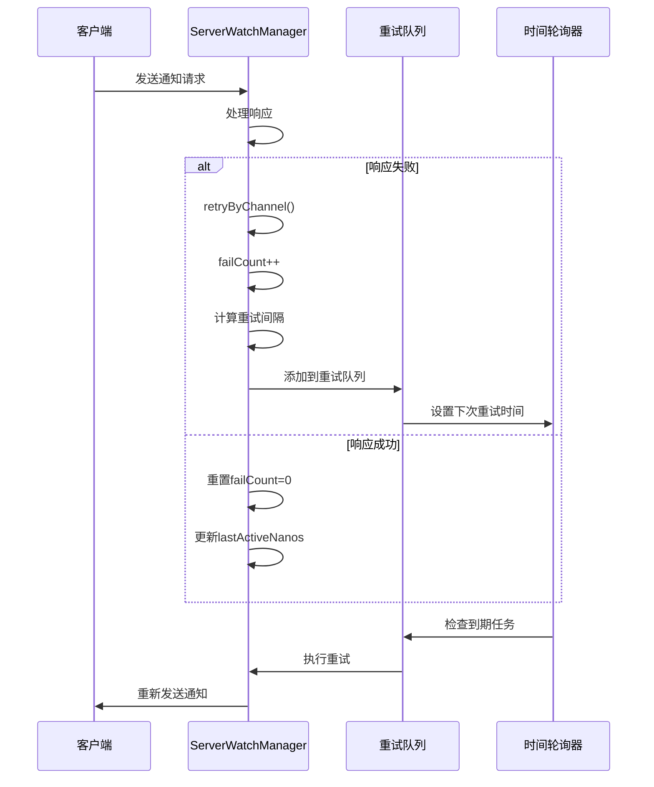
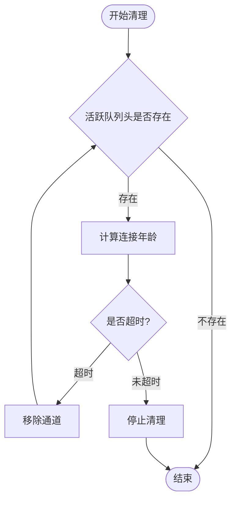
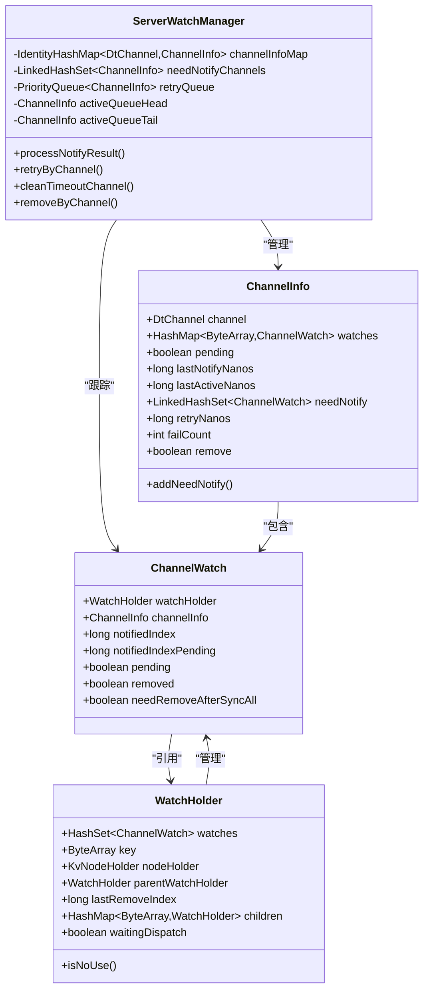
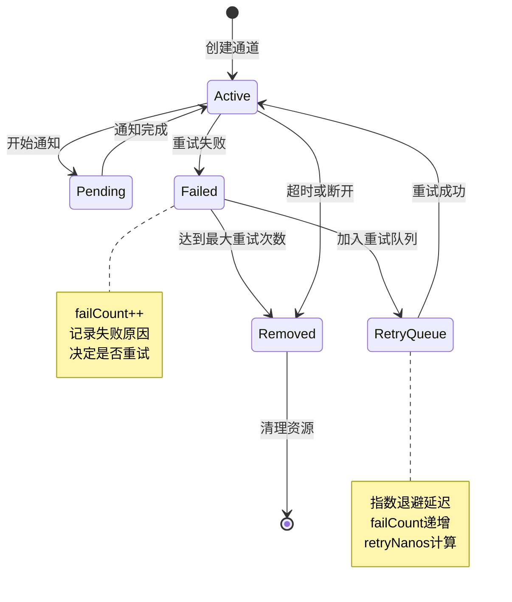
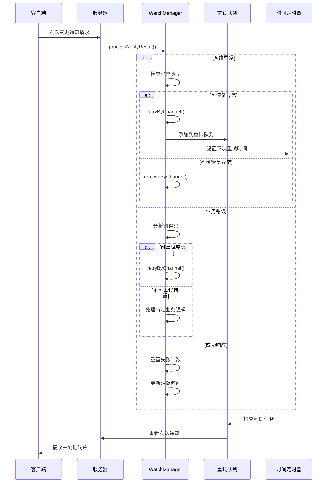
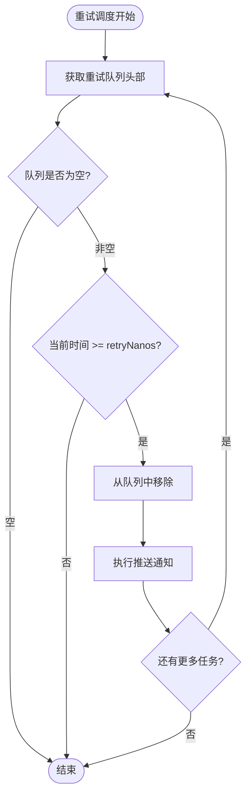

# 故障恢复机制

<cite>
**本文档中引用的文件**
- [ServerWatchManager.java](file://server/src/main/java/com/github/dtprj/dongting/dtkv/server/ServerWatchManager.java)
- [KvCodes.java](file://client/src/main/java/com/github/dtprj/dongting/dtkv/KvCodes.java)
- [CmdCodes.java](file://client/src/main/java/com/github/dtprj/dongting/net/CmdCodes.java)
</cite>

## 目录
1. [简介](#简介)
2. [核心组件概述](#核心组件概述)
3. [故障恢复机制架构](#故障恢复机制架构)
4. [processNotifyResult()详细分析](#processnotifyresult详细分析)
5. [重试机制详解](#重试机制详解)
6. [连接清理机制](#连接清理机制)
7. [数据结构关系图](#数据结构关系图)
8. [故障恢复流程](#故障恢复流程)
9. [性能考虑](#性能考虑)
10. [故障排除指南](#故障排除指南)
11. [总结](#总结)

## 简介

Dongting分布式键值存储系统实现了完善的故障恢复机制，确保在各种网络异常和业务错误情况下能够自动恢复服务。该机制主要通过`processNotifyResult()`方法处理客户端响应，实现指数退避重试策略，并通过`cleanTimeoutChannel()`方法清理长时间未活跃的连接。

## 核心组件概述

故障恢复机制的核心组件包括：

- **ServerWatchManager**: 主要负责监控管理器，处理所有故障恢复逻辑
- **ChannelInfo**: 通道信息对象，维护每个客户端连接的状态
- **ChannelWatch**: 通道监视器，跟踪特定键值对的变更通知
- **WatchHolder**: 监视持有者，管理键值对的监视树结构

## 故障恢复机制架构



**图表来源**
- [ServerWatchManager.java](file://server/src/main/java/com/github/dtprj/dongting/dtkv/server/ServerWatchManager.java#L374-L446)
- [ServerWatchManager.java](file://server/src/main/java/com/github/dtprj/dongting/dtkv/server/ServerWatchManager.java#L448-L456)

## processNotifyResult()详细分析

`processNotifyResult()`是故障恢复机制的核心方法，负责处理客户端响应并根据不同的结果采取相应的恢复措施。

### 方法签名与参数

```java
public void processNotifyResult(ChannelInfo ci, ArrayList<ChannelWatch> watches,
                                ReadPacket<WatchNotifyRespCallback> result,
                                Throwable ex, int requestEpoch, boolean fireNext)
```

### 成功确认处理

当收到成功的业务响应时，方法执行以下步骤：

1. **验证请求纪元**: 检查请求是否过期
2. **标记为非挂起状态**: 清除通道和监视器的挂起标志
3. **处理业务响应**: 验证响应结果的完整性
4. **逐个处理监视器**: 分析每个监视器的业务码



**图表来源**
- [ServerWatchManager.java](file://server/src/main/java/com/github/dtprj/dongting/dtkv/server/ServerWatchManager.java#L374-L446)

### 异常处理分类

#### 网络异常处理

当遇到网络异常时，系统会根据异常类型进行不同的处理：

```java
if (ex instanceof NetCodeException) {
    NetCodeException nce = (NetCodeException) ex;
    if (nce.getCode() == CmdCodes.CLIENT_ERROR || 
        nce.getCode() == CmdCodes.STOPPING ||
        nce.getCode() == CmdCodes.COMMAND_NOT_SUPPORT) {
        removeByChannel(ci.channel);
        return;
    }
}
```

**支持的网络异常类型**:
- **CLIENT_ERROR**: 客户端错误，通常表示客户端问题
- **STOPPING**: 服务器正在停止，连接不再有效
- **COMMAND_NOT_SUPPORT**: 不支持的命令，可能是版本不兼容

#### 业务错误码处理

系统识别多种业务错误码并采取相应措施：

```java
boolean hasFailCode = false;
for (int size = watches.size(), i = 0; i < size; i++) {
    int bizCode = callback.results[i];
    ChannelWatch w = watches.get(i);
    if (bizCode == KvCodes.REMOVE_WATCH) {
        ci.watches.remove(w.watchHolder.key);
        removeWatchFromKvTree(w);
    } else {
        if (bizCode != KvCodes.SUCCESS) {
            hasFailCode = true;
            log.error("notify failed. remote={}, bizCode={}", 
                     ci.channel.getRemoteAddr(), bizCode);
        } else {
            w.notifiedIndex = w.notifiedIndexPending;
            ci.addNeedNotify(w);
        }
    }
}
```

**业务错误码分类**:
- **REMOVE_WATCH**: 移除单个监视器
- **SUCCESS**: 成功状态，正常处理
- **其他错误码**: 记录错误并触发重试

**章节来源**
- [ServerWatchManager.java](file://server/src/main/java/com/github/dtprj/dongting/dtkv/server/ServerWatchManager.java#L374-L446)

## 重试机制详解

### retryByChannel()实现

`retryByChannel()`方法实现了指数退避重试策略，通过增加失败计数和计算延迟时间来控制重试频率。

```java
private void retryByChannel(ChannelInfo ci, List<ChannelWatch> watches) {
    ci.failCount++;
    int idx = Math.min(ci.failCount - 1, retryIntervalNanos.length - 1);
    ci.retryNanos = ts.nanoTime + retryIntervalNanos[idx];
    retryQueue.add(ci);
    for (int size = watches.size(), i = 0; i < size; i++) {
        ci.addNeedNotify(watches.get(i));
    }
}
```

### 指数退避算法

系统使用预定义的重试间隔数组实现指数退避：

```java
// 默认重试间隔配置
new long[]{1000, 10_000, 30_000, 60_000} // 单位：毫秒
```

**退避策略特点**:
1. **失败计数递增**: 每次重试失败后增加失败计数
2. **索引映射**: 将失败计数减一作为数组索引
3. **边界保护**: 确保索引不超过数组长度
4. **时间戳计算**: 当前时间加上计算的延迟时间

### failCount与retryIntervalNanos关联机制



**图表来源**
- [ServerWatchManager.java](file://server/src/main/java/com/github/dtprj/dongting/dtkv/server/ServerWatchManager.java#L448-L456)

**章节来源**
- [ServerWatchManager.java](file://server/src/main/java/com/github/dtprj/dongting/dtkv/server/ServerWatchManager.java#L448-L456)

## 连接清理机制

### cleanTimeoutChannel()方法

`cleanTimeoutChannel()`方法负责清理长时间未活跃的连接，防止资源泄漏。

```java
public void cleanTimeoutChannel(long timeoutNanos) {
    try {
        while (activeQueueHead != null) {
            if (ts.nanoTime - activeQueueHead.lastActiveNanos > timeoutNanos) {
                removeByChannel(activeQueueHead.channel);
            } else {
                return;
            }
        }
    } catch (Throwable e) {
        log.error("", e);
    }
}
```

### 清理策略



**图表来源**
- [ServerWatchManager.java](file://server/src/main/java/com/github/dtprj/dongting/dtkv/server/ServerWatchManager.java#L458-L468)

### 超时检查机制

1. **时间比较**: 使用当前时间戳减去最后活跃时间戳
2. **顺序处理**: 从队列头部开始按顺序检查
3. **提前终止**: 一旦发现未超时的连接则停止后续检查
4. **异常处理**: 捕获并记录清理过程中的异常

**章节来源**
- [ServerWatchManager.java](file://server/src/main/java/com/github/dtprj/dongting/dtkv/server/ServerWatchManager.java#L458-L468)

## 数据结构关系图

### 核心数据结构层次



**图表来源**
- [ServerWatchManager.java](file://server/src/main/java/com/github/dtprj/dongting/dtkv/server/ServerWatchManager.java#L585-L622)
- [ServerWatchManager.java](file://server/src/main/java/com/github/dtprj/dongting/dtkv/server/ServerWatchManager.java#L624-L641)
- [ServerWatchManager.java](file://server/src/main/java/com/github/dtprj/dongting/dtkv/server/ServerWatchManager.java#L643-L700)

### 通道状态转换图



**图表来源**
- [ServerWatchManager.java](file://server/src/main/java/com/github/dtprj/dongting/dtkv/server/ServerWatchManager.java#L448-L456)
- [ServerWatchManager.java](file://server/src/main/java/com/github/dtprj/dongting/dtkv/server/ServerWatchManager.java#L585-L622)

## 故障恢复流程

### 完整故障恢复序列



**图表来源**
- [ServerWatchManager.java](file://server/src/main/java/com/github/dtprj/dongting/dtkv/server/ServerWatchManager.java#L374-L446)
- [ServerWatchManager.java](file://server/src/main/java/com/github/dtprj/dongting/dtkv/server/ServerWatchManager.java#L448-L456)

### 重试调度流程



**图表来源**
- [ServerWatchManager.java](file://server/src/main/java/com/github/dtprj/dongting/dtkv/server/ServerWatchManager.java#L217-L283)

**章节来源**
- [ServerWatchManager.java](file://server/src/main/java/com/github/dtprj/dongting/dtkv/server/ServerWatchManager.java#L217-L283)

## 性能考虑

### 批处理优化

系统采用批处理机制来提高性能：

1. **批量大小限制**: `watchMaxBatchSize`控制每次处理的最大数量
2. **临时列表复用**: 避免频繁创建和销毁对象
3. **并发安全**: 使用线程安全的数据结构

### 内存管理

```java
// 临时列表复用
private final ArrayList<Pair<ChannelWatch, WatchNotify>> pushNotifyTempList = new ArrayList<>(64);
private final ArrayList<ChannelWatch> dispatchTempList;
```

### 时间复杂度分析

- **processNotifyResult()**: O(n)，其中n为监视器数量
- **retryByChannel()**: O(1)，固定时间操作
- **cleanTimeoutChannel()**: O(k)，其中k为超时连接数量

## 故障排除指南

### 常见故障场景

#### 1. 连接频繁断开

**症状**: 失败计数持续增加，重试频率过高

**排查步骤**:
1. 检查网络稳定性
2. 查看日志中的异常类型
3. 验证客户端配置

#### 2. 重试队列积压

**症状**: 重试队列中大量任务堆积

**解决方案**:
1. 调整重试间隔配置
2. 检查客户端处理能力
3. 优化网络带宽

#### 3. 资源泄漏

**症状**: 内存使用持续增长

**排查方法**:
1. 监控`channelInfoMap`大小
2. 检查`cleanTimeoutChannel()`执行频率
3. 验证连接清理逻辑

### 日志分析

关键日志信息：
- `notify failed`: 通知失败记录
- `response results size not match`: 响应结果不匹配
- `removeByChannel`: 通道移除事件

**章节来源**
- [ServerWatchManager.java](file://server/src/main/java/com/github/dtprj/dongting/dtkv/server/ServerWatchManager.java#L374-L446)

## 总结

Dongting的故障恢复机制通过以下关键特性确保系统的高可用性：

1. **智能异常分类**: 区分可恢复和不可恢复的异常类型
2. **指数退避重试**: 避免网络拥塞，提高成功率
3. **主动连接清理**: 防止资源泄漏，保持系统健康
4. **状态机管理**: 维护精确的连接和监视器状态
5. **性能优化**: 批处理和资源复用提升效率

该机制设计合理，具有良好的扩展性和稳定性，能够有效应对各种网络异常和业务错误场景，为分布式键值存储系统提供了可靠的故障恢复保障。