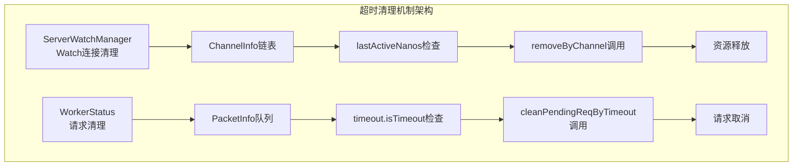
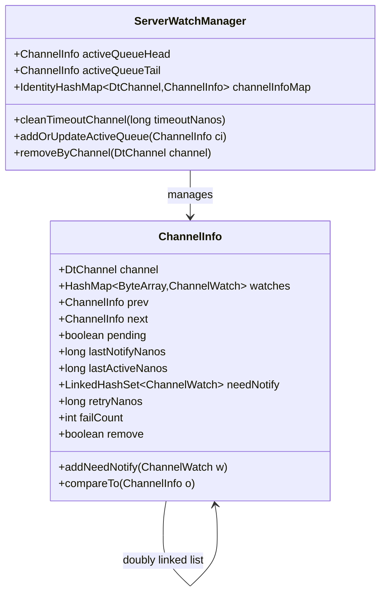
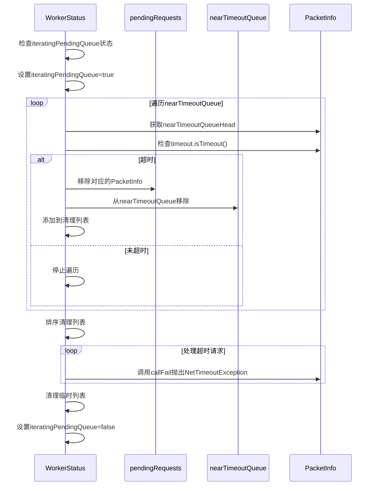
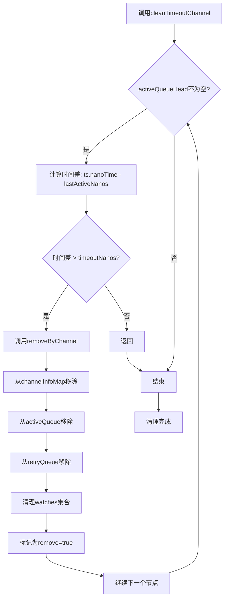
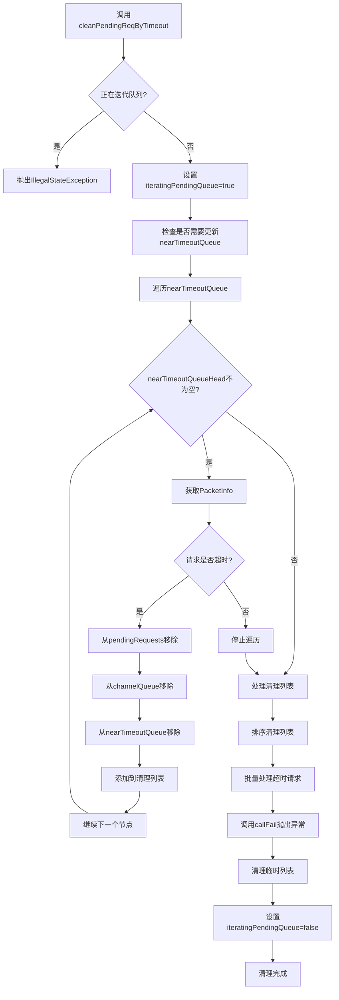

# 超时连接清理机制

<cite>
**本文档中引用的文件**
- [ServerWatchManager.java](file://server/src/main/java/com/github/dtprj/dongting/dtkv/server/ServerWatchManager.java)
- [WorkerStatus.java](file://client/src/main/java/com/github/dtprj/dongting/net/WorkerStatus.java)
- [NioConfig.java](file://client/src/main/java/com/github/dtprj/dongting/net/NioConfig.java)
- [NioClientConfig.java](file://client/src/main/java/com/github/dtprj/dongting/net/NioClientConfig.java)
- [CloseTest.java](file://client/src/test/java/com/github/dtprj/dongting/net/CloseTest.java)
- [NioClientTest.java](file://client/src/test/java/com/github/dtprj/dongting/net/NioClientTest.java)
</cite>

## 目录
1. [简介](#简介)
2. [核心组件概述](#核心组件概述)
3. [ServerWatchManager超时清理机制](#serverwatchmanager超时清理机制)
4. [WorkerStatus超时请求清理机制](#workerstatus超时请求清理机制)
5. [配置参数详解](#配置参数详解)
6. [清理流程分析](#清理流程分析)
7. [性能考虑](#性能考虑)
8. [故障排除指南](#故障排除指南)
9. [最佳实践建议](#最佳实践建议)
10. [总结](#总结)

## 简介

Dongting框架实现了两套独立但互补的超时连接清理机制，分别用于处理Watch管理器中的长时间未活跃连接和客户端工作线程中的超时请求。这些机制有效地防止内存泄漏，确保系统资源的合理利用，并维护系统的稳定性和健康状态。

## 核心组件概述

### ServerWatchManager清理机制
负责清理长时间未活跃的Watch连接，通过检查ChannelInfo的lastActiveNanos时间戳与当前时间的差值来判断是否需要清理。

### WorkerStatus清理机制  
负责清理超时的网络请求，通过检查PacketInfo的超时时间和当前时间来判断是否需要取消或重试请求。



**图表来源**
- [ServerWatchManager.java](file://server/src/main/java/com/github/dtprj/dongting/dtkv/server/ServerWatchManager.java#L470-L480)
- [WorkerStatus.java](file://client/src/main/java/com/github/dtprj/dongting/net/WorkerStatus.java#L232-L270)

## ServerWatchManager超时清理机制

### cleanTimeoutChannel方法实现

ServerWatchManager类中的`cleanTimeoutChannel(long timeoutNanos)`方法是Watch连接清理的核心实现：

```java
public void cleanTimeoutChannel(long timeoutNanos) {
    try {
        while (activeQueueHead != null) {
            if (ts.nanoTime - activeQueueHead.lastActiveNanos > timeoutNanos) {
                removeByChannel(activeQueueHead.channel);
            } else {
                return;
            }
        }
    } catch (Throwable e) {
        log.error("", e);
    }
}
```

### 工作原理详解

1. **链表遍历**：从activeQueueHead开始遍历双向链表
2. **时间比较**：计算当前时间与ChannelInfo.lastActiveNanos的差值
3. **条件判断**：如果差值大于timeoutNanos，则认为连接已超时
4. **资源清理**：调用removeByChannel移除超时的ChannelInfo
5. **提前退出**：一旦发现某个ChannelInfo未超时，立即停止遍历

### ChannelInfo数据结构



**图表来源**
- [ServerWatchManager.java](file://server/src/main/java/com/github/dtprj/dongting/dtkv/server/ServerWatchManager.java#L570-L629)

**章节来源**
- [ServerWatchManager.java](file://server/src/main/java/com/github/dtprj/dongting/dtkv/server/ServerWatchManager.java#L470-L480)

## WorkerStatus超时请求清理机制

### cleanPendingReqByTimeout方法实现

WorkerStatus类中的`cleanPendingReqByTimeout()`方法负责清理超时的网络请求：

```java
public void cleanPendingReqByTimeout() {
    if (iteratingPendingQueue) {
        throw new IllegalStateException("iteratingPendingQueue");
    }
    iteratingPendingQueue = true;

    ArrayList<PacketInfo> list = this.tempSortList;
    try {
        Timestamp ts = this.ts;
        LongObjMap<PacketInfo> pendingRequests = this.pendingRequests;
        if (ts.nanoTime - lastCleanTimeNanos > nearTimeoutThresholdNanos) {
            // 这个迭代是O(n)，所以不要过于频繁执行
            pendingRequests.forEach((key, pi) -> {
                addToNearTimeoutQueueIfNeed(pi);
            });
            lastCleanTimeNanos = ts.nanoTime;
        }

        while (nearTimeoutQueueHead != null) {
            PacketInfo pi = nearTimeoutQueueHead;
            if (pi.timeout.isTimeout(ts)) {
                pendingRequests.remove(BitUtil.toLong(pi.dtc.channelIndexInWorker, pi.packet.seq));
                removeFromChannelQueue(pi);
                removeFromNearTimeoutQueue(pi);
                list.add(pi);
            } else {
                break;
            }
        }
        // 处理超时请求列表...
    } finally {
        iteratingPendingQueue = false;
        list.clear();
    }
}
```

### 请求清理流程



**图表来源**
- [WorkerStatus.java](file://client/src/main/java/com/github/dtprj/dongting/net/WorkerStatus.java#L232-L270)

**章节来源**
- [WorkerStatus.java](file://client/src/main/java/com/github/dtprj/dongting/net/WorkerStatus.java#L232-L270)

## 配置参数详解

### Server端配置

```java
// ServerWatchManager默认重试间隔配置
private final long[] retryIntervalNanos = {1000, 10_000, 30_000, 60_000};
```

### Client端配置

```java
public class NioConfig {
    public long selectTimeout = 50; // 选择超时时间（毫秒）
    public long cleanInterval = 100; // 清理间隔（毫秒）
    public long nearTimeoutThreshold = 850; // 近超时阈值（毫秒）
}
```

### 关键配置参数说明

| 参数名称 | 默认值 | 说明 |
|---------|--------|------|
| cleanInterval | 100ms | 客户端清理任务的执行间隔 |
| nearTimeoutThreshold | 850ms | 判断请求是否接近超时的阈值 |
| selectTimeout | 50ms | IO选择操作的超时时间 |

**章节来源**
- [NioConfig.java](file://client/src/main/java/com/github/dtprj/dongting/net/NioConfig.java#L35-L40)
- [ServerWatchManager.java](file://server/src/main/java/com/github/dtprj/dongting/dtkv/server/ServerWatchManager.java#L60-L65)

## 清理流程分析

### ServerWatchManager清理流程



**图表来源**
- [ServerWatchManager.java](file://server/src/main/java/com/github/dtprj/dongting/dtkv/server/ServerWatchManager.java#L470-L480)

### WorkerStatus清理流程



**图表来源**
- [WorkerStatus.java](file://client/src/main/java/com/github/dtprj/dongting/net/WorkerStatus.java#L232-L270)

## 性能考虑

### 时间复杂度分析

1. **ServerWatchManager**：
   - 最坏情况：O(n)，其中n是activeQueue中的节点数量
   - 由于使用双向链表，查找和删除操作都是O(1)
   - 实际运行中通常只处理少量超时节点

2. **WorkerStatus**：
   - 时间复杂度：O(m)，其中m是nearTimeoutQueue中的请求数量
   - 使用优先队列进行近超时检测，避免全量扫描
   - 批量处理超时请求，减少系统调用开销

### 内存使用优化

1. **延迟清理**：只有在必要时才创建清理列表
2. **复用对象**：使用tempSortList等临时对象池
3. **及时释放**：超时后立即释放相关资源

## 故障排除指南

### 常见问题及解决方案

#### 1. 内存泄漏问题

**症状**：长时间运行后内存持续增长
**原因**：超时连接未被正确清理
**解决方案**：
```java
// 检查cleanInterval配置是否合适
config.cleanInterval = 100; // 100ms

// 确保定期调用清理方法
watchManager.cleanTimeoutChannel(timeoutNanos);
```

#### 2. 请求超时过多

**症状**：大量NetTimeoutException异常
**原因**：nearTimeoutThreshold设置过小或网络延迟高
**解决方案**：
```java
// 调整超时阈值
config.nearTimeoutThreshold = 1500; // 1.5秒

// 或者调整超时时间
new DtTime(5, TimeUnit.SECONDS); // 增加请求超时时间
```

#### 3. 清理频率过高

**症状**：CPU使用率升高
**原因**：cleanInterval设置过短
**解决方案**：
```java
// 增加清理间隔
config.cleanInterval = 500; // 500ms
```

**章节来源**
- [CloseTest.java](file://client/src/test/java/com/github/dtprj/dongting/net/CloseTest.java#L76-L100)
- [NioClientTest.java](file://client/src/test/java/com/github/dtprj/dongting/net/NioClientTest.java#L617-L652)

## 最佳实践建议

### 1. 合理配置清理参数

```java
// 生产环境推荐配置
NioClientConfig config = new NioClientConfig();
config.cleanInterval = 100; // 100ms
config.nearTimeoutThreshold = 850; // 850ms
config.selectTimeout = 50; // 50ms
```

### 2. 监控清理效果

```java
// 监控待清理请求数量
int pendingCount = workerStatus.pendingReqSize();
if (pendingCount > threshold) {
    log.warn("High pending requests: {}", pendingCount);
}
```

### 3. 异常处理策略

```java
try {
    watchManager.cleanTimeoutChannel(timeoutNanos);
} catch (Throwable e) {
    log.error("Failed to clean timeout channels", e);
    // 可选：记录失败次数并适当延迟下次清理
}
```

### 4. 资源管理最佳实践

- 确保在关闭连接时调用`removeByChannel`
- 在清理过程中避免修改共享状态
- 使用适当的锁机制保护关键数据结构

## 总结

Dongting框架的超时连接清理机制通过两个独立但协同工作的组件，有效地管理了系统资源：

1. **ServerWatchManager**：专门处理长时间未活跃的Watch连接，防止Watch管理器占用过多内存
2. **WorkerStatus**：处理网络请求的超时情况，确保不会因为超时请求而影响系统性能

这两个机制共同构成了一个完整的超时清理体系，通过合理的配置和监控，可以确保系统的长期稳定运行。开发者应该根据实际应用场景调整相关参数，并建立相应的监控和告警机制，以及时发现和处理潜在的问题。