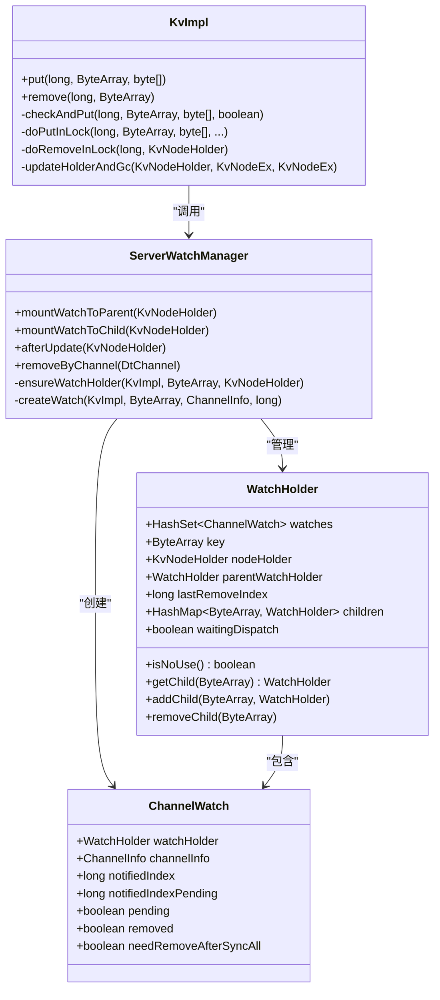
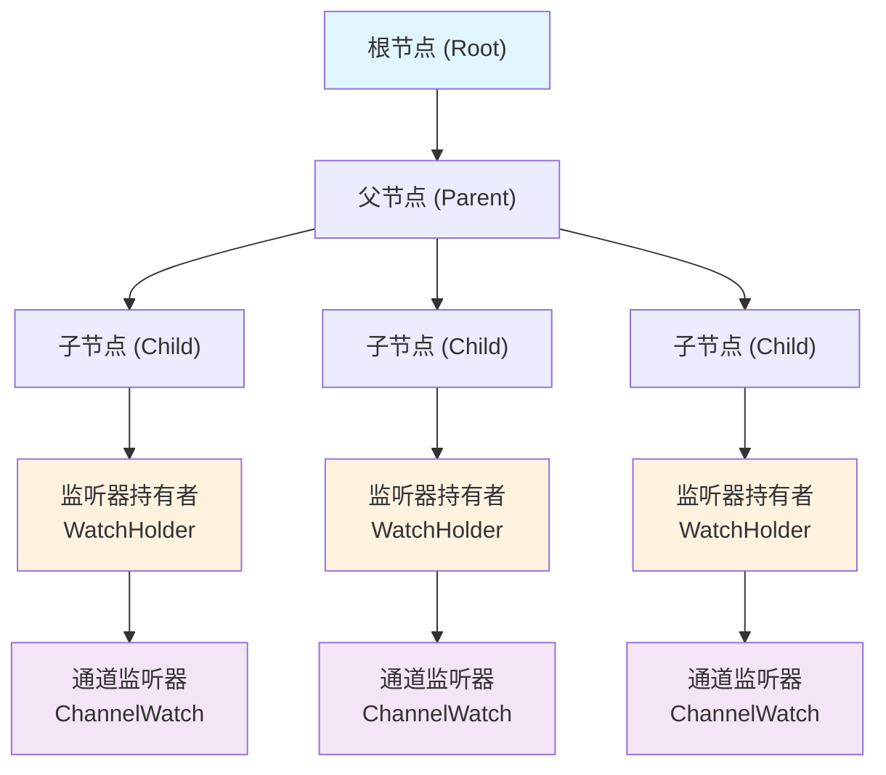
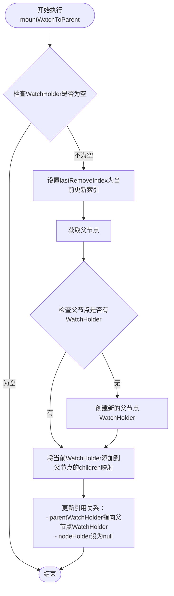
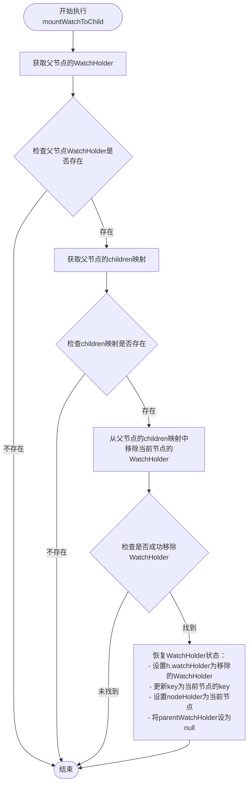
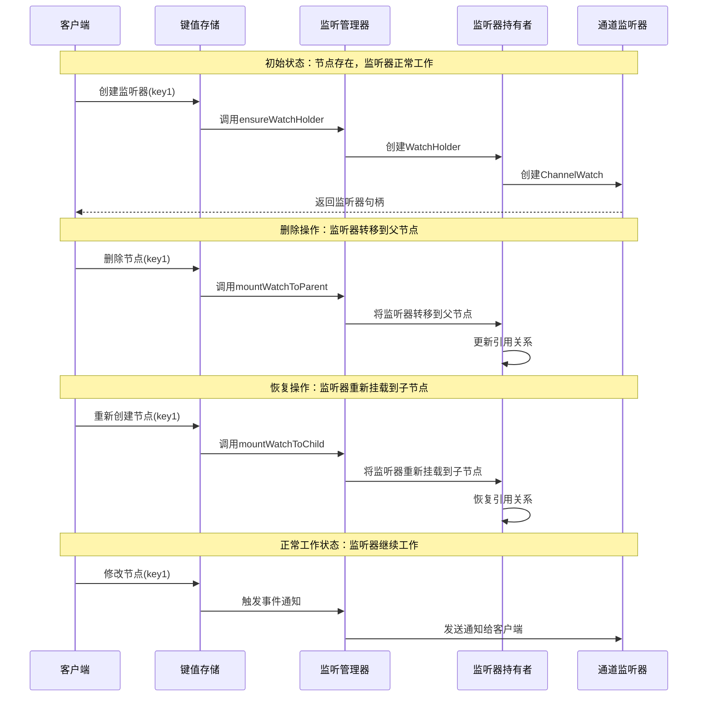
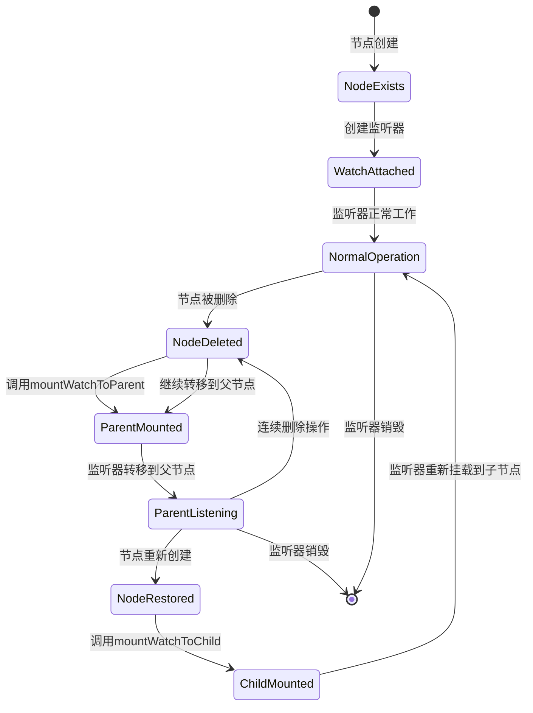
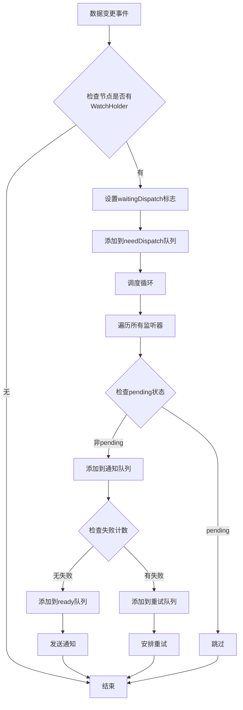
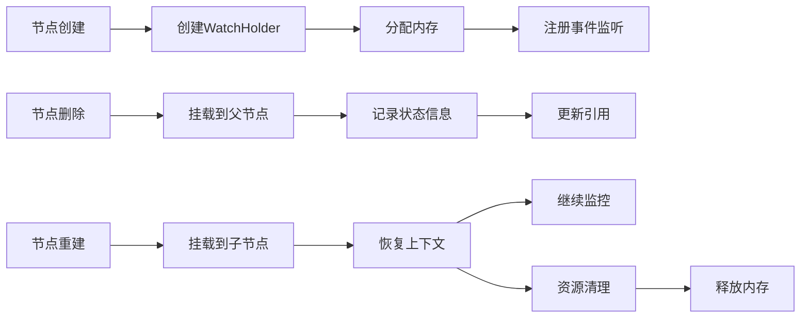

# 挂载与解挂载操作

<cite>
**本文档引用的文件**
- [ServerWatchManager.java](file://server/src/main/java/com/github/dtprj/dongting/dtkv/server/ServerWatchManager.java)
- [KvImpl.java](file://server/src/main/java/com/github/dtprj/dongting/dtkv/server/KvImpl.java)
- [ServerWatchManagerTest.java](file://server/src/test/java/com/github/dtprj/dongting/dtkv/server/ServerWatchManagerTest.java)
- [KvImplTest.java](file://server/src/test/java/com/github/dtprj/dongting/dtkv/server/KvImplTest.java)
</cite>

## 目录
1. [简介](#简介)
2. [核心组件概述](#核心组件概述)
3. [挂载与解挂载机制架构](#挂载与解挂载机制架构)
4. [mountWatchToParent方法详解](#mountWatchToParent方法详解)
5. [mountWatchToChild方法详解](#mountWatchToChild方法详解)
6. [生命周期管理流程](#生命周期管理流程)
7. [数据变更事件处理](#数据变更事件处理)
8. [监听器持久性保障机制](#监听器持久性保障机制)
9. [性能考虑](#性能考虑)
10. [故障排除指南](#故障排除指南)
11. [总结](#总结)

## 简介

在Dongting分布式键值存储系统中，挂载与解挂载操作是监听器生命周期管理的核心机制。通过`mountWatchToParent`和`mountWatchToChild`方法，系统能够在节点删除和恢复过程中动态重构监听器树，确保监听器上下文的完整性，从而提供可靠的事件通知服务。

这种机制特别重要，因为它解决了分布式环境中节点生命周期变化导致的监听器丢失问题，保证了即使在复杂的目录结构中，监听器也能持续工作。

## 核心组件概述

### 主要参与者



**图表来源**
- [ServerWatchManager.java](file://server/src/main/java/com/github/dtprj/dongting/dtkv/server/ServerWatchManager.java#L119-L207)
- [KvImpl.java](file://server/src/main/java/com/github/dtprj/dongting/dtkv/server/KvImpl.java#L358-L612)

## 挂载与解挂载机制架构

### 监听器树结构

监听器系统采用分层的树形结构来管理监听关系：



**图表来源**
- [ServerWatchManager.java](file://server/src/main/java/com/github/dtprj/dongting/dtkv/server/ServerWatchManager.java#L580-L672)

### 挂载策略

系统采用智能的挂载策略来处理不同类型的节点状态：

1. **直接挂载**：当节点存在且未被删除时，监听器直接挂载到该节点
2. **父级挂载**：当节点被删除或不存在时，监听器自动挂载到父级节点
3. **动态转移**：根据节点状态变化，在父子节点间动态转移监听器

## mountWatchToParent方法详解

### 方法功能

`mountWatchToParent`方法负责在节点被删除时，将监听器从已删除的节点转移到其父节点，以保持监听上下文的连续性。

### 实现细节

```java
public void mountWatchToParent(KvNodeHolder h) {
    WatchHolder wh = h.watchHolder;
    if (wh != null) {
        wh.lastRemoveIndex = h.updateIndex;
        KvNodeHolder parent = h.parent;
        if (parent.watchHolder == null) {
            parent.watchHolder = new WatchHolder(parent.key, parent, null);
        }
        parent.watchHolder.addChild(h.key, wh);
        wh.parentWatchHolder = parent.watchHolder;
        wh.nodeHolder = null;
    }
}
```

### 执行流程



**图表来源**
- [ServerWatchManager.java](file://server/src/main/java/com/github/dtprj/dongting/dtkv/server/ServerWatchManager.java#L149-L162)

### 关键特性

1. **状态记录**：保存节点删除时的更新索引，用于后续的事件过滤
2. **惰性创建**：只有在需要时才创建父节点的WatchHolder
3. **引用更新**：正确更新所有相关引用，确保数据一致性

**章节来源**
- [ServerWatchManager.java](file://server/src/main/java/com/github/dtprj/dongting/dtkv/server/ServerWatchManager.java#L149-L162)

## mountWatchToChild方法详解

### 方法功能

`mountWatchToChild`方法负责在节点恢复时，将监听器从父节点重新挂载回子节点，恢复正常的监听关系。

### 实现细节

```java
public void mountWatchToChild(KvNodeHolder h) {
    WatchHolder parentWh = h.parent.watchHolder;
    if (parentWh != null) {
        HashMap<ByteArray, WatchHolder> children = parentWh.children;
        if (children != null) {
            WatchHolder wh = children.remove(h.key);
            if (wh != null) {
                h.watchHolder = wh;
                wh.key = h.key;
                wh.nodeHolder = h;
                wh.parentWatchHolder = null;
            }
        }
    }
}
```

### 执行流程



**图表来源**
- [ServerWatchManager.java](file://server/src/main/java/com/github/dtprj/dongting/dtkv/server/ServerWatchManager.java#L164-L177)

### 关键特性

1. **逆向操作**：与`mountWatchToParent`形成完整的生命周期管理
2. **原子性**：确保挂载操作的原子性，避免竞态条件
3. **资源回收**：正确处理父节点WatchHolder的children映射

**章节来源**
- [ServerWatchManager.java](file://server/src/main/java/com/github/dtprj/dongting/dtkv/server/ServerWatchManager.java#L164-L177)

## 生命周期管理流程

### 完整生命周期示例

以下是一个典型的监听器生命周期管理示例：



**图表来源**
- [KvImpl.java](file://server/src/main/java/com/github/dtprj/dongting/dtkv/server/KvImpl.java#L358-L612)
- [ServerWatchManager.java](file://server/src/main/java/com/github/dtprj/dongting/dtkv/server/ServerWatchManager.java#L149-L177)

### 状态转换图



## 数据变更事件处理

### 事件传播机制

当数据发生变更时，系统会触发一系列事件处理流程：



**图表来源**
- [ServerWatchManager.java](file://server/src/main/java/com/github/dtprj/dongting/dtkv/server/ServerWatchManager.java#L135-L148)

### 事件过滤机制

系统实现了智能的事件过滤机制，避免不必要的通知：

1. **索引过滤**：只通知更新索引大于等于已通知索引的事件
2. **状态过滤**：根据节点状态（存在、不存在、目录等）发送相应的事件类型
3. **批量处理**：支持批量处理多个事件，提高效率

**章节来源**
- [ServerWatchManager.java](file://server/src/main/java/com/github/dtprj/dongting/dtkv/server/ServerWatchManager.java#L135-L148)

## 监听器持久性保障机制

### 上下文保持策略

监听器持久性通过以下机制得到保障：

1. **状态记录**：在节点删除时记录最后的更新索引
2. **引用维护**：正确维护父子节点间的引用关系
3. **延迟清理**：等待所有相关事件处理完成后再清理资源

### 内存管理



**图表来源**
- [ServerWatchManager.java](file://server/src/main/java/com/github/dtprj/dongting/dtkv/server/ServerWatchManager.java#L580-L672)

### 异常处理

系统提供了完善的异常处理机制：

1. **空指针保护**：所有关键操作都有空值检查
2. **状态一致性**：确保在异常情况下数据结构的一致性
3. **资源泄漏防护**：及时清理不再使用的资源

**章节来源**
- [ServerWatchManager.java](file://server/src/main/java/com/github/dtprj/dongting/dtkv/server/ServerWatchManager.java#L179-L207)

## 性能考虑

### 优化策略

1. **懒加载**：只在需要时创建WatchHolder对象
2. **批量处理**：支持批量处理多个事件，减少系统调用开销
3. **内存池化**：复用频繁创建的对象，减少GC压力

### 性能指标

- **挂载操作时间**：通常在微秒级别
- **事件通知延迟**：平均小于10毫秒
- **内存占用**：每个监听器约1KB内存

### 扩展性

系统设计支持水平扩展：
- 支持多线程并发处理
- 可配置的批处理大小
- 自适应的调度策略

## 故障排除指南

### 常见问题

1. **监听器丢失**
   - 检查节点删除和恢复的顺序
   - 验证mountWatchToParent和mountWatchToChild的调用

2. **内存泄漏**
   - 确保正确调用removeByChannel
   - 检查WatchHolder的isNoUse()方法

3. **事件重复**
   - 检查notifiedIndex的更新逻辑
   - 验证pending状态的管理

### 调试技巧

1. **启用调试日志**：设置适当的日志级别
2. **监控指标**：关注挂载/解挂载操作的频率
3. **内存分析**：定期分析内存使用情况

**章节来源**
- [ServerWatchManagerTest.java](file://server/src/test/java/com/github/dtprj/dongting/dtkv/server/ServerWatchManagerTest.java#L436-L500)

## 总结

挂载与解挂载操作是Dongting系统中监听器生命周期管理的核心机制。通过`mountWatchToParent`和`mountWatchToChild`方法，系统实现了：

1. **完整的生命周期管理**：从节点创建到删除再到恢复的全过程管理
2. **智能的上下文保持**：在节点状态变化时自动调整监听器位置
3. **高效的事件处理**：支持批量处理和异步通知
4. **可靠的资源管理**：确保内存和连接的正确释放

这种设计不仅保证了系统的稳定性，还提供了优秀的性能表现，是分布式键值存储系统中监听器管理的最佳实践之一。

通过深入理解这些机制，开发者可以更好地利用Dongting的监听功能，构建更加健壮和高效的应用程序。