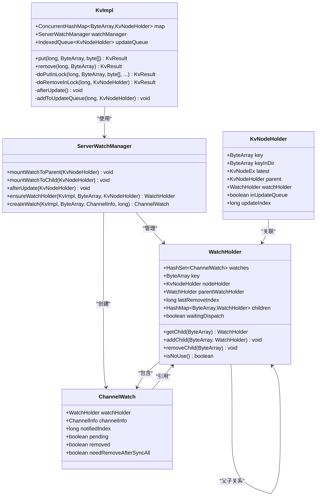
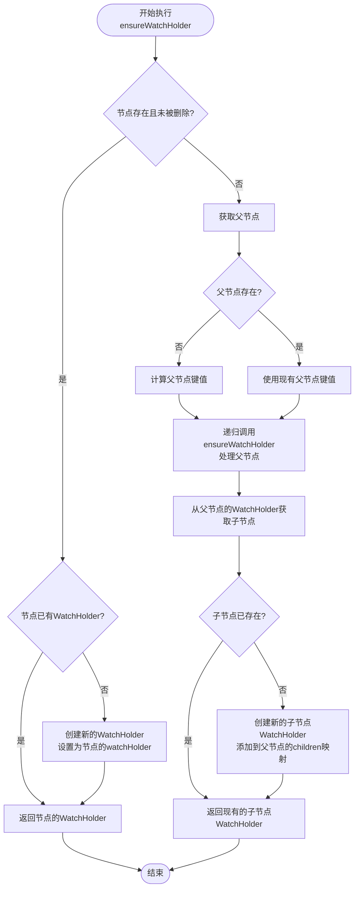
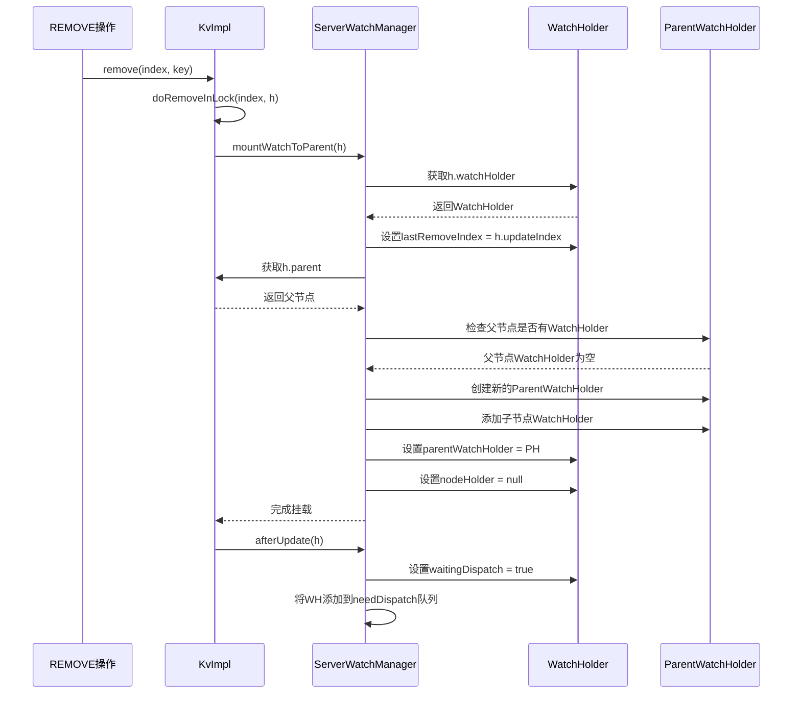
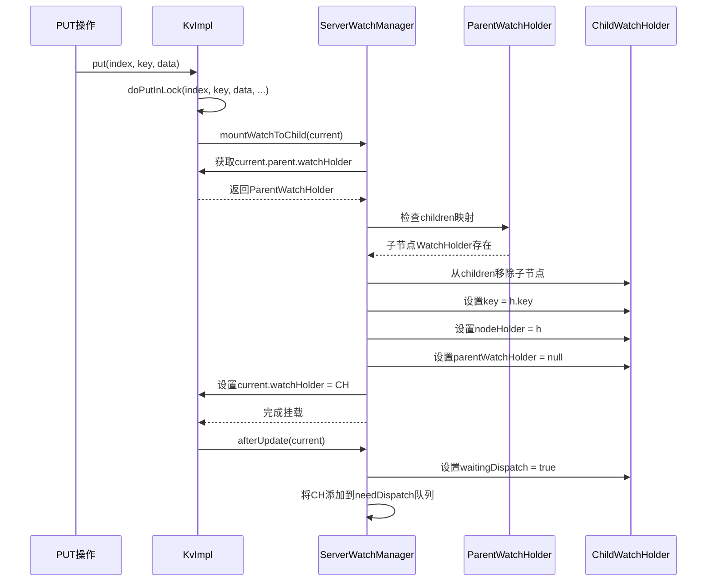
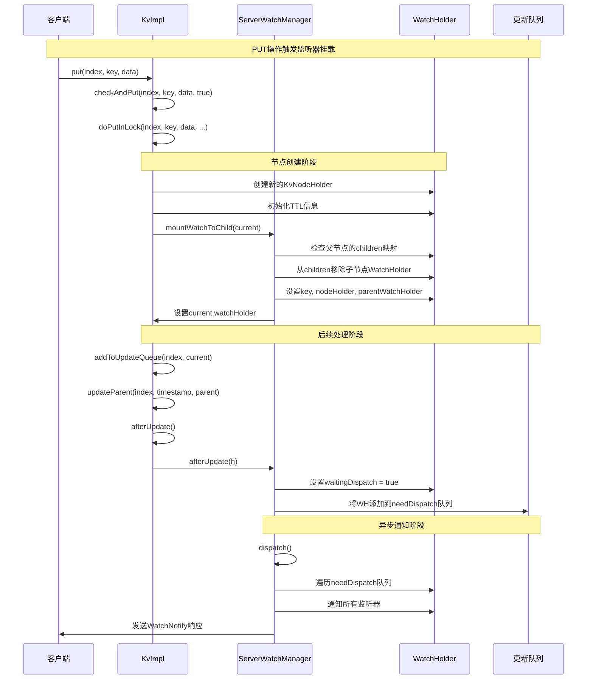
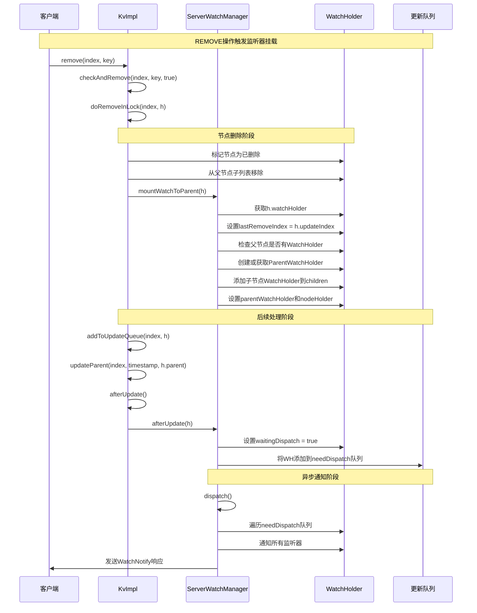

# 监听器挂载机制

<cite>
**本文档引用的文件**
- [KvImpl.java](file://server/src/main/java/com/github/dtprj/dongting/dtkv/server/KvImpl.java)
- [ServerWatchManager.java](file://server/src/main/java/com/github/dtprj/dongting/dtkv/server/ServerWatchManager.java)
- [ServerWatchManagerTest.java](file://server/src/test/java/com/github/dtprj/dongting/dtkv/server/ServerWatchManagerTest.java)
</cite>

## 目录
1. [概述](#概述)
2. [核心组件架构](#核心组件架构)
3. [ensureWatchHolder()方法深度解析](#ensurewatchholder方法深度解析)
4. [监听器挂载机制详解](#监听器挂载机制详解)
5. [数据变更驱动的监听树重构](#数据变更驱动的监听树重构)
6. [时序图展示](#时序图展示)
7. [性能考虑](#性能考虑)
8. [故障排除指南](#故障排除指南)
9. [总结](#总结)

## 概述

Dongting的监听器挂载机制是一个复杂而精密的系统，负责在KV节点路径上动态维护监听器的正确挂载。该机制通过`ensureWatchHolder()`方法实现递归确保监听器在适当位置的挂载，支持从叶子节点向上查找父节点WatchHolder的逻辑，并在节点变更时智能地调整监听树结构。

核心特性包括：
- **动态监听树重构**：根据数据变更自动调整监听器挂载位置
- **递归挂载策略**：从叶子节点向上递归查找合适的挂载点
- **父子节点联动**：PUT操作触发子节点挂载，REMOVE操作触发父节点监听器创建
- **内存高效管理**：智能清理无用的监听器节点，避免内存泄漏

## 核心组件架构

**图表来源**
- [KvImpl.java](file://server/src/main/java/com/github/dtprj/dongting/dtkv/server/KvImpl.java#L40-L100)
- [ServerWatchManager.java](file://server/src/main/java/com/github/dtprj/dongting/dtkv/server/ServerWatchManager.java#L550-L650)

## ensureWatchHolder()方法深度解析

`ensureWatchHolder()`方法是监听器挂载机制的核心，实现了递归确保监听器在KV节点路径上的正确挂载。

### 方法执行流程

**图表来源**
- [ServerWatchManager.java](file://server/src/main/java/com/github/dtprj/dongting/dtkv/server/ServerWatchManager.java#L550-L580)

### 关键实现细节

1. **节点状态检查**：首先检查目标节点是否存在且未被标记为删除
2. **直接挂载**：如果节点已存在且有有效的WatchHolder，则直接返回
3. **递归向上查找**：如果节点不存在或已被删除，则向上查找父节点
4. **父节点WatchHolder创建**：如果父节点没有WatchHolder，则创建
5. **子节点挂载**：在父节点的WatchHolder中添加子节点的WatchHolder

**章节来源**
- [ServerWatchManager.java](file://server/src/main/java/com/github/dtprj/dongting/dtkv/server/ServerWatchManager.java#L550-L580)

## 监听器挂载机制详解

### mountWatchToParent()方法

当执行REMOVE操作时，监听器挂载机制会调用`mountWatchToParent()`方法，将监听器从当前节点移动到其父节点。

**图表来源**
- [KvImpl.java](file://server/src/main/java/com/github/dtprj/dongting/dtkv/server/KvImpl.java#L650-L670)
- [ServerWatchManager.java](file://server/src/main/java/com/github/dtprj/dongting/dtkv/server/ServerWatchManager.java#L150-L162)

### mountWatchToChild()方法

当执行PUT操作时，监听器挂载机制会调用`mountWatchToChild()`方法，将监听器从父节点移动到新创建的子节点。

**图表来源**
- [KvImpl.java](file://server/src/main/java/com/github/dtprj/dongting/dtkv/server/KvImpl.java#L420-L430)
- [ServerWatchManager.java](file://server/src/main/java/com/github/dtprj/dongting/dtkv/server/ServerWatchManager.java#L164-L176)

**章节来源**
- [ServerWatchManager.java](file://server/src/main/java/com/github/dtprj/dongting/dtkv/server/ServerWatchManager.java#L150-L176)

## 数据变更驱动的监听树重构

### PUT操作触发的监听器挂载过程

当执行PUT操作时，监听器挂载机制会经历以下步骤：

1. **节点创建或更新**：在`doPutInLock()`方法中完成节点的创建或更新
2. **TTL管理**：调用`ttlManager.initTtl()`初始化TTL信息
3. **监听器挂载**：调用`watchManager.mountWatchToChild()`将监听器挂载到新节点
4. **更新队列**：调用`addToUpdateQueue()`将节点添加到更新队列
5. **父节点更新**：调用`updateParent()`更新所有父节点的状态
6. **后处理**：调用`afterUpdate()`通知监听器系统进行后续处理

### REMOVE操作触发的监听器挂载过程

当执行REMOVE操作时，监听器挂载机制会经历以下步骤：

1. **节点删除**：在`doRemoveInLock()`方法中完成节点的删除
2. **子节点列表清理**：从父节点的子节点列表中移除该节点
3. **TTL清理**：调用`ttlManager.remove()`清理TTL信息
4. **监听器挂载**：调用`watchManager.mountWatchToParent()`将监听器挂载到父节点
5. **父节点更新**：调用`updateParent()`更新所有父节点的状态
6. **后处理**：调用`afterUpdate()`通知监听器系统进行后续处理

**章节来源**
- [KvImpl.java](file://server/src/main/java/com/github/dtprj/dongting/dtkv/server/KvImpl.java#L400-L450)
- [KvImpl.java](file://server/src/main/java/com/github/dtprj/dongting/dtkv/server/KvImpl.java#L640-L680)

## 时序图展示

### 一次PUT请求引发的监听器挂载全过程

**图表来源**
- [KvImpl.java](file://server/src/main/java/com/github/dtprj/dongting/dtkv/server/KvImpl.java#L350-L430)
- [ServerWatchManager.java](file://server/src/main/java/com/github/dtprj/dongting/dtkv/server/ServerWatchManager.java#L138-L148)

### 一次REMOVE请求引发的监听器挂载全过程

**图表来源**
- [KvImpl.java](file://server/src/main/java/com/github/dtprj/dongting/dtkv/server/KvImpl.java#L640-L670)
- [ServerWatchManager.java](file://server/src/main/java/com/github/dtprj/dongting/dtkv/server/ServerWatchManager.java#L150-L162)

## 性能考虑

### 内存管理优化

1. **WatchHolder复用**：通过递归查找和复用现有的WatchHolder，减少对象创建开销
2. **延迟清理**：只有在监听器完全移除后才清理WatchHolder，避免频繁的内存分配
3. **批量处理**：通过`needDispatch`队列批量处理监听器通知，提高效率

### 并发安全设计

1. **无锁读取**：大部分读取操作使用乐观锁，减少锁竞争
2. **写锁保护**：关键的写操作使用独占写锁，保证数据一致性
3. **异步通知**：监听器通知采用异步方式，避免阻塞主线程

### 批量处理机制

1. **更新队列**：通过`updateQueue`批量处理节点更新
2. **分批通知**：`dispatch()`方法支持分批处理监听器通知
3. **重试机制**：对于失败的通知，支持重试机制

## 故障排除指南

### 常见问题及解决方案

1. **监听器未触发**
   - 检查`watchManager`是否正确初始化
   - 验证`ensureWatchHolder()`方法是否正确执行
   - 确认节点的`watchHolder`是否正确设置

2. **内存泄漏**
   - 检查`removeWatchFromKvTree()`方法是否正确清理
   - 验证`isNoUse()`方法的判断逻辑
   - 确认`children`映射是否正确清理

3. **性能问题**
   - 监控`needDispatch`队列大小
   - 检查批量处理参数配置
   - 分析监听器数量对性能的影响

**章节来源**
- [ServerWatchManager.java](file://server/src/main/java/com/github/dtprj/dongting/dtkv/server/ServerWatchManager.java#L180-L220)

## 总结

Dongting的监听器挂载机制是一个高度优化的系统，通过精心设计的算法和数据结构实现了高效的监听器管理。核心特点包括：

1. **智能挂载策略**：通过`ensureWatchHolder()`方法实现递归挂载，确保监听器始终位于合适的位置
2. **动态重构能力**：根据数据变更自动调整监听树结构，保持监听器的有效性
3. **高性能设计**：采用异步通知、批量处理等技术，确保系统的高性能运行
4. **内存高效管理**：通过智能清理和复用机制，避免内存泄漏和过度消耗

该机制为Dongting提供了强大的监听能力，支持复杂的分布式场景下的数据变更通知需求。通过深入理解其实现原理，开发者可以更好地利用这一机制构建高性能的分布式应用。