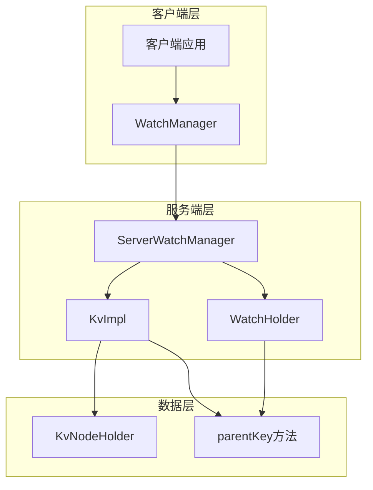
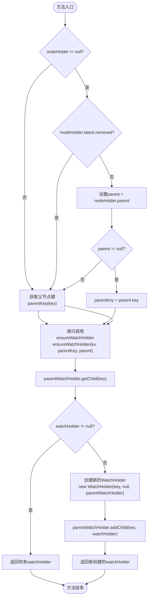
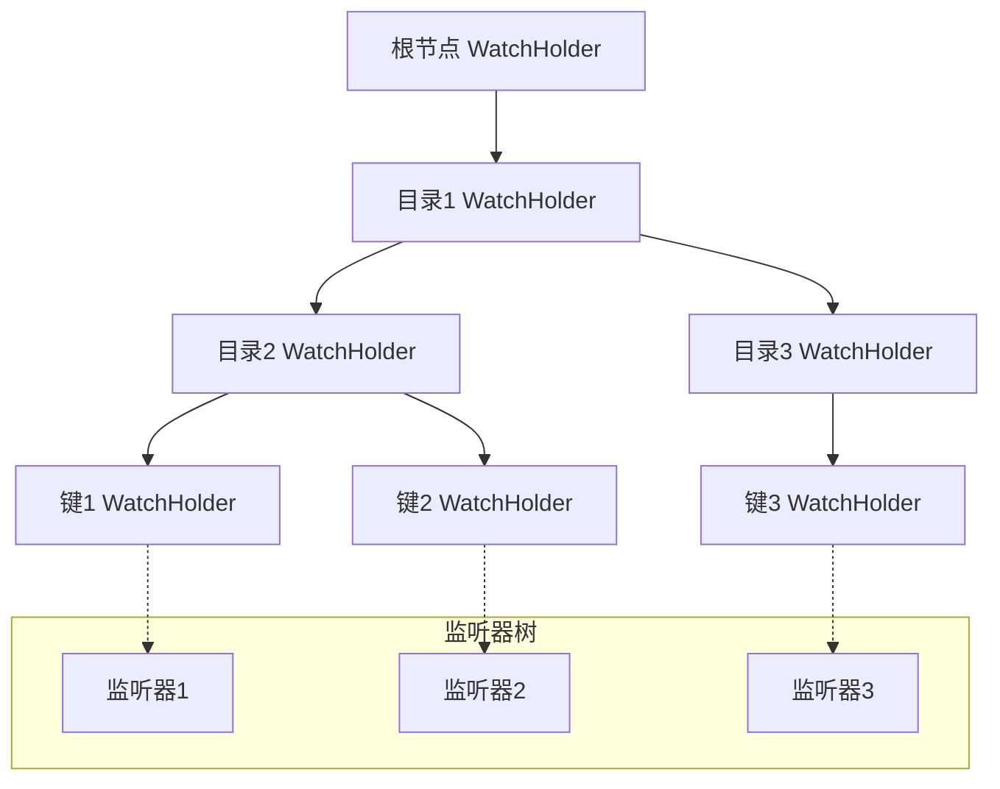
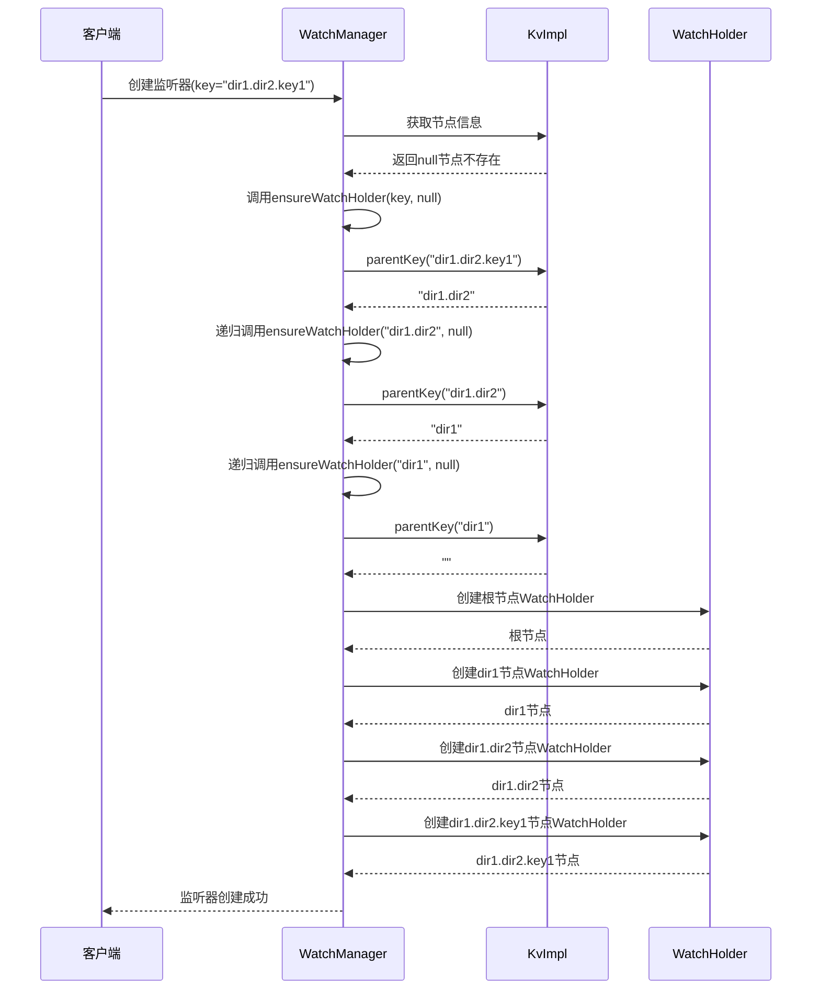
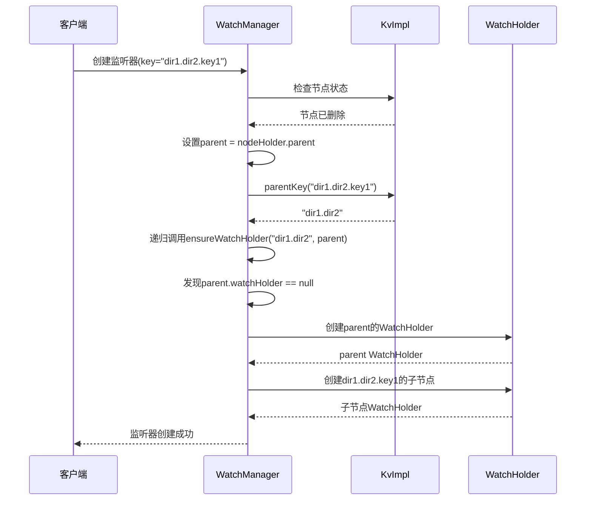
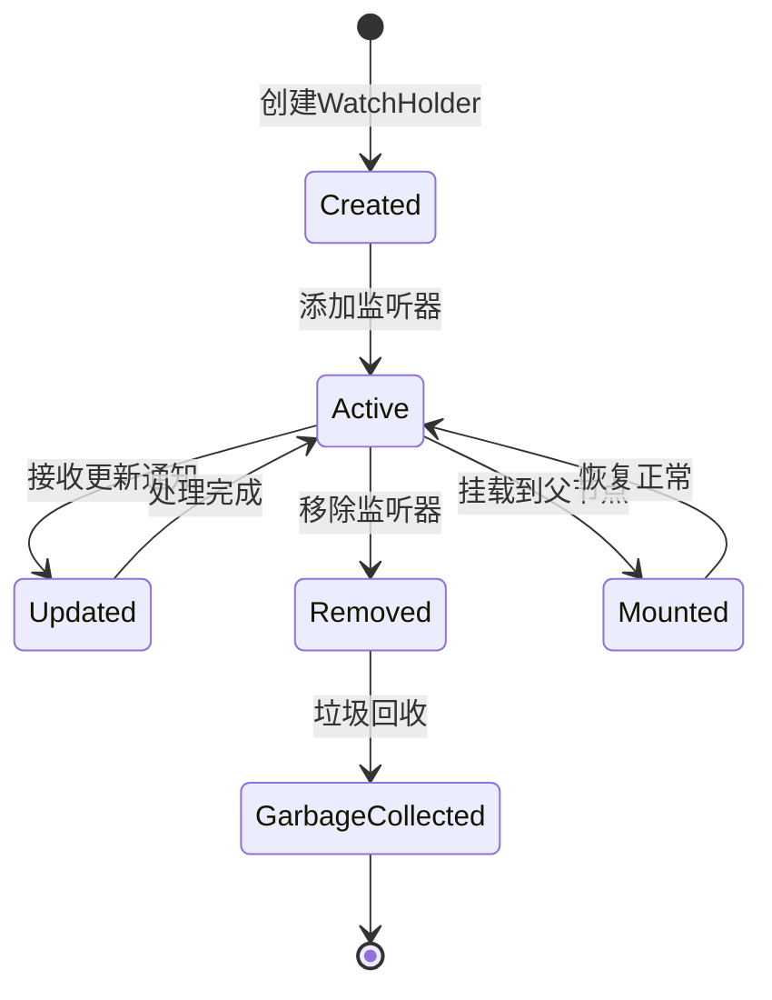

# 路径查找与递归创建机制

<cite>
**本文档引用的文件**
- [ServerWatchManager.java](file://server/src/main/java/com/github/dtprj/dongting/dtkv/server/ServerWatchManager.java)
- [KvImpl.java](file://server/src/main/java/com/github/dtprj/dongting/dtkv/server/KvImpl.java)
- [ServerWatchManagerTest.java](file://server/src/test/java/com/github/dtprj/dongting/dtkv/server/ServerWatchManagerTest.java)
</cite>

## 目录
1. [引言](#引言)
2. [核心架构概览](#核心架构概览)
3. [ensureWatchHolder方法深度分析](#ensureWatchholder方法深度分析)
4. [路径解析机制详解](#路径解析机制详解)
5. [递归创建流程分析](#递归创建流程分析)
6. [parentKey方法实现](#parentkey方法实现)
7. [调用栈示例与场景分析](#调用栈示例与场景分析)
8. [监听器树完整性保障](#监听器树完整性保障)
9. [性能考虑与优化](#性能考虑与优化)
10. [故障排除指南](#故障排除指南)
11. [总结](#总结)

## 引言

Dongting分布式键值存储系统中的`ensureWatchHolder`方法是实现路径解析和递归创建的核心机制。该方法负责从叶子节点向上递归查找父节点的WatchHolder，确保在目标节点被删除时能够通过parentKey定位父节点并触发递归创建流程。本文档将深入分析这一机制的实现原理、调用流程以及在多层嵌套路径下的工作方式。

## 核心架构概览

Dongting系统采用分层架构设计，其中WatchManager负责管理监听器事件，而KvImpl则维护键值对的存储结构。两者通过复杂的交互机制实现高效的路径解析和监听器管理。



**图表来源**
- [ServerWatchManager.java](file://server/src/main/java/com/github/dtprj/dongting/dtkv/server/ServerWatchManager.java#L527-L568)
- [KvImpl.java](file://server/src/main/java/com/github/dtprj/dongting/dtkv/server/KvImpl.java#L75-L88)

## ensureWatchHolder方法深度分析

`ensureWatchHolder`方法是整个路径解析机制的核心，其实现逻辑体现了递归思想和优雅的错误处理策略。

### 方法签名与参数

```java
private WatchHolder ensureWatchHolder(KvImpl kv, ByteArray key, KvNodeHolder nodeHolder)
```

该方法接收三个关键参数：
- `kv`: 当前的KvImpl实例，提供访问整个键值存储的能力
- `key`: 目标键的字节数组表示
- `nodeHolder`: 当前节点的持有者对象，可能为null

### 核心逻辑流程



**图表来源**
- [ServerWatchManager.java](file://server/src/main/java/com/github/dtprj/dongting/dtkv/server/ServerWatchManager.java#L527-L568)

**章节来源**
- [ServerWatchManager.java](file://server/src/main/java/com/github/dtprj/dongting/dtkv/server/ServerWatchManager.java#L527-L568)

## 路径解析机制详解

路径解析机制的核心在于如何从叶子节点向上追溯到根节点，同时保持监听器树的完整性。

### 父节点定位策略

当目标节点已被删除时，系统通过以下策略定位父节点：

1. **直接引用法**: 如果当前节点的`nodeHolder`不为null且未被标记删除，则直接使用其作为父节点
2. **继承法**: 如果当前节点已被删除，则使用其父节点的`nodeHolder.parent`
3. **键分解法**: 如果上述方法都不可行，则调用`parentKey`方法分解键名

### 键名分解逻辑

`parentKey`方法实现了层级路径的分解逻辑：

```java
ByteArray parentKey(ByteArray key) {
    int lastIndexOfSep = key.lastIndexOf(KvClient.SEPARATOR);
    if (lastIndexOfSep > 0) {
        return key.sub(0, lastIndexOfSep);
    } else {
        return ByteArray.EMPTY;
    }
}
```

该方法的工作原理：
- 查找最后一个分隔符的位置
- 如果存在有效的分隔符位置，则返回分隔符之前的部分
- 否则返回空键（表示根节点）

**章节来源**
- [KvImpl.java](file://server/src/main/java/com/github/dtprj/dongting/dtkv/server/KvImpl.java#L890-L896)

## 递归创建流程分析

递归创建流程展示了WatchHolder在多层嵌套路径下的逐级创建过程。

### 递归层次结构



### 递归调用示例

假设存在以下路径：`dir1.dir2.key1`

1. **第一次调用**: `ensureWatchHolder(kv, "dir1.dir2.key1", null)`
   - 找不到直接匹配的节点
   - 调用`parentKey("dir1.dir2.key1")`得到`"dir1.dir2"`
   - 递归调用`ensureWatchHolder(kv, "dir1.dir2", null)`

2. **第二次调用**: `ensureWatchHolder(kv, "dir1.dir2", null)`
   - 找不到直接匹配的节点
   - 调用`parentKey("dir1.dir2")`得到`"dir1"`
   - 递归调用`ensureWatchHolder(kv, "dir1", null)`

3. **第三次调用**: `ensureWatchHolder(kv, "dir1", null)`
   - 找不到直接匹配的节点
   - 调用`parentKey("dir1")`得到`""`（空键）
   - 递归调用`ensureWatchHolder(kv, "", null)`

4. **第四次调用**: `ensureWatchHolder(kv, "", null)`
   - 找到根节点，创建根节点的WatchHolder
   - 开始逐层返回，创建所有中间节点的WatchHolder

**章节来源**
- [ServerWatchManager.java](file://server/src/main/java/com/github/dtprj/dongting/dtkv/server/ServerWatchManager.java#L527-L568)

## parentKey方法实现

`parentKey`方法是路径解析的基础，其实现简洁而高效。

### 实现细节

```java
ByteArray parentKey(ByteArray key) {
    int lastIndexOfSep = key.lastIndexOf(KvClient.SEPARATOR);
    if (lastIndexOfSep > 0) {
        return key.sub(0, lastIndexOfSep);
    } else {
        return ByteArray.EMPTY;
    }
}
```

### 边界条件处理

1. **空键处理**: 返回`ByteArray.EMPTY`表示根节点
2. **无分隔符**: 返回空键，因为没有父节点
3. **无效分隔符位置**: 只有当分隔符位于第一个字符之后才有效

### 性能特征

- 时间复杂度: O(n)，其中n是键的长度
- 空间复杂度: O(1)，只创建一个子字符串
- 最坏情况: 需要遍历整个键来找到最后一个分隔符

**章节来源**
- [KvImpl.java](file://server/src/main/java/com/github/dtprj/dongting/dtkv/server/KvImpl.java#L890-L896)

## 调用栈示例与场景分析

### 场景一：正常路径创建



**图表来源**
- [ServerWatchManager.java](file://server/src/main/java/com/github/dtprj/dongting/dtkv/server/ServerWatchManager.java#L527-L568)

### 场景二：节点删除后的恢复

当某个中间节点被删除时，系统会自动重新创建缺失的WatchHolder：



**图表来源**
- [ServerWatchManager.java](file://server/src/main/java/com/github/dtprj/dongting/dtkv/server/ServerWatchManager.java#L527-L568)

**章节来源**
- [ServerWatchManagerTest.java](file://server/src/test/java/com/github/dtprj/dongting/dtkv/server/ServerWatchManagerTest.java#L475-L500)

## 监听器树完整性保障

系统通过多种机制确保监听器树的完整性：

### WatchHolder生命周期管理



### 自动挂载机制

系统提供了自动挂载功能，确保节点删除后监听器能够正确迁移：

```java
public void mountWatchToParent(KvNodeHolder h) {
    WatchHolder wh = h.watchHolder;
    if (wh != null) {
        wh.lastRemoveIndex = h.updateIndex;
        KvNodeHolder parent = h.parent;
        if (parent.watchHolder == null) {
            parent.watchHolder = new WatchHolder(parent.key, parent, null);
        }
        parent.watchHolder.addChild(h.key, wh);
        wh.parentWatchHolder = parent.watchHolder;
        wh.nodeHolder = null;
    }
}
```

### 内存管理策略

- **延迟创建**: 只有在需要时才创建WatchHolder
- **共享引用**: 相同路径的节点共享WatchHolder实例
- **垃圾回收**: 自动清理无用的WatchHolder节点

**章节来源**
- [ServerWatchManager.java](file://server/src/main/java/com/github/dtprj/dongting/dtkv/server/ServerWatchManager.java#L150-L162)

## 性能考虑与优化

### 时间复杂度分析

- **最佳情况**: O(log n)，当节点已经存在时
- **平均情况**: O(h)，其中h是路径深度
- **最坏情况**: O(d)，当需要创建所有中间节点时，d是最大路径深度

### 空间复杂度分析

- **空间开销**: O(h)，每个节点创建一个WatchHolder
- **缓存友好**: WatchHolder按层级组织，访问局部性好
- **内存压力**: 通过懒加载减少不必要的内存分配

### 优化策略

1. **缓存机制**: 缓存最近访问的WatchHolder
2. **批量操作**: 支持批量创建和删除监听器
3. **异步处理**: 监听器通知采用异步模式
4. **压缩存储**: 对于深层路径，考虑使用路径压缩技术

## 故障排除指南

### 常见问题诊断

1. **WatchHolder创建失败**
   - 检查键名格式是否正确
   - 验证父节点是否存在
   - 确认内存资源充足

2. **监听器通知丢失**
   - 检查节点是否被意外删除
   - 验证WatchHolder的挂载状态
   - 确认网络连接正常

3. **性能问题**
   - 分析路径深度分布
   - 检查内存使用情况
   - 监控GC频率

### 调试技巧

```java
// 启用调试日志
log.debug("Creating watch holder for key: {}", key);
log.debug("Parent key: {}, Parent exists: {}", parentKey, parent != null);

// 监控WatchHolder状态
if (watchHolder != null) {
    log.debug("WatchHolder state - Watches: {}, Children: {}", 
              watchHolder.watches.size(), 
              watchHolder.children != null ? watchHolder.children.size() : 0);
}
```

**章节来源**
- [ServerWatchManager.java](file://server/src/main/java/com/github/dtprj/dongting/dtkv/server/ServerWatchManager.java#L527-L568)

## 总结

Dongting系统的`ensureWatchHolder`方法通过巧妙的递归设计和路径解析机制，实现了高效且可靠的监听器管理。该机制的核心优势包括：

1. **优雅的错误处理**: 即使在节点被删除的情况下也能自动恢复
2. **高效的路径解析**: 通过parentKey方法实现O(n)时间复杂度的键分解
3. **完整的生命周期管理**: 从创建到销毁的全程监控和保护
4. **良好的扩展性**: 支持任意深度的嵌套路径

这种设计不仅保证了系统的稳定性，也为用户提供了透明的监听器管理体验。通过深入理解这些机制，开发者可以更好地利用Dongting的强大功能，构建高可用的分布式应用程序。