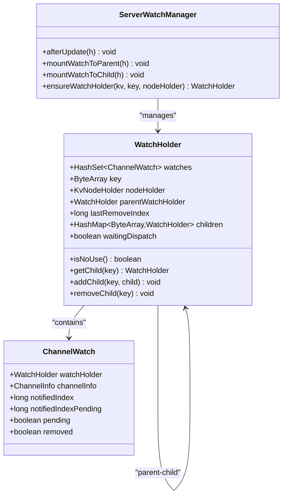
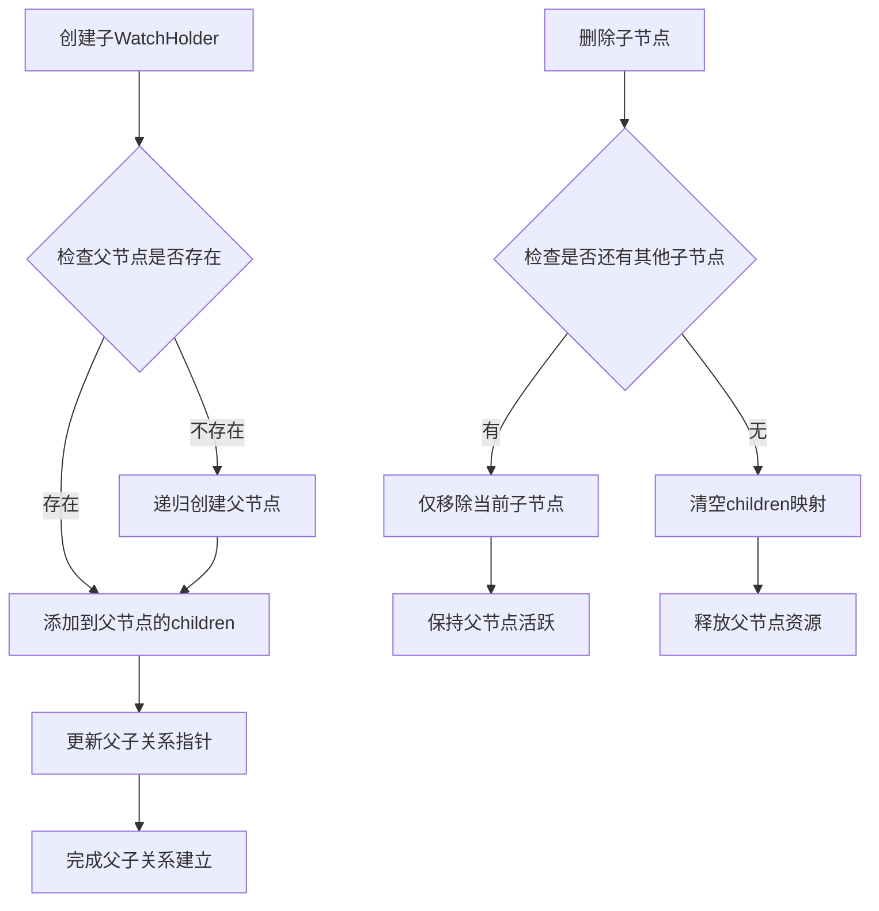
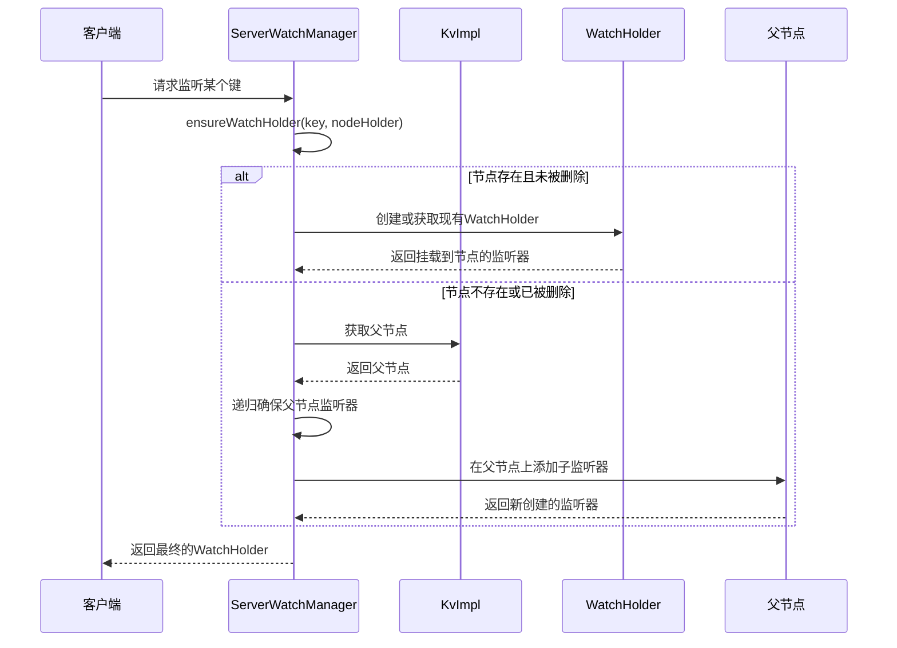
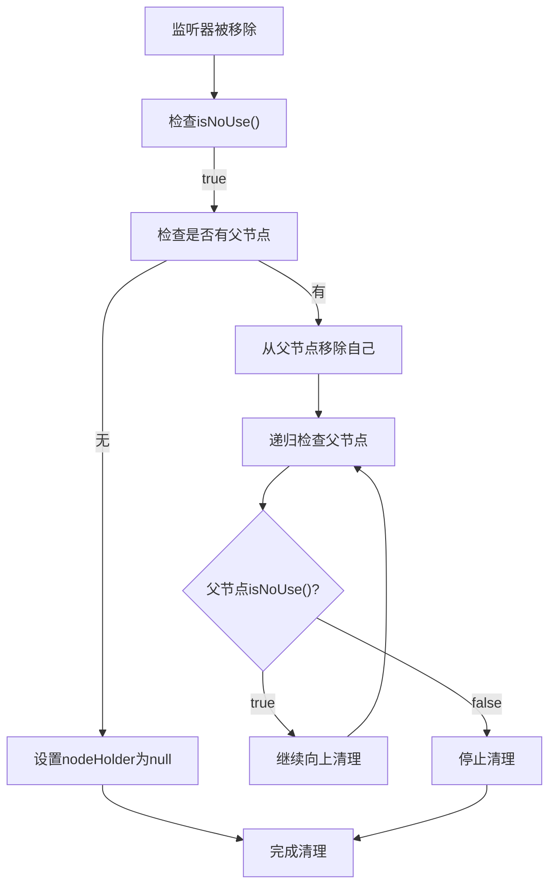
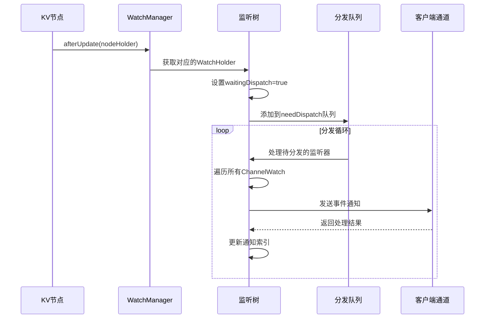
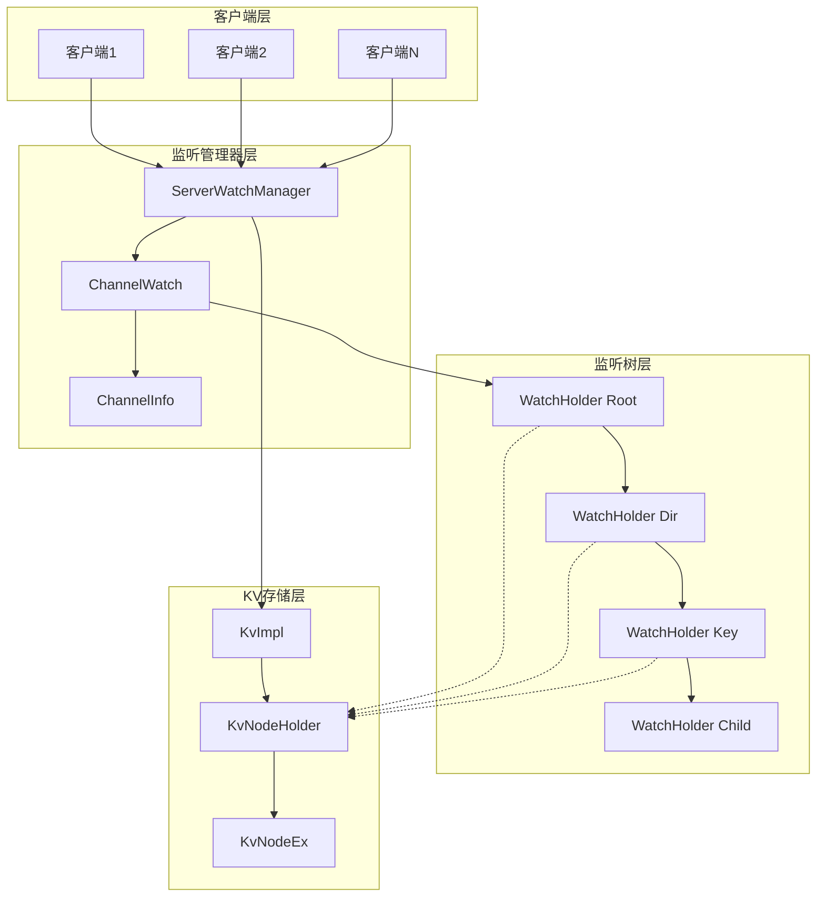
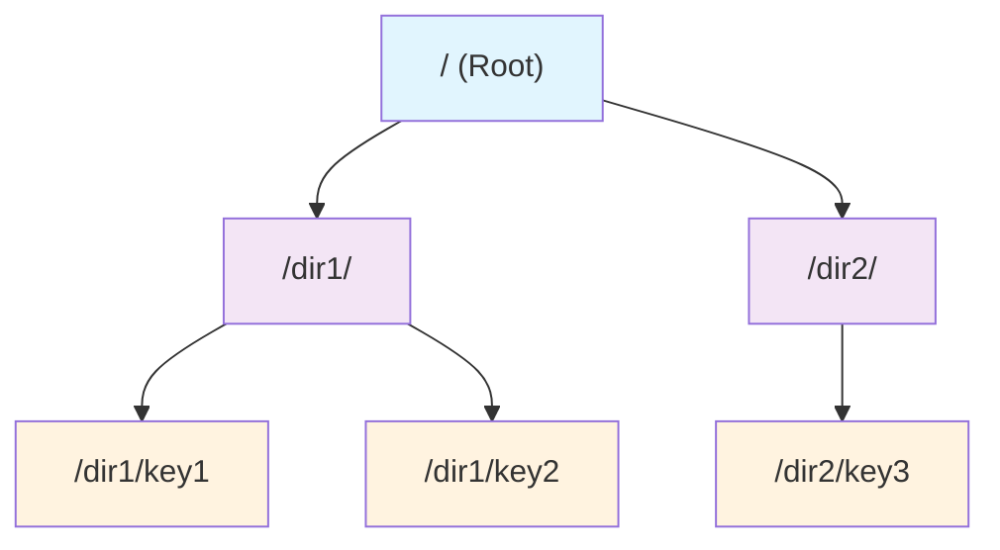

# 监听器树形结构

<cite>
**本文档引用的文件**
- [ServerWatchManager.java](file://server/src/main/java/com/github/dtprj/dongting/dtkv/server/ServerWatchManager.java)
- [KvImpl.java](file://server/src/main/java/com/github/dtprj/dongting/dtkv/server/KvImpl.java)
- [KvNodeHolder.java](file://server/src/main/java/com/github/dtprj/dongting/dtkv/server/KvNodeHolder.java)
- [KvNodeEx.java](file://server/src/main/java/com/github/dtprj/dongting/dtkv/server/KvNodeEx.java)
- [KvImplTest.java](file://server/src/test/java/com/github/dtprj/dongting/dtkv/server/KvImplTest.java)
</cite>

## 目录
1. [简介](#简介)
2. [核心组件概述](#核心组件概述)
3. [WatchHolder树形结构](#watchholder树形结构)
4. [父子关系维护机制](#父子关系维护机制)
5. [监听器挂载策略](#监听器挂载策略)
6. [资源回收机制](#资源回收机制)
7. [事件传播流程](#事件传播流程)
8. [架构图](#架构图)
9. [总结](#总结)

## 简介

Dongting分布式键值存储系统采用了一种高效的监听器树形结构来管理KV键路径的监听事件。该系统通过WatchHolder类构建了一个层次化的监听树，能够智能地处理监听器在不同层级节点间的挂载和传播，同时实现了自动的资源回收机制，确保系统在高并发场景下的稳定性和性能。

## 核心组件概述

### 主要类和接口

- **ServerWatchManager**: 监听管理器基类，负责监听器的注册、分发和清理
- **WatchHolder**: 监听持有者，代表树形结构中的一个节点
- **KvNodeHolder**: KV节点持有者，包含实际的数据节点和监听器信息
- **ChannelWatch**: 通道监听器，表示特定客户端连接的监听请求

## WatchHolder树形结构

### WatchHolder类设计

WatchHolder是整个监听树的核心组件，它在KV键路径上构建了一个层次化的监听树：



**图表来源**
- [ServerWatchManager.java](file://server/src/main/java/com/github/dtprj/dongting/dtkv/server/ServerWatchManager.java#L643-L700)

### 树形结构特点

1. **层次化组织**: 每个WatchHolder代表一个KV键路径节点，在树中形成层次结构
2. **双向链接**: 支持从父节点到子节点的导航，也支持从子节点到父节点的回溯
3. **动态扩展**: 子节点哈希表按需创建，避免不必要的内存开销
4. **状态标记**: 通过waitingDispatch字段控制事件分发状态

**章节来源**
- [ServerWatchManager.java](file://server/src/main/java/com/github/dtprj/dongting/dtkv/server/ServerWatchManager.java#L643-L700)

## 父子关系维护机制

### 父子节点关联

WatchHolder通过以下字段维护父子关系：

```java
// 父监听持有者
WatchHolder parentWatchHolder;

// 子监听持有者映射表
HashMap<ByteArray, WatchHolder> children;
```

### 关系维护流程



**图表来源**
- [ServerWatchManager.java](file://server/src/main/java/com/github/dtprj/dongting/dtkv/server/ServerWatchManager.java#L674-L685)

### 父子关系操作方法

```java
// 添加子节点
public void addChild(ByteArray key, WatchHolder child) {
    if (children == null) {
        children = new HashMap<>();
    }
    if (children.put(key, child) != null) {
        BugLog.log(new RaftException("watch holder child key already exists: " + key));
    }
}

// 移除子节点
public void removeChild(ByteArray key) {
    if (children == null) {
        BugLog.log(new RaftException("assert children != null"));
        return;
    }
    children.remove(key);
    if (children.isEmpty()) {
        children = null;
    }
}
```

**章节来源**
- [ServerWatchManager.java](file://server/src/main/java/com/github/dtprj/dongting/dtkv/server/ServerWatchManager.java#L674-L685)

## 监听器挂载策略

### ensureWatchHolder()方法详解

ensureWatchHolder()是监听器挂载的核心方法，它确保监听器在KV节点间的正确挂载：



**图表来源**
- [ServerWatchManager.java](file://server/src/main/java/com/github/dtprj/dongting/dtkv/server/ServerWatchManager.java#L541-L568)

### 挂载策略实现

```java
private WatchHolder ensureWatchHolder(KvImpl kv, ByteArray key, KvNodeHolder nodeHolder) {
    KvNodeHolder parent = null;
    if (nodeHolder != null) {
        if (!nodeHolder.latest.removed) {
            if (nodeHolder.watchHolder == null) {
                nodeHolder.watchHolder = new WatchHolder(nodeHolder.key, nodeHolder, null);
            }
            // 挂载到同名节点
            return nodeHolder.watchHolder;
        }
        parent = nodeHolder.parent;
    }
    // 挂载到父目录
    ByteArray parentKey;
    if (parent == null) {
        parentKey = kv.parentKey(key);
        parent = kv.map.get(parentKey);
    } else {
        parentKey = parent.key;
    }
    WatchHolder parentWatchHolder = ensureWatchHolder(kv, parentKey, parent);
    WatchHolder watchHolder = parentWatchHolder.getChild(key);
    if (watchHolder == null) {
        watchHolder = new WatchHolder(key, null, parentWatchHolder);
        parentWatchHolder.addChild(key, watchHolder);
    }
    return watchHolder;
}
```

### 挂载决策逻辑

1. **直接挂载**: 当目标节点存在且未被删除时，直接挂载到该节点
2. **间接挂载**: 当目标节点不存在或已被删除时，挂载到其父目录
3. **递归创建**: 通过递归确保所有必要的父节点监听器都已创建
4. **唯一性保证**: 使用键值作为唯一标识，避免重复创建

**章节来源**
- [ServerWatchManager.java](file://server/src/main/java/com/github/dtprj/dongting/dtkv/server/ServerWatchManager.java#L541-L568)

## 资源回收机制

### isNoUse()判断机制

isNoUse()方法用于判断监听器节点是否可以被安全地从树中移除：

```java
public boolean isNoUse() {
    return watches.isEmpty() && (children == null || children.isEmpty());
}
```

### 自动清理流程



**图表来源**
- [ServerWatchManager.java](file://server/src/main/java/com/github/dtprj/dongting/dtkv/server/ServerWatchManager.java#L670-L672)

### 清理过程实现

```java
private void removeWatchFromKvTree(ChannelWatch w) {
    if (w.removed) {
        return;
    }
    w.removed = true;
    WatchHolder h = w.watchHolder;
    h.watches.remove(w);
    while (h.isNoUse()) {
        // 这个键没有监听器，从树中移除监听持有者
        if (h.nodeHolder != null) {
            h.nodeHolder.watchHolder = null;
            break;
        } else {
            h.parentWatchHolder.removeChild(h.key);
            h = h.parentWatchHolder;
        }
    }
}
```

### 资源回收优势

1. **内存优化**: 及时释放不再使用的监听器节点
2. **性能提升**: 减少遍历无用节点的开销
3. **一致性保证**: 确保树结构始终反映实际的监听需求
4. **递归清理**: 从叶子节点向根节点逐层清理

**章节来源**
- [ServerWatchManager.java](file://server/src/main/java/com/github/dtprj/dongting/dtkv/server/ServerWatchManager.java#L489-L500)

## 事件传播流程

### 数据变更触发机制

当KV节点发生变更时，watchManager会通过afterUpdate()方法触发事件传播：

```java
public void afterUpdate(KvNodeHolder h) {
    WatchHolder wh = h.watchHolder;
    if (wh == null) {
        return;
    }
    if (wh.waitingDispatch) {
        return;
    }
    wh.waitingDispatch = true;
    needDispatch.add(wh);
}
```

### 事件传播序列



**图表来源**
- [ServerWatchManager.java](file://server/src/main/java/com/github/dtprj/dongting/dtkv/server/ServerWatchManager.java#L138-L147)

### 事件类型和内容

监听器事件包含以下信息：

1. **事件类型**: STATE_VALUE_EXISTS, STATE_DIRECTORY_EXISTS, STATE_NOT_EXISTS
2. **键路径**: 触发事件的完整键路径
3. **数据内容**: 对于值节点，包含最新的数据内容
4. **时间戳**: 事件发生的时间索引

### 批量分发优化

系统实现了批量分发机制来提高效率：

```java
public boolean dispatch() {
    boolean result = true;
    int dispatchBatchSize = config.watchMaxBatchSize;
    // 批量处理待分发的监听器
    // 批量发送通知给客户端
    // 批量重试失败的通知
}
```

**章节来源**
- [ServerWatchManager.java](file://server/src/main/java/com/github/dtprj/dongting/dtkv/server/ServerWatchManager.java#L138-L147)
- [ServerWatchManager.java](file://server/src/main/java/com/github/dtprj/dongting/dtkv/server/ServerWatchManager.java#L285-L350)

## 架构图

### 整体架构视图



**图表来源**
- [ServerWatchManager.java](file://server/src/main/java/com/github/dtprj/dongting/dtkv/server/ServerWatchManager.java#L40-L100)
- [KvImpl.java](file://server/src/main/java/com/github/dtprj/dongting/dtkv/server/KvImpl.java#L75-L88)

### 监听树结构示例

假设有一个KV存储结构如下：
```
/
├── dir1/
│   ├── key1
│   └── key2
└── dir2/
    └── key3
```

对应的监听树结构为：



**图表来源**
- [KvImpl.java](file://server/src/main/java/com/github/dtprj/dongting/dtkv/server/KvImpl.java#L80-L85)

## 总结

Dongting的监听器树形结构是一个精心设计的高效系统，具有以下核心特性：

### 技术优势

1. **层次化管理**: 通过树形结构清晰地组织KV键路径的监听关系
2. **智能挂载**: 根据节点状态选择最优的挂载策略，确保监听器的有效性
3. **自动清理**: 基于isNoUse()判断的自动资源回收机制
4. **批量处理**: 优化的事件分发和通知机制
5. **状态跟踪**: 完整的事件状态管理和索引跟踪

### 设计理念

- **性能优先**: 最小化内存占用和计算开销
- **可靠性保障**: 完善的错误处理和重试机制
- **可扩展性**: 支持大规模并发监听场景
- **一致性维护**: 确保监听事件的准确传递

### 应用价值

这种树形结构的设计不仅提高了系统的响应性能，还为分布式环境下的数据变更通知提供了可靠的基础设施。通过智能的资源管理和事件传播机制，系统能够在高负载情况下保持稳定的性能表现，为上层应用提供一致、及时的数据变更通知服务。