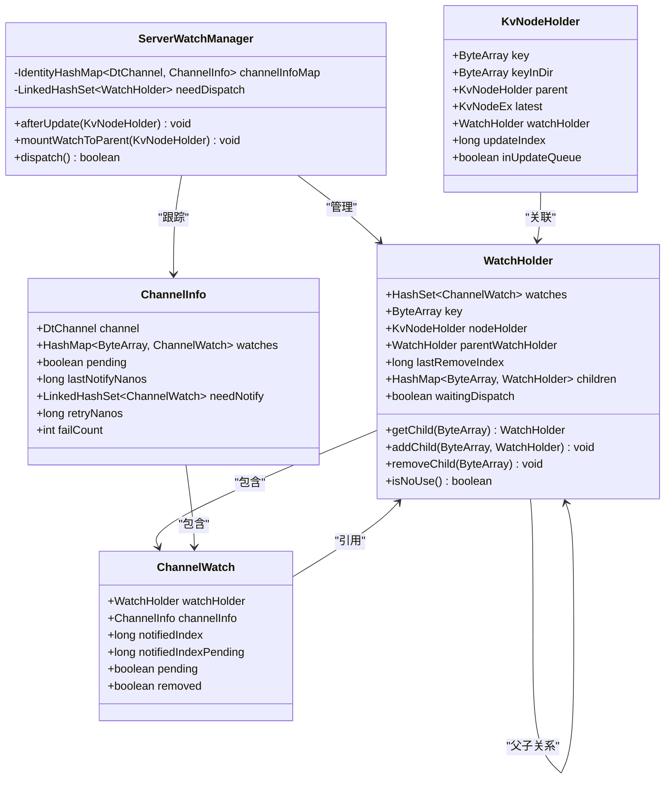
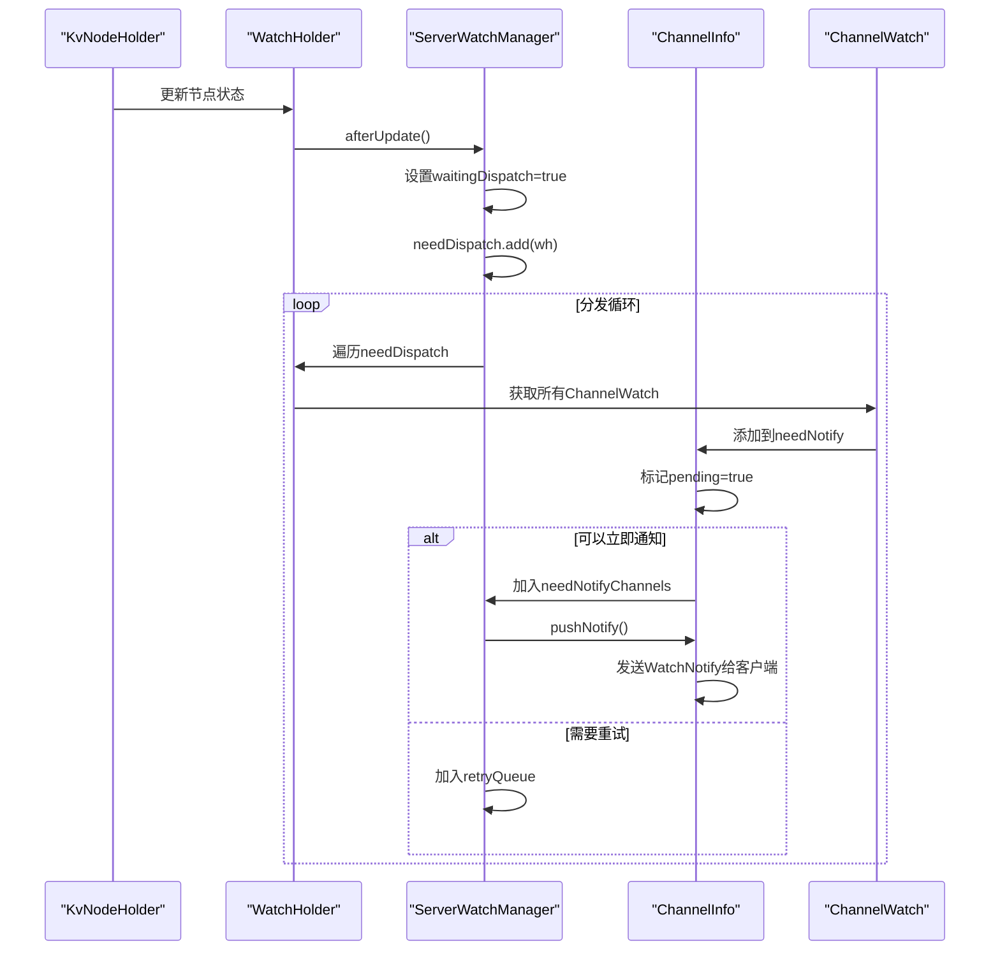
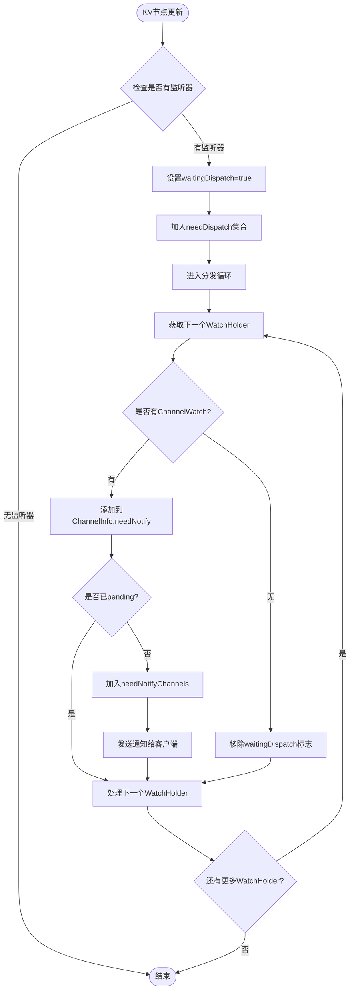

# 监听器树形结构设计

<cite>
**本文档引用的文件**
- [ServerWatchManager.java](file://server/src/main/java/com/github/dtprj/dongting/dtkv/server/ServerWatchManager.java)
- [KvNodeHolder.java](file://server/src/main/java/com/github/dtprj/dongting/dtkv/server/KvNodeHolder.java)
- [KvImpl.java](file://server/src/main/java/com/github/dtprj/dongting/dtkv/server/KvImpl.java)
- [KvNodeEx.java](file://server/src/main/java/com/github/dtprj/dongting/dtkv/server/KvNodeEx.java)
</cite>

## 目录
1. [简介](#简介)
2. [核心组件概述](#核心组件概述)
3. [WatchHolder树形结构设计](#watchholder树形结构设计)
4. [KvNodeHolder与WatchHolder的关联机制](#kvnodeholder与watchholder的关联机制)
5. [ServerWatchManager中的树形结构管理](#serverwatchmanager中的树形结构管理)
6. [事件传播机制](#事件传播机制)
7. [性能与内存表现分析](#性能与内存表现分析)
8. [故障排除指南](#故障排除指南)
9. [总结](#总结)

## 简介

Dongting分布式键值存储系统采用了一种创新的监听器树形结构设计，用于高效管理和传播键值变更事件。该设计通过WatchHolder类基于KV键路径构建层级化的监听树，实现了对大规模监听场景的优化处理。

本文档详细解释了WatchHolder如何基于KV键路径构建层级化的监听树，说明其与KvNodeHolder的关联机制，阐述parentWatchHolder与children字段如何维护父子节点关系，以及HashMap<ByteArray, WatchHolder>在路径导航中的作用。同时结合ServerWatchManager中的channelInfoMap和needDispatch集合，说明事件触发时如何通过树形结构进行高效传播。

## 核心组件概述

### 主要类关系图



**图表来源**
- [ServerWatchManager.java](file://server/src/main/java/com/github/dtprj/dongting/dtkv/server/ServerWatchManager.java#L51-L57)
- [ServerWatchManager.java](file://server/src/main/java/com/github/dtprj/dongting/dtkv/server/ServerWatchManager.java#L643-L700)
- [KvNodeHolder.java](file://server/src/main/java/com/github/dtprj/dongting/dtkv/server/KvNodeHolder.java#L22-L40)

## WatchHolder树形结构设计

### 核心数据结构

WatchHolder是整个监听器树形结构的核心组件，它基于KV键路径构建层级化的监听树：

```java
final class WatchHolder {
    final HashSet<ChannelWatch> watches = new HashSet<>();
    
    // 这些字段可能被更新
    ByteArray key;
    KvNodeHolder nodeHolder;
    WatchHolder parentWatchHolder;
    long lastRemoveIndex; // 仅当挂载到父目录时使用
    
    HashMap<ByteArray, WatchHolder> children;
    
    boolean waitingDispatch;
}
```

### 树形结构的关键特性

1. **层级化组织**：每个WatchHolder代表一个键路径节点，在树中形成层次结构
2. **双向链接**：通过parentWatchHolder维护父子关系，通过children维护子节点关系
3. **动态扩展**：children字段采用HashMap实现，支持动态添加和删除子节点
4. **状态标记**：waitingDispatch字段用于控制事件分发流程

### 路径导航机制

HashMap<ByteArray, WatchHolder>在路径导航中发挥关键作用：

```java
public WatchHolder getChild(ByteArray key) {
    if (children == null) {
        return null;
    }
    return children.get(key);
}

public void addChild(ByteArray key, WatchHolder child) {
    if (children == null) {
        children = new HashMap<>();
    }
    if (children.put(key, child) != null) {
        BugLog.log(new RaftException("watch holder child key already exists: " + key));
    }
}
```

这种设计允许O(1)时间复杂度的路径查找，支持高效的树遍历操作。

**章节来源**
- [ServerWatchManager.java](file://server/src/main/java/com/github/dtprj/dongting/dtkv/server/ServerWatchManager.java#L643-L700)

## KvNodeHolder与WatchHolder的关联机制

### 关联关系设计

KvNodeHolder和WatchHolder之间建立了紧密的关联机制：

```java
final class KvNodeHolder {
    final ByteArray key;
    final ByteArray keyInDir;
    final KvNodeHolder parent;
    
    KvNodeEx latest;
    WatchHolder watchHolder;  // 关键关联字段
    
    long updateIndex;
    boolean inUpdateQueue;
}
```

### 关联建立过程

1. **初始化阶段**：当创建新的KvNodeHolder时，watchHolder字段初始为null
2. **监听注册**：当有监听请求时，系统会为对应的KvNodeHolder创建或获取WatchHolder
3. **树形挂载**：通过mountWatchToParent和mountWatchToChild方法建立树形关系

### 挂载机制详解

#### 向父节点挂载

```java
public void mountWatchToParent(KvNodeHolder h) {
    WatchHolder wh = h.watchHolder;
    if (wh != null) {
        wh.lastRemoveIndex = h.updateIndex;
        KvNodeHolder parent = h.parent;
        if (parent.watchHolder == null) {
            parent.watchHolder = new WatchHolder(parent.key, parent, null);
        }
        parent.watchHolder.addChild(h.key, wh);
        wh.parentWatchHolder = parent.watchHolder;
        wh.nodeHolder = null;
    }
}
```

#### 向子节点挂载

```java
public void mountWatchToChild(KvNodeHolder h) {
    WatchHolder parentWh = h.parent.watchHolder;
    if (parentWh != null) {
        HashMap<ByteArray, WatchHolder> children = parentWh.children;
        if (children != null) {
            WatchHolder wh = children.remove(h.key);
            if (wh != null) {
                h.watchHolder = wh;
                wh.key = h.key;
                wh.nodeHolder = h;
                wh.parentWatchHolder = null;
            }
        }
    }
}
```

这种双向挂载机制确保了树形结构的完整性和一致性。

**章节来源**
- [ServerWatchManager.java](file://server/src/main/java/com/github/dtprj/dongting/dtkv/server/ServerWatchManager.java#L135-L160)
- [KvNodeHolder.java](file://server/src/main/java/com/github/dtprj/dongting/dtkv/server/KvNodeHolder.java#L22-L40)

## ServerWatchManager中的树形结构管理

### 核心管理组件

ServerWatchManager负责整个监听器树形结构的管理，主要包含以下关键组件：

```java
abstract class ServerWatchManager {
    private final IdentityHashMap<DtChannel, ChannelInfo> channelInfoMap = new IdentityHashMap<>();
    private final LinkedHashSet<WatchHolder> needDispatch = new LinkedHashSet<>();
    
    // 其他字段...
}
```

### channelInfoMap的作用

channelInfoMap是一个IdentityHashMap，用于跟踪每个DtChannel的连接状态和监听信息：

- **键**：使用IdentityHashMap确保通道对象的唯一性
- **值**：ChannelInfo对象包含该通道的所有监听器信息
- **功能**：支持快速的通道查找和状态管理

### needDispatch集合的管理

needDispatch是一个LinkedHashSet，用于管理需要分发的WatchHolder：

```java
public void afterUpdate(KvNodeHolder h) {
    WatchHolder wh = h.watchHolder;
    if (wh == null) {
        return;
    }
    if (wh.waitingDispatch) {
        return;
    }
    wh.waitingDispatch = true;
    needDispatch.add(wh);
}
```

这个机制确保了只有在必要时才将WatchHolder加入待分发队列，避免重复处理。

### 事件分发流程



**图表来源**
- [ServerWatchManager.java](file://server/src/main/java/com/github/dtprj/dongting/dtkv/server/ServerWatchManager.java#L135-L147)
- [ServerWatchManager.java](file://server/src/main/java/com/github/dtprj/dongting/dtkv/server/ServerWatchManager.java#L222-L250)

**章节来源**
- [ServerWatchManager.java](file://server/src/main/java/com/github/dtprj/dongting/dtkv/server/ServerWatchManager.java#L51-L57)
- [ServerWatchManager.java](file://server/src/main/java/com/github/dtprj/dongting/dtkv/server/ServerWatchManager.java#L135-L147)

## 事件传播机制

### 事件触发流程

当KV节点状态发生变化时，事件传播遵循以下流程：



**图表来源**
- [ServerWatchManager.java](file://server/src/main/java/com/github/dtprj/dongting/dtkv/server/ServerWatchManager.java#L222-L250)

### 通知创建机制

当需要向客户端发送通知时，系统会创建相应的WatchNotify对象：

```java
private WatchNotify createNotify(ChannelWatch w) {
    KvNodeHolder node = w.watchHolder.nodeHolder;
    if (node != null) {
        long updateIndex = node.latest.updateIndex;
        if (w.notifiedIndex >= updateIndex) {
            return null;
        }
        byte[] key = node.key.getData();
        w.notifiedIndexPending = updateIndex;
        // assert note.latest.removed == false
        if ((node.latest.flag & KvNode.FLAG_DIR_MASK) != 0) {
            return new WatchNotify(updateIndex, WatchEvent.STATE_DIRECTORY_EXISTS, key, null);
        } else {
            return new WatchNotify(updateIndex, WatchEvent.STATE_VALUE_EXISTS, key, node.latest.data);
        }
    } else {
        long lastRemoveIndex = w.watchHolder.lastRemoveIndex;
        if (w.notifiedIndex >= lastRemoveIndex) {
            return null;
        } else {
            w.notifiedIndexPending = lastRemoveIndex;
            return new WatchNotify(lastRemoveIndex, WatchEvent.STATE_NOT_EXISTS,
                    w.watchHolder.key.getData(), null);
        }
    }
}
```

### 错误处理和重试机制

系统实现了完善的错误处理和重试机制：

```java
private void retryByChannel(ChannelInfo ci, List<ChannelWatch> watches) {
    ci.failCount++;
    int idx = Math.min(ci.failCount - 1, retryIntervalNanos.length - 1);
    ci.retryNanos = ts.nanoTime + retryIntervalNanos[idx];
    retryQueue.add(ci);
    for (int size = watches.size(), i = 0; i < size; i++) {
        ci.addNeedNotify(watches.get(i));
    }
}
```

这种指数退避策略确保了在网络不稳定情况下的可靠性。

**章节来源**
- [ServerWatchManager.java](file://server/src/main/java/com/github/dtprj/dongting/dtkv/server/ServerWatchManager.java#L320-L350)
- [ServerWatchManager.java](file://server/src/main/java/com/github/dtprj/dongting/dtkv/server/ServerWatchManager.java#L590-L610)

## 性能与内存表现分析

### 内存使用优化

1. **延迟初始化**：children字段采用延迟初始化策略，只在需要时创建HashMap
2. **空集合优化**：当children为空时，将其置为null以节省内存
3. **弱引用设计**：使用HashSet而非强引用集合，便于垃圾回收

### 时间复杂度分析

| 操作类型 | 时间复杂度 | 说明 |
|---------|-----------|------|
| 查找WatchHolder | O(1) | 基于HashMap的键查找 |
| 添加子节点 | O(1) | HashMap的插入操作 |
| 删除子节点 | O(1) | HashMap的删除操作 |
| 遍历监听器 | O(n) | 遍历HashSet中的ChannelWatch |
| 事件分发 | O(m) | m为待分发的WatchHolder数量 |

### 大规模监听场景的性能表现

在大规模监听场景下，该设计表现出色：

1. **低内存占用**：通过树形结构共享公共前缀，减少重复存储
2. **高并发处理**：使用ConcurrentHashMap和HashSet支持高并发访问
3. **批量处理**：通过batchSize参数控制每次处理的数量，避免阻塞
4. **异步分发**：采用异步机制，不影响主线程性能

### 性能调优建议

1. **合理设置batchSize**：根据网络带宽和客户端处理能力调整
2. **监控内存使用**：定期检查WatchHolder和ChannelWatch的数量
3. **优化键命名**：避免过长的键名，减少内存开销
4. **定期清理无效监听**：及时移除不再使用的监听器

## 故障排除指南

### 常见问题及解决方案

#### 1. 监听器泄漏

**症状**：内存持续增长，WatchHolder数量异常增多

**原因**：监听器未正确移除

**解决方案**：
```java
// 确保在适当时候调用removeByChannel
public void removeByChannel(DtChannel channel) {
    ChannelInfo ci = channelInfoMap.remove(channel);
    if (ci != null && !ci.remove) {
        ci.remove = true;
        // 清理相关资源
        for (ChannelWatch w : ci.watches.values()) {
            removeWatchFromKvTree(w);
        }
    }
}
```

#### 2. 事件丢失

**症状**：客户端未收到预期的事件通知

**原因**：事件分发过程中出现异常

**解决方案**：
- 检查retryQueue中是否有积压的任务
- 验证channelInfoMap中是否存在对应的ChannelInfo
- 确认needDispatch集合中是否有待处理的WatchHolder

#### 3. 性能瓶颈

**症状**：事件分发延迟较高

**原因**：batchSize设置不当或网络延迟

**解决方案**：
```java
// 调整批处理大小
int dispatchBatchSize = config.watchMaxBatchSize;
// 或者增加重试间隔
long[] retryIntervalNanos = {1000, 10_000, 30_000, 60_000};
```

### 监控指标

建议监控以下关键指标：

1. **WatchHolder数量**：监控树形结构的大小
2. **事件分发延迟**：测量从事件发生到通知完成的时间
3. **失败率**：统计通知失败的比例
4. **内存使用**：监控相关对象的内存占用

**章节来源**
- [ServerWatchManager.java](file://server/src/main/java/com/github/dtprj/dongting/dtkv/server/ServerWatchManager.java#L200-L220)

## 总结

Dongting的监听器树形结构设计是一种高效、可扩展的解决方案，具有以下优势：

1. **高效的树形结构**：基于KV键路径的层级化组织，支持O(1)的路径查找
2. **灵活的关联机制**：KvNodeHolder与WatchHolder的双向关联，确保数据一致性
3. **智能的事件分发**：通过needDispatch集合和异步机制，实现高效的事件传播
4. **完善的错误处理**：指数退避重试机制，保证系统的可靠性
5. **优秀的性能表现**：在大规模监听场景下仍能保持良好的性能

该设计不仅满足了当前的功能需求，还为未来的扩展提供了良好的基础。通过合理的配置和监控，可以在生产环境中稳定运行，为分布式应用提供可靠的监听服务。