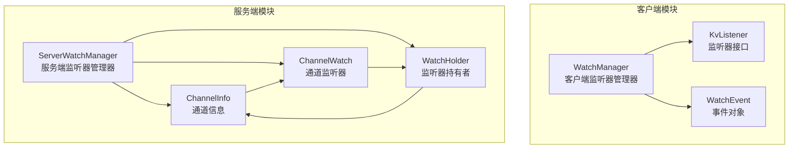
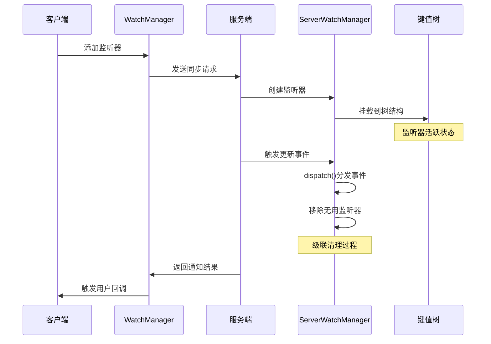
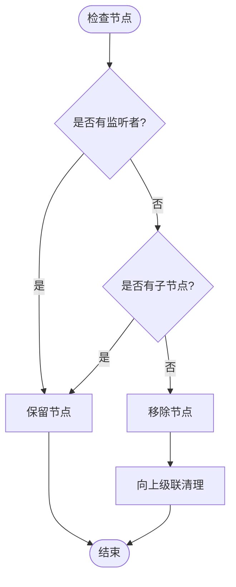
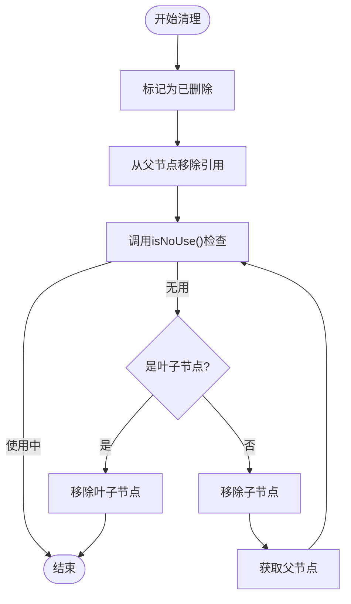
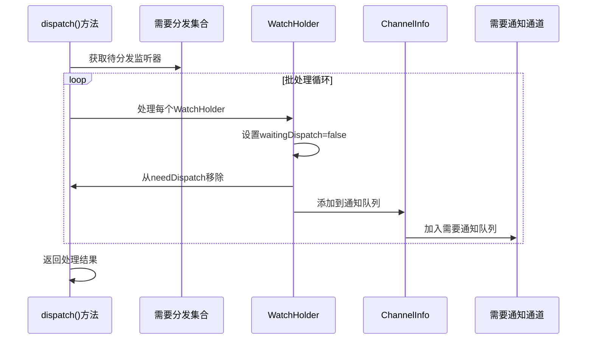
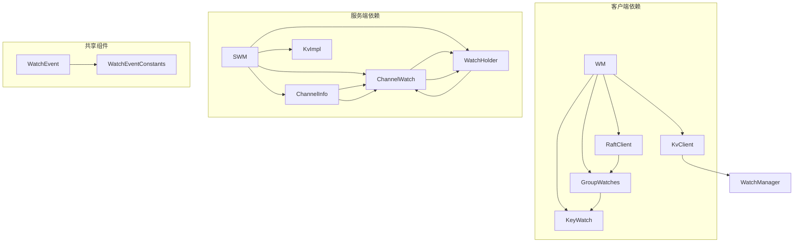

# 监听器生命周期管理

<cite>
**本文档引用的文件**
- [WatchManager.java](file://client/src/main/java/com/github/dtprj/dongting/dtkv/WatchManager.java)
- [ServerWatchManager.java](file://server/src/main/java/com/github/dtprj/dongting/dtkv/server/ServerWatchManager.java)
- [KvListener.java](file://client/src/main/java/com/github/dtprj/dongting/dtkv/KvListener.java)
- [WatchEvent.java](file://client/src/main/java/com/github/dtprj/dongting/dtkv/WatchEvent.java)
</cite>

## 目录
1. [简介](#简介)
2. [项目结构](#项目结构)
3. [核心组件](#核心组件)
4. [架构概览](#架构概览)
5. [详细组件分析](#详细组件分析)
6. [依赖关系分析](#依赖关系分析)
7. [性能考虑](#性能考虑)
8. [故障排除指南](#故障排除指南)
9. [结论](#结论)

## 简介

监听器生命周期管理系统是Dongting分布式键值存储系统中的关键组件，负责管理客户端和服务器端的监听器生命周期。该系统通过复杂的树形结构和状态机机制，实现了高效的事件监听、分发和资源回收功能。

本文档重点关注三个核心方面：
1. **isNoUse()方法**：判断监听器节点是否可回收的逻辑
2. **removeWatchFromKvTree()方法**：触发级联清理的机制
3. **dispatch()方法**：事件分发完成后监听器的pending状态管理

## 项目结构

监听器生命周期管理涉及以下主要模块：



**图表来源**
- [WatchManager.java](file://client/src/main/java/com/github/dtprj/dongting/dtkv/WatchManager.java#L1-L50)
- [ServerWatchManager.java](file://server/src/main/java/com/github/dtprj/dongting/dtkv/server/ServerWatchManager.java#L1-L50)

## 核心组件

### 客户端监听器管理器 (WatchManager)

WatchManager是客户端的核心监听器管理器，负责：
- 维护监听器组与键值的映射关系
- 处理监听器的添加、移除和同步操作
- 管理事件通知队列和用户回调执行

### 服务端监听器管理器 (ServerWatchManager)

ServerWatchManager是服务端的核心监听器管理器，负责：
- 管理通道级别的监听器
- 实现事件分发和重试机制
- 维护监听器树结构和生命周期

**章节来源**
- [WatchManager.java](file://client/src/main/java/com/github/dtprj/dongting/dtkv/WatchManager.java#L50-L100)
- [ServerWatchManager.java](file://server/src/main/java/com/github/dtprj/dongting/dtkv/server/ServerWatchManager.java#L50-L100)

## 架构概览

监听器生命周期管理系统采用分层架构设计：



**图表来源**
- [WatchManager.java](file://client/src/main/java/com/github/dtprj/dongting/dtkv/WatchManager.java#L150-L200)
- [ServerWatchManager.java](file://server/src/main/java/com/github/dtprj/dongting/dtkv/server/ServerWatchManager.java#L200-L250)

## 详细组件分析

### isNoUse()方法：监听器节点可回收判断

isNoUse()方法是监听器生命周期管理的核心判断逻辑，用于确定监听器节点是否可以被安全回收：

```java
public boolean isNoUse() {
    return watches.isEmpty() && (children == null || children.isEmpty());
}
```

这个方法的双重条件判断逻辑：

1. **无监听者检查**：`watches.isEmpty()`确保当前节点没有任何活跃的监听器
2. **无子节点检查**：`(children == null || children.isEmpty())`确保当前节点没有子节点

当这两个条件同时满足时，表示该监听器节点已经完全无用，可以被回收：



**图表来源**
- [ServerWatchManager.java](file://server/src/main/java/com/github/dtprj/dongting/dtkv/server/ServerWatchManager.java#L680-L690)

### removeWatchFromKvTree()方法：级联清理机制

removeWatchFromKvTree()方法实现了从叶子节点向根节点的级联清理机制：

```java
private void removeWatchFromKvTree(ChannelWatch w) {
    if (w.removed) {
        return;
    }
    w.removed = true;
    WatchHolder h = w.watchHolder;
    h.watches.remove(w);
    while (h.isNoUse()) {
        // this key has no watches, remove watch holder from tree
        if (h.nodeHolder != null) {
            h.nodeHolder.watchHolder = null;
            break;
        } else {
            h.parentWatchHolder.removeChild(h.key);
            h = h.parentWatchHolder;
        }
    }
}
```

清理流程包括：

1. **标记为已删除**：设置`w.removed = true`防止重复处理
2. **移除监听器引用**：从父节点的监听器集合中移除
3. **级联检查**：调用`isNoUse()`判断是否需要继续清理
4. **向上清理**：
   - 如果是叶子节点（`nodeHolder != null`），直接移除
   - 如果是中间节点，调用`removeChild()`递归向上清理



**图表来源**
- [ServerWatchManager.java](file://server/src/main/java/com/github/dtprj/dongting/dtkv/server/ServerWatchManager.java#L150-L170)

### dispatch()方法：事件分发与资源释放

dispatch()方法负责处理事件分发完成后的监听器状态管理和资源释放：

```java
public boolean dispatch() {
    boolean result = true;
    int dispatchBatchSize = config.watchMaxBatchSize;
    try {
        int count = 0;
        if (!needDispatch.isEmpty()) {
            Iterator<WatchHolder> it = needDispatch.iterator();
            while (it.hasNext()) {
                WatchHolder wh = it.next();
                if (++count > dispatchBatchSize) {
                    result = false;
                    break;
                }
                for (ChannelWatch w : wh.watches) {
                    if (w.removed || w.pending) {
                        continue;
                    }
                    ChannelInfo ci = w.channelInfo;
                    ci.addNeedNotify(w);
                    if (ci.failCount == 0 && !ci.pending) {
                        needNotifyChannels.add(ci);
                    }
                }
                wh.waitingDispatch = false;
                it.remove();
            }
        }
        // ... 其他分发逻辑
    } catch (Throwable e) {
        log.error("", e);
    }
    return result;
}
```

事件分发的关键步骤：

1. **批处理控制**：通过`dispatchBatchSize`限制单次处理数量
2. **状态检查**：跳过已删除或正在处理的监听器
3. **通知队列管理**：将监听器添加到通知队列
4. **状态重置**：将`waitingDispatch`设为false并从待处理集合中移除



**图表来源**
- [ServerWatchManager.java](file://server/src/main/java/com/github/dtprj/dongting/dtkv/server/ServerWatchManager.java#L180-L220)

### Channel断开时的批量清理

removeByChannel()方法处理通道断开时的批量清理：

```java
public void removeByChannel(DtChannel channel) {
    ChannelInfo ci = channelInfoMap.remove(channel);
    if (ci != null && !ci.remove) {
        ci.remove = true;
        ci.pending = false;

        needNotifyChannels.remove(ci);
        retryQueue.remove(ci);
        removeFromActiveQueue(ci);

        for (Iterator<ChannelWatch> it = ci.watches.values().iterator(); it.hasNext(); ) {
            ChannelWatch w = it.next();
            it.remove();
            removeWatchFromKvTree(w);
        }
    }
}
```

清理流程：

1. **移除通道信息**：从主映射表中移除
2. **清理队列引用**：从各种队列中移除
3. **遍历监听器**：对每个监听器调用`removeWatchFromKvTree()`
4. **级联清理**：自动触发树结构的向上清理

### sync()方法：全量同步场景的特殊处理

sync()方法处理全量同步场景下的监听器生命周期：

```java
public void sync(KvImpl kv, DtChannel channel, boolean syncAll, ByteArray[] keys, long[] knownRaftIndexes) {
    if (syncAll && (keys == null || keys.length == 0)) {
        removeByChannel(channel);
        return;
    }
    // ... 同步逻辑
    if (syncAll) {
        for (ChannelWatch cw : ci.watches.values()) {
            cw.needRemoveAfterSyncAll = true;
        }
    }
    // ... 处理键值对
    if (syncAll) {
        for (Iterator<ChannelWatch> it = ci.watches.values().iterator(); it.hasNext(); ) {
            ChannelWatch cw = it.next();
            if (cw.needRemoveAfterSyncAll) {
                it.remove();
                removeWatchFromKvTree(cw);
            }
        }
    }
}
```

全量同步的特殊处理：

1. **标记所有监听器**：设置`needRemoveAfterSyncAll = true`
2. **增量处理**：只处理已知的键值对
3. **批量清理**：同步完成后统一清理标记的监听器

**章节来源**
- [ServerWatchManager.java](file://server/src/main/java/com/github/dtprj/dongting/dtkv/server/ServerWatchManager.java#L150-L200)
- [ServerWatchManager.java](file://server/src/main/java/com/github/dtprj/dongting/dtkv/server/ServerWatchManager.java#L500-L550)

## 依赖关系分析

监听器生命周期管理系统的依赖关系图：



**图表来源**
- [WatchManager.java](file://client/src/main/java/com/github/dtprj/dongting/dtkv/WatchManager.java#L1-L50)
- [ServerWatchManager.java](file://server/src/main/java/com/github/dtprj/dongting/dtkv/server/ServerWatchManager.java#L1-L50)

**章节来源**
- [WatchManager.java](file://client/src/main/java/com/github/dtprj/dongting/dtkv/WatchManager.java#L1-L100)
- [ServerWatchManager.java](file://server/src/main/java/com/github/dtprj/dongting/dtkv/server/ServerWatchManager.java#L1-L100)

## 性能考虑

### 批处理优化

系统采用了多种批处理优化策略：

1. **dispatchBatchSize**：限制单次分发数量，避免长时间阻塞
2. **watchMaxBatchSize**：控制通知批次大小
3. **watchMaxReqBytes**：限制单个通知请求的字节数

### 内存管理

1. **及时清理**：通过级联清理机制及时释放无用资源
2. **弱引用**：使用IdentityHashMap避免内存泄漏
3. **对象池化**：复用临时对象减少GC压力

### 并发控制

1. **锁分离**：客户端和服务端分别使用独立的锁
2. **读写分离**：区分读取和修改操作的并发控制
3. **无锁数据结构**：在可能的情况下使用无锁算法

## 故障排除指南

### 常见问题及解决方案

1. **监听器泄漏**
   - 症状：内存持续增长，监听器数量异常
   - 原因：未正确调用removeWatch()或removeByChannel()
   - 解决：检查监听器生命周期管理逻辑

2. **事件丢失**
   - 症状：监听器未能收到预期的事件通知
   - 原因：网络中断或通道关闭
   - 解决：检查网络连接和重试机制

3. **性能问题**
   - 症状：事件分发延迟或吞吐量下降
   - 原因：批处理配置不当或队列积压
   - 解决：调整批处理参数和监控队列状态

**章节来源**
- [ServerWatchManager.java](file://server/src/main/java/com/github/dtprj/dongting/dtkv/server/ServerWatchManager.java#L400-L450)

## 结论

监听器生命周期管理系统通过精心设计的树形结构和状态机机制，实现了高效、可靠的事件监听和分发功能。关键特性包括：

1. **智能回收**：通过isNoUse()方法实现精确的资源回收
2. **级联清理**：removeWatchFromKvTree()提供高效的树结构清理
3. **批处理优化**：dispatch()方法支持大规模事件处理
4. **容错机制**：完善的错误处理和重试逻辑

这套系统为Dongting分布式键值存储提供了强大的事件驱动能力，支持高并发、低延迟的应用场景。通过合理的配置和监控，可以确保系统的稳定性和性能表现。