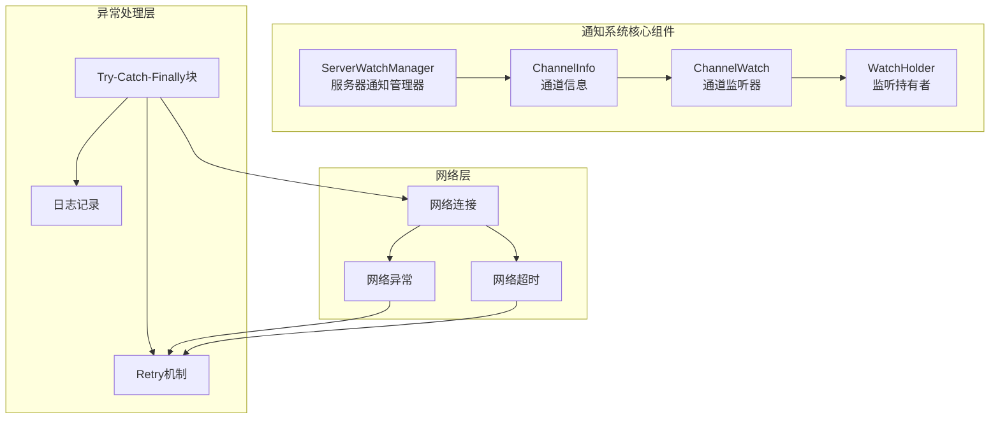
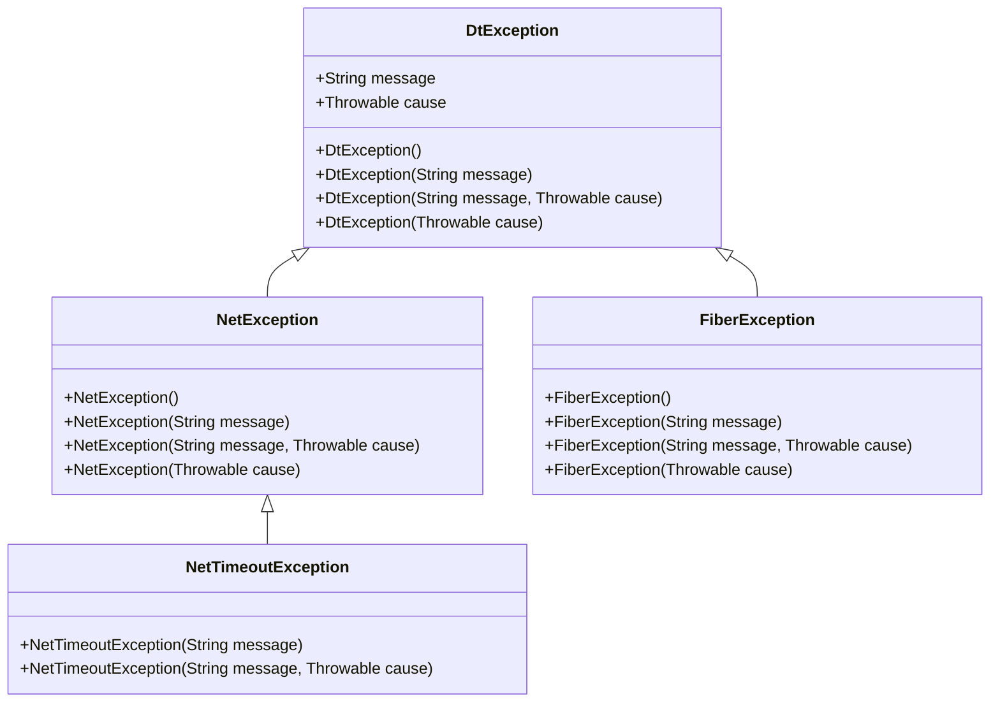
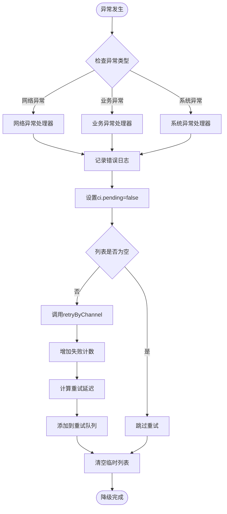
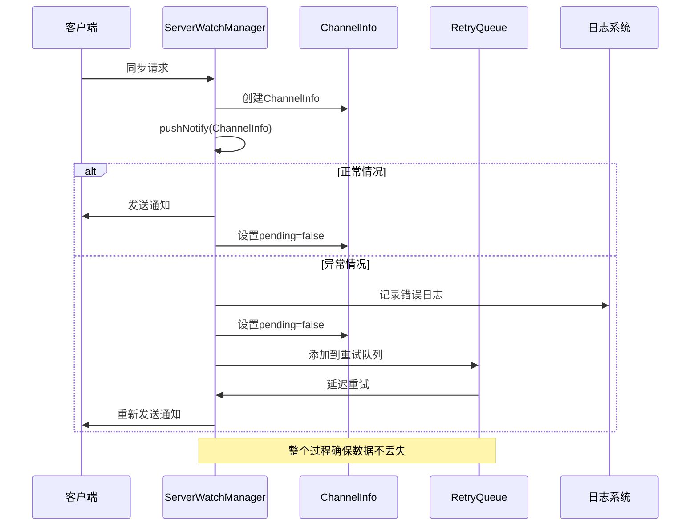
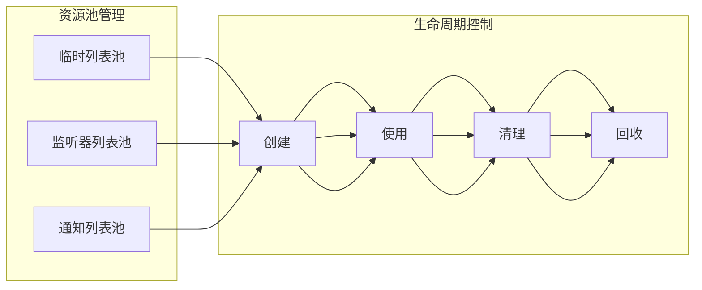

# 异常处理与降级策略技术文档

<cite>
**本文档引用的文件**
- [ServerWatchManager.java](file://server/src/main/java/com/github/dtprj/dongting/dtkv/server/ServerWatchManager.java)
- [DtException.java](file://client/src/main/java/com/github/dtprj/dongting/common/DtException.java)
- [NetException.java](file://client/src/main/java/com/github/dtprj/dongting/net/NetException.java)
- [NetTimeoutException.java](file://client/src/main/java/com/github/dtprj/dongting/net/NetTimeoutException.java)
- [RetryFrame.java](file://server/src/main/java/com/github/dtprj/dongting/raft/store/RetryFrame.java)
- [AsyncIoTask.java](file://server/src/main/java/com/github/dtprj/dongting/raft/store/AsyncIoTask.java)
</cite>

## 目录
1. [概述](#概述)
2. [系统架构](#系统架构)
3. [异常处理机制](#异常处理机制)
4. [降级策略](#降级策略)
5. [pushNotify方法详细分析](#pushnotify方法详细分析)
6. [通知系统可靠性保障](#通知系统可靠性保障)
7. [性能考虑](#性能考虑)
8. [故障排除指南](#故障排除指南)
9. [总结](#总结)

## 概述

Dongting项目中的通知系统采用了完善的异常处理与降级策略，确保在面对网络异常、运行时错误等故障场景时能够维持系统的稳定性和可靠性。本文档深入分析了`pushNotify()`方法中try-catch-finally块的设计原理，以及整个异常处理机制如何保障通知系统的容错能力。

该系统的核心设计理念是"优雅降级"：当遇到不可恢复的错误时，系统会记录错误日志、终止当前推送操作，并将未完成的任务重新入队等待重试，而不是直接崩溃或丢失数据。

## 系统架构



**图表来源**
- [ServerWatchManager.java](file://server/src/main/java/com/github/dtprj/dongting/dtkv/server/ServerWatchManager.java#L285-L343)

**章节来源**
- [ServerWatchManager.java](file://server/src/main/java/com/github/dtprj/dongting/dtkv/server/ServerWatchManager.java#L1-L100)

## 异常处理机制

### 异常分类体系

Dongting系统中的异常处理基于以下分类体系：



**图表来源**
- [DtException.java](file://client/src/main/java/com/github/dtprj/dongting/common/DtException.java#L1-L40)
- [NetException.java](file://client/src/main/java/com/github/dtprj/dongting/net/NetException.java#L1-L42)
- [NetTimeoutException.java](file://client/src/main/java/com/github/dtprj/dongting/net/NetTimeoutException.java#L1-L30)

### 异常传播路径

系统中的异常传播遵循以下模式：

1. **底层网络异常**：Socket异常、连接中断等
2. **传输层异常**：协议解析错误、消息格式错误等
3. **应用层异常**：业务逻辑错误、数据验证失败等
4. **系统级异常**：资源不足、线程池耗尽等

**章节来源**
- [DtException.java](file://client/src/main/java/com/github/dtprj/dongting/common/DtException.java#L1-L40)
- [NetException.java](file://client/src/main/java/com/github/dtprj/dongting/net/NetException.java#L1-L42)

## 降级策略

### 降级触发条件

系统采用多层次的降级策略，主要触发条件包括：

1. **网络连接异常**：连接断开、无法建立连接
2. **消息发送失败**：消息发送超时、接收方无响应
3. **业务逻辑错误**：业务状态不一致、数据校验失败
4. **系统资源限制**：内存不足、线程池满载

### 降级执行流程



**图表来源**
- [ServerWatchManager.java](file://server/src/main/java/com/github/dtprj/dongting/dtkv/server/ServerWatchManager.java#L318-L343)

**章节来源**
- [ServerWatchManager.java](file://server/src/main/java/com/github/dtprj/dongting/dtkv/server/ServerWatchManager.java#L448-L488)

## pushNotify方法详细分析

### 方法签名与职责

`pushNotify(ChannelInfo ci)`方法是通知系统的核心处理函数，负责向客户端推送变更通知：

```java
private void pushNotify(ChannelInfo ci) {
    if (ci.remove) {
        return;
    }
    ArrayList<Pair<ChannelWatch, WatchNotify>> list = pushNotifyTempList;
    try {
        // 核心业务逻辑
    } catch (Error | RuntimeException e) {
        // 异常处理逻辑
    } finally {
        list.clear();
    }
}
```

### try块核心逻辑

try块包含以下关键步骤：

1. **连接状态检查**：
```java
if (!ci.channel.getChannel().isOpen()) {
    removeByChannel(ci.channel);
    return;
}
```

2. **待通知数据验证**：
```java
if (ci.needNotify == null || ci.needNotify.isEmpty()) {
    ci.pending = false;
    return;
}
```

3. **批量通知构建**：
```java
while (it.hasNext()) {
    ChannelWatch w = it.next();
    it.remove();
    if (w.removed || w.pending) {
        continue;
    }
    WatchNotify wn = createNotify(w);
    if (wn != null) {
        list.add(new Pair<>(w, wn));
        w.pending = true;
        bytes += wn.key.length + (wn.value == null ? 0 : wn.value.length);
        if (bytes > config.watchMaxReqBytes) {
            break;
        }
    }
}
```

### catch块异常处理

catch块专门处理Error和RuntimeException两类异常：

```java
catch (Error | RuntimeException e) {
    log.error("", e);
    ci.pending = false;
    if (!list.isEmpty()) {
        retryByChannel(ci, list.stream().map(Pair::getLeft).collect(Collectors.toList()));
    }
}
```

**关键处理逻辑**：

1. **错误日志记录**：使用`log.error("", e)`记录异常详情
2. **状态重置**：将`ci.pending`设置为false，表示当前推送失败
3. **任务重试**：调用`retryByChannel()`方法将未完成的任务重新入队

### finally块清理机制

finally块确保无论正常执行还是异常退出，都会执行清理操作：

```java
finally {
    list.clear();
}
```

**清理目的**：

1. **内存释放**：清空临时列表，避免内存泄漏
2. **状态一致性**：确保下一次调用时列表为空
3. **资源回收**：释放可能持有的对象引用

**章节来源**
- [ServerWatchManager.java](file://server/src/main/java/com/github/dtprj/dongting/dtkv/server/ServerWatchManager.java#L285-L343)

## 通知系统可靠性保障

### 多层次容错机制



**图表来源**
- [ServerWatchManager.java](file://server/src/main/java/com/github/dtprj/dongting/dtkv/server/ServerWatchManager.java#L285-L488)

### 数据一致性保证

系统通过以下机制确保数据一致性：

1. **原子性操作**：每个通知发送都是原子性的
2. **状态跟踪**：通过`pending`字段跟踪发送状态
3. **重试机制**：失败的通知会被重新入队处理
4. **幂等性设计**：重复处理不会产生副作用

### 资源管理策略



**章节来源**
- [ServerWatchManager.java](file://server/src/main/java/com/github/dtprj/dongting/dtkv/server/ServerWatchManager.java#L285-L488)

## 性能考虑

### 批量处理优化

系统采用批量处理策略来提高性能：

1. **批量大小控制**：通过`watchMaxBatchSize`限制批处理大小
2. **字节大小限制**：通过`watchMaxReqBytes`控制单次请求大小
3. **时间片轮转**：避免长时间阻塞其他任务

### 内存使用优化

```java
// 使用对象池减少GC压力
private final ArrayList<Pair<ChannelWatch, WatchNotify>> pushNotifyTempList = new ArrayList<>(64);
private final ArrayList<ChannelInfo> dispatchTempList;
```

### 异步处理机制

系统采用异步处理模式：

1. **非阻塞I/O**：使用NIO进行网络通信
2. **事件驱动**：基于事件循环处理请求
3. **并发控制**：通过线程池控制并发度

## 故障排除指南

### 常见异常场景

1. **网络连接异常**
   - 症状：频繁的日志错误和重试
   - 排查：检查网络连通性和防火墙设置
   - 解决：重启服务或调整网络配置

2. **内存溢出异常**
   - 症状：OutOfMemoryError或频繁GC
   - 排查：监控JVM内存使用情况
   - 解决：增加堆内存或优化对象池

3. **死锁问题**
   - 症状：线程阻塞且无响应
   - 排查：使用jstack分析线程状态
   - 解决：优化锁顺序或使用无锁算法

### 监控指标

建议监控以下关键指标：

1. **异常率**：每分钟异常次数
2. **重试成功率**：重试请求的成功比例
3. **队列长度**：重试队列的积压程度
4. **响应时间**：通知发送的平均延迟

### 日志分析

重点关注以下日志模式：

```java
// 错误日志示例
log.error("notify failed. remote={}, bizCode={}", ci.channel.getRemoteAddr(), bizCode);

// 警告日志示例  
log.warn("notify failed. remote={}, ex={}", ci.channel.getRemoteAddr(), ex);
```

**章节来源**
- [ServerWatchManager.java](file://server/src/main/java/com/github/dtprj/dongting/dtkv/server/ServerWatchManager.java#L407-L488)

## 总结

Dongting项目的通知系统通过精心设计的异常处理与降级策略，实现了高可靠性和容错能力。核心特点包括：

1. **完善的异常分类**：基于继承关系的异常体系，便于精确处理
2. **优雅降级机制**：在网络异常或运行时错误时能够平滑降级
3. **可靠的数据保障**：通过重试机制确保数据不丢失
4. **高效的资源管理**：通过对象池和批量处理优化性能
5. **清晰的状态跟踪**：通过状态字段和日志记录确保可追溯性

这种设计使得系统能够在各种故障场景下保持稳定运行，同时为运维人员提供了良好的可观测性和可维护性。对于开发者而言，这套机制既保证了系统的健壮性，又提供了清晰的错误处理路径，有助于快速定位和解决问题。