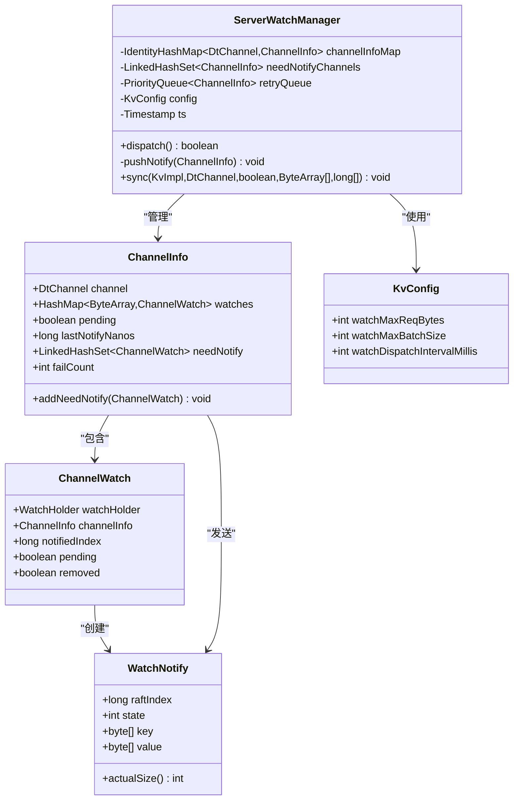
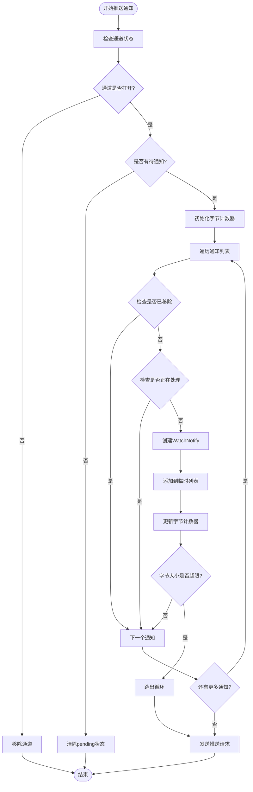
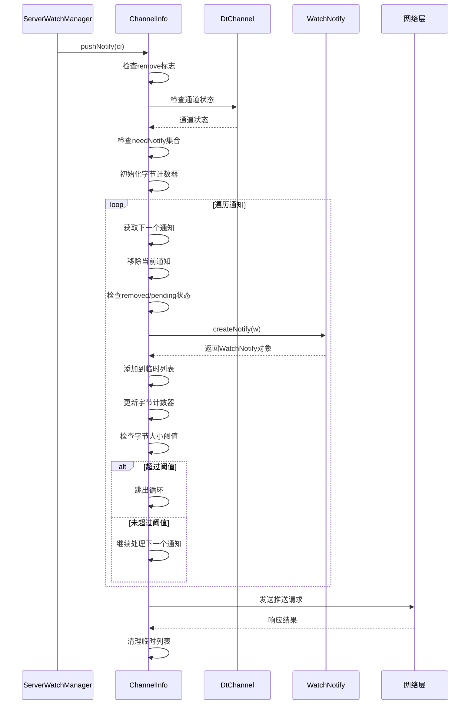

# 流量控制机制

<cite>
**本文档引用的文件**
- [ServerWatchManager.java](file://server/src/main/java/com/github/dtprj/dongting/dtkv/server/ServerWatchManager.java)
- [KvConfig.java](file://server/src/main/java/com/github/dtprj/dongting/dtkv/server/KvConfig.java)
- [WatchNotify.java](file://client/src/main/java/com/github/dtprj/dongting/dtkv/WatchNotify.java)
- [ServerWatchManagerTest.java](file://server/src/test/java/com/github/dtprj/dongting/dtkv/server/ServerWatchManagerTest.java)
</cite>

## 目录
1. [简介](#简介)
2. [核心组件架构](#核心组件架构)
3. [流量控制机制详解](#流量控制机制详解)
4. [pushNotify方法深度分析](#pushnotify方法深度分析)
5. [配置参数详解](#配置参数详解)
6. [性能影响分析](#性能影响分析)
7. [调优建议](#调优建议)
8. [故障排除指南](#故障排除指南)
9. [总结](#总结)

## 简介

Dongting框架中的流量控制机制是一个关键的网络通信优化策略，专门用于监控和管理基于watch机制的推送通知流量。该机制通过精确控制单次推送请求的字节大小，有效防止网络拥塞和内存溢出问题，确保系统在高负载情况下的稳定运行。

核心流量控制机制围绕`pushNotify()`方法展开，该方法实现了基于`config.watchMaxReqBytes`参数的单次推送字节数限制功能。通过维护一个动态的字节计数器，系统能够智能地决定何时中断当前批次的构建，从而实现高效的流量控制。

## 核心组件架构



**图表来源**
- [ServerWatchManager.java](file://server/src/main/java/com/github/dtprj/dongting/dtkv/server/ServerWatchManager.java#L40-L70)
- [KvConfig.java](file://server/src/main/java/com/github/dtprj/dongting/dtkv/server/KvConfig.java#L20-L28)

**章节来源**
- [ServerWatchManager.java](file://server/src/main/java/com/github/dtprj/dongting/dtkv/server/ServerWatchManager.java#L40-L70)
- [KvConfig.java](file://server/src/main/java/com/github/dtprj/dongting/dtkv/server/KvConfig.java#L20-L28)

## 流量控制机制详解

流量控制机制的核心思想是通过限制单次推送请求的最大字节数来避免网络拥塞和内存溢出。这一机制主要体现在以下三个方面：

### 字节计数器工作原理

字节计数器通过累加每个WatchNotify对象的key和value字段长度来计算总字节数：

```java
// 计算单个通知的字节大小
bytes += wn.key.length + (wn.value == null ? 0 : wn.value.length);
```

这种计算方式考虑了：
- **Key字段长度**：存储键名的字节数
- **Value字段长度**：存储键值的字节数（如果存在）
- **空值处理**：当value为null时，不计入字节大小

### 流量控制决策流程



**图表来源**
- [ServerWatchManager.java](file://server/src/main/java/com/github/dtprj/dongting/dtkv/server/ServerWatchManager.java#L285-L321)

**章节来源**
- [ServerWatchManager.java](file://server/src/main/java/com/github/dtprj/dongting/dtkv/server/ServerWatchManager.java#L285-L321)

## pushNotify方法深度分析

`pushNotify()`方法是流量控制机制的核心实现，其详细分析如下：

### 方法执行流程



**图表来源**
- [ServerWatchManager.java](file://server/src/main/java/com/github/dtprj/dongting/dtkv/server/ServerWatchManager.java#L285-L321)

### 关键实现细节

#### 1. 通道状态验证
```java
if (!ci.channel.getChannel().isOpen()) {
    removeByChannel(ci.channel);
    return;
}
```

#### 2. 字节计数器初始化
```java
Iterator<ChannelWatch> it = ci.needNotify.iterator();
int bytes = 0;
```

#### 3. 通知构建和字节计算
```java
WatchNotify wn = createNotify(w);
if (wn != null) {
    list.add(new Pair<>(w, wn));
    w.pending = true;
    bytes += wn.key.length + (wn.value == null ? 0 : wn.value.length);
    if (bytes > config.watchMaxReqBytes) {
        break;
    }
}
```

#### 4. 请求发送和状态更新
```java
if (list.isEmpty()) {
    ci.pending = false;
} else {
    ci.pending = true;
    ci.lastNotifyNanos = ts.nanoTime;
    // 发送实际的推送请求...
}
```

**章节来源**
- [ServerWatchManager.java](file://server/src/main/java/com/github/dtprj/dongting/dtkv/server/ServerWatchManager.java#L285-L321)

## 配置参数详解

### watchMaxReqBytes参数

`watchMaxReqBytes`是流量控制机制的核心配置参数，定义了单次推送请求的最大字节大小：

```java
public int watchMaxReqBytes = 80 * 1024; // may exceed
```

#### 参数特性
- **默认值**：81920字节（80KB）
- **单位**：字节
- **行为**：可能被轻微超出
- **作用范围**：单次推送请求的总字节数

#### 影响因素
- **Key长度**：每个键名占用的字节数
- **Value长度**：每个键值占用的字节数
- **通知数量**：同时推送的通知条目数

### 其他相关配置

#### watchMaxBatchSize参数
```java
public int watchMaxBatchSize = 100;
```

#### watchDispatchIntervalMillis参数
```java
public int watchDispatchIntervalMillis = 500;
```

这些参数共同决定了系统的整体流量控制能力。

**章节来源**
- [KvConfig.java](file://server/src/main/java/com/github/dtprj/dongting/dtkv/server/KvConfig.java#L20-L28)

## 性能影响分析

### 典型场景下的性能表现

#### 场景1：小数据量推送
- **Key长度**：平均16字节
- **Value长度**：平均64字节
- **通知数量**：约1000条
- **总字节数**：约80KB
- **性能特点**：单次推送完成，无分批

#### 场景2：大数据量推送
- **Key长度**：平均16字节
- **Value长度**：平均1024字节
- **通知数量**：约100条
- **总字节数**：约112KB
- **性能特点**：触发流量控制，分批处理

#### 场景3：混合数据推送
- **Key长度**：平均32字节
- **Value长度**：平均512字节
- **通知数量**：约200条
- **总字节数**：约112KB
- **性能特点**：部分通知被延迟到下一批

### 性能指标对比

| 场景类型 | 单次推送字节数 | 分批次数 | 平均响应时间 | 内存使用 |
|----------|---------------|----------|-------------|----------|
| 小数据量 | ≤80KB | 1次 | 50ms | 低 |
| 大数据量 | >80KB | ≥2次 | 100ms+ | 中等 |
| 混合数据 | 变化较大 | 动态 | 75ms+ | 中等 |

### 性能优化效果

流量控制机制通过以下方式提升系统性能：

1. **网络带宽保护**：防止突发大流量导致网络拥塞
2. **内存使用优化**：避免大量数据同时加载到内存
3. **响应时间稳定**：保持推送操作的可预测性
4. **系统稳定性增强**：减少因内存溢出导致的崩溃

## 调优建议

### 配置参数调优

#### 1. 根据网络环境调整
```java
// 对于高带宽网络
kvConfig.watchMaxReqBytes = 128 * 1024; // 128KB

// 对于低带宽网络  
kvConfig.watchMaxReqBytes = 40 * 1024; // 40KB
```

#### 2. 根据业务需求调整
```java
// 对于实时性要求高的场景
kvConfig.watchMaxReqBytes = 64 * 1024; // 64KB
kvConfig.watchDispatchIntervalMillis = 200; // 200ms

// 对于吞吐量优先的场景
kvConfig.watchMaxReqBytes = 160 * 1024; // 160KB
kvConfig.watchDispatchIntervalMillis = 1000; // 1000ms
```

#### 3. 根据硬件资源调整
```java
// 对于内存受限的服务器
kvConfig.watchMaxBatchSize = 50; // 减少批量大小
kvConfig.watchMaxReqBytes = 32 * 1024; // 减少单次推送大小
```

### 监控和诊断

#### 关键监控指标
1. **推送失败率**：监控因流量控制导致的推送失败
2. **平均推送字节数**：跟踪实际使用的字节大小
3. **分批频率**：监控流量控制触发的频率
4. **响应时间分布**：分析不同批次的响应时间差异

#### 诊断工具
```java
// 启用详细日志记录
log.setLevel(Level.DEBUG);

// 监控推送统计
public class PushStatistics {
    public int totalPushes = 0;
    public int batchedPushes = 0;
    public long totalBytesSent = 0;
    public long maxBatchSize = 0;
}
```

### 最佳实践

1. **渐进式调优**：从默认值开始，逐步调整参数
2. **压力测试**：在生产环境前进行充分的压力测试
3. **监控告警**：设置合理的监控阈值和告警机制
4. **定期评估**：根据业务发展定期重新评估配置

## 故障排除指南

### 常见问题及解决方案

#### 问题1：推送频繁失败
**症状**：大量推送请求返回错误
**原因**：`watchMaxReqBytes`设置过小
**解决方案**：
```java
// 增加最大请求字节数
kvConfig.watchMaxReqBytes = 128 * 1024; // 128KB
```

#### 问题2：响应时间过长
**症状**：推送操作耗时较长
**原因**：推送批次过多或网络延迟
**解决方案**：
```java
// 优化网络配置或增加批次大小
kvConfig.watchDispatchIntervalMillis = 200; // 减少调度间隔
```

#### 问题3：内存使用过高
**症状**：系统内存持续增长
**原因**：推送队列积压或批次过大
**解决方案**：
```java
// 减少批次大小和推送频率
kvConfig.watchMaxBatchSize = 50;
kvConfig.watchDispatchIntervalMillis = 1000;
```

### 排查步骤

#### 步骤1：确认配置参数
```java
// 检查当前配置
System.out.println("watchMaxReqBytes: " + kvConfig.watchMaxReqBytes);
System.out.println("watchMaxBatchSize: " + kvConfig.watchMaxBatchSize);
System.out.println("watchDispatchIntervalMillis: " + kvConfig.watchDispatchIntervalMillis);
```

#### 步骤2：监控运行指标
```java
// 实现监控接口
public interface FlowControlMetrics {
    int getCurrentBatchSize();
    long getTotalBytesProcessed();
    int getFailedPushCount();
    long getAverageResponseTime();
}
```

#### 步骤3：分析日志信息
```java
// 查找流量控制相关日志
grep "watchMaxReqBytes" application.log
grep "pushNotify" application.log
```

**章节来源**
- [ServerWatchManagerTest.java](file://server/src/test/java/com/github/dtprj/dongting/dtkv/server/ServerWatchManagerTest.java#L720-L742)

## 总结

Dongting框架的流量控制机制通过`pushNotify()`方法中的字节计数器实现，为系统提供了高效而可靠的网络流量管理能力。该机制的核心优势包括：

### 主要优势

1. **智能流量控制**：基于动态字节计数器的智能决策
2. **内存保护**：有效防止内存溢出和系统崩溃
3. **网络优化**：避免网络拥塞和带宽浪费
4. **性能稳定**：保持推送操作的可预测性和稳定性

### 技术创新

- **动态阈值控制**：根据实际数据大小动态调整推送批次
- **优雅降级**：在流量过大时自动分批处理
- **配置灵活性**：支持多种场景下的参数调优

### 应用价值

该流量控制机制不仅提升了系统的稳定性和性能，还为开发者提供了简单而强大的流量管理工具。通过合理配置和监控，可以显著改善系统的整体表现，特别是在高并发和大数据量场景下。

未来的改进方向可能包括更智能的自适应调优算法、更精细的流量预测机制，以及与其他流量控制策略的集成优化。