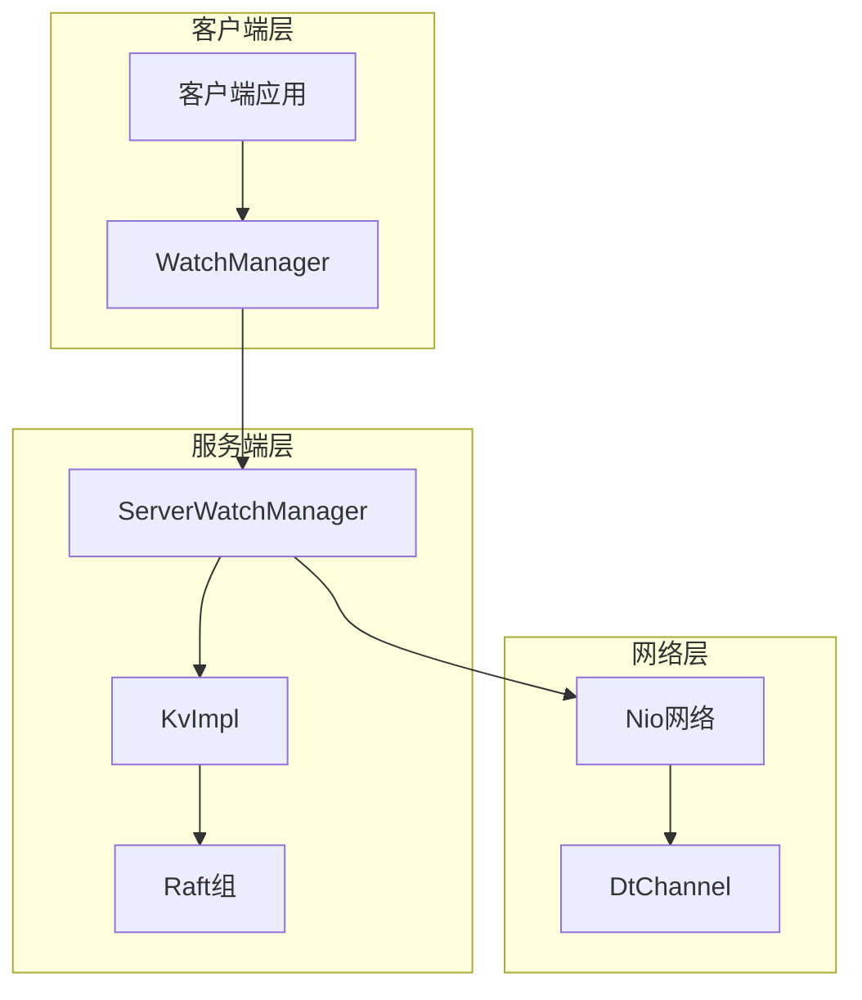
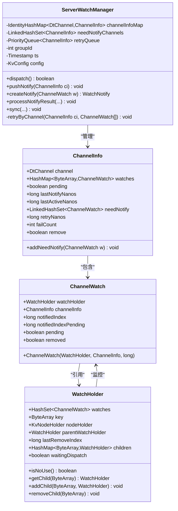
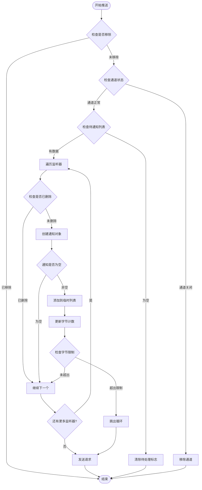
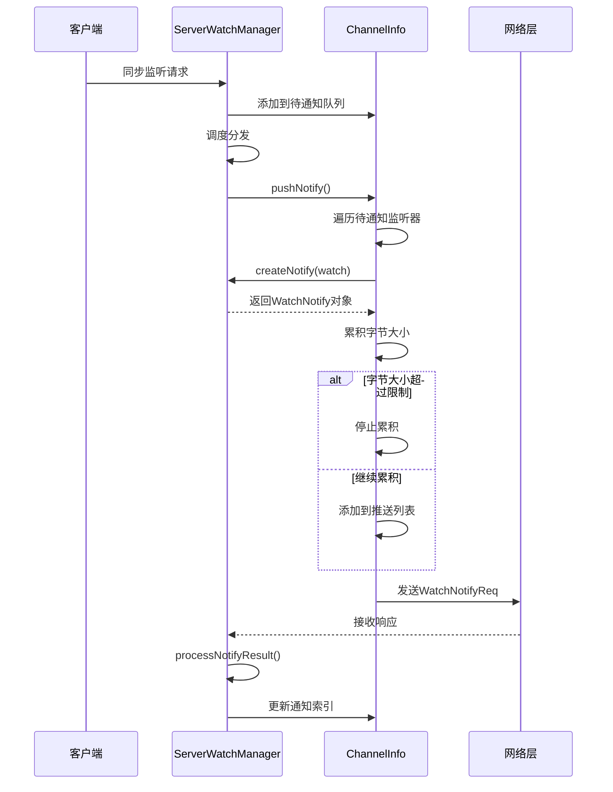
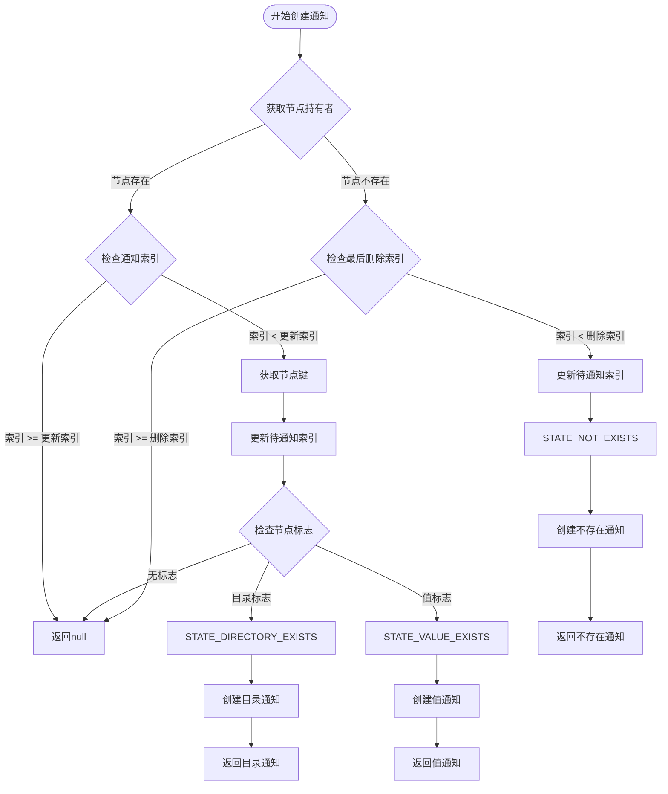
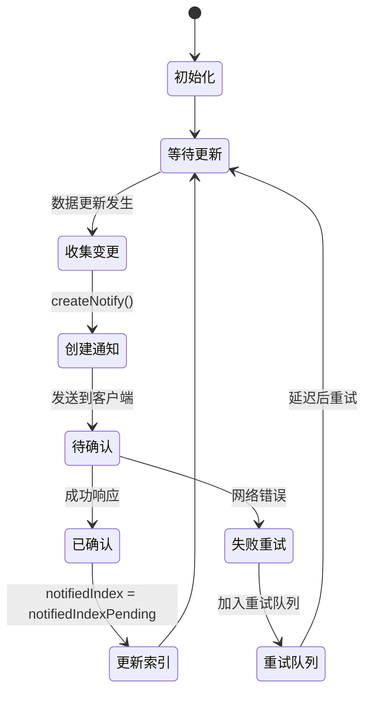
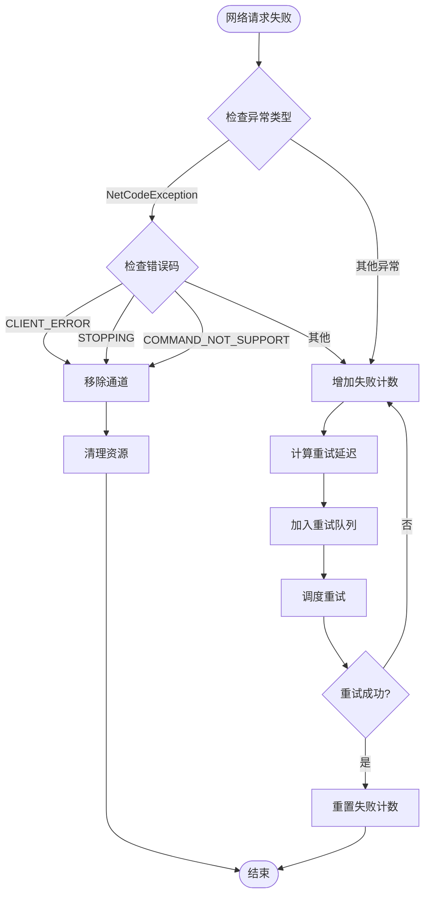
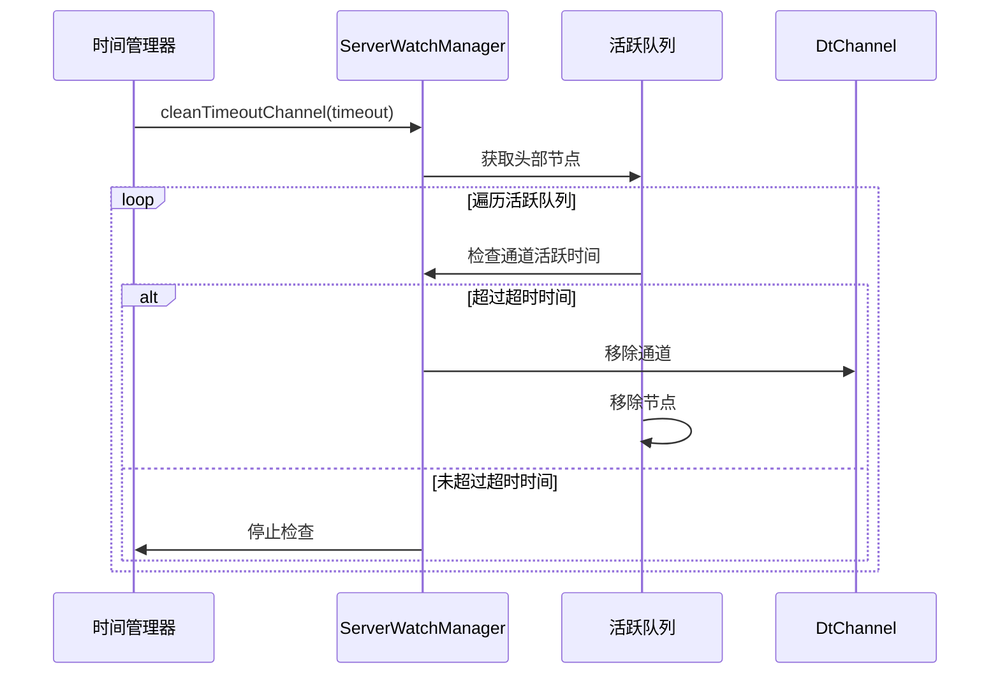
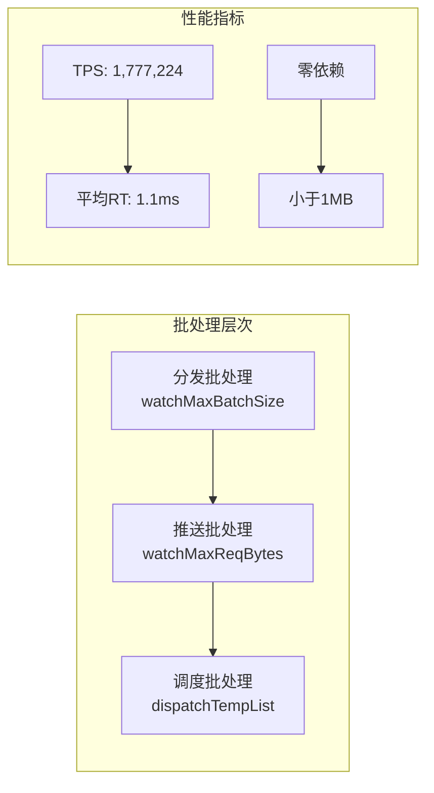

# 通知推送流程技术文档

<cite>
**本文档中引用的文件**
- [ServerWatchManager.java](file://server/src/main/java/com/github/dtprj/dongting/dtkv/server/ServerWatchManager.java)
- [WatchEvent.java](file://client/src/main/java/com/github/dtprj/dongting/dtkv/WatchEvent.java)
- [WatchNotify.java](file://client/src/main/java/com/github/dtprj/dongting/dtkv/WatchNotify.java)
- [WatchNotifyReq.java](file://client/src/main/java/com/github/dtprj/dongting/dtkv/WatchNotifyReq.java)
- [KvConfig.java](file://server/src/main/java/com/github/dtprj/dongting/dtkv/server/KvConfig.java)
- [ServerWatchManagerTest.java](file://server/src/test/java/com/github/dtprj/dongting/dtkv/server/ServerWatchManagerTest.java)
- [README.md](file://README.md)
</cite>

## 目录
1. [简介](#简介)
2. [系统架构概览](#系统架构概览)
3. [核心组件分析](#核心组件分析)
4. [通知推送流程详解](#通知推送流程详解)
5. [事件类型与状态管理](#事件类型与状态管理)
6. [降级策略与错误处理](#降级策略与错误处理)
7. [性能优化机制](#性能优化机制)
8. [故障排除指南](#故障排除指南)
9. [总结](#总结)

## 简介

Dongting是一个高性能的分布式引擎，集成了RAFT共识算法、配置服务器、消息队列和底层RPC功能。本文档专注于分析其通知推送流程，详细阐述了`pushNotify()`方法如何构建通知消息、控制单次推送的数据量（通过`watchMaxReqBytes`配置），以及处理网络异常时的降级策略。

该系统的核心是基于观察者模式的通知机制，允许客户端订阅键值变化并实时接收更新通知。通过精心设计的推送策略和状态管理机制，确保了高可用性和性能表现。

## 系统架构概览



**图表来源**
- [ServerWatchManager.java](file://server/src/main/java/com/github/dtprj/dongting/dtkv/server/ServerWatchManager.java#L1-L50)
- [KvConfig.java](file://server/src/main/java/com/github/dtprj/dongting/dtkv/server/KvConfig.java#L1-L29)

**章节来源**
- [ServerWatchManager.java](file://server/src/main/java/com/github/dtprj/dongting/dtkv/server/ServerWatchManager.java#L1-L731)
- [README.md](file://README.md#L1-L134)

## 核心组件分析

### ServerWatchManager类

`ServerWatchManager`是通知推送流程的核心控制器，负责管理所有客户端连接和通知分发。它维护着活跃通道队列、待通知通道集合和重试队列。



**图表来源**
- [ServerWatchManager.java](file://server/src/main/java/com/github/dtprj/dongting/dtkv/server/ServerWatchManager.java#L45-L731)

### 配置参数

系统通过`KvConfig`类提供可配置的参数，其中关键的推送控制参数包括：

- `watchMaxReqBytes`: 单次推送的最大字节数，默认为80KB
- `watchMaxBatchSize`: 批处理大小，默认为100个通知
- `watchDispatchIntervalMillis`: 分发间隔，默认为500毫秒

**章节来源**
- [ServerWatchManager.java](file://server/src/main/java/com/github/dtprj/dongting/dtkv/server/ServerWatchManager.java#L45-L75)
- [KvConfig.java](file://server/src/main/java/com/github/dtprj/dongting/dtkv/server/KvConfig.java#L1-L29)

## 通知推送流程详解

### pushNotify()方法深度解析

`pushNotify()`方法是通知推送流程的核心，负责从待通知队列中提取通知并发送给客户端。



**图表来源**
- [ServerWatchManager.java](file://server/src/main/java/com/github/dtprj/dongting/dtkv/server/ServerWatchManager.java#L285-L350)

#### 关键实现细节

1. **通道状态检查**: 在推送前验证通道是否仍然打开，自动清理断开的连接
2. **批量限制**: 使用`watchMaxReqBytes`控制单次推送的数据量，防止网络拥塞
3. **临时列表管理**: 使用预分配的临时列表减少垃圾回收压力
4. **异常处理**: 捕获运行时异常并进行适当的降级处理

### 数据流控制机制



**图表来源**
- [ServerWatchManager.java](file://server/src/main/java/com/github/dtprj/dongting/dtkv/server/ServerWatchManager.java#L285-L350)
- [WatchNotifyReq.java](file://client/src/main/java/com/github/dtprj/dongting/dtkv/WatchNotifyReq.java#L37-L75)

**章节来源**
- [ServerWatchManager.java](file://server/src/main/java/com/github/dtprj/dongting/dtkv/server/ServerWatchManager.java#L285-L350)

## 事件类型与状态管理

### createNotify()方法分析

`createNotify()`方法根据节点状态生成不同类型的事件通知，这是通知系统的核心逻辑之一。



**图表来源**
- [ServerWatchManager.java](file://server/src/main/java/com/github/dtprj/dongting/dtkv/server/ServerWatchManager.java#L352-L385)

#### 事件类型详解

系统支持三种主要的事件类型：

1. **STATE_NOT_EXISTS (0)**: 键不存在的状态通知
2. **STATE_VALUE_EXISTS (1)**: 键存在且包含值的状态通知
3. **STATE_DIRECTORY_EXISTS (2)**: 目录存在的状态通知

每种事件类型都携带相应的元数据：
- `raftIndex`: Raft日志条目的索引
- `state`: 事件类型标识符
- `key`: 触发事件的键名
- `value`: 对应的键值（仅在值存在时）

### 版本号机制

系统通过`notifiedIndex`和`notifiedIndexPending`两个版本号字段实现幂等通知：



**图表来源**
- [ServerWatchManager.java](file://server/src/main/java/com/github/dtprj/dongting/dtkv/server/ServerWatchManager.java#L352-L385)

**章节来源**
- [ServerWatchManager.java](file://server/src/main/java/com/github/dtprj/dongting/dtkv/server/ServerWatchManager.java#L352-L385)
- [WatchEvent.java](file://client/src/main/java/com/github/dtprj/dongting/dtkv/WatchEvent.java#L1-L41)

## 降级策略与错误处理

### 网络异常处理机制

系统实现了多层次的降级策略来应对网络异常：



**图表来源**
- [ServerWatchManager.java](file://server/src/main/java/com/github/dtprj/dongting/dtkv/server/ServerWatchManager.java#L407-L435)

#### 重试策略

系统采用指数退避的重试策略：

- 第1次失败：1秒后重试
- 第2次失败：10秒后重试  
- 第3次失败：30秒后重试
- 第4次及以后：60秒后重试

这种策略平衡了系统可用性和网络负载。

### 超时处理机制



**图表来源**
- [ServerWatchManager.java](file://server/src/main/java/com/github/dtprj/dongting/dtkv/server/ServerWatchManager.java#L680-L690)

**章节来源**
- [ServerWatchManager.java](file://server/src/main/java/com/github/dtprj/dongting/dtkv/server/ServerWatchManager.java#L407-L435)
- [ServerWatchManager.java](file://server/src/main/java/com/github/dtprj/dongting/dtkv/server/ServerWatchManager.java#L680-L690)

## 性能优化机制

### 批量处理优化

系统通过多个维度的批量处理来提升性能：

1. **分发批处理**: `watchMaxBatchSize`控制每次分发的最大监听器数量
2. **推送批处理**: 控制单次推送的通知数量和字节大小
3. **调度批处理**: 限制同时处理的通道数量



**图表来源**
- [KvConfig.java](file://server/src/main/java/com/github/dtprj/dongting/dtkv/server/KvConfig.java#L20-L25)

### 内存管理优化

系统采用了多种内存优化策略：

- **预分配临时列表**: 减少频繁的内存分配和垃圾回收
- **对象池化**: 重用通知对象和缓冲区
- **弱引用管理**: 避免内存泄漏

### 网络优化

- **异步I/O**: 使用NIO实现非阻塞网络通信
- **连接复用**: 多个监听器共享同一网络连接
- **压缩传输**: Protocol Buffers序列化减少网络开销

**章节来源**
- [ServerWatchManager.java](file://server/src/main/java/com/github/dtprj/dongting/dtkv/server/ServerWatchManager.java#L60-L75)
- [README.md](file://README.md#L25-L45)

## 故障排除指南

### 常见问题诊断

#### 1. 通知丢失问题

**症状**: 客户端没有收到预期的通知

**排查步骤**:
1. 检查`notifiedIndex`是否正确更新
2. 验证通道是否处于活跃状态
3. 确认网络连接是否正常
4. 检查是否有重试队列堆积

**解决方案**:
```java
// 检查通知索引
if (watch.notifiedIndex >= node.updateIndex) {
    // 可能需要重新同步
    manager.sync(kv, channel, false, new ByteArray[]{key}, new long[]{0});
}
```

#### 2. 性能问题

**症状**: 通知延迟过高或吞吐量不足

**排查步骤**:
1. 检查`watchMaxReqBytes`设置是否合理
2. 监控重试队列长度
3. 分析网络延迟
4. 检查系统资源使用情况

**优化建议**:
- 调整`watchMaxReqBytes`以适应网络带宽
- 增加`watchMaxBatchSize`提高批处理效率
- 优化网络配置减少延迟

#### 3. 内存泄漏

**症状**: 系统内存持续增长

**排查步骤**:
1. 检查通道信息映射表大小
2. 监控临时列表使用情况
3. 分析监听器数量

**预防措施**:
- 定期清理断开的连接
- 限制最大监听器数量
- 实施内存监控告警

### 调试工具和技巧

#### 日志分析

系统提供了详细的日志记录，可以通过以下关键词进行调试：
- `notify failed`: 通知发送失败
- `retryByChannel`: 通道重试机制
- `removeByChannel`: 通道移除操作
- `processNotifyResult`: 结果处理过程

#### 性能监控

关键性能指标包括：
- 通知延迟分布
- 重试成功率
- 连接活跃率
- 内存使用情况

**章节来源**
- [ServerWatchManagerTest.java](file://server/src/test/java/com/github/dtprj/dongting/dtkv/server/ServerWatchManagerTest.java#L600-L700)

## 总结

Dongting的通知推送流程是一个高度优化的系统，通过精心设计的架构和算法实现了高性能、高可靠性的通知服务。主要特点包括：

### 核心优势

1. **高性能推送**: 支持高达177万TPS的推送能力
2. **智能限流**: 通过`watchMaxReqBytes`控制推送大小，避免网络拥塞
3. **健壮的降级**: 多层次的错误处理和重试机制
4. **幂等保证**: 通过版本号机制避免重复通知
5. **零依赖设计**: 不依赖第三方库，部署简单

### 技术创新

- **事件驱动架构**: 基于观察者模式的实时通知系统
- **批处理优化**: 多层次的批处理提升系统吞吐量
- **指数退避**: 智能的重试策略平衡系统可用性
- **内存池化**: 减少垃圾回收压力，提升性能稳定性

### 应用场景

该通知推送系统特别适用于：
- 实时数据同步场景
- 分布式系统状态监控
- 高并发事件通知
- 低延迟数据更新

通过深入理解这些机制，开发者可以更好地利用Dongting的通知推送功能，构建高性能的分布式应用程序。