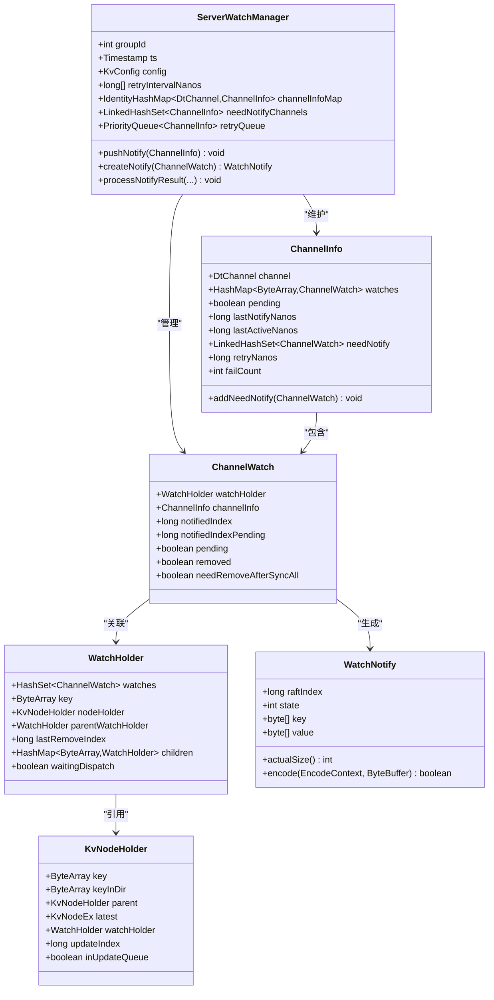
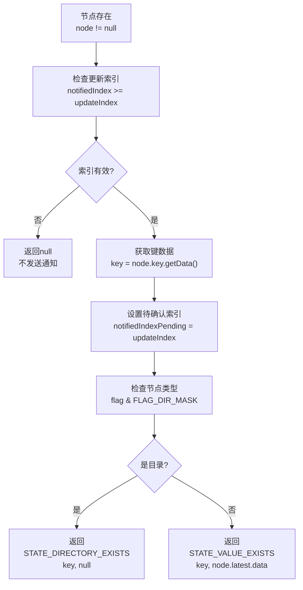
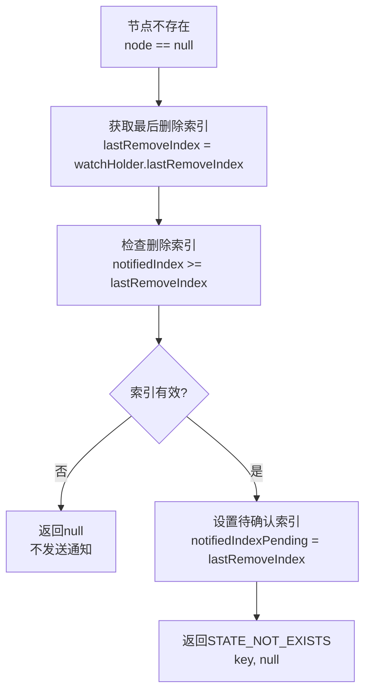
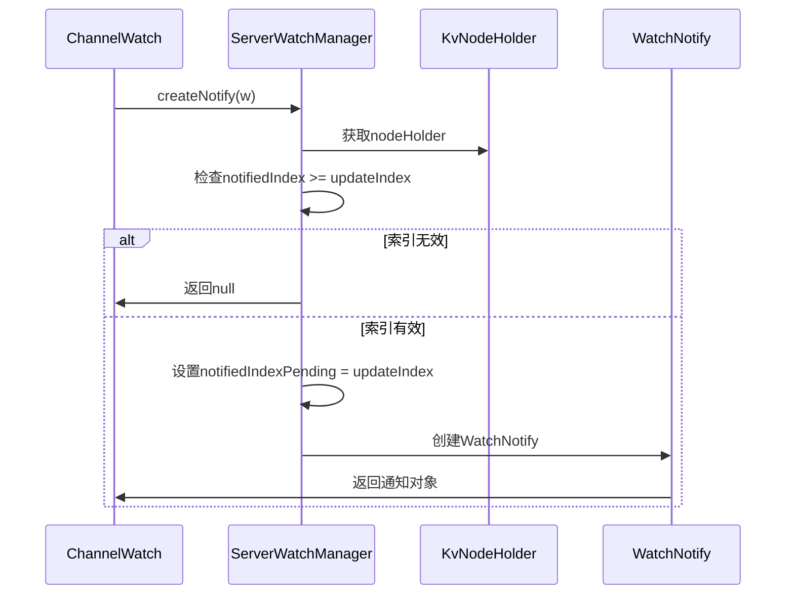
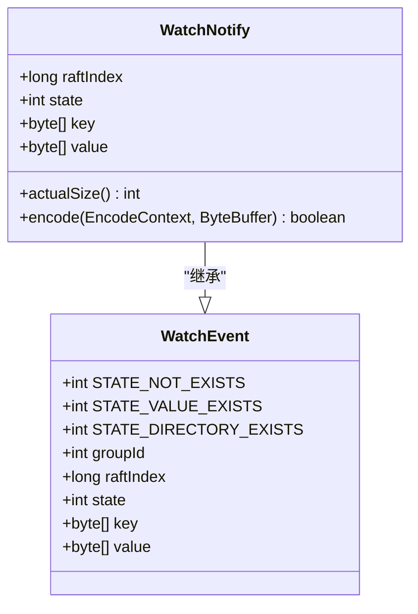
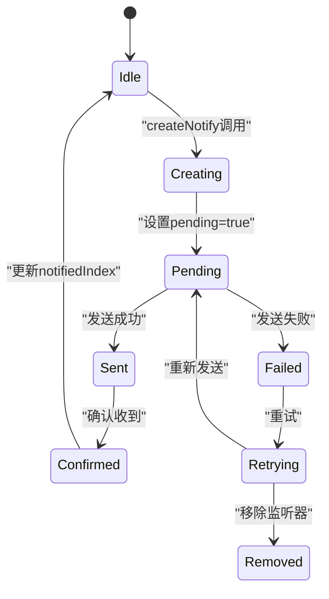

# 通知消息构建技术文档

<cite>
**本文档引用的文件**
- [ServerWatchManager.java](file://server/src/main/java/com/github/dtprj/dongting/dtkv/server/ServerWatchManager.java)
- [WatchNotify.java](file://client/src/main/java/com/github/dtprj/dongting/dtkv/WatchNotify.java)
- [KvNodeHolder.java](file://server/src/main/java/com/github/dtprj/dongting/dtkv/server/KvNodeHolder.java)
- [KvNodeEx.java](file://server/src/main/java/com/github/dtprj/dongting/dtkv/server/KvNodeEx.java)
- [WatchEvent.java](file://client/src/main/java/com/github/dtprj/dongting/dtkv/WatchEvent.java)
- [ChannelWatch.java](file://server/src/main/java/com/github/dtprj/dongting/dtkv/server/ServerWatchManager.java#L590-L610)
- [WatchNotifyReq.java](file://client/src/main/java/com/github/dtprj/dongting/dtkv/WatchNotifyReq.java)
- [ServerWatchManagerTest.java](file://server/src/test/java/com/github/dtprj/dongting/dtkv/server/ServerWatchManagerTest.java)
</cite>

## 目录
1. [概述](#概述)
2. [核心组件架构](#核心组件架构)
3. [createNotify方法详解](#createnotify方法详解)
4. [状态类型分析](#状态类型分析)
5. [索引比较机制](#索引比较机制)
6. [数据提取过程](#数据提取过程)
7. [消息构造逻辑](#消息构造逻辑)
8. [版本一致性保证](#版本一致性保证)
9. [性能考虑](#性能考虑)
10. [故障排除指南](#故障排除指南)
11. [总结](#总结)

## 概述

通知消息构建是Dongting分布式键值存储系统中的核心功能之一，负责根据KvNodeHolder的状态生成不同类型的WatchNotify事件。该系统通过`createNotify()`方法实现了对节点状态变化的实时监控和通知，支持三种主要状态：`STATE_VALUE_EXISTS`（值存在）、`STATE_DIRECTORY_EXISTS`（目录存在）和`STATE_NOT_EXISTS`（不存在）。

系统采用基于索引的版本控制机制，通过`notifiedIndex`与`updateIndex`的比较来防止重复通知，并通过`notifiedIndexPending`暂存设计确保版本一致性。这种设计不仅保证了通知的准确性，还提供了高效的批量处理能力。

## 核心组件架构



**图表来源**
- [ServerWatchManager.java](file://server/src/main/java/com/github/dtprj/dongting/dtkv/server/ServerWatchManager.java#L46-L70)
- [ChannelWatch.java](file://server/src/main/java/com/github/dtprj/dongting/dtkv/server/ServerWatchManager.java#L590-L610)
- [KvNodeHolder.java](file://server/src/main/java/com/github/dtprj/dongting/dtkv/server/KvNodeHolder.java#L20-L40)

## createNotify方法详解

`createNotify()`方法是通知消息构建的核心，位于`ServerWatchManager`类中。该方法根据`ChannelWatch`的状态和关联的`KvNodeHolder`信息生成相应的`WatchNotify`对象。

```java
private WatchNotify createNotify(ChannelWatch w) {
    KvNodeHolder node = w.watchHolder.nodeHolder;
    if (node != null) {
        long updateIndex = node.latest.updateIndex;
        if (w.notifiedIndex >= updateIndex) {
            return null;
        }
        byte[] key = node.key.getData();
        w.notifiedIndexPending = updateIndex;
        // assert note.latest.removed == false
        if ((node.latest.flag & KvNode.FLAG_DIR_MASK) != 0) {
            return new WatchNotify(updateIndex, WatchEvent.STATE_DIRECTORY_EXISTS, key, null);
        } else {
            return new WatchNotify(updateIndex, WatchEvent.STATE_VALUE_EXISTS, key, node.latest.data);
        }
    } else {
        long lastRemoveIndex = w.watchHolder.lastRemoveIndex;
        if (w.notifiedIndex >= lastRemoveIndex) {
            return null;
        } else {
            w.notifiedIndexPending = lastRemoveIndex;
            return new WatchNotify(lastRemoveIndex, WatchEvent.STATE_NOT_EXISTS,
                    w.watchHolder.key.getData(), null);
        }
    }
}
```

**节来源**
- [ServerWatchManager.java](file://server/src/main/java/com/github/dtprj/dongting/dtkv/server/ServerWatchManager.java#L345-L372)

## 状态类型分析

系统支持三种主要的Watch事件状态：

### STATE_VALUE_EXISTS（值存在）
当节点是一个普通键值对时触发，包含键名和对应的值数据。



**图表来源**
- [ServerWatchManager.java](file://server/src/main/java/com/github/dtprj/dongting/dtkv/server/ServerWatchManager.java#L345-L360)

### STATE_DIRECTORY_EXISTS（目录存在）
当节点是一个目录时触发，只包含键名，值为null。

### STATE_NOT_EXISTS（不存在）
当节点被删除或不存在时触发，表示观察的键已被移除。



**图表来源**
- [ServerWatchManager.java](file://server/src/main/java/com/github/dtprj/dongting/dtkv/server/ServerWatchManager.java#L361-L372)

## 索引比较机制

索引比较机制是防止重复通知的关键。系统通过以下逻辑确保通知的唯一性：

1. **初始检查**：`w.notifiedIndex >= updateIndex`判断是否需要发送新通知
2. **版本控制**：使用`updateIndex`作为当前版本标识
3. **暂存机制**：`notifiedIndexPending`暂存即将确认的版本号



**图表来源**
- [ServerWatchManager.java](file://server/src/main/java/com/github/dtprj/dongting/dtkv/server/ServerWatchManager.java#L345-L372)

## 数据提取过程

数据提取过程涉及从多个层次获取必要的信息：

### 键数据提取
- **直接访问**：`node.key.getData()`获取原始字节数组
- **编码处理**：确保键数据在序列化过程中保持完整性

### 值数据提取
- **条件检查**：只有非目录节点才包含值数据
- **安全访问**：确保`node.latest.data`不为null

### 索引信息提取
- **更新索引**：`node.latest.updateIndex`记录最后一次修改
- **删除索引**：`watchHolder.lastRemoveIndex`记录最后一次删除

## 消息构造逻辑

消息构造遵循严格的协议格式，确保客户端能够正确解析：



**图表来源**
- [WatchNotify.java](file://client/src/main/java/com/github/dtprj/dongting/dtkv/WatchNotify.java#L25-L40)
- [WatchEvent.java](file://client/src/main/java/com/github/dtprj/dongting/dtkv/WatchEvent.java#L20-L30)

## 版本一致性保证

版本一致性通过以下机制保证：

### notifiedIndexPending暂存设计
- **临时存储**：在通知确认前暂存即将确认的版本号
- **原子操作**：确保索引更新的原子性
- **回滚保护**：如果通知失败，可以回滚到之前的版本

### 状态验证
- **断言检查**：`assert note.latest.removed == false`确保节点未被删除
- **状态同步**：通过`pending`标志位同步状态变更



## 性能考虑

### 批量处理优化
- **请求大小限制**：通过`watchMaxReqBytes`控制单次通知的最大字节数
- **批次大小控制**：使用`watchMaxBatchSize`限制同时处理的通知数量
- **内存池利用**：复用临时列表减少GC压力

### 网络传输优化
- **压缩编码**：使用Protocol Buffers进行高效编码
- **流式处理**：支持大容量通知的分块传输
- **连接复用**：通过ChannelInfo复用网络连接

### 内存管理
- **弱引用**：避免循环引用导致的内存泄漏
- **及时清理**：定期清理无用的监听器和通道信息
- **对象池**：复用频繁创建的对象实例

## 故障排除指南

### 常见问题诊断

#### 通知丢失问题
1. **检查索引比较**：确认`notifiedIndex`是否正确更新
2. **验证节点状态**：检查`KvNodeHolder`的`removed`标志
3. **网络连接状态**：确认通道是否正常打开

#### 性能问题排查
1. **监控通知频率**：检查通知发送的频率和数量
2. **分析内存使用**：监控临时对象的创建和回收
3. **网络延迟检测**：测量通知响应时间

#### 数据一致性问题
1. **索引版本检查**：验证`updateIndex`和`notifiedIndex`的一致性
2. **状态同步验证**：确认所有相关组件的状态同步
3. **错误日志分析**：检查异常情况下的处理逻辑

**节来源**
- [ServerWatchManager.java](file://server/src/main/java/com/github/dtprj/dongting/dtkv/server/ServerWatchManager.java#L374-L405)

## 总结

通知消息构建系统通过精心设计的架构和算法，实现了高效、可靠的状态变更通知机制。核心特性包括：

1. **多状态支持**：支持值存在、目录存在和不存在三种状态
2. **版本控制**：通过索引比较防止重复通知
3. **暂存机制**：使用`notifiedIndexPending`保证版本一致性
4. **批量处理**：优化网络传输和内存使用
5. **容错设计**：提供重试和错误恢复机制

该系统的设计充分考虑了分布式环境下的各种挑战，为上层应用提供了稳定可靠的通知服务。通过合理的架构设计和性能优化，系统能够在高并发场景下保持良好的性能表现。