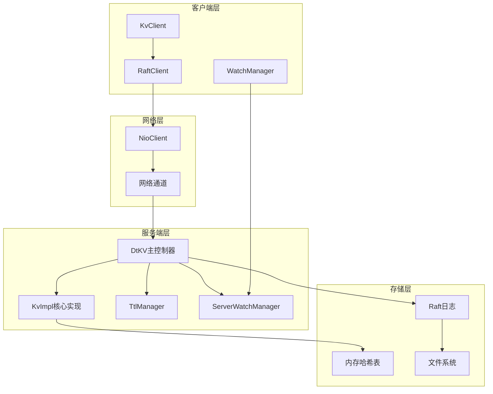
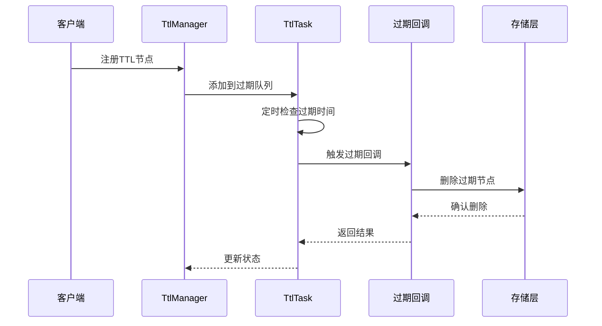
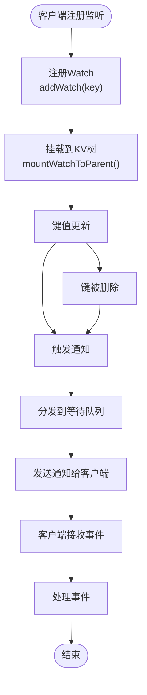
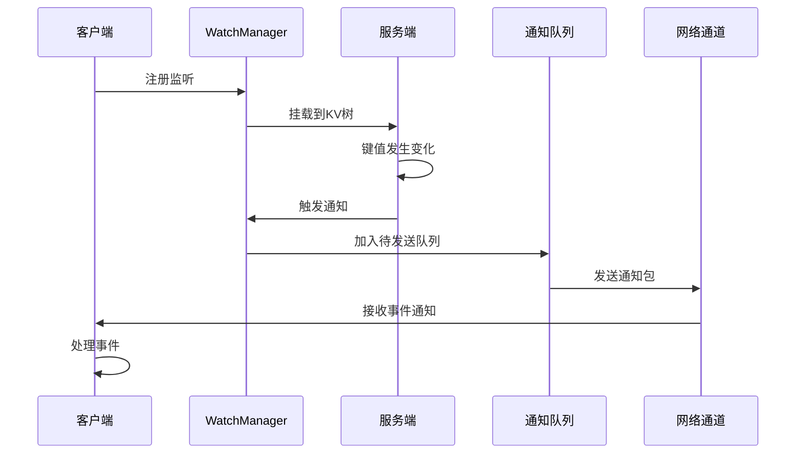

# 分布式KV存储（DtKV）

<cite>
**本文档中引用的文件**
- [KvClient.java](file://client/src/main/java/com/github/dtprj/dongting/dtkv/KvClient.java)
- [KvImpl.java](file://server/src/main/java/com/github/dtprj/dongting/dtkv/server/KvImpl.java)
- [TtlManager.java](file://server/src/main/java/com/github/dtprj/dongting/dtkv/server/TtlManager.java)
- [ServerWatchManager.java](file://server/src/main/java/com/github/dtprj/dongting/dtkv/server/ServerWatchManager.java)
- [KvCodes.java](file://client/src/main/java/com/github/dtprj/dongting/dtkv/KvCodes.java)
- [DtKV.java](file://server/src/main/java/com/github/dtprj/dongting/dtkv/server/DtKV.java)
- [KvProcessor.java](file://server/src/main/java/com/github/dtprj/dongting/dtkv/server/KvProcessor.java)
- [TtlDemoClient.java](file://demos/src/main/java/com/github/dtprj/dongting/demos/ttl/TtlDemoClient.java)
- [WatchDemoClient.java](file://demos/src/main/java/com/github/dtprj/dongting/demos/watch/WatchDemoClient.java)
- [README.md](file://README.md)
</cite>

## 目录
1. [简介](#简介)
2. [项目架构](#项目架构)
3. [核心API详解](#核心api详解)
4. [TTL过期功能](#ttl过期功能)
5. [Watch监听机制](#watch监听机制)
6. [性能特征与限制](#性能特征与限制)
7. [使用示例](#使用示例)
8. [故障排除指南](#故障排除指南)
9. [总结](#总结)

## 简介

DtKV是Dongting项目中的分布式键值存储系统，基于Raft共识算法实现高可用性和线性一致性。它提供了完整的键值存储功能，包括基本的PUT/GET/REMOVE操作、支持TTL的过期功能、CAS（Compare-And-Swap）原子操作、目录式的层级键管理和Watch机制（用于监听键的变更）。

DtKV的设计目标是提供高性能、低延迟的分布式键值存储服务，适用于配置管理、会话存储、缓存等多种应用场景。系统采用内存存储，结合Raft日志持久化，确保数据的一致性和可靠性。

## 项目架构



**图表来源**
- [KvClient.java](file://client/src/main/java/com/github/dtprj/dongting/dtkv/KvClient.java#L1-L50)
- [DtKV.java](file://server/src/main/java/com/github/dtprj/dongting/dtkv/server/DtKV.java#L1-L100)

**章节来源**
- [README.md](file://README.md#L1-L50)
- [KvClient.java](file://client/src/main/java/com/github/dtprj/dongting/dtkv/KvClient.java#L1-L100)

## 核心API详解

### 基本操作API

#### PUT操作
PUT操作用于向键值存储中添加或更新键值对。

```java
// 同步PUT操作
public long put(int groupId, byte[] key, byte[] value) 
    throws KvException, NetException;

// 异步PUT操作  
public void put(int groupId, byte[] key, byte[] value, 
    FutureCallback<Long> callback);
```

**使用场景：**
- 存储永久性配置信息
- 更新应用状态数据
- 缓存数据存储

**参数说明：**
- `groupId`: Raft组ID，用于标识不同的集群
- `key`: 键名，使用'.'作为路径分隔符
- `value`: 值内容，不能为空

**返回值：**
- 返回Raft索引号，通常在大多数情况下无实际用途
- 成功时抛出异常，包含具体的错误码

#### GET操作
GET操作用于从键值存储中获取指定键的值。

```java
// 同步GET操作
public KvNode get(int groupId, byte[] key) 
    throws NetException;

// 异步GET操作
public void get(int groupId, byte[] key, 
    FutureCallback<KvNode> callback);
```

**使用场景：**
- 获取配置信息
- 查询缓存数据
- 读取应用状态

**返回值：**
- 返回KvNode对象，包含值和元信息
- 如果键不存在，返回null

#### REMOVE操作
REMOVE操作用于删除指定的键值对。

```java
// 同步REMOVE操作
public long remove(int groupId, byte[] key) 
    throws KvException, NetException;

// 异步REMOVE操作
public void remove(int groupId, byte[] key, 
    FutureCallback<Long> callback);
```

**使用场景：**
- 删除配置信息
- 清理过期数据
- 释放资源

**特殊限制：**
- 只能删除由当前客户端创建的临时节点
- 不能删除非临时节点时会抛出NOT_TEMP_NODE异常

### 目录操作API

#### MKDIR操作
MKDIR操作用于创建目录结构。

```java
// 同步创建目录
public long mkdir(int groupId, byte[] key) 
    throws KvException, NetException;

// 异步创建目录
public void mkdir(int groupId, byte[] key, 
    FutureCallback<Long> callback);
```

**使用场景：**
- 创建命名空间
- 组织键值对层次结构
- 实现逻辑分组

**特点：**
- 目录只能包含子节点，不能直接存储数据
- 支持嵌套目录结构

#### LIST操作
LIST操作用于列出目录下的所有子节点。

```java
// 同步LIST操作
public List<KvResult> list(int groupId, byte[] key) 
    throws KvException, NetException;

// 异步LIST操作
public void list(int groupId, byte[] key, 
    FutureCallback<List<KvResult>> callback);
```

**使用场景：**
- 遍历目录结构
- 获取配置树
- 监控节点变化

### 批量操作API

#### BATCH PUT操作
批量PUT操作可以同时存储多个键值对。

```java
// 同步批量PUT
public KvResp batchPut(int groupId, List<byte[]> keys, 
    List<byte[]> values) throws NetException;

// 异步批量PUT
public void batchPut(int groupId, List<byte[]> keys, 
    List<byte[]> values, FutureCallback<KvResp> callback);
```

**优势：**
- 减少网络往返次数
- 提高写入吞吐量
- 支持事务性操作

#### BATCH GET操作
批量GET操作可以同时获取多个键的值。

```java
// 同步批量GET
public List<KvNode> batchGet(int groupId, List<byte[]> keys) 
    throws NetException;

// 异步批量GET
public void batchGet(int groupId, List<byte[]> keys, 
    FutureCallback<List<KvNode>> callback);
```

#### BATCH REMOVE操作
批量REMOVE操作可以同时删除多个键。

```java
// 同步批量REMOVE
public KvResp batchRemove(int groupId, List<byte[]> keys) 
    throws NetException;

// 异步批量REMOVE
public void batchRemove(int groupId, List<byte[]> keys, 
    FutureCallback<KvResp> callback);
```

### CAS原子操作

#### Compare-And-Swap操作
CAS操作提供了原子性的条件更新。

```java
// 同步CAS操作
public boolean compareAndSet(int groupId, byte[] key, 
    byte[] expectValue, byte[] newValue) throws NetException;

// 异步CAS操作
public void compareAndSet(int groupId, byte[] key, 
    byte[] expectValue, byte[] newValue, 
    FutureCallback<Pair<Long, Integer>> callback);
```

**使用场景：**
- 实现乐观锁
- 原子性更新计数器
- 条件性状态变更

**参数说明：**
- `expectValue`: 期望的旧值，null表示键不存在
- `newValue`: 新的值，null表示删除键

**返回值：**
- 返回布尔值表示操作是否成功
- 异常情况抛出KvException

**章节来源**
- [KvClient.java](file://client/src/main/java/com/github/dtprj/dongting/dtkv/KvClient.java#L178-L749)

## TTL过期功能

### TTL概述

TTL（Time To Live）功能允许为键值对设置生存时间，到期后自动删除。这是分布式系统中实现缓存和临时数据管理的重要特性。



**图表来源**
- [TtlManager.java](file://server/src/main/java/com/github/dtprj/dongting/dtkv/server/TtlManager.java#L1-L100)

### TTL管理器工作原理

TtlManager负责管理所有具有生存时间的键值对，其核心功能包括：

#### 数据结构设计
```java
class TtlManager {
    final TreeSet<TtlInfo> ttlQueue = new TreeSet<>();      // 主要过期队列
    final TreeSet<TtlInfo> pendingQueue = new TreeSet<>();  // 待处理队列
    final TtlTask task;                                     // 过期任务
}
```

#### 过期策略
1. **定时扫描**: 每秒检查一次过期队列
2. **批量处理**: 单次最多处理50个过期项
3. **重试机制**: 失败的操作会被重新加入待处理队列
4. **指数退避**: 最多重试10次，每次间隔1秒

#### 关键方法解析

##### 初始化TTL
```java
public void initTtl(long raftIndex, ByteArray key, KvNodeEx n, 
                   KvImpl.OpContext ctx) {
    if (ctx.ttlMillis <= 0) {
        return;
    }
    if (addNodeTtlAndAddToQueue(raftIndex, key, n, ctx)) {
        task.signal();
    }
}
```

##### 更新TTL
```java
public void updateTtl(long raftIndex, ByteArray key, KvNodeEx newNode, 
                     KvImpl.OpContext ctx) {
    if (ctx.ttlMillis <= 0) {
        return;
    }
    TtlInfo ttlInfo = newNode.ttlInfo;
    if (ttlInfo == null) {
        return;
    }
    if (ttlInfo.raftIndex >= raftIndex) {
        return;
    }
    doRemove(ttlInfo);
    if (addNodeTtlAndAddToQueue(raftIndex, key, newNode, ctx)) {
        task.signal();
    }
}
```

### TTL使用示例

#### 创建临时节点
```java
// 创建带TTL的临时节点
long ttlMillis = 3000; // 3秒过期
kvClient.putTemp(GROUP_ID, "tempKey1".getBytes(), 
                "tempValue1".getBytes(), ttlMillis);

// 异步创建
kvClient.putTemp(GROUP_ID, "tempKey2".getBytes(),
                "tempValue2".getBytes(), ttlMillis, callback);
```

#### 更新TTL
```java
// 更新现有临时节点的TTL
long newTtlMillis = 60000; // 60秒过期
kvClient.updateTtl(GROUP_ID, "tempKey1".getBytes(), newTtlMillis);
```

#### 临时目录
```java
// 创建临时目录
kvClient.makeTempDir(GROUP_ID, "tempDir".getBytes(), ttlMillis);
```

**章节来源**
- [TtlManager.java](file://server/src/main/java/com/github/dtprj/dongting/dtkv/server/TtlManager.java#L1-L242)
- [TtlDemoClient.java](file://demos/src/main/java/com/github/dtprj/dongting/demos/ttl/TtlDemoClient.java#L1-L58)

## Watch监听机制

### Watch概述

Watch机制允许客户端监听特定键或目录的变化，当被监听的键发生修改、删除或新增时，客户端会收到相应的通知事件。



**图表来源**
- [ServerWatchManager.java](file://server/src/main/java/com/github/dtprj/dongting/dtkv/server/ServerWatchManager.java#L1-L200)

### WatchManager工作原理

#### 监听器注册
```java
// 注册监听器
kvClient.getWatchManager().setListener(WatchDemoClient::onUpdate, 
                                      Executors.newSingleThreadExecutor());

// 添加监听
kvClient.getWatchManager().addWatch(GROUP_ID, "key1".getBytes(), 
                                   "dir1".getBytes());
```

#### 事件类型
WatchEvent定义了三种主要的事件类型：

1. **STATE_NOT_EXISTS**: 键不存在
2. **STATE_VALUE_EXISTS**: 键存在且有值
3. **STATE_DIRECTORY_EXISTS**: 目录存在

#### 事件处理流程



**图表来源**
- [ServerWatchManager.java](file://server/src/main/java/com/github/dtprj/dongting/dtkv/server/ServerWatchManager.java#L200-L400)

### WatchManager内部实现

#### 核心数据结构
```java
class ServerWatchManager {
    private final IdentityHashMap<DtChannel, ChannelInfo> channelInfoMap;
    private final LinkedHashSet<ChannelInfo> needNotifyChannels;
    private final PriorityQueue<ChannelInfo> retryQueue;
    
    // 监听持有者
    class WatchHolder {
        final HashSet<ChannelWatch> watches = new HashSet<>();
        ByteArray key;
        KvNodeHolder nodeHolder;
        WatchHolder parentWatchHolder;
        long lastRemoveIndex;
    }
}
```

#### 通知调度机制
1. **批量处理**: 单次最多处理64个通知
2. **流量控制**: 每个连接最多发送1MB的数据
3. **重试机制**: 失败的通知会进入重试队列
4. **优先级队列**: 根据重试时间排序

#### 错误处理
```java
private void retryByChannel(ChannelInfo ci, List<ChannelWatch> watches) {
    ci.failCount++;
    int idx = Math.min(ci.failCount - 1, retryIntervalNanos.length - 1);
    ci.retryNanos = ts.nanoTime + retryIntervalNanos[idx];
    retryQueue.add(ci);
    for (int size = watches.size(), i = 0; i < size; i++) {
        ci.addNeedNotify(watches.get(i));
    }
}
```

### Watch使用示例

#### 基本监听
```java
public class WatchDemoClient extends DemoClientBase implements GroupId {
    
    public static void main(String[] args) throws Exception {
        // 初始化客户端
        kvClient = new KvClient();
        kvClient.getWatchManager().setListener(WatchDemoClient::onUpdate, 
                                              Executors.newSingleThreadExecutor());
        
        // 创建测试数据
        kvClient.put(GROUP_ID, "key1".getBytes(), "key1_v1".getBytes());
        kvClient.mkdir(GROUP_ID, "dir1".getBytes());
        
        // 添加监听
        kvClient.getWatchManager().addWatch(GROUP_ID, "key1".getBytes(), 
                                           "dir1".getBytes());
        
        // 修改数据触发通知
        kvClient.put(GROUP_ID, "key1".getBytes(), "key1_v2".getBytes());
        kvClient.put(GROUP_ID, "dir1.key2".getBytes(), "key2_v1".getBytes());
    }
    
    private static void onUpdate(WatchEvent event) {
        System.out.println("--------------------------");
        String key = new String(event.key);
        switch (event.state) {
            case WatchEvent.STATE_NOT_EXISTS:
                System.out.println("键已删除: " + key);
                break;
            case WatchEvent.STATE_VALUE_EXISTS:
                System.out.println("键值更新: " + key + "=" + new String(event.value));
                break;
            case WatchEvent.STATE_DIRECTORY_EXISTS:
                System.out.println("目录存在: " + key);
                break;
        }
    }
}
```

#### 监听目录变化
```java
// 监听整个目录的变化
kvClient.getWatchManager().addWatch(GROUP_ID, "config".getBytes());

// 当目录下任何键发生变化时都会收到通知
kvClient.put(GROUP_ID, "config.user.name".getBytes(), "Alice".getBytes());
kvClient.put(GROUP_ID, "config.db.host".getBytes(), "localhost".getBytes());
```

**章节来源**
- [ServerWatchManager.java](file://server/src/main/java/com/github/dtprj/dongting/dtkv/server/ServerWatchManager.java#L1-L731)
- [WatchDemoClient.java](file://demos/src/main/java/com/github/dtprj/dongting/demos/watch/WatchDemoClient.java#L1-L90)

## 性能特征与限制

### 性能特征

#### 吞吐量表现
根据项目文档中的基准测试结果：

| 测试场景 | 1服务器 | 3服务器集群 |
|----------|---------|-------------|
| 同步写入 | 704,900 TPS | 272,540 TPS |
| 异步写入 | 1,777,224 TPS | 903,760 TPS |

#### 延迟特征
- 平均响应时间：1.1ms - 2.8ms
- 写入延迟：2.2ms - 7.3ms
- 读取延迟：1.1ms - 2.8ms

### 内存使用

#### 客户端内存
- 最大键大小：8KB
- 最大值大小：1MB
- 连接池大小：可配置
- 缓冲区池：两级缓冲池优化

#### 服务端内存
```java
// 默认配置
int initCapacity = 16;
float loadFactor = 0.75f;
```

### 网络特性

#### 连接管理
- 使用NIO异步网络模型
- 支持长连接复用
- 自动重连机制
- 超时控制

#### 协议设计
- 基于Protobuf序列化
- 支持流式传输
- 错误码标准化
- 版本兼容性

### 限制与约束

#### 键值限制
- 键最大长度：8KB
- 值最大长度：1MB
- 路径分隔符：使用'.'作为层级分隔符
- 不允许空键或空值

#### 并发限制
- 单个键的并发访问控制
- 批量操作的大小限制
- 监听器数量的限制
- 连接数的限制

#### 数据一致性
- 线性一致性保证
- Raft共识算法
- 强一致性读取
- 临时节点的所有权验证

**章节来源**
- [README.md](file://README.md#L20-L80)
- [KvClient.java](file://client/src/main/java/com/github/dtprj/dongting/dtkv/KvClient.java#L40-L60)

## 使用示例

### 基础使用示例

#### 初始化客户端
```java
// 创建客户端实例
KvClient kvClient = new KvClient();

// 设置超时时间
DtTime timeout = new DtTime(5, TimeUnit.SECONDS);

// 启动客户端
kvClient.start();

// 添加服务器节点
String servers = "1,127.0.0.1:5001";
kvClient.getRaftClient().clientAddNode(servers);

// 添加Raft组
kvClient.getRaftClient().clientAddOrUpdateGroup(GROUP_ID, new int[]{1});
```

#### 基本CRUD操作
```java
// PUT操作
kvClient.put(GROUP_ID, "user.name".getBytes(), "Alice".getBytes());

// GET操作
KvNode node = kvClient.get(GROUP_ID, "user.name".getBytes());
if (node != null) {
    String value = new String(node.data);
    System.out.println("用户名: " + value);
}

// REMOVE操作
kvClient.remove(GROUP_ID, "user.name".getBytes());
```

#### 批量操作
```java
// 批量PUT
List<byte[]> keys = Arrays.asList(
    "config.host".getBytes(),
    "config.port".getBytes(),
    "config.timeout".getBytes()
);
List<byte[]> values = Arrays.asList(
    "localhost".getBytes(),
    "8080".getBytes(),
    "5000".getBytes()
);
KvResp resp = kvClient.batchPut(GROUP_ID, keys, values);

// 批量GET
List<KvNode> nodes = kvClient.batchGet(GROUP_ID, keys);
for (KvNode node : nodes) {
    if (node != null) {
        System.out.println(new String(node.data));
    }
}
```

### 高级功能示例

#### TTL使用
```java
// 创建临时节点，30秒后过期
long ttlMillis = 30000;
kvClient.putTemp(GROUP_ID, "session.id".getBytes(), 
                "session_12345".getBytes(), ttlMillis);

// 更新TTL
kvClient.updateTtl(GROUP_ID, "session.id".getBytes(), 60000);

// 创建临时目录
kvClient.makeTempDir(GROUP_ID, "temp_data".getBytes(), 120000);
```

#### CAS操作
```java
// 条件更新：只有当值为"old_value"时才更新
boolean success = kvClient.compareAndSet(
    GROUP_ID, 
    "counter".getBytes(), 
    "old_value".getBytes(), 
    "new_value".getBytes()
);

// 删除条件：只有当键存在时才删除
success = kvClient.compareAndSet(
    GROUP_ID, 
    "config".getBytes(), 
    null, 
    null
);
```

#### 监听机制
```java
// 设置监听器
kvClient.getWatchManager().setListener((event) -> {
    switch (event.state) {
        case WatchEvent.STATE_VALUE_EXISTS:
            System.out.println("键值更新: " + 
                new String(event.key) + "=" + new String(event.value));
            break;
        case WatchEvent.STATE_NOT_EXISTS:
            System.out.println("键被删除: " + new String(event.key));
            break;
    }
}, Executors.newSingleThreadExecutor());

// 添加监听
kvClient.getWatchManager().addWatch(GROUP_ID, "config".getBytes());
```

### 错误处理示例

#### 异常处理
```java
try {
    // 执行操作
    kvClient.put(GROUP_ID, "test".getBytes(), "value".getBytes());
} catch (KvException e) {
    switch (e.getCode()) {
        case KvCodes.NOT_TEMP_NODE:
            System.out.println("只能操作临时节点");
            break;
        case KvCodes.NOT_OWNER:
            System.out.println("没有权限操作该节点");
            break;
        case KvCodes.NOT_FOUND:
            System.out.println("键不存在");
            break;
        default:
            System.out.println("其他错误: " + e.getMessage());
    }
} catch (NetException e) {
    System.out.println("网络错误: " + e.getMessage());
}
```

#### 超时处理
```java
DtTime timeout = new DtTime(10, TimeUnit.SECONDS);
try {
    kvClient.put(GROUP_ID, "test".getBytes(), "value".getBytes());
} catch (NetTimeoutException e) {
    System.out.println("请求超时: " + e.getMessage());
}
```

## 故障排除指南

### 常见错误码

#### 操作失败错误码
- `NOT_FOUND` (1): 键不存在
- `NOT_TEMP_NODE` (18): 尝试操作非临时节点
- `NOT_OWNER` (17): 没有权限操作该节点
- `CAS_MISMATCH` (13): CAS操作条件不匹配
- `PARENT_DIR_NOT_EXISTS` (8): 父目录不存在

#### 系统错误码
- `INVALID_KEY` (6): 键格式无效
- `KEY_TOO_LONG` (10): 键长度超过限制
- `VALUE_TOO_LONG` (11): 值长度超过限制
- `INSTALL_SNAPSHOT` (12): 正在安装快照

### 性能问题诊断

#### 吞吐量低
1. **检查网络连接**: 确保客户端与服务器之间的网络稳定
2. **调整批处理大小**: 增加批量操作的键数量
3. **监控CPU使用率**: 检查是否存在CPU瓶颈
4. **优化序列化**: 使用更高效的序列化方式

#### 延迟过高
1. **检查网络延迟**: 使用ping命令测试网络延迟
2. **减少数据大小**: 优化键值对的大小
3. **避免频繁小操作**: 使用批量操作替代多次小操作
4. **监控GC**: 检查是否存在频繁的垃圾回收

### 连接问题排查

#### 连接超时
```java
// 设置合理的超时时间
DtTime timeout = new DtTime(30, TimeUnit.SECONDS);

// 检查服务器状态
try {
    kvClient.get(GROUP_ID, "health_check".getBytes());
} catch (NetTimeoutException e) {
    System.out.println("服务器可能不可达");
}
```

#### 连接断开
1. **检查防火墙设置**: 确保端口开放
2. **监控服务器负载**: 检查服务器是否过载
3. **查看日志**: 分析服务器端的日志输出
4. **重连机制**: 实现自动重连逻辑

### 数据一致性问题

#### 观察不到最新数据
1. **检查Raft状态**: 确认当前节点是领导者
2. **等待同步完成**: 允许足够的时间让数据同步
3. **使用强一致性读取**: 确保读取的是最新的数据

#### 数据丢失
1. **检查快照机制**: 确认快照功能正常
2. **监控磁盘空间**: 确保有足够的存储空间
3. **检查日志完整性**: 验证Raft日志的完整性

**章节来源**
- [KvCodes.java](file://client/src/main/java/com/github/dtprj/dongting/dtkv/KvCodes.java#L1-L116)

## 总结

DtKV是一个功能完整、性能优异的分布式键值存储系统，具有以下核心特性：

### 主要优势

1. **高性能**: 支持百万级别TPS，毫秒级延迟
2. **线性一致性**: 基于Raft算法保证强一致性
3. **丰富的API**: 提供完整的CRUD操作和高级功能
4. **零依赖**: 不依赖第三方库，轻量级部署
5. **易于使用**: 简洁的API设计，丰富的示例代码

### 核心功能

- **基础操作**: PUT/GET/REMOVE/CAS原子操作
- **目录管理**: 层级化的键命名空间
- **批量操作**: 高效的批量CRUD操作
- **TTL过期**: 自动过期的临时数据管理
- **Watch监听**: 实时的键值变化通知
- **集群支持**: 多节点Raft集群部署

### 应用场景

- **配置管理**: 应用配置的集中存储和动态更新
- **会话存储**: 用户会话数据的临时存储
- **缓存系统**: 高性能的分布式缓存
- **元数据存储**: 系统元数据的可靠存储
- **消息队列**: 基于键值对的消息传递

### 发展方向

目前DtKV仍处于Alpha阶段，未来计划实现的功能包括：
- 分布式锁支持
- 消息队列功能
- 更多的性能优化
- 更完善的监控和运维工具

DtKV为开发者提供了一个强大而灵活的分布式键值存储解决方案，在正确使用的情况下能够满足大多数分布式系统的存储需求。