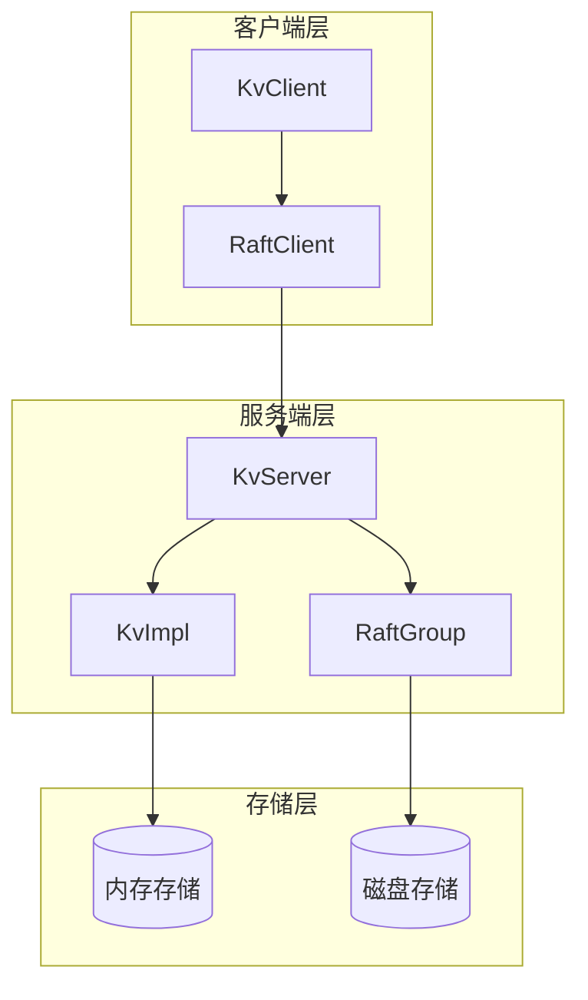
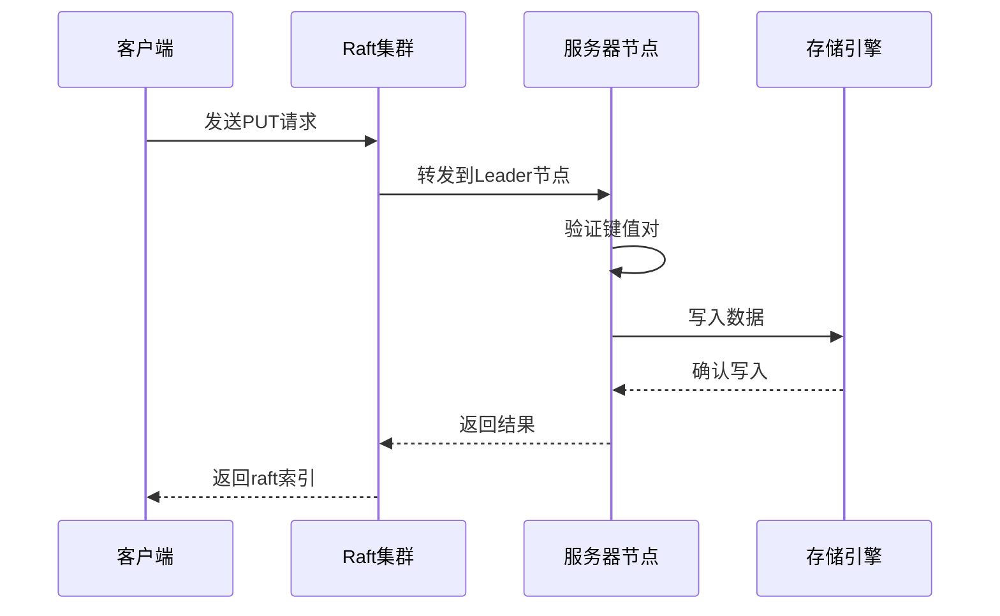
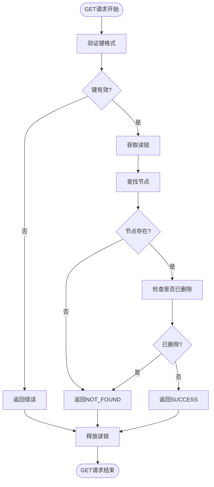
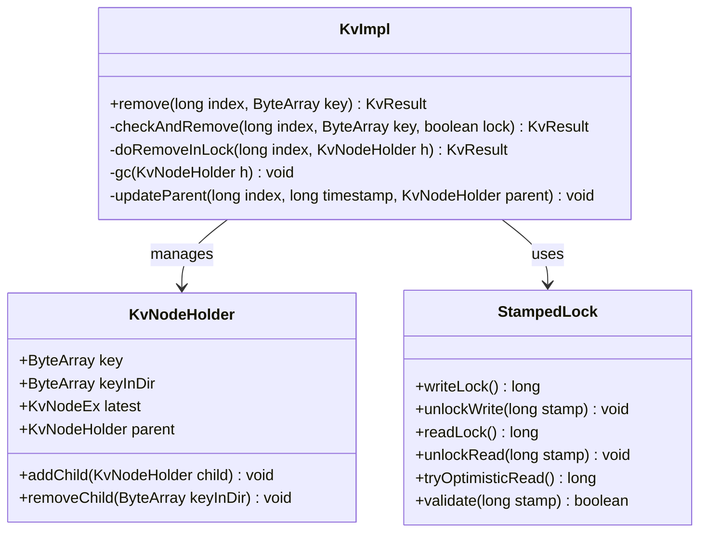
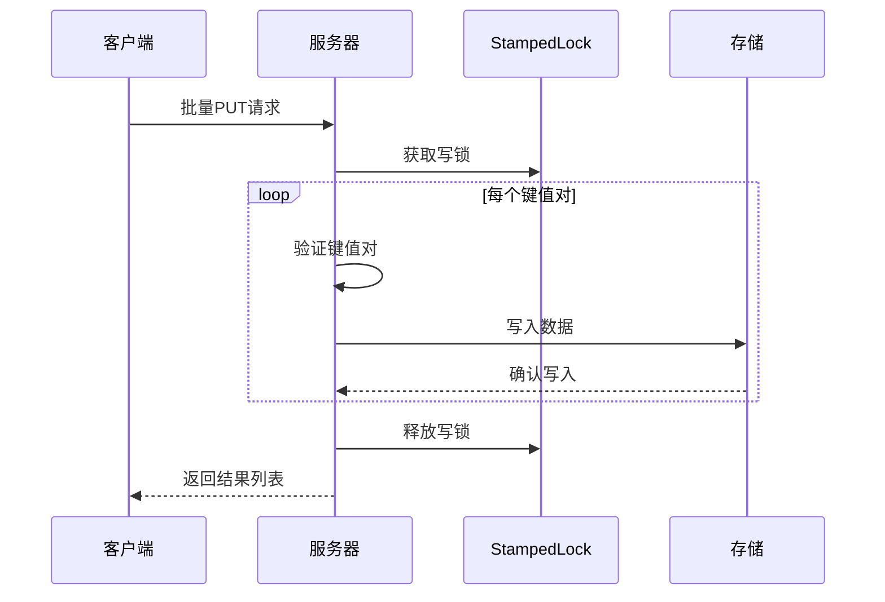
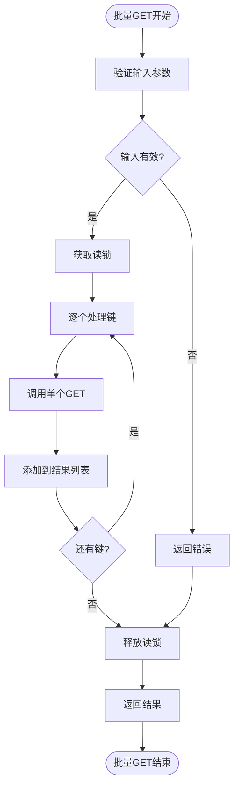
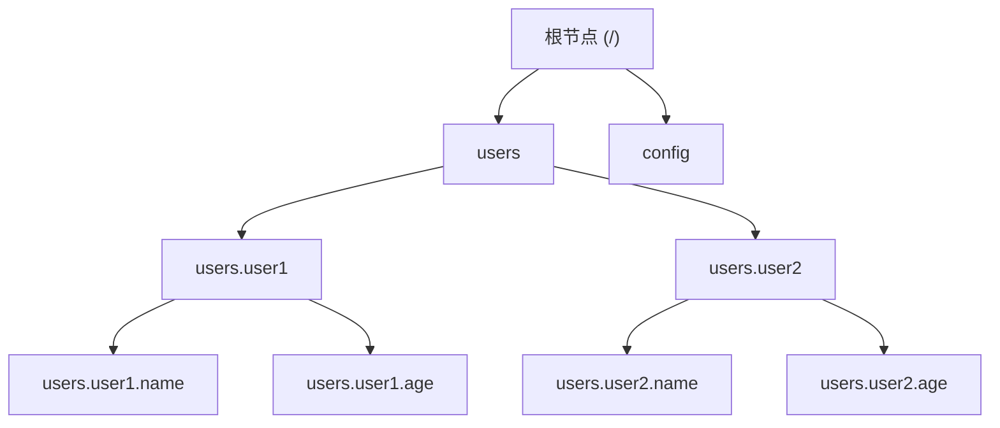
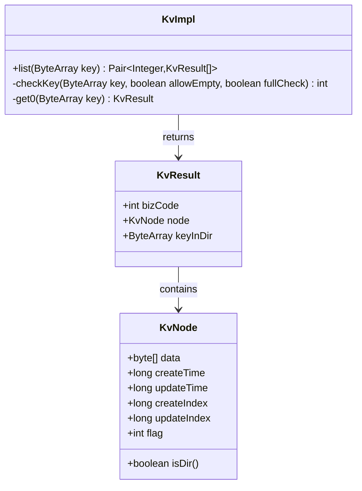
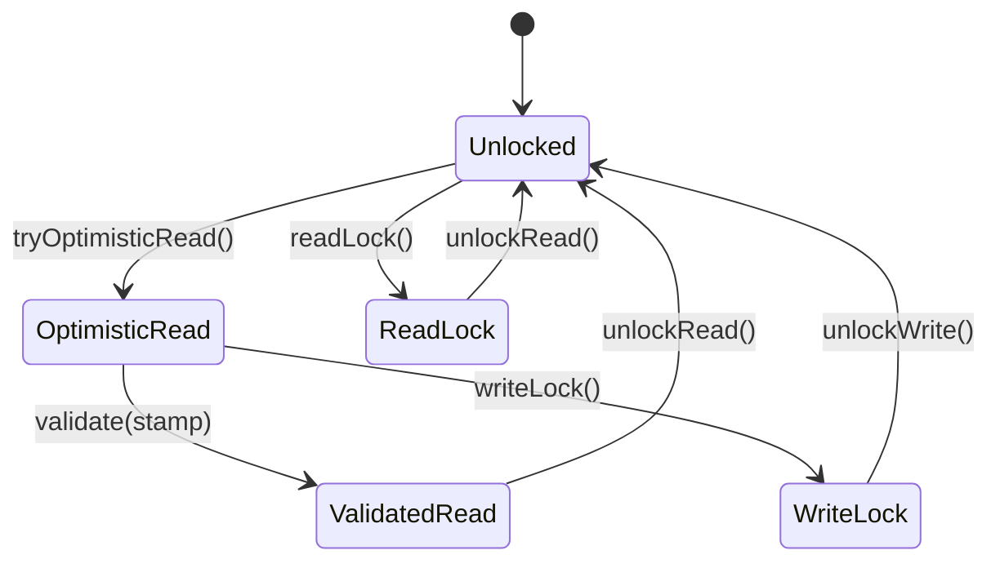

# 分布式KV存储基础操作

<cite>
**本文档引用的文件**
- [KvImpl.java](file://server/src/main/java/com/github/dtprj/dongting/dtkv/server/KvImpl.java)
- [KvClient.java](file://client/src/main/java/com/github/dtprj/dongting/dtkv/KvClient.java)
- [KvImplTest.java](file://server/src/test/java/com/github/dtprj/dongting/dtkv/server/KvImplTest.java)
- [DtKVServerTest.java](file://server/src/test/java/com/github/dtprj/dongting/raft/server/DtKVServerTest.java)
- [README.md](file://README.md)
</cite>

## 目录
1. [简介](#简介)
2. [项目架构概览](#项目架构概览)
3. [核心API概述](#核心api概述)
4. [单个操作详解](#单个操作详解)
5. [批量操作详解](#批量操作详解)
6. [目录管理操作](#目录管理操作)
7. [线程安全与性能特性](#线程安全与性能特性)
8. [使用示例](#使用示例)
9. [错误处理与最佳实践](#错误处理与最佳实践)
10. [总结](#总结)

## 简介

Dongting DtKV是一个基于RAFT共识算法的高性能分布式键值存储系统。它提供了完整的PUT、GET、REMOVE、批量操作和目录管理等核心功能，支持线性一致性保证和高并发访问。本文档将详细介绍这些基础操作的使用方法、实现原理和性能特征。

## 项目架构概览

Dongting DtKV采用分层架构设计，主要包含以下组件：



**图表来源**
- [KvClient.java](file://client/src/main/java/com/github/dtprj/dongting/dtkv/KvClient.java#L1-L50)
- [KvImpl.java](file://server/src/main/java/com/github/dtprj/dongting/dtkv/server/KvImpl.java#L1-L100)

## 核心API概述

Dongting DtKV提供以下核心API：

### 客户端API
- **同步操作**: `put()`, `get()`, `remove()`, `mkdir()`
- **异步操作**: 所有同步操作都有对应的异步版本
- **批量操作**: `batchPut()`, `batchGet()`, `batchRemove()`
- **高级操作**: `compareAndSet()`, `updateTtl()`

### 服务端API
- **核心操作**: `put()`, `get()`, `remove()`, `batchPut()`, `batchRemove()`, `list()`
- **辅助操作**: `mkdir()`, `compareAndSet()`, `updateTtl()`

**章节来源**
- [KvClient.java](file://client/src/main/java/com/github/dtprj/dongting/dtkv/KvClient.java#L100-L200)
- [KvImpl.java](file://server/src/main/java/com/github/dtprj/dongting/dtkv/server/KvImpl.java#L200-L300)

## 单个操作详解

### PUT操作

PUT操作用于向分布式KV存储中添加或更新键值对。

#### 同步PUT操作

```java
// 同步PUT操作
long raftIndex = kvClient.put(groupId, "user.name".getBytes(), "Alice".getBytes());
```

#### 异步PUT操作

```java
// 异步PUT操作
kvClient.put(groupId, "user.age".getBytes(), "25".getBytes(), callback);
```

#### PUT操作实现机制



**图表来源**
- [KvImpl.java](file://server/src/main/java/com/github/dtprj/dongting/dtkv/server/KvImpl.java#L250-L300)
- [KvClient.java](file://client/src/main/java/com/github/dtprj/dongting/dtkv/KvClient.java#L150-L200)

#### PUT操作参数说明

- **groupId**: Raft组ID，标识不同的分布式集群
- **key**: 键名，支持层级结构（使用'.'作为分隔符）
- **value**: 值内容，不能为空且大小有限制（默认1MB）

#### PUT操作返回值

- **成功**: 返回raft索引，表示操作在Raft日志中的位置
- **失败**: 抛出KvException或NetException异常

**章节来源**
- [KvImpl.java](file://server/src/main/java/com/github/dtprj/dongting/dtkv/server/KvImpl.java#L250-L350)
- [KvClient.java](file://client/src/main/java/com/github/dtprj/dongting/dtkv/KvClient.java#L150-L250)

### GET操作

GET操作用于从分布式KV存储中获取指定键的值。

#### 同步GET操作

```java
// 同步GET操作
KvNode node = kvClient.get(groupId, "user.name".getBytes());
if (node != null) {
    String value = new String(node.data);
    System.out.println("Value: " + value);
}
```

#### 异步GET操作

```java
// 异步GET操作
kvClient.get(groupId, "user.age".getBytes(), callback);
```

#### GET操作实现机制



**图表来源**
- [KvImpl.java](file://server/src/main/java/com/github/dtprj/dongting/dtkv/server/KvImpl.java#L180-L220)

#### GET操作特点

- **线性一致性**: 所有读操作都是租约读取，保证线性一致性
- **空值处理**: 如果键不存在，返回null而不是抛出异常
- **元数据**: 返回的KvNode包含创建时间、更新时间、索引等元数据

**章节来源**
- [KvImpl.java](file://server/src/main/java/com/github/dtprj/dongting/dtkv/server/KvImpl.java#L180-L220)
- [KvClient.java](file://client/src/main/java/com/github/dtprj/dongting/dtkv/KvClient.java#L250-L300)

### REMOVE操作

REMOVE操作用于从分布式KV存储中删除指定键。

#### 同步REMOVE操作

```java
// 同步REMOVE操作
long raftIndex = kvClient.remove(groupId, "user.name".getBytes());
```

#### 异步REMOVE操作

```java
// 异步REMOVE操作
kvClient.remove(groupId, "user.age".getBytes(), callback);
```

#### REMOVE操作实现机制



**图表来源**
- [KvImpl.java](file://server/src/main/java/com/github/dtprj/dongting/dtkv/server/KvImpl.java#L600-L650)

#### REMOVE操作约束

- **空目录**: 只能删除空目录，否则返回HAS_CHILDREN错误
- **临时节点**: 只能删除由当前客户端创建的临时节点
- **权限控制**: 非所有者不能删除其他客户端创建的临时节点

**章节来源**
- [KvImpl.java](file://server/src/main/java/com/github/dtprj/dongting/dtkv/server/KvImpl.java#L600-L700)
- [KvClient.java](file://client/src/main/java/com/github/dtprj/dongting/dtkv/KvClient.java#L350-L400)

## 批量操作详解

### 批量PUT操作

批量PUT操作允许同时写入多个键值对，提高操作效率。

#### 同步批量PUT

```java
// 准备批量数据
List<byte[]> keys = Arrays.asList(
    "user1.name".getBytes(),
    "user1.age".getBytes(),
    "user2.name".getBytes()
);
List<byte[]> values = Arrays.asList(
    "Alice".getBytes(),
    "25".getBytes(),
    "Bob".getBytes()
);

// 执行批量PUT
KvResp response = kvClient.batchPut(groupId, keys, values);
```

#### 异步批量PUT

```java
// 异步批量PUT
kvClient.batchPut(groupId, keys, values, callback);
```

#### 批量PUT实现原理



**图表来源**
- [KvImpl.java](file://server/src/main/java/com/github/dtprj/dongting/dtkv/server/KvImpl.java#L450-L500)
- [KvClient.java](file://client/src/main/java/com/github/dtprj/dongting/dtkv/KvClient.java#L470-L520)

#### 批量PUT特点

- **原子性**: 整个批量操作要么全部成功，要么全部失败
- **独立性**: 每个键值对的操作结果独立返回
- **性能**: 相比多次单独PUT操作，性能显著提升

**章节来源**
- [KvImpl.java](file://server/src/main/java/com/github/dtprj/dongting/dtkv/server/KvImpl.java#L450-L500)
- [KvClient.java](file://client/src/main/java/com/github/dtprj/dongting/dtkv/KvClient.java#L470-L520)

### 批量GET操作

批量GET操作允许同时获取多个键的值。

#### 同步批量GET

```java
// 准备批量查询
List<byte[]> keys = Arrays.asList(
    "user1.name".getBytes(),
    "user1.age".getBytes(),
    "user2.name".getBytes()
);

// 执行批量GET
List<KvNode> results = kvClient.batchGet(groupId, keys);
```

#### 异步批量GET

```java
// 异步批量GET
kvClient.batchGet(groupId, keys, callback);
```

#### 批量GET实现机制



**图表来源**
- [KvImpl.java](file://server/src/main/java/com/github/dtprj/dongting/dtkv/server/KvImpl.java#L220-L250)

#### 批量GET特点

- **高效查询**: 单次网络往返即可获取多个键值
- **空值处理**: 如果某个键不存在，对应位置返回null
- **一致性**: 所有查询在同一快照下进行，保证一致性

**章节来源**
- [KvImpl.java](file://server/src/main/java/com/github/dtprj/dongting/dtkv/server/KvImpl.java#L220-L250)
- [KvClient.java](file://client/src/main/java/com/github/dtprj/dongting/dtkv/KvClient.java#L550-L600)

### 批量REMOVE操作

批量REMOVE操作允许同时删除多个键。

#### 同步批量REMOVE

```java
// 准备批量删除
List<byte[]> keys = Arrays.asList(
    "user1.name".getBytes(),
    "user1.age".getBytes(),
    "user2.name".getBytes()
);

// 执行批量REMOVE
KvResp response = kvClient.batchRemove(groupId, keys);
```

#### 异步批量REMOVE

```java
// 异步批量REMOVE
kvClient.batchRemove(groupId, keys, callback);
```

#### 批量REMOVE实现特点

- **统一处理**: 使用与单个REMOVE相同的验证逻辑
- **错误隔离**: 某个键删除失败不会影响其他键的删除
- **性能优化**: 减少网络往返次数

**章节来源**
- [KvImpl.java](file://server/src/main/java/com/github/dtprj/dongting/dtkv/server/KvImpl.java#L700-L750)
- [KvClient.java](file://client/src/main/java/com/github/dtprj/dongting/dtkv/KvClient.java#L650-L700)

## 目录管理操作

### 目录创建

目录创建操作用于在分布式KV存储中创建目录结构。

#### 同步目录创建

```java
// 创建目录
long raftIndex = kvClient.mkdir(groupId, "users".getBytes());
```

#### 异步目录创建

```java
// 异步创建目录
kvClient.mkdir(groupId, "users".getBytes(), callback);
```

#### 目录层级结构

Dongting DtKV支持层级化的键命名空间：



**图表来源**
- [KvImpl.java](file://server/src/main/java/com/github/dtprj/dongting/dtkv/server/KvImpl.java#L800-L850)

#### 目录操作特点

- **隐式创建**: 访问子键时会自动创建父目录
- **类型区分**: 目录节点与普通键值节点在标志位上区分
- **权限控制**: 目录可以设置为临时目录，具有生存时间

**章节来源**
- [KvImpl.java](file://server/src/main/java/com/github/dtprj/dongting/dtkv/server/KvImpl.java#L800-L850)
- [KvClient.java](file://client/src/main/java/com/github/dtprj/dongting/dtkv/KvClient.java#L400-L450)

### 列表操作

LIST操作用于列出指定目录下的所有子节点。

#### 同步LIST操作

```java
// 列出根目录下的所有节点
List<KvResult> results = kvClient.list(groupId, "".getBytes());
for (KvResult result : results) {
    System.out.println("Key: " + result.getKeyInDir() + ", Type: " + 
                      (result.getNode().isDir() ? "Directory" : "Value"));
}
```

#### LIST操作实现机制



**图表来源**
- [KvImpl.java](file://server/src/main/java/com/github/dtprj/dongting/dtkv/server/KvImpl.java#L280-L320)

#### LIST操作特点

- **目录限定**: 只能列出目录类型的节点
- **递归限制**: 不支持递归列出子目录内容
- **权限控制**: 只能列出当前客户端有权访问的节点

**章节来源**
- [KvImpl.java](file://server/src/main/java/com/github/dtprj/dongting/dtkv/server/KvImpl.java#L280-L320)
- [KvClient.java](file://client/src/main/java/com/github/dtprj/dongting/dtkv/KvClient.java#L300-L350)

## 线程安全与性能特性

### StampedLock机制

Dongting DtKV使用StampedLock实现高效的读写锁机制：



**图表来源**
- [KvImpl.java](file://server/src/main/java/com/github/dtprj/dongting/dtkv/server/KvImpl.java#L180-L220)

### 性能特征

#### 读操作性能

- **乐观读**: 使用tryOptimisticRead()尝试无锁读取
- **快速路径**: 成功验证后直接返回，避免锁竞争
- **降级读**: 乐观读失败时降级为标准读锁

#### 写操作性能

- **独占写**: 写操作需要独占写锁
- **批量优化**: 批量操作减少锁竞争
- **延迟释放**: 操作完成后统一释放锁

#### 并发性能

- **高并发读**: 多个读操作可以并行执行
- **写操作串行化**: 写操作按顺序执行，保证一致性
- **锁粒度**: 使用细粒度锁减少冲突

**章节来源**
- [KvImpl.java](file://server/src/main/java/com/github/dtprj/dongting/dtkv/server/KvImpl.java#L180-L220)

## 使用示例

### 基本使用示例

```java
public class BasicUsageExample {
    private final KvClient kvClient = new KvClient();
    private final int groupId = 1;
    
    public void demonstrateBasicOperations() {
        try {
            // 1. PUT操作
            kvClient.put(groupId, "user.name".getBytes(), "Alice".getBytes());
            
            // 2. GET操作
            KvNode node = kvClient.get(groupId, "user.name".getBytes());
            if (node != null) {
                System.out.println("User name: " + new String(node.data));
            }
            
            // 3. REMOVE操作
            kvClient.remove(groupId, "user.name".getBytes());
            
            // 4. 目录操作
            kvClient.mkdir(groupId, "users".getBytes());
            kvClient.put(groupId, "users.alice".getBytes(), "admin".getBytes());
            
            // 5. LIST操作
            List<KvResult> results = kvClient.list(groupId, "users".getBytes());
            for (KvResult result : results) {
                System.out.println("User: " + result.getKeyInDir());
            }
            
        } catch (Exception e) {
            e.printStackTrace();
        }
    }
}
```

### 批量操作示例

```java
public class BatchOperationExample {
    private final KvClient kvClient = new KvClient();
    private final int groupId = 1;
    
    public void demonstrateBatchOperations() {
        try {
            // 准备批量数据
            List<byte[]> keys = Arrays.asList(
                "user1.profile".getBytes(),
                "user1.settings".getBytes(),
                "user2.profile".getBytes()
            );
            
            List<byte[]> values = Arrays.asList(
                "{\"name\":\"Alice\",\"age\":25}".getBytes(),
                "{\"theme\":\"dark\"}".getBytes(),
                "{\"name\":\"Bob\",\"age\":30}".getBytes()
            );
            
            // 批量PUT
            KvResp putResponse = kvClient.batchPut(groupId, keys, values);
            
            // 批量GET
            List<KvNode> getResults = kvClient.batchGet(groupId, keys);
            
            // 批量REMOVE
            KvResp removeResponse = kvClient.batchRemove(groupId, keys);
            
        } catch (Exception e) {
            e.printStackTrace();
        }
    }
}
```

### 异步操作示例

```java
public class AsyncOperationExample {
    private final KvClient kvClient = new KvClient();
    private final int groupId = 1;
    
    public void demonstrateAsyncOperations() {
        // 异步PUT
        kvClient.put(groupId, "async.key".getBytes(), "async.value".getBytes(), 
            (result, exception) -> {
                if (exception != null) {
                    System.err.println("PUT failed: " + exception.getMessage());
                } else {
                    System.out.println("PUT succeeded, raft index: " + result);
                }
            });
        
        // 异步GET
        kvClient.get(groupId, "async.key".getBytes(), 
            (result, exception) -> {
                if (exception != null) {
                    System.err.println("GET failed: " + exception.getMessage());
                } else {
                    if (result != null) {
                        System.out.println("GET value: " + new String(result.data));
                    } else {
                        System.out.println("Key not found");
                    }
                }
            });
    }
}
```

## 错误处理与最佳实践

### 错误码说明

Dongting DtKV定义了丰富的错误码：

- **SUCCESS**: 操作成功
- **NOT_FOUND**: 键不存在
- **IS_TEMP_NODE**: 节点是临时节点
- **NOT_TEMP_NODE**: 节点不是临时节点
- **NOT_OWNER**: 非节点所有者
- **INVALID_KEY**: 键格式无效
- **VALUE_TOO_LONG**: 值过大
- **KEY_TOO_LONG**: 键过长
- **DIR_EXISTS**: 目录已存在
- **HAS_CHILDREN**: 目录非空
- **PARENT_DIR_NOT_EXISTS**: 父目录不存在
- **PARENT_NOT_DIR**: 父节点不是目录
- **PARENT_IS_LOCK**: 父目录被锁定

### 最佳实践

#### 1. 键命名规范

```java
// 推荐的键命名方式
String userKey = "users." + userId + ".profile";
String configKey = "config." + component + "." + settingName;

// 避免的键命名方式
String badKey = "users/profile"; // 使用'/'而非'.'
String veryLongKey = StringUtils.repeat("x", 1000); // 键过长
```

#### 2. 批量操作优化

```java
// 推荐：合理批次大小
int batchSize = 100; // 根据实际情况调整
for (int i = 0; i < keys.size(); i += batchSize) {
    List<byte[]> batchKeys = keys.subList(i, Math.min(i + batchSize, keys.size()));
    List<byte[]> batchValues = values.subList(i, Math.min(i + batchSize, values.size()));
    kvClient.batchPut(groupId, batchKeys, batchValues);
}

// 避免：过大的批次
// kvClient.batchPut(groupId, allKeys, allValues); // 可能导致内存溢出
```

#### 3. 异常处理策略

```java
public class RobustClient {
    private final KvClient kvClient = new KvClient();
    private final int groupId = 1;
    
    public String safeGet(String key) {
        int retryCount = 3;
        while (retryCount > 0) {
            try {
                KvNode node = kvClient.get(groupId, key.getBytes());
                return node != null ? new String(node.data) : null;
            } catch (KvException e) {
                if (e.getCode() == KvCodes.NOT_FOUND) {
                    return null;
                }
                if (retryCount > 1) {
                    retryCount--;
                    continue;
                }
                throw e;
            } catch (NetException e) {
                if (retryCount > 1) {
                    retryCount--;
                    try { Thread.sleep(100); } catch (InterruptedException ignored) {}
                    continue;
                }
                throw e;
            }
        }
        return null;
    }
}
```

#### 4. 性能监控

```java
public class PerformanceMonitor {
    private final KvClient kvClient = new KvClient();
    private final int groupId = 1;
    
    public void monitorOperations() {
        long startTime = System.currentTimeMillis();
        
        // 监控PUT操作
        try {
            kvClient.put(groupId, "test.key".getBytes(), "test.value".getBytes());
            long putTime = System.currentTimeMillis() - startTime;
            System.out.println("PUT operation took: " + putTime + "ms");
        } catch (Exception e) {
            System.err.println("PUT failed: " + e.getMessage());
        }
        
        // 监控GET操作
        try {
            startTime = System.currentTimeMillis();
            kvClient.get(groupId, "test.key".getBytes());
            long getTime = System.currentTimeMillis() - startTime;
            System.out.println("GET operation took: " + getTime + "ms");
        } catch (Exception e) {
            System.err.println("GET failed: " + e.getMessage());
        }
    }
}
```

**章节来源**
- [KvImplTest.java](file://server/src/test/java/com/github/dtprj/dongting/dtkv/server/KvImplTest.java#L100-L200)

## 总结

Dongting DtKV提供了完整的分布式键值存储基础操作，包括：

1. **核心CRUD操作**: PUT、GET、REMOVE提供了基本的数据存取能力
2. **批量操作**: 支持批量PUT、GET、REMOVE，提高操作效率
3. **目录管理**: 支持层级化的目录结构和LIST操作
4. **线程安全**: 使用StampedLock实现高效的读写并发控制
5. **性能优化**: 乐观读、批量操作、异步处理等特性确保高性能

通过合理的使用这些基础操作，开发者可以构建高性能、高可靠性的分布式应用程序。建议在实际使用中遵循最佳实践，注意错误处理和性能监控，以充分发挥Dongting DtKV的优势。