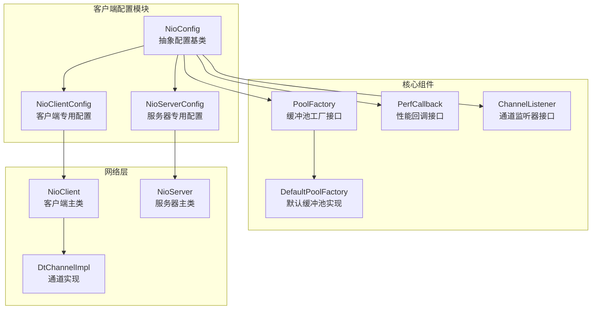

# 客户端配置文档

<cite>
**本文档引用的文件**
- [NioConfig.java](file://client/src/main/java/com/github/dtprj/dongting/net/NioConfig.java)
- [NioClientConfig.java](file://client/src/main/java/com/github/dtprj/dongting/net/NioClientConfig.java)
- [NioClient.java](file://client/src/main/java/com/github/dtprj/dongting/net/NioClient.java)
- [PoolFactory.java](file://client/src/main/java/com/github/dtprj/dongting/buf/PoolFactory.java)
- [DefaultPoolFactory.java](file://client/src/main/java/com/github/dtprj/dongting/buf/DefaultPoolFactory.java)
- [ChannelListener.java](file://client/src/main/java/com/github/dtprj/dongting/net/ChannelListener.java)
- [PerfCallback.java](file://client/src/main/java/com/github/dtprj/dongting/common/PerfCallback.java)
- [NoopPerfCallback.java](file://client/src/main/java/com/github/dtprj/dongting/common/NoopPerfCallback.java)
- [HandshakeBody.java](file://client/src/main/java/com/github/dtprj/dongting/net/HandshakeBody.java)
- [DtChannelImpl.java](file://client/src/main/java/com/github/dtprj/dongting/net/DtChannelImpl.java)
</cite>

## 目录
1. [简介](#简介)
2. [项目结构概览](#项目结构概览)
3. [核心配置类分析](#核心配置类分析)
4. [客户端配置详解](#客户端配置详解)
5. [性能监控与回调](#性能监控与回调)
6. [缓冲池配置](#缓冲池配置)
7. [通道监听器](#通道监听器)
8. [高并发场景优化](#高并发场景优化)
9. [配置示例与最佳实践](#配置示例与最佳实践)
10. [故障排除指南](#故障排除指南)
11. [总结](#总结)

## 简介

Dongting框架的NioConfig客户端配置系统是一个高度可定制化的网络通信配置框架，专为高性能分布式系统设计。该系统通过抽象的配置类层次结构，提供了细粒度的参数控制，包括背压控制、性能监控、缓冲池管理和通道生命周期管理等功能。

本文档深入解析NioConfig抽象类中的各项客户端配置参数，涵盖bizThreads、name、maxOutRequests、maxOutBytes、maxInRequests、maxInBytes、selectTimeout、cleanInterval、nearTimeoutThreshold、maxPacketSize、maxBodySize、poolFactory、readBufferSize、perfCallback、decodeContextFactory和channelListeners等核心配置项。

## 项目结构概览



**图表来源**
- [NioConfig.java](file://client/src/main/java/com/github/dtprj/dongting/net/NioConfig.java#L1-L60)
- [NioClientConfig.java](file://client/src/main/java/com/github/dtprj/dongting/net/NioClientConfig.java#L1-L38)

## 核心配置类分析

### NioConfig抽象类

NioConfig是所有网络配置的基础抽象类，定义了客户端和服务器共享的核心配置参数：

```java
public abstract class NioConfig {
    // 业务线程数
    public int bizThreads;
    // 配置名称
    public String name;
    
    // 背压控制配置
    public int maxOutRequests;  // 最大输出请求数
    public long maxOutBytes;    // 最大输出字节数
    public int maxInRequests;   // 最大输入请求数
    public long maxInBytes;     // 最大输入字节数
    
    // IO线程配置
    public long selectTimeout = 50;          // 选择超时时间
    public long cleanInterval = 100;         // 清理间隔
    public long nearTimeoutThreshold = 850;  // 近超时阈值
    
    // 数据包配置
    public int maxPacketSize = 5 * 1024 * 1024;  // 最大数据包大小
    public int maxBodySize = 4 * 1024 * 1024;    // 最大消息体大小
    
    // 缓冲池和性能监控
    public PoolFactory poolFactory = new DefaultPoolFactory();
    public int readBufferSize = 128 * 1024;
    public PerfCallback perfCallback = NoopPerfCallback.INSTANCE;
    public Supplier<DecodeContext> decodeContextFactory = DecodeContext::new;
    
    // 通道监听器
    public List<ChannelListener> channelListeners = new ArrayList<>(1);
    
    // 服务器提示功能
    public boolean serverHint = true;
}
```

**章节来源**
- [NioConfig.java](file://client/src/main/java/com/github/dtprj/dongting/net/NioConfig.java#L30-L58)

### NioClientConfig具体实现

NioClientConfig继承自NioConfig，专门为客户端场景提供了默认配置：

```java
public class NioClientConfig extends NioConfig {
    public List<HostPort> hostPorts;
    public int connectTimeoutMillis = 3000;
    public int[] connectRetryIntervals = {100, 1000, 5000, 10 * 1000, 20 * 1000, 30 * 1000, 60 * 1000};
    
    public NioClientConfig() {
        this.name = "DtNioClient";
        this.bizThreads = Runtime.getRuntime().availableProcessors();
        
        // 默认背压配置
        this.maxOutRequests = 2000;
        this.maxOutBytes = 32 * 1024 * 1024;
        this.maxInRequests = 100;
        this.maxInBytes = 32 * 1024 * 1024;
    }
}
```

**章节来源**
- [NioClientConfig.java](file://client/src/main/java/com/github/dtprj/dongting/net/NioClientConfig.java#L20-L37)

## 客户端配置详解

### 业务线程配置 (bizThreads)

业务线程数量直接影响客户端的并发处理能力：

- **默认值**: `Runtime.getRuntime().availableProcessors()`
- **功能**: 控制用于处理业务逻辑的线程数量
- **影响**: 
  - 增加线程数可以提高并发处理能力
  - 过多线程可能导致上下文切换开销增加
  - 应根据CPU核心数和业务复杂度调整

### 背压控制配置

背压控制是防止内存溢出和系统过载的关键机制：

#### 输出背压 (maxOutRequests, maxOutBytes)

```java
// 最大输出请求数，默认2000
this.maxOutRequests = 2000;

// 最大输出字节数，默认32MB
this.maxOutBytes = 32 * 1024 * 1024;
```

**工作原理**:
1. 当待发送请求超过`maxOutRequests`或待发送字节超过`maxOutBytes`时，新请求会被阻塞
2. 防止客户端内存被大量未完成的请求占用
3. 在高并发场景下有效防止内存溢出

#### 输入背压 (maxInRequests, maxInBytes)

```java
// 最大输入请求数，默认100
this.maxInRequests = 100;

// 最大输入字节数，默认32MB
this.maxInBytes = 32 * 1024 * 1024;
```

**工作原理**:
1. 服务器端控制客户端的输入流量
2. 防止服务器被过多的客户端请求淹没
3. 实现双向流量控制

### IO线程配置

#### 选择超时时间 (selectTimeout)

- **默认值**: 50毫秒
- **功能**: 控制IO多路复用的选择超时时间
- **影响**: 
  - 较短的超时时间提高响应速度但增加CPU使用
  - 较长的超时时间降低CPU使用但可能延迟响应

#### 清理间隔 (cleanInterval)

- **默认值**: 100毫秒
- **功能**: 控制连接清理任务的执行频率
- **影响**: 
  - 影响连接状态检查的及时性
  - 过短的间隔会增加CPU开销
  - 过长的间隔可能导致死连接无法及时清理

#### 近超时阈值 (nearTimeoutThreshold)

- **默认值**: 850毫秒
- **功能**: 定义接近超时的阈值
- **影响**: 用于提前检测和处理即将超时的连接

### 数据包配置

#### 最大数据包大小 (maxPacketSize)

- **默认值**: 5MB
- **功能**: 限制单个数据包的最大大小
- **影响**: 
  - 影响网络传输效率
  - 过大的数据包可能导致传输失败
  - 需要与网络MTU匹配

#### 最大消息体大小 (maxBodySize)

- **默认值**: 4MB
- **功能**: 限制消息体的最大大小
- **影响**: 
  - 与maxPacketSize配合使用
  - 影响大文件传输能力
  - 需要考虑内存分配策略

### 缓冲区配置

#### 读取缓冲区大小 (readBufferSize)

- **默认值**: 128KB
- **功能**: 设置读取操作的缓冲区大小
- **影响**: 
  - 影响IO性能和内存使用
  - 较大的缓冲区减少IO次数但增加内存占用
  - 需要根据实际数据特征调整

**章节来源**
- [NioConfig.java](file://client/src/main/java/com/github/dtprj/dongting/net/NioConfig.java#L30-L58)
- [NioClientConfig.java](file://client/src/main/java/com/github/dtprj/dongting/net/NioClientConfig.java#L20-L37)

## 性能监控与回调

### PerfCallback接口

性能回调系统允许开发者监控和记录各种性能指标：

```java
public abstract class PerfCallback implements PerfConsts {
    protected final boolean useNanos;
    
    public abstract boolean accept(int perfType);
    public abstract void onEvent(int perfType, long costTime, int count, long sum);
}
```

**主要功能**:
1. **事件监控**: 记录各种性能事件
2. **时间测量**: 支持纳秒级精度测量
3. **统计聚合**: 提供计数和总和统计
4. **条件过滤**: 只记录感兴趣的事件类型

### 默认性能回调 (NoopPerfCallback)

```java
public final class NoopPerfCallback extends PerfCallback {
    public static final NoopPerfCallback INSTANCE = new NoopPerfCallback();
    
    @Override
    public boolean accept(int perfType) {
        return false;  // 不记录任何事件
    }
    
    @Override
    public void onEvent(int perfType, long costTime, int count, long sum) {
        // 空实现，无性能开销
    }
}
```

**使用场景**:
- 生产环境关闭性能监控以获得最佳性能
- 开发调试阶段启用详细监控
- 自定义实现记录到外部监控系统

### 自定义性能回调示例

```java
public class CustomPerfCallback extends PerfCallback {
    private final Map<Integer, AtomicLong> counters = new ConcurrentHashMap<>();
    
    public CustomPerfCallback() {
        super(true);  // 使用纳秒精度
    }
    
    @Override
    public boolean accept(int perfType) {
        // 只记录特定类型的性能事件
        return perfType == PERF_TYPE_REQUEST_PROCESS;
    }
    
    @Override
    public void onEvent(int perfType, long costTime, int count, long sum) {
        counters.computeIfAbsent(perfType, k -> new AtomicLong())
                .addAndGet(costTime);
    }
    
    public long getTotalLatency(int perfType) {
        AtomicLong counter = counters.get(perfType);
        return counter != null ? counter.get() : 0;
    }
}
```

**章节来源**
- [PerfCallback.java](file://client/src/main/java/com/github/dtprj/dongting/common/PerfCallback.java#L1-L110)
- [NoopPerfCallback.java](file://client/src/main/java/com/github/dtprj/dongting/common/NoopPerfCallback.java#L1-L66)

## 缓冲池配置

### PoolFactory接口

缓冲池工厂负责创建和管理ByteBufferPool实例：

```java
public interface PoolFactory {
    ByteBufferPool createPool(Timestamp ts, boolean direct);
    void destroyPool(ByteBufferPool pool);
}
```

**核心职责**:
1. **池化管理**: 创建高效的ByteBuffer池
2. **内存优化**: 减少频繁的内存分配和回收
3. **直接内存**: 支持直接内存和堆内存两种模式
4. **生命周期管理**: 正确的创建和销毁

### DefaultPoolFactory实现

DefaultPoolFactory提供了生产级别的缓冲池实现：

```java
public class DefaultPoolFactory implements PoolFactory {
    // 全局缓冲区大小配置
    public static final int[] DEFAULT_GLOBAL_SIZE = new int[]{
        32 * 1024, 64 * 1024, 128 * 1024, 256 * 1024, 512 * 1024,
        1024 * 1024, 2 * 1024 * 1024, 4 * 1024 * 1024
    };
    
    // 小型缓冲区配置
    public static final int[] DEFAULT_SMALL_SIZE = new int[]{
        128, 256, 512, 1024, 2048, 4096, 8192, 16384
    };
    
    @Override
    public ByteBufferPool createPool(Timestamp ts, boolean direct) {
        SimpleByteBufferPoolConfig c = new SimpleByteBufferPoolConfig(
                ts, direct, 64, false);
        c.setBufSizes(DEFAULT_SMALL_SIZE);
        c.setMinCount(DEFAULT_SMALL_MIN_COUNT);
        c.setMaxCount(DEFAULT_SMALL_MAX_COUNT);
        c.setTimeoutMillis(10000);
        c.setShareSize(calcTotalSize(c.getBufSizes(), c.getMaxCount()) / 2);
        
        SimpleByteBufferPool p1 = new SimpleByteBufferPool(c);
        return new TwoLevelPool(direct, p1, 
            direct ? GLOBAL_DIRECT_POOL : GLOBAL_HEAP_POOL, 16 * 1024);
    }
}
```

**架构特点**:
1. **两级池化**: 小型池 + 全局池的两级结构
2. **动态调整**: 根据使用情况自动调整池大小
3. **内存隔离**: 直接内存和堆内存分离管理
4. **定时清理**: 自动清理过期的缓冲区

### 自定义PoolFactory示例

```java
public class CustomPoolFactory implements PoolFactory {
    private final Map<Boolean, SimpleByteBufferPool> pools = new ConcurrentHashMap<>();
    
    @Override
    public ByteBufferPool createPool(Timestamp ts, boolean direct) {
        return pools.computeIfAbsent(direct, key -> {
            SimpleByteBufferPoolConfig config = new SimpleByteBufferPoolConfig(
                    ts, direct, 128, false);
            
            // 自定义缓冲区大小分布
            int[] sizes = {256, 512, 1024, 2048, 4096, 8192, 16384, 32768};
            config.setBufSizes(sizes);
            
            // 自定义池容量
            config.setMinCount(new int[]{32, 16, 8, 4, 4, 4, 2, 2});
            config.setMaxCount(new int[]{256, 128, 64, 32, 32, 32, 16, 8});
            
            return new SimpleByteBufferPool(config);
        });
    }
    
    @Override
    public void destroyPool(ByteBufferPool pool) {
        if (pool instanceof SimpleByteBufferPool) {
            ((SimpleByteBufferPool) pool).cleanAll();
        }
    }
}
```

**章节来源**
- [PoolFactory.java](file://client/src/main/java/com/github/dtprj/dongting/buf/PoolFactory.java#L1-L29)
- [DefaultPoolFactory.java](file://client/src/main/java/com/github/dtprj/dongting/buf/DefaultPoolFactory.java#L1-L85)

## 通道监听器

### ChannelListener接口

通道监听器提供客户端连接生命周期的回调机制：

```java
public interface ChannelListener {
    void onConnected(DtChannel dtc);
    void onDisconnected(DtChannel dtc);
}
```

**核心功能**:
1. **连接状态通知**: 监听连接建立和断开事件
2. **资源管理**: 在连接断开时进行必要的清理
3. **重连策略**: 实现智能重连逻辑
4. **监控集成**: 集成到监控系统中

### 内置监听器实现

NioClient本身实现了ChannelListener接口：

```java
@Override
public void onConnected(DtChannel dtc) {
    lock.lock();
    try {
        connectCount++;
        connectCond.signalAll();
    } finally {
        lock.unlock();
    }
}

@Override
public void onDisconnected(DtChannel dtc) {
    lock.lock();
    try {
        connectCount--;
        connectCond.signalAll();
    } finally {
        lock.unlock();
    }
}
```

**工作流程**:
1. **连接成功**: 增加连接计数并唤醒等待的线程
2. **连接断开**: 减少连接计数并触发重连机制
3. **状态同步**: 维护连接状态的一致性

### 自定义ChannelListener示例

```java
public class MonitoringChannelListener implements ChannelListener {
    private final Logger logger = LoggerFactory.getLogger(MonitoringChannelListener.class);
    private final MetricsCollector metrics;
    
    public MonitoringChannelListener(MetricsCollector metrics) {
        this.metrics = metrics;
    }
    
    @Override
    public void onConnected(DtChannel dtc) {
        logger.info("Connection established: {}", dtc.getRemoteAddress());
        metrics.incrementCounter("connections.active");
        metrics.recordGauge("connections.total", metrics.getConnectionCount());
    }
    
    @Override
    public void onDisconnected(DtChannel dtc) {
        logger.warn("Connection lost: {}", dtc.getRemoteAddress());
        metrics.decrementCounter("connections.active");
        metrics.recordGauge("connections.disconnected", System.currentTimeMillis());
        
        // 触发重连逻辑
        scheduleReconnect(dtc);
    }
    
    private void scheduleReconnect(DtChannel dtc) {
        ScheduledExecutorService scheduler = Executors.newSingleThreadScheduledExecutor();
        scheduler.schedule(() -> {
            try {
                // 实现重连逻辑
                reconnect(dtc);
            } catch (Exception e) {
                logger.error("Reconnect failed", e);
            }
        }, calculateBackoffDelay(), TimeUnit.MILLISECONDS);
    }
}
```

**章节来源**
- [ChannelListener.java](file://client/src/main/java/com/github/dtprj/dongting/net/ChannelListener.java#L1-L27)
- [NioClient.java](file://client/src/main/java/com/github/dtprj/dongting/net/NioClient.java#L70-L90)

## 高并发场景优化

### 背压参数调优

在高并发场景下，合理调整背压参数至关重要：

```java
// 高并发场景配置示例
NioClientConfig config = new NioClientConfig();
config.bizThreads = Runtime.getRuntime().availableProcessors() * 2;
config.maxOutRequests = 5000;      // 增加最大请求数
config.maxOutBytes = 64 * 1024 * 1024;  // 增加最大字节数
config.maxInRequests = 500;        // 增加最大输入请求数
config.maxInBytes = 64 * 1024 * 1024;   // 增加最大输入字节数
```

**调优策略**:
1. **逐步增加**: 从保守配置开始，逐步增加参数
2. **监控反馈**: 根据实际负载和性能指标调整
3. **压力测试**: 使用基准测试验证配置效果
4. **资源平衡**: 平衡CPU、内存和网络资源

### IO线程配置优化

```java
// 高吞吐场景配置
config.selectTimeout = 20;         // 减少超时时间
config.cleanInterval = 50;         // 增加清理频率
config.nearTimeoutThreshold = 500; // 提前检测超时
```

**优化要点**:
1. **响应性**: 减少超时时间提高响应速度
2. **及时性**: 增加清理频率及时处理死连接
3. **阈值设置**: 合理设置近超时阈值避免误判

### 缓冲池优化

```java
// 大数据传输场景配置
config.readBufferSize = 256 * 1024;  // 增加读缓冲区
config.maxPacketSize = 10 * 1024 * 1024;  // 增加数据包大小
config.maxBodySize = 8 * 1024 * 1024;     // 增加消息体大小
```

**优化策略**:
1. **批量处理**: 增大缓冲区支持批量数据传输
2. **内存预分配**: 避免频繁的内存分配
3. **网络适配**: 与网络特性匹配

### 性能监控配置

```java
// 生产环境监控配置
config.perfCallback = new PrometheusPerfCallback(
    "client_metrics", 
    true,  // 启用纳秒精度
    Arrays.asList(
        PerfConsts.PERF_TYPE_REQUEST_PROCESS,
        PerfConsts.PERF_TYPE_CONNECTION_ESTABLISH,
        PerfConsts.PERF_TYPE_DATA_TRANSFER
    )
);
```

**监控重点**:
1. **关键指标**: 监控请求处理、连接建立和数据传输
2. **实时告警**: 设置合理的阈值和告警机制
3. **历史趋势**: 分析性能指标的历史变化趋势

## 配置示例与最佳实践

### 基础配置示例

```java
// 创建基础客户端配置
NioClientConfig config = new NioClientConfig();
config.hostPorts = Arrays.asList(
    new HostPort("localhost", 8888),
    new HostPort("localhost", 8889)
);

// 设置连接参数
config.connectTimeoutMillis = 5000;
config.connectRetryIntervals = new int[]{100, 500, 1000, 5000};

// 设置性能监控
config.perfCallback = new SimplePerfCallback();

// 添加通道监听器
config.channelListeners.add(new LoggingChannelListener());

// 创建客户端
NioClient client = new NioClient(config);
client.start();
```

### 高性能配置示例

```java
// 高性能客户端配置
NioClientConfig highPerfConfig = new NioClientConfig();
highPerfConfig.name = "HighPerfClient";

// 业务线程数：CPU核心数的两倍
highPerfConfig.bizThreads = Runtime.getRuntime().availableProcessors() * 2;

// 背压配置：适应高并发
highPerfConfig.maxOutRequests = 10000;
highPerfConfig.maxOutBytes = 128 * 1024 * 1024;
highPerfConfig.maxInRequests = 1000;
highPerfConfig.maxInBytes = 128 * 1024 * 1024;

// IO线程优化
highPerfConfig.selectTimeout = 10;
highPerfConfig.cleanInterval = 20;
highPerfConfig.nearTimeoutThreshold = 300;

// 缓冲区配置
highPerfConfig.readBufferSize = 512 * 1024;
highPerfConfig.maxPacketSize = 20 * 1024 * 1024;
highPerfConfig.maxBodySize = 16 * 1024 * 1024;

// 自定义缓冲池
highPerfConfig.poolFactory = new CustomPoolFactory();

// 性能监控
highPerfConfig.perfCallback = new PrometheusPerfCallback(
    "high_perf_client", true, 
    Arrays.asList(
        PerfConsts.PERF_TYPE_REQUEST_PROCESS,
        PerfConsts.PERF_TYPE_CONNECTION_ESTABLISH,
        PerfConsts.PERF_TYPE_DATA_TRANSFER
    )
);

// 通道监听器
highPerfConfig.channelListeners.add(new HealthCheckChannelListener());
highPerfConfig.channelListeners.add(new MetricsChannelListener());
```

### 特定场景配置

#### 大文件传输场景

```java
// 大文件传输配置
NioClientConfig fileTransferConfig = new NioClientConfig();
fileTransferConfig.maxPacketSize = 50 * 1024 * 1024;  // 50MB
fileTransferConfig.maxBodySize = 40 * 1024 * 1024;   // 40MB
fileTransferConfig.readBufferSize = 1024 * 1024;     // 1MB
fileTransferConfig.selectTimeout = 100;              // 100ms
```

#### 低延迟场景

```java
// 低延迟配置
NioClientConfig lowLatencyConfig = new NioClientConfig();
lowLatencyConfig.selectTimeout = 1;                  // 1ms
lowLatencyConfig.cleanInterval = 10;                 // 10ms
lowLatencyConfig.nearTimeoutThreshold = 100;         // 100ms
lowLatencyConfig.maxOutRequests = 100;               // 限制请求数
```

### 配置验证工具

```java
public class ConfigValidator {
    public static ValidationResult validate(NioClientConfig config) {
        ValidationResult result = new ValidationResult();
        
        // 验证业务线程数
        if (config.bizThreads <= 0) {
            result.addWarning("bizThreads should be positive");
        }
        
        // 验证背压参数
        if (config.maxOutRequests <= 0 && config.maxOutBytes <= 0) {
            result.addWarning("No back pressure configured");
        }
        
        // 验证IO线程配置
        if (config.selectTimeout <= 0) {
            result.addError("selectTimeout must be positive");
        }
        
        // 验证缓冲区大小
        if (config.readBufferSize <= 0) {
            result.addError("readBufferSize must be positive");
        }
        
        return result;
    }
}
```

## 故障排除指南

### 常见问题及解决方案

#### 1. 内存溢出问题

**症状**: OutOfMemoryError 或 GC频繁
**原因**: 背压配置不足导致内存积压
**解决方案**:
```java
// 增加背压限制
config.maxOutRequests = 5000;
config.maxOutBytes = 64 * 1024 * 1024;
config.maxInRequests = 500;
config.maxInBytes = 64 * 1024 * 1024;
```

#### 2. 连接超时问题

**症状**: NetTimeoutException 或连接频繁断开
**原因**: 超时配置不合理
**解决方案**:
```java
// 增加连接超时时间
config.connectTimeoutMillis = 10000;

// 调整重试间隔
config.connectRetryIntervals = new int[]{500, 1000, 3000, 10000};
```

#### 3. 性能瓶颈问题

**症状**: 请求处理缓慢或吞吐量低
**原因**: IO线程配置不当
**解决方案**:
```java
// 优化IO线程配置
config.selectTimeout = 20;
config.cleanInterval = 50;
config.nearTimeoutThreshold = 500;
```

#### 4. 连接泄漏问题

**症状**: 连接数持续增长
**原因**: 通道监听器未正确处理断开事件
**解决方案**:
```java
// 确保正确的连接管理
config.channelListeners.add(new ProperCleanupChannelListener());
```

### 监控和诊断

#### 性能指标监控

```java
public class DiagnosticPerfCallback extends PerfCallback {
    private final Map<String, AtomicLong> counters = new ConcurrentHashMap<>();
    private final Map<String, AtomicLong> timers = new ConcurrentHashMap<>();
    
    public DiagnosticPerfCallback() {
        super(true);
    }
    
    @Override
    public boolean accept(int perfType) {
        return true;  // 监控所有性能事件
    }
    
    @Override
    public void onEvent(int perfType, long costTime, int count, long sum) {
        String type = PerfConsts.getPerfTypeName(perfType);
        
        counters.computeIfAbsent(type + "_count", k -> new AtomicLong()).incrementAndGet();
        timers.computeIfAbsent(type + "_latency", k -> new AtomicLong()).set(costTime);
        
        // 记录到日志
        logger.debug("Perf event: {}={}, latency={}ns", type, count, costTime);
    }
    
    public Map<String, Long> getCurrentMetrics() {
        Map<String, Long> metrics = new HashMap<>();
        counters.forEach((k, v) -> metrics.put(k, v.get()));
        timers.forEach((k, v) -> metrics.put(k, v.get()));
        return metrics;
    }
}
```

#### 连接状态诊断

```java
public class ConnectionDiagnostic {
    public static void diagnose(NioClient client) {
        NioClientConfig config = client.getConfig();
        
        System.out.println("=== Connection Diagnostics ===");
        System.out.println("Name: " + config.name);
        System.out.println("Biz Threads: " + config.bizThreads);
        System.out.println("Max Out Requests: " + config.maxOutRequests);
        System.out.println("Max Out Bytes: " + config.maxOutBytes);
        System.out.println("Select Timeout: " + config.selectTimeout + "ms");
        System.out.println("Clean Interval: " + config.cleanInterval + "ms");
        System.out.println("Near Timeout Threshold: " + config.nearTimeoutThreshold + "ms");
        System.out.println("Read Buffer Size: " + config.readBufferSize + "bytes");
        System.out.println("Max Packet Size: " + config.maxPacketSize + "bytes");
        System.out.println("Max Body Size: " + config.maxBodySize + "bytes");
        System.out.println("===============================");
    }
}
```

**章节来源**
- [NioClient.java](file://client/src/main/java/com/github/dtprj/dongting/net/NioClient.java#L1-L199)
- [HandshakeBody.java](file://client/src/main/java/com/github/dtprj/dongting/net/HandshakeBody.java#L112-L190)

## 总结

Dongting框架的NioConfig客户端配置系统提供了全面而灵活的网络通信配置能力。通过深入理解各个配置参数的作用和相互关系，开发者可以根据具体的业务需求和运行环境，优化客户端的性能和稳定性。

### 关键要点回顾

1. **背压控制**: maxOutRequests和maxOutBytes是防止内存溢出的关键机制
2. **线程配置**: bizThreads的数量需要根据CPU核心数和业务复杂度合理设置
3. **IO优化**: selectTimeout、cleanInterval等参数影响响应性和资源使用
4. **缓冲池**: PoolFactory提供了高效的内存管理机制
5. **监控体系**: PerfCallback和ChannelListener构成了完整的监控和管理框架
6. **场景适配**: 不同的业务场景需要不同的配置策略

### 最佳实践建议

1. **渐进式调优**: 从保守配置开始，根据实际负载逐步优化
2. **监控驱动**: 基于性能监控数据进行配置调整
3. **压力测试**: 在生产环境部署前进行充分的压力测试
4. **文档维护**: 保持配置文档的更新和维护
5. **团队协作**: 建立配置变更的审批和回滚机制

通过合理配置和持续优化，Dongting客户端配置系统能够为高性能分布式应用提供稳定可靠的网络通信基础设施。