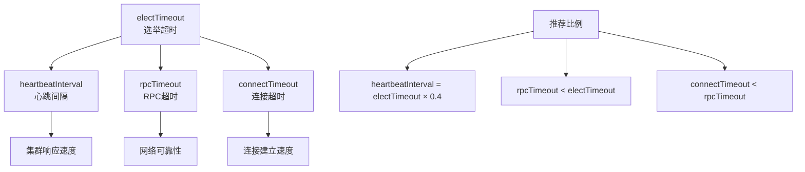

# RaftServerConfig服务器配置详细文档

<cite>
**本文档引用的文件**
- [RaftServerConfig.java](file://server/src/main/java/com/github/dtprj/dongting/raft/server/RaftServerConfig.java)
- [RaftServer.java](file://server/src/main/java/com/github/dtprj/dongting/raft/server/RaftServer.java)
- [DemoKvServerBase.java](file://demos/src/main/java/com/github/dtprj/dongting/demos/base/DemoKvServerBase.java)
- [ServerTestBase.java](file://server/src/test/java/com/github/dtprj/dongting/raft/server/ServerTestBase.java)
- [RaftNode.java](file://client/src/main/java/com/github/dtprj/dongting/raft/RaftNode.java)
- [2024_07_09_第二点阶段性进展.md](file://devlogs/2024_07_09_第二点阶段性进展.md)
</cite>

## 目录
1. [简介](#简介)
2. [核心配置参数详解](#核心配置参数详解)
3. [参数关系与调优策略](#参数关系与调优策略)
4. [生产环境配置示例](#生产环境配置示例)
5. [性能考量与最佳实践](#性能考量与最佳实践)
6. [故障排除指南](#故障排除指南)
7. [总结](#总结)

## 简介

RaftServerConfig是Dongting分布式系统中用于配置Raft服务器的核心类。它定义了服务器运行所需的所有关键参数，直接影响集群的稳定性、选举效率和故障恢复能力。本文档将深入解析每个配置参数的作用机制、合理取值范围以及在不同场景下的调优策略。

## 核心配置参数详解

### 基础网络配置

#### servers
```java
public String servers;
```
**作用**: 定义集群中所有服务器的地址列表，格式为`"id,host:port;id,host:port"`  
**默认值**: 无默认值，必须显式设置  
**取值范围**: 字符串格式，多个服务器用分号分隔  
**调优建议**: 
- 生产环境建议包含所有集群节点
- 确保格式正确，避免解析错误
- 考虑网络分区时的可达性

#### replicatePort
```java
public int replicatePort;
```
**作用**: 内部使用端口，用于服务器间日志复制和管理命令  
**默认值**: 无默认值，必须显式设置  
**取值范围**: 1-65535  
**调优建议**:
- 建议使用连续端口便于管理
- 避免与其他服务冲突
- 考虑防火墙规则

#### servicePort
```java
public int servicePort;
```
**作用**: 客户端访问端口，0表示不启动客户端服务  
**默认值**: 无默认值，必须显式设置  
**取值范围**: 0或1-65535  
**调优建议**:
- 主节点应启用客户端服务
- 观察者节点可禁用以节省资源
- 考虑负载均衡配置

#### nodeId
```java
public int nodeId;
```
**作用**: 唯一标识服务器节点的整数ID  
**默认值**: 无默认值，必须显式设置  
**取值范围**: 正整数  
**调优建议**:
- 使用连续递增的ID
- 避免重复ID
- 考虑扩展性预留ID空间

### 时间参数配置

#### electTimeout
```java
public long electTimeout = 15 * 1000;
```
**作用**: 选举超时时间，决定节点认为领导者失效的时间  
**默认值**: 15秒  
**取值范围**: 毫秒级，通常为1000-30000毫秒  
**调优建议**:
- 较短的超时时间提高响应速度但增加误判风险
- 较长的超时时间减少误判但降低响应速度
- 推荐值：2000-10000毫秒

#### rpcTimeout
```java
public long rpcTimeout = 5 * 1000;
```
**作用**: RPC调用超时时间，控制网络请求的等待时间  
**默认值**: 5秒  
**取值范围**: 毫秒级，通常为1000-10000毫秒  
**调优建议**:
- 应小于electTimeout以避免竞争条件
- 考虑网络延迟和处理时间
- 推荐值：2000-5000毫秒

#### connectTimeout
```java
public long connectTimeout = 2000;
```
**作用**: 连接建立超时时间，控制TCP连接建立的等待时间  
**默认值**: 2秒  
**取值范围**: 毫秒级，通常为1000-5000毫秒  
**调优建议**:
- 较慢网络环境可适当延长
- 避免过长影响故障检测速度
- 推荐值：1000-3000毫秒

#### heartbeatInterval
```java
public long heartbeatInterval = 2000;
```
**作用**: 心跳发送间隔，领导者定期向跟随者发送心跳保持领导权  
**默认值**: 2秒  
**取值范围**: 毫秒级，通常为500-5000毫秒  
**调优建议**:
- 影响集群响应速度和网络开销
- 应小于electTimeout的40%
- 推荐值：1000-3000毫秒

### 功能特性配置

#### checkSelf
```java
public boolean checkSelf = true;
```
**作用**: 是否检查自身是否在成员列表中  
**默认值**: true  
**取值范围**: true/false  
**调优建议**:
- 生产环境建议启用以防止脑裂
- 测试环境可考虑关闭简化配置
- 影响集群初始化过程

#### blockIoThreads
```java
public int blockIoThreads = Math.max(Runtime.getRuntime().availableProcessors() * 2, 4);
```
**作用**: 阻塞IO线程池大小，处理磁盘I/O操作  
**默认值**: 基于CPU核心数计算  
**取值范围**: 1-64  
**调优建议**:
- 高IO负载环境可适当增加
- 考虑磁盘性能和CPU核心数
- 推荐值：CPU核心数×2，最小4

**章节来源**
- [RaftServerConfig.java](file://server/src/main/java/com/github/dtprj/dongting/raft/server/RaftServerConfig.java#L20-L36)

## 参数关系与调优策略

### 时间参数的相互关系



**图表来源**
- [RaftServerConfig.java](file://server/src/main/java/com/github/dtprj/dongting/raft/server/RaftServerConfig.java#L25-L28)
- [ServerTestBase.java](file://server/src/test/java/com/github/dtprj/dongting/raft/server/ServerTestBase.java#L105-L107)

### 参数调优策略

#### 低延迟场景
```java
// 适用于低延迟要求的场景
RaftServerConfig config = new RaftServerConfig();
config.electTimeout = 3000;        // 3秒
config.heartbeatInterval = 1000;   // 1秒
config.rpcTimeout = 2000;          // 2秒
config.connectTimeout = 1000;      // 1秒
```

#### 高吞吐场景
```java
// 适用于高吞吐要求的场景
RaftServerConfig config = new RaftServerConfig();
config.electTimeout = 10000;       // 10秒
config.heartbeatInterval = 3000;   // 3秒
config.rpcTimeout = 5000;          // 5秒
config.connectTimeout = 3000;      // 3秒
```

#### 网络不稳定场景
```java
// 适用于网络不稳定的场景
RaftServerConfig config = new RaftServerConfig();
config.electTimeout = 20000;       // 20秒
config.heartbeatInterval = 5000;   // 5秒
config.rpcTimeout = 8000;          // 8秒
config.connectTimeout = 5000;      // 5秒
```

**章节来源**
- [ServerTestBase.java](file://server/src/test/java/com/github/dtprj/dongting/raft/server/ServerTestBase.java#L105-L107)
- [DemoKvServerBase.java](file://demos/src/main/java/com/github/dtprj/dongting/demos/base/DemoKvServerBase.java#L39-L42)

## 生产环境配置示例

### 典型生产配置

以下是一个典型的生产环境配置示例，基于4核CPU和SSD存储的服务器：

```java
public class ProductionRaftConfig {
    public static RaftServerConfig createProductionConfig(int nodeId, String servers) {
        RaftServerConfig config = new RaftServerConfig();
        
        // 基础网络配置
        config.servers = servers;
        config.nodeId = nodeId;
        config.replicatePort = 4000 + nodeId;
        config.servicePort = 5000 + nodeId;
        
        // 时间参数配置
        config.electTimeout = 15000;        // 15秒
        config.heartbeatInterval = 4000;    // 4秒 (electTimeout × 0.4)
        config.rpcTimeout = 5000;           // 5秒
        config.connectTimeout = 2000;       // 2秒
        
        // 功能特性配置
        config.checkSelf = true;
        config.blockIoThreads = Math.max(Runtime.getRuntime().availableProcessors() * 2, 4);
        
        return config;
    }
}
```

### 配置设计考量

#### 性能考量
- **electTimeout**: 设置为15秒平衡响应速度和稳定性
- **heartbeatInterval**: 设置为4秒确保及时检测领导者故障
- **rpcTimeout**: 设置为5秒避免长时间阻塞
- **blockIoThreads**: 基于CPU核心数计算，确保IO性能

#### 可靠性考量
- 启用checkSelf防止脑裂
- 合理的超时设置避免误判
- 足够的IO线程池应对高负载

#### 扩展性考量
- 使用连续端口便于管理
- 节点ID预留扩展空间
- 支持动态添加新节点

**章节来源**
- [ProductionRaftConfig.java](file://server/src/main/java/com/github/dtprj/dongting/raft/server/RaftServerConfig.java#L20-L36)
- [DemoKvServerBase.java](file://demos/src/main/java/com/github/dtprj/dongting/demos/base/DemoKvServerBase.java#L37-L45)

## 性能考量与最佳实践

### IO线程池配置策略

```mermaid
flowchart TD
A[检测CPU核心数] --> B[计算基础线程数]
B --> C[应用最小限制]
C --> D[考虑磁盘性能]
D --> E[调整最终值]
F[Runtime.getRuntime().availableProcessors()] --> A
G[Math.max(cpu_cores × 2, 4)] --> C
H[磁盘类型判断] --> D
I[SSD: 增加线程数<br/>HDD: 保持原值<br/>网络存储: 减少线程数] --> H
```

**图表来源**
- [RaftServerConfig.java](file://server/src/main/java/com/github/dtprj/dongting/raft/server/RaftServerConfig.java#L35)

### 高IO负载环境配置

#### SSD存储环境
```java
// SSD环境配置
RaftServerConfig config = new RaftServerConfig();
config.blockIoThreads = Runtime.getRuntime().availableProcessors() * 3;
```

#### HDD存储环境
```java
// HDD环境配置
RaftServerConfig config = new RaftServerConfig();
config.blockIoThreads = Math.max(Runtime.getRuntime().availableProcessors() * 1, 4);
```

#### 网络存储环境
```java
// 网络存储配置
RaftServerConfig config = new RaftServerConfig();
config.blockIoThreads = Math.max(Runtime.getRuntime().availableProcessors() * 1, 2);
```

### 网络分区场景配置

```java
// 网络分区容忍配置
RaftServerConfig config = new RaftServerConfig();
config.electTimeout = 30000;        // 增加选举超时
config.heartbeatInterval = 8000;    // 增加心跳间隔
config.rpcTimeout = 10000;          // 增加RPC超时
config.connectTimeout = 5000;       // 增加连接超时
```

### 内存优化配置

```java
// 内存受限环境配置
RaftServerConfig config = new RaftServerConfig();
config.maxReplicateItems = 10000;   // 减少批量大小
config.maxReplicateBytes = 4 * 1024 * 1024; // 减少批量大小
config.idxCacheSize = 4 * 1024;     // 减少索引缓存
```

**章节来源**
- [RaftServerConfig.java](file://server/src/main/java/com/github/dtprj/dongting/raft/server/RaftServerConfig.java#L35)
- [2024_07_09_第二点阶段性进展.md](file://devlogs/2024_07_09_第二点阶段性进展.md#L1-L47)

## 故障排除指南

### 常见配置问题

#### 问题1: 选举失败
**症状**: 集群频繁出现多个领导者或无法选出领导者  
**原因**: electTimeout设置不当  
**解决方案**:
```java
// 调整选举超时
config.electTimeout = 20000;        // 增加到20秒
config.heartbeatInterval = 8000;    // 调整为electTimeout × 0.4
```

#### 问题2: 网络延迟过高
**症状**: RPC调用经常超时，集群响应缓慢  
**原因**: 网络延迟超过RPC超时设置  
**解决方案**:
```java
// 增加超时时间
config.rpcTimeout = 10000;          // 增加到10秒
config.connectTimeout = 5000;       // 增加到5秒
```

#### 问题3: IO性能瓶颈
**症状**: 写入性能低下，磁盘使用率高  
**原因**: IO线程池配置不足  
**解决方案**:
```java
// 增加IO线程数
config.blockIoThreads = Runtime.getRuntime().availableProcessors() * 4;
```

### 监控指标建议

#### 关键监控指标
- **选举成功率**: 监控选举成功频率
- **心跳丢失率**: 监控心跳丢失情况
- **RPC延迟分布**: 监控RPC调用延迟
- **IO线程池利用率**: 监控IO线程池使用情况
- **网络连接状态**: 监控网络连接健康状况

#### 告警阈值建议
```java
// 监控告警配置
Map<String, Double> thresholds = new HashMap<>();
thresholds.put("election_failure_rate", 0.1);     // 10%失败率告警
thresholds.put("heartbeat_loss_rate", 0.2);       // 20%丢失率告警
thresholds.put("rpc_latency_p95", 1000.0);        // 95%分位延迟1秒
thresholds.put("io_thread_utilization", 0.8);     // 80%利用率告警
```

**章节来源**
- [RaftServer.java](file://server/src/main/java/com/github/dtprj/dongting/raft/server/RaftServer.java#L115-L120)

## 总结

RaftServerConfig是Dongting分布式系统的核心配置组件，其参数设置直接影响集群的稳定性、性能和可靠性。通过合理配置这些参数，可以在不同的应用场景中获得最佳的系统表现。

### 关键要点回顾

1. **参数间的相互关系**: electTimeout、heartbeatInterval、rpcTimeout之间存在严格的依赖关系，需要按照推荐比例设置
2. **环境适应性**: 不同的硬件环境和网络条件需要相应的参数调整
3. **性能与可靠性的平衡**: 在追求高性能的同时，不能牺牲系统的可靠性
4. **监控与调优**: 持续的监控和适时的参数调优是保证系统稳定运行的关键

### 最佳实践建议

- 根据实际硬件配置和网络环境调整参数
- 在生产环境中进行充分的测试验证
- 建立完善的监控体系及时发现和解决问题
- 保持配置的一致性和可追溯性
- 定期评估和优化配置参数

通过遵循这些指导原则和最佳实践，可以充分发挥Dongting分布式系统的潜力，构建稳定、高效、可靠的分布式应用平台。