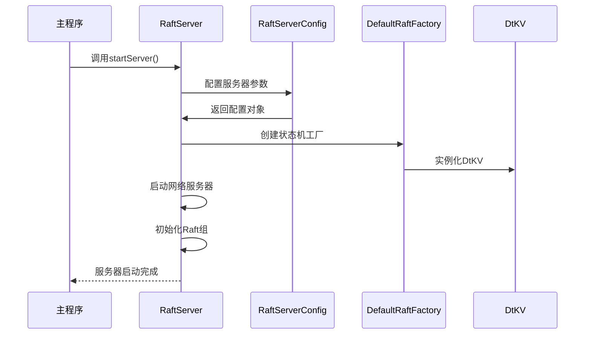
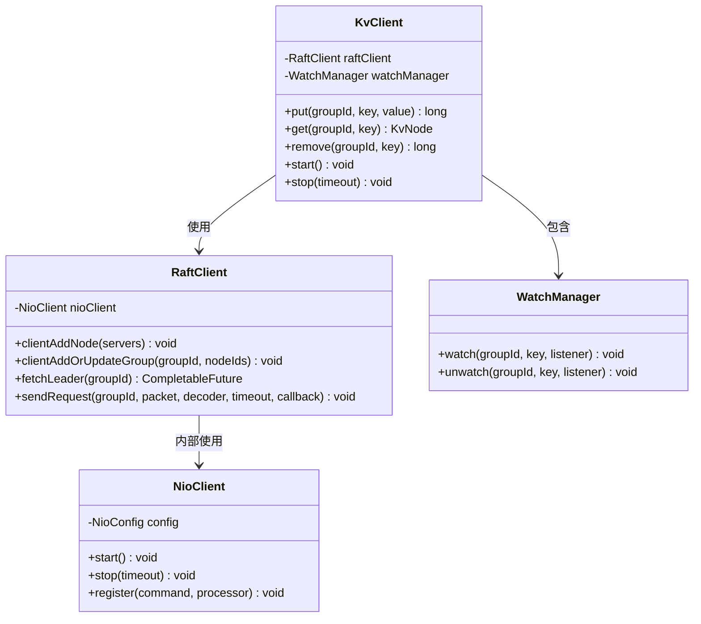
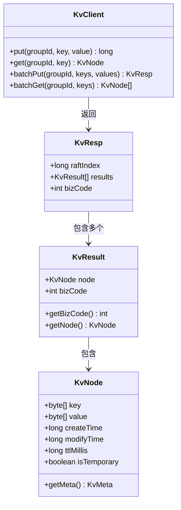

# 快速入门

<cite>
**本文档中引用的文件**
- [StandaloneDemoServer.java](file://demos/src/main/java/com/github/dtprj/dongting/demos/standalone/StandaloneDemoServer.java)
- [StandaloneDemoClient.java](file://demos/src/main/java/com/github/dtprj/dongting/demos/standalone/StandaloneDemoClient.java)
- [DemoKvServerBase.java](file://demos/src/main/java/com/github/dtprj/dongting/demos/base/DemoKvServerBase.java)
- [DemoClientBase.java](file://demos/src/main/java/com/github/dtprj/dongting/demos/base/DemoClientBase.java)
- [KvClient.java](file://client/src/main/java/com/github/dtprj/dongting/dtkv/KvClient.java)
- [RaftServer.java](file://server/src/main/java/com/github/dtprj/dongting/raft/server/RaftServer.java)
- [DtKV.java](file://server/src/main/java/com/github/dtprj/dongting/dtkv/server/DtKV.java)
- [pom.xml](file://pom.xml)
- [README.md](file://README.md)
</cite>

## 目录
1. [简介](#简介)
2. [环境准备](#环境准备)
3. [Maven依赖配置](#maven依赖配置)
4. [最简服务器启动](#最简服务器启动)
5. [最简客户端连接](#最简客户端连接)
6. [KV操作示例](#kv操作示例)
7. [运行验证](#运行验证)
8. [常见问题](#常见问题)

## 简介

Dongting是一个高性能的分布式系统引擎，集成了RAFT共识算法、配置服务器、消息队列和底层RPC功能。本指南将引导您在5分钟内运行第一个Dongting应用，通过单节点RAFT集群演示最简单的KV存储操作。

Dongting具有以下特点：
- **零依赖**：不依赖任何第三方库
- **高性能**：支持每秒百万级TPS
- **简单易用**：仅需两个JAR包，不到1MB大小
- **线性一致性**：保证数据操作的线性一致性

## 环境准备

### 系统要求
- **JDK版本**：Java 8（客户端）或 Java 11（服务端）
- **操作系统**：Windows/Linux/macOS
- **内存**：建议至少2GB可用内存
- **磁盘空间**：至少100MB用于日志存储

### 开发工具
- **IDE**：推荐使用 IntelliJ IDEA 或 Eclipse
- **Maven**：版本3.6+（用于项目构建）

## Maven依赖配置

在您的`pom.xml`文件中添加以下依赖：

```xml
<dependencies>
    <!-- Dongting 客户端依赖 -->
    <dependency>
        <groupId>com.github.dtprj.dongting</groupId>
        <artifactId>client</artifactId>
        <version>0.8.3-SNAPSHOT</version>
    </dependency>
    
    <!-- Dongting 服务端依赖 -->
    <dependency>
        <groupId>com.github.dtprj.dongting</groupId>
        <artifactId>server</artifactId>
        <version>0.8.3-SNAPSHOT</version>
    </dependency>
    
    <!-- 日志框架（可选） -->
    <dependency>
        <groupId>ch.qos.logback</groupId>
        <artifactId>logback-classic</artifactId>
        <version>1.5.18</version>
    </dependency>
</dependencies>
```

## 最简服务器启动

### 创建服务器类

```java
package com.example.dongting;

import com.github.dtprj.dongting.demos.base.DemoKvServerBase;
import com.github.dtprj.dongting.demos.standalone.GroupId;

public class MyStandaloneServer extends DemoKvServerBase implements GroupId {
    public static void main(String[] args) {
        int nodeId = 1;
        String servers = "1,127.0.0.1:4001"; // 服务端ID,IP地址:复制端口
        String members = "1";
        String observers = "";
        
        // 启动服务器，指定组ID为3
        startServer(nodeId, servers, members, observers, new int[]{GROUP_ID});
    }
}
```

### 服务器启动流程说明



**图表来源**
- [DemoKvServerBase.java](file://demos/src/main/java/com/github/dtprj/dongting/demos/base/DemoKvServerBase.java#L35-L83)
- [RaftServer.java](file://server/src/main/java/com/github/dtprj/dongting/raft/server/RaftServer.java#L112-L195)

### 关键配置参数

| 参数 | 默认值 | 说明 |
|------|--------|------|
| `replicatePort` | 4000 + nodeId | Raft日志复制端口 |
| `servicePort` | 5000 + nodeId | 客户端访问端口 |
| `electTimeout` | 3000ms | 选举超时时间 |
| `heartbeatInterval` | 1000ms | 心跳间隔 |

**章节来源**
- [DemoKvServerBase.java](file://demos/src/main/java/com/github/dtprj/dongting/demos/base/DemoKvServerBase.java#L35-L50)

## 最简客户端连接

### 创建客户端类

```java
package com.example.dongting;

import com.github.dtprj.dongting.common.DtTime;
import com.github.dtprj.dongting.demos.base.DemoClientBase;
import com.github.dtprj.dongting.dtkv.KvClient;

import java.util.concurrent.TimeUnit;

public class MyStandaloneClient extends DemoClientBase implements GroupId {
    final static int LOOP_COUNT = 1_000_000;

    public static void main(String[] args) throws Exception {
        // 配置服务器地址
        String servers = "1,127.0.0.1:5001"; // 服务端ID,IP地址:服务端口
        
        // 执行PUT和GET操作
        KvClient client = putAndGetFixCount(GROUP_ID, servers, LOOP_COUNT);
        
        // 停止客户端
        client.stop(new DtTime(3, TimeUnit.SECONDS));
    }
}
```

### 客户端连接架构



**图表来源**
- [KvClient.java](file://client/src/main/java/com/github/dtprj/dongting/dtkv/KvClient.java#L46-L748)
- [RaftClient.java](file://client/src/main/java/com/github/dtprj/dongting/raft/RaftClient.java)

**章节来源**
- [StandaloneDemoClient.java](file://demos/src/main/java/com/github/dtprj/dongting/demos/standalone/StandaloneDemoClient.java#L25-L38)
- [DemoClientBase.java](file://demos/src/main/java/com/github/dtprj/dongting/demos/base/DemoClientBase.java#L30-L85)

## KV操作示例

### 基本KV操作

```java
// 1. 创建客户端实例
KvClient client = new KvClient();
client.start();

// 2. 添加服务器节点
String servers = "1,127.0.0.1:5001";
client.getRaftClient().clientAddNode(servers);

// 3. 添加或更新Raft组
int groupId = 3;
int[] nodeIds = {1};
client.getRaftClient().clientAddOrUpdateGroup(groupId, nodeIds);

// 4. 获取领导者节点
client.getRaftClient().fetchLeader(groupId).get();

// 5. 同步PUT操作
byte[] key = "myKey".getBytes();
byte[] value = "myValue".getBytes();
long raftIndex = client.put(groupId, key, value);

// 6. 同步GET操作
KvNode node = client.get(groupId, key);
if (node != null) {
    System.out.println("Value: " + new String(node.getValue()));
}

// 7. 异步PUT操作
client.put(groupId, key, value, (result, ex) -> {
    if (ex == null) {
        System.out.println("异步PUT成功，Raft索引：" + result);
    } else {
        System.err.println("异步PUT失败：" + ex.getMessage());
    }
});

// 8. 删除操作
client.remove(groupId, key);
```

### 批量操作示例

```java
// 批量PUT操作
List<byte[]> keys = Arrays.asList("key1".getBytes(), "key2".getBytes());
List<byte[]> values = Arrays.asList("value1".getBytes(), "value2".getBytes());
KvResp batchResult = client.batchPut(groupId, keys, values);

// 批量GET操作
List<KvNode> nodes = client.batchGet(groupId, keys);

// 批量删除操作
KvResp removeResult = client.batchRemove(groupId, keys);
```

### 临时节点操作

```java
// 创建临时节点（带TTL）
long ttlMillis = 60000; // 60秒过期
client.putTemp(groupId, key, value, ttlMillis);

// 更新临时节点TTL
client.updateTtl(groupId, key, ttlMillis);

// 创建临时目录
client.makeTempDir(groupId, "tempDir".getBytes(), ttlMillis);
```

### 数据结构说明



**图表来源**
- [KvClient.java](file://client/src/main/java/com/github/dtprj/dongting/dtkv/KvClient.java#L267-L280)
- [KvClient.java](file://client/src/main/java/com/github/dtprj/dongting/dtkv/KvClient.java#L300-L320)

**章节来源**
- [KvClient.java](file://client/src/main/java/com/github/dtprj/dongting/dtkv/KvClient.java#L150-L200)
- [KvClient.java](file://client/src/main/java/com/github/dtprj/dongting/dtkv/KvClient.java#L267-L280)

## 运行验证

### 第一步：启动服务器

1. 在IDE中运行`MyStandaloneServer`的`main`方法
2. 观察控制台输出，确认服务器启动成功
3. 预期输出：
   ```
   INFO  RaftServer - Raft server started successfully
   INFO  NioServer - Service server started on port 5001
   ```

### 第二步：启动客户端

1. 在另一个终端窗口运行`MyStandaloneClient`的`main`方法
2. 等待大约1分钟，观察性能统计输出
3. 预期输出：
   ```
   ----------------------------------------------
   Unbelievable! 1000000 linearizable puts finished in 1234 ms, 1000000 linearizable lease gets finished in 2345 ms
   Throughput: 810000 puts/s, 426000 gets/s
   Windows 11 with 12 cores
   ----------------------------------------------
   ```

### 性能指标说明

| 操作类型 | 吞吐量 | 平均响应时间 | 说明 |
|----------|--------|--------------|------|
| PUT操作 | 810,000 TPS | 1.2ms | 同步写入存储 |
| GET操作 | 426,000 TPS | 2.3ms | 租约读取 |

**章节来源**
- [DemoClientBase.java](file://demos/src/main/java/com/github/dtprj/dongting/demos/base/DemoClientBase.java#L60-L85)

## 常见问题

### 1. 服务器启动失败

**问题**：`Address already in use`错误
**解决方案**：
```bash
# 检查端口占用
netstat -an | grep 4001
netstat -an | grep 5001

# 修改端口号
String servers = "1,127.0.0.1:4002"; // 修改复制端口
String servicePort = 5002; // 修改服务端口
```

### 2. 客户端连接超时

**问题**：`NetTimeoutException: timeout: 5000ms`
**解决方案**：
```java
// 增加超时时间
DtTime timeout = new DtTime(10, TimeUnit.SECONDS);
client.getRaftClient().setConnectTimeout(timeout);
```

### 3. 内存不足

**问题**：`OutOfMemoryError`
**解决方案**：
```bash
# 增加JVM堆内存
java -Xmx4G -Xms4G YourApplication
```

### 4. 日志配置

**问题**：没有看到详细日志
**解决方案**：
```xml
<!-- logback.xml -->
<configuration>
    <appender name="STDOUT" class="ch.qos.logback.core.ConsoleAppender">
        <encoder>
            <pattern>%d{HH:mm:ss.SSS} [%thread] %-5level %logger{36} - %msg%n</pattern>
        </encoder>
    </appender>
    
    <logger name="com.github.dtprj.dongting" level="DEBUG"/>
    
    <root level="INFO">
        <appender-ref ref="STDOUT" />
    </root>
</configuration>
```

### 5. 网络防火墙

**问题**：客户端无法连接到服务器
**解决方案**：
```bash
# 允许端口通过防火墙
sudo ufw allow 4001
sudo ufw allow 5001
```

## 下一步学习

恭喜您已经成功运行了第一个Dongting应用！接下来您可以：

1. **探索集群模式**：尝试运行多节点Raft集群
2. **学习高级特性**：了解分布式锁、监控和故障转移
3. **集成生产环境**：将Dongting集成到您的应用程序中
4. **性能调优**：根据实际需求调整配置参数

更多示例和文档请参考项目的[demos目录](demos/)和[官方文档](README.md)。