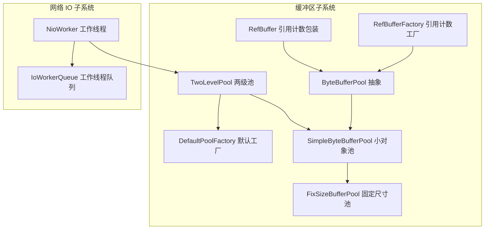
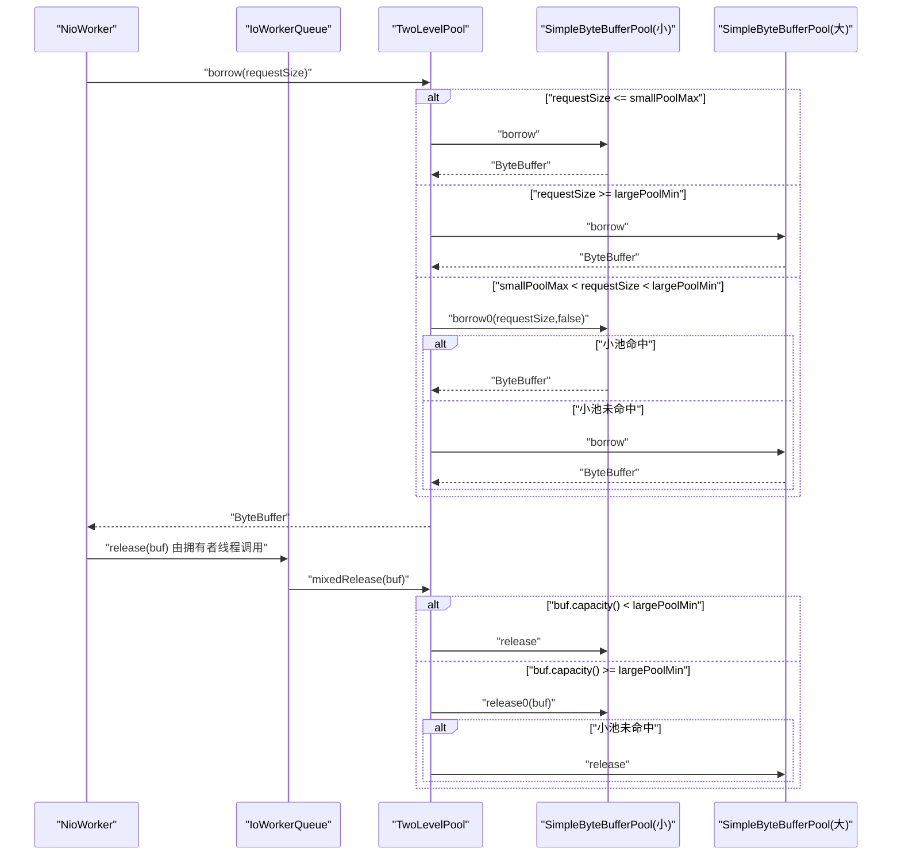
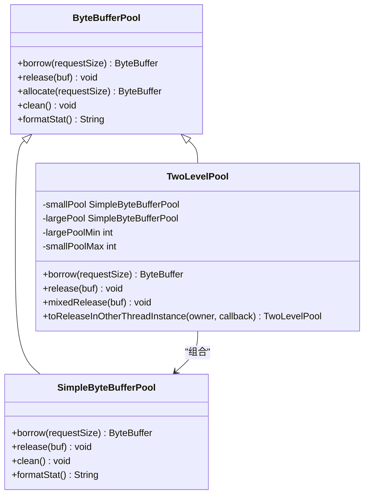
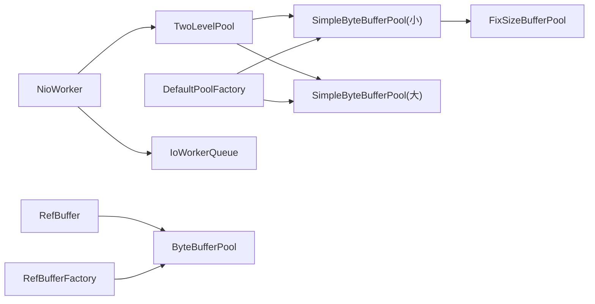

# 两级缓冲池

<cite>
**本文引用的文件列表**
- [TwoLevelPool.java](file://client/src/main/java/com/github/dtprj/dongting/buf/TwoLevelPool.java)
- [ByteBufferPool.java](file://client/src/main/java/com/github/dtprj/dongting/buf/ByteBufferPool.java)
- [SimpleByteBufferPool.java](file://client/src/main/java/com/github/dtprj/dongting/buf/SimpleByteBufferPool.java)
- [FixSizeBufferPool.java](file://client/src/main/java/com/github/dtprj/dongting/buf/FixSizeBufferPool.java)
- [SimpleByteBufferPoolConfig.java](file://client/src/main/java/com/github/dtprj/dongting/buf/SimpleByteBufferPoolConfig.java)
- [DefaultPoolFactory.java](file://client/src/main/java/com/github/dtprj/dongting/buf/DefaultPoolFactory.java)
- [RefBuffer.java](file://client/src/main/java/com/github/dtprj/dongting/buf/RefBuffer.java)
- [RefBufferFactory.java](file://client/src/main/java/com/github/dtprj/dongting/buf/RefBufferFactory.java)
- [NioWorker.java](file://client/src/main/java/com/github/dtprj/dongting/net/NioWorker.java)
- [TwoLevelPoolTest.java](file://client/src/test/java/com/github/dtprj/dongting/buf/TwoLevelPoolTest.java)
- [2023_07_28_dongting的对象池.txt](file://devlogs/2023_07_28_dongting的对象池.txt)
</cite>

## 目录
1. [简介](#简介)
2. [项目结构](#项目结构)
3. [核心组件](#核心组件)
4. [架构总览](#架构总览)
5. [组件详解](#组件详解)
6. [依赖关系分析](#依赖关系分析)
7. [性能与容量特性](#性能与容量特性)
8. [故障排查指南](#故障排查指南)
9. [结论](#结论)
10. [附录：配置与用法建议](#附录配置与用法建议)

## 简介
本篇文档系统化阐述“两级缓冲池”的设计与实现，重点覆盖：
- 两级池的分层策略：小对象池（线程私有/局部共享）、大对象池（全局共享）
- 跨线程安全释放机制：通过工作线程队列回调确保释放发生在拥有者线程
- 在网络 IO 工作线程中的集成与使用
- 关键类之间的协作关系、数据流与控制流
- 性能特征、容量规划与常见问题排查

## 项目结构
两级缓冲池位于客户端模块的缓冲区子系统中，围绕 ByteBufferPool 抽象展开，并与网络 IO 工作线程协同工作。

图表来源
- [ByteBufferPool.java](file://client/src/main/java/com/github/dtprj/dongting/buf/ByteBufferPool.java#L1-L46)
- [SimpleByteBufferPool.java](file://client/src/main/java/com/github/dtprj/dongting/buf/SimpleByteBufferPool.java#L1-L347)
- [FixSizeBufferPool.java](file://client/src/main/java/com/github/dtprj/dongting/buf/FixSizeBufferPool.java#L1-L142)
- [TwoLevelPool.java](file://client/src/main/java/com/github/dtprj/dongting/buf/TwoLevelPool.java#L1-L146)
- [DefaultPoolFactory.java](file://client/src/main/java/com/github/dtprj/dongting/buf/DefaultPoolFactory.java#L1-L78)
- [RefBuffer.java](file://client/src/main/java/com/github/dtprj/dongting/buf/RefBuffer.java#L1-L184)
- [RefBufferFactory.java](file://client/src/main/java/com/github/dtprj/dongting/buf/RefBufferFactory.java#L1-L42)
- [NioWorker.java](file://client/src/main/java/com/github/dtprj/dongting/net/NioWorker.java#L120-L136)

章节来源
- [DefaultPoolFactory.java](file://client/src/main/java/com/github/dtprj/dongting/buf/DefaultPoolFactory.java#L1-L78)
- [NioWorker.java](file://client/src/main/java/com/github/dtprj/dongting/net/NioWorker.java#L120-L136)

## 核心组件
- ByteBufferPool：缓冲池抽象，定义借出/归还/分配/清理/统计等接口
- SimpleByteBufferPool：小对象池，按固定尺寸分组，内部使用 FixSizeBufferPool 池化
- FixSizeBufferPool：固定尺寸的本地池，维护最小/最大数量、共享配额、回收时间戳、命中统计
- TwoLevelPool：两级池，将请求按阈值分流到小池或大池；支持“释放回调”以保证跨线程安全释放
- DefaultPoolFactory：默认池工厂，构造小池+全局大池的两级池组合
- RefBuffer/RefBufferFactory：对 ByteBuffer 的引用计数封装，便于跨线程传递与安全释放
- NioWorker：网络工作线程，持有直/堆两类池，为堆池启用“释放回调”，确保释放回到拥有者线程

章节来源
- [ByteBufferPool.java](file://client/src/main/java/com/github/dtprj/dongting/buf/ByteBufferPool.java#L1-L46)
- [SimpleByteBufferPool.java](file://client/src/main/java/com/github/dtprj/dongting/buf/SimpleByteBufferPool.java#L1-L347)
- [FixSizeBufferPool.java](file://client/src/main/java/com/github/dtprj/dongting/buf/FixSizeBufferPool.java#L1-L142)
- [TwoLevelPool.java](file://client/src/main/java/com/github/dtprj/dongting/buf/TwoLevelPool.java#L1-L146)
- [DefaultPoolFactory.java](file://client/src/main/java/com/github/dtprj/dongting/buf/DefaultPoolFactory.java#L1-L78)
- [RefBuffer.java](file://client/src/main/java/com/github/dtprj/dongting/buf/RefBuffer.java#L1-L184)
- [RefBufferFactory.java](file://client/src/main/java/com/github/dtprj/dongting/buf/RefBufferFactory.java#L1-L42)
- [NioWorker.java](file://client/src/main/java/com/github/dtprj/dongting/net/NioWorker.java#L120-L136)

## 架构总览
两级池的核心思想是“按尺寸分层”：
- 小于阈值的请求直接分配，避免池化开销
- 小于阈值但接近阈值的请求优先从小池借出，否则退让到大池
- 大于等于阈值的请求直接从大池借出
- 归还时，小对象回小池，大对象回大池；若池满且共享配额超限，则直接丢弃并释放底层 ByteBuffer

跨线程安全释放：TwoLevelPool 支持将“释放回调”绑定到拥有者线程的任务队列，确保释放动作在拥有者线程执行，避免跨线程误释放或竞态。

图表来源
- [TwoLevelPool.java](file://client/src/main/java/com/github/dtprj/dongting/buf/TwoLevelPool.java#L74-L116)
- [SimpleByteBufferPool.java](file://client/src/main/java/com/github/dtprj/dongting/buf/SimpleByteBufferPool.java#L131-L224)
- [NioWorker.java](file://client/src/main/java/com/github/dtprj/dongting/net/NioWorker.java#L128-L136)

## 组件详解

### TwoLevelPool：两级池
- 分层策略
  - smallPoolMax：小池最大容量
  - largePoolMin：大池最小容量
  - 当 requestSize <= smallPoolMax：优先小池；若小池无可用则退让大池
  - 当 requestSize >= largePoolMin：直接大池
  - 当 smallPoolMax < requestSize < largePoolMin：先尝试小池，失败则走大池
- 跨线程安全释放
  - toReleaseInOtherThreadInstance(owner, callback) 返回新实例，要求在 owner 线程借出，其他线程归还时通过 callback 将 mixedRelease 调度回 owner 线程
- 统计与清理
  - formatStat 返回小池统计
  - clean 清理小池

图表来源
- [ByteBufferPool.java](file://client/src/main/java/com/github/dtprj/dongting/buf/ByteBufferPool.java#L1-L46)
- [SimpleByteBufferPool.java](file://client/src/main/java/com/github/dtprj/dongting/buf/SimpleByteBufferPool.java#L1-L347)
- [TwoLevelPool.java](file://client/src/main/java/com/github/dtprj/dongting/buf/TwoLevelPool.java#L1-L146)

章节来源
- [TwoLevelPool.java](file://client/src/main/java/com/github/dtprj/dongting/buf/TwoLevelPool.java#L1-L146)
- [TwoLevelPoolTest.java](file://client/src/test/java/com/github/dtprj/dongting/buf/TwoLevelPoolTest.java#L1-L108)

### SimpleByteBufferPool：小对象池
- 固定尺寸分组：按 bufSizes 顺序组织，每个尺寸对应一个 FixSizeBufferPool
- 借出逻辑
  - 若 requestSize <= threshold：直接分配（不进入池），统计“太小”借出次数
  - 否则选择首个容量 >= requestSize 的尺寸，优先从该 FixSizeBufferPool 借出，否则分配该尺寸
- 归还逻辑
  - 若 buf.capacity() <= threshold：拒绝归还（直接丢弃）
  - 否则定位到对应尺寸池，若池满且共享配额超限则丢弃；否则归还
- 清理与统计
  - clean 按时间窗口清理池内闲置对象
  - formatStat 输出各尺寸的借出/归还命中率与总量统计

章节来源
- [SimpleByteBufferPool.java](file://client/src/main/java/com/github/dtprj/dongting/buf/SimpleByteBufferPool.java#L1-L347)
- [FixSizeBufferPool.java](file://client/src/main/java/com/github/dtprj/dongting/buf/FixSizeBufferPool.java#L1-L142)

### FixSizeBufferPool：固定尺寸池
- 维护最小/最大数量，超出最大数量时检查共享配额
- 使用 ByteBuffer 前后写入魔数与返回时间戳，用于检测重复释放与过期清理
- 提供 clean/cleanAll 两种清理策略

章节来源
- [FixSizeBufferPool.java](file://client/src/main/java/com/github/dtprj/dongting/buf/FixSizeBufferPool.java#L1-L142)

### DefaultPoolFactory：默认池工厂
- 为小池提供默认尺寸/最小/最大配额与共享配额
- 为大池创建全局共享池（线程安全，带独立时间戳）
- 创建 TwoLevelPool：小池 + 全局大池

章节来源
- [DefaultPoolFactory.java](file://client/src/main/java/com/github/dtprj/dongting/buf/DefaultPoolFactory.java#L1-L78)

### RefBuffer/RefBufferFactory：引用计数包装
- 对 ByteBuffer 进行引用计数封装，支持切片与跨线程传递
- 当作为池借出的缓冲被释放时，委托给 ByteBufferPool.release 或直接释放底层 Direct Buffer

章节来源
- [RefBuffer.java](file://client/src/main/java/com/github/dtprj/dongting/buf/RefBuffer.java#L1-L184)
- [RefBufferFactory.java](file://client/src/main/java/com/github/dtprj/dongting/buf/RefBufferFactory.java#L1-L42)

### NioWorker 集成
- 创建直/堆两类池
- 为堆池启用“释放回调”，将 mixedRelease 调度回拥有者线程，确保跨线程安全释放
- 定期调用 clean 清理池

章节来源
- [NioWorker.java](file://client/src/main/java/com/github/dtprj/dongting/net/NioWorker.java#L120-L136)
- [NioWorker.java](file://client/src/main/java/com/github/dtprj/dongting/net/NioWorker.java#L230-L233)

## 依赖关系分析
- TwoLevelPool 依赖 SimpleByteBufferPool（小池与大池）
- SimpleByteBufferPool 内部依赖 FixSizeBufferPool
- DefaultPoolFactory 依赖 SimpleByteBufferPoolConfig 与 SimpleByteBufferPool
- NioWorker 依赖 TwoLevelPool 并通过 IoWorkerQueue 实现跨线程释放调度
- RefBuffer/RefBufferFactory 依赖 ByteBufferPool

图表来源
- [TwoLevelPool.java](file://client/src/main/java/com/github/dtprj/dongting/buf/TwoLevelPool.java#L1-L146)
- [SimpleByteBufferPool.java](file://client/src/main/java/com/github/dtprj/dongting/buf/SimpleByteBufferPool.java#L1-L347)
- [FixSizeBufferPool.java](file://client/src/main/java/com/github/dtprj/dongting/buf/FixSizeBufferPool.java#L1-L142)
- [DefaultPoolFactory.java](file://client/src/main/java/com/github/dtprj/dongting/buf/DefaultPoolFactory.java#L1-L78)
- [NioWorker.java](file://client/src/main/java/com/github/dtprj/dongting/net/NioWorker.java#L120-L136)
- [RefBuffer.java](file://client/src/main/java/com/github/dtprj/dongting/buf/RefBuffer.java#L1-L184)
- [RefBufferFactory.java](file://client/src/main/java/com/github/dtprj/dongting/buf/RefBufferFactory.java#L1-L42)

## 性能与容量特性
- 小池命中率高：针对高频的小/中等尺寸请求，减少分配与 GC 压力
- 大池全局共享：提升大对象复用率，降低多线程各自持有大对象导致的内存浪费
- 共享配额控制：通过共享配额上限限制池内累计占用，避免内存膨胀
- 时间窗口清理：定期清理长时间未使用的缓冲，维持池健康
- 跨线程释放：通过回调将释放调度回拥有者线程，避免跨线程误释放与竞态

章节来源
- [SimpleByteBufferPool.java](file://client/src/main/java/com/github/dtprj/dongting/buf/SimpleByteBufferPool.java#L237-L248)
- [FixSizeBufferPool.java](file://client/src/main/java/com/github/dtprj/dongting/buf/FixSizeBufferPool.java#L113-L140)
- [DefaultPoolFactory.java](file://client/src/main/java/com/github/dtprj/dongting/buf/DefaultPoolFactory.java#L43-L52)
- [2023_07_28_dongting的对象池.txt](file://devlogs/2023_07_28_dongting的对象池.txt#L3-L6)

## 故障排查指南
- 借出/归还统计异常
  - 使用 formatStat 查看各尺寸的借出/归还命中率，定位是否频繁出现“太小/太大”借出
- 跨线程释放错误
  - 若在非拥有者线程调用 TwoLevelPool.borrow，会抛出异常；确认线程归属
  - 若在非拥有者线程调用 TwoLevelPool.release，需确保已通过 toReleaseInOtherThreadInstance 注册回调
- 大对象未归还
  - 大对象池满且共享配额超限会丢弃缓冲；检查共享配额与最大数量配置
- 重复释放或越界访问
  - FixSizeBufferPool 通过魔数与返回时间戳检测重复释放与过期使用；若发现异常，检查业务逻辑是否重复持有或越界读写

章节来源
- [TwoLevelPool.java](file://client/src/main/java/com/github/dtprj/dongting/buf/TwoLevelPool.java#L74-L116)
- [FixSizeBufferPool.java](file://client/src/main/java/com/github/dtprj/dongting/buf/FixSizeBufferPool.java#L57-L111)
- [TwoLevelPoolTest.java](file://client/src/test/java/com/github/dtprj/dongting/buf/TwoLevelPoolTest.java#L63-L107)

## 结论
两级缓冲池通过“按尺寸分层 + 全局大池共享 + 跨线程释放回调”的组合，实现了高性能、低碎片、可扩展的缓冲管理：
- 小对象池满足高频小/中等尺寸请求的快速借还
- 大对象池提升大对象复用率，降低内存峰值
- 跨线程安全释放保障了在异步网络场景下的正确性
- 默认工厂与工作线程集成，使两级池在实际系统中易于部署与维护

## 附录：配置与用法建议
- 小池尺寸与配额
  - 参考默认配置，结合业务请求分布调整 bufSizes、minCount、maxCount
  - 注意 smallPoolMax 与 largePoolMin 的衔接，避免“夹缝”导致退让大池
- 共享配额
  - 全局大池与小池均可设置 shareSize，控制池内累计占用上限
- 线程安全
  - 小池默认非线程安全，适合单线程场景；大池线程安全
- 跨线程释放
  - 在网络工作线程中，使用 NioWorker 的 createReleaseSafePool 将堆池包装为“释放回调安全”
- 统计与监控
  - 定期打印 formatStat，关注命中率与“太小/太大”借出比例，及时调整阈值与尺寸

章节来源
- [DefaultPoolFactory.java](file://client/src/main/java/com/github/dtprj/dongting/buf/DefaultPoolFactory.java#L1-L78)
- [NioWorker.java](file://client/src/main/java/com/github/dtprj/dongting/net/NioWorker.java#L128-L136)
- [SimpleByteBufferPoolConfig.java](file://client/src/main/java/com/github/dtprj/dongting/buf/SimpleByteBufferPoolConfig.java#L1-L62)