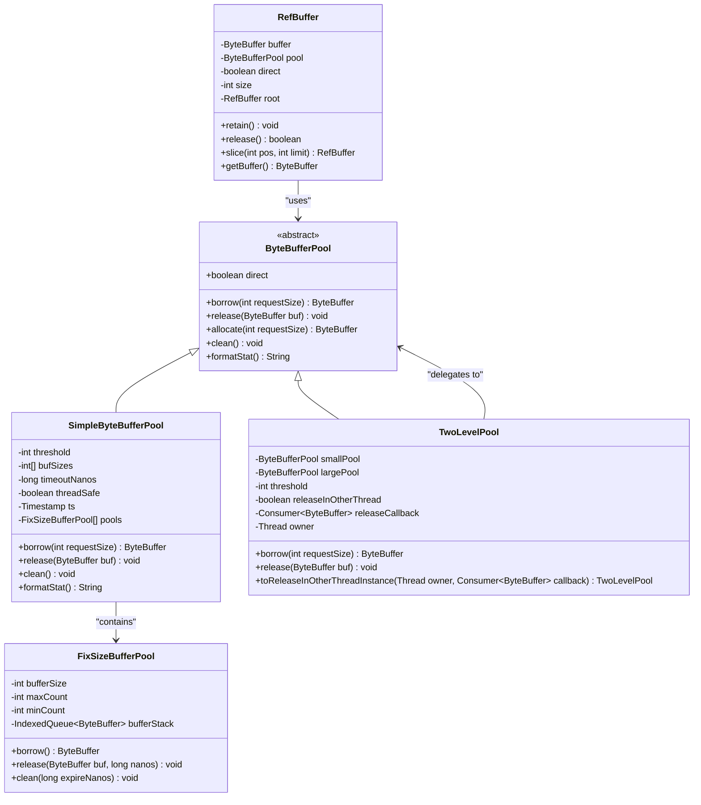
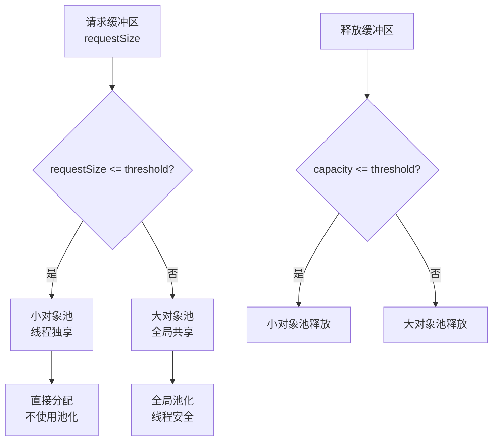

# 内存管理与对象池

<cite>
**本文档中引用的文件**
- [ByteBufferPool.java](file://client/src/main/java/com/github/dtprj/dongting/buf/ByteBufferPool.java)
- [SimpleByteBufferPool.java](file://client/src/main/java/com/github/dtprj/dongting/buf/SimpleByteBufferPool.java)
- [FixSizeBufferPool.java](file://client/src/main/java/com/github/dtprj/dongting/buf/FixSizeBufferPool.java)
- [TwoLevelPool.java](file://client/src/main/java/com/github/dtprj/dongting/buf/TwoLevelPool.java)
- [RefBuffer.java](file://client/src/main/java/com/github/dtprj/dongting/buf/RefBuffer.java)
- [DefaultPoolFactory.java](file://client/src/main/java/com/github/dtprj/dongting/buf/DefaultPoolFactory.java)
- [PoolFactory.java](file://client/src/main/java/com/github/dtprj/dongting/buf/PoolFactory.java)
- [SimpleByteBufferPoolTest.java](file://client/src/test/java/com/github/dtprj/dongting/buf/SimpleByteBufferPoolTest.java)
- [RefBufferTest.java](file://client/src/test/java/com/github/dtprj/dongting/buf/RefBufferTest.java)
- [2023_07_28_dongting的对象池.txt](file://devlogs/2023_07_28_dongting的对象池.txt)
</cite>

## 目录
1. [简介](#简介)
2. [核心架构概览](#核心架构概览)
3. [ByteBufferPool接口设计](#bytebufferpool接口设计)
4. [SimpleByteBufferPool实现](#simplebytebufferpool实现)
5. [FixSizeBufferPool机制](#fixsizebufferpool机制)
6. [TwoLevelPool分层策略](#twolevelpool分层策略)
7. [RefBuffer引用计数机制](#refbuffer引用计数机制)
8. [性能优化与调优策略](#性能优化与调优策略)
9. [最佳实践与使用指南](#最佳实践与使用指南)
10. [故障排除与调试](#故障排除与调试)
11. [总结](#总结)

## 简介

Dongting框架的内存管理系统是一个精心设计的对象池解决方案，专门针对ByteBuffer的高效管理和重用。该系统通过多层次的池化策略，显著减少了垃圾回收压力，提升了系统整体性能。

现代JVM虽然具有高效的对象分配和垃圾回收机制，但对于ByteBuffer这种可大可小的对象，传统的直接分配方式在高并发场景下会产生显著的GC压力。Dongting的对象池系统通过智能的内存管理策略，解决了这一问题。

## 核心架构概览



**图表来源**
- [ByteBufferPool.java](file://client/src/main/java/com/github/dtprj/dongting/buf/ByteBufferPool.java#L20-L45)
- [SimpleByteBufferPool.java](file://client/src/main/java/com/github/dtprj/dongting/buf/SimpleByteBufferPool.java#L30-L100)
- [FixSizeBufferPool.java](file://client/src/main/java/com/github/dtprj/dongting/buf/FixSizeBufferPool.java#L20-L50)
- [TwoLevelPool.java](file://client/src/main/java/com/github/dtprj/dongting/buf/TwoLevelPool.java#L20-L50)
- [RefBuffer.java](file://client/src/main/java/com/github/dtprj/dongting/buf/RefBuffer.java#L25-L60)

## ByteBufferPool接口设计

ByteBufferPool是整个对象池系统的核心抽象，定义了统一的缓冲区管理接口。

### 核心方法设计

```java
public abstract class ByteBufferPool {
    protected final boolean direct;
    
    public abstract ByteBuffer borrow(int requestSize);
    public abstract void release(ByteBuffer buf);
    public abstract ByteBuffer allocate(int requestSize);
    public abstract void clean();
    public abstract String formatStat();
}
```

### 设计理念

1. **统一抽象**：所有缓冲区管理器都遵循相同的接口规范
2. **类型安全**：通过direct参数区分堆内和堆外内存
3. **生命周期管理**：明确的borrow/release配对机制
4. **统计信息**：提供详细的性能监控和统计功能

**章节来源**
- [ByteBufferPool.java](file://client/src/main/java/com/github/dtprj/dongting/buf/ByteBufferPool.java#L20-L45)

## SimpleByteBufferPool实现

SimpleByteBufferPool是最基础的对象池实现，采用分桶策略管理不同大小的缓冲区。

### 分桶策略

系统将缓冲区按照预定义的大小进行分类：

```java
public static final int[] DEFAULT_BUF_SIZE = new int[]{
    1024, 2048, 4096, 8192, 16 * 1024,
    32 * 1024, 64 * 1024, 128 * 1024, 
    256 * 1024, 512 * 1024, 1024 * 1024, 
    2 * 1024 * 1024, 4 * 1024 * 1024
};
```

### 性能特性

- **小对象快速分配**：小于等于64字节的缓冲区分配耗时小于9纳秒
- **中等对象适中开销**：65字节到1024字节的分配在27-104纳秒之间
- **大对象合理控制**：16KB以上的分配需要1188纳秒
- **命中率优化**：使用SimpleByteBufferPool时，命中情况下的耗时在6-11纳秒

### 配置参数

```java
// 最小容量配置
public static final int[] DEFAULT_MIN_COUNT = new int[]{
    16, 16, 16, 16, 16, 16, 8, 4, 2, 1, 0, 0, 0
};

// 最大容量配置  
public static final int[] DEFAULT_MAX_COUNT = new int[]{
    1024, 512, 256, 128, 128, 128, 128, 64, 64, 32, 16, 8, 4
};
```

### 内存清理机制

SimpleByteBufferPool实现了智能的内存清理策略：

```java
private void clean0() {
    long expireNanos = ts.nanoTime - this.timeoutNanos;
    for (FixSizeBufferPool pool : pools) {
        pool.clean(expireNanos);
    }
}
```

**章节来源**
- [SimpleByteBufferPool.java](file://client/src/main/java/com/github/dtprj/dongting/buf/SimpleByteBufferPool.java#L40-L150)
- [SimpleByteBufferPool.java](file://client/src/main/java/com/github/dtprj/dongting/buf/SimpleByteBufferPool.java#L200-L250)

## FixSizeBufferPool机制

FixSizeBufferPool负责管理固定大小的缓冲区，是SimpleByteBufferPool的基础单元。

### 核心设计原理

```java
class FixSizeBufferPool {
    private final int bufferSize;
    private final int maxCount;
    private final int minCount;
    private final IndexedQueue<ByteBuffer> bufferStack;
    
    // 使用魔数检测缓冲区完整性
    private static final int MAGIC = 0xEA1D9C07;
    private static final int MAGIC_INDEX = 0;
    private static final int RETURN_TIME_INDEX = 4;
}
```

### 缓冲区完整性检查

通过在缓冲区头部存储魔数来检测缓冲区是否被重复释放或已释放后再次使用：

```java
public ByteBuffer borrow() {
    ByteBuffer buf = bufferStack.removeLast();
    if (buf != null) {
        int bufMagic = buf.getInt(MAGIC_INDEX);
        if (bufMagic != MAGIC) {
            throw new DtException("A bug may exist where the buffer is written to after release.");
        }
        buf.putInt(MAGIC_INDEX, 0); // 清除魔数标记
    }
    return buf;
}
```

### 内存共享控制

通过shareSize参数控制池化内存的总大小，防止内存过度消耗：

```java
public void release(ByteBuffer buf, long nanos) {
    if (bufferStack.size() >= maxCount) {
        long newUsedShareSize = p.currentUsedShareSize + bufferSize;
        if (newUsedShareSize > shareSize) {
            // 超过共享内存限制，直接释放
            if (direct) {
                SimpleByteBufferPool.VF.releaseDirectBuffer(buf);
            }
            return;
        } else {
            p.currentUsedShareSize = newUsedShareSize;
        }
    }
    // 正常返回池中
    buf.putInt(MAGIC_INDEX, MAGIC);
    buf.putLong(RETURN_TIME_INDEX, nanos);
    bufferStack.addLast(buf);
}
```

**章节来源**
- [FixSizeBufferPool.java](file://client/src/main/java/com/github/dtprj/dongting/buf/FixSizeBufferPool.java#L20-L80)
- [FixSizeBufferPool.java](file://client/src/main/java/com/github/dtprj/dongting/buf/FixSizeBufferPool.java#L60-L120)

## TwoLevelPool分层策略

TwoLevelPool采用两级分层策略，针对不同大小的缓冲区采用不同的管理方式。

### 分层策略设计



**图表来源**
- [TwoLevelPool.java](file://client/src/main/java/com/github/dtprj/dongting/buf/TwoLevelPool.java#L40-L70)

### 线程安全保障

TwoLevelPool支持跨线程释放的安全机制：

```java
public TwoLevelPool toReleaseInOtherThreadInstance(Thread owner, Consumer<ByteBuffer> releaseCallback) {
    return new TwoLevelPool(direct, smallPool, largePool,
            threshold, true, releaseCallback, owner);
}
```

当在非拥有线程释放缓冲区时，会将释放操作委托给拥有线程执行：

```java
@Override
public void release(ByteBuffer buf) {
    int c = buf.capacity();
    if (c <= threshold) {
        if (releaseInOtherThread && owner != Thread.currentThread()) {
            releaseCallback.accept(buf); // 委托给拥有线程
        } else {
            smallPool.release(buf);
        }
    } else {
        largePool.release(buf);
    }
}
```

### 全局池配置

TwoLevelPool使用DefaultPoolFactory提供的全局池配置：

```java
public static final int[] DEFAULT_GLOBAL_SIZE = new int[]{
    32 * 1024, 64 * 1024, 128 * 1024, 256 * 1024, 512 * 1024,
    1024 * 1024, 2 * 1024 * 1024, 4 * 1024 * 1024
};
```

**章节来源**
- [TwoLevelPool.java](file://client/src/main/java/com/github/dtprj/dongting/buf/TwoLevelPool.java#L20-L80)
- [DefaultPoolFactory.java](file://client/src/main/java/com/github/dtprj/dongting/buf/DefaultPoolFactory.java#L30-L60)

## RefBuffer引用计数机制

RefBuffer是Dongting框架中用于管理ByteBuffer引用计数的高级封装类。

### 引用计数设计

```java
public final class RefBuffer extends RefCount implements Encodable {
    private ByteBuffer buffer;
    private final ByteBufferPool pool;
    private final boolean direct;
    private final int size;
    private final RefBuffer root;
}
```

### 构造函数策略

RefBuffer提供了多种构造策略以适应不同的使用场景：

```java
// 直接从池中借用
RefBuffer(boolean plain, ByteBufferPool pool, int requestSize, int threshold) {
    super(plain, !pool.isDirect() && requestSize < threshold);
    if (requestSize < threshold) {
        this.buffer = pool.allocate(requestSize);
        this.pool = null;
    } else {
        this.buffer = pool.borrow(requestSize);
        this.pool = pool;
    }
}

// 包装现有缓冲区
private RefBuffer(ByteBuffer buf) {
    super(true, true);
    this.buffer = buf;
    this.pool = null;
}
```

### 引用计数管理

```java
@Override
public void retain(int increment) {
    if (root != null) {
        root.retain(increment);
        return;
    }
    super.retain(increment);
}

@Override
public boolean release(int decrement) {
    if (root != null) {
        if (root.release(decrement)) {
            this.buffer = null;
            return true;
        } else {
            return false;
        }
    }
    return super.release(decrement);
}
```

### 切片支持

RefBuffer支持创建缓冲区切片，实现零拷贝的数据共享：

```java
public RefBuffer slice(int absolutePos, int absoluteLimit) {
    RefBuffer r = this.root == null ? this : this.root;
    return new RefBuffer(r, absolutePos, absoluteLimit);
}
```

### Plain模式优化

为了在单线程场景下减少开销，RefBuffer支持Plain模式：

```java
// Plain模式适用于单线程环境
super(plain, !pool.isDirect() && requestSize < threshold);
```

**章节来源**
- [RefBuffer.java](file://client/src/main/java/com/github/dtprj/dongting/buf/RefBuffer.java#L30-L80)
- [RefBuffer.java](file://client/src/main/java/com/github/dtprj/dongting/buf/RefBuffer.java#L80-L130)

## 性能优化与调优策略

### 初始容量配置

根据实际使用场景调整池化参数：

```java
// 高并发场景配置
SimpleByteBufferPoolConfig config = new SimpleByteBufferPoolConfig(ts, direct, 64, false);
config.setBufSizes(new int[]{1024, 2048, 4096, 8192, 16*1024});
config.setMinCount(new int[]{128, 64, 32, 16, 8});
config.setMaxCount(new int[]{8192, 4096, 2048, 1024, 512});

// 大文件传输场景配置
config.setBufSizes(new int[]{64*1024, 128*1024, 256*1024, 512*1024, 1024*1024});
config.setMinCount(new int[]{32, 16, 8, 4, 2});
config.setMaxCount(new int[]{256, 128, 64, 32, 16});
```

### 最大容量调优

合理的最大容量设置可以平衡内存使用和性能：

```java
// 计算总内存占用
long totalMemory = SimpleByteBufferPool.calcTotalSize(bufSizes, maxCounts);
System.out.println("Total memory: " + totalMemory + " bytes");

// 根据可用内存调整
if (totalMemory > Runtime.getRuntime().maxMemory() * 0.2) {
    // 调整配置以降低内存占用
}
```

### 线程局部缓存

对于单线程场景，可以禁用线程安全以获得更好的性能：

```java
// 单线程环境使用非线程安全池
SimpleByteBufferPool pool = new SimpleByteBufferPool(config);
// 或者使用Plain模式的RefBuffer
RefBuffer refBuffer = new RefBuffer(true, pool, size, threshold);
```

### 清理策略优化

```java
// 定期清理过期缓冲区
Runnable cleaner = () -> {
    pool.clean();
    // 可选：清理全局池
    DefaultPoolFactory.GLOBAL_DIRECT_POOL.clean();
    DefaultPoolFactory.GLOBAL_HEAP_POOL.clean();
};
ScheduledExecutorService scheduler = Executors.newScheduledThreadPool(1);
scheduler.scheduleWithFixedDelay(cleaner, 1, 1, TimeUnit.SECONDS);
```

**章节来源**
- [SimpleByteBufferPool.java](file://client/src/main/java/com/github/dtprj/dongting/buf/SimpleByteBufferPool.java#L100-L150)
- [DefaultPoolFactory.java](file://client/src/main/java/com/github/dtprj/dongting/buf/DefaultPoolFactory.java#L40-L80)

## 最佳实践与使用指南

### 正确的使用模式

```java
// 1. 获取池实例
PoolFactory factory = new DefaultPoolFactory();
ByteBufferPool pool = factory.createPool(new Timestamp(), true);

try {
    // 2. 借用缓冲区
    ByteBuffer buffer = pool.borrow(1024);
    
    try {
        // 3. 使用缓冲区
        buffer.put(data);
        
        // 4. 处理数据...
        
    } finally {
        // 5. 必须释放缓冲区
        pool.release(buffer);
    }
} finally {
    // 6. 销毁池（可选）
    factory.destroyPool(pool);
}
```

### RefBuffer使用示例

```java
// 创建RefBuffer
RefBuffer refBuffer = new RefBuffer(false, pool, 1024, 128);

try {
    // 使用RefBuffer
    ByteBuffer buffer = refBuffer.getBuffer();
    buffer.put(data);
    
    // 传递给其他线程
    processAsync(refBuffer);
    
} finally {
    // 自动释放，无需手动调用release
    refBuffer.release();
}
```

### 错误处理最佳实践

```java
// 检查缓冲区状态
public void safeUseBuffer(ByteBuffer buffer) {
    if (buffer == null) {
        throw new IllegalArgumentException("Buffer cannot be null");
    }
    
    if (buffer.capacity() == 0) {
        throw new IllegalStateException("Buffer is empty");
    }
    
    // 使用前验证
    if (buffer.position() > buffer.limit()) {
        throw new IllegalStateException("Invalid buffer position");
    }
}
```

### 性能监控

```java
// 定期输出统计信息
public void monitorPool(ByteBufferPool pool) {
    String stats = pool.formatStat();
    System.out.println("Pool Statistics:\n" + stats);
    
    // 解析统计信息
    String[] parts = stats.split(",");
    for (String part : parts) {
        if (part.contains("borrow")) {
            System.out.println("Borrow operations: " + part.trim());
        } else if (part.contains("release")) {
            System.out.println("Release operations: " + part.trim());
        }
    }
}
```

**章节来源**
- [SimpleByteBufferPoolTest.java](file://client/src/test/java/com/github/dtprj/dongting/buf/SimpleByteBufferPoolTest.java#L80-L120)
- [RefBufferTest.java](file://client/src/test/java/com/github/dtprj/dongting/buf/RefBufferTest.java#L25-L35)

## 故障排除与调试

### 常见问题诊断

#### 1. 缓冲区重复释放

```java
// 问题症状：抛出DtException异常
// "A bug may exist where the buffer is released twice."

// 解决方案：检查引用计数
public void debugRefBuffer(RefBuffer refBuffer) {
    System.out.println("Buffer state: " + refBuffer.isReleased());
    System.out.println("Retain count: " + refBuffer.getRetainCount());
}
```

#### 2. 缓冲区完整性破坏

```java
// 问题症状：缓冲区内容被意外修改
// "A bug may exist where the buffer is written to after release."

// 解决方案：启用调试模式
public void enableDebugMode() {
    // 在开发环境中启用额外的检查
    // 这些检查在生产环境中会被移除
}
```

#### 3. 内存泄漏检测

```java
// 监控池化内存使用
public void detectMemoryLeak(ByteBufferPool pool) {
    String stats = pool.formatStat();
    if (stats.contains("borrow too large")) {
        System.out.println("Warning: Large buffers are being allocated directly");
        System.out.println("Consider increasing pool sizes");
    }
}
```

### 调试工具

```java
// 缓冲区状态检查器
public class BufferDebugger {
    public static void dumpBufferState(ByteBuffer buffer) {
        System.out.println("Buffer capacity: " + buffer.capacity());
        System.out.println("Buffer position: " + buffer.position());
        System.out.println("Buffer limit: " + buffer.limit());
        System.out.println("Buffer remaining: " + buffer.remaining());
        System.out.println("Buffer is direct: " + buffer.isDirect());
    }
    
    public static void validateBuffer(ByteBuffer buffer) {
        if (buffer.position() > buffer.limit()) {
            throw new IllegalStateException("Invalid buffer state");
        }
        
        if (buffer.hasArray()) {
            System.out.println("Buffer backed by array: " + buffer.array().length);
        }
    }
}
```

### 性能分析

```java
// 性能基准测试
public class PoolBenchmark {
    public static void benchmarkPool(ByteBufferPool pool, int iterations) {
        long startTime = System.nanoTime();
        
        for (int i = 0; i < iterations; i++) {
            ByteBuffer buffer = pool.borrow(1024);
            pool.release(buffer);
        }
        
        long endTime = System.nanoTime();
        double avgTime = (endTime - startTime) / (double) iterations;
        
        System.out.println("Average allocation time: " + avgTime + " ns");
        System.out.println("Throughput: " + (iterations * 1000000000L / (endTime - startTime)) + " ops/sec");
    }
}
```

**章节来源**
- [SimpleByteBufferPoolTest.java](file://client/src/test/java/com/github/dtprj/dongting/buf/SimpleByteBufferPoolTest.java#L300-L350)
- [2023_07_28_dongting的对象池.txt](file://devlogs/2023_07_28_dongting的对象池.txt#L8-L10)

## 总结

Dongting的内存管理系统通过精心设计的对象池架构，有效解决了高并发场景下的内存管理挑战。系统的主要优势包括：

### 核心优势

1. **多层次设计**：SimpleByteBufferPool、FixSizeBufferPool和TwoLevelPool形成完整的层次结构
2. **智能分层**：根据缓冲区大小采用不同的管理策略，平衡性能和资源利用
3. **引用计数**：RefBuffer提供安全的引用计数机制，简化内存管理
4. **线程安全**：支持单线程和多线程两种模式，适应不同场景需求
5. **完整性保护**：通过魔数检测和引用计数防止内存错误

### 性能表现

- **小对象**：分配速度达到纳秒级别，适合高频短生命周期对象
- **中等对象**：1KB以上的缓冲区池化效果显著，减少GC压力
- **大对象**：全局池化策略提升利用率，避免重复分配开销

### 应用建议

1. **合理配置**：根据实际使用场景调整池化参数
2. **正确使用**：严格遵循borrow/release配对原则
3. **监控维护**：定期检查池化状态和内存使用情况
4. **错误处理**：建立完善的异常处理和恢复机制

通过遵循这些最佳实践，开发者可以充分发挥Dongting对象池系统的性能优势，构建高效稳定的内存管理系统。