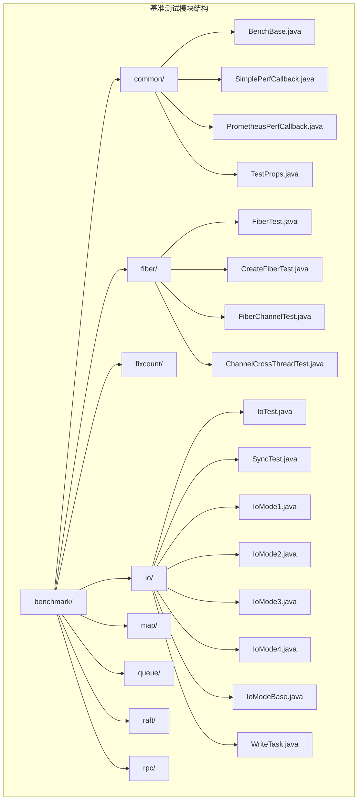
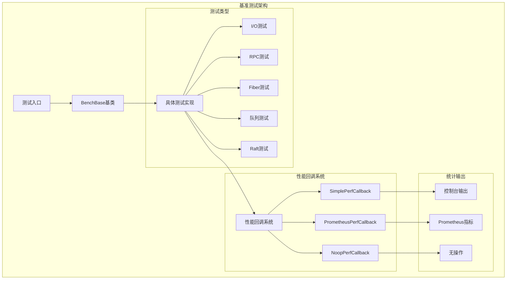
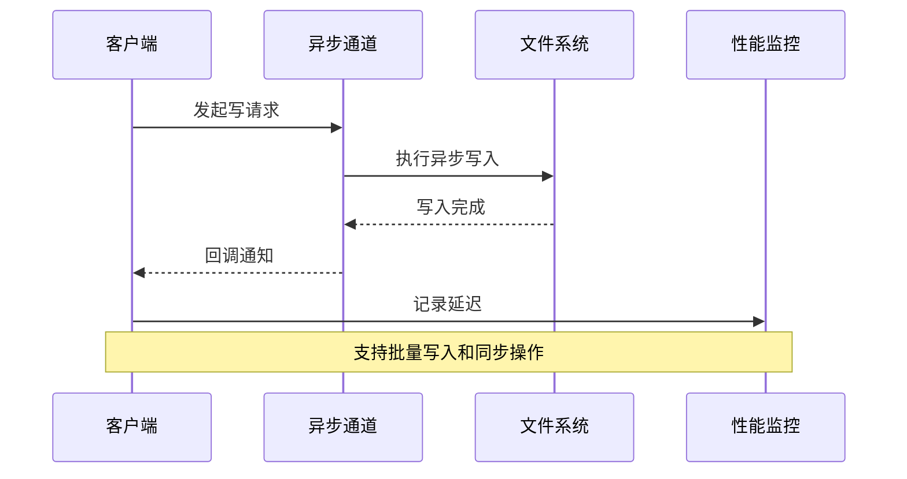
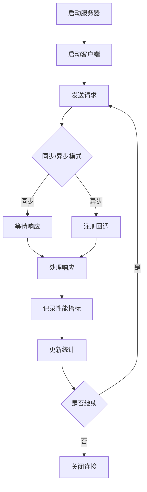
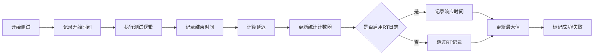
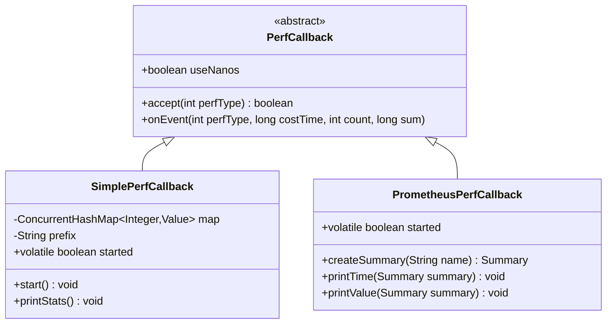

# 基准测试方法详细指南

<cite>
**本文档中引用的文件**
- [BenchBase.java](file://benchmark/src/main/java/com/github/dtprj/dongting/bench/common/BenchBase.java)
- [SimplePerfCallback.java](file://benchmark/src/main/java/com/github/dtprj/dongting/bench/common/SimplePerfCallback.java)
- [PrometheusPerfCallback.java](file://benchmark/src/main/java/com/github/dtprj/dongting/bench/common/PrometheusPerfCallback.java)
- [IoTest.java](file://benchmark/src/main/java/com/github/dtprj/dongting/bench/io/IoTest.java)
- [RpcBenchmark.java](file://benchmark/src/main/java/com/github/dtprj/dongting/bench/rpc/RpcBenchmark.java)
- [MpscCountBenchBase.java](file://benchmark/src/main/java/com/github/dtprj/dongting/bench/fixcount/MpscCountBenchBase.java)
- [FiberTest.java](file://benchmark/src/main/java/com/github/dtprj/dongting/bench/fiber/FiberTest.java)
- [MpscQueueTest.java](file://benchmark/src/main/java/com/github/dtprj/dongting/bench/queue/MpscQueueTest.java)
- [TestProps.java](file://benchmark/src/main/java/com/github/dtprj/dongting/bench/common/TestProps.java)
</cite>

## 目录
1. [简介](#简介)
2. [项目结构](#项目结构)
3. [核心组件](#核心组件)
4. [架构概览](#架构概览)
5. [详细组件分析](#详细组件分析)
6. [基准测试类型](#基准测试类型)
7. [性能数据收集](#性能数据收集)
8. [测试配置与运行](#测试配置与运行)
9. [结果分析与解读](#结果分析与解读)
10. [最佳实践](#最佳实践)
11. [故障排除](#故障排除)
12. [总结](#总结)

## 简介

Dongting基准测试框架是一个全面的性能测试解决方案，专为高并发系统设计。该框架提供了多种基准测试工具，包括I/O性能测试、RPC性能测试、Fiber调度测试、队列性能测试等。通过使用BenchBase作为基准测试基类，开发者可以轻松创建自定义性能测试用例，并获得精确的吞吐量、延迟等关键指标。

## 项目结构

基准测试模块位于`benchmark/src/main/java/com/github/dtprj/dongting/bench`目录下，包含以下主要分类：



**图表来源**
- [BenchBase.java](file://benchmark/src/main/java/com/github/dtprj/dongting/bench/common/BenchBase.java#L1-L153)
- [IoTest.java](file://benchmark/src/main/java/com/github/dtprj/dongting/bench/io/IoTest.java#L1-L196)

**章节来源**
- [BenchBase.java](file://benchmark/src/main/java/com/github/dtprj/dongting/bench/common/BenchBase.java#L1-L153)

## 核心组件

### BenchBase - 基准测试基类

BenchBase是所有基准测试的基础类，提供了标准化的测试流程和性能统计功能：

```java
public abstract class BenchBase {
    protected final int threadCount;
    private final long testTime;
    private final long warmupTime;
    protected AtomicInteger state = new AtomicInteger(STATE_WARMUP);
    
    // 测试状态常量
    protected static final int STATE_WARMUP = 0;
    protected static final int STATE_TEST = 1;
    protected static final int STATE_BEFORE_SHUTDOWN = 2;
    protected static final int STATE_AFTER_SHUTDOWN = 3;
}
```

核心特性：
- **多线程支持**：支持指定数量的并发线程
- **预热阶段**：可配置的预热时间，确保JVM达到稳定状态
- **测试阶段**：实际的性能测试执行
- **统计收集**：自动收集成功/失败计数、响应时间等指标
- **生命周期管理**：完整的初始化、运行、清理流程

### 性能回调机制

框架提供了两种主要的性能数据收集器：

#### SimplePerfCallback
用于本地性能统计和日志记录：

```java
public class SimplePerfCallback extends PerfCallback {
    private final ConcurrentHashMap<Integer, Value> map = new ConcurrentHashMap<>();
    private final String prefix;
    
    // 支持的性能指标类型
    case RPC_D_ACQUIRE -> prefix + "rpc_acquire";
    case RPC_D_WORKER_QUEUE -> prefix + "rpc_worker_queue";
    case RPC_D_WORKER_WORK -> prefix + "rpc_worker_work";
    case FIBER_D_POLL -> prefix + "fiber_poll";
    case RAFT_D_LOG_WRITE1 -> prefix + "raft_log_write1";
}
```

#### PrometheusPerfCallback
用于集成Prometheus监控系统：

```java
protected Summary createSummary(String name) {
    return Summary.build()
            .name(name)
            .help(name)
            .quantile(0.0, 0.0)      // 最小值
            .quantile(0.5, 0.02)     // 中位数
            .quantile(0.99, 0.003)   // 99百分位
            .quantile(1.0, 0.0)      // 最大值
            .register();
}
```

**章节来源**
- [BenchBase.java](file://benchmark/src/main/java/com/github/dtprj/dongting/bench/common/BenchBase.java#L25-L153)
- [SimplePerfCallback.java](file://benchmark/src/main/java/com/github/dtprj/dongting/bench/common/SimplePerfCallback.java#L25-L152)
- [PrometheusPerfCallback.java](file://benchmark/src/main/java/com/github/dtprj/dongting/bench/common/PrometheusPerfCallback.java#L25-L103)

## 架构概览

基准测试框架采用分层架构设计，确保测试的可扩展性和可维护性：



**图表来源**
- [BenchBase.java](file://benchmark/src/main/java/com/github/dtprj/dongting/bench/common/BenchBase.java#L25-L50)
- [SimplePerfCallback.java](file://benchmark/src/main/java/com/github/dtprj/dongting/bench/common/SimplePerfCallback.java#L25-L50)

## 详细组件分析

### I/O性能测试

IoTest类展示了如何进行异步文件I/O性能测试：



**图表来源**
- [IoTest.java](file://benchmark/src/main/java/com/github/dtprj/dongting/bench/io/IoTest.java#L60-L120)

关键参数配置：
```java
protected static final int FILE_SIZE = 128 * 1024 * 1024;  // 128MB文件
protected static final int BUFFER_SIZE = 4 * 1024;        // 4KB缓冲区
protected static final int MAX_PENDING = 1024;           // 最大挂起请求数
```

### RPC性能测试

RpcBenchmark演示了网络通信性能测试：



**图表来源**
- [RpcBenchmark.java](file://benchmark/src/main/java/com/github/dtprj/dongting/bench/rpc/RpcBenchmark.java#L100-L161)

### 队列性能测试

MpscQueueTest展示了多生产者单消费者队列的性能测试：

```java
public class MpscQueueTest extends BenchBase {
    private final MpscLinkedQueue<Object> queue = MpscLinkedQueue.newInstance();
    
    @Override
    public void test(int threadIndex, long startTime, int state) {
        queue.offer(data);  // 生产者操作
    }
    
    private void consumerRun() {
        MpscLinkedQueue<Object> queue = this.queue;
        while ((s = state.getOpaque()) < STATE_BEFORE_SHUTDOWN) {
            if (queue.relaxedPoll() != null) {
                success(s);  // 消费者操作
            }
        }
    }
}
```

**章节来源**
- [IoTest.java](file://benchmark/src/main/java/com/github/dtprj/dongting/bench/io/IoTest.java#L25-L196)
- [RpcBenchmark.java](file://benchmark/src/main/java/com/github/dtprj/dongting/bench/rpc/RpcBenchmark.java#L25-L162)
- [MpscQueueTest.java](file://benchmark/src/main/java/com/github/dtprj/dongting/bench/queue/MpscQueueTest.java#L15-L53)

## 基准测试类型

### I/O性能测试

I/O测试专注于磁盘读写性能评估：

1. **异步文件I/O测试**：使用AsynchronousFileChannel进行非阻塞I/O操作
2. **同步文件I/O测试**：使用传统的同步I/O接口
3. **多文件并发测试**：同时测试多个文件的并发写入性能

### RPC性能测试

RPC测试评估网络通信性能：

1. **请求-响应模式**：测试典型的RPC调用性能
2. **异步回调模式**：测试异步RPC的性能特征
3. **连接池性能**：评估连接复用的效果

### Fiber调度测试

Fiber测试评估协程调度性能：

1. **Fiber创建开销**：测量Fiber实例化的时间成本
2. **跨线程通信**：测试Fiber在不同线程间的通信效率
3. **通道操作性能**：评估FiberChannel的性能特征

### 队列性能测试

队列测试评估各种并发队列的性能：

1. **MPSC队列**：多生产者单消费者队列性能
2. **CLQ队列**：ConcurrentLinkedQueue性能测试
3. **阻塞队列**：LinkedBlockingQueue性能评估

## 性能数据收集

### 数据收集流程



**图表来源**
- [BenchBase.java](file://benchmark/src/main/java/com/github/dtprj/dongting/bench/common/BenchBase.java#L100-L153)

### 统计指标

框架自动收集以下关键指标：

1. **吞吐量指标**：
   - 成功操作次数（successCount）
   - 失败操作次数（failCount）
   - 操作每秒（OPS）

2. **延迟指标**：
   - 平均响应时间（Avg time）
   - 最大响应时间（Max time）
   - 百分位延迟（P50, P99）

3. **其他指标**：
   - 总执行时间
   - 同步操作延迟
   - 写入延迟

### 性能回调系统



**图表来源**
- [SimplePerfCallback.java](file://benchmark/src/main/java/com/github/dtprj/dongting/bench/common/SimplePerfCallback.java#L25-L80)
- [PrometheusPerfCallback.java](file://benchmark/src/main/java/com/github/dtprj/dongting/bench/common/PrometheusPerfCallback.java#L25-L60)

**章节来源**
- [SimplePerfCallback.java](file://benchmark/src/main/java/com/github/dtprj/dongting/bench/common/SimplePerfCallback.java#L25-L152)
- [PrometheusPerfCallback.java](file://benchmark/src/main/java/com/github/dtprj/dongting/bench/common/PrometheusPerfCallback.java#L25-L103)

## 测试配置与运行

### 基本配置

每个基准测试都继承自BenchBase，需要配置以下参数：

```java
public class CustomBenchmark extends BenchBase {
    public CustomBenchmark(int threadCount, long testTime, long warmupTime) {
        super(threadCount, testTime, warmupTime);
    }
    
    @Override
    public void init() {
        // 初始化测试环境
    }
    
    @Override
    public void test(int threadIndex, long startTime, int state) {
        // 实际的测试逻辑
    }
    
    @Override
    public void shutdown() {
        // 清理测试资源
    }
}
```

### 运行示例

```java
// 创建并运行基准测试
CustomBenchmark benchmark = new CustomBenchmark(
    4,      // 4个线程
    5000,   // 测试5秒
    1000    // 预热1秒
);

benchmark.setLogRt(true);  // 启用响应时间记录
benchmark.start();         // 开始测试
```

### 高级配置选项

1. **线程配置**：
   - 线程数量：根据CPU核心数调整
   - 线程命名：便于调试和监控

2. **时间配置**：
   - 测试时长：建议至少30秒以上
   - 预热时长：确保JVM达到稳定状态
   - 超时设置：避免测试卡死

3. **性能回调配置**：
   - SimplePerfCallback：本地统计和日志
   - PrometheusPerfCallback：远程监控集成
   - NoopPerfCallback：禁用性能统计

## 结果分析与解读

### 输出格式

基准测试完成后，系统会输出以下信息：

```
success sc:123456, ops=24,691
fail sc:0, ops=0
Max time: 1,234 us
Avg time: 42 us
```

### 关键指标解读

1. **OPS（每秒操作数）**：
   - 衡量系统的吞吐能力
   - 反映系统在单位时间内能处理的操作数量

2. **平均响应时间**：
   - 平均每次操作的耗时
   - 影响用户体验的重要指标

3. **最大响应时间**：
   - 最坏情况下的操作耗时
   - 关键业务场景的性能保证

4. **百分位延迟**：
   - P50（中位数）：50%的操作在该时间内完成
   - P99（99百分位）：99%的操作在该时间内完成

### Prometheus集成

使用PrometheusPerfCallback时，可以通过Prometheus抓取以下指标：

```yaml
# 示例Prometheus指标
dongting_rpc_acquire: call 1000, avg 1.234us, total 1.2ms, p50 1.0us, p99 2.5us, max 10.0us
dongting_rpc_worker_queue: call 1000, avg 0.567us, total 0.6ms, p50 0.5us, p99 1.2us, max 5.0us
```

## 最佳实践

### 测试环境准备

1. **硬件要求**：
   - 使用稳定的测试环境
   - 避免其他进程干扰
   - 确保足够的内存和CPU资源

2. **软件配置**：
   ```bash
   # JVM参数建议
   -XX:+UseZGC
   -Xmx4G
   -Xms4G
   -XX:+UnlockExperimentalVMOptions
   -XX:+AggressiveOpts
   ```

3. **操作系统优化**：
   - 禁用不必要的后台服务
   - 调整文件描述符限制
   - 使用实时优先级（如适用）

### 预热策略

```java
@Override
protected void afterWarmup() {
    // 在预热结束后启动性能统计
    PerfCallback callback = getPerfCallback();
    if (callback instanceof SimplePerfCallback) {
        ((SimplePerfCallback) callback).start();
    }
}
```

### 结果统计

1. **多次运行**：
   - 至少运行3次取平均值
   - 排除异常值的影响
   - 分析结果的稳定性

2. **对比分析**：
   - 与历史版本对比
   - 与其他系统对比
   - 分析性能瓶颈

3. **报告生成**：
   - 自动生成测试报告
   - 包含详细的性能指标
   - 提供改进建议

### 自定义测试用例

创建自定义基准测试的步骤：

1. **继承BenchBase**：
   ```java
   public class MyCustomTest extends BenchBase {
       public MyCustomTest(int threadCount, long testTime, long warmupTime) {
           super(threadCount, testTime, warmupTime);
       }
   }
   ```

2. **实现测试逻辑**：
   ```java
   @Override
   public void test(int threadIndex, long startTime, int state) {
       try {
           // 执行测试操作
           performOperation();
           success(state);
           
           // 记录响应时间
           logRt(startTime, state);
       } catch (Exception e) {
           fail(state);
       }
   }
   ```

3. **配置性能回调**：
   ```java
   @Override
   public void init() {
       // 配置性能回调
       PerfCallback callback = new SimplePerfCallback("my_test_");
       // 设置到相关组件
   }
   ```

## 故障排除

### 常见问题

1. **测试结果不稳定**：
   - 检查硬件环境是否稳定
   - 增加预热时间和测试时长
   - 排查系统负载

2. **性能指标异常**：
   - 验证测试逻辑正确性
   - 检查性能回调配置
   - 确认统计计数器工作正常

3. **内存泄漏**：
   - 确保正确释放资源
   - 使用弱引用避免循环引用
   - 定期检查内存使用情况

### 调试技巧

1. **启用详细日志**：
   ```java
   benchmark.setLogRt(true);
   ```

2. **使用性能分析工具**：
   - JProfiler
   - VisualVM
   - Flight Recorder

3. **监控系统资源**：
   - CPU使用率
   - 内存占用
   - 网络带宽
   - 磁盘I/O

### 性能优化建议

1. **JVM优化**：
   - 选择合适的垃圾收集器
   - 调整堆大小
   - 启用JIT编译优化

2. **代码优化**：
   - 减少对象分配
   - 使用对象池
   - 避免锁竞争

3. **系统优化**：
   - 使用SSD存储
   - 优化网络配置
   - 调整内核参数

## 总结

Dongting基准测试框架提供了一个完整、灵活且高效的性能测试解决方案。通过BenchBase基类和各种专门的测试组件，开发者可以轻松地对系统各个层面进行性能评估。

### 主要优势

1. **全面覆盖**：涵盖I/O、RPC、Fiber、队列等多种性能测试场景
2. **易于使用**：简洁的API设计，快速上手
3. **精确统计**：提供详细的性能指标和统计信息
4. **可扩展性**：支持自定义测试用例和性能回调
5. **监控集成**：支持Prometheus等监控系统

### 应用场景

- **系统性能评估**：全面了解系统性能特征
- **瓶颈识别**：快速定位性能瓶颈
- **版本对比**：比较不同版本的性能差异
- **容量规划**：确定系统承载能力
- **回归测试**：确保性能不退化

通过遵循本指南的最佳实践，开发者可以充分利用Dongting基准测试框架的强大功能，获得准确可靠的性能测试结果，为系统优化和决策提供有力支持。