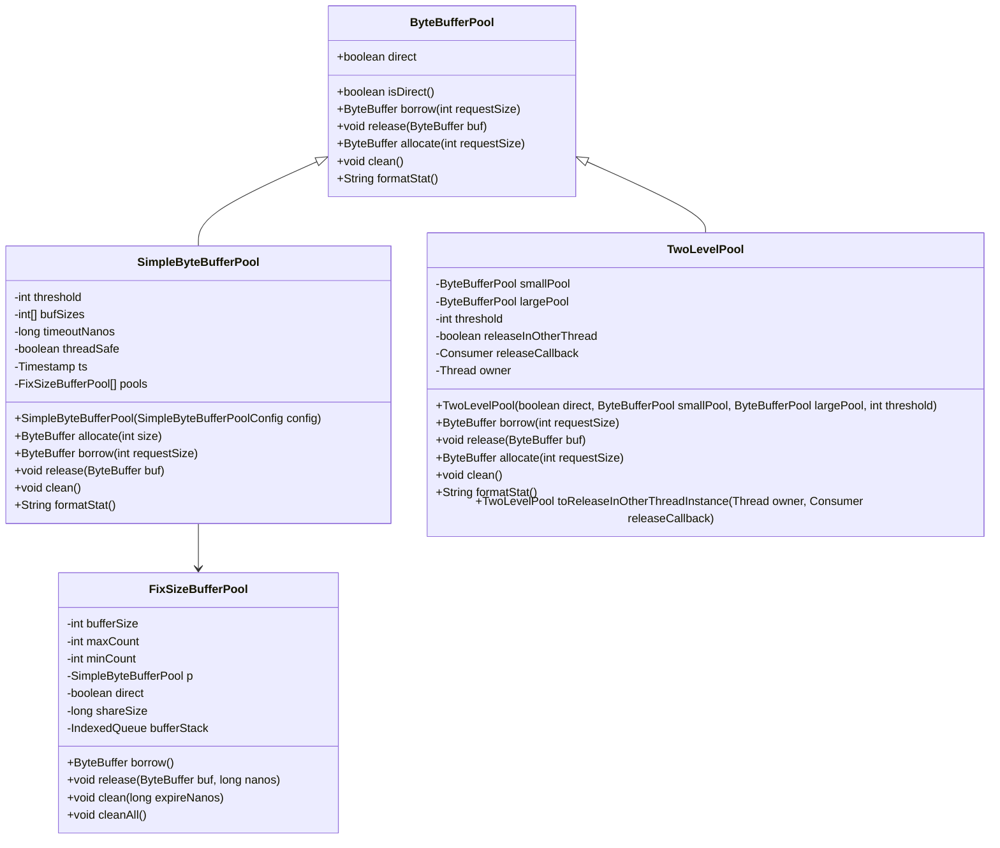

# 性能优化

<cite>
**本文档引用的文件**   
- [ByteBufferPool.java](file://client/src/main/java/com/github/dtprj/dongting/buf/ByteBufferPool.java)
- [SimpleByteBufferPool.java](file://client/src/main/java/com/github/dtprj/dongting/buf/SimpleByteBufferPool.java)
- [FixSizeBufferPool.java](file://client/src/main/java/com/github/dtprj/dongting/buf/FixSizeBufferPool.java)
- [TwoLevelPool.java](file://client/src/main/java/com/github/dtprj/dongting/buf/TwoLevelPool.java)
- [DefaultPoolFactory.java](file://client/src/main/java/com/github/dtprj/dongting/buf/DefaultPoolFactory.java)
- [PbUtil.java](file://client/src/main/java/com/github/dtprj/dongting/codec/PbUtil.java)
- [IndexedQueue.java](file://client/src/main/java/com/github/dtprj/dongting/common/IndexedQueue.java)
- [FiberTest.java](file://benchmark/src/main/java/com/github/dtprj/dongting/bench/fiber/FiberTest.java)
- [2023_07_28_dongting的对象池.txt](file://devlogs/2023_07_28_dongting的对象池.txt)
- [2022_11_25_构建高性能的内存队列.md](file://devlogs/2022_11_25_构建高性能的内存队列.md)
</cite>

## 目录
1. [引言](#引言)
2. [对象池设计与实现](#对象池设计与实现)
3. [其他性能优化技术](#其他性能优化技术)
4. [性能基准测试](#性能基准测试)
5. [性能优化经验与最佳实践](#性能优化经验与最佳实践)
6. [结论](#结论)

## 引言
本文档旨在为Dongting项目提供全面的性能优化指南。重点介绍对象池（ByteBufferPool）的设计原理和使用方法，解释其如何通过复用ByteBuffer来减少GC压力并提升性能。同时，文档将介绍项目中使用的其他性能优化技术，如高效的序列化（PbUtil）和无锁数据结构，并指导用户如何使用benchmark模块进行性能基准测试。最后，文档将分享来自devlogs的性能优化经验和最佳实践。

## 对象池设计与实现

Dongting项目中的对象池设计旨在通过复用ByteBuffer来减少垃圾回收（GC）的压力，特别是在处理大容量缓冲区时。对象池的核心组件包括`ByteBufferPool`、`SimpleByteBufferPool`、`FixSizeBufferPool`和`TwoLevelPool`。

### 对象池架构



**图示来源**
- [ByteBufferPool.java](file://client/src/main/java/com/github/dtprj/dongting/buf/ByteBufferPool.java)
- [SimpleByteBufferPool.java](file://client/src/main/java/com/github/dtprj/dongting/buf/SimpleByteBufferPool.java)
- [FixSizeBufferPool.java](file://client/src/main/java/com/github/dtprj/dongting/buf/FixSizeBufferPool.java)
- [TwoLevelPool.java](file://client/src/main/java/com/github/dtprj/dongting/buf/TwoLevelPool.java)

### SimpleByteBufferPool

`SimpleByteBufferPool`是对象池的核心实现，它将不同大小的缓冲区分别放入不同的池子中，分配算法简单高效。对于小于等于阈值的缓冲区，直接分配而不使用对象池。对于大于阈值的缓冲区，根据请求大小选择合适的池子进行分配。

```java
public SimpleByteBufferPool(SimpleByteBufferPoolConfig config) {
    super(config.isDirect());
    Objects.requireNonNull(config.getBufSizes());
    Objects.requireNonNull(config.getMinCount());
    Objects.requireNonNull(config.getMaxCount());
    this.threadSafe = config.isThreadSafe();
    if (threadSafe) {
        // 线程安全的池应使用专用的Timestamp
        this.ts = new Timestamp();
    } else {
        this.ts = config.getTs();
    }
    this.threshold = config.getThreshold();
    this.bufSizes = config.getBufSizes();
    this.timeoutNanos = config.getTimeoutMillis() * 1000 * 1000;

    int[] bufSizes = this.bufSizes;
    int[] minCount = config.getMinCount();
    int[] maxCount = config.getMaxCount();

    int bufferTypeCount = bufSizes.length;
    if (bufferTypeCount != minCount.length || bufferTypeCount != maxCount.length) {
        throw new IllegalArgumentException();
    }
    if (config.getTimeoutMillis() <= 0) {
        throw new IllegalArgumentException("timeout<=0. timeout=" + config.getTimeoutMillis());
    }
    for (int i : bufSizes) {
        if (i <= 0) {
            throw new IllegalArgumentException("bufSize<0");
        }
    }
    for (int i : minCount) {
        if (i < 0) {
            throw new IllegalArgumentException("minCount<0");
        }
    }
    for (int i = 0; i < maxCount.length; i++) {
        if (maxCount[i] <= 0) {
            throw new IllegalArgumentException("maxCount<0");
        }
        if (maxCount[i] < minCount[i]) {
            throw new IllegalArgumentException("maxCount<minCount");
        }
    }

    this.pools = new FixSizeBufferPool[bufferTypeCount];
    for (int i = 0; i < bufferTypeCount; i++) {
        this.pools[i] = new FixSizeBufferPool(this, direct, config.getShareSize(),
                minCount[i], maxCount[i], bufSizes[i]);
    }
}
```

**代码来源**
- [SimpleByteBufferPool.java](file://client/src/main/java/com/github/dtprj/dongting/buf/SimpleByteBufferPool.java#L100-L150)

### TwoLevelPool

`TwoLevelPool`是两级对象池的实现，将缓冲区分成小对象池和大对象池。小对象池线程独享，大对象池全局共享并通过加锁来分配和释放。这种设计可以提升大对象的利用率和命中率。

```java
public class TwoLevelPool extends ByteBufferPool {
    private final ByteBufferPool smallPool;
    private final ByteBufferPool largePool;
    private final int threshold;
    private final boolean releaseInOtherThread;
    private final Consumer<ByteBuffer> releaseCallback;
    private final Thread owner;

    public TwoLevelPool(boolean direct, ByteBufferPool smallPool, ByteBufferPool largePool, int threshold) {
        this(direct, smallPool, largePool, threshold, false, null, null);
    }

    private TwoLevelPool(boolean direct, ByteBufferPool smallPool, ByteBufferPool largePool,
                         int threshold, boolean releaseInOtherThread,
                         Consumer<ByteBuffer> releaseCallback, Thread owner) {
        super(direct);
        this.smallPool = smallPool;
        this.largePool = largePool;
        this.threshold = threshold;
        this.releaseInOtherThread = releaseInOtherThread;
        this.releaseCallback = releaseCallback;
        this.owner = owner;
    }

    @Override
    public ByteBuffer borrow(int requestSize) {
        Thread owner = this.owner;
        if (owner != null && owner != Thread.currentThread()) {
            throw new DtException("borrow in other thread");
        }
        if (requestSize <= threshold) {
            return smallPool.borrow(requestSize);
        } else {
            return largePool.borrow(requestSize);
        }
    }

    @Override
    public void release(ByteBuffer buf) {
        int c = buf.capacity();
        if (c <= threshold) {
            if (releaseInOtherThread && owner != Thread.currentThread()) {
                releaseCallback.accept(buf);
            } else {
                smallPool.release(buf);
            }
        } else {
            largePool.release(buf);
        }
    }

    @Override
    public ByteBuffer allocate(int requestSize) {
        return direct ? ByteBuffer.allocateDirect(requestSize) : ByteBuffer.allocate(requestSize);
    }

    @Override
    public void clean() {
        smallPool.clean();
    }

    @Override
    public String formatStat() {
        return smallPool.formatStat();
    }

    public TwoLevelPool toReleaseInOtherThreadInstance(Thread owner, Consumer<ByteBuffer> releaseCallback) {
        return new TwoLevelPool(direct, smallPool, largePool,
                threshold, true, releaseCallback, owner);
    }

    public ByteBufferPool getSmallPool() {
        return smallPool;
    }

    public ByteBufferPool getLargePool() {
        return largePool;
    }
}
```

**代码来源**
- [TwoLevelPool.java](file://client/src/main/java/com/github/dtprj/dongting/buf/TwoLevelPool.java#L50-L150)

### 配置与调优建议

1. **阈值设置**：根据应用的缓冲区使用模式，合理设置`threshold`值。对于频繁使用的小缓冲区，可以设置较低的阈值以直接分配。
2. **缓冲区大小**：根据实际需求配置`bufSizes`数组，确保覆盖常用缓冲区大小。
3. **最小和最大数量**：根据内存使用情况和性能需求，调整`minCount`和`maxCount`，平衡内存占用和性能。
4. **超时时间**：设置合理的`timeoutMillis`，避免长时间未使用的缓冲区占用过多内存。

## 其他性能优化技术

### 高效序列化（PbUtil）

`PbUtil`类提供了高效的protobuf序列化和反序列化功能，通过直接操作`ByteBuffer`来减少内存拷贝和对象创建。

```java
public final class PbUtil {
    private static final int MAX_SUPPORT_FIELD_INDEX = 536870911; // 29 bits
    private static final int MAX_TAG_LENGTH = 5;
    private static final int MAX_INT32_LENGTH = 10;
    private static final int MAX_INT64_LENGTH = 10;

    static final int MAX_TAG_INT32_LEN = MAX_TAG_LENGTH + MAX_INT32_LENGTH;
    static final int MAX_TAG_INT64_LEN = MAX_TAG_LENGTH + MAX_INT64_LENGTH;
    static final int MAX_TAG_FIX32_LEN = MAX_TAG_LENGTH + 4;
    static final int MAX_TAG_FIX64_LEN = MAX_TAG_LENGTH + 8;

    private static final int MAX_1_BYTE_INT_VALUE = 0x0000007F;//7 bits 1
    private static final int MAX_2_BYTE_INT_VALUE = 0x00003FFF;//14 bits 1
    private static final int MAX_3_BYTE_INT_VALUE = 0x001FFFFF;//21 bits 1
    private static final int MAX_4_BYTE_INT_VALUE = 0x0FFFFFFF;//28 bits 1

    private static final long MAX_1_BYTE_LONG_VALUE = 0x00000000_0000007FL;//7 bits 1
    private static final long MAX_2_BYTE_LONG_VALUE = 0x00000000_00003FFFL;//14 bits 1
    private static final long MAX_3_BYTE_LONG_VALUE = 0x00000000_001FFFFFL;//21 bits 1
    private static final long MAX_4_BYTE_LONG_VALUE = 0x00000000_0FFFFFFFL;//28 bits 1
    private static final long MAX_5_BYTE_LONG_VALUE = 0x00000007_FFFFFFFFL;//35 bits 1
    private static final long MAX_6_BYTE_LONG_VALUE = 0x000003FF_FFFFFFFFL;//42 bits 1
    private static final long MAX_7_BYTE_LONG_VALUE = 0x0001FFFF_FFFFFFFFL;//49 bits 1
    private static final long MAX_8_BYTE_LONG_VALUE = 0x00FFFFFF_FFFFFFFFL;//56 bits 1

    public static final int TYPE_VAR_INT = 0;
    public static final int TYPE_FIX64 = 1;
    public static final int TYPE_LENGTH_DELIMITED = 2;
    public static final int TYPE_FIX32 = 5;

    static void writeTag(ByteBuffer buf, int type, int index) {
        if (index > MAX_SUPPORT_FIELD_INDEX || index <= 0) {
            throw new IllegalArgumentException(String.valueOf(index));
        }
        int value = (index << 3) | type;

        writeUnsignedInt32(buf, value);
    }

    public static void writeInt32Field(ByteBuffer buf, int index, int value) {
        if (value == 0) {
            return;
        }
        writeTag(buf, TYPE_VAR_INT, index);
        if (value < 0) {
            // negative number use 10 bytes
            writeUnsignedInt64(buf, value);
        } else {
            writeUnsignedInt32(buf, value);
        }
    }

    static void writeUnsignedInt32(ByteBuffer buf, int value) {
        for (int i = 0; i < 5; i++) {
            int x = value & 0x7F;
            value >>>= 7;
            if (value != 0) {
                x |= 0x80;
                buf.put((byte) x);
            } else {
                buf.put((byte) x);
                return;
            }
        }
    }

    static void writeInt32(ByteBuffer buf, int value) {
        if (value > 0) {
            writeUnsignedInt32(buf, value);
        } else {
            // negative number use 10 bytes
            writeUnsignedInt64(buf, value);
        }
    }

    public static void writeFix32Field(ByteBuffer buf, int index, int value) {
        if (value == 0) {
            return;
        }
        writeTag(buf, TYPE_FIX32, index);
        buf.putInt(Integer.reverseBytes(value));
    }

    public static void writeFix32Field(ByteBuffer buf, int index, Set<Integer> s) {
        if (s == null || s.isEmpty()) {
            return;
        }
        for (Integer id : s) {
            writeTag(buf, TYPE_FIX32, index);
            buf.putInt(Integer.reverseBytes(id == null ? 0 : id));
        }
    }

    public static void writeFix64Field(ByteBuffer buf, int index, long value) {
        if (value == 0) {
            return;
        }
        writeTag(buf, TYPE_FIX64, index);
        buf.putLong(Long.reverseBytes(value));
    }

    public static void writeFix64Field(ByteBuffer buf, int index, long[] v) {
        if (v == null) {
            return;
        }
        for (long id : v) {
            writeTag(buf, TYPE_FIX64, index);
            buf.putLong(Long.reverseBytes(id));
        }
    }

    public static void writeInt64Field(ByteBuffer buf, int index, long value) {
        if (value == 0) {
            return;
        }
        writeTag(buf, TYPE_VAR_INT, index);
        writeUnsignedInt64(buf, value);
    }

    static void writeUnsignedInt64(ByteBuffer buf, long value) {
        for (int i = 0; i < 10; i++) {
            long x = value & 0x7FL;
            value >>>= 7;
            if (value != 0) {
                x |= 0x80L;
                buf.put((byte) x);
            } else {
                buf.put((byte) x);
                return;
            }
        }
    }

    public static void writeAsciiField(ByteBuffer buf, int index, String value) {
        if (value == null) {
            return;
        }
        int len = value.length();
        if (len == 0) {
            return;
        }
        writeTag(buf, TYPE_LENGTH_DELIMITED, index);
        writeUnsignedInt32(buf, len);
        for (int i = 0; i < len; i++) {
            buf.put((byte) value.charAt(i));
        }
    }

    public static void writeLenFieldPrefix(ByteBuffer buf, int index, int len) {
        writeTag(buf, TYPE_LENGTH_DELIMITED, index);
        writeUnsignedInt32(buf, len);
    }

    public static void writeBytesField(ByteBuffer buf, int index, byte[] data) {
        if (data == null || data.length == 0) {
            return;
        }
        writeTag(buf, TYPE_LENGTH_DELIMITED, index);
        writeUnsignedInt32(buf, data.length);
        buf.put(data);
    }

    static int readUnsignedInt32(ByteBuffer buf) {
        int bitIndex = 0;
        int value = 0;
        for (int i = 0; i < 5; i++) {
            int x = buf.get();
            value |= (x & 0x7F) << bitIndex;
            if (x >= 0) {
                return value;
            }
            bitIndex += 7;
        }
        throw new PbException("bad protobuf var int input");
    }

    static long readUnsignedInt64(ByteBuffer buf) {
        int bitIndex = 0;
        long value = 0;
        for (int i = 0; i < 10; i++) {
            long x = buf.get();
            value |= (x & 0x7F) << bitIndex;
            if (x >= 0) {
                return value;
            }
            bitIndex += 7;
        }
        throw new PbException("bad protobuf var int input");
    }

    public static int sizeOfAscii(int index, String str) {
        if (str == null) {
            return 0;
        }
        int len = str.length();
        if (len == 0) {
            return 0;
        }
        return sizeOfTag(index) + sizeOfUnsignedInt32(len) + len;
    }

    public static int sizeOfTag(int index) {
        if (index > MAX_SUPPORT_FIELD_INDEX || index <= 0) {
            throw new IllegalArgumentException(String.valueOf(index));
        }
        return sizeOfUnsignedInt32(index << 3);
    }

    public static int sizeOfInt32Field(int index, int value) {
        if (value == 0) {
            return 0;
        }
        return sizeOfTag(index) + sizeOfInt32(value);
    }

    static int sizeOfInt32(int value) {
        if (value > 0) {
            return sizeOfUnsignedInt32(value);
        } else {
            // negative number use 10 bytes
            return sizeOfUnsignedInt64(value);
        }
    }

    static int sizeOfUnsignedInt32(int value) {
        if (value < 0) {
            return 5;
        } else if (value <= MAX_1_BYTE_INT_VALUE) {
            return 1;
        } else if (value <= MAX_2_BYTE_INT_VALUE) {
            return 2;
        } else if (value <= MAX_3_BYTE_INT_VALUE) {
            return 3;
        } else if (value <= MAX_4_BYTE_INT_VALUE) {
            return 4;
        } else {
            return 5;
        }
    }

    public static int sizeOfInt32Field(int index, int[] values) {
        if (values == null || values.length == 0) {
            return 0;
        }
        int size = 0;
        for (int value : values) {
            size += sizeOfTag(index);
            if (value > 0) {
                size += sizeOfUnsignedInt32(value);
            } else {
                // negative number use 10 bytes
                size += sizeOfUnsignedInt64(value);
            }
        }
        return size;
    }

    public static int sizeOfInt64Field(int index, long value) {
        if (value == 0L) {
            return 0;
        }
        return sizeOfTag(index) + sizeOfUnsignedInt64(value);
    }

    public static int sizeOfInt64Field(int index, long[] values) {
        if (values == null || values.length == 0) {
            return 0;
        }
        int size = 0;
        for (long value : values) {
            size += sizeOfTag(index);
            size += sizeOfUnsignedInt64(value);
        }
        return size;
    }

    static int sizeOfUnsignedInt64(long value) {
        if (value < 0L) {
            return 10;
        } else if (value <= MAX_1_BYTE_LONG_VALUE) {
            return 1;
        } else if (value <= MAX_2_BYTE_LONG_VALUE) {
            return 2;
        } else if (value <= MAX_3_BYTE_LONG_VALUE) {
            return 3;
        } else if (value <= MAX_4_BYTE_LONG_VALUE) {
            return 4;
        } else if (value <= MAX_5_BYTE_LONG_VALUE) {
            return 5;
        } else if (value <= MAX_6_BYTE_LONG_VALUE) {
            return 6;
        } else if (value <= MAX_7_BYTE_LONG_VALUE) {
            return 7;
        } else if (value <= MAX_8_BYTE_LONG_VALUE) {
            return 8;
        } else {
            // MAX_9_BYTE_LONG_VALUE==Long.MAX_VALUE, so ...
            return 9;
        }
    }

    public static int sizeOfFix32Field(int index, int value) {
        if (value == 0) {
            return 0;
        }
        return sizeOfTag(index) + 4;
    }

    public static int sizeOfFix32Field(int index, Set<Integer> s) {
        if (s == null || s.isEmpty()) {
            return 0;
        }
        return s.size() * (sizeOfTag(index) + 4);
    }

    public static int sizeOfFix32Field(int index, int[] v) {
        if (v == null || v.length == 0) {
            return 0;
        }
        return v.length * (sizeOfTag(index) + 4);
    }

    public static int sizeOfFix64Field(int index, long value) {
        if (value == 0L) {
            return 0;
        }
        return sizeOfTag(index) + 8;
    }

    public static int sizeOfFix64Field(int index, long[] v) {
        if (v == null || v.length == 0) {
            return 0;
        }
        return v.length * (sizeOfTag(index) + 8);
    }

    public static int sizeOfBytesField(int index, byte[] bs) {
        if (bs == null || bs.length == 0) {
            return 0;
        }
        return sizeOfTag(index) + sizeOfUnsignedInt32(bs.length) + bs.length;
    }

    public static int sizeOfLenFieldPrefix(int index, int bodyLen) {
        return sizeOfTag(index) + sizeOfUnsignedInt32(bodyLen);
    }

    public static int sizeOfBytesListField(int pbIndex, List<byte[]> list) {
        if (list == null || list.isEmpty()) {
            return 0;
        }
        int size = 0;
        for (int len = list.size(), i = 0; i < len; i++) {
            byte[] e = list.get(i);
            int s = e == null ? 0 : e.length;
            size += sizeOfLenFieldPrefix(pbIndex, s) + s;
        }
        return size;
    }
}
```

**代码来源**
- [PbUtil.java](file://client/src/main/java/com/github/dtprj/dongting/codec/PbUtil.java#L50-L300)

### 无锁数据结构

`IndexedQueue`是一个无锁的队列实现，用于在多线程环境中高效地传递数据。

```java
public class IndexedQueue<T> {
    protected Object[] elements;
    protected int len;
    protected int mask;
    protected int readIndex;
    protected int writeIndex;
    protected int size;

    public IndexedQueue(int initialCapacity) {
        len = BitUtil.nextHighestPowerOfTwo(initialCapacity);
        mask = len - 1;
        elements = new Object[len];
    }

    public void addFirst(T element) {
        ensureCapacity();
        int index = readIndex - 1;
        if (index < 0) {
            index = len - 1;
        }
        elements[index] = element;
        readIndex = index;
        size++;
    }

    public void addLast(T element) {
        ensureCapacity();
        elements[writeIndex] = element;
        writeIndex = (writeIndex + 1) & mask;
        size++;
    }

    public T removeFirst() {
        if (size == 0) {
            return null;
        }

        T element = (T) elements[readIndex];
        elements[readIndex] = null;
        readIndex = (readIndex + 1) & mask;
        size--;
        return element;
    }

    public T removeLast() {
        if (size == 0) {
            return null;
        }
        int index = writeIndex - 1;
        if (index < 0) {
            index = len - 1;
        }
        T element = (T) elements[index];
        elements[index] = null;
        writeIndex = index;
        size--;
        return element;
    }

    public T getFirst() {
        if (size == 0) {
            return null;
        }
        return (T) elements[readIndex];
    }

    public T getLast() {
        if (size == 0) {
            return null;
        }
        int index = writeIndex - 1;
        if (index < 0) {
            index = len - 1;
        }
        return (T) elements[index];
    }

    public T get(int index) {
        if (index < 0 || index >= size) {
            throw new IndexOutOfBoundsException("Index out of range: " + index);
        }

        int position = (readIndex + index) & mask;
        return (T) elements[position];
    }

    public int size() {
        return size;
    }

    private void ensureCapacity() {
        if (size == len) {
            int newSize = len << 1;
            Object[] newElements = new Object[newSize];

            int firstPartSize = len - readIndex;
            int secondPartSize = writeIndex;

            System.arraycopy(elements, readIndex, newElements, 0, firstPartSize);
            System.arraycopy(elements, 0, newElements, firstPartSize, secondPartSize);

            elements = newElements;
            len = newSize;
            mask = len - 1;
            readIndex = 0;
            writeIndex = size;
        }
    }
}
```

**代码来源**
- [IndexedQueue.java](file://client/src/main/java/com/github/dtprj/dongting/common/IndexedQueue.java#L50-L100)

## 性能基准测试

### 基准测试模块

Dongting项目中的`benchmark`模块提供了性能基准测试的功能，用户可以通过运行测试用例来评估系统的性能。

```java
public class FiberTest extends BenchBase {

    private final Dispatcher dispatcher = new Dispatcher("testDispatcher");
    private final FiberGroup group = new FiberGroup("testGroup", dispatcher);
    private final FiberChannel<Object> channel = group.newChannel();

    public static void main(String[] args) throws Exception {
        new FiberTest(1, 1000, 1000).start();
    }

    public FiberTest(int threadCount, long testTime, long warmupTime) {
        super(threadCount, testTime, warmupTime);
    }

    @Override
    public void init() {
        dispatcher.start();
        dispatcher.startGroup(group).join();
        group.fireFiber("producer", new FiberFrame<>() {
            @Override
            public FrameCallResult execute(Void input) {
                if (!isGroupShouldStopPlain()) {
                    channel.offer(this);
                    // create consumer
                    Fiber f = new Fiber("consumer", group, new FiberFrame<>() {
                        @Override
                        public FrameCallResult execute(Void input) {
                            return channel.take(this::resume);
                        }
                        private FrameCallResult resume(Object o) {
                            success(state.getOpaque());
                            return Fiber.frameReturn();
                        }
                    });
                    f.start();
                    return Fiber.yield(this);
                } else {
                    return Fiber.frameReturn();
                }
            }
        });
    }

    @Override
    public void shutdown() {
        dispatcher.stop(new DtTime(3, TimeUnit.SECONDS));
    }

    @Override
    public void test(int threadIndex, long startTime, int state) {
        try {
            Thread.sleep(5);
        } catch (InterruptedException e) {
            throw new RuntimeException(e);
        }
    }
}
```

**代码来源**
- [FiberTest.java](file://benchmark/src/main/java/com/github/dtprj/dongting/bench/fiber/FiberTest.java#L50-L100)

### 测试结果解读

1. **初始化阶段**：启动`Dispatcher`和`FiberGroup`，创建`FiberChannel`。
2. **生产者**：创建一个生产者`Fiber`，向`FiberChannel`发送消息。
3. **消费者**：创建一个消费者`Fiber`，从`FiberChannel`接收消息。
4. **测试阶段**：模拟实际工作负载，记录性能数据。
5. **关闭阶段**：停止`Dispatcher`，清理资源。

## 性能优化经验与最佳实践

### 对象池使用经验

1. **避免过度池化**：对于小对象，直接new可能比使用对象池更高效。
2. **合理设置阈值**：根据应用的缓冲区使用模式，合理设置`threshold`值。
3. **监控和调优**：定期监控对象池的使用情况，根据实际需求调整配置。

### 无锁编程经验

1. **单线程处理**：尽量将复杂业务逻辑转为单线程处理，避免加锁。
2. **内存队列**：使用内存队列协调线程间协作，避免直接共享数据。
3. **Release/Acquire读写**：在多线程环境中，使用Release/Acquire读写确保内存顺序。

### 序列化优化经验

1. **直接操作ByteBuffer**：减少内存拷贝和对象创建，提高序列化和反序列化效率。
2. **预计算大小**：在序列化前预计算消息大小，避免多次分配缓冲区。

## 结论

Dongting项目通过对象池、高效序列化和无锁数据结构等技术，实现了高性能的网络通信和数据处理。用户应根据实际需求合理配置和使用这些技术，定期进行性能基准测试，以确保系统的稳定性和高效性。