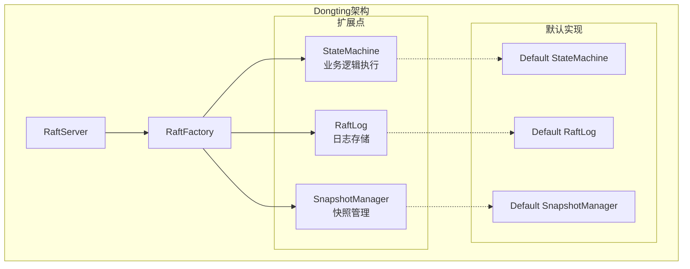
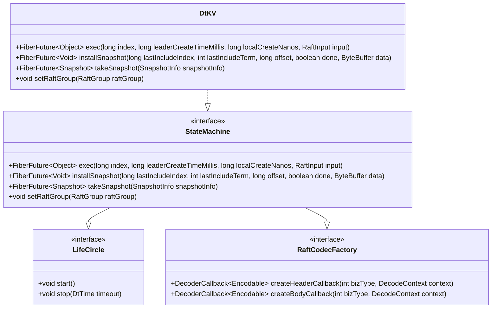
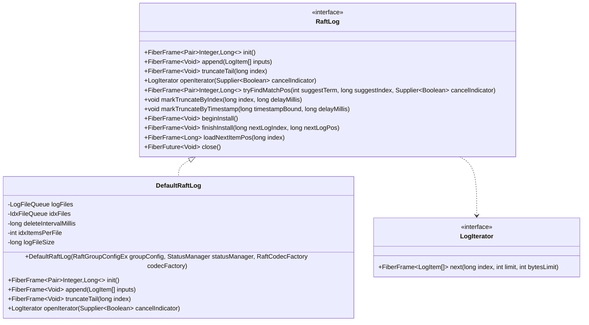
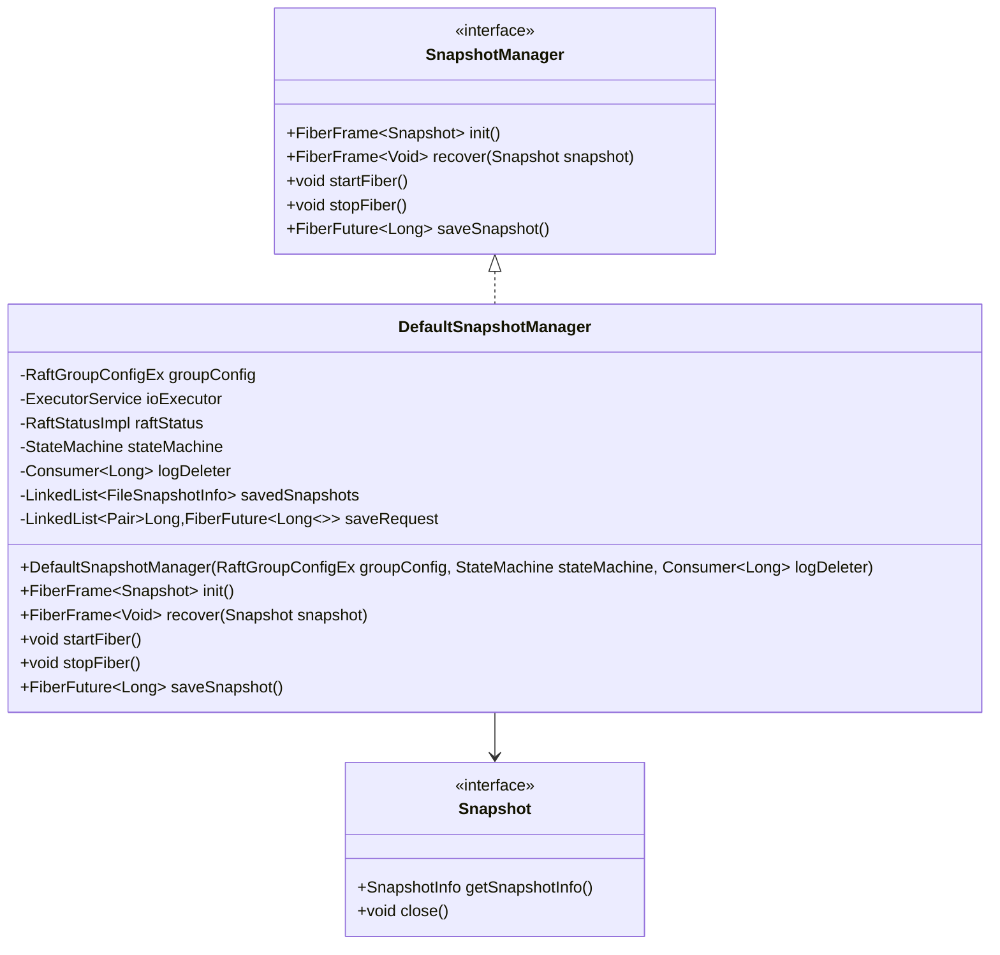

# 扩展与定制

<cite>
**本文档中引用的文件**
- [StateMachine.java](file://server/src/main/java/com/github/dtprj/dongting/raft/sm/StateMachine.java)
- [RaftLog.java](file://server/src/main/java/com/github/dtprj/dongting/raft/store/RaftLog.java)
- [DefaultRaftLog.java](file://server/src/main/java/com/github/dtprj/dongting/raft/store/DefaultRaftLog.java)
- [SnapshotManager.java](file://server/src/main/java/com/github/dtprj/dongting/raft/sm/SnapshotManager.java)
- [DefaultSnapshotManager.java](file://server/src/main/java/com/github/dtprj/dongting/raft/sm/DefaultSnapshotManager.java)
- [DefaultRaftFactory.java](file://server/src/main/java/com/github/dtprj/dongting/raft/server/DefaultRaftFactory.java)
- [RaftServer.java](file://server/src/main/java/com/github/dtprj/dongting/raft/server/RaftServer.java)
- [DtKV.java](file://server/src/main/java/com/github/dtprj/dongting/dtkv/server/DtKV.java)
- [DemoKvServerBase.java](file://demos/src/main/java/com/github/dtprj/dongting/demos/base/DemoKvServerBase.java)
</cite>

## 目录
1. [简介](#简介)
2. [核心扩展点概述](#核心扩展点概述)
3. [自定义StateMachine实现](#自定义statemachine实现)
4. [替换RaftLog实现](#替换raftlog实现)
5. [定制SnapshotManager](#定制snapshotmanager)
6. [集成到RaftServer](#集成到raftserver)
7. [完整示例](#完整示例)
8. [最佳实践](#最佳实践)
9. [故障排除](#故障排除)
10. [总结](#总结)

## 简介

Dongting是一个高性能的Raft引擎，提供了灵活的扩展机制，允许开发者根据特定需求定制业务逻辑。本文档指导开发者如何通过实现自定义的StateMachine接口来支持除KV之外的其他业务逻辑，如何替换默认的RaftLog实现以使用不同的日志存储后端，以及如何定制SnapshotManager以实现特定的快照策略。

## 核心扩展点概述

Dongting提供了三个主要的扩展点：

1. **StateMachine接口**：用于处理业务逻辑执行
2. **RaftLog接口**：用于自定义日志存储实现
3. **SnapshotManager接口**：用于自定义快照管理策略

这些扩展点都设计为可插拔的组件，可以通过继承DefaultRaftFactory来实现自定义配置。



**图表来源**
- [RaftServer.java](file://server/src/main/java/com/github/dtprj/dongting/raft/server/RaftServer.java#L104-L123)
- [DefaultRaftFactory.java](file://server/src/main/java/com/github/dtprj/dongting/raft/server/DefaultRaftFactory.java#L40-L120)

## 自定义StateMachine实现

### StateMachine接口分析

StateMachine是Dongting的核心扩展点，负责处理所有业务逻辑的执行。它继承了LifeCircle和RaftCodecFactory接口，提供了生命周期管理和编解码功能。



**图表来源**
- [StateMachine.java](file://server/src/main/java/com/github/dtprj/dongting/raft/sm/StateMachine.java#L30-L48)
- [DtKV.java](file://server/src/main/java/com/github/dtprj/dongting/dtkv/server/DtKV.java#L60-L199)

### 实现自定义StateMachine

以下是一个简单的自定义StateMachine实现示例：

```java
public class CustomStateMachine implements StateMachine {
    private RaftGroup raftGroup;
    private final Map<String, String> dataStore = new ConcurrentHashMap<>();
    
    @Override
    public FiberFuture<Object> exec(long index, long leaderCreateTimeMillis, 
                                   long localCreateNanos, RaftInput input) {
        return Fiber.call(new FiberFrame<Object>() {
            @Override
            public FrameCallResult execute(Void input) throws Exception {
                // 解析业务请求
                BusinessRequest req = parseRequest(input);
                
                // 执行业务逻辑
                Object result = executeBusinessLogic(req);
                
                // 更新状态机状态
                updateState(req);
                
                setResult(result);
                return Fiber.frameReturn();
            }
        });
    }
    
    @Override
    public FiberFuture<Void> installSnapshot(long lastIncludeIndex, int lastIncludeTerm, 
                                           long offset, boolean done, ByteBuffer data) {
        return Fiber.call(new FiberFrame<Void>() {
            @Override
            public FrameCallResult execute(Void input) throws Exception {
                // 处理快照安装
                if (offset == 0) {
                    // 初始化新快照
                    dataStore.clear();
                }
                
                // 将数据写入本地存储
                if (data != null && data.remaining() > 0) {
                    byte[] bytes = new byte[data.remaining()];
                    data.get(bytes);
                    processDataChunk(bytes);
                }
                
                if (done) {
                    // 快照完成，验证完整性
                    validateSnapshot(lastIncludeIndex, lastIncludeTerm);
                }
                
                return Fiber.frameReturn();
            }
        });
    }
    
    @Override
    public FiberFuture<Snapshot> takeSnapshot(SnapshotInfo snapshotInfo) {
        return Fiber.call(new FiberFrame<Snapshot>() {
            @Override
            public FrameCallResult execute(Void input) throws Exception {
                // 创建快照数据
                Snapshot snapshot = createSnapshotData(snapshotInfo);
                setResult(snapshot);
                return Fiber.frameReturn();
            }
        });
    }
    
    @Override
    public void setRaftGroup(RaftGroup raftGroup) {
        this.raftGroup = raftGroup;
    }
    
    // 其他辅助方法...
}
```

**章节来源**
- [StateMachine.java](file://server/src/main/java/com/github/dtprj/dongting/raft/sm/StateMachine.java#L30-L48)
- [DtKV.java](file://server/src/main/java/com/github/dtprj/dongting/dtkv/server/DtKV.java#L110-L199)

## 替换RaftLog实现

### RaftLog接口设计

RaftLog接口定义了日志存储的所有操作，包括初始化、追加、截断等。默认实现DefaultRaftLog使用文件系统存储日志条目。



**图表来源**
- [RaftLog.java](file://server/src/main/java/com/github/dtprj/dongting/raft/store/RaftLog.java#L30-L88)
- [DefaultRaftLog.java](file://server/src/main/java/com/github/dtprj/dongting/raft/store/DefaultRaftLog.java#L41-L110)

### 自定义RaftLog实现

以下是一个基于内存的自定义RaftLog实现示例：

```java
public class MemoryRaftLog implements RaftLog {
    private final List<LogItem> logEntries = new ArrayList<>();
    private final AtomicLong lastIndex = new AtomicLong(-1);
    private final AtomicLong lastTerm = new AtomicLong(-1);
    
    @Override
    public FiberFrame<Pair<Integer, Long>> init() {
        return Fiber.call(new FiberFrame<Pair<Integer, Long>>() {
            @Override
            public FrameCallResult execute(Void input) throws Exception {
                // 初始化时返回当前最后一条日志的信息
                long index = lastIndex.get();
                int term = index >= 0 ? logEntries.get((int)index).getTerm() : -1;
                setResult(Pair.of(term, index));
                return Fiber.frameReturn();
            }
        });
    }
    
    @Override
    public FiberFrame<Void> append(List<LogItem> inputs) {
        return Fiber.call(new FiberFrame<Void>() {
            @Override
            public FrameCallResult execute(Void input) throws Exception {
                for (LogItem item : inputs) {
                    logEntries.add(item);
                    lastIndex.set(item.getIndex());
                    lastTerm.set(item.getTerm());
                }
                return Fiber.frameReturn();
            }
        });
    }
    
    @Override
    public FiberFrame<Void> truncateTail(long index) {
        return Fiber.call(new FiberFrame<Void>() {
            @Override
            public FrameCallResult execute(Void input) throws Exception {
                if (index < lastIndex.get()) {
                    logEntries.subList((int)(index + 1), logEntries.size()).clear();
                    lastIndex.set(index);
                    if (index >= 0) {
                        lastTerm.set(logEntries.get((int)index).getTerm());
                    } else {
                        lastTerm.set(-1);
                    }
                }
                return Fiber.frameReturn();
            }
        });
    }
    
    @Override
    public LogIterator openIterator(Supplier<Boolean> cancelIndicator) {
        return new MemoryLogIterator(logEntries, lastIndex.get(), cancelIndicator);
    }
    
    // 其他方法的实现...
    
    private static class MemoryLogIterator implements LogIterator {
        private final List<LogItem> entries;
        private final long lastIndex;
        private final Supplier<Boolean> cancelIndicator;
        private int currentIndex = 0;
        
        MemoryLogIterator(List<LogItem> entries, long lastIndex, Supplier<Boolean> cancelIndicator) {
            this.entries = entries;
            this.lastIndex = lastIndex;
            this.cancelIndicator = cancelIndicator;
        }
        
        @Override
        public FiberFrame<List<LogItem>> next(long index, int limit, int bytesLimit) {
            return Fiber.call(new FiberFrame<List<LogItem>>() {
                @Override
                public FrameCallResult execute(Void input) throws Exception {
                    if (cancelIndicator.get()) {
                        throw new RaftException("Operation cancelled");
                    }
                    
                    List<LogItem> result = new ArrayList<>();
                    int count = 0;
                    int bytesUsed = 0;
                    
                    for (int i = (int)index; i <= lastIndex && count < limit; i++) {
                        if (cancelIndicator.get()) {
                            throw new RaftException("Operation cancelled");
                        }
                        
                        LogItem item = entries.get(i);
                        result.add(item);
                        count++;
                        
                        // 计算字节使用量（简化实现）
                        bytesUsed += item.getHeader().length + item.getBody().length;
                        if (bytesLimit > 0 && bytesUsed > bytesLimit) {
                            break;
                        }
                    }
                    
                    setResult(result);
                    return Fiber.frameReturn();
                }
            });
        }
        
        @Override
        public void close() {
            // 内存实现不需要清理资源
        }
    }
}
```

**章节来源**
- [RaftLog.java](file://server/src/main/java/com/github/dtprj/dongting/raft/store/RaftLog.java#L30-L88)
- [DefaultRaftLog.java](file://server/src/main/java/com/github/dtprj/dongting/raft/store/DefaultRaftLog.java#L76-L110)

## 定制SnapshotManager

### SnapshotManager接口分析

SnapshotManager负责管理快照的创建、恢复和删除。默认实现DefaultSnapshotManager使用文件系统存储快照。



**图表来源**
- [SnapshotManager.java](file://server/src/main/java/com/github/dtprj/dongting/raft/sm/SnapshotManager.java#L20-L35)
- [DefaultSnapshotManager.java](file://server/src/main/java/com/github/dtprj/dongting/raft/sm/DefaultSnapshotManager.java#L50-L199)

### 自定义SnapshotManager实现

以下是一个基于数据库的自定义SnapshotManager实现示例：

```java
public class DatabaseSnapshotManager implements SnapshotManager {
    private final RaftGroupConfigEx groupConfig;
    private final StateMachine stateMachine;
    private final Consumer<Long> logDeleter;
    private final DataSource dataSource;
    private final ScheduledExecutorService cleanupExecutor;
    
    public DatabaseSnapshotManager(RaftGroupConfigEx groupConfig, StateMachine stateMachine, 
                                 Consumer<Long> logDeleter, DataSource dataSource) {
        this.groupConfig = groupConfig;
        this.stateMachine = stateMachine;
        this.logDeleter = logDeleter;
        this.dataSource = dataSource;
        this.cleanupExecutor = Executors.newSingleThreadScheduledExecutor();
    }
    
    @Override
    public FiberFrame<Snapshot> init() {
        return Fiber.call(new FiberFrame<Snapshot>() {
            @Override
            public FrameCallResult execute(Void input) throws Exception {
                // 从数据库加载最新的快照
                Snapshot latestSnapshot = loadLatestSnapshotFromDatabase();
                setResult(latestSnapshot);
                return Fiber.frameReturn();
            }
        });
    }
    
    @Override
    public FiberFrame<Void> recover(Snapshot snapshot) {
        return Fiber.call(new FiberFrame<Void>() {
            @Override
            public FrameCallResult execute(Void input) throws Exception {
                // 将快照数据恢复到状态机
                restoreSnapshotToStateMachine(snapshot);
                return Fiber.frameReturn();
            }
        });
    }
    
    @Override
    public void startFiber() {
        // 启动定期清理任务
        cleanupExecutor.scheduleAtFixedRate(this::cleanupOldSnapshots, 
                                          1, 1, TimeUnit.HOURS);
    }
    
    @Override
    public void stopFiber() {
        cleanupExecutor.shutdown();
        try {
            if (!cleanupExecutor.awaitTermination(30, TimeUnit.SECONDS)) {
                cleanupExecutor.shutdownNow();
            }
        } catch (InterruptedException e) {
            cleanupExecutor.shutdownNow();
            Thread.currentThread().interrupt();
        }
    }
    
    @Override
    public FiberFuture<Long> saveSnapshot() {
        return Fiber.call(new FiberFrame<Long>() {
            @Override
            public FrameCallResult execute(Void input) throws Exception {
                // 从状态机获取快照数据
                SnapshotInfo snapshotInfo = createSnapshotInfo();
                FiberFuture<Snapshot> future = stateMachine.takeSnapshot(snapshotInfo);
                
                return Fiber.call(future, snapshot -> {
                    // 将快照保存到数据库
                    long snapshotId = saveSnapshotToDatabase(snapshot, snapshotInfo);
                    
                    // 删除旧的日志
                    logDeleter.accept(snapshotInfo.getLastIncludedIndex());
                    
                    setResult(snapshotId);
                    return Fiber.frameReturn();
                });
            }
        });
    }
    
    private Snapshot loadLatestSnapshotFromDatabase() throws SQLException {
        try (Connection conn = dataSource.getConnection();
             PreparedStatement stmt = conn.prepareStatement(
                 "SELECT * FROM snapshots WHERE group_id = ? ORDER BY id DESC LIMIT 1")) {
            
            stmt.setInt(1, groupConfig.groupId);
            try (ResultSet rs = stmt.executeQuery()) {
                if (rs.next()) {
                    return deserializeSnapshot(rs);
                }
            }
        }
        return null;
    }
    
    private void restoreSnapshotToStateMachine(Snapshot snapshot) throws Exception {
        // 实现从快照恢复状态机的逻辑
        ByteBuffer data = snapshot.getData(); // 假设Snapshot有getData方法
        stateMachine.installSnapshot(
            snapshot.getSnapshotInfo().getLastIncludedIndex(),
            snapshot.getSnapshotInfo().getLastIncludedTerm(),
            0, true, data
        );
    }
    
    private long saveSnapshotToDatabase(Snapshot snapshot, SnapshotInfo info) throws SQLException {
        try (Connection conn = dataSource.getConnection();
             PreparedStatement stmt = conn.prepareStatement(
                 "INSERT INTO snapshots (group_id, data, info, created_at) VALUES (?, ?, ?, ?)",
                 Statement.RETURN_GENERATED_KEYS)) {
            
            stmt.setInt(1, groupConfig.groupId);
            stmt.setBytes(2, serializeSnapshot(snapshot));
            stmt.setString(3, serializeSnapshotInfo(info));
            stmt.setTimestamp(4, new Timestamp(System.currentTimeMillis()));
            
            stmt.executeUpdate();
            
            try (ResultSet generatedKeys = stmt.getGeneratedKeys()) {
                if (generatedKeys.next()) {
                    return generatedKeys.getLong(1);
                }
            }
        }
        throw new SQLException("Failed to insert snapshot");
    }
    
    private void cleanupOldSnapshots() {
        try {
            // 删除超过保留期限的快照
            long cutoffTime = System.currentTimeMillis() - 
                groupConfig.snapshotRetentionHours * 3600 * 1000;
            
            try (Connection conn = dataSource.getConnection();
                 PreparedStatement stmt = conn.prepareStatement(
                     "DELETE FROM snapshots WHERE group_id = ? AND created_at < ?")) {
                
                stmt.setInt(1, groupConfig.groupId);
                stmt.setTimestamp(2, new Timestamp(cutoffTime));
                stmt.executeUpdate();
            }
        } catch (SQLException e) {
            // 记录错误但不抛出异常
            System.err.println("Failed to cleanup old snapshots: " + e.getMessage());
        }
    }
    
    // 辅助方法...
}
```

**章节来源**
- [SnapshotManager.java](file://server/src/main/java/com/github/dtprj/dongting/raft/sm/SnapshotManager.java#L20-L35)
- [DefaultSnapshotManager.java](file://server/src/main/java/com/github/dtprj/dongting/raft/sm/DefaultSnapshotManager.java#L50-L199)

## 集成到RaftServer

### 自定义RaftFactory实现

要将自定义的StateMachine、RaftLog和SnapshotManager集成到RaftServer中，需要继承DefaultRaftFactory并重写相应的方法：

```java
public class CustomRaftFactory extends DefaultRaftFactory {
    private final DataSource dataSource;
    private final ObjectMapper objectMapper;
    
    public CustomRaftFactory(DataSource dataSource, ObjectMapper objectMapper) {
        this.dataSource = dataSource;
        this.objectMapper = objectMapper;
    }
    
    @Override
    public StateMachine createStateMachine(RaftGroupConfigEx groupConfig) {
        // 使用自定义的StateMachine实现
        return new CustomStateMachine();
    }
    
    @Override
    public RaftLog createRaftLog(RaftGroupConfigEx groupConfig, StatusManager statusManager, 
                                RaftCodecFactory codecFactory) {
        // 使用自定义的RaftLog实现
        return new DatabaseRaftLog(dataSource, groupConfig);
    }
    
    @Override
    public SnapshotManager createSnapshotManager(RaftGroupConfigEx groupConfig, StateMachine stateMachine, 
                                               RaftLog raftLog) {
        // 使用自定义的SnapshotManager实现
        return new DatabaseSnapshotManager(groupConfig, stateMachine, 
                                         raftLog::markTruncateByIndex, dataSource);
    }
    
    @Override
    public ExecutorService createBlockIoExecutor(RaftServerConfig serverConfig, 
                                                RaftGroupConfigEx groupConfig) {
        // 自定义IO执行器配置
        return Executors.newCachedThreadPool(r -> {
            Thread t = new Thread(r, "custom-io-" + groupConfig.groupId);
            t.setDaemon(true);
            return t;
        });
    }
}
```

### 启动RaftServer

```java
public class CustomRaftServer {
    public static void main(String[] args) {
        // 配置服务器
        RaftServerConfig serverConfig = new RaftServerConfig();
        serverConfig.servers = "1,127.0.0.1:4001;2,127.0.0.1:4002;3,127.0.0.1:4003";
        serverConfig.nodeId = 1;
        serverConfig.replicatePort = 4001;
        serverConfig.servicePort = 5001;
        serverConfig.electTimeout = 3000;
        serverConfig.heartbeatInterval = 1000;
        
        // 创建组配置
        List<RaftGroupConfig> groupConfigs = new ArrayList<>();
        groupConfigs.add(createGroupConfig(1, "1,2,3", ""));
        
        // 创建自定义工厂
        ObjectMapper objectMapper = new ObjectMapper();
        DataSource dataSource = createDataSource(); // 实现数据源创建逻辑
        
        CustomRaftFactory raftFactory = new CustomRaftFactory(dataSource, objectMapper);
        
        // 创建并启动RaftServer
        RaftServer raftServer = new RaftServer(serverConfig, groupConfigs, raftFactory);
        
        // 注册自定义处理器（如果需要）
        // raftServer.register(...);
        
        raftServer.start();
        
        System.out.println("Raft server started successfully");
    }
    
    private static RaftGroupConfig createGroupConfig(int groupId, String members, String observers) {
        RaftGroupConfig config = RaftGroupConfig.newInstance(groupId, members, observers);
        config.dataDir = "data/raft_group_" + groupId;
        config.syncForce = false; // 性能优化
        return config;
    }
    
    private static DataSource createDataSource() {
        // 实现数据源创建逻辑
        HikariConfig config = new HikariConfig();
        config.setJdbcUrl("jdbc:mysql://localhost:3306/raft_db");
        config.setUsername("root");
        config.setPassword("password");
        return new HikariDataSource(config);
    }
}
```

**章节来源**
- [DefaultRaftFactory.java](file://server/src/main/java/com/github/dtprj/dongting/raft/server/DefaultRaftFactory.java#L40-L120)
- [DemoKvServerBase.java](file://demos/src/main/java/com/github/dtprj/dongting/demos/base/DemoKvServerBase.java#L40-L83)

## 完整示例

以下是一个完整的自定义扩展示例，展示了如何从头开始构建一个基于Dongting的分布式键值存储系统：

```java
// 自定义业务请求类型
public class KeyValueRequest {
    public enum Operation { PUT, GET, DELETE, BATCH_PUT, BATCH_DELETE }
    
    private Operation operation;
    private String key;
    private String value;
    private List<String> keys;
    private List<String> values;
    
    // 构造函数、getter和setter...
}

// 自定义状态机实现
public class KeyValueStateMachine implements StateMachine {
    private final Map<String, String> keyValueStore = new ConcurrentHashMap<>();
    private final Map<String, Long> ttlMap = new ConcurrentHashMap<>();
    private RaftGroup raftGroup;
    
    @Override
    public FiberFuture<Object> exec(long index, long leaderCreateTimeMillis, 
                                   long localCreateNanos, RaftInput input) {
        return Fiber.call(new FiberFrame<Object>() {
            @Override
            public FrameCallResult execute(Void input) throws Exception {
                KeyValueRequest req = parseRequest(input);
                
                Object result;
                switch (req.operation) {
                    case PUT:
                        result = put(req.key, req.value);
                        break;
                    case GET:
                        result = get(req.key);
                        break;
                    case DELETE:
                        result = delete(req.key);
                        break;
                    case BATCH_PUT:
                        result = batchPut(req.keys, req.values);
                        break;
                    case BATCH_DELETE:
                        result = batchDelete(req.keys);
                        break;
                    default:
                        throw new IllegalArgumentException("Unknown operation: " + req.operation);
                }
                
                setResult(result);
                return Fiber.frameReturn();
            }
        });
    }
    
    private Object put(String key, String value) {
        String oldValue = keyValueStore.put(key, value);
        scheduleTtlCleanup(key);
        return oldValue;
    }
    
    private Object get(String key) {
        return keyValueStore.get(key);
    }
    
    private Object delete(String key) {
        String oldValue = keyValueStore.remove(key);
        ttlMap.remove(key);
        return oldValue;
    }
    
    private Object batchPut(List<String> keys, List<String> values) {
        if (keys.size() != values.size()) {
            throw new IllegalArgumentException("Key and value lists must have same size");
        }
        
        Map<String, String> resultMap = new HashMap<>();
        for (int i = 0; i < keys.size(); i++) {
            resultMap.put(keys.get(i), put(keys.get(i), values.get(i)));
        }
        return resultMap;
    }
    
    private Object batchDelete(List<String> keys) {
        Map<String, String> resultMap = new HashMap<>();
        for (String key : keys) {
            resultMap.put(key, (String) delete(key));
        }
        return resultMap;
    }
    
    private void scheduleTtlCleanup(String key) {
        Long ttl = ttlMap.get(key);
        if (ttl != null && ttl > 0) {
            // 实现TTL清理逻辑
            // 这里可以使用定时任务或延迟队列
        }
    }
    
    // 实现其他必需的方法...
}

// 自定义RaftLog实现
public class KeyValueRaftLog implements RaftLog {
    // 实现RaftLog接口...
}

// 自定义SnapshotManager实现
public class KeyValueSnapshotManager implements SnapshotManager {
    // 实现SnapshotManager接口...
}

// 自定义RaftFactory实现
public class KeyValueRaftFactory extends DefaultRaftFactory {
    @Override
    public StateMachine createStateMachine(RaftGroupConfigEx groupConfig) {
        return new KeyValueStateMachine();
    }
    
    @Override
    public RaftLog createRaftLog(RaftGroupConfigEx groupConfig, StatusManager statusManager, 
                                RaftCodecFactory codecFactory) {
        return new KeyValueRaftLog();
    }
    
    @Override
    public SnapshotManager createSnapshotManager(RaftGroupConfigEx groupConfig, StateMachine stateMachine, 
                                               RaftLog raftLog) {
        return new KeyValueSnapshotManager();
    }
}

// 主应用程序
public class KeyValueCluster {
    public static void main(String[] args) {
        // 配置集群
        RaftServerConfig serverConfig = new RaftServerConfig();
        serverConfig.servers = "1,127.0.0.1:4001;2,127.0.0.1:4002;3,127.0.0.1:4003";
        serverConfig.nodeId = 1;
        serverConfig.replicatePort = 4001;
        serverConfig.servicePort = 5001;
        
        // 创建组配置
        List<RaftGroupConfig> groupConfigs = new ArrayList<>();
        groupConfigs.add(createGroupConfig(1, "1,2,3", ""));
        
        // 创建自定义工厂
        KeyValueRaftFactory raftFactory = new KeyValueRaftFactory();
        
        // 创建并启动服务器
        RaftServer raftServer = new RaftServer(serverConfig, groupConfigs, raftFactory);
        
        // 注册RPC处理器
        // raftServer.register(...);
        
        raftServer.start();
        
        System.out.println("KeyValue cluster started successfully");
    }
    
    private static RaftGroupConfig createGroupConfig(int groupId, String members, String observers) {
        RaftGroupConfig config = RaftGroupConfig.newInstance(groupId, members, observers);
        config.dataDir = "data/keyvalue_group_" + groupId;
        config.syncForce = false;
        return config;
    }
}
```

## 最佳实践

### 1. 线程安全考虑

在实现自定义扩展时，必须注意线程安全：

```java
public class ThreadSafeStateMachine implements StateMachine {
    // 使用线程安全的数据结构
    private final ConcurrentMap<String, String> data = new ConcurrentHashMap<>();
    private final AtomicLong lastAppliedIndex = new AtomicLong(-1);
    
    @Override
    public FiberFuture<Object> exec(long index, long leaderCreateTimeMillis, 
                                   long localCreateNanos, RaftInput input) {
        return Fiber.call(new FiberFrame<Object>() {
            @Override
            public FrameCallResult execute(Void input) throws Exception {
                // 在Raft线程中执行业务逻辑
                if (index <= lastAppliedIndex.get()) {
                    // 已经处理过的索引，直接返回缓存结果
                    Object cachedResult = getCachedResult(index);
                    setResult(cachedResult);
                    return Fiber.frameReturn();
                }
                
                // 执行新的业务逻辑
                Object result = processNewRequest(input);
                
                // 更新状态
                updateState(index, result);
                
                setResult(result);
                return Fiber.frameReturn();
            }
        });
    }
    
    private void updateState(long index, Object result) {
        // 原子性更新状态
        lastAppliedIndex.updateAndGet(current -> Math.max(current, index));
        cacheResult(index, result);
    }
}
```

### 2. 错误处理和恢复

```java
public class RobustStateMachine implements StateMachine {
    private static final DtLog log = DtLogs.getLogger(RobustStateMachine.class);
    
    @Override
    public FiberFuture<Object> exec(long index, long leaderCreateTimeMillis, 
                                   long localCreateNanos, RaftInput input) {
        return Fiber.call(new FiberFrame<Object>() {
            @Override
            public FrameCallResult execute(Void input) throws Exception {
                try {
                    Object result = performBusinessLogic(input);
                    setResult(result);
                    return Fiber.frameReturn();
                } catch (Exception e) {
                    log.error("Failed to execute business logic at index {}: {}", index, e.getMessage());
                    
                    // 返回适当的错误响应
                    if (e instanceof ValidationException) {
                        setResult(new ErrorResponse("validation_error", e.getMessage()));
                    } else if (e instanceof ResourceNotFoundException) {
                        setResult(new ErrorResponse("not_found", e.getMessage()));
                    } else {
                        setResult(new ErrorResponse("internal_error", "Internal server error"));
                    }
                    
                    return Fiber.frameReturn();
                }
            }
        });
    }
}
```

### 3. 性能优化

```java
public class OptimizedStateMachine implements StateMachine {
    private final ExecutorService workerExecutor;
    private final BlockingQueue<BusinessTask> taskQueue;
    
    public OptimizedStateMachine() {
        int cpuCores = Runtime.getRuntime().availableProcessors();
        this.workerExecutor = Executors.newFixedThreadPool(cpuCores * 2);
        this.taskQueue = new LinkedBlockingQueue<>(1000);
    }
    
    @Override
    public FiberFuture<Object> exec(long index, long leaderCreateTimeMillis, 
                                   long localCreateNanos, RaftInput input) {
        // 异步处理业务逻辑以提高吞吐量
        BusinessTask task = new BusinessTask(index, input);
        CompletableFuture<Object> future = new CompletableFuture<>();
        
        taskQueue.offer(task, 100, TimeUnit.MILLISECONDS);
        workerExecutor.submit(() -> processTaskAsync(task, future));
        
        return new FiberFutureAdapter<>(future);
    }
    
    private void processTaskAsync(BusinessTask task, CompletableFuture<Object> future) {
        try {
            Object result = performBusinessLogic(task.input);
            future.complete(result);
        } catch (Exception e) {
            future.completeExceptionally(e);
        }
    }
}
```

## 故障排除

### 常见问题和解决方案

1. **状态机初始化失败**
   - 检查状态机的依赖是否正确注入
   - 确保状态机的start()方法被正确调用
   - 验证状态机的状态是否一致

2. **日志同步问题**
   - 检查RaftLog实现的线程安全性
   - 确保日志条目的序列化和反序列化正确
   - 验证日志截断和追加操作的原子性

3. **快照恢复失败**
   - 检查快照数据的完整性
   - 确保快照恢复过程中的错误处理
   - 验证状态机在恢复后的状态一致性

4. **性能问题**
   - 分析状态机的执行时间
   - 检查是否有阻塞操作
   - 优化批处理和并发控制

### 调试技巧

```java
public class DebuggableStateMachine implements StateMachine {
    private static final DtLog log = DtLogs.getLogger(DebuggableStateMachine.class);
    
    @Override
    public FiberFuture<Object> exec(long index, long leaderCreateTimeMillis, 
                                   long localCreateNanos, RaftInput input) {
        return Fiber.call(new FiberFrame<Object>() {
            @Override
            public FrameCallResult execute(Void input) throws Exception {
                long startTime = System.nanoTime();
                
                try {
                    Object result = performBusinessLogic(input);
                    
                    long duration = System.nanoTime() - startTime;
                    if (duration > 1_000_000) { // 超过1ms记录警告
                        log.warn("Slow execution at index {}: {}ns", index, duration);
                    }
                    
                    setResult(result);
                    return Fiber.frameReturn();
                } catch (Exception e) {
                    long duration = System.nanoTime() - startTime;
                    log.error("Execution failed at index {} in {}ns: {}", index, duration, e.getMessage());
                    throw e;
                }
            }
        });
    }
}
```

## 总结

Dongting提供了强大而灵活的扩展机制，允许开发者根据具体需求定制业务逻辑、日志存储和快照管理策略。通过实现自定义的StateMachine、RaftLog和SnapshotManager接口，并继承DefaultRaftFactory，开发者可以构建高度定制化的分布式系统。

关键要点：
1. **StateMachine**：处理业务逻辑执行，是扩展的核心
2. **RaftLog**：控制日志存储实现，影响性能和持久性
3. **SnapshotManager**：管理快照策略，影响恢复时间和存储效率
4. **集成方式**：通过自定义RaftFactory实现统一集成

在实际应用中，建议：
- 保持线程安全和幂等性
- 实现完善的错误处理和恢复机制
- 进行充分的性能测试和压力测试
- 建立监控和告警机制

通过遵循这些最佳实践和注意事项，开发者可以充分利用Dongting的强大功能，构建稳定、高效、可扩展的分布式系统。