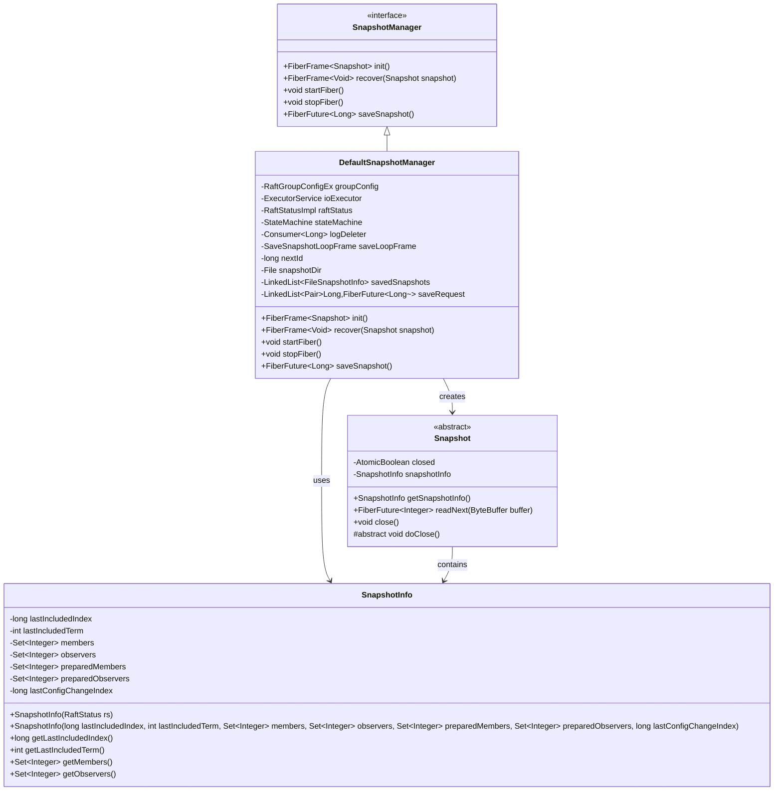
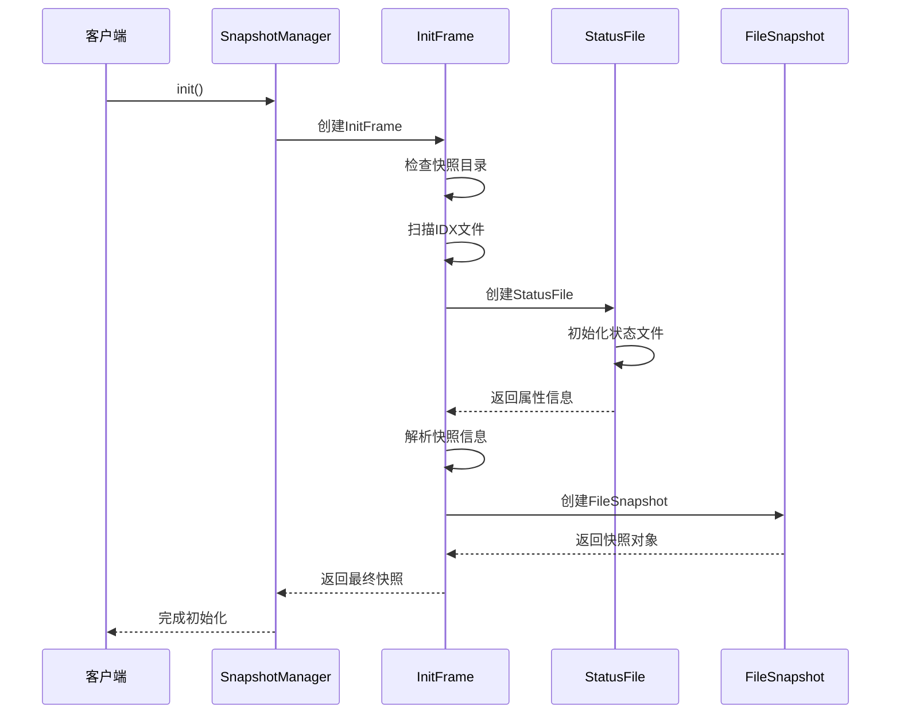
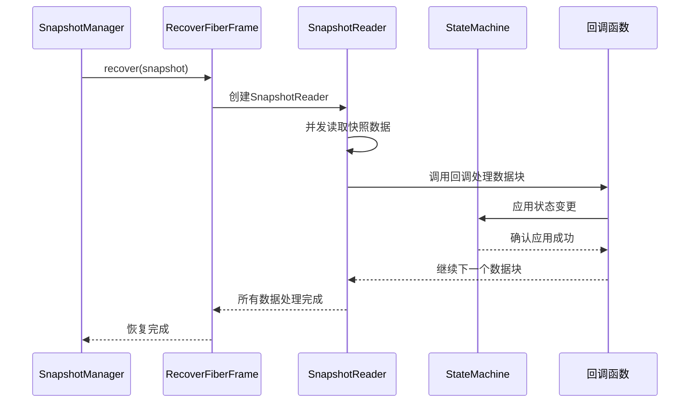
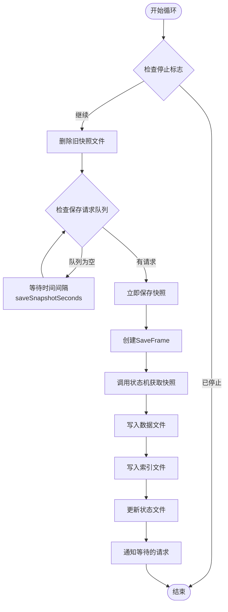
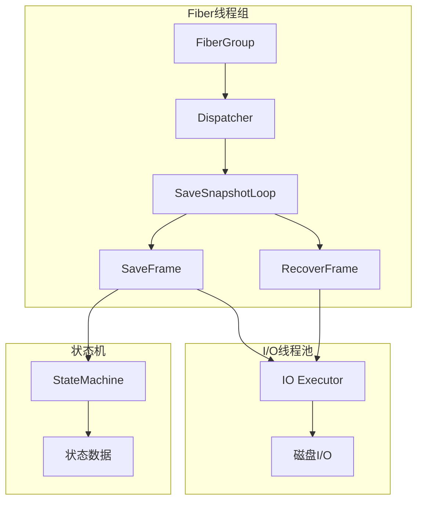
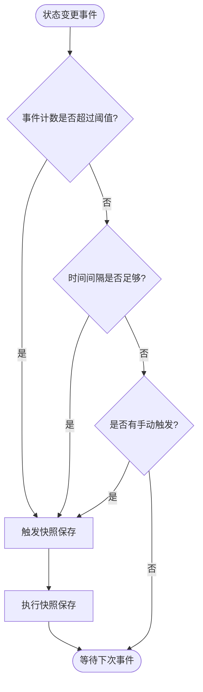
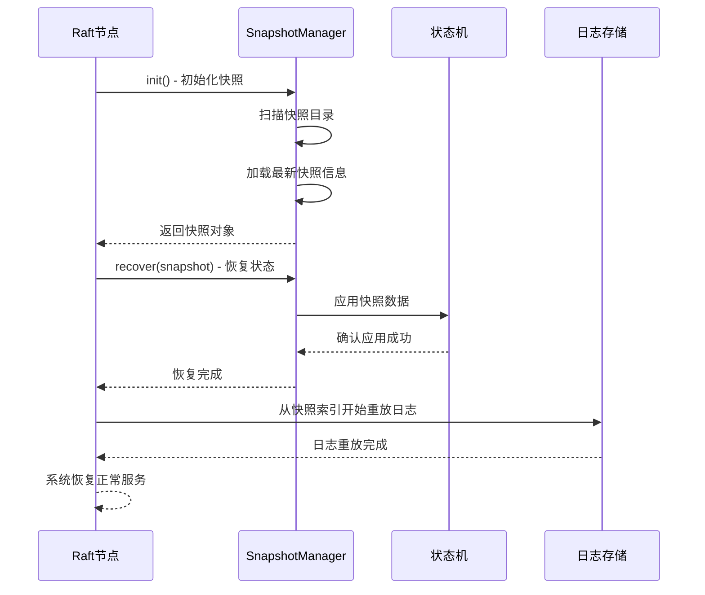
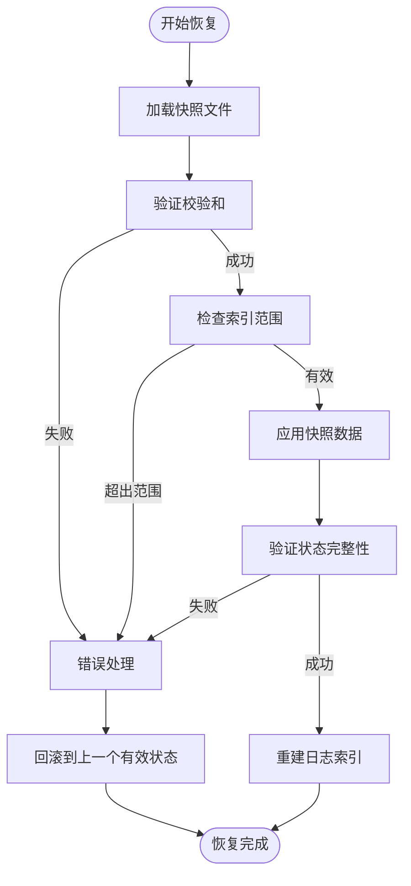
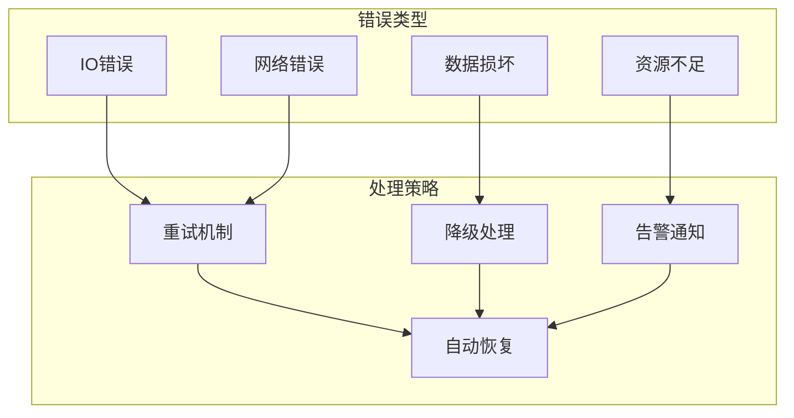
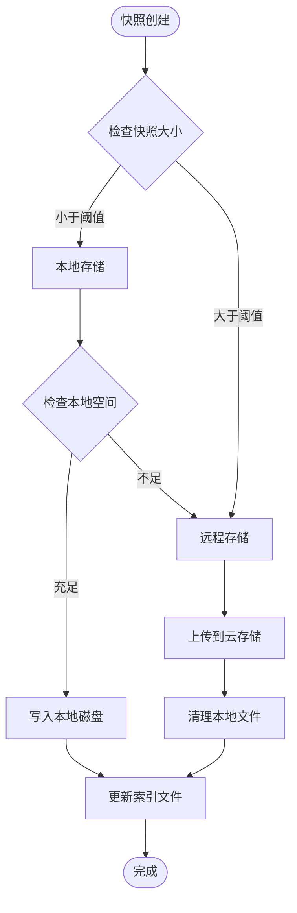

# 自定义快照策略

<cite>
**本文档引用的文件**
- [SnapshotManager.java](file://server/src/main/java/com/github/dtprj/dongting/raft/sm/SnapshotManager.java)
- [DefaultSnapshotManager.java](file://server/src/main/java/com/github/dtprj/dongting/raft/sm/DefaultSnapshotManager.java)
- [Snapshot.java](file://server/src/main/java/com/github/dtprj/dongting/raft/sm/Snapshot.java)
- [SnapshotInfo.java](file://server/src/main/java/com/github/dtprj/dongting/raft/sm/SnapshotInfo.java)
- [FileSnapshot.java](file://server/src/main/java/com/github/dtprj/dongting/raft/sm/FileSnapshot.java)
- [SnapshotReader.java](file://server/src/main/java/com/github/dtprj/dongting/raft/sm/SnapshotReader.java)
- [RaftGroupConfig.java](file://server/src/main/java/com/github/dtprj/dongting/raft/server/RaftGroupConfig.java)
- [RaftPerfCallback.java](file://benchmark/src/main/java/com/github/dtprj/dongting/bench/raft/RaftPerfCallback.java)
- [PerfCallback.java](file://client/src/main/java/com/github/dtprj/dongting/common/PerfCallback.java)
</cite>

## 目录
1. [简介](#简介)
2. [SnapshotManager接口概述](#snapshotmanager接口概述)
3. [核心组件架构](#核心组件架构)
4. [快照生命周期管理](#快照生命周期管理)
5. [自定义快照存储后端实现](#自定义快照存储后端实现)
6. [快照触发条件控制](#快照触发条件控制)
7. [故障恢复与数据一致性](#故障恢复与数据一致性)
8. [性能监控与指标](#性能监控与指标)
9. [容错处理方案](#容错处理方案)
10. [最佳实践指南](#最佳实践指南)

## 简介

Dongting框架提供了完整的Raft一致性算法实现，其中快照管理是保证系统高效运行的关键组件。本文档深入讲解SnapshotManager接口的定制化配置与实现，帮助开发者理解快照的完整生命周期，并提供实现自定义快照存储后端的详细指导。

快照机制的核心价值在于：
- 减少日志文件大小，提高系统性能
- 加速节点故障恢复过程
- 提供数据持久化和备份能力
- 支持分布式系统的状态迁移

## SnapshotManager接口概述

SnapshotManager接口定义了快照管理的核心行为规范，包含四个关键方法：



**图表来源**
- [SnapshotManager.java](file://server/src/main/java/com/github/dtprj/dongting/raft/sm/SnapshotManager.java#L20-L36)
- [DefaultSnapshotManager.java](file://server/src/main/java/com/github/dtprj/dongting/raft/sm/DefaultSnapshotManager.java#L60-L120)
- [Snapshot.java](file://server/src/main/java/com/github/dtprj/dongting/raft/sm/Snapshot.java#L25-L55)
- [SnapshotInfo.java](file://server/src/main/java/com/github/dtprj/dongting/raft/sm/SnapshotInfo.java#L25-L70)

**章节来源**
- [SnapshotManager.java](file://server/src/main/java/com/github/dtprj/dongting/raft/sm/SnapshotManager.java#L1-L37)
- [DefaultSnapshotManager.java](file://server/src/main/java/com/github/dtprj/dongting/raft/sm/DefaultSnapshotManager.java#L1-L100)

## 核心组件架构

### 初始化阶段（init）

初始化阶段负责加载已有的快照文件并建立状态信息：



**图表来源**
- [DefaultSnapshotManager.java](file://server/src/main/java/com/github/dtprj/dongting/raft/sm/DefaultSnapshotManager.java#L125-L200)

### 恢复阶段（recover）

恢复阶段将快照数据应用到状态机：



**图表来源**
- [DefaultSnapshotManager.java](file://server/src/main/java/com/github/dtprj/dongting/raft/sm/DefaultSnapshotManager.java#L202-L232)
- [DefaultSnapshotManager.java](file://server/src/main/java/com/github/dtprj/dongting/raft/sm/DefaultSnapshotManager.java#L524-L589)

### 快照保存循环（SaveSnapshotLoopFrame）

快照保存循环负责管理快照的定期保存和请求处理：



**图表来源**
- [DefaultSnapshotManager.java](file://server/src/main/java/com/github/dtprj/dongting/raft/sm/DefaultSnapshotManager.java#L233-L280)

**章节来源**
- [DefaultSnapshotManager.java](file://server/src/main/java/com/github/dtprj/dongting/raft/sm/DefaultSnapshotManager.java#L125-L280)

## 快照生命周期管理

### startFiber和stopFiber的作用

`startFiber`和`stopFiber`方法控制快照保存循环的生命周期：

```java
@Override
public void startFiber() {
    Fiber f = new Fiber("save-snapshot-" + groupConfig.groupId, groupConfig.fiberGroup,
            saveLoopFrame, true);
    f.start();
}

@Override
public void stopFiber() {
    saveLoopFrame.stopLoop = true;
    saveLoopFrame.saveSnapshotCond.signal();
}
```

这两个方法的作用：
- **startFiber**: 启动快照保存循环的Fiber线程
- **stopFiber**: 设置停止标志并唤醒等待的线程，确保优雅关闭

### 资源调度机制

快照管理器使用Dongting框架的Fiber机制进行异步操作：



**图表来源**
- [DefaultSnapshotManager.java](file://server/src/main/java/com/github/dtprj/dongting/raft/sm/DefaultSnapshotManager.java#L233-L245)

**章节来源**
- [DefaultSnapshotManager.java](file://server/src/main/java/com/github/dtprj/dongting/raft/sm/DefaultSnapshotManager.java#L233-L250)

## 自定义快照存储后端实现

### 实现自定义存储接口

要实现自定义快照存储后端，需要继承Snapshot类并实现相应的抽象方法：

```java
public class CloudSnapshot extends Snapshot {
    private final CloudStorage storage;
    private final String snapshotKey;
    private final long fileSize;
    private long currentPosition = 0;
    
    public CloudSnapshot(CloudStorage storage, String snapshotKey, SnapshotInfo info, long fileSize) {
        super(info);
        this.storage = storage;
        this.snapshotKey = snapshotKey;
        this.fileSize = fileSize;
    }
    
    @Override
    public FiberFuture<Integer> readNext(ByteBuffer buffer) {
        if (currentPosition >= fileSize) {
            return FiberFuture.completedFuture(FiberGroup.currentGroup(), 0);
        }
        
        long remaining = fileSize - currentPosition;
        int readSize = (int) Math.min(buffer.remaining(), remaining);
        
        return storage.readAsync(snapshotKey, currentPosition, readSize, buffer)
                .thenApply(bytesRead -> {
                    currentPosition += bytesRead;
                    return bytesRead;
                });
    }
    
    @Override
    protected void doClose() {
        // 清理云存储连接或其他资源
    }
}
```

### 自定义SnapshotManager实现

```java
public class CloudSnapshotManager implements SnapshotManager {
    private final RaftGroupConfigEx groupConfig;
    private final StateMachine stateMachine;
    private final Consumer<Long> logDeleter;
    private final CloudStorage cloudStorage;
    private final String bucketName;
    
    private final SaveSnapshotLoopFrame saveLoopFrame;
    
    public CloudSnapshotManager(RaftGroupConfigEx groupConfig, StateMachine stateMachine, 
                               Consumer<Long> logDeleter, CloudStorage cloudStorage) {
        this.groupConfig = groupConfig;
        this.stateMachine = stateMachine;
        this.logDeleter = logDeleter;
        this.cloudStorage = cloudStorage;
        this.bucketName = groupConfig.groupId + "-snapshots";
        this.saveLoopFrame = new SaveSnapshotLoopFrame();
    }
    
    @Override
    public FiberFrame<Snapshot> init() {
        return new CloudInitFrame();
    }
    
    @Override
    public FiberFrame<Void> recover(Snapshot snapshot) {
        return new CloudRecoverFrame((CloudSnapshot) snapshot);
    }
    
    @Override
    public void startFiber() {
        Fiber f = new Fiber("cloud-save-snapshot-" + groupConfig.groupId, 
                           groupConfig.fiberGroup, saveLoopFrame, true);
        f.start();
    }
    
    @Override
    public void stopFiber() {
        saveLoopFrame.stopLoop = true;
        saveLoopFrame.saveSnapshotCond.signal();
    }
    
    @Override
    public FiberFuture<Long> saveSnapshot() {
        FiberFuture<Long> future = groupConfig.fiberGroup.newFuture(
            "cloud-save-snapshot-" + groupConfig.groupId);
        saveRequest.addLast(new Pair<>(raftStatus.getLastApplied(), future));
        saveLoopFrame.saveSnapshotCond.signal();
        return future;
    }
    
    // 其他内部类实现...
}
```

### 分布式文件系统集成

对于分布式文件系统（如HDFS、Ceph），可以这样实现：

```java
public class DistributedSnapshot extends Snapshot {
    private final DistributedFileSystem dfs;
    private final Path snapshotPath;
    private final FSDataInputStream inputStream;
    
    public DistributedSnapshot(DistributedFileSystem dfs, Path path, SnapshotInfo info) 
            throws IOException {
        super(info);
        this.dfs = dfs;
        this.snapshotPath = path;
        this.inputStream = dfs.open(path);
    }
    
    @Override
    public FiberFuture<Integer> readNext(ByteBuffer buffer) {
        return Fiber.async(() -> {
            int bytesRead = inputStream.read(buffer.array(), buffer.position(), 
                                          buffer.remaining());
            if (bytesRead > 0) {
                buffer.position(buffer.position() + bytesRead);
            }
            return bytesRead;
        });
    }
    
    @Override
    protected void doClose() {
        try {
            if (inputStream != null) {
                inputStream.close();
            }
        } catch (IOException e) {
            log.error("Failed to close distributed snapshot stream", e);
        }
    }
}
```

**章节来源**
- [Snapshot.java](file://server/src/main/java/com/github/dtprj/dongting/raft/sm/Snapshot.java#L25-L55)
- [DefaultSnapshotManager.java](file://server/src/main/java/com/github/dtprj/dongting/raft/sm/DefaultSnapshotManager.java#L60-L120)

## 快照触发条件控制

### 配置参数详解

快照触发条件主要由以下配置参数控制：

```java
public class RaftGroupConfig {
    // 快照保存时间间隔（秒）
    public int saveSnapshotSeconds = 3600;
    
    // 最大保留快照数量
    public int maxKeepSnapshots = 2;
    
    // 是否在关闭时保存快照
    public boolean saveSnapshotWhenClose = true;
    
    // 是否在创建快照后删除日志
    public boolean deleteLogsAfterTakeSnapshot = true;
    
    // 磁盘快照缓冲区大小
    public int diskSnapshotBufferSize = 64 * 1024;
    
    // 快照并发读写线程数
    public int diskSnapshotConcurrency = 4;
}
```

### 主动触发快照保存

可以通过调用`saveSnapshot()`方法主动触发快照保存：

```java
// 在状态机变更后手动触发快照
public void onStateChange(StateChangeEvent event) {
    if (shouldTakeSnapshot(event)) {
        snapshotManager.saveSnapshot().whenComplete((index, ex) -> {
            if (ex == null) {
                log.info("Manual snapshot taken at index: {}", index);
            } else {
                log.error("Failed to take manual snapshot", ex);
            }
        });
    }
}

private boolean shouldTakeSnapshot(StateChangeEvent event) {
    // 基于事件数量触发
    if (eventCountSinceLastSnapshot >= MAX_EVENTS_PER_SNAPSHOT) {
        return true;
    }
    
    // 基于时间间隔触发
    long elapsed = System.currentTimeMillis() - lastSnapshotTime;
    if (elapsed >= MIN_TIME_BETWEEN_SNAPSHOTS) {
        return true;
    }
    
    return false;
}
```

### 条件触发策略



**图表来源**
- [DefaultSnapshotManager.java](file://server/src/main/java/com/github/dtprj/dongting/raft/sm/DefaultSnapshotManager.java#L260-L280)

**章节来源**
- [RaftGroupConfig.java](file://server/src/main/java/com/github/dtprj/dongting/raft/server/RaftGroupConfig.java#L34-L72)
- [DefaultSnapshotManager.java](file://server/src/main/java/com/github/dtprj/dongting/raft/sm/DefaultSnapshotManager.java#L260-L280)

## 故障恢复与数据一致性

### 快照加载流程

故障恢复过程遵循严格的顺序保证：



**图表来源**
- [DefaultSnapshotManager.java](file://server/src/main/java/com/github/dtprj/dongting/raft/sm/DefaultSnapshotManager.java#L125-L200)
- [DefaultSnapshotManager.java](file://server/src/main/java/com/github/dtprj/dongting/raft/sm/DefaultSnapshotManager.java#L202-L232)

### 数据一致性保障

为了确保快照与日志的一致性，系统采用以下机制：

1. **原子性写入**: 快照文件的创建和索引文件的更新是原子操作
2. **校验和验证**: 使用CRC32C校验和确保数据完整性
3. **版本控制**: 通过快照ID和索引号跟踪版本信息
4. **回滚保护**: 如果快照创建失败，会清理临时文件

```java
// 快照创建过程中的原子性保证
private class SaveFrame extends FiberFrame<Void> {
    @Override
    protected FrameCallResult doFinally() {
        // 确保在任何情况下都正确清理资源
        if (newDataFile != null && newDataFile.getChannel() != null) {
            DtUtil.close(newDataFile.getChannel());
        }
        DtUtil.close(statusFile);
        if (readSnapshot != null) {
            readSnapshot.close();
        }
        
        // 失败时清理临时文件
        if (!success) {
            if (cancel) {
                complete(new RaftCancelException("save snapshot task is cancelled"));
            }
            if (newDataFile != null) {
                deleteInIoExecutor(newDataFile.getFile());
            }
            if (newIdxFile != null) {
                deleteInIoExecutor(newIdxFile);
            }
        } else {
            complete(null);
        }
        return Fiber.frameReturn();
    }
}
```

### 避免数据丢失或重复应用

系统通过以下方式避免数据问题：



**图表来源**
- [DefaultSnapshotManager.java](file://server/src/main/java/com/github/dtprj/dongting/raft/sm/DefaultSnapshotManager.java#L524-L589)

**章节来源**
- [DefaultSnapshotManager.java](file://server/src/main/java/com/github/dtprj/dongting/raft/sm/DefaultSnapshotManager.java#L125-L232)
- [DefaultSnapshotManager.java](file://server/src/main/java/com/github/dtprj/dongting/raft/sm/DefaultSnapshotManager.java#L486-L528)

## 性能监控与指标

### 性能指标体系

Dongting提供了完整的性能监控框架，支持多种指标类型：

```java
public class RaftPerfCallback extends PrometheusPerfCallback {
    // 快照相关指标
    private final Summary raftSnapshotSaveTime;
    private final Summary raftSnapshotLoadTime;
    private final Counter raftSnapshotSaveCount;
    private final Counter raftSnapshotLoadCount;
    
    // 日志相关指标
    private final Summary raftLogWriteTime;
    private final Summary raftLogSyncTime;
    private final Counter raftLogWriteCount;
    
    public RaftPerfCallback(String prefix) {
        super(true);
        this.raftSnapshotSaveTime = createSummary(prefix + "raft_snapshot_save_time");
        this.raftSnapshotLoadTime = createSummary(prefix + "raft_snapshot_load_time");
        this.raftSnapshotSaveCount = Counter.build()
            .name(prefix + "raft_snapshot_save_total")
            .help("Total number of snapshot saves")
            .register();
    }
}
```

### 关键性能指标

以下是快照管理相关的关键指标：

| 指标名称 | 描述 | 单位 | 监控目标 |
|---------|------|-----|----------|
| `raft_snapshot_save_time` | 快照保存耗时 | 微秒 | < 100ms |
| `raft_snapshot_load_time` | 快照加载耗时 | 微秒 | < 50ms |
| `raft_snapshot_save_count` | 快照保存次数 | 次 | 每小时 < 1次 |
| `raft_snapshot_size_bytes` | 快照文件大小 | 字节 | < 1GB |
| `raft_snapshot_io_throughput` | 快照I/O吞吐量 | MB/s | > 100MB/s |

### 监控实现示例

```java
public class CustomSnapshotMetrics {
    private final Timer saveTimer;
    private final Timer loadTimer;
    private final Counter saveCounter;
    private final Histogram sizeHistogram;
    
    public CustomSnapshotMetrics(MeterRegistry registry) {
        this.saveTimer = Timer.builder("raft.snapshot.save.duration")
            .description("Time spent saving snapshots")
            .register(registry);
            
        this.loadTimer = Timer.builder("raft.snapshot.load.duration")
            .description("Time spent loading snapshots")
            .register(registry);
            
        this.saveCounter = Counter.builder("raft.snapshot.save.count")
            .description("Number of snapshots saved")
            .register(registry);
            
        this.sizeHistogram = Histogram.builder("raft.snapshot.size.bytes")
            .description("Size of saved snapshots")
            .register(registry);
    }
    
    public void recordSave(Duration duration, long size) {
        saveTimer.record(duration);
        saveCounter.increment();
        sizeHistogram.record(size);
    }
    
    public void recordLoad(Duration duration) {
        loadTimer.record(duration);
    }
}
```

**章节来源**
- [RaftPerfCallback.java](file://benchmark/src/main/java/com/github/dtprj/dongting/bench/raft/RaftPerfCallback.java#L67-L120)
- [PerfCallback.java](file://client/src/main/java/com/github/dtprj/dongting/common/PerfCallback.java#L50-L108)

## 容错处理方案

### 错误分类与处理策略

快照管理中的常见错误类型及处理策略：



### 容错实现示例

```java
public class FaultTolerantSnapshotManager implements SnapshotManager {
    private static final int MAX_RETRY_ATTEMPTS = 3;
    private static final Duration RETRY_DELAY = Duration.ofSeconds(1);
    
    private final SnapshotManager delegate;
    private final Metrics metrics;
    private final AlertService alertService;
    
    @Override
    public FiberFrame<Snapshot> init() {
        return new FaultTolerantInitFrame(delegate.init());
    }
    
    @Override
    public FiberFuture<Long> saveSnapshot() {
        return new FaultTolerantSaveFuture(delegate.saveSnapshot());
    }
    
    private class FaultTolerantInitFrame extends FiberFrame<Snapshot> {
        private final FiberFrame<Snapshot> originalFrame;
        private int retryCount = 0;
        
        FaultTolerantInitFrame(FiberFrame<Snapshot> originalFrame) {
            this.originalFrame = originalFrame;
        }
        
        @Override
        public FrameCallResult execute(Void input) {
            return Fiber.call(originalFrame, this::handleResult);
        }
        
        private FrameCallResult handleResult(Snapshot snapshot) {
            if (snapshot == null && retryCount < MAX_RETRY_ATTEMPTS) {
                retryCount++;
                metrics.incrementRetryCount("init");
                
                return Fiber.sleep(RETRY_DELAY, v -> {
                    log.warn("Init failed, retrying ({}/{})", retryCount, MAX_RETRY_ATTEMPTS);
                    return execute(input);
                });
            }
            
            return Fiber.frameReturn();
        }
        
        @Override
        protected FrameCallResult handle(Throwable ex) {
            if (retryCount < MAX_RETRY_ATTEMPTS) {
                return handleResult(null);
            }
            
            // 达到最大重试次数，发送告警
            alertService.sendAlert("Snapshot init failed", ex);
            return Fiber.frameReturn();
        }
    }
}
```

### 自动恢复机制

```java
public class AutoRecoverySnapshotManager implements SnapshotManager {
    private final ScheduledExecutorService scheduler;
    private final Duration healthCheckInterval;
    
    public void startHealthCheck() {
        scheduler.scheduleWithFixedDelay(() -> {
            try {
                checkSnapshotHealth();
            } catch (Exception e) {
                log.error("Health check failed", e);
            }
        }, 0, healthCheckInterval.toSeconds(), TimeUnit.SECONDS);
    }
    
    private void checkSnapshotHealth() {
        // 检查最近快照的完整性
        Snapshot latestSnapshot = getLatestSnapshot();
        if (latestSnapshot != null) {
            try {
                validateSnapshot(latestSnapshot);
            } catch (Exception e) {
                log.error("Snapshot validation failed, triggering recovery", e);
                triggerRecovery();
            }
        }
    }
    
    private void triggerRecovery() {
        // 触发快照恢复流程
        Fiber.call(recover(null), result -> {
            log.info("Automatic recovery completed");
            return Fiber.frameReturn();
        });
    }
}
```

**章节来源**
- [DefaultSnapshotManager.java](file://server/src/main/java/com/github/dtprj/dongting/raft/sm/DefaultSnapshotManager.java#L330-L380)

## 最佳实践指南

### 快照配置优化

根据不同的使用场景，推荐以下配置参数：

```java
// 高频写入场景（如数据库）
public class HighThroughputConfig extends RaftGroupConfig {
    public HighThroughputConfig(int groupId) {
        super(groupId);
        this.saveSnapshotSeconds = 1800;      // 30分钟
        this.maxKeepSnapshots = 5;            // 保留更多快照
        this.diskSnapshotBufferSize = 128 * 1024; // 更大的缓冲区
        this.diskSnapshotConcurrency = 8;     // 更高的并发度
    }
}

// 低延迟场景（如实时系统）
public class LowLatencyConfig extends RaftGroupConfig {
    public LowLatencyConfig(int groupId) {
        super(groupId);
        this.saveSnapshotSeconds = 3600;      // 1小时
        this.maxKeepSnapshots = 1;            // 只保留最新快照
        this.diskSnapshotBufferSize = 32 * 1024; // 较小的缓冲区
        this.diskSnapshotConcurrency = 2;     // 较低的并发度
    }
}
```

### 快照存储策略



### 监控告警配置

```yaml
# Prometheus告警规则示例
groups:
- name: raft-snapshot-alerts
  rules:
  - alert: SnapshotSaveFailure
    expr: increase(raft_snapshot_save_count[5m]) == 0
    for: 10m
    labels:
      severity: critical
    annotations:
      summary: "快照保存失败"
      description: "过去5分钟内没有成功保存快照"
  
  - alert: SnapshotLoadSlow
    expr: histogram_quantile(0.95, raft_snapshot_load_duration_seconds_bucket) > 0.5
    for: 5m
    labels:
      severity: warning
    annotations:
      summary: "快照加载缓慢"
      description: "95%分位点快照加载时间超过500ms"
```

### 性能调优建议

1. **缓冲区大小调优**:
   ```java
   // 根据网络带宽调整缓冲区大小
   int optimalBufferSize = Math.min(networkBandwidthMbps * 1024 * 1024 / 8, 1024 * 1024);
   ```

2. **并发度设置**:
   ```java
   // 根据CPU核心数和磁盘IOPS设置并发度
   int cpuCores = Runtime.getRuntime().availableProcessors();
   int diskIops = estimateDiskIOPS();
   int optimalConcurrency = Math.min(cpuCores, diskIops / 100);
   ```

3. **垃圾回收优化**:
   ```java
   // 针对快照操作优化GC参数
   -XX:+UseG1GC
   -XX:MaxGCPauseMillis=100
   -XX:G1HeapRegionSize=16m
   ```

通过遵循这些最佳实践，可以确保快照管理系统的高效、稳定运行，同时提供良好的可维护性和可观测性。