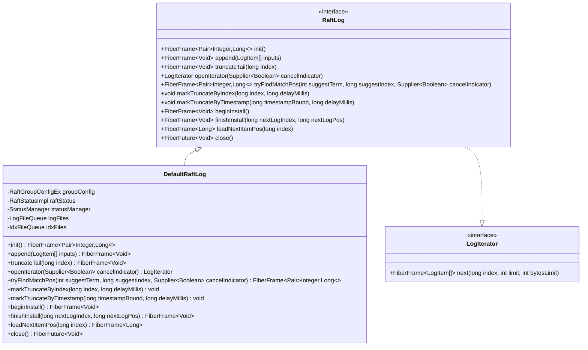
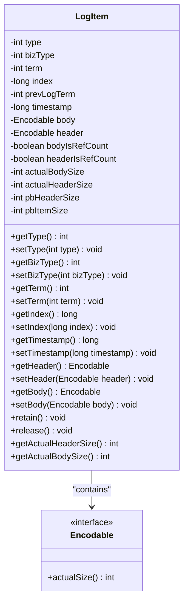
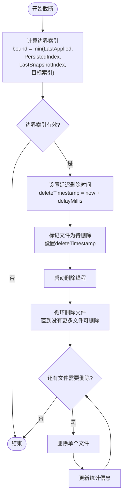

# 自定义日志存储

<cite>
**本文档引用的文件**
- [RaftLog.java](file://server/src/main/java/com/github/dtprj/dongting/raft/store/RaftLog.java)
- [DefaultRaftLog.java](file://server/src/main/java/com/github/dtprj/dongting/raft/store/DefaultRaftLog.java)
- [LogItem.java](file://server/src/main/java/com/github/dtprj/dongting/raft/server/LogItem.java)
- [LogFileQueue.java](file://server/src/main/java/com/github/dtprj/dongting/raft/store/LogFileQueue.java)
- [IdxFileQueue.java](file://server/src/main/java/com/github/dtprj/dongting/raft/store/IdxFileQueue.java)
- [FileLogLoader.java](file://server/src/main/java/com/github/dtprj/dongting/raft/store/FileLogLoader.java)
- [DefaultRaftLogTest.java](file://server/src/test/java/com/github/dtprj/dongting/raft/store/DefaultRaftLogTest.java)
</cite>

## 目录
1. [简介](#简介)
2. [RaftLog接口概述](#raftlog接口概述)
3. [核心方法详解](#核心方法详解)
4. [LogItem数据结构](#logitem数据结构)
5. [自定义实现示例](#自定义实现示例)
6. [日志压缩与截断策略](#日志压缩与截断策略)
7. [性能考量](#性能考量)
8. [故障排除指南](#故障排除指南)
9. [总结](#总结)

## 简介

Dongting框架提供了灵活的RaftLog接口，允许开发者根据具体需求实现自定义的日志存储方案。该接口设计遵循Raft共识算法的核心要求，同时提供了高度的可扩展性和性能优化空间。

本文档详细解析了RaftLog接口的关键方法、数据结构以及实现最佳实践，帮助开发者理解如何构建高效、可靠的自定义日志存储系统。

## RaftLog接口概述

RaftLog接口是Dongting框架中负责管理Raft日志存储的核心抽象层。它定义了日志存储的所有基本操作，确保与Raft协议的状态机协同工作。



**图表来源**
- [RaftLog.java](file://server/src/main/java/com/github/dtprj/dongting/raft/store/RaftLog.java#L30-L88)
- [DefaultRaftLog.java](file://server/src/main/java/com/github/dtprj/dongting/raft/store/DefaultRaftLog.java#L40-L416)

**章节来源**
- [RaftLog.java](file://server/src/main/java/com/github/dtprj/dongting/raft/store/RaftLog.java#L30-L88)

## 核心方法详解

### init() 方法

`init()`方法负责初始化日志存储系统，建立必要的文件结构和索引机制。

```java
FiberFrame<Pair<Integer, Long>> init();
```

**技术契约：**
- 返回值：包含最后一条日志的term和index的Pair对象
- 异常处理：如果无法找到匹配的日志条目，返回null，这将触发快照安装流程
- 初始化顺序：首先创建索引文件队列，然后创建日志文件队列

**实现要点：**
- 必须确保索引文件和日志文件的同步初始化
- 需要处理快照安装后的特殊状态
- 应该启动后台删除任务线程

### append() 方法

`append()`方法用于向日志存储中添加新的日志条目。

```java
FiberFrame<Void> append(List<LogItem> inputs);
```

**技术契约：**
- 参数：待追加的日志条目列表
- 返回值：完成时的FiberFrame，表示操作成功
- 批量处理：支持批量追加多个日志条目以提高性能

**实现要点：**
- 必须保持日志条目的顺序性和完整性
- 需要同时更新索引文件和日志文件
- 应该等待写入完成后再返回

### truncateTail() 方法

`truncateTail()`方法用于截断日志到指定索引位置（包含该索引）。

```java
FiberFrame<Void> truncateTail(long index);
```

**技术契约：**
- 参数：要截断到的索引位置
- 功能：删除该索引之后的所有日志条目
- 原子性：必须保证索引文件和日志文件的一致性

**实现要点：**
- 需要重新加载截断点的索引位置
- 必须同步更新索引文件和日志文件
- 应该清理相关的缓存数据

### openIterator() 方法

`openIterator()`方法用于创建日志迭代器，支持分页读取日志条目。

```java
LogIterator openIterator(Supplier<Boolean> cancelIndicator);
```

**技术契约：**
- 参数：取消指示器，用于检查操作是否应该被取消
- 返回值：LogIterator实例，用于顺序读取日志条目
- 取消支持：迭代器应该响应取消指示器的请求

**实现要点：**
- 迭代器应该能够处理大容量日志
- 支持限制返回的日志数量和字节数
- 需要处理文件删除的情况

### tryFindMatchPos() 方法

`tryFindMatchPos()`方法用于查找与给定term和索引最匹配的位置。

```java
FiberFrame<Pair<Integer, Long>> tryFindMatchPos(int suggestTerm, long suggestIndex,
                                                   Supplier<Boolean> cancelIndicator);
```

**技术契约：**
- 参数：建议的term和索引
- 返回值：匹配的term和索引，如果没有匹配则返回null
- 性能要求：应该快速找到匹配位置

**实现要点：**
- 需要高效地搜索日志条目
- 应该利用尾部缓存提高性能
- 支持取消操作以避免长时间阻塞

**章节来源**
- [RaftLog.java](file://server/src/main/java/com/github/dtprj/dongting/raft/store/RaftLog.java#L35-L88)
- [DefaultRaftLog.java](file://server/src/main/java/com/github/dtprj/dongting/raft/store/DefaultRaftLog.java#L100-L200)

## LogItem数据结构

LogItem是Raft日志中的基本单元，包含了执行状态机所需的所有信息。



**图表来源**
- [LogItem.java](file://server/src/main/java/com/github/dtprj/dongting/raft/server/LogItem.java#L25-L205)

### 数据字段说明

**基础字段：**
- `type`: 日志类型，支持NORMAL、HEARTBEAT、CONFIG_CHANGE等类型
- `bizType`: 业务类型标识
- `term`: 日志条目所属的任期
- `index`: 日志条目的全局唯一索引
- `prevLogTerm`: 前一条日志的任期
- `timestamp`: 创建时间戳

**编码相关字段：**
- `header`: 头部数据，通常包含元信息
- `body`: 主体数据，包含实际的业务数据
- `pbHeaderSize`: Protocol Buffer头部大小
- `pbItemSize`: 整个LogItem的Protocol Buffer大小

**引用计数支持：**
- `bodyIsRefCount`和`headerIsRefCount`标记是否使用引用计数
- `retain()`和`release()`方法用于内存管理

### 序列化要求

LogItem使用Protocol Buffer进行序列化，确保跨平台兼容性和高效传输：

```protobuf
message LogItem {
    int32 type = 1;
    int32 bizType = 2;
    int32 term = 3;
    fixed64 index = 4;
    int32 prev_log_term = 5;
    fixed64 timestamp = 6;
    bytes header = 7;
    bytes body = 8;
}
```

**章节来源**
- [LogItem.java](file://server/src/main/java/com/github/dtprj/dongting/raft/server/LogItem.java#L25-L205)

## 自定义实现示例

### 文件系统实现

以下是一个基于文件系统的自定义RaftLog实现示例：

```java
public class FileSystemRaftLog implements RaftLog {
    private final Path dataDir;
    private final AtomicLong nextIndex = new AtomicLong(1);
    private final Map<Long, LogEntry> logEntries = new ConcurrentHashMap<>();
    
    @Override
    public FiberFrame<Pair<Integer, Long>> init() {
        return new FiberFrame<>() {
            @Override
            public FrameCallResult execute(Void input) throws IOException {
                Files.createDirectories(dataDir);
                
                // 加载现有日志
                loadExistingLogs();
                
                // 返回最后一条日志的信息
                long lastIndex = nextIndex.get() - 1;
                int lastTerm = logEntries.containsKey(lastIndex) 
                    ? logEntries.get(lastIndex).term : 0;
                
                setResult(new Pair<>(lastTerm, lastIndex));
                return Fiber.frameReturn();
            }
            
            private void loadExistingLogs() throws IOException {
                Files.list(dataDir)
                    .filter(path -> path.toString().endsWith(".log"))
                    .forEach(this::loadLogEntry);
            }
            
            private void loadLogEntry(Path path) {
                // 实现日志条目加载逻辑
            }
        };
    }
    
    @Override
    public FiberFrame<Void> append(List<LogItem> inputs) {
        return new FiberFrame<>() {
            @Override
            public FrameCallResult execute(Void input) throws IOException {
                for (LogItem item : inputs) {
                    saveLogEntry(item);
                }
                return Fiber.frameReturn();
            }
            
            private void saveLogEntry(LogItem item) throws IOException {
                long index = item.getIndex();
                Path filePath = dataDir.resolve(String.format("%020d.log", index));
                
                // 序列化LogItem
                byte[] data = serializeLogItem(item);
                
                // 写入文件
                Files.write(filePath, data, StandardOpenOption.CREATE, 
                           StandardOpenOption.WRITE, StandardOpenOption.TRUNCATE_EXISTING);
                
                // 更新内存映射
                logEntries.put(index, new LogEntry(item.getTerm(), data));
                
                // 更新下一个索引
                nextIndex.updateAndGet(current -> Math.max(current, index + 1));
            }
        };
    }
    
    @Override
    public FiberFrame<Void> truncateTail(long index) {
        return new FiberFrame<>() {
            @Override
            public FrameCallResult execute(Void input) throws IOException {
                // 删除索引之后的所有日志文件
                Files.list(dataDir)
                    .filter(path -> path.toString().endsWith(".log"))
                    .filter(path -> parseIndex(path) > index)
                    .forEach(this::deleteFile);
                
                // 清理内存映射
                logEntries.keySet().removeIf(key -> key > index);
                
                // 更新下一个索引
                nextIndex.set(index + 1);
                
                return Fiber.frameReturn();
            }
            
            private long parseIndex(Path path) {
                String fileName = path.getFileName().toString();
                return Long.parseLong(fileName.substring(0, fileName.indexOf('.')));
            }
            
            private void deleteFile(Path path) {
                try {
                    Files.deleteIfExists(path);
                } catch (IOException e) {
                    // 记录错误但不中断操作
                }
            }
        };
    }
    
    @Override
    public LogIterator openIterator(Supplier<Boolean> cancelIndicator) {
        return new FileSystemLogIterator(dataDir, logEntries, cancelIndicator);
    }
    
    @Override
    public FiberFrame<Pair<Integer, Long>> tryFindMatchPos(int suggestTerm, long suggestIndex,
                                                           Supplier<Boolean> cancelIndicator) {
        return new FiberFrame<>() {
            @Override
            public FrameCallResult execute(Void input) {
                // 简化的匹配逻辑
                long matchIndex = -1;
                int matchTerm = -1;
                
                for (long i = Math.min(suggestIndex, nextIndex.get() - 1); i >= 1; i--) {
                    if (cancelIndicator.get()) {
                        throw new RaftCancelException("Operation cancelled");
                    }
                    
                    LogEntry entry = logEntries.get(i);
                    if (entry != null && entry.term <= suggestTerm) {
                        matchIndex = i;
                        matchTerm = entry.term;
                        break;
                    }
                }
                
                if (matchIndex == -1) {
                    setResult(null);
                } else {
                    setResult(new Pair<>(matchTerm, matchIndex));
                }
                
                return Fiber.frameReturn();
            }
        };
    }
    
    private static class LogEntry {
        final int term;
        final byte[] data;
        
        LogEntry(int term, byte[] data) {
            this.term = term;
            this.data = data;
        }
    }
}
```

### 内存数据库实现

以下是一个基于内存数据库的实现示例：

```java
public class MemoryDbRaftLog implements RaftLog {
    private final Map<Long, LogEntry> logEntries = new ConcurrentHashMap<>();
    private final AtomicLong nextIndex = new AtomicLong(1);
    private final AtomicReference<LogMetadata> metadata = new AtomicReference<>();
    
    @Override
    public FiberFrame<Pair<Integer, Long>> init() {
        return new FiberFrame<>() {
            @Override
            public FrameCallResult execute(Void input) {
                // 从数据库加载元数据
                LogMetadata meta = loadMetadataFromDb();
                metadata.set(meta);
                
                // 设置下一个索引
                nextIndex.set(meta.lastIndex + 1);
                
                setResult(new Pair<>(meta.lastTerm, meta.lastIndex));
                return Fiber.frameReturn();
            }
            
            private LogMetadata loadMetadataFromDb() {
                // 实现从数据库加载元数据的逻辑
                return new LogMetadata(0, 0);
            }
        };
    }
    
    @Override
    public FiberFrame<Void> append(List<LogItem> inputs) {
        return new FiberFrame<>() {
            @Override
            public FrameCallResult execute(Void input) {
                for (LogItem item : inputs) {
                    long index = item.getIndex();
                    LogEntry entry = new LogEntry(
                        item.getTerm(), 
                        item.getBody(), 
                        item.getHeader()
                    );
                    
                    logEntries.put(index, entry);
                    
                    // 更新元数据
                    LogMetadata current = metadata.get();
                    LogMetadata updated = new LogMetadata(
                        item.getTerm(), 
                        index
                    );
                    metadata.compareAndSet(current, updated);
                }
                
                return Fiber.frameReturn();
            }
        };
    }
    
    @Override
    public LogIterator openIterator(Supplier<Boolean> cancelIndicator) {
        return new MemoryDbLogIterator(logEntries, nextIndex.get(), cancelIndicator);
    }
    
    @Override
    public FiberFrame<Pair<Integer, Long>> tryFindMatchPos(int suggestTerm, long suggestIndex,
                                                           Supplier<Boolean> cancelIndicator) {
        return new FiberFrame<>() {
            @Override
            public FrameCallResult execute(Void input) {
                long matchIndex = -1;
                int matchTerm = -1;
                
                for (long i = Math.min(suggestIndex, nextIndex.get() - 1); i >= 1; i--) {
                    if (cancelIndicator.get()) {
                        throw new RaftCancelException("Operation cancelled");
                    }
                    
                    LogEntry entry = logEntries.get(i);
                    if (entry != null && entry.term <= suggestTerm) {
                        matchIndex = i;
                        matchTerm = entry.term;
                        break;
                    }
                }
                
                if (matchIndex == -1) {
                    setResult(null);
                } else {
                    setResult(new Pair<>(matchTerm, matchIndex));
                }
                
                return Fiber.frameReturn();
            }
        };
    }
    
    private static class LogEntry {
        final int term;
        final Encodable body;
        final Encodable header;
        
        LogEntry(int term, Encodable body, Encodable header) {
            this.term = term;
            this.body = body;
            this.header = header;
        }
    }
    
    private static class LogMetadata {
        final int lastTerm;
        final long lastIndex;
        
        LogMetadata(int lastTerm, long lastIndex) {
            this.lastTerm = lastTerm;
            this.lastIndex = lastIndex;
        }
    }
}
```

### RocksDB实现

以下是一个基于RocksDB的实现示例：

```java
public class RocksDbRaftLog implements RaftLog {
    private final RocksDB db;
    private final Options options;
    private final AtomicLong nextIndex = new AtomicLong(1);
    
    public RocksDbRaftLog(String dbPath) throws RocksDBException {
        options = new Options()
            .setCreateIfMissing(true)
            .setCompressionType(CompressionType.LZ4_COMPRESSION);
        
        db = RocksDB.open(options, dbPath);
        
        // 加载元数据
        loadMetadata();
    }
    
    private void loadMetadata() throws RocksDBException {
        byte[] data = db.get("metadata".getBytes());
        if (data != null) {
            ByteArrayInputStream bais = new ByteArrayInputStream(data);
            ObjectInputStream ois = new ObjectInputStream(bais);
            Metadata metadata = (Metadata) ois.readObject();
            nextIndex.set(metadata.lastIndex + 1);
        }
    }
    
    @Override
    public FiberFrame<Pair<Integer, Long>> init() {
        return new FiberFrame<>() {
            @Override
            public FrameCallResult execute(Void input) throws RocksDBException {
                // 检查数据库状态
                byte[] lastEntry = db.get("last_entry".getBytes());
                if (lastEntry != null) {
                    LogItem lastItem = deserializeLogItem(lastEntry);
                    setResult(new Pair<>(lastItem.getTerm(), lastItem.getIndex()));
                } else {
                    setResult(new Pair<>(0, 0L));
                }
                
                return Fiber.frameReturn();
            }
        };
    }
    
    @Override
    public FiberFrame<Void> append(List<LogItem> inputs) {
        return new FiberFrame<>() {
            @Override
            public FrameCallResult execute(Void input) throws RocksDBException {
                WriteBatch batch = new WriteBatch();
                
                for (LogItem item : inputs) {
                    long index = item.getIndex();
                    
                    // 序列化日志条目
                    byte[] serialized = serializeLogItem(item);
                    
                    // 添加到批处理
                    batch.put(("log_" + index).getBytes(), serialized);
                    
                    // 更新元数据
                    batch.put("last_entry".getBytes(), serialized);
                    
                    // 更新下一个索引
                    nextIndex.set(index + 1);
                }
                
                // 执行批处理
                db.write(new WriteOptions(), batch);
                
                return Fiber.frameReturn();
            }
        };
    }
    
    @Override
    public LogIterator openIterator(Supplier<Boolean> cancelIndicator) {
        return new RocksDbLogIterator(db, nextIndex.get(), cancelIndicator);
    }
    
    @Override
    public FiberFrame<Pair<Integer, Long>> tryFindMatchPos(int suggestTerm, long suggestIndex,
                                                           Supplier<Boolean> cancelIndicator) {
        return new FiberFrame<>() {
            @Override
            public FrameCallResult execute(Void input) throws RocksDBException {
                long matchIndex = -1;
                int matchTerm = -1;
                
                // 使用前缀扫描来查找匹配项
                try (final RocksIterator iterator = db.newIterator()) {
                    String prefix = "log_";
                    iterator.seek(prefix.getBytes());
                    
                    while (iterator.isValid()) {
                        if (cancelIndicator.get()) {
                            throw new RaftCancelException("Operation cancelled");
                        }
                        
                        String key = new String(iterator.key());
                        if (!key.startsWith(prefix)) {
                            break;
                        }
                        
                        LogItem item = deserializeLogItem(iterator.value());
                        if (item.getTerm() <= suggestTerm) {
                            matchIndex = item.getIndex();
                            matchTerm = item.getTerm();
                            break;
                        }
                        
                        iterator.next();
                    }
                }
                
                if (matchIndex == -1) {
                    setResult(null);
                } else {
                    setResult(new Pair<>(matchTerm, matchIndex));
                }
                
                return Fiber.frameReturn();
            }
        };
    }
    
    @Override
    public FiberFuture<Void> close() {
        return new FiberFuture<>() {
            @Override
            public FrameCallResult execute(Void input) {
                db.close();
                options.close();
                return Fiber.frameReturn();
            }
        };
    }
}
```

**章节来源**
- [DefaultRaftLog.java](file://server/src/main/java/com/github/dtprj/dongting/raft/store/DefaultRaftLog.java#L40-L416)

## 日志压缩与截断策略

### markTruncateByIndex() 方法

`markTruncateByIndex()`方法用于标记删除指定索引之前的所有日志条目。

```java
void markTruncateByIndex(long index, long delayMillis);
```

**使用场景：**
- 当日志条目已经被应用到状态机后
- 当需要释放磁盘空间时
- 在配置变更完成后

**实现策略：**
```java
@Override
public void markTruncateByIndex(long index, long delayMillis) {
    // 计算实际的边界索引
    long bound = Math.min(raftStatus.getLastApplied(), idxFiles.persistedIndex);
    bound = Math.min(bound, raftStatus.lastSavedSnapshotIndex);
    bound = Math.min(bound, index);
    
    // 记录删除时间戳
    long deleteTimestamp = ts.wallClockMillis + delayMillis;
    
    // 标记文件为待删除
    for (LogFile logFile : logFiles.queue) {
        if (logFile.firstIndex <= bound) {
            logFile.deleteTimestamp = deleteTimestamp;
        } else {
            break;
        }
    }
}
```

### markTruncateByTimestamp() 方法

`markTruncateByTimestamp()`方法用于标记删除指定时间戳之前的日志条目。

```java
void markTruncateByTimestamp(long timestampBound, long delayMillis);
```

**使用场景：**
- 基于时间的自动清理策略
- TTL（生存时间）机制
- 清理过期的日志数据

**实现策略：**
```java
@Override
public void markTruncateByTimestamp(long timestampBound, long delayMillis) {
    long bound = Math.min(raftStatus.getLastApplied(), idxFiles.persistedIndex);
    bound = Math.min(bound, raftStatus.lastSavedSnapshotIndex);
    
    long deleteTimestamp = ts.wallClockMillis + delayMillis;
    
    for (int i = 0; i < logFiles.queue.size() - 1; i++) {
        LogFile logFile = logFiles.queue.get(i);
        LogFile nextFile = logFiles.queue.get(i + 1);
        
        // 检查是否满足删除条件
        boolean result = nextFile.firstTimestamp > 0
                && timestampBound > nextFile.firstTimestamp
                && bound >= nextFile.firstIndex;
        
        if (result && !logFile.shouldDelete()) {
            logFile.deleteTimestamp = deleteTimestamp;
        }
    }
}
```

### 截断策略最佳实践

1. **保守策略**：只删除已经提交的日志条目
2. **延迟删除**：设置延迟时间避免并发访问问题
3. **批量处理**：合并多个删除请求减少I/O开销
4. **监控反馈**：根据系统负载动态调整删除策略



**图表来源**
- [DefaultRaftLog.java](file://server/src/main/java/com/github/dtprj/dongting/raft/store/DefaultRaftLog.java#L200-L250)

**章节来源**
- [DefaultRaftLog.java](file://server/src/main/java/com/github/dtprj/dongting/raft/store/DefaultRaftLog.java#L200-L250)

## 性能考量

### 缓存策略

高效的缓存策略对于提升日志存储性能至关重要：

```java
// 索引缓存配置
private final int maxCacheItems = groupConfig.idxCacheSize;
private final int flushThreshold = groupConfig.idxFlushThreshold;
private final int blockCacheItems = maxCacheItems << 2;

// 尾部缓存
private final TailCache tailCache;

// 缓存清理策略
private void removeHead() {
    LongLongSeqMap cache = this.cache;
    long maxCacheItems = this.maxCacheItems;
    long writeFinishIndex = this.writeFinishIndex;
    
    // 清理未提交的日志条目
    while (cache.size() >= maxCacheItems && cache.getFirstKey() < writeFinishIndex) {
        cache.remove();
    }
}
```

### 批量写入优化

```java
// 批量写入阈值
private static final int MAX_BATCH_ITEMS = 16 * 1024;

// 批量刷新逻辑
private void flush(LogFile logFile, boolean suggestForce) {
    long startIdx = nextPersistIndex;
    long lastIdx = Math.min(raftStatus.commitIndex, cache.getLastKey());
    
    if (lastIdx < startIdx) {
        submitForceOnlyTask();
        return;
    }
    
    // 限制批量大小
    if (lastIdx - startIdx > MAX_BATCH_ITEMS) {
        lastIdx = startIdx + MAX_BATCH_ITEMS;
    }
    
    // 执行批量写入
    fillAndSubmit(buf, startIdx, logFile, suggestForce);
}
```

### 异步I/O优化

```java
// 异步I/O任务
public FiberFrame<Void> append(List<LogItem> inputs) {
    return logAppender.new WriteFiberFrame(inputs);
}

// 写入完成回调
private void writeFinish(ChainWriter.WriteTask writeTask) {
    if (writeTask.getLastRaftIndex() > 0) {
        raftStatus.logWriteFinishCondition.signalAll();
        raftStatus.lastWriteLogIndex = writeTask.getLastRaftIndex();
    }
}

// 强制同步回调
private void forceFinish(ChainWriter.WriteTask writeTask) {
    raftStatus.lastForceLogIndex = writeTask.getLastRaftIndex();
    raftStatus.logForceFinishCondition.signalAll();
}
```

### 内存管理

```java
// 引用计数管理
public void retain() {
    if (headerIsRefCount) {
        ((RefCount) header).retain();
    }
    if (bodyIsRefCount) {
        ((RefCount) body).retain();
    }
}

public void release() {
    if (headerIsRefCount) {
        ((RefCount) header).release();
    }
    if (bodyIsRefCount) {
        ((RefCount) body).release();
    }
}
```

**章节来源**
- [IdxFileQueue.java](file://server/src/main/java/com/github/dtprj/dongting/raft/store/IdxFileQueue.java#L100-L200)
- [LogFileQueue.java](file://server/src/main/java/com/github/dtprj/dongting/raft/store/LogFileQueue.java#L100-L200)

## 故障排除指南

### 常见问题诊断

1. **日志损坏检测**
```java
// CRC校验
if (!header.crcMatch()) {
    throw new ChecksumException("log header crc mismatch: " + pos);
}

// 结束魔数检查
if (header.isEndMagic()) {
    throw new RaftException("unexpected end magic: " + pos);
}
```

2. **索引不匹配**
```java
// 索引验证
if (itemIndex > nextIndex) {
    throw new RaftException("index not match : " + nextIndex + ", " + itemIndex);
}

if (itemIndex < nextIndex) {
    if (initialized || itemIndex != nextIndex - 1) {
        throw new RaftException("put index!=nextIndex " + itemIndex + ", " + nextIndex);
    }
}
```

3. **文件删除异常**
```java
// 文件状态检查
if (logFile.isDeleted()) {
    throw new RaftException("file deleted: " + logFile.getFile().getPath());
}

// 删除时间戳检查
if (logFile.shouldDelete()) {
    BugLog.getLog().error("idx file deleted, flush fail: {}", logFile.getFile().getPath());
    throw Fiber.fatal(new RaftException("idx file deleted, flush fail"));
}
```

### 调试工具

```java
// 性能监控
chainWriter.setWritePerfType1(PerfConsts.RAFT_D_LOG_WRITE1);
chainWriter.setWritePerfType2(PerfConsts.RAFT_D_LOG_WRITE2);
chainWriter.setForcePerfType(PerfConsts.RAFT_D_LOG_SYNC);

// 日志记录
log.info("truncate tail to index={}(inclusive), pos={}, oldNextPersistIndex={}, nextPersistPos={}",
        index, pos, logAppender.nextPersistIndex, logAppender.nextPersistPos);
```

### 错误恢复策略

```java
@Override
protected FrameCallResult handle(Throwable ex) throws Throwable {
    // 关闭资源
    close();
    
    // 记录错误
    log.error("RaftLog operation failed", ex);
    
    // 抛出异常
    throw ex;
}
```

**章节来源**
- [LogFileQueue.java](file://server/src/main/java/com/github/dtprj/dongting/raft/store/LogFileQueue.java#L250-L293)
- [IdxFileQueue.java](file://server/src/main/java/com/github/dtprj/dongting/raft/store/IdxFileQueue.java#L400-L475)

## 总结

Dongting框架的RaftLog接口提供了强大而灵活的日志存储抽象，支持多种自定义实现方式。通过深入理解接口的设计原理和最佳实践，开发者可以构建出高性能、高可靠性的自定义日志存储系统。

### 关键要点

1. **接口设计**：RaftLog接口定义了清晰的操作契约，确保与Raft协议的完全兼容
2. **数据结构**：LogItem采用Protocol Buffer序列化，保证了跨平台兼容性
3. **性能优化**：支持批量操作、异步I/O和智能缓存策略
4. **可靠性保障**：提供完整的错误处理和恢复机制
5. **扩展性**：支持文件系统、内存数据库和外部存储等多种实现

### 最佳实践建议

1. **选择合适的存储引擎**：根据性能需求和数据规模选择最适合的存储方案
2. **合理配置缓存参数**：平衡内存使用和性能表现
3. **实施有效的压缩策略**：及时清理不需要的日志条目
4. **监控系统健康状态**：建立完善的监控和告警机制
5. **定期备份和测试**：确保数据安全和系统稳定性

通过遵循这些指导原则，开发者可以充分利用Dongting框架的灵活性，构建出满足特定业务需求的高效Raft日志存储系统。