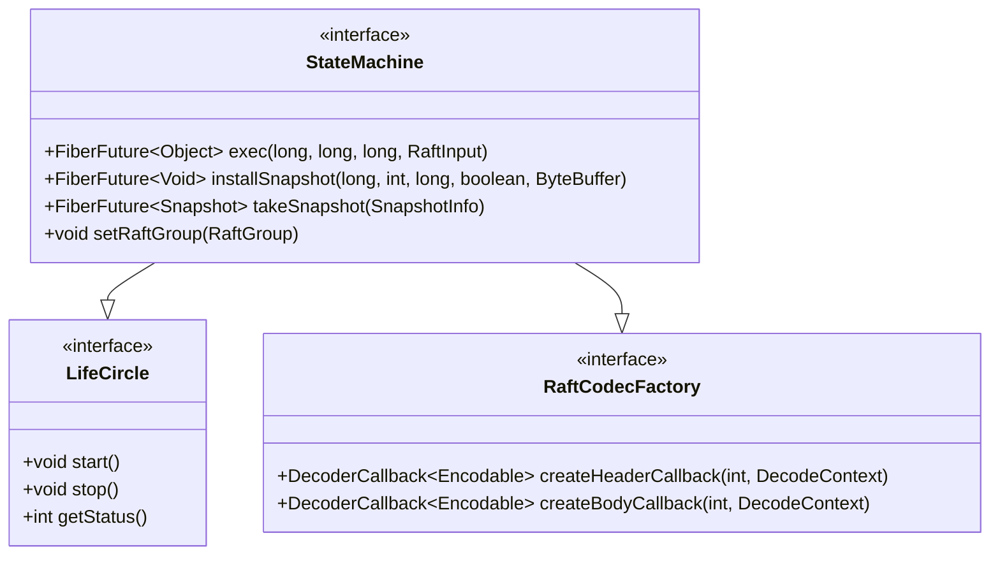
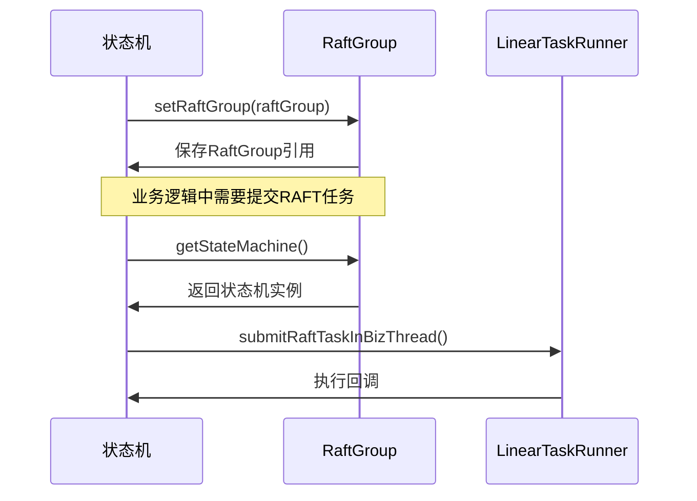

# 自定义状态机

<cite>
**本文档引用的文件**  
- [StateMachine.java](file://server/src/main/java/com/github/dtprj/dongting/raft/sm/StateMachine.java)
- [Snapshot.java](file://server/src/main/java/com/github/dtprj/dongting/raft/sm/Snapshot.java)
- [SnapshotInfo.java](file://server/src/main/java/com/github/dtprj/dongting/raft/sm/SnapshotInfo.java)
- [DtKV.java](file://server/src/main/java/com/github/dtprj/dongting/dtkv/server/DtKV.java)
- [KvSnapshot.java](file://server/src/main/java/com/github/dtprj/dongting/dtkv/server/KvSnapshot.java)
- [RaftGroup.java](file://server/src/main/java/com/github/dtprj/dongting/raft/server/RaftGroup.java)
- [RaftGroupImpl.java](file://server/src/main/java/com/github/dtprj/dongting/raft/impl/RaftGroupImpl.java)
</cite>

## 目录
1. [引言](#引言)
2. [接口契约与线程模型约束](#接口契约与线程模型约束)
3. [核心方法详解](#核心方法详解)
4. [setRaftGroup方法与上下文获取](#setraftgroup方法与上下文获取)
5. [Fiber协程模型下的异步处理](#fiber协程模型下的异步处理)
6. [完整实现示例](#完整实现示例)
7. [常见错误与性能优化](#常见错误与性能优化)
8. [异常处理机制](#异常处理机制)
9. [结论](#结论)

## 引言
在Dongting分布式系统中，自定义状态机是实现RAFT一致性协议的核心组件。状态机负责处理业务逻辑的输入、维护系统状态，并通过快照机制实现状态的持久化和恢复。本文档详细阐述了`StateMachine`接口中`exec`、`installSnapshot`、`takeSnapshot`三个核心方法的作用与调用时机，结合Fiber协程模型说明了异步操作的正确处理方式，并提供了一个完整的实现示例。文档还涵盖了`setRaftGroup`方法的用途、常见实现错误及性能优化建议，旨在为开发者提供一份全面的自定义状态机实现指南。

## 接口契约与线程模型约束
`StateMachine`接口定义了状态机必须实现的核心契约，所有方法（除`createEncoder`/`createDecoder`外）均在RAFT线程中被调用，这保证了状态变更的线性一致性。接口继承自`LifeCircle`和`RaftCodecFactory`，表明状态机具有生命周期管理能力，并能为RAFT消息创建编解码器。

状态机的线程模型严格遵循RAFT协议的单线程应用日志原则。所有对状态机的修改操作（`exec`和`installSnapshot`）都由RAFT线程串行执行，避免了并发修改带来的状态不一致问题。而`takeSnapshot`虽然在RAFT线程启动，但其读取操作可以在其他线程进行，以减少对主流程的阻塞。



**图示来源**
- [StateMachine.java](file://server/src/main/java/com/github/dtprj/dongting/raft/sm/StateMachine.java#L48)

## 核心方法详解

### exec方法
`exec`方法是状态机处理业务逻辑的核心入口。当RAFT日志被提交后，RAFT线程会调用此方法，将日志条目中的命令应用到状态机上。该方法接收四个参数：`index`（日志索引）、`leaderCreateTimeMillis`（领导者创建日志的时间戳）、`localCreateNanos`（本地创建日志的时间戳）和`RaftInput`（包含业务类型和具体数据的输入对象）。

此方法的调用时机是在日志条目被多数节点确认并提交后。它必须是幂等的，因为RAFT协议可能因网络问题而重发已提交的日志。方法返回一个`FiberFuture<Object>`，允许以异步方式完成执行，这对于执行耗时的IO操作至关重要。

**实现要点**：
- 方法必须在RAFT线程中同步或异步执行。
- 需要根据`RaftInput`中的`bizType`分发到不同的业务处理器。
- 返回的结果将作为`RaftCallback`的`success`回调参数。

**代码路径**
- [DtKV.java](file://server/src/main/java/com/github/dtprj/dongting/dtkv/server/DtKV.java#L146-L158)

### installSnapshot方法
`installSnapshot`方法用于在节点启动或严重落后时，通过安装快照来快速同步状态。当一个跟随者节点的日志与领导者差距过大时，领导者会直接发送整个状态快照，而不是逐条发送日志。

该方法的调用时机由RAFT协议自动触发。当节点检测到需要安装快照时（例如，`raftStatus.installSnapshot`被标记为`true`），会调用此方法。方法参数包括`lastIncludeIndex`（快照包含的最后日志索引）、`lastIncludeTerm`（对应的任期）、`offset`（数据块在快照中的偏移量）、`done`（是否是最后一个数据块）和`data`（当前数据块的字节缓冲区）。

**实现要点**：
- 必须处理分块传输，`offset`和`done`用于标识数据流的开始和结束。
- 在`offset == 0`时，应重置状态机的内部状态。
- 在`done == true`时，应完成状态机的更新并清理临时资源。

**代码路径**
- [DtKV.java](file://server/src/main/java/com/github/dtprj/dongting/dtkv/server/DtKV.java#L270-L294)

### takeSnapshot方法
`takeSnapshot`方法用于生成当前状态的快照，以防止日志无限增长。当系统状态达到一定条件（如日志条目数超过阈值）时，会触发此方法。

该方法的调用时机由`SnapshotManager`根据配置策略决定。它接收一个`SnapshotInfo`对象，其中包含了快照的基本信息，如`lastIncludedIndex`和`lastIncludedTerm`。方法返回一个`FiberFuture<Snapshot>`，表示快照生成过程的异步结果。

**实现要点**：
- 必须返回一个实现了`readNext`方法的`Snapshot`对象，用于分块读取快照数据。
- 实现应避免阻塞RAFT线程，通常通过异步任务在后台线程中生成快照。
- 快照生成过程中应能响应取消请求，以支持高优先级操作。

**代码路径**
- [DtKV.java](file://server/src/main/java/com/github/dtprj/dongting/dtkv/server/DtKV.java#L296-L312)

## setRaftGroup方法与上下文获取
`setRaftGroup`方法用于将状态机与特定的RAFT组实例关联起来。此方法在状态机初始化阶段由RAFT框架调用，允许状态机获取`RaftGroup`上下文信息，从而访问RAFT协议的运行时状态和功能。

通过`RaftGroup`接口，状态机可以获取以下关键信息：
- `getGroupId()`：获取当前RAFT组的ID。
- `isLeader()`：判断当前节点是否为领导者。
- `getStateMachine()`：获取状态机自身实例。

在`DtKV`的实现中，`setRaftGroup`方法将传入的`RaftGroup`转换为`RaftGroupImpl`并保存，以便在后续的业务逻辑（如过期处理）中使用。例如，当需要提交一个过期操作时，状态机可以通过`raftGroup`提交一个RAFT任务，确保该操作被一致性地复制。



**图示来源**
- [DtKV.java](file://server/src/main/java/com/github/dtprj/dongting/dtkv/server/DtKV.java#L142-L144)
- [RaftGroupImpl.java](file://server/src/main/java/com/github/dtprj/dongting/raft/impl/RaftGroupImpl.java#L79)

**代码路径**
- [DtKV.java](file://server/src/main/java/com/github/dtprj/dongting/dtkv/server/DtKV.java#L142-L144)

## Fiber协程模型下的异步处理
Dongting框架采用Fiber协程模型来处理异步操作，这在状态机的实现中尤为重要。`exec`、`installSnapshot`和`takeSnapshot`方法都返回`FiberFuture`，允许操作在后台线程中异步执行，而不会阻塞关键的RAFT线程。

在`DtKV`的`exec`方法中，如果配置了`useSeparateExecutor`，则会将实际的执行逻辑提交到一个独立的执行器中，通过`FiberFuture`的`fireComplete`或`fireCompleteExceptionally`来通知结果。这种方式将耗时的业务逻辑与RAFT协议的核心流程解耦，极大地提升了系统的吞吐量和响应性。

**异步处理的关键点**：
- 使用`dtkvExecutor.submitTaskInFiberThread()`将任务提交到Fiber线程池。
- 通过`FiberFuture`的回调机制，确保结果能正确地传递回RAFT线程。
- 避免在Fiber线程中执行长时间的阻塞IO，应使用异步IO或进一步拆分任务。

**代码路径**
- [DtKV.java](file://server/src/main/java/com/github/dtprj/dongting/dtkv/server/DtKV.java#L146-L158)

## 完整实现示例
以下是一个基于`DtKV`的自定义状态机实现的核心逻辑示例：

```java
public class CustomStateMachine extends AbstractLifeCircle implements StateMachine {
    private final DtKVExecutor executor;
    private final FiberGroup fiberGroup;
    private volatile KvStatus kvStatus;
    private RaftGroupImpl raftGroup;

    @Override
    public void setRaftGroup(RaftGroup raftGroup) {
        this.raftGroup = (RaftGroupImpl) raftGroup;
    }

    @Override
    public FiberFuture<Object> exec(long index, long leaderCreateTimeMillis, 
                                   long localCreateNanos, RaftInput input) {
        FiberFuture<Object> future = fiberGroup.newFuture("exec");
        executor.submitTaskInFiberThread(future, () -> {
            try {
                Object result = processCommand(index, input);
                future.fireComplete(result);
            } catch (Exception e) {
                future.fireCompleteExceptionally(e);
            }
        });
        return future;
    }

    @Override
    public FiberFuture<Void> installSnapshot(long lastIncludeIndex, int lastIncludeTerm, 
                                            long offset, boolean done, ByteBuffer data) {
        FiberFuture<Void> future = fiberGroup.newFuture("install-snapshot");
        executor.submitTaskInFiberThread(future, () -> {
            try {
                applySnapshotChunk(offset, data, done);
                future.fireComplete(null);
            } catch (Exception e) {
                future.fireCompleteExceptionally(e);
            }
        });
        return future;
    }

    @Override
    public FiberFuture<Snapshot> takeSnapshot(SnapshotInfo si) {
        FiberFuture<Snapshot> future = fiberGroup.newFuture("take-snapshot");
        executor.submitTaskInFiberThread(future, () -> {
            try {
                Snapshot snapshot = createSnapshot(si);
                future.fireComplete(snapshot);
            } catch (Exception e) {
                future.fireCompleteExceptionally(e);
            }
        });
        return future;
    }
}
```

**代码路径**
- [DtKV.java](file://server/src/main/java/com/github/dtprj/dongting/dtkv/server/DtKV.java)

## 常见错误与性能优化

### 常见实现错误
1. **阻塞操作**：在`exec`或`installSnapshot`中执行同步的网络或文件IO，会阻塞RAFT线程，导致整个集群性能下降甚至超时。
2. **状态不一致**：未正确处理`installSnapshot`的分块传输，或在快照安装过程中未正确重置状态，导致状态机进入不一致状态。
3. **忽略取消请求**：在`takeSnapshot`的实现中，未检查`cancel`标志，导致无法及时响应高优先级操作。

### 性能优化建议
1. **使用分离执行器**：通过`KvConfig.useSeparateExecutor`配置，将业务逻辑执行与RAFT线程分离，避免相互影响。
2. **高效快照生成**：`KvSnapshot`通过迭代器模式分块生成快照，避免一次性加载全部数据到内存，减少内存压力。
3. **垃圾回收优化**：`DtKV`实现了基于快照的垃圾回收机制，当旧快照关闭时，会自动清理不再需要的历史版本，有效控制内存增长。

**代码路径**
- [DtKV.java](file://server/src/main/java/com/github/dtprj/dongting/dtkv/server/DtKV.java#L100-L122)
- [KvSnapshot.java](file://server/src/main/java/com/github/dtprj/dongting/dtkv/server/KvSnapshot.java)

## 异常处理机制
状态机的异常处理是保证系统健壮性的关键。所有方法都应捕获并处理可能的异常，通过`FiberFuture`的`fireCompleteExceptionally`将异常传递给调用方。

在`DtKV`的实现中，`exec0`方法捕获所有异常，并将其包装为`FiberFuture`的失败结果。对于致命错误（如`DtBugException`），应记录错误日志并终止状态机。对于可恢复的错误（如业务逻辑异常），应通过`RaftCallback`的`fail`方法通知上层应用。

**代码路径**
- [DtKV.java](file://server/src/main/java/com/github/dtprj/dongting/dtkv/server/DtKV.java#L159-L167)

## 结论
本文档详细阐述了Dongting框架中自定义状态机的实现原理和最佳实践。通过深入分析`StateMachine`接口的三个核心方法，结合Fiber协程模型的异步处理机制，开发者可以构建出高性能、高可靠的状态机实现。关键在于理解RAFT协议的线程模型约束，正确处理快照的安装与生成，并利用分离执行器避免阻塞关键路径。遵循本文档的指导，可以有效避免常见错误，实现一个既符合RAFT一致性要求，又能满足业务性能需求的自定义状态机。