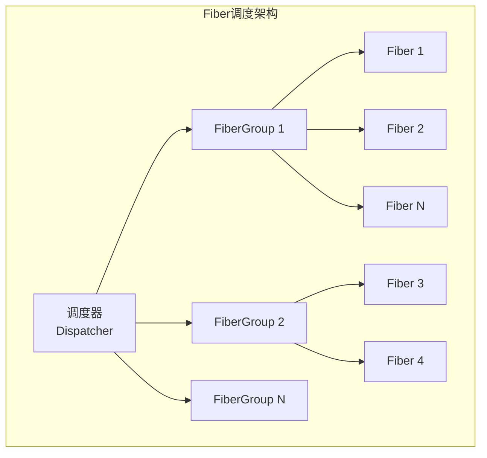
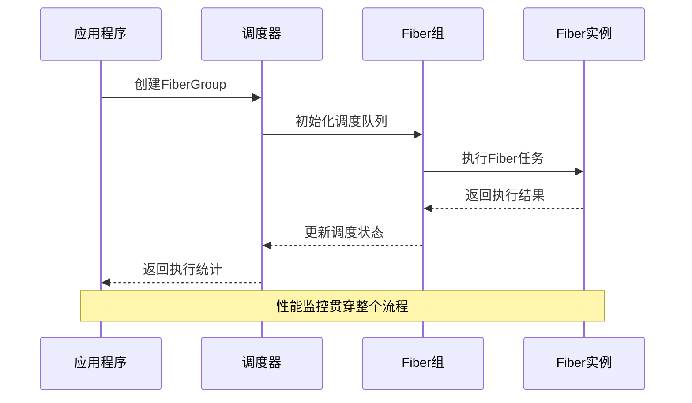
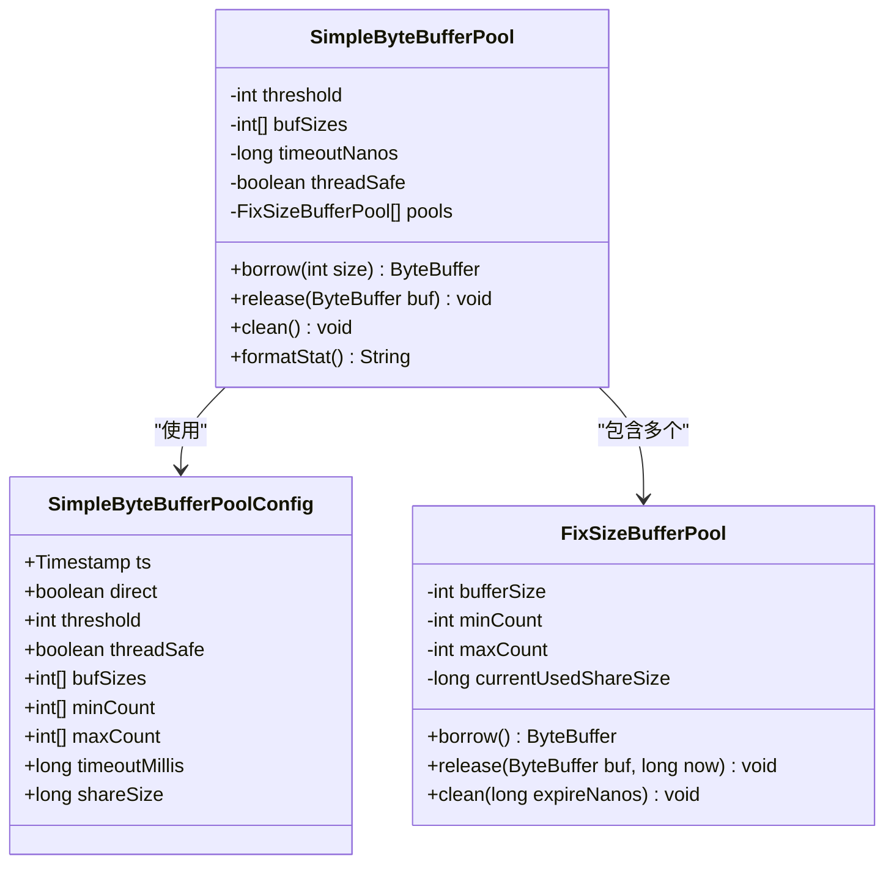
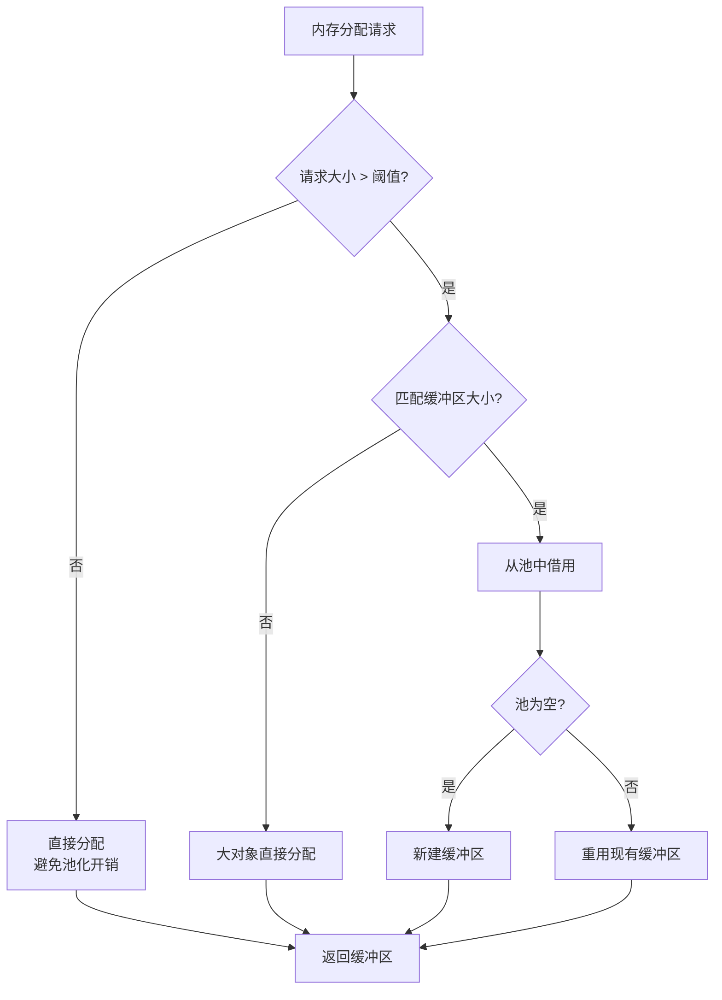
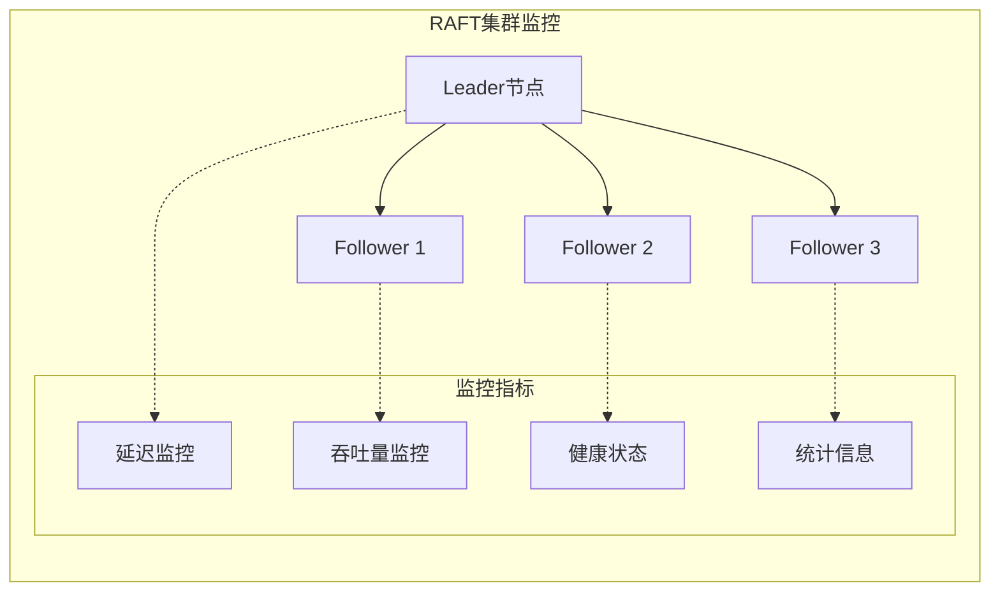
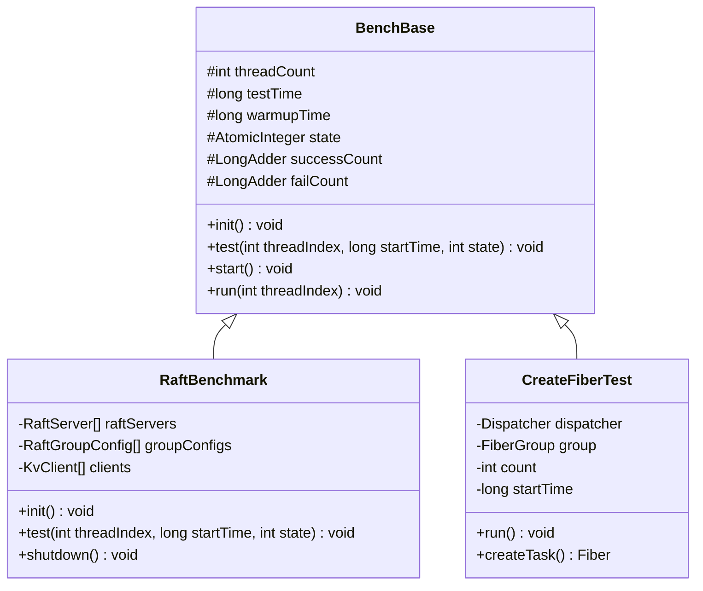
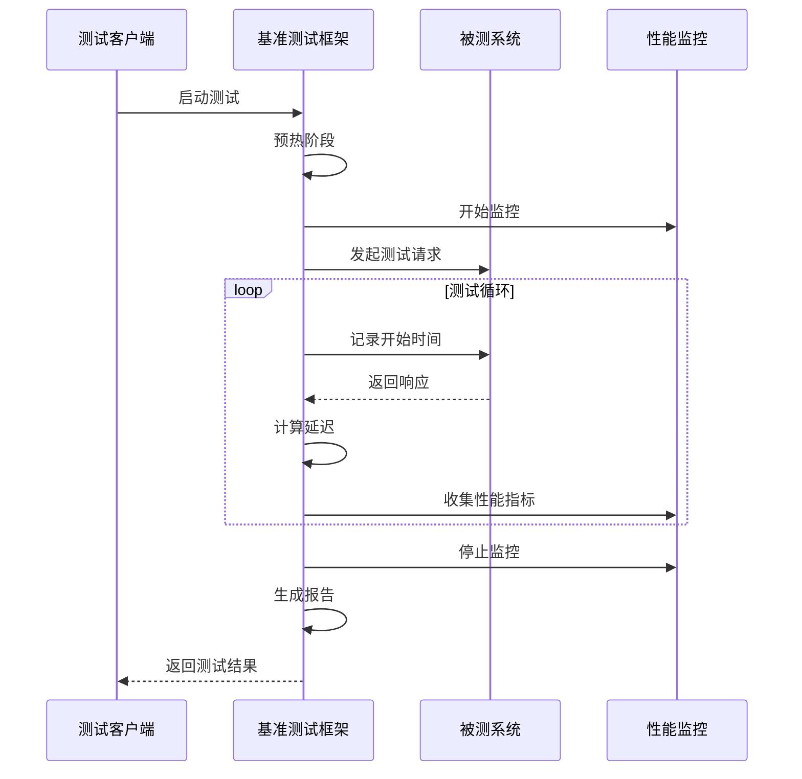

# 性能调优指南

<cite>
**本文档中引用的文件**
- [2023_07_26_dongting线程模型.txt](file://devlogs/2023_07_26_dongting线程模型.txt)
- [2023_07_28_dongting的对象池.txt](file://devlogs/2023_07_28_dongting的对象池.txt)
- [FiberGroup.java](file://server/src/main/java/com/github/dtprj/dongting/fiber/FiberGroup.java)
- [Dispatcher.java](file://server/src/main/java/com/github/dtprj/dongting/fiber/Dispatcher.java)
- [SimpleByteBufferPool.java](file://client/src/main/java/com/github/dtprj/dongting/buf/SimpleByteBufferPool.java)
- [SimpleByteBufferPoolConfig.java](file://client/src/main/java/com/github/dtprj/dongting/buf/SimpleByteBufferPoolConfig.java)
- [RaftServerConfig.java](file://server/src/main/java/com/github/dtprj/dongting/raft/server/RaftServerConfig.java)
- [RaftBenchmark.java](file://benchmark/src/main/java/com/github/dtprj/dongting/bench/raft/RaftBenchmark.java)
- [BenchBase.java](file://benchmark/src/main/java/com/github/dtprj/dongting/bench/common/BenchBase.java)
- [CreateFiberTest.java](file://benchmark/src/main/java/com/github/dtprj/dongting/bench/fiber/CreateFiberTest.java)
- [IoTest.java](file://benchmark/src/main/java/com/github/dtprj/dongting/bench/io/IoTest.java)
- [DispatcherThread.java](file://server/src/main/java/com/github/dtprj/dongting/fiber/DispatcherThread.java)
</cite>

## 目录
1. [简介](#简介)
2. [Fiber调度机制调优](#fiber调度机制调优)
3. [对象池配置调优](#对象池配置调优)
4. [RAFT参数调优](#raft参数调优)
5. [基准测试方法论](#基准测试方法论)
6. [性能监控与观测](#性能监控与观测)
7. [最佳实践建议](#最佳实践建议)
8. [故障排除指南](#故障排除指南)
9. [总结](#总结)

## 简介

Dongting是一个高性能的分布式系统框架，采用了创新的Fiber调度机制和对象池技术。本指南旨在帮助开发者深入了解Dongting的性能特性，并提供实用的调优建议，以充分发挥系统的性能潜力。

Dongting的核心设计理念是减少多线程竞争开销，采用单线程模式处理大部分数据操作。这种设计使得系统在高并发场景下能够保持良好的性能表现，但也需要开发者理解其特定的调优策略。

## Fiber调度机制调优

### FiberGroup大小配置

Fiber调度器是Dongting性能的核心组件之一。正确配置FiberGroup大小对于最大化系统性能至关重要。



**图表来源**
- [FiberGroup.java](file://server/src/main/java/com/github/dtprj/dongting/fiber/FiberGroup.java#L1-L50)
- [Dispatcher.java](file://server/src/main/java/com/github/dtprj/dongting/fiber/Dispatcher.java#L1-L100)

#### CPU核心数匹配策略

根据Dongting的设计理念，FiberGroup的数量应该与CPU核心数相匹配，但需要考虑以下因素：

1. **I/O密集型应用**：可以适当增加FiberGroup数量
2. **CPU密集型应用**：保持与核心数一致
3. **混合型应用**：根据工作负载特征动态调整

```java
// 推荐的FiberGroup配置方式
int cpuCores = Runtime.getRuntime().availableProcessors();
String dispatcherName = "main-dispatcher";
Dispatcher dispatcher = new Dispatcher(dispatcherName);

// 根据应用类型调整FiberGroup数量
int fiberGroupCount = Math.max(cpuCores, 4); // 最小4个，避免资源浪费
```

#### 调度器性能监控



**图表来源**
- [Dispatcher.java](file://server/src/main/java/com/github/dtprj/dongting/fiber/Dispatcher.java#L200-L300)
- [FiberGroup.java](file://server/src/main/java/com/github/dtprj/dongting/fiber/FiberGroup.java#L100-L200)

**章节来源**
- [2023_07_26_dongting线程模型.txt](file://devlogs/2023_07_26_dongting线程模型.txt#L1-L15)
- [FiberGroup.java](file://server/src/main/java/com/github/dtprj/dongting/fiber/FiberGroup.java#L1-L100)

### Fiber调度性能指标

关键性能指标包括：
- **Fiber切换延迟**：毫微秒级
- **调度队列深度**：影响响应时间
- **并发Fiber数量**：系统承载能力
- **内存使用效率**：垃圾回收压力

## 对象池配置调优

### ByteBufferPool配置参数

Dongting提供了多种对象池实现，其中SimpleByteBufferPool是最常用的配置选项。



**图表来源**
- [SimpleByteBufferPool.java](file://client/src/main/java/com/github/dtprj/dongting/buf/SimpleByteBufferPool.java#L1-L100)
- [SimpleByteBufferPoolConfig.java](file://client/src/main/java/com/github/dtprj/dongting/buf/SimpleByteBufferPoolConfig.java#L1-L50)

#### 初始大小配置

默认的缓冲区大小配置针对典型应用场景进行了优化：

```java
// 默认缓冲区大小配置
public static final int[] DEFAULT_BUF_SIZE = new int[]{
    1024, 2048, 4096, 8192, 16 * 1024, 32 * 1024, 64 * 1024, 
    128 * 1024, 256 * 1024, 512 * 1024, 1024 * 1024, 2 * 1024 * 1024, 4 * 1024 * 1024
};

// 默认最大容量配置
public static final int[] DEFAULT_MAX_COUNT = new int[]{
    1024, 512, 256, 128, 128, 128, 128, 64, 64, 32, 16, 8, 4
};
```

#### GC压力与吞吐量平衡

对象池配置需要在GC压力和吞吐量之间找到平衡：

1. **小对象池**：减少内存碎片，降低GC频率
2. **大对象池**：提高内存利用率，减少分配开销
3. **线程安全**：在多线程环境下启用，但会增加锁竞争

```java
// 针对不同场景的配置示例

// 高吞吐量场景：启用线程安全，增加池容量
SimpleByteBufferPoolConfig highThroughputConfig = new SimpleByteBufferPoolConfig();
highThroughputConfig.setThreadSafe(true);
highThroughputConfig.setTimeoutMillis(30000); // 增加清理间隔

// 低延迟场景：禁用线程安全，快速回收
SimpleByteBufferPoolConfig lowLatencyConfig = new SimpleByteBufferPoolConfig();
lowLatencyConfig.setThreadSafe(false);
lowLatencyConfig.setTimeoutMillis(5000); // 减少清理间隔
```

#### 内存使用优化



**图表来源**
- [SimpleByteBufferPool.java](file://client/src/main/java/com/github/dtprj/dongting/buf/SimpleByteBufferPool.java#L150-L200)

**章节来源**
- [2023_07_28_dongting的对象池.txt](file://devlogs/2023_07_28_dongting的对象池.txt#L1-L10)
- [SimpleByteBufferPool.java](file://client/src/main/java/com/github/dtprj/dongting/buf/SimpleByteBufferPool.java#L1-L200)

## RAFT参数调优

### 心跳间隔与选举超时

RAFT算法的性能调优主要集中在以下几个参数上：

```java
// RAFT服务器配置示例
RaftServerConfig serverConfig = new RaftServerConfig();
serverConfig.electTimeout = 3000;      // 选举超时时间（毫秒）
serverConfig.rpcTimeout = 5000;        // RPC超时时间
serverConfig.connectTimeout = 2000;    // 连接超时时间
serverConfig.heartbeatInterval = 1000; // 心跳间隔（毫秒）
```

#### 参数调优策略

1. **网络延迟敏感型应用**：
   ```java
   serverConfig.heartbeatInterval = 500;  // 更频繁的心跳
   serverConfig.electTimeout = 1500;      // 较短的选举超时
   ```

2. **吞吐量优先型应用**：
   ```java
   serverConfig.heartbeatInterval = 2000; // 较少的心跳频率
   serverConfig.electTimeout = 5000;      // 较长的选举超时
   ```

3. **可靠性优先型应用**：
   ```java
   serverConfig.heartbeatInterval = 1000; // 标准心跳间隔
   serverConfig.electTimeout = 3000;      // 平衡的选举超时
   ```

### RAFT性能监控



**图表来源**
- [RaftBenchmark.java](file://benchmark/src/main/java/com/github/dtprj/dongting/bench/raft/RaftBenchmark.java#L50-L100)

**章节来源**
- [RaftServerConfig.java](file://server/src/main/java/com/github/dtprj/dongting/raft/server/RaftServerConfig.java#L1-L38)
- [RaftBenchmark.java](file://benchmark/src/main/java/com/github/dtprj/dongting/bench/raft/RaftBenchmark.java#L1-L100)

## 基准测试方法论

### Benchmark框架使用

Dongting提供了完整的基准测试框架，支持多种性能测试场景。



**图表来源**
- [BenchBase.java](file://benchmark/src/main/java/com/github/dtprj/dongting/bench/common/BenchBase.java#L1-L50)
- [RaftBenchmark.java](file://benchmark/src/main/java/com/github/dtprj/dongting/bench/raft/RaftBenchmark.java#L1-L50)

#### 基准测试配置

```java
// 基准测试基础配置
public class PerformanceBenchmark extends BenchBase {
    private static final int THREAD_COUNT = 16;      // 测试线程数
    private static final long TEST_TIME = 30000;     // 测试持续时间（毫秒）
    private static final long WARMUP_TIME = 5000;    // 预热时间（毫秒）
    
    public PerformanceBenchmark() {
        super(THREAD_COUNT, TEST_TIME, WARMUP_TIME);
    }
    
    @Override
    public void init() throws Exception {
        // 初始化测试环境
        // 包括创建必要的服务实例和连接
    }
    
    @Override
    public void test(int threadIndex, long startTime, int state) {
        // 实际的性能测试逻辑
        // 在这里执行具体的测试操作
    }
}
```

#### 性能指标收集

基准测试框架自动收集以下关键指标：

1. **吞吐量指标**：
   - 每秒操作数（OPS）
   - 成功率和失败率
   - 平均响应时间

2. **延迟指标**：
   - 最大响应时间
   - 平均响应时间
   - 响应时间分布

3. **系统资源指标**：
   - CPU使用率
   - 内存使用情况
   - 网络I/O统计



**图表来源**
- [BenchBase.java](file://benchmark/src/main/java/com/github/dtprj/dongting/bench/common/BenchBase.java#L80-L120)

**章节来源**
- [BenchBase.java](file://benchmark/src/main/java/com/github/dtprj/dongting/bench/common/BenchBase.java#L1-L153)
- [CreateFiberTest.java](file://benchmark/src/main/java/com/github/dtprj/dongting/bench/fiber/CreateFiberTest.java#L1-L112)

## 性能监控与观测

### 内置监控工具

Dongting提供了丰富的性能监控功能，包括：

1. **Fiber调度监控**：
   - Fiber组状态信息
   - 调度队列深度
   - 执行时间统计

2. **对象池监控**：
   - 缓冲区借用/释放统计
   - 命中率分析
   - 内存使用情况

3. **网络I/O监控**：
   - 连接状态跟踪
   - 数据传输统计
   - 错误率监控

### 自定义监控回调

```java
// 自定义性能回调实现
public class CustomPerfCallback extends PerfCallback {
    @Override
    public boolean accept(int perfType) {
        // 根据性能类型决定是否记录
        return perfType == PerfConsts.NET_IO_READ;
    }
    
    @Override
    public void onEvent(int perfType, long costTime, int count, long sum) {
        // 处理性能事件
        System.out.printf("Type: %d, Cost: %dns, Count: %d, Sum: %d%n",
            perfType, costTime, count, sum);
    }
}
```

## 最佳实践建议

### 系统级调优

1. **JVM参数优化**：
   ```bash
   # 推荐的JVM参数配置
   -XX:+UseG1GC
   -XX:MaxGCPauseMillis=200
   -XX:G1HeapRegionSize=16m
   -Xms4g -Xmx4g
   -XX:+UnlockExperimentalVMOptions
   -XX:+UseFPUForSpilling
   ```

2. **操作系统优化**：
   - 调整文件描述符限制
   - 优化网络栈参数
   - 配置NUMA亲和性

3. **网络配置优化**：
   ```java
   // 网络配置示例
   NioServerConfig serverConfig = new NioServerConfig();
   serverConfig.workerCount = Runtime.getRuntime().availableProcessors();
   serverConfig.soBacklog = 1024;
   serverConfig.tcpNoDelay = true;
   ```

### 应用级调优

1. **Fiber使用最佳实践**：
   - 避免长时间阻塞操作
   - 合理使用yield和sleep
   - 及时释放不需要的Fiber

2. **对象池使用建议**：
   - 根据实际需求调整池大小
   - 定期监控池使用情况
   - 及时清理过期对象

3. **RAFT集群优化**：
   - 保持合理的节点数量（3-5个）
   - 优化网络拓扑
   - 监控集群健康状态

## 故障排除指南

### 常见性能问题

1. **Fiber调度延迟过高**：
   - 检查FiberGroup配置
   - 分析Fiber执行时间
   - 优化Fiber任务粒度

2. **内存泄漏问题**：
   - 监控对象池使用情况
   - 检查ByteBuffer释放
   - 分析内存分配模式

3. **网络性能问题**：
   - 检查连接池配置
   - 优化数据包大小
   - 监控网络延迟

### 调试工具使用

```java
// Fiber调试工具
public class FiberDebugger {
    public static void dumpGroupInfo(FiberGroup group) {
        group.fireLogGroupInfo("Current Fiber Group State");
    }
    
    public static void monitorPool(ByteBufferPool pool) {
        if (pool instanceof SimpleByteBufferPool) {
            System.out.println(((SimpleByteBufferPool) pool).formatStat());
        }
    }
}
```

## 总结

Dongting的性能调优涉及多个层面，从Fiber调度机制到对象池配置，从RAFF参数调优到基准测试方法。成功的性能调优需要：

1. **深入理解系统架构**：掌握Dongting的设计理念和实现细节
2. **全面的监控体系**：建立完善的性能监控和告警机制
3. **持续的调优迭代**：根据实际负载和业务特点不断优化
4. **理论与实践结合**：将理论知识与实际经验相结合

通过遵循本指南的建议和最佳实践，开发者可以充分发挥Dongting的性能潜力，构建高效可靠的分布式系统。