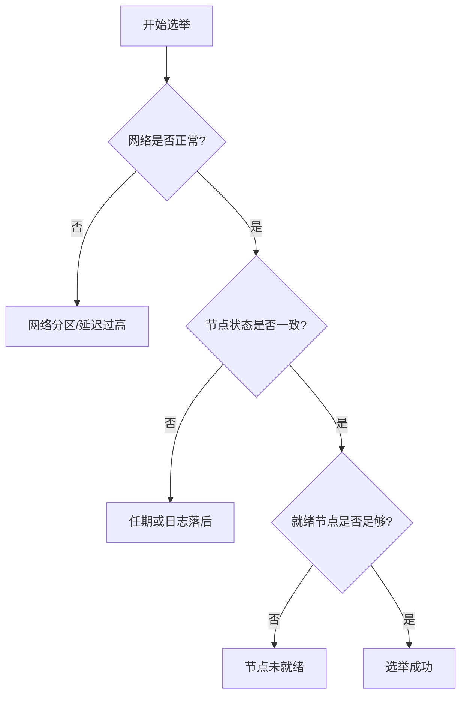
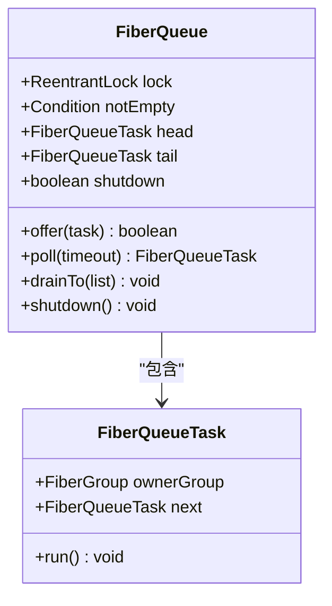
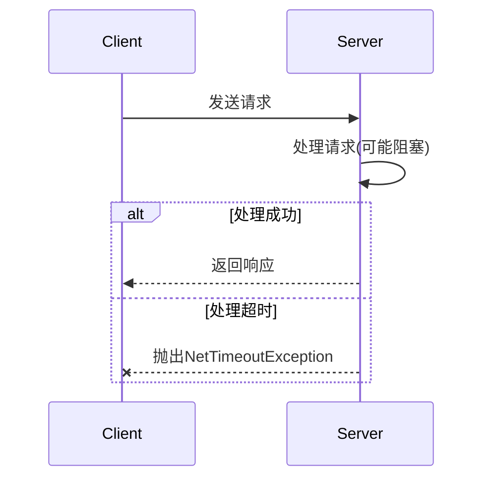
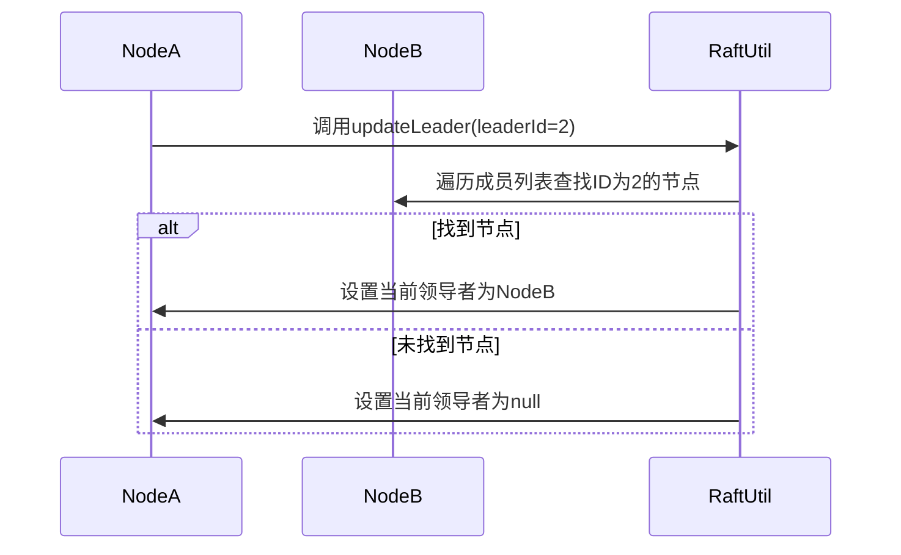

# 故障排查

<cite>
**本文档中引用的文件**  
- [RaftUtil.java](file://server/src/main/java/com/github/dtprj/dongting/raft/impl/RaftUtil.java)
- [VoteManager.java](file://server/src/main/java/com/github/dtprj/dongting/raft/impl/VoteManager.java)
- [FiberQueue.java](file://server/src/main/java/com/github/dtprj/dongting/fiber/FiberQueue.java)
- [NetTimeoutException.java](file://client/src/main/java/com/github/dtprj/dongting/net/NetTimeoutException.java)
- [RaftTimeoutException.java](file://client/src/main/java/com/github/dtprj/dongting/raft/RaftTimeoutException.java)
- [DtLogs.java](file://client/src/main/java/com/github/dtprj/dongting/log/DtLogs.java)
- [PerfConsts.java](file://client/src/main/java/com/github/dtprj/dongting/common/PerfConsts.java)
- [TimeoutTest.java](file://client/src/test/java/com/github/dtprj/dongting/net/TimeoutTest.java)
- [FiberQueueTest.java](file://server/src/test/java/com/github/dtprj/dongting/fiber/FiberQueueTest.java)
- [RaftUtilTest.java](file://server/src/test/java/com/github/dtprj/dongting/raft/impl/RaftUtilTest.java)
</cite>

## 目录
1. [引言](#引言)
2. [常见问题模式分析](#常见问题模式分析)
3. [日志分析与错误码识别](#日志分析与错误码识别)
4. [诊断工具与监控建议](#诊断工具与监控建议)
5. [集群状态一致性检查](#集群状态一致性检查)
6. [典型故障解决步骤](#典型故障解决步骤)
7. [恢复流程](#恢复流程)
8. [附录](#附录)

## 引言

本故障排查手册旨在为Dongting分布式系统提供全面的故障诊断与恢复指导。系统基于RAFT共识算法和Fiber协程模型构建，具备高并发、低延迟的特点。在实际运行中，可能会遇到RAFT选举失败、Fiber阻塞、网络连接超时等典型问题。本手册将系统性地总结这些问题的模式，指导用户如何通过日志（DtLogs）分析问题根源，识别关键错误码和状态转换，并提供相应的诊断工具建议和解决步骤。

**Section sources**
- [RaftUtil.java](file://server/src/main/java/com/github/dtprj/dongting/raft/impl/RaftUtil.java#L0-L366)
- [VoteManager.java](file://server/src/main/java/com/github/dtprj/dongting/raft/impl/VoteManager.java#L0-L500)

## 常见问题模式分析

### RAFT选举失败

RAFT选举失败是分布式系统中最常见的问题之一。根据代码分析，其根本原因通常包括：

1.  **网络分区或延迟过高**：当节点间的网络通信出现故障或延迟超过选举超时时间（`electTimeoutNanos`）时，节点无法收到足够数量的投票响应，导致选举失败。在`VoteManager.java`中，`sleepToNextElectTime()`方法的实现表明，系统依赖于精确的时间同步和低延迟的网络通信。

2.  **节点状态不一致**：候选节点（candidate）的任期（term）或日志索引（log index）落后于其他节点，根据RAFT算法，其他节点将拒绝投票。`VoteManager.sendRequest()`方法在发送投票请求时会携带当前任期和日志信息，如果这些信息过时，选举将失败。

3.  **节点未就绪**：在`VoteManager.startPreVote()`方法中，只有`ready`状态的节点才会被纳入投票范围。如果集群中就绪节点数量不足，无法形成多数派（quorum），选举将无法启动。



**Diagram sources**
- [VoteManager.java](file://server/src/main/java/com/github/dtprj/dongting/raft/impl/VoteManager.java#L158-L179)
- [VoteManager.java](file://server/src/main/java/com/github/dtprj/dongting/raft/impl/VoteManager.java#L262-L289)

### Fiber阻塞

Fiber是Dongting系统中的轻量级协程，用于实现高并发。Fiber阻塞会导致任务积压，影响系统整体性能。

1.  **队列满导致offer失败**：`FiberQueue.java`中的`offer()`方法在队列已满时会抛出`FiberException`。如果生产者速度远大于消费者，队列会迅速填满，导致新的Fiber任务无法提交。
2.  **任务执行时间过长**：单个Fiber任务如果执行了耗时的同步操作（如阻塞IO），会占用调度线程，导致其他Fiber无法被及时调度。
3.  **死锁或无限等待**：Fiber间的同步机制（如`FiberCondition`）如果使用不当，可能导致死锁或无限期等待。



**Diagram sources**
- [FiberQueue.java](file://server/src/main/java/com/github/dtprj/dongting/fiber/FiberQueue.java#L0-L45)
- [FiberQueue.java](file://server/src/main/java/com/github/dtprj/dongting/fiber/FiberQueue.java#L82-L138)

### 网络连接超时

网络连接超时通常发生在客户端与服务器之间，或服务器节点之间。

1.  **连接建立超时**：客户端在指定时间内无法与服务器建立TCP连接。`NioClient.java`中的`waitConnect()`方法会抛出`NetTimeoutException`。
2.  **请求处理超时**：请求已发送，但在指定时间内未收到响应。这可能是由于服务器处理缓慢、网络拥塞或目标节点故障导致。
3.  **资源限制超时**：客户端有`maxOutRequests`和`maxOutBytes`等限制，当待处理的请求数量或字节数达到上限时，新的请求会立即因超时而失败。



**Diagram sources**
- [NioClient.java](file://client/src/main/java/com/github/dtprj/dongting/net/NioClient.java#L114-L143)
- [TimeoutTest.java](file://client/src/test/java/com/github/dtprj/dongting/net/TimeoutTest.java#L30-L73)

## 日志分析与错误码识别

### 使用DtLogs分析问题根源

`DtLogs`是Dongting系统的核心日志框架，通过`DtLogs.getLogger()`获取日志实例。分析日志时应重点关注以下信息：

1.  **日志级别**：`error`级别的日志表示严重错误，必须立即处理；`warn`级别的日志表示潜在问题，需要关注；`info`级别的日志记录了关键的状态转换，是分析问题流程的重要依据。
2.  **日志内容**：日志消息通常包含操作、状态、原因等信息。例如，在`RaftUtil.java`中，`changeToFollower()`方法会记录`"change to follower. term={}, oldRole={}, reason: {}"`，这清晰地表明了角色变更的原因。

**Section sources**
- [DtLogs.java](file://client/src/main/java/com/github/dtprj/dongting/log/DtLogs.java#L0-L20)
- [RaftUtil.java](file://server/src/main/java/com/github/dtprj/dongting/raft/impl/RaftUtil.java#L200-L220)

### 关键错误码和状态转换

| 错误码/状态 | 含义 | 位置 |
| :--- | :--- | :--- |
| `NetTimeoutException` | 网络操作超时 | `client/src/main/java/com/github/dtprj/dongting/net/NetTimeoutException.java` |
| `RaftTimeoutException` | RAFT相关操作超时 | `client/src/main/java/com/github/dtprj/dongting/raft/RaftTimeoutException.java` |
| `RaftRole.leader` | 节点角色为领导者 | `server/src/main/java/com/github/dtprj/dongting/raft/impl/RaftRole.java` |
| `RaftRole.follower` | 节点角色为跟随者 | `server/src/main/java/com/github/dtprj/dongting/raft/impl/RaftRole.java` |
| `voting` | 节点正在进行投票 | `VoteManager.java`中的状态变量 |

**Section sources**
- [NetTimeoutException.java](file://client/src/main/java/com/github/dtprj/dongting/net/NetTimeoutException.java#L0-L30)
- [RaftTimeoutException.java](file://client/src/main/java/com/github/dtprj/dongting/raft/RaftTimeoutException.java#L0-L30)

## 诊断工具与监控建议

### 监控Fiber队列积压

监控Fiber队列的长度是评估系统健康状况的关键。可以通过以下方式实现：

1.  **代码层面**：在`FiberQueue`类中，`hasTask()`方法可以检查特定`FiberGroup`是否有待处理任务。定期调用此方法可以判断任务是否积压。
2.  **性能计数器**：利用`PerfConsts.java`中定义的常量，如`FIBER_D_POLL`和`FIBER_D_WORK`，通过性能回调（`PerfCallback`）收集Fiber调度的延迟和频率，间接反映队列压力。

```mermaid
flowchart LR
A[定时任务] --> B[调用FiberQueue.hasTask()]
B --> C{返回true?}
C --> |是| D[告警: Fiber队列积压]
C --> |否| E[正常]
```

**Diagram sources**
- [FiberQueue.java](file://server/src/main/java/com/github/dtprj/dongting/fiber/FiberQueue.java#L120-L130)
- [PerfConsts.java](file://client/src/main/java/com/github/dtprj/dongting/common/PerfConsts.java#L0-L52)

### 监控RAFT角色变更日志

RAFT角色的频繁变更（如leader反复切换）是系统不稳定的征兆。应配置日志监控系统，对包含`"change to leader"`或`"change to follower"`的关键字进行告警。

**Section sources**
- [RaftUtil.java](file://server/src/main/java/com/github/dtprj/dongting/raft/impl/RaftUtil.java#L250-L270)

### 监控网络IO延迟

网络IO延迟直接影响RAFT选举和数据复制的性能。建议：

1.  **使用`PerfConsts`中的网络性能指标**：如`RPC_D_READ`、`RPC_D_WRITE`、`RPC_D_WORKER_QUEUE`等，这些指标可以精确测量从网络读取、写入到工作线程处理的各个环节的延迟。
2.  **分析`TimeoutTest.java`中的测试用例**：该文件包含了多种超时场景的模拟，可以作为编写监控脚本的参考。

**Section sources**
- [PerfConsts.java](file://client/src/main/java/com/github/dtprj/dongting/common/PerfConsts.java#L0-L52)
- [TimeoutTest.java](file://client/src/test/java/com/github/dtprj/dongting/net/TimeoutTest.java#L30-L73)

## 集群状态一致性检查

### 使用RaftUtil检查集群状态

`RaftUtil.java`提供了多个静态方法来检查和维护集群状态的一致性。

1.  **检查选举状态**：`getElectQuorum(int groupSize)`方法可以计算出形成选举多数派所需的最小节点数。通过比较当前集群大小和该值，可以判断集群是否具备选举能力。
2.  **重置状态**：`resetStatus(RaftStatusImpl raftStatus)`方法会重置节点的任期、领导者信息、复制状态等，用于在角色变更后清理旧状态，保证一致性。
3.  **更新领导者**：`updateLeader(RaftStatusImpl raftStatus, int leaderId)`方法会根据给定的`leaderId`更新当前领导者信息，确保所有节点对领导者有统一的认知。



**Diagram sources**
- [RaftUtil.java](file://server/src/main/java/com/github/dtprj/dongting/raft/impl/RaftUtil.java#L150-L200)
- [RaftUtilTest.java](file://server/src/test/java/com/github/dtprj/dongting/raft/impl/RaftUtilTest.java#L0-L50)

## 典型故障解决步骤

### RAFT选举失败解决步骤

1.  **检查网络连通性**：使用`ping`或`telnet`命令确认所有RAFT节点间的网络是连通的。
2.  **分析日志**：在日志中搜索`"vote timeout"`或`"not valid candidate"`等关键字，确定选举失败的具体原因。
3.  **验证节点配置**：确保所有节点的`groupId`、`nodeId`和`rpcTimeout`等配置项正确且一致。
4.  **重启问题节点**：如果某个节点持续无法参与选举，尝试重启该节点。

**Section sources**
- [VoteManager.java](file://server/src/main/java/com/github/dtprj/dongting/raft/impl/VoteManager.java#L262-L289)

### Fiber阻塞解决步骤

1.  **检查Fiber队列**：通过调试或监控工具检查`FiberQueue`的长度，确认是否存在任务积压。
2.  **分析任务执行时间**：利用`PerfConsts.FIBER_D_WORK`等性能指标，找出执行时间过长的Fiber任务。
3.  **审查代码逻辑**：检查长时间运行的任务，确保其内部没有进行阻塞IO或无限循环。
4.  **优化资源分配**：如果积压是由于资源不足（如CPU），考虑增加系统资源或优化任务调度策略。

**Section sources**
- [FiberQueue.java](file://server/src/main/java/com/github/dtprj/dongting/fiber/FiberQueue.java#L82-L138)
- [FiberQueueTest.java](file://server/src/test/java/com/github/dtprj/dongting/fiber/FiberQueueTest.java#L43-L87)

### 网络连接超时解决步骤

1.  **检查防火墙设置**：确保RAFT节点间通信的端口在防火墙中是开放的。
2.  **验证客户端配置**：检查客户端的`hostPorts`、`nearTimeoutThreshold`等配置是否正确。
3.  **监控网络质量**：使用网络监控工具检查节点间的网络延迟和丢包率。
4.  **调整超时阈值**：在高延迟网络环境中，适当增加`rpcTimeout`和`nearTimeoutThreshold`的值。

**Section sources**
- [NetTimeoutException.java](file://client/src/main/java/com/github/dtprj/dongting/net/NetTimeoutException.java#L0-L30)
- [TimeoutTest.java](file://client/src/test/java/com/github/dtprj/dongting/net/TimeoutTest.java#L112-L148)

## 恢复流程

当系统发生故障并完成修复后，应遵循以下恢复流程：

1.  **逐步启动节点**：首先启动一个节点，确认其能正常运行。然后逐个启动其他节点，避免同时启动导致网络风暴。
2.  **监控选举过程**：在节点启动后，密切监控日志，观察是否能成功选出新的领导者。
3.  **验证数据一致性**：通过查询接口或状态机快照，验证集群的数据是否一致且完整。
4.  **恢复服务**：确认集群稳定运行后，逐步将流量切换回该集群。

**Section sources**
- [RaftUtil.java](file://server/src/main/java/com/github/dtprj/dongting/raft/impl/RaftUtil.java#L250-L270)

## 附录

### 性能指标常量表

| 常量名 | 含义 | 数值 |
| :--- | :--- | :--- |
| `RPC_D_ACQUIRE` | 获取连接耗时 | 1 |
| `RPC_D_WORKER_QUEUE` | 工作线程队列等待耗时 | 2 |
| `FIBER_D_POLL` | Fiber调度器轮询耗时 | 20 |
| `RAFT_D_LOG_SYNC` | 日志同步（fsync）耗时 | 34 |
| `RAFT_D_REPLICATE_RPC` | 数据复制RPC耗时 | 42 |

**Section sources**
- [PerfConsts.java](file://client/src/main/java/com/github/dtprj/dongting/common/PerfConsts.java#L0-L52)